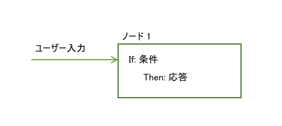
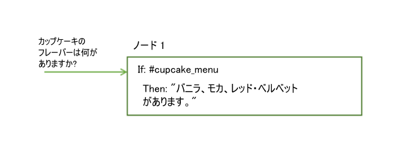
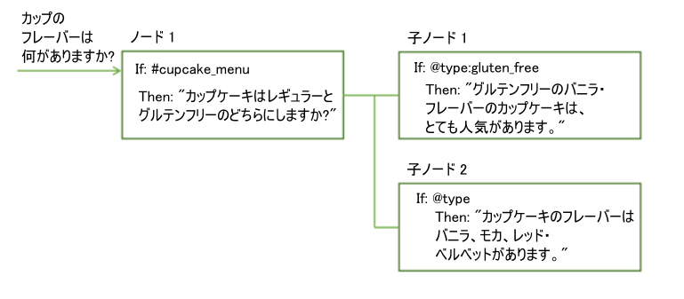
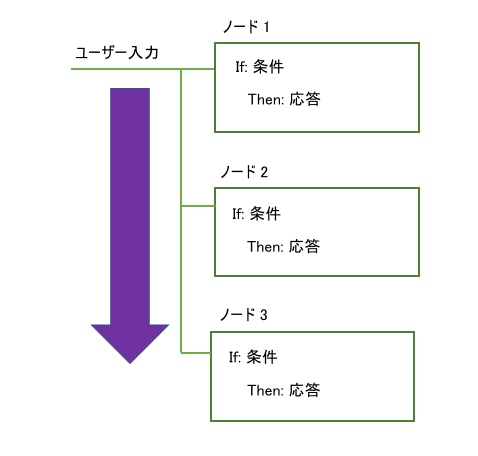
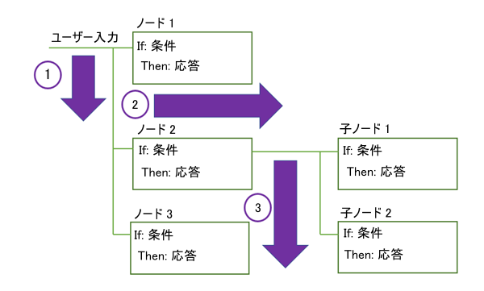
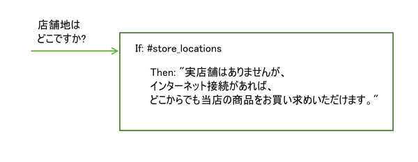
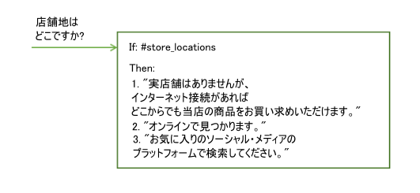
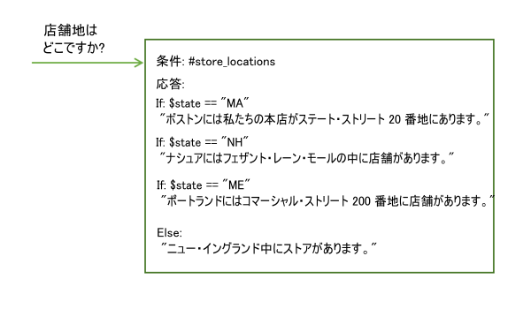

---

copyright:
  years: 2015, 2019
lastupdated: "2019-02-28"

subcollection: assistant

---

{:shortdesc: .shortdesc}
{:new_window: target="_blank"}
{:deprecated: .deprecated}
{:important: .important}
{:note: .note}
{:tip: .tip}
{:pre: .pre}
{:codeblock: .codeblock}
{:screen: .screen}
{:javascript: .ph data-hd-programlang='javascript'}
{:java: .ph data-hd-programlang='java'}
{:python: .ph data-hd-programlang='python'}
{:swift: .ph data-hd-programlang='swift'}
{:table: .aria-labeledby="caption"}

# ダイアログの概要
{: #dialog-overview}

ダイアログでは、ユーザー入力から検出されたインテントに加えてアプリケーションのコンテキストを使用してユーザーと対話し、最終的に有用な応答を返します。
{: shortdesc}

ダイアログは、インテント (ユーザーの発言) と応答 (ボットの回答) をマッチングします。応答は、例えば「`ガソリンスタンドはどこ?`」のような質問に対する回答であったり、ラジオをオンにするなどのコマンドの実行であったりします。 検出されたインテントとエンティティーだけで正しい応答を導出できる場合もあれば、正しく応答するためにダイアログでユーザーに追加入力を求めなければならない場合もあります。 例えば、ユーザーが`「何か食べられる場所を教えて」`と質問した場合は、レストランに行きたいのかそれとも食料品店に行きたいのか、食事をしたいのかそれともテイクアウトしたいのか、などを明確にする必要があります。 テキストによる応答で詳細を尋ね、新たな入力を処理するための子ノードを 1 つ以上作成することができます。

<iframe class="embed-responsive-item" id="youtubeplayer" title="ダイアログの概要" type="text/html" width="640" height="390" src="https://www.youtube.com/embed/XkhAMe9gSFU?rel=0" frameborder="0" webkitallowfullscreen mozallowfullscreen allowfullscreen> </iframe>

注: ビデオの長さは 15 分間です。最初の 5 分では、ノードの追加方法を説明します。

ダイアログは {{site.data.keyword.conversationshort}} ツール内でグラフィカルなツリー構造で表されます。 会話で扱うインテントごとに、インテントを処理するブランチを作成します。 1 つのブランチは複数のノードで構成されます。

## ダイアログ・ノード
{: #dialog-overview-nodes}

各ダイアログ・ノードには、少なくとも 1 つの条件と 1 つの応答が含まれます。



- 条件: ダイアログのこのノードをトリガーするためにユーザー入力に含まれている必要がある情報を指定します。 情報は通常、特定のインテントです。情報は、エンティティー・タイプ、エンティティー値、またはコンテキスト変数値の場合もあります。詳しくは、[条件](#dialog-overview-conditions)を参照してください。
- 応答: サービスがユーザーに応答するために使用する発話。 オプションのイメージまたはリストを表示したり、プログラムによるアクションをトリガーしたりするように、応答を構成することもできます。詳しくは、[応答](#dialog-overview-responses)を参照してください。

ノードは if/then 構造を持つものと見なすことができます。その条件が true であれば、その応答が返されます。

例えば、サービスの自然言語処理機能が、ユーザー入力に `#cupcake-menu` インテントが含まれていることを検出した場合は、次のノードがトリガーされます。 ノードがトリガーされた結果として、サービスは適切な回答を返します。



単純なユーザー要求であれば、条件と応答を 1 つずつ含む 1 つのノードで処理できます。 しかし、多くの場合、ユーザーはより高度な質問をしたり、より複雑な作業のヘルプを求めたりします。 その場合は、サービスに必要な追加情報を提供するようにユーザーに求める子ノードを追加します。



## ダイアログのフロー
{: #dialog-overview-flow}

作成したダイアログを、サービスは、ツリーの最初のノードから最後のノードまで処理します。



サービスはツリーを上から下に処理し、満たされている条件を検出すると、そのノードをトリガーします。 その次は、トリガーされたノードに移動し、子ノードの条件とユーザー入力を照合します。 子ノードをチェックするときにも、最初の子ノードから最後の子ノードまで移動します。

サービスは、ダイアログ・ツリーを最初のノードから最後のノードまでたどります。途中、ノードがトリガーされるたびに、そのノードの最初の子ノードから最後の子ノードまでたどり、また、子ノードがトリガーされるたびに、そのブランチを最後のノードに達するまでたどります。



ダイアログの作成を始めるには、ツリーに含めるブランチとその配置場所を決める必要があります。 ノードは最初から最後まで評価されるので、ブランチの順序が重要です。 入力と一致する条件を持つ最初のルート・ノードが使用されます。つまり、それより後に位置するツリー内のノードはトリガーされません。

サービスがブランチの最後に到達した場合、または、評価対象である現在の子ノードのセットに true と評価される条件がない場合、サービスはツリーの基点にジャンプして戻ります。 そしてもう一度、サービスはルート・ノードを最初から最後まで処理します。 true と評価される条件がまったくない場合は、ツリー内の最後のノードの応答が返されます。このノードは通常、常に true と評価される特殊な `anything_else` 条件を持ちます。

以下の方法で、最初から最後までたどる標準的なフローを中断することができます。

- ノードが処理された後に実行する内容をカスタマイズすることにより。例えば、ノードが処理された後に別のノードに直接ジャンプするように、あるノードを構成すると、ジャンプ先のノードより前に位置する他のノードがツリー内にあっても無視することができます。 詳しくは、[次の処理の定義](#dialog-overview-jump-to)を参照してください。
- 他のノードにジャンプするように条件付き応答を構成することにより。詳しくは、[条件付き応答](#dialog-overview-multiple)を参照してください。
- ダイアログ・ノードの脱線設定を構成することにより。脱線は、実行時にユーザーがノードを移動する方法にも影響する場合があります。ほとんどのノードから脱線できるようにして、戻りを構成した場合、ユーザーは簡単に別のノードにジャンプして戻ることができます。詳しくは、[脱線](/docs/services/assistant?topic=assistant-dialog-runtime#dialog-runtime-digressions)を参照してください。

## 条件
{: #dialog-overview-conditions}

ノード条件により、そのノードを会話で使用するかどうかが決まります。 応答条件により、ユーザーに返す応答が決まります。

- [条件成果物](#dialog-overview-condition-artifacts)
- [特殊な条件](#dialog-overview-special-conditions)
- [条件構文の詳細](#dialog-overview-condition-syntax)

条件に関してさらに拡張された操作を実行するためのヒントは、[条件の使用上のヒント](/docs/services/assistant?topic=assistant-dialog-tips#dialog-tips-condition-usage-tips)を参照してください。

### 条件成果物
{: #dialog-overview-condition-artifacts}

条件を定義するには、次の成果物を 1 つ以上組み合わせて使用します。

- **コンテキスト変数**: ノードは、指定したコンテキスト変数式が true の場合に使用されます。 `$variable_name:value` または `$variable_name == 'value'` という構文を使用します。

  ノード条件では、この成果物タイプは通常、演算子 AND または OR、および別の条件値と共に使用されます。これは、ユーザー入力の中にノードをトリガーする要素が含まれている必要があるためです。コンテキスト変数値が一致しただけでは、ノードをトリガーするために不十分です。例えば、ユーザー入力オブジェクトがコンテキスト変数値を何かの方法で設定する場合などに、ノードがトリガーされます。

  コンテキスト変数値を設定するダイアログ・ノードと同じノードに、そのコンテキスト変数値に基づくノード条件を定義しないでください。
  {: tip}

  応答条件では、この成果物タイプを単独で使用できます。特定のコンテキスト変数値に基づいて応答を変えることができます。例えば、`$city:Boston` は、`$city` コンテキスト変数に値 `Boston` が含まれているかどうかを検査します。 含まれている場合は、応答が返されます。
  
  コンテキスト変数について詳しくは、[コンテキスト変数](/docs/services/assistant?topic=assistant-dialog-runtime#dialog-runtime-context)を参照してください。

- **エンティティー**: ノードは、ユーザー入力でエンティティー値またはシノニムが認識された場合に使用されます。 構文 `@entity_name` を使用します。 例えば、`@city` は、@city エンティティーとして定義されている都市名がユーザー入力に検出されたかどうかを検査します。 検出されている場合は、ノードまたは応答が処理されます。

  エンティティー値もシノニムも認識されないケースを処理するピア・ノードを作成することを検討してください。
  {: tip}

  エンティティーについて詳しくは、[エンティティーの定義](/docs/services/assistant?topic=assistant-entities)を参照してください。

- **エンティティー値**: ノードは、ユーザー入力でエンティティー値が検出された場合に使用されます。 構文 `@entity_name:value` を使用して、シノニムではなく、エンティティーの定義済みの値を指定します。 例えば、`@city:Boston` は特定の都市名 `Boston` がユーザー入力で検出されたかどうかを検査します。

  ピア・ノードで特定の値を指定せずにエンティティーの存在を検査する場合は、必ず、エンティティーの存在のみを検査するピア・ノードより前に、このノード (特定のエンティティー値を検査するノード) を配置してください。 そうしないと、このノードは評価されません。
  {: tip}

  エンティティーがキャプチャー・グループを持つパターン・エンティティーである場合は、特定のグループ値との一致がないかを検査できます。 例えば、`@us_phone.groups[1] == '617'` という構文を使用できます。
  詳しくは、[入力に含まれるパターン・エンティティー・グループの保管と認識](/docs/services/assistant?topic=assistant-dialog-tips#dialog-tips-get-pattern-groups)を参照してください。

- **インテント**: 最も単純な条件は単一のインテントです。 このノードが使用されるのは、サービスの自然言語処理が、ユーザー入力を評価した後に、ユーザー入力の目的が事前定義済みインテントにマップされると判別した場合です。構文 `#intent_name` を使用します。 例えば、`#weather` は、ユーザー入力が天気予報を要求しているかどうかを検査します。要求している場合、`#weather` インテント条件のあるノードが処理されます。

  インテントについて詳しくは、[インテントの定義](/docs/services/assistant?topic=assistant-intents)を参照してください。

- **特殊条件**: 一般的なダイアログ機能を実行できるようにサービスに用意されている条件。 詳しくは、次のセクションにある**特殊な条件**の表を参照してください。

### 特殊な条件
{: #dialog-overview-special-conditions}

| 条件の構文     | 説明 |
|----------------------|-------------|
| `anything_else`      | この条件をダイアログの最後で使用して、ユーザー入力が他のどのダイアログ・ノードとも一致しない場合の処理を実行できます。 この条件により、**Anything else** ノードがトリガーされます。 |
| `conversation_start` | **welcome** と同じく、この条件はダイアログの最初のターンで true と評価されます。 **welcome** とは異なり、アプリケーションからの最初の要求にユーザー入力が含まれているかどうかにかかわらず、true になります。 **conversation_start** 条件を指定したノードを使用して、ダイアログの開始時にコンテキスト変数を初期化したり他のタスクを実行したりできます。 |
| `false`              | この条件は常に false と評価されます。 開発中のブランチの先頭にこれを使用して、そのブランチが使用されないようにしたり、一般的な機能を提供するノードの条件として使用し、そのノードを **Jump to** アクションのターゲットとしてのみ使用するようにしたりできます。 |
| `irrelevant`         | {{site.data.keyword.conversationshort}} サービスがユーザー入力を不適当と判断した場合に、この条件は true と評価されます。 |
| `true`               | この条件は常に true と評価されます。 ノードまたは応答のリストの最後でこれを使用して、それまでの条件と一致しなかったすべての応答をキャッチできます。 |
| `welcome`            | この条件は、アプリケーションからの最初の要求にユーザー入力が含まれていない場合にのみ、ダイアログの最初のターン (ダイアログの開始時) に true と評価されます。 2 ターン目以降では false と評価されます。 この条件により、**Welcome** ノードがトリガーされます。 一般的に、この条件を持つノードはユーザーへのあいさつ文 (例えば、`「ピザ注文アプリへようこそ」` のようなメッセージ) を表示するために使用します。 このノードは、Facebook や Slack などのチャネルを介して生じる対話の際に処理されることはありません。|
{: caption="特殊な条件" caption-side="top"}

### 条件構文の詳細
{: #dialog-overview-condition-syntax}

条件で有効な式を作成するには、次のいずれかの構文オプションを使用します。

- インテント、エンティティー、コンテキスト変数を参照する省略表現。 [オブジェクトへのアクセスと評価](/docs/services/assistant?topic=assistant-expression-language)を参照してください。

- Spring Expression (SpEL) 言語。実行時のオブジェクト・グラフの照会と操作をサポートする式言語です。 詳しくは、[Spring Expression Language (SpEL) 言語](http://docs.spring.io/spring/docs/current/spring-framework-reference/html/expressions.html){: new_window}を参照してください。

正規表現を使用して、条件として使用する値を検査できます。  例えば、`String.find` メソッドを使用して、一致する文字列を検索できます。 詳しくは、[メソッド](/docs/services/assistant?topic=assistant-dialog-methods)を参照してください。

## 応答
{: #dialog-overview-responses}

ダイアログの応答は、ユーザーへの応答方法を定義するものです。

以下の方法で応答することができます。

- [単純なテキスト応答](#dialog-overview-simple-text)
- [リッチ応答](#dialog-overview-multimedia)
- [条件付き応答](#dialog-overview-multiple)

### 単純なテキスト応答
{: #dialog-overview-simple-text}

テキスト応答を提供する場合は、単に、サービスでユーザーに表示するテキストを入力します。



応答にコンテキスト変数の値を含めるには、`$variable_name` という構文を使用して指定します。 詳しくは、[コンテキスト変数](/docs/services/assistant?topic=assistant-dialog-runtime#dialog-runtime-context)を参照してください。 例えば、ノードが処理される前に $user コンテキスト変数が現行ユーザーの名前に設定されたことを知っている場合、以下のように、ノードのテキスト応答でそれを参照できます。

```
こんにちは $user
```
{: screen}

現行ユーザーの名前が `Norman` であれば、Norman さんに表示される応答は、`こんにちは Norman` となります。

テキスト応答の中にこれらの特殊文字のいずれかを含める場合は、その直前に円記号 (``\`) を追加してエスケープします。JSON エディターを使用する場合は、2 つの円記号 (``\\`) を使用してエスケープする必要があります。文字をエスケープすることにより、サービスがその文字を、以下の成果物タイプのいずれかであると間違って解釈することがないようにします。

| 特殊文字 | 成果物 | 例 |
|-------------------|----------|---------|
| `$` | コンテキスト変数 | `取り引き料金は \$2 です。` |
| `@` | エンティティー | `feedback\@example.com までご意見をお寄せ下さい。` |
{: caption="応答の中でエスケープする特殊文字" caption-side="top"}

組み込み統合は、以下の Markdown 構文要素をサポートしています。

| フォーマット | 構文 | 例 |
|------------|--------|---------|
| イタリック | `私たちは*練習*について話し合っています。` | 私たちは*練習* について話し合っています。|
| 太字 | `野球で泣くことは**しません**。` | 野球で泣くことは**しません**。|
| ハイパーテキスト・リンク | `[ibm.com](https://www.ibm.com) からお問い合わせください。` | [ibm.com ](https://www.ibm.com) からお問い合わせください。|
{: caption="サポートされるマークダウン構文" caption-side="top"}

「Try it out」ペインでは、現在 Markdown 構文がサポートされていません。「Try it out」ペインとプレビュー・リンク統合でのみレンダリングされるリンクを含めるには、HTML 構文を使用できます。例: `<a href="https://www.ibm.com">ibm.com</a> でお問い合わせください。`(`\"` のように引用符を円記号でエスケープしようと*しないでください*)。ただし、HTML 構文は、他の組み込み統合ではサポートされません。
{: note}

#### 単純な応答に関する詳細
{: #dialog-overview-variety}

- [複数行の追加](#dialog-overview-multiline)
- [バリエーションの追加](#dialog-overview-add-variety)

#### 複数行の追加
{: #dialog-overview-multiline}

復帰で分離された複数の行を単一のテキスト応答に含める場合、以下の手順に従います。

1.  ユーザーに別個の文として表示する各行を、それぞれ独自の応答バリエーション・フィールドに追加します。以下に例を示します。

  <table>
  <caption>複数行の応答</caption>
  <tr>
    <th>応答バリエーション</th>
  </tr>
  <tr>
    <td>こんにちは。</td>
  </tr>
  <tr>
    <td>お元気ですか?</td>
  </tr>
  </table>

1.  応答バリエーション設定には、**「multiline」**を選択します。

    リッチ応答タイプのサポートが本サービスに追加される前に作成されたダイアログ・スキルを使用している場合には、*「multiline」*オプションが表示されないことがあります。現在のノード応答に、2 番目のテキスト応答タイプを追加してください。この処理により、基礎となる JSON に応答が示される方法が変更されます。その結果、multiline オプションを使用できるようになります。multiline バリエーション・タイプを選択してください。これで、応答に追加した 2 番目のテキスト応答タイプを削除できます。
    {: note}

応答がユーザーに表示されるときは、以下のように、両方の応答バリエーションが各行に 1 つずつ表示されます。

```
どうもこんにちは。
お元気ですか?
```
{: screen}

#### バリエーションの追加
{: #dialog-overview-add-variety}

常に同じあいさつと応答を聞かされては、ダイアログ・サービスをよく利用するユーザーがうんざりする可能性があります。  *バリエーション*を応答に追加すると、Conversation が同じ条件に対してさまざまな方法で応答できるようになります。

次の例では、店舗地についての質問に対する応答として、サービスが対話ごとに異なる回答を返します。



応答のバリエーションを順番に選択するか、ランダムな順序で選択するかを選択できます。 デフォルトでは、順序付きリストから選択されたかのように、応答は順番に選択されます。

個々のテキスト応答が返される順序を変更するには、以下の手順を実行します。

1.  応答に対する各バリエーションを、それぞれ独自の応答バリエーション・フィールドに追加します。以下に例を示します。

  <table>
  <caption>応答の変化</caption>
  <tr>
    <th>応答バリエーション</th>
  </tr>
  <tr>
    <td>こんにちは。</td>
  </tr>
  <tr>
    <td>どうもこんにちは。</td>
  </tr>
  <tr>
    <td>元気ですか!</td>
  </tr>
  </table>

1.  応答バリエーション設定には、以下のいずれかの設定を選択します。

    - **sequential**: システムは、ダイアログ・ノードが最初にトリガーされたときには最初の応答バリエーションを返し、2 回目にノードがトリガーされたときには 2 番目の応答バリエーションを返す、というように、ノードにバリエーションを定義した順序で処理されます。

      ノードが処理されるとき、以下の順序で応答が返されます。

      - 1 回目:

        ```
        こんにちは。
        ```
        {: screen}

      - 2 回目:

        ```
        どうもこんにちは。
        ```
        {: screen}

      - 3 回目:
        ```
        元気ですか!
        ```
        {: screen}

    - **random**: システムは、ダイアログ・ノードが最初にトリガーされたときにはバリエーション・リストからテキスト・ストリングをランダムに選択し、その次の回には別のバリエーションをランダムに選択します。ただし、同じテキスト・ストリングを連続して繰り返すことはありません。

      ノードが処理されるときに応答が返される順序の例:

      - 1 回目:

        ```
        元気ですか!
        ```
        {: screen}

      - 2 回目:

        ```
        どうもこんにちは。
        ```
        {: screen}

      - 3 回目:

        ```
        こんにちは。
        ```
        {: screen}

### リッチ応答
{: #dialog-overview-multimedia}

応答を返すとき、画像などのマルチメディア要素やクリック可能ボタンなどの対話式要素を含めることにより、アプリケーションの対話モデルを簡単にし、ユーザー・エクスペリエンスを向上させることができます。

ユーザーに返す応答にテキストを指定する、デフォルト応答タイプの**「Text」**に加えて、以下の応答タイプがサポートされています。

- **Connect to human agent**:  このダイアログは、指定されたサービス (通常は人間の担当者のサポート・チケット・キューを管理するサービス) を呼び出して、会話を担当者に引き渡します。オプションで、人間の担当者に提供するための、ユーザーの問題を要約したメッセージを含めることもできます。会話が転送されていることを説明するメッセージをユーザーに表示する責任は、外部サービスが担います。ダイアログでは、コミュニケーション自体は管理しません。「Try it out」ペインでこの応答タイプのノードをテストしているときには、ダイアログの転送は発生しません。ユーザー・エクスペリエンスを確認するためには、テスト・デプロイメントから、この応答タイプを使用するノードにアクセスする必要があります。

  この応答タイプがサービス・インスタンスに表示されるのは Plus または Premium プランだけです。これは、Intercom またはカスタム・アプリケーション統合でのみサポートされます。
  {: note}

- **Image**: イメージを応答に組み込みます。ソース・イメージ・ファイルがいずれかの場所でホストされていて、そこに参照可能な URL があることが必要です。パブリック・アクセスが不可能なディレクトリーに保管されたファイルは使用できません。
- **Option**: 1 つ以上のオプションからなるリストを追加します。ユーザーがいずれかのオプションをクリックすると、関連付けられたユーザー入力値が本サービスに送信されます。オプションがレンダリングされる方法は、ダイアログをデプロイする場所によって異なります。例えば、ある統合チャネルではオプションがクリック可能ボタンとして表示されるかもしれませんが、別の統合チャネルではドロップダウン・リストとして表示されるかもしれません。
- **Pause**: アプリケーションが処理を続行する前に、指定されたミリ秒だけ強制的に待機するようにします。応答を入力する際に、ダイアログが機能していることを示す標識を表示かどうかを選択できます。時間がかかる可能性があるアクションを実行する必要がある場合には、この応答タイプを使用してください。例えば、親ノードが Cloud Function を呼び出して、その結果を下位ノードに表示する場合などです。この応答タイプを親ノードの応答として使用して、プログラムの呼び出しが完了するまでの時間を渡してから、下位ノードにジャンプして結果を表示することもできます。「Try it out」ペインでは、この応答タイプはレンダリングされません。ユーザー・エクスペリエンスを確認するためには、テスト・デプロイメントから、この応答タイプを使用するノードにアクセスする必要があります。

#### リッチ応答の追加
{: #dialog-overview-multimedia-add}

リッチ応答を追加するには、以下の手順を実行します

1.  応答フィールドのドロップダウン・メニューをクリックして応答タイプを選択してから、必要な以下の情報を指定します。

    - **Connect to human agent**。 オプションで、会話の転送先となる人間の担当者に提示するためのメッセージを追加できます。

        この応答タイプは、Intercom およびカスタム・アプリケーション統合でのみサポートされます。カスタム・アプリケーションの場合、この応答タイプがトリガーされるときに認識するようにクライアント・アプリケーションをプログラムする必要があります。
        {: note}

    - **Image**。**「Image source」**フィールドに、ホストされるイメージ・ファイルへの絶対 URL を追加します。イメージは、.jpg、.gif、または .png 形式でなければなりません。 イメージ・ファイルは、URL でパブリック・アドレス指定可能な場所に保管する必要があります。

        例えば、`https://www.example.com/assets/common/logo.png` などです。

        応答内の埋め込みイメージの上にイメージのタイトルと説明を表示する場合、それらを指定フィールドに追加します。

        Slack 統合にはタイトルが必要です。他の統合チャネルでは、タイトルや説明は無視されます。
        {: note}

    - **Option**。以下のステップを実行します。

      1.  **「オプションの追加 (Add option)」**をクリックします。
      1.  **「List label」**フィールドで、リストに表示するオプションを入力します。ラベルは 64 文字未満の長さでなければなりません。
      1.  このオプションが選択されたときにサービスに渡されるユーザー入力を、対応する**「Value」**フィールドに入力します。値は 2,048 文字未満の長さでなければなりません。(現在の制限では 64 文字の制限が適用されていますが、この件は対応中です。)

          値を指定するときには、送信すると正しいインテントがトリガーされると分かっている値を指定してください。例えば、そのインテントに対するトレーニング・データ内のユーザー例を使用できます。
      1.  リストにオプションをさらに追加する場合は、上記の手順を繰り返します。
      1.  **「Title」**フィールドにリストの概要を追加します。オプションのリストから選択するようユーザーに促すタイトルにすることもできます。

          一部の統合チャネルでは、タイトルが表示されません。
          {: note}

      1.  オプションで、**「Description」**フィールドに付加的な情報を追加します。指定した場合、タイトルとオプション・リストの間に説明が表示されます。

      一部の統合チャネルでは、説明が表示されません。
      {: note}

      例えば、次のように応答を構成することができます。

        <table>
        <caption>応答オプション</caption>
        <tr>
          <th>リストのタイトル</th>
          <th>リストの説明</th>
          <th>オプション・ラベル</th>
          <th>クリックでユーザー入力の送信</th>
        </tr>
        <tr>
          <td>保険のタイプ</td>
          <td>保険の対象とするアイテムを選択してください。</td>
          <td></td>
          <td></td>
        </tr>
        <tr>
          <td></td>
          <td></td>
          <td>船</td>
          <td>船の保険を購入します</td>
        </tr>
        <tr>
          <td></td>
          <td></td>
          <td>自動車</td>
          <td>自動車の保険を購入します</td>
        </tr>
         <tr>
          <td></td>
          <td></td>
          <td>家</td>
          <td>家の保険を購入します</td>
        </tr>
        </table>

    - **Pause**。**「Duration」**フィールドに、一時停止が続く時間の長さをミリ秒 (ms) 単位で追加します。

        この値は 10,000 ms 以下にする必要があります。標準的なユーザーは、応答が入力されるまで 8 秒間 (8,000 ms) 程度は待っていられます。一時停止の期間内に入力中の標識が表示されないようにするには、**「Off」**を選択します。

        一時停止の後に、テキスト応答タイプなど別の応答タイプを追加して、一時停止が終了したことを明確に示してください。
        {: tip}

    - **Text**。テキスト・フィールドに、ユーザーに返すテキストを追加します。オプションで、テキスト応答のバリエーション設定を選択することもできます。詳しくは、[単純なテキスト応答](#dialog-overview-simple-text)を参照してください。

1.  現在の応答に別の応答タイプを追加するには、**「Add response」**をクリックします。

    単一の応答に複数の応答タイプを追加して、ユーザー照会にリッチ・データで回答を示すこともできます。例えば、ユーザーが店舗の場所を問い合わせた場合、地図と共に各店舗の場所に対応するボタンが表示されて、ユーザーがボタンをクリックすると住所の詳細を表示できるようにします。そのような応答を構築するには、イメージ、オプション、およびテキスト応答タイプを組み合わせて使用できます。別の例として、一時停止応答タイプの前にテキスト応答タイプを使用することにより、ダイアログを一時停止する前にユーザーに警告を出すことができます。

    単一の応答タイプに対して追加できる応答タイプの数は 5 つまでです。つまり、あるダイアログ・ノードに 3 つの条件応答を定義する場合、それぞれの条件応答に追加できる応答タイプの数は 5 つまでとなります。
    {: note}

    単一のダイアログ・ノードに複数の**「Connect to human agent」**応答を定義することはできません。
    {: note}

1.  複数の応答タイプを追加した場合、**「Move」**の上矢印または下矢印をクリックして、それらの応答タイプを本サービスで処理する順序に配列できます。

### 条件付き応答
{: #dialog-overview-multiple}

1 つのダイアログ・ノードで、条件に応じてさまざまな応答をトリガーすることができます。  このアプローチを使用すると、単一ノードで複数のシナリオに対処できます。

<iframe class="embed-responsive-item" id="youtubeplayer1" title="条件付き応答の追加" type="text/html" width="640" height="390" src="https://www.youtube.com/embed/Q5_-f7_Iyvg?rel=0" frameborder="0" webkitallowfullscreen mozallowfullscreen allowfullscreen> </iframe>

このようなノードにもメインの条件があります。それは、そのノードを使用して、ノードに含まれている条件と応答を処理するための条件です。

この例では、サービスは前に収集したユーザーの現在地についての情報を基に応答を調整し、ユーザーの最寄りの店舗に関する情報を提供しています。 ユーザーから収集した情報の保管方法について詳しくは、[コンテキスト変数](/docs/services/assistant?topic=assistant-dialog-runtime#dialog-runtime-context)を参照してください。



この単一のノードは、ノード 4 つ分に相当する機能を備えています。

条件付き応答をノードに追加するには、以下の手順を実行します。

1.  **「Customize」**をクリックしてから、**「Multiple responses」**トグルをクリックして**「On」**に切り替えます。

    ノード応答セクションが変化して、条件フィールドと応答フィールドのペアが表示されます。それらに条件と応答を追加できます。
1.  応答をさらにカスタマイズするには、応答の横にある**「Edit response」** アイコンをクリックします。

    応答を編集用に開いて、以下のタスクを実行する必要があります。

    - **コンテキストの更新**。応答がトリガーされたときにコンテキスト変数の値を変更するには、コンテキスト・エディターにコンテキスト値を指定します。個別の条件付き応答ごとにコンテキストを更新します。すべての条件付き応答に使用できる共通のコンテキスト・エディターや JSON エディターはありません。
    - **リッチ応答の追加**。単一の条件付き応答に複数のテキスト応答を追加したりテキスト応答以外の応答タイプを追加したりするには、「Edit response」ビューを開く必要があります。
    - **ジャンプの構成**。この条件付き応答が処理された後に別のノードにジャンプするように本サービスに指示するには、「Edit response」ビューの*「And finally」*セクションで**「Jump to」**を選択します。本サービスで次に処理するノードを指定します。詳しくは、[Jump to アクションの構成](#dialog-overview-jump-to-config)を参照してください。

      すべての条件付き応答が処理されるまで、ノードに対して構成された**「Jump to」**アクションは処理されません。そのため、条件付き応答が別のノードにジャンプするように構成されていて、その条件付き応答がトリガーされる場合、そのノードに対して構成されているジャンプは処理されないので、ジャンプは生じません。

1.  別の条件付き応答を追加するには、**「Add response」**をクリックします。

ノード内の条件は、ノードと同様に順序どおりに評価されます。  条件付き応答が正しい順序でリストされていることを確認してください。順序を変更する必要がある場合は、条件と応答のペアを選択し、表示された矢印を使用してリスト内で上下に移動します。

## 次の処理の定義
{: #dialog-overview-jump-to}

指定された応答を返した後に、次のいずれかの処理を行うようにサービスに命令できます。

- **ユーザー入力を待機する (Wait for user input)**: サービスは、ユーザーが応答に対して新しい入力を提供するまで待機します。 例えば、応答でユーザーに「はい」または「いいえ」で回答する質問をしたとします。 このダイアログは、ユーザーが回答を入力するまで進行しません。
- **ユーザー入力をスキップする (Skip user input)**: このオプションは、ユーザー入力を待たずに現在のノードの最初の子ノードに直接ジャンプする場合に使用します。

  現在のノードに少なくとも 1 つの子ノードが存在しないと、このオプションは使用できません。
  {: note}

- **Jump to another dialog node**: このオプションは、会話をまったく別のダイアログ・ノードに直接移動する場合に使用します。例えば、*Jump to* アクションを使用して、ツリー内の複数の場所から共通のダイアログ・ノードにフローを向かわせることができます。

  ジャンプ先のノードを使用するように Jump to アクションを構成する前に、そのターゲット・ノードが存在している必要があります。
  {: note}

### Jump to アクションの構成
{: #dialog-overview-jump-to-config}

別のノードにジャンプすることにした場合は、以下のいずれかのオプションを選択して、ターゲット・ノードがいつ処理されるかを指定します。

- **条件**: ステートメントのターゲットが、選択したダイアログ・ノードの条件セクションである場合、サービスはまず、ジャンプ先ノードの条件が trueと評価されるかどうかをチェックします。
    - 条件が true と評価された場合、システムはターゲット・ノードをただちに処理します。
    - 条件が true と評価されなかった場合、システムはターゲット・ノードの次の兄弟ノードに移動してその条件を評価します。条件が true と評価されるダイアログ・ノードを検出するまで、このプロセスを繰り返します。

    - システムがすべての兄弟ノードを処理し、どの条件も true と評価されなかった場合は、基本フォールバック戦略が使用され、ダイアログ・ツリーの基本レベルでダイアログがノードを評価します。

    ダイアログ・ノードの条件をチェーニングする場合は、条件をターゲットにすると便利です。 例えば、最初に入力に `#turn_on` などのインテントが含まれているかどうかをチェックし、含まれている場合は、入力に `@lights`、`@radio`、`@wipers` などのエンティティーが含まれているかどうかをチェックします。 条件をチェーニングすることで、大規模なダイアログ・ツリーを構成できます。

    ダイアログ・ツリーで現行ノードの上位にあるノードに移動するように条件付き応答のジャンプ先を構成するときは、このオプションを選択しないでください。選択すると、無限ループが作成される可能性があります。本サービスが前段のノードにジャンプしてその条件を検査する場合、ダイアログによって現行ノードを前回トリガーしたものと同じユーザー入力が評価されるため、false が返される可能性が高くなります。本サービスは次の兄弟ノードに移動するかルートに戻ってそれらのノードの条件を検査し、おそらくこのノードを再びトリガーすることになります。つまり、同じプロセスが繰り返されます。
    {: note}

- **応答**: ステートメントのターゲットが、選択したダイアログ・ノードの応答セクションである場合は、即時に実行されます。 つまり、選択したダイアログ・ノードの条件をシステムは評価しません。選択したダイアログ・ノードの応答がただちに処理されます。

  複数のダイアログ・ノードをチェーニングする場合は、応答をターゲットにすると便利です。 このダイアログ・ノードの条件が true であったかのように、応答が処理されます。 選択したダイアログ・ノードに **Jump to** アクションがもう 1 つ含まれている場合は、そのアクションも即時に実行されます。

- **Wait for user input**: ユーザーからの新しい入力を待機し、その後、ジャンプ先のノードからその処理を開始します。このオプションは、例えばソース・ノードで質問をして、その質問に対するユーザーの回答を処理するために別個のノードにジャンプする場合などに役立ちます。

## 詳細情報

ダイアログで使用する式言語、メソッド、システム・エンティティー、およびその他の役立つ詳細情報については、ナビゲーション・ペインの**「リファレンス」**セクションを参照してください。

API を使用してノードを追加したり、ダイアログを編集したりすることもできます。詳しくは、[API を使用したダイアログの変更](/docs/services/assistant?topic=assistant-api-dialog-modify)を参照してください。
