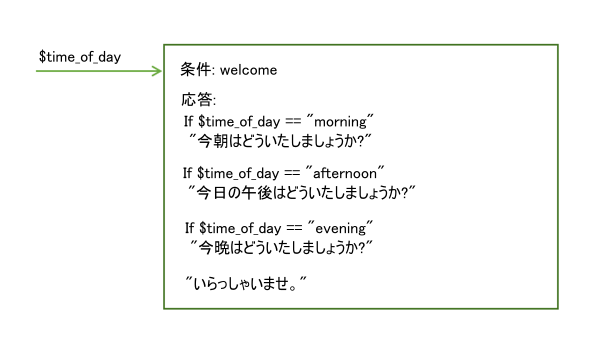
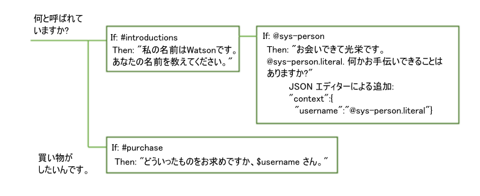
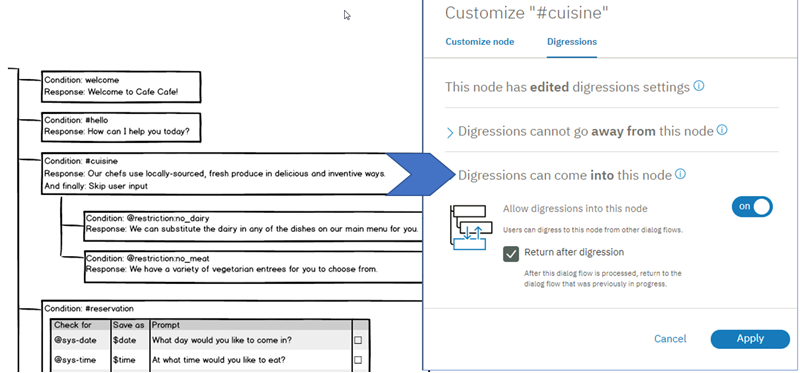

---

copyright:
  years: 2015, 2018
lastupdated: "2018-02-16"

---

{:shortdesc: .shortdesc}
{:new_window: target="_blank"}
{:tip: .tip}
{:pre: .pre}
{:codeblock: .codeblock}
{:screen: .screen}
{:javascript: .ph data-hd-programlang='javascript'}
{:java: .ph data-hd-programlang='java'}
{:python: .ph data-hd-programlang='python'}
{:swift: .ph data-hd-programlang='swift'}

# ダイアログの処理
{: #dialog-runtime}

デプロイされた {{site.data.keyword.conversationshort}} サービスのインスタンスとユーザーが実行時に対話するときのダイアログの処理について説明します。{: shortdesc}

## ダイアログ呼び出しの構造
{: message-anatomy}

各ユーザーの発話は、/message API 呼び出しとしてダイアログに渡されます。 これには、詳細情報を要求するダイアログのプロンプトへの応答としてユーザーが行う発話も含まれます。 一部のサブスクリプション・プランには、設定された数の API 呼び出しが含まれているため、呼び出しの構成要素を理解するのに役立ちます。 単一の /message API 呼び出しは、ユーザーからの入力とそれに対応するダイアログからの応答で構成されたダイアログの単一のターンに相当します。

/message API 呼び出しの要求および応答の本文には、以下のオブジェクトが含まれます。

- `context`: 保持する変数が含まれます。ある呼び出しから次の呼び出しに情報を渡すには、アプリケーション開発者が、前の API 呼び出しの応答のコンテキストを後続の各 API 呼び出しに渡す必要があります。 例えば、ダイアログでユーザーの名前を収集し、後続のノードでそのユーザーを名前で呼ぶことができます。

  ```json
  {
    "context" : {
      "user_name" : "<? @sys-person.literal ?>"
    }
  ```
  {: codeblock}

  詳しくは、[ダイアログのターンをまたいで情報を保持する](dialog-runtime.html#context)を参照してください。

- `input`: ユーザーから送信されたテキストの文字列。テキスト文字列には最大 2,048 文字まで含めることができます。

  ```json
  {
    "input" : {
      "text" : "Where's your nearest store?"
    }
  ```
  {: codeblock}

- `output`: ユーザーに表示するダイアログ応答。 このセクションでは、保持しないオブジェクト (変数など) を定義できます。 例えば、ダイアログの他の場所で定義した `temp` という名前のコンテキスト変数を完全に削除する場合は、以下の式を使用できます。

  ```json
  {
  "output": {
    "text" : {},
    "deleted_variable" : "<? context.remove('temp') ?>"
  ```
  {: codeblock}

  出力オブジェクトについて詳しくは、[複雑な応答](dialog-overview.html#complex)を参照してください。

/message API 呼び出しについて詳しくは、[API リファレンス ](dialog-overview.html#complex){: new_window} を参照してください。

## ダイアログのターンをまたいで情報を保持する
{: #context}

ダイアログはステートレスです。つまり、ある対話でユーザーから取得した情報は次の対話まで保持されません。アプリケーションに継続情報が必要な場合は、アプリケーション開発者が、継続情報を維持できるようにする必要があります。アプリケーションは、メッセージ API 応答内のコンテキスト・オブジェクトを探して保管し、会話フローの一部として生成された次の /message API 要求のコンテキスト・オブジェクトに渡す必要があります。

情報を保持する最も簡単な方法は、コンテキスト・オブジェクト全体をクライアント・アプリケーション (Web ブラウザーなど) のメモリーに保管する方法です。より複雑なアプリケーションの場合、または、個人情報を渡して保管する必要がある場合は、情報の保管と取り出しにデータベースを使用できます。

アプリケーションからダイアログに情報を渡すことができます。また、ダイアログでその情報を更新してアプリケーションに戻したり、後続のノードに渡したりすることもできます。そのために、ダイアログはコンテキスト変数を使用します。

コンテキスト変数は、ノード内で定義する変数であり、必要な場合にはデフォルト値を指定することもできます。 コンテキスト変数の値は、後から他のノードまたはアプリケーション・ロジックで設定したり変更したりできます。

ダイアログ・ノード条件でコンテキスト変数を参照してノードを実行するかどうかを決定することで、コンテキスト変数値を条件として使用できます。 さらに、ダイアログ・ノードの応答条件からコンテキスト変数を参照し、外部サービスまたはユーザーから提供された値に応じて応答を変えることができます。

### アプリケーションからコンテキストを渡す
{: #context-from-app}

アプリケーションからダイアログに情報を渡すには、コンテキスト変数を設定し、コンテキスト変数をダイアログに渡します。

例えば、アプリケーションが設定してダイアログに渡した $time_of_day コンテキスト変数を基に、ダイアログがユーザーに表示するあいさつを決定することができます。



この例では、アプリケーションが変数を *morning*、*afternoon*、*evening* のどの値に設定したかを、ダイアログが認識します。 ダイアログは各値をチェックし、設定された値に応じて適切なあいさつを返します。 変数が渡されないか、変数値がどの期待値とも一致しない場合は、より一般的なあいさつがユーザーに表示されます。

### ノードからノードへコンテキストを渡す
{: #context-node-to-node}

ダイアログではコンテキスト変数を追加して、あるノードから別のノードに情報を渡したり、コンテキスト変数の値を更新したりすることもできます。 ダイアログでユーザーに質問して情報を取得したら、その情報を記録し、後でダイアログで参照することができます。

例えば、あるノードでユーザーに名前を尋ね、後から別のノードでユーザーを名前で呼ぶことができます。



この例では、システム・エンティティー @sys-person を使用して、ユーザー入力からユーザー名を抽出します。 JSON エディターで、username コンテキスト変数を定義し、@sys-person 値に設定します。 それ以降のノードでは、$username コンテキスト変数を応答に指定して、ユーザーを名前で呼んでいます。

## コンテキスト変数の定義
{: #context-var-define}

以下のいずれかのエディターで、名前と値のペアを定義してコンテキスト変数を定義します。

- **コンテキスト・エディター**: コンテキスト変数の名前と値の情報を入力できる**「変数 (Variable)」**フィールドと、対応する**「値 (Value)」**フィールドがノード編集ビューに表示されます。

  **注**: これらのフィールドは、追加したノードに自動的に表示されます。以前のバージョンのサービスで作成されたノードの場合、追加するフィールドのコンテキスト・エディターを開く必要があります。

- **JSON エディター**: これを開くと、{{site.data.keyword.conversationshort}} サービスに送信される /message API 要求で渡される基礎の JSON コンテンツが表示されます。JSON 本文の `"context":{}` セクションに名前と値のペアを追加して、コンテキスト変数を定義できます。

名前と値のペアは、以下の要件を満たしている必要があります。

- `name` には、英字の大小文字、数字 (0 から 9 まで)、下線を使用できます。

  **注**: 名前にはピリオドやハイフンなど、その他の文字も使用できます。 ただし、その場合は、後で変数を参照するときに必ず以下のいずれかの方法を使用する必要があります。

  - **context['variable-name']**

      完全な SpEL 式構文。
  - **$(variable-name)**

      変数名を括弧で囲んだ省略構文。
    詳しくは、[オブジェクトへのアクセスと評価](expression-language.html#shorthand-syntax-for-context-variables)を参照してください。

- `value` には、単純な文字列変数、数値、JSON 配列、JSON オブジェクトなど、サポートされる任意の JSON タイプを使用できます。JSON エディターを使用してコンテキスト変数を定義する場合、JSON オブジェクトも値として指定できます。

以下の表は、コンテキスト変数エディター・フィールドに名前と値のペアを定義する方法を示しています。

| 変数           | 値                 |
|:---------------|--------------------|
| dessert        | cake               |
| toppings_array | ["onion","olives"] |
| age            | 18                 |

次の JSON のサンプルでは、$dessert 文字列、$toppings_array 配列、$age 数値のコンテキスト変数の値を定義しています。

```json
{
  "context": {
    "dessert": "cake",
    "toppings_array": ["onion", "olives"],
    "age": 18
  }
}
```
{: codeblock}

コンテキスト変数を定義するには、以下の手順を実行します。

1.  ダイアログ・ノードの評価において変数を設定したいタイミングを表しているノードのセクションに、コンテキスト変数を定義します。

    **注**: このノードに定義されている既存のコンテキスト変数値が、対応する**「変数 (Variable)」**フィールドと**「値 (Value)」**フィールドのセットに表示されます。それらをノードの編集ビューに表示する必要がない場合は、コンテキスト・エディターを閉じる必要があります。エディターを開いたときに使用したのと同じメニューからエディターを閉じることができます。以下の手順で、メニューにアクセスする方法を説明します。

    - ノード応答が処理された後に設定または変更されるコンテキスト変数を追加する場合は、コンテキスト変数を応答セクションに追加します。

      応答に関連付けられている**「オプション」** アイコンをクリックし、以下のいずれかのオプションを選択してエディターを選択します。

      - **JSON エディターを開く**
      - **コンテキスト・エディターを開く**

      

      ノードの**「複数の応答 (Multiple responses)」**設定が**「オン (On)」**の場合、最初に**「応答の編集 (Edit response)」**  アイコンをクリックする必要があります。

      

    - スロット条件が満たされた後に設定または更新されるコンテキスト変数を追加するには、**「スロットの編集 (Edit slot)」**  アイコンをクリックします。*「スロットの構成 (Configure slot)」*ビュー・ヘッダーの**「オプション」** メニューから、**「JSON エディターを開く (Open JSON editor)」**をクリックします (スロットについて詳しくは、[スロットを使用した情報の収集](dialog-slots.html)を参照してください)。

      **注**: 現在、コンテキスト・エディターを使用して、ダイアログ・ノード評価のこのフェーズで設定されるコンテキスト変数を定義することはできません。

      

    - スロットの応答条件が満たされた後に処理されるコンテキスト変数を追加するには、**「スロットの編集 (Edit slot)」**  アイコンをクリックします。**「オプション」**  アイコンをクリックし、**「条件付き応答を有効にする (Enable conditional responses)」**を選択します。コンテキスト変数を関連付ける応答の横にある**「応答の編集 (Edit response)」**  アイコンをクリックします。応答セクションで**「オプション」**  アイコンをクリックし、以下のいずれかのオプションを選択してエディターを選択します。

      - **JSON エディターを開く**
      - **コンテキスト・エディターを開く**

      
1.  コンテキスト・エディターでコンテキスト変数を定義する場合は、変数の名前と値のペアを**「変数 (Variable)」**および**「値 (Value)」**フィールドに追加します。
1.  JSON エディターでコンテキスト変数を定義する場合は、さらに次の追加の手順を実行します。

    - `"context":{}` ブロックがない場合は追加します。

      ```json
      {
        "context":{},
      "output":{}
    }
      ```
      {: codeblock}

    - コンテキスト・ブロックに、定義する各コンテキスト変数の名前と値のペアを追加します。

      ```json
      {
        "context": {
          "name": "value"
      },
        "output": {}
      }
      ```
      {: codeblock}

    この例では、変数が既に含まれているコンテキスト・ブロックに `new_variable` という名前の変数を追加します。

    ```json
    {
      "context": {
        "existing_variable": "value",
        "new_variable":"value"
      }
    }
    ```
    {: codeblock}

    コンテキスト変数を後から参照するには、`$name` という構文を使用します。ここで、*name* は定義したコンテキスト変数の名前です。 例えば、`$new_variable` です。

## コンテキスト変数の一般的な作業
{: #context-common-tasks}

ユーザーから入力として提供された文字列全体を保管するには、`input.text` を使用します。

| 変数     | 値               |
|----------|------------------|
| repeat   | `<?input.text?>` |

```json
{
  "context": {
    "repeat": "<?input.text?>"
  }
}
```
{: codeblock}

エンティティーの値をコンテキスト変数に格納するには、次の構文を使用します。

| 変数     | 値               |
|----------|------------------|
| place    | @place           |

```json
{
  "context": {
    "place": "@place"
  }
}
```
{: codeblock}

どちらのエディターでも、JSON オブジェクトをコンテキスト変数に追加できます。次の式は、first 値と last 値のセットを含む full_name オブジェクトを定義します。両方の値が一緒になって個人のフルネームを形成します。

| 変数          | 値               |
|---------------|------------------|
| full_name     | { "first":"Paul", "last":"Smith" } |

```json
{
  "context": {
    "full_name": {
      "first":"Paul",
      "last":"Smith"
      }
  }
}
```
{: codeblock}

応答に `$full_name.first` を指定すると、`Paul` が表示されます。

ユーザー入力から抽出した文字列の値を格納するには、ユーザー入力に正規表現を適用する抽出メソッドを使用する SpEL 式を含めることができます。以下の式は、ユーザー入力から数値を抽出し、`$number` コンテキスト変数に保存します。

| 変数     | 値                                  |
|----------|-------------------------------------|
| 数値   | `<?input.text.extract('[\d]+',0)?>` |

```json
{
  "context": {
     "number": "<?input.text.extract('[\\d]+',0)?>"
  }
}
```
{: codeblock}

JSON エディターで正規表現を定義する場合は、式で使用する円記号を別の円記号でエスケープする (`\\`) 必要があります。 コンテキスト変数エディターを使用して定義する正規表現では、円記号をエスケープする必要はありません。
{: tip}

パターン・エンティティーの値を保管するには、エンティティー名に .literal を付加します。この構文を使用すると、ユーザー入力のうち、指定したパターンと一致する正確な範囲のテキストが変数に格納されます。

| 変数     | 値               |
|----------|------------------|
| email    | @email.literal   |

```json
{
  "context": {
    "email": "<? @email.literal ?>"
  }
}
```
{: codeblock}

## コンテキスト変数の削除
{: #context-delete}

コンテキスト変数を削除するには、変数を NULL に設定します。

```json
{
  "context": {
    "order_form": null
  }
}
```
{: codeblock}

コンテキスト変数のすべてのトレースを削除する場合は、JSONObject.remove(string) メソッドを使用してコンテキスト・オブジェクトから削除することができます。ただし、削除を実行するには変数を使用する必要があります。現在の呼び出しを超えて保存されないように、新しい変数をメッセージ出力に定義してください。

```json
{
  "output": {
    "text" : {},
    "deleted_variable" : "<? context.remove('order_form') ?>"
  }
}
```
{: codeblock}

また、アプリケーション・ロジックでコンテキスト変数を削除することもできます。

### 処理の順序
{: #context-order-of-ops}

コンテキスト変数は、定義した順序どおりにサービスで評価されるわけではありません。 サービスは、JSON の名前と値のペアとして定義されている変数をランダムな順序で評価します。 リスト内の最初のコンテキスト変数がリスト内の 2 番目のコンテキスト変数の前に実行される保証はないため、最初のコンテキスト変数に設定した値を 2 番目のコンテキスト変数で使用できると想定しないでください。 例えば、2 つのコンテキスト変数を使用して、ゼロからそれより大きい値までの範囲内の乱数を返し、それをノードに渡すロジックを実装しないでください。

```json
"context": {
    "upper": "<? @sys-number.numeric_value + 1?>",
    "answer": "<? new Random().nextInt($upper) ?>"
}
```
{: codeblock}

$upper コンテキスト変数の値が $answer コンテキスト変数より先に評価されることに依存しなくても済むように、少し複雑な式を使用します。

```json
"context": {
    "answer": "<? new Random().nextInt(@sys-number.numeric_value + 1) ?>"
}
```
{: codeblock}

### パターン・エンティティー値の保管
{: #context-pattern-entities}

パターン・エンティティーの値をコンテキスト変数に格納するには、エンティティー名に .literal を追加します。 この構文を使用すると、ユーザー入力のうち、指定したパターンと一致する正確な範囲のテキストが変数に格納されます。

```json
{
  "context": {
    "email": "<? @email.literal ?>"
  }
}
```
{: codeblock}

パターン・エンティティーに複数のグループを定義した場合に、単一グループのテキストを保管するには、保管するグループの配列番号を指定します。例えば、@phone_number エンティティーのエンティティー・パターンが以下のように定義されているとします (括弧がパターン・グループを表すことに注意してください)。

`\b((958)|(555))-(\d{3})-(\d{4})\b`

ユーザー入力で指定された電話番号の市外局番だけを保管するには、以下の構文を使用します。

```json
{
  "context": {
    "area_code": "<? @phone_number.groups[1] ?>"
  }
}
```
{: codeblock}

グループ・パターンの定義に使用した正規表現ごとにグループに区切られます。例えば、エンティティー `@phone_number` に定義したパターンに一致するユーザー入力が `958-234-3456` の場合、以下のグループが作成されます。

| グループ番号 | 正規表現エンジンの値| ダイアログの値   | 説明        |
|--------------|---------------------|----------------|-------------|
| groups[0]    | `958-234-3456`      | `958-234-3456` | 最初のグループは、必ず、一致した文字列全体です。 |
| groups[1]    | `((958)`l`(555))`   | `958`          | 最初に定義されたグループの正規表現に一致する文字列。この場合は `((958)`l`(555))`。 |
| groups[2]    | `(958)`             | `958`          | OR 式の 1 つ目のオペランドとして指定されたグループと一致する `((958)`l`(555))` |
| groups[3]    | `(555)`             | `null`         | OR 式の 2 つ目のオペランドとして指定されたグループと一致しない `((958)`l`(555))` |
| groups[4]    | `(\d{3})`           | `234`          | グループに定義された正規表現に一致する文字列。|
| groups[5]    | `(\d{4})`           | `3456`         | グループに定義された正規表現に一致する文字列。|
{: caption="グループの詳細" caption-side="top"}

対象の入力部分を取得できるグループ番号を簡単に調べるには、一度にすべてのグループの情報を抽出します。以下の構文を使用して、グループ分けされたすべてのパターン・エンティティーの一致部分を含む配列を返すコンテキスト変数を作成できます。

```json
{
  "context": {
    "array_of_matched_groups": "<? @phone_number.groups ?>"
  }
}
```
{: codeblock}

「Try it out」ペインを使用してテスト用の電話番号の値を入力します。入力が `958-123-2345` の場合、この式によって `$array_of_matched_groups` に `["958-123-2345","958","958",null,"123","2345"]` が設定されます。

そのため、配列内の各値を 0 から始めてカウントすると、必要なグループのグループ番号がわかります。

| 配列要素の値        | 配列要素の番号       |
|---------------------|----------------------|
| "958-123-2345"      | 0                    |
| "958"               | 1                    |
| "958"               | 2                    |
| null                | 3                    |
| "123"               | 4                    |
| "2345"              | 5                    |
{: caption="配列エレメント" caption-side="top"}

例えば、電話番号の最後の 4 桁を取得するには、グループ #5 が必要であることが簡単にわかります。

グループ分けされたパターン・エンティティーを表すために作成された JSONArray 構造を返すには、以下の構文を使用します。

```json
{
  "context": {
    "json_matched_groups": "<? @phone_number.groups_json ?>"
  }
}
```
{: codeblock}

この式は、`$json_matched_groups` に以下の JSON 配列を設定します。

```json
[
  {"group": "group_0","location": [0, 12]},
  {"group": "group_1","location": [0, 3]},
  {"group": "group_2","location": [0, 3]},
  {"group": "group_3"},
  {"group": "group_4","location": [4, 7]},
  {"group": "group_5","location": [8, 12]}
]
```
{: codeblock}

**注**: `location` は、ゼロから始まる文字オフセットを使用して、入力テキストにおける検出されたエンティティー値の開始位置と終了位置を示す、エンティティーのプロパティーです。

2 つの電話番号が入力として提供されることが想定される場合は、2 つの電話番号をチェックできます。例えば、次の構文を使用して、2 つ目の番号の市外局番を取得できます。

```json
{
  "context": {
    "second_areacode": "<? entities['phone_number'][1].groups[1] ?>"
  }
}
```
{: codeblock}

入力が `I want to change my phone number from 958-234-3456 to 555-456-5678` の場合、`$second_areacode` は `555` になります。

## コンテキスト変数値の更新
{: #context-update}

既に設定されていたコンテキスト変数の値をノードが設定すると、前の値は上書きされます。

### 複雑な JSON オブジェクトの更新

JSON オブジェクト以外の JSON タイプでは、前の値が上書きされます。 コンテキスト変数が JSON オブジェクトなどの複合タイプである場合は、JSON のマージ処理を使用して変数が更新されます。 マージ処理によって、新しく定義したプロパティーが追加され、オブジェクトの既存のプロパティーが上書きされます。

次の例では、名前のコンテキスト変数が複合オブジェクトとして定義されています。

```json
{
  "context": {
    "complex_object": {
      "user_firstname" : "Paul",
      "user_lastname" : "Pan",
      "has_card" : false
    }
  }
}
```
{: codeblock}

このコンテキスト変数の JSON オブジェクトを、ダイアログ・ノードで次の値に更新します。

```json
{
  "complex_object": {
    "user_firstname": "Peter",
    "has_card": true
  }
}
```
{: codeblock}

結果のコンテキストは次のようになります。

```json
{
  "complex_object": {
    "user_firstname": "Peter",
    "user_lastname": "Pan",
    "has_card": true
  }
}
```
{: codeblock}

オブジェクトに対して実行できるメソッドの詳細については、[式言語メソッド](dialog-methods.html#objects)を参照してください。

### 配列の更新

ダイアログのコンテキスト・データに値の配列が含まれている場合は、値を追加したり、削除したり、すべての値を置換したりして配列を更新できます。

以下のいずれかのアクションを選択して配列を更新できます。 すべてのケースについて、アクションの前の配列、アクション、アクションが適用された後の配列を示しています。

- **追加**: 配列の最後に値を追加するには、`append` メソッドを使用します。

    このダイアログ実行時のコンテキスト:

    ```json
    {
      "context": {
        "toppings_array": ["onion", "olives"]
      }
    }
    ```
    {: codeblock}

    適用する更新:

    ```json
    {
      "context": {
        "toppings_array": "<? $toppings_array.append('ketchup', 'tomatoes') ?>"
      }
    }
    ```
    {: codeblock}

    結果:

    ```json
    {
      "context": {
        "toppings_array": ["onion", "olives", "ketchup", "tomatoes"]
      }
    }
    ```
    {: codeblock}

- **削除**: 要素を削除するには、`remove` メソッドを使用し、配列内の値または位置を指定します。

    - **値で削除**: 要素の値を指定して、配列から要素を削除します。

        このダイアログ実行時のコンテキスト:

        ```json
        {
          "context": {
            "toppings_array": ["onion", "olives"]
      }
        }
        ```
        {: codeblock}

        適用する更新:

        ```json
        {
          "context": {
            "toppings_array": "<? $toppings_array.removeValue('onion') ?>"
          }
        }
        ```
        {: codeblock}

        結果:

        ```json
        {
          "context": {
            "toppings_array": ["olives"]
          }
        }
        ```
        {: codeblock}

    - **位置で削除**: 要素のインデックス位置を指定して、配列から要素を削除します。

        このダイアログ実行時のコンテキスト:

        ```json
        {
          "context": {
            "toppings_array": ["onion", "olives"]
      }
        }
        ```
        {: codeblock}

        適用する更新:

        ```json
        {
          "context": {
            "toppings_array": "<? $toppings_array.remove(0) ?>"
          }
        }
        ```
        {: codeblock}

        結果:

        ```json
        {
          "context": {
            "toppings_array": ["olives"]
          }
        }
        ```
        {: codeblock}

- **上書き**: 配列内の値を上書きするには、単に配列に新しい値を設定します。

    このダイアログ実行時のコンテキスト:

        ```json
        {
          "context": {
            "toppings_array": ["onion", "olives"]
      }
        }
        ```
        {: codeblock}

    適用する更新:

        ```json
        {
          "context": {
            "toppings_array": ["ketchup", "tomatoes"]
          }
        }
        ```
        {: codeblock}

    結果:

        ```json
        {
          "context": {
            "toppings_array": ["ketchup", "tomatoes"]
          }
        }
        ```
        {: codeblock}

配列に対して実行できるメソッドの詳細については、[式言語メソッド](dialog-methods.html#objects)を参照してください。

## 脱線
{: #digressions}

脱線とは、ユーザーが、ある目的のために設計されたダイアログ・フローの途中で、突然トピックを切り替えて、別の目的のために設計されたダイアログ・フローを開始することです。ダイアログは、いつでもユーザーがサブジェクトを変更できるようになっています。処理中のダイアログ・ブランチに、ユーザーの最新の入力の目的と一致するノードがない場合、会話はツリーに戻り、適切な一致がないかルート・ノードの条件をチェックします。ノードごとに設定可能な脱線設定を使用して、この動作をさらに細かく調整できます。

脱線の設定を使用すると、脱線が発生して中断されたダイアログ・フローに会話を戻すことができます。例えば、新しい電話機を注文中のユーザーが、トピックを切り替えてタブレットについて尋ねる可能性があります。ダイアログで、タブレットについての質問に回答した後に、電話の注文プロセスを中断した時点にユーザーを戻すことができます。脱線して元に戻ることを可能にすると、ユーザーが実行時に会話のフローをより細かく制御できるようになります。トピックを変更し、関連のないトピックについてのダイアログ・フローを最後までたどってから、前の場所に戻ることができます。その結果、人対人の会話により近い会話をシミュレートできるダイアログ・フローになります。

以下の図では、ダイアログ・ツリーのユーザー・インターフェースのモックアップを使用して、脱線の概念について説明します。 これは、脱線した後に、処理中だったダイアログ・フローに戻れるように構成したダイアログ・ノードとのユーザーの対話を示しています。ユーザーがディナーを予約するために必要な情報の提供を開始します。#reservation ノードのスロットに情報を取り込んでいる途中で、ユーザーがベジタリアン用メニューのオプションについての質問をします。ダイアログは、ルート・ノード (#cuisine インテントを条件とするノード) の中から対応するノードを見つけて、ユーザーの新しい質問に回答します。そして、元のダイアログ・ノードの次の空スロットを求めるプロンプトを表示して、処理中だった会話に戻ります。


### 始める前に

ダイアログ全体をテストすると、脱線して戻ることを、いつどこで許可するのが自然かがわかります。ノードには以下の脱線制御が自動的に適用されます。このデフォルトの動作を変更する必要がある場合にのみ、操作を実行してください。

- ダイアログのすべてのルート・ノードは、デフォルトで脱線のターゲットにできるように構成されています。子ノードは、脱線のターゲットにできません。
- スロット付きのノードは、脱線できないように構成されています。他のすべてのノードは、脱線できるように構成されています。 ただし、以下の状況では、会話をノードから脱線させることはできません。

  - 現行ノードのいずれかの子ノードに `anything_else` 条件または `true` 条件が含まれている場合

    これらの条件は、常に true に評価される点が特殊です。動作が既知であるため、これらの条件は、続けて特定の子ノードを評価することを親ノードに強制するためにダイアログでよく使用されます。この場合、既存のダイアログ・フロー・ロジックの中断を防ぐために、脱線は許可されません。 このようなノードからの脱線を有効にするには、子ノードの条件を別のものに変更する必要があります。

  - 処理された後に、別のノードにジャンプするように、またはユーザー入力をスキップするようにノードが構成されている場合

    ノードの最終ステップのセクションには、ノードが処理された後に実行すべき内容を指定します。ダイアログが別のノードに直接ジャンプするように構成されている場合は、特定の順序に従う必要があることがよくあります。また、ノードがユーザー入力をスキップするように構成されている場合は、現行ノードの後に続けて最初の子ノードを処理するようにダイアログに強制することと同じです。どちらの場合も、既存のダイアログ・フロー・ロジックの中断を防ぐために、脱線は許可されません。 このようなノードからの脱線を有効にするには、最終ステップのセクションに指定した内容を変更する必要があります。

### 脱線のカスタマイズ
{: #enable-digressions}

脱線の開始と終了は定義しません。実行時には、ユーザーが脱線フローを完全に制御します。ユーザー主導の脱線に各ノードを参加させるかどうかのみを指定します。 ノードごとに、以下を構成します。

- 脱線を開始して、このノードから離れることができるか
- 他の場所で開始された脱線で、このノードをターゲットにして中に入ることができるか
- 他の場所で開始され、このノードに入った脱線が、現在のダイアログ・フローの完了後に、中断されたダイアログ・フローに戻る必要があるか

個々のノードの脱線動作を変更するには、次の手順を実行します。

1.  ノードをクリックして、その編集ビューを開きます。

1.  **「カスタマイズ (Customize)」**をクリックし、**「脱線 (Digressions)」**タブをクリックします。

    構成オプションは、編集するノードがルート・ノード、子ノード、子を持つノード、またはスロット付きノードのいずれであるかによって異なります。

    **このノードからの脱線**

    前述の状況が当てはまらない場合は、以下の選択を行えます。

    - **すべてのノード・タイプ**: 現在のダイアログ・ブランチの最後に到達する前に、現在のノードから脱線することをユーザーに許可するかどうかを選択できます。

    - **子を持つすべてのノード**: 現在のノードの応答が既に表示されていて、子ノードがこのノードの目的と同じ場合に、脱線の後に会話を現在のノードに戻すかどうかを選択します。*「このノードの応答の後にトリガーされた脱線からの戻りを許可 (Allow return from digressions triggered after this node's response)」*トグルを**「いいえ (No)」**に設定すると、ダイアログが現在のノードに戻ってブランチの処理を再開することを防止できます。

      例えば、ユーザーから`「カップケーキはありますか?」`と尋ねられ、`「さまざまな味とサイズのカップケーキをご用意しております」`という応答を表示した後にユーザーがサブジェクトを変更した場合、ダイアログを中断した場所に戻す必要はないでしょう。子ノードがユーザーからのフォローアップの質問に対処するだけで、無視しても問題ない場合は、特にそうです。

      ただし、質問に対処するために子ノードに依存するノードの場合には、強制的に会話を戻して、現行ブランチ内のノードの処理を再開させる必要があるでしょう。例えば、最初の応答が`「さまざまな形とサイズのカップケーキをご用意しております。グルテンフリー・メニュー、乳製品フリー・メニュー、または通常メニューのどれをご覧になりますか?」`だとします。ユーザーがこの時点でサブジェクトを変更した場合は、ユーザーがメニュー・タイプを選択して必要な情報を取得できるように、ダイアログを戻す必要があります。

    - **スロット付きのノード**: すべてのスロットに情報が取り込まれる前に、ノードから脱線することをユーザーに許可するかどうかを選択します。脱線を可能にするには、**「スロットに情報を取り込み中に脱線を許可する (Allow digressions away while slot filling)」**トグルを*「はい (Yes)」*に設定します。

      可能にした場合は、会話が脱線から戻ったときに、情報が取り込まれていない次のスロットを求めるプロンプトを表示して、ユーザーに情報提供を再開するように促します。不可にした場合、スロットに情報を取り込める値が含まれていないユーザー入力はすべて無視されます。ただし、スロット・ハンドラーを定義して、ノードとの対話中にユーザーが尋ねるかもしれない割り込みの質問に対処できます。詳しくは、[スロットの追加](dialog-slots.html#add-slots)を参照してください。

      以下の図は、スロット付きの #reservation ノード (前の図を参照) からの脱線の構成を示しています。

      

    - **スロット付きノード**: **「スロットから戻りが許可されているノードへの脱線のみ (Only digress from slots to nodes that allow returns)」**チェック・ボックスの選択によって、現在のノードに戻る場合にのみ脱線することをユーザーに許可するかどうかを選択します。

      これを選択すると、ダイアログは、ユーザーの無関係な質問に回答するためのノードを探す際に、脱線の後に戻るように構成されていないルート・ノードを無視します。必要なスロットに情報が取り込まれるまでユーザーが永遠にノードを離れられないようにするには、このチェック・ボックスを選択してください。

    **このノードへの脱線**

    ノードへの脱線の動作については、以下の選択を行えます。

    - 脱線してこのノードに入ることをユーザーに禁止します。詳しくは、[ルート・ノードへの脱線の無効化](#diable-digressions)を参照してください。

    - このノードへの脱線を可能にした場合は、ダイアログがその脱線元のダイアログ・フローに戻る必要があるかどうかを選択します。これを選択すると、現行ノードのブランチが処理された後に、ダイアログ・フローは中断されたノードに戻ります。後でダイアログを戻すには、**「脱線後に戻る (Return after digression)」**を選択します。

    以下の図は、#cuisine ノード (前の図を参照) への脱線の構成を示しています。

    

1.  **「適用」**をクリックします。

1.  「Try it out」ペインを使用して、脱線の動作をテストします。

    ここでも、脱線の開始と終了は定義できません。いつどこで脱線するかは、ユーザーが制御します。適用できる設定は、1 つのノードがどのように脱線に参加するかを決める設定だけです。脱線は予測不能であるため、構成上の決定が会話全体にどのように影響するかを把握することは困難です。判断した選択の影響を実際に確認するために、ダイアログをテストする必要があります。

reservation ノードおよび #cuisine ノードは、ユーザー主導の単一の脱線に参加できる 2 つのダイアログ・ブランチを表しています。個々のノードに対して構成する脱線設定は、実行時にこのタイプの脱線を可能にするものです。


### ルート・ノードへの脱線の無効化
{: #disable-digressions}

ルート・ノードに脱線したフローは、そのノード用に構成されたダイアログのコースに従います。 そのため、一連の子ノードを処理してノード・ブランチの最後に到達したら、中断されたダイアログ・フローに戻ります (そうするように構成されている場合)。ダイアログのテストから、ルート・ノードがトリガーされすぎていること、予期しないタイミングでトリガーされていること、ダイアログが複雑すぎてユーザーがコースから離れすぎてしまい、一時的な脱線対象になっていないことなどがわかる場合があります。ユーザーに脱線を許可しないほうがよいと判断した場合は、ルート・ノードへの脱線を許可しないように構成できます。

ルート・ノードへの脱線を完全に無効にするには、次の手順を実行します。

1.  編集するルート・ノードをクリックして開きます。
1.  **「カスタマイズ (Customize)」**をクリックし、**「脱線 (Digressions)」**タブをクリックします。
1.  *「このノードへの脱線を許可する (Allow digressions into this node)」*トグルを**「オフ (Off)」**に設定します。
1.  **「適用」**をクリックします。

複数のルート・ノードへの脱線を禁止する場合に、ノードを 1 つずつ編集したくなければ、それらのノードを 1 つのフォルダーに追加します。そのフォルダーの*「カスタマイズ (Customize)」*ページで、*「このノードへの脱線を許可する (Allow digressions into this node)」*トグルを**「オフ (Off)」**に設定することで、構成を一度にすべてのノードに適用できます。詳しくは、[フォルダーを使用したダイアログの編成](dialog-build.html#folders)を参照してください。

### 設計上の考慮事項
{: #digression-design-considerations}

- **フォールバック・ノードの急増を避ける**: 多くのダイアログ・デザイナーは、ユーザーがブランチ内にスタックすることを防止する手段として、各ダイアログ・ブランチの最後に `true` または `anything_else` 条件を指定したノードを含めます。この設計では、予期される入力として、処理するための特定のダイアログ・ノードを用意していた入力にユーザー入力が一致しない場合は、汎用メッセージが返されます。しかし、ユーザーは、この方法を使用するダイアログ・フローからは脱線できません。

  この方法を使用するブランチを評価して、そのブランチからの脱線を許可したほうが良いかどうかを確認してください。ユーザーの入力が予期した入力と一致しない場合に、ツリー内のまったく異なるダイアログ・フローで一致が見つかる場合があります。汎用メッセージで応答するのではなく、ダイアログの残りの部分を効果的に活用して、ユーザーの入力に対処することができます。ルート・レベルの `Anything else` ノードは、他のルート・ノードが対処できない入力に常に応答できます。

- **クローズ・ノードへのジャンプを見直す**: 多くのダイアログは、`「この回答に満足していただけましたか?」`のような標準的なクローズ質問を行うように設計されます。ユーザーは、別のノードにジャンプするように構成されているノードからは脱線できません。そのため、すべての最終ブランチ・ノードを 1 つの共通のクローズ・ノードにジャンプするように構成した場合、脱線は実行できません。メトリックなどの手段によって、ユーザーの満足度を追跡することを検討してください。

- **潜在的な脱線チェーンのテスト**: ユーザーが現行ノードから脱線した先の別のノードが、脱線することを許可されている場合、ユーザーはそのノードから脱線して、このパターンを 1 回以上繰り返す可能性があります。脱線チェーン内のすべてのノードが脱線後に戻るように構成されている場合、ユーザーは最終的に現在のダイアログ・ノードに戻されます。ただし、何度も脱線するシナリオは、テストして、個々のノードが期待どおりに機能することを確認してください。

- **現行ノードが優先されることに注意してください**: 現行フローがユーザー入力を処理できない場合、現行フローの外部にあるノードは、脱線ターゲットとしか見なされないことに注意してください。特に、脱線することを許可したスロットを持つノードでは、必要な情報をユーザーに明確に示し、ユーザーから値が提供された後に表示する確認ステートメントを追加することが非常に重要です。

  スロットへの情報の取り込み処理中は、すべてのスロットが取り込み可能です。そのため、スロットが予期せずユーザー入力をキャプチャーすることがあります。例えば、ディナーの予約に必要な情報を収集するスロットを持つノードがあるとします。スロットの 1 つが日付情報を収集します。予約の詳細情報を提供しているときに、ユーザーが`「明日の天気はどうですか?」`と尋ねたとします。#forecast を条件とするルート・ノードでユーザーに回答できます。しかし、ユーザーの入力には`「明日」`という語が含まれていて、スロット付きの予約ノードが処理中であるため、サービスはユーザーが予約日を提供または更新していると想定します。*現行ノードは常に優先されます。* `「わかりました。予約日を明日に設定します」`などの明確な確認ステートメントを定義すると、ユーザーがコミュニケーションの誤りに気付いて修正する可能性が高くなります。

  それとは逆に、スロットに情報を取り込み中に、ユーザーがいずれのスロットでも予期されていない値を提供し、まったく意図していなかった完全に無関係のルート・ノードにその値が一致する可能性もあります。

  脱線の動作を構成する際には、必ず何度もテストを行ってください。

- **スロット・ハンドラーの代わりに脱線を使用すべき状況**: いつでもユーザーが尋ねる可能性がある一般的な質問には、脱線して入ることを許可したルート・ノードを使用し、入力を処理してから、処理中だったフローに戻ります。スロット付きのノードの場合は、スロットへの入力中にユーザーが尋ねる可能性がある関連質問のタイプを予想し、ノードにハンドラーを追加して質問に対処します。

  例えば、スロット付きのノードで保険請求の記入に必要な情報を収集する場合は、保険に関する一般的な質問に対処するハンドラーを追加すると良いでしょう。ただし、支援を得る方法、店舗の場所、会社の沿革についての質問には、ルート・レベルのノードを使用してください。
