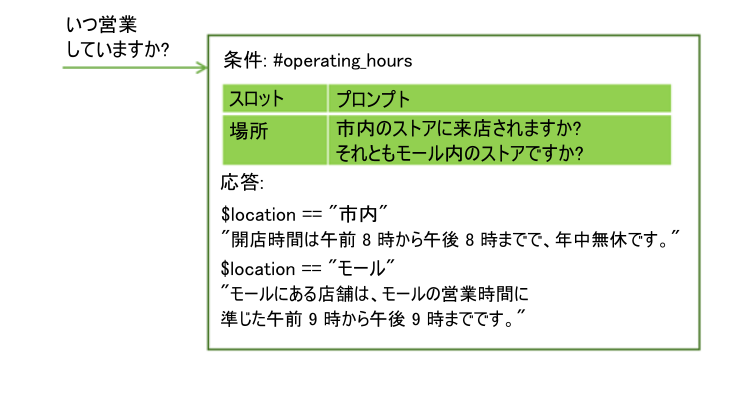
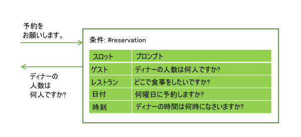
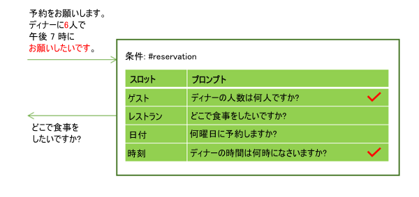
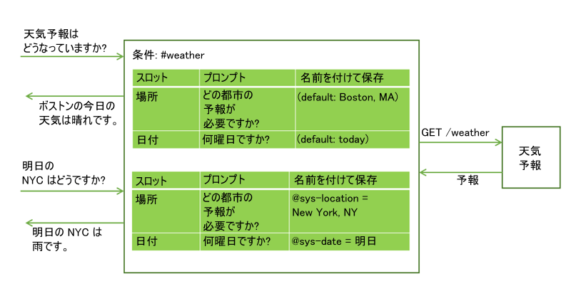
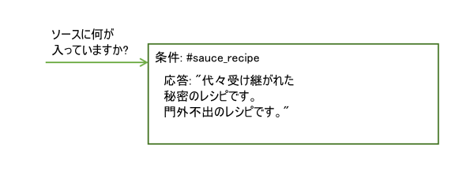

---

copyright:
  years: 2015, 2019
lastupdated: "2019-02-28"

subcollection: assistant

---

{:shortdesc: .shortdesc}
{:new_window: target="_blank"}
{:deprecated: .deprecated}
{:important: .important}
{:note: .note}
{:tip: .tip}
{:pre: .pre}
{:codeblock: .codeblock}
{:screen: .screen}
{:javascript: .ph data-hd-programlang='javascript'}
{:java: .ph data-hd-programlang='java'}
{:python: .ph data-hd-programlang='python'}
{:swift: .ph data-hd-programlang='swift'}
{:table: .aria-labeledby="caption"}

# スロットを使用した情報の収集
{: #dialog-slots}

ダイアログ・ノードにスロットを追加して、そのノード内でユーザーから複数の情報を収集できます。 スロットはユーザーのペースで情報を収集します。 ユーザーから最初に提供された詳細情報は保存されているので、サービスはまだ提供されていない詳細情報のみを求めます。

<iframe class="embed-responsive-item" id="youtubeplayer" title="ノードへのスロットの追加" type="text/html" width="640" height="390" src="https://www.youtube.com/embed/kMLyKfmO9wI?rel=0" frameborder="0" webkitallowfullscreen mozallowfullscreen allowfullscreen> </iframe>

## スロットを追加する理由
{: #dialog-slots-why}

スロットを使用すると、必要な情報を取得してから、ユーザーに正確に応答することができます。 例えば、ユーザーから営業時間を尋ねられたが、店舗によって営業時間が異なる場合は、回答する前に目的の店舗の場所を尋ねる補足質問をすることができます。 それから、提供された場所情報を考慮する応答条件を追加することができます。



スロットを使用すると、ユーザーの複雑な作業 (ディナーの予約など) を実行するために必要な複数の情報を収集できます。



ユーザーは複数のスロットに対する値を一度に提供することがあります。 例えば、入力に「`午後 7 時に 6 名で食事`」という情報が含まれていることがあります。 この 1 つの入力には、欠落していた必要な値が 2 つ (人数と予約時刻) が含まれています。 サービスは、その両方を認識し、それぞれを対応するスロットに格納します。 続いて、次の空のスロットに関連付けられているプロンプトを出します。



スロットにより、サービスは、ユーザーの目的を再確立せずに補足質問に回答することができます。 例えば、ユーザーが、天気予報について尋ねた後に、別の場所や別の日の予報を尋ねる補足質問をすることがあります。 場所や日付などの必要な予測変数をスロットに保存した後に、ユーザーから新しい変数値を使用して補足質問をされた場合は、提供された新しい値でスロット値を上書きして、新しい情報を反映した応答を返すことができます。 (ダイアログから外部サービスを呼び出す方法について詳しくは、[ダイアログ・ノードからのプログラムによる呼び出しの実行](/docs/services/assistant?topic=assistant-dialog-actions)を参照してください。)



スロットを使用すると、ユーザーとサービスの間でより自然なダイアログ・フローが生成され、多くの個別ノードを使用して情報を収集するより、管理が容易になります。

## スロットの追加
{: #dialog-slots-add}

1.  収集する情報の単位を決定します。 例えば、ユーザーがピザを注文するときには、次の情報を収集する必要があります。

    - 配達時刻
    - サイズ

1.  ダイアログの作成をまだ開始していない場合は、[ダイアログの作成](/docs/services/assistant?topic=assistant-dialog-build)の説明に従ってダイアログを作成します。

1.  ダイアログ・ノードの編集ビューで**「カスタマイズ」**をクリックし、**「スロット」**の横のトグルをクリックして**オン**にします。

    **「すべての入力を求めるプロンプトを表示 (Prompt for everything)」**チェック・ボックスについて詳しくは、[すべてを一度に尋ねる](#dialog-slots-prompt-for-everything)を参照してください。

1.  **必要な情報の単位ごとにスロットを追加**します。 スロットごとに次の詳細を指定します。

    - **チェック対象 (Check for)**: スロットのプロンプトに対するユーザーの応答から抽出する情報のタイプを指定します。 ほとんどの場合、エンティティー値をチェックします。 実際には、表示される条件ビルダーでエンティティーが提案されるので、それをチェックできます。 ただし、インテントをチェックすることもできます。その場合はフィールドにインテント名を入力してください。 ここで AND 演算子または OR 演算子を使用すると、より複雑な条件を定義できます。

      「*チェック対象 (Check for)*」の値は、最初は条件として使用されますが、その後、「*名前を付けて保存 (Save as)*」フィールドで名前を付けたコンテキスト変数の値になります。 **チェック内容**と**保存内容**の両方が指定されます。値の保存方法を変更する場合は、値の形式を再設定する式を*「チェック対象 (Check for)」* フィールドに追加します。
      {: important}

      例えば、エンティティーが `@email` などのパターン・エンティティーの場合、エンティティー名を追加した後に `.literal` を付加します。`.literal` を追加することで、パターンに基づいて E メール・アドレスとして識別された、ユーザーが入力した正確なテキストを取り込むように指示できます。

      場合によっては、値を取り込む式を使用できますが、式は保存内容には適用できません。このような場合、*「チェック対象 (Check for)」* フィールドで 1 つの値を使用して値を取り込み、別のものが保存されるように、JSON エディターを開いてコンテキスト変数の値を変更できます。例については、[ゼロの適切な処理](/docs/services/assistant?topic=assistant-tutorial-slots-complex#tutorial-slots-complex-recognize-zero)を参照してください。

      JSON エディターでのスロットのコンテキスト変数の値に対する編集は、JSON エディターの終了時に**「チェック対象 (Check for)」**フィールドに反映されません。また、JSON エディターを使用して値を編集した後で、**「チェック対象 (Check for)」**フィールドをクリックしてフィールドにフォーカスを移すと、変更内容が失われます。
      {: important}

      *「チェック対象 (Check for)」* フィールドでは、コンテキスト変数の値はチェックしないでください。チェックする値は保存される値でもあるため、条件でコンテキスト変数を使用していると、予期しない動作が発生する可能性があります。

    - **名前を付けて保存 (Save as)**: スロットのプロンプトに対するユーザー応答に含まれている関係のある値を格納するコンテキスト変数の名前を指定します。

       ダイアログの別の場所で使用されるコンテキスト変数を再使用しないでください。コンテキスト変数に既に値が指定されている場合、スロットのプロンプトは表示されません。スロットのコンテキスト変数がヌルである場合にのみ、スロットのプロンプトが表示されます。

    - **プロンプト**: 必要な情報をユーザーから引き出す文を作成します。 このプロンプトを表示した後、会話は一時停止し、サービスはユーザーの応答を待機します。

    - ユーザーが初期スロット・プロンプトに応答して必要な情報を提供するかどうかに応じて異なるフォローアップの文言が表示されるようにするには、スロットを編集 (**「スロットの編集 (Edit slot)」** アイコンをクリック) して、フォローアップの文言を定義できます。

      - **Found (見つかった場合)**: 予期されていた情報がユーザーから提供された場合に表示されます。

      - **Not found (見つからない場合)**: ユーザーから提供された情報が認識されない場合、または予期した形式で提供されなかった場合に表示されます。 スロットに正常に情報が取り込まれた場合や、ユーザー入力がスロット・ハンドラーで認識され、処理された場合は、このステートメントは表示されません。

      Found の応答と Not found の応答の条件と関連アクションを定義する方法については、[Found の応答と Not Found の応答に条件を追加する](#dialog-slots-handler-next-steps)を参照してください。

    次の表は、ピザのサイズと配達時間という 2 つの情報を収集して、ユーザーがピザを注文するのを助けるノードのスロットの値の例を示しています。

    <table>
    <caption>ピザを注文するためのスロットの例</caption>
    <tr>
      <th>チェック対象 (Check for)</th>
      <th>名前を付けて保存 (Save as)</th>
      <th>プロンプト</th>
      <th>見つかったときの補足質問</th>
      <th>見つからなかったときの補足質問</th>
    </tr>
    <tr>
      <td>@size</td>
      <td>$size</td>
      <td>どのサイズのピザを注文しますか?</td>
      <td>$size ですね。</td>
      <td>どのサイズのピザを注文しますか? S、M、L からお選びください</td>
    </tr>
    <tr>
      <td>@sys-time</td>
      <td>$time</td>
      <td>ご希望の配達時刻をお知らせください</td>
      <td>$time までの配達ですね。</td>
      <td>ご希望の配達時刻をお知らせください。 今から 30 分後以降の時刻をご指定いただけます</td>
    </tr>
    </table>

1.  **スロットをオプションにするか、または特定の条件下で無効にします**。 任意で、以下の方法でスロットを構成することができます。

    - **オプション**: スロットをオプションにするには、プロンプトなしでスロットを追加します。 サービスはユーザーに情報を尋ねませんが、ユーザー入力内で情報を検索し、ユーザーが情報を提供している場合はそれを保存します。 例えば、ユーザーが食事制限情報を指定した場合に備えて、その情報を取り込むスロットを追加することができます。 ただし、ほとんどの場合、食事制限情報は使用されないため、すべてのユーザーに尋ねることは望ましくありません。

       <table>
       <caption>オプションのスロット</caption>
       <tr>
          <th>情報</th>
          <th>チェック対象 (Check for)</th>
          <th>名前を付けて保存 (Save as)</th>
       </tr>
       <tr>
          <td>小麦制限</td>
          <td>@dietary</td>
          <td>$dietary</td>
      </tr>
      </table>

      スロットをオプションにした場合は、スロットの値が提供されなくても意味を成す文になるのであれば、そのスロットのコンテキスト変数はノード・レベルの応答テキストでのみ参照してください。 例えば、「`$time 配達で $size サイズの $dietary$ ピザを注文します`」のような要約文を作成することができます。 この結果のテキストは、「`小麦粉不使用`」や「`乳製品不使用`」などの食事制限情報が提供されなくても意味が通ります。 結果は、「`午後 3 時配達で L サイズの小麦粉不使用のピザを注文します`」となることも「`午後 3 時配達で L サイズのピザを注文します」`となることもあります。
      {: tip}

    - **条件付き**: 特定の条件下でのみスロットを有効にする場合は、そのスロットに条件を追加できます。 例えば、スロット 1 で会議の開始時刻を尋ね、スロット 2 で会議の所要時間を取り込み、スロット 3 で終了時刻を取り込む場合は、スロット 2 の値が提供されない場合のみスロット 3 を有効にする (会議の終了時刻を尋ねる) こともできます。 スロットを条件付きにするには、スロットを編集してから、**「詳細 (More)」**
メニューから**「条件の有効化 (Enable condition)」**を選択します。 スロットを有効にするために満たす必要がある条件を定義します。

      スロットはリストされている順序で評価されるので、前のスロットのコンテキスト変数の値を、条件として設定することができます。 ただし、条件として設定するのは、このスロットの評価時に確実に値が含まれているスロットのコンテキスト変数のみにしてください。例えば、前のスロットは必要なスロットにする必要があります。
    {: tip}
1.  **ユーザーを脱線させないように**します。 ユーザーから対話中にノードの目的とは関係のない質問をされた場合に備えて、そのような質問への応答を提供するスロット・ハンドラーをオプションで定義できます。

    例えば、ユーザーがトマト・ソースのレシピや食材を入手できる場所を尋ねる可能性があります。 このように本題から外れた質問に対応するには、**「ハンドラーの管理 (Manage handlers)」**リンクをクリックして、予想される質問ごとに条件と応答を追加します。

    

    本題から外れた質問に応答した後、現在の空きスロットに関連付けられているプロンプトが表示されます。

    この条件は、ノード・レベルの応答が表示されるまでのダイアログ・ノード・フローでスロット・ハンドラー条件と一致するユーザー入力が得られたら、いつでもトリガーされます。 スロット・ハンドラーの使用法について詳しくは、[プロセスを終了する要求を処理する](#dialog-slots-node-level-handler)を参照してください。
1.  **ノード・レベルの応答を追加**します。 ノード・レベルの応答は、必要なすべてのスロットに情報が取り込まれるまで実行されません。 収集した情報をまとめる応答を追加することができます。 例:「`$size サイズのピザを $time にお届けします`」

    特定の条件に応じて異なる応答を定義する場合は、**「カスタマイズ」**をクリックし、**「複数の応答 (Multiple responses)」**トグルをクリックして**オン**にします。 条件付き応答について詳しくは、[条件付き応答](/docs/services/assistant?topic=assistant-dialog-overview#dialog-overview-multiple)を参照してください。
1.  **スロットのコンテキスト変数をリセットするロジックを追加**します。 スロットごとに収集したユーザーからの回答は、コンテキスト変数に保存されます。 コンテキスト変数を使用して、その情報を別のノードまたはアプリケーションや外部サービスに渡して使用することができます。 ただし、情報を渡した後は、情報の収集を再開できるように、コンテキスト変数をヌルに設定してノードをリセットする必要があります。 必要なスロットすべてに情報が取り込まれるまで、サービスはノードを終了しないため、現在のノード内でコンテキスト変数をヌルに設定することはできません。 代わりに、次のいずれかの方法を使用することを検討してください。

    - 変数をヌルに設定する処理を外部アプリケーションに追加する。
    - 変数をヌルに設定する子ノードを追加する。
    - 変数をヌルに設定する親ノードを挿入し、スロットを持つノードにジャンプする。

ステップバイステップの[チュートリアル](/docs/services/assistant?topic=assistant-tutorial-slots)の手順を実行してみることをお勧めします。

## スロットの使用上のヒント
{: #dialog-slots-tips}

以下のスロット・プロパティーは、スロットのコンテキスト変数の値をチェックしたり設定したりするために使用することができます。

| プロパティー名          | 説明 |
|------------------------|-------------|
| `all_slots_filled`     | ノード内のすべてのスロットのすべてのコンテキスト変数が設定されている場合のみ、true として評価されます。 使用例については、[Found の応答が不要な場合は非表示にする](#dialog-slots-stifle-found-responses)を参照してください。 |
| `event.current_value`  | このスロットのコンテキスト変数の現在の値。 このプロパティーと event.previous_value プロパティーの使用例については、[スロットのコンテキスト変数値を置換する](#dialog-slots-found-handler-event-properties)を参照してください。 |
| `event.previous_value` | このスロットのコンテキスト変数の以前の値。 |
| `has_skipped_slots`    | スロットをスキップする次のステップのオプションで構成されたスロットまたはスロット・ハンドラーが処理された場合は true。 スロットの次のステップのオプションについて詳しくは [Found の応答と Not Found の応答に条件を追加する](#slot-handler-next-steps)を参照してください。また、スロット・ハンドラーの次のステップのオプションについて詳しくは[プロセスを終了する要求を処理する](#dialog-slots-node-level-handler)を参照してください。 |
| `slot_in_focus`        | スロット条件を現在のスロットだけに強制的に適用します。 詳しくは、[確認](#dialog-slots-get-confirmation)を参照してください。 |
{: caption="スロットのプロパティー" caption-side="top"}

一般的なタスクを処理する際は、次の方法を使用できるか検討してください。

- [すべてを一度に尋ねる](#dialog-slots-prompt-for-everything)
- [複数の値を取り込む](#dialog-slots-multiple-entity-values)
- [値の形式を再設定する](#dialog-slots-reformat-values)
- [ゼロの処理](#dialog-slots-zero)
- [確認を取る](#dialog-slots-get-confirmation)
- [スロットのコンテキスト変数値を置換する](#dialog-slots-found-handler-event-properties)
- [数値の混乱を回避する](#dialog-slots-avoid-number-confusion)
- [Found の応答と Not Found の応答に条件を追加する](#dialog-slots-handler-next-steps)
- [試行が複数回失敗した場合に先に進む](#dialog-slots-stop-trying-after-3)
- [Found 応答が不要な場合は非表示にする](#dialog-slots-stifle-found-responses)
- [プロセスを終了する要求を処理する](#dialog-slots-node-level-handler)

### すべてを一度に尋ねる
{: #dialog-slots-prompt-for-everything}

ノード全体の初期プロンプトとして、提供してもらう必要がある情報の単位をユーザーに明確に伝えるプロンプトを指定します。 このプロンプトを最初に表示すれば、ユーザーは一度にすべての詳細情報を入力できるので、一度に 1 つずつ情報を求めるプロンプトを待つ必要がなくなります。

例えば、ユーザーがピザを注文しようとしてノードがトリガーされた場合、「`ピザのご注文を受け付けます。ピザのサイズとご希望の配達時刻をご指定ください`」のような最初のプロンプトで応答できます。

この最初の要求でユーザーから情報が 1 つでも提供された場合、このプロンプトは表示されません。 例えば、最初の入力が「`L サイズのピザを注文`」だったとします。 サービスが入力を分析し、ピザのサイズが「`L`」サイズであることを認識すると、入力された値を **Size** スロットに取り込みます。 スロットの 1 つに情報が取り込まれたので、ピザのサイズ情報をもう一度尋ねることを避けるために、初期プロンプトの表示をスキップします。 代わりに、情報が提供されていない残りのスロットのプロンプトを表示します。

スロット機能を有効にした「カスタマイズ」ペインで、「**すべての入力を求めるプロンプトを表示 (Prompt for everything)**」チェック・ボックスをオンにして、初期プロンプトを有効にします。 この設定により、「**どのスロットにも情報が取り込まれていない場合は、これを最初に尋ねる (If no slots are pre-filled, ask this first)**」フィールドがノードに追加されるので、そこにユーザーにすべての情報の提供を求めるテキストを指定できます。

### 複数の値を取り込む
{: #dialog-slots-multiple-entity-values}

一連の項目を入力するように求めて、それらを 1 つのスロットに保存することができます。

例えば、ピザにトッピングを追加するかどうかをユーザーに尋ねることができます。 そのためには、エンティティー (@toppings) とその値として受け入れる値 (ペパロニ、チーズ、マッシュルームなど) を定義します。 ユーザーにトッピングを尋ねるスロットを追加します。 複数の値が提供された場合は、エンティティー・タイプの values プロパティーを使用して取り込みます。

<table>
<caption>複数値のスロット</caption>
<tr>
  <th>チェック対象 (Check for)</th>
  <th>名前を付けて保存 (Save as)</th>
  <th>プロンプト</th>
  <th>見つかったときの補足質問</th>
  <th>見つからなかったときの補足質問</th>
</tr>
<tr>
  <td>@toppings.values</td>
  <td>$toppings</td>
  <td>トッピングを追加しますか?</td>
  <td>追加の注文ありがとうございます。</td>
  <td>どのトッピングを追加しますか? 当店でご用意しているトッピングは...</td>
</tr>
</table>

ユーザーが指定したトッピングを後から参照するには、`<? $entity-name.join(',') ?>` という構文を使用して、トッピング配列の各項目をリストし、値をコンマで区切ります。 例:「`$time 配達で $size サイズのピザを <? $toppings.join(',') ?> のトッピング付きで注文します`」

### 値の形式を再設定する
{: #dialog-slots-reformat-values}

ユーザーに情報の提供を求めて、入力された情報を応答で参照する必要があるので、わかりやすい形式で値を表示できるように値の形式を再設定することを検討してください。

例えば、時刻値は `hh:mm:ss` という形式で保存されます。 スロットの JSON エディターを使用して、時刻値の保存時に `hour:minutes AM/PM` という形式を使用するように形式を再設定することができます。

```json
{
  "context": {
    "time": "<? @sys-time.reformatDateTime('h:mm a') ?>"
  }
}
```
{: codeblock}

形式を再設定するその他のアイデアについては、[式言語のメソッド](/docs/services/assistant?topic=assistant-dialog-methods)を参照してください。

### ゼロの処理
{: #dialog-slots-zero}

スロット条件で `@sys-number` を使用すると、ユーザーが入力で指定する数値を取り込む場合に便利です。ただし、ユーザーがゼロ (0) の数値を指定したときは、期待どおりに動作しません。ゼロが有効な数値として処理されず、条件が false と評価され、サービスによって再度数値の指定を求めるプロンプトが表示されます。この動作を防止するには、スロット条件で `@sys-number` または `@sys-number:0` をチェックします。

数値の言及をチェックするスロット条件でゼロが適切に処理されるようにするには、以下の手順を実行します。

1.  スロット条件フィールドに `@sys-number || @sys-number:0` を追加して、コンテキスト変数の値とテキスト・プロンプトを指定します。
1.  **「応答の編集 (Edit response)」**アイコン  をクリックします。
1.  **「その他 (More)」**  メニューをクリックし、**「JSON エディターを開く (Open JSON editor)」**を選択します。
1.  現在 `"number":"@sys-number || @sys-number:0"` の構文を持つコンテキスト変数を `@sys-number` のみが指定されるように更新します。

    ```json
    {
      "context": {
        "number":"@sys-number"
      }
    }
    ```
    {: codeblock}

ゼロを数値として受け入れない場合は、ゼロをチェックするスロットの条件付き応答を追加でき、さらに、ゼロより大きい数値を指定する必要があることをユーザーに伝えます。ただし、入力として指定された場合は、スロット条件でゼロを認識できるようにすることが重要です。

### 確認を取る
{: #dialog-slots-get-confirmation}

最後に、収集した情報が正確かつ完全であることの確認をユーザーに求めるスロットを追加します。 スロットで #yes または #no のインテントと一致する応答を検索することができます。

<table>
<caption>確認スロット</caption>
<tr>
  <th>チェック対象 (Check for)</th>
  <th>名前を付けて保存 (Save as)</th>
  <th>プロンプト</th>
  <th>見つかったときの補足質問</th>
  <th>見つからなかったときの補足質問</th>
</tr>
<tr>
  <td>#yes || #no</td>
  <td>$confirmation</td>
  <td>`$time` 配達で `$size` サイズのピザを注文します。よろしいですか?</td>
  <td>間もなくお届けにあがります</td>
  <td>*複雑な応答*を参照</td>
</tr>
</table>

**複雑な応答** ユーザーはこのダイアログの別の場面では、肯定や否定を文 (*「はい、午後 5 時に届けてください」*や*「今夜は人数が少ないので、小さいのにします」*) で示すことがあるため、`slot_in_focus` プロパティーを使用することにより、このスロットのみに関してはプロンプトに対して「はい」または「いいえ」という応答が必要であることをスロット条件の中で明確にします。

```json
(#yes || #no) && slot_in_focus
```
{: codeblock}

`slot_in_focus` プロパティーは常にブール値 (true または false) に評価されます。 このプロパティーは、ブール値の結果が必要な条件でのみ使用してください。 例えば、エンティティー・タイプをチェックしてからエンティティー値を保存するスロット条件では使用しないでください。
{: tip}

**Not found** のプロンプトで、ユーザーに「はい (Yes)」または「いいえ (No)」の応答を求めていることを明確に示します。

```json
{
  "output":{
    "text": {
      "values": [
        "現状のままで注文する場合は「はい」と答え、
         注文しない場合は「いいえ」と答えてください。"
      ]
    }
  }
}
```
{: codeblock}

**Found** のプロンプトでは、「いいえ」の応答 (#no) をチェックする条件を追加します。 この応答が検出された場合は、情報を求める質問を最初からやり直し、それまでに保存したコンテキスト変数はリセットします。

```json
{
  "conditions": "#no",
  "output":{
    "text": {
      "values": [
        "もう一度入力してください。 注文するピザのサイズと配達時刻を指定してください..."
      ]
    }
  },
  "context":{
    "size": null,
    "time": null,
    "confirmation": null
  }
}
```
{: codeblock}

### スロットのコンテキスト変数値を置換する
{: #dialog-slots-found-handler-event-properties}

スロットを持つノードを終了する前に、ユーザーがスロットの新しい値を入力した場合は、新しい値がスロットのコンテキスト変数に保存され、前に指定された値が置き換えられます。 Found 条件に定義されている特別なプロパティーを使用して、このような置換が発生したことをダイアログで明示的に確認することができます。

- `event.previous_value`: このスロットのコンテキスト変数の以前の値。
- `event.current_value`: このスロットのコンテキスト変数の現在の値。

例えば、フライトの予約のダイアログで行き先の都市を尋ねるとします。 ユーザーが「`パリ`」と入力したとします。 この場合、$destination スロット・コンテキスト変数を *パリ*に設定します。 その後、ユーザーが「`ちょっと待って。目的地をマドリードに変えて`」と言ったとします。 Found 条件を次のように設定すると、ダイアログでこのタイプの変更を正常に処理できます。

ユーザーが応答し、@destination が見つかった場合の処理:

```json
Condition: (event.previous_value != null) &&
           (event.previous_value != event.current_value)
    Response: 了解しました。目的地を
    <? event.previous_value ?> から <? event.current_value ?> に変更します。
Response: 了解しました。目的地は $destination です。
```
{: codeblock}

このスロット構成により、「`了解です。目的地をパリからマドリードに変更します`」と応答してユーザーによる目的地の変更に対応できます。

### 数値の混乱を回避する
{: #dialog-slots-avoid-number-confusion}

ユーザーから提供された値が、複数のエンティティー・タイプとして認識されることがあります。

例えば、到着日と出発日など、同じタイプの値を格納する 2 つのスロットが存在する場合などです。 そのような類似した値を相互に区別するためのロジックをスロット条件に組み込んでください。

また、サービスが単一のユーザー入力で複数のエンティティー・タイプを認識することがあります。 例えば、ユーザーが通貨を入力した場合は、@sys-currency と @sys-number の 2 つのエンティティー・タイプとして認識されます。 「*Try it out*」ペインでテストを実施して、さまざまなユーザー入力をシステムがどのように解釈するかを理解し、誤った解釈を防ぐためのロジックを条件に組み込んでください。

スロット機能に固有のロジックでは、1 つのユーザー入力で 2 つのシステム・エンティティーが認識された場合は、長いほうのエンティティーが使用されます。 例えば、ユーザーが *May 2* と入力した場合、{{site.data.keyword.conversationshort}} サービスは @sys-date (05022017) と @sys-number (2) の 2 つのエンティティーをテキストとして認識しますが、長いほうのシステム・エンティティー (@sys-date) のみが登録され、スロットに適用されます。
{: tip}

情報を取り込むことができるスロットは、ユーザー入力で認識されるエンティティーごとに 1 つのみです。したがって、同様の値を求めている 2 つのスロットがある場合、取り込むストリングが長い方のスロットが、取り込むストリングが短い方のスロットよりも上になるように配置します。例えば、あるスロットで `GR1234` のような構文を使用して製品 ID (`@id`) を取り込み、別のスロットで `1234` などの構文を使用して数値 (`@number`) を取り込む場合、数値を取り込むスロットの上に、ID を取り込むスロットを配置します。そのようにしないと、ユーザー入力に `BR3344` などの ID が含まれるときに、`@number` スロットで数値の参照として要求され、`$number` コンテキスト変数に `3344` が取り込まれる場合があります。ただし、この値は、`@id` スロットの `$id` コンテキスト変数で `BR3344` として保存する必要がある製品 ID の参照である可能性が高くなります。

### Found の応答と Not Found の応答に条件を追加する
{: #dialog-slots-handler-next-steps}

スロットごとに、条件付き応答と関連アクションを使用して、ユーザーから必要な情報を抽出することができます。 これは、次の手順で行います。

1.  条件付きの Found の応答と Not found の応答を追加するスロットの**「スロットの編集 (Edit slot)」**  アイコンをクリックします。
1.  **「詳細 (More)」**  メニューから、**「条件付き応答の有効化 (Enable conditional responses)」**を選択します。
1.  条件と、その条件が満たされている場合に表示される応答を入力します。

    **Found の例**: スロットに取り込むことが期待されているのは、ディナーの予約時刻であるとします。 これは、*「チェック対象 (Check for)」*フィールドで @sys-time を使用して取り込むことができます。 無効な時刻が保存されないようにするために、例えば、指定された時刻がレストランの入店可能時間の終了時刻より前かどうかなどをチェックする条件付き応答を追加できます。 `@sys-time.after('21:00:00')` これに対する応答は、「*当店の最終座席ご案内時刻は午後 9 時です*」などにすることができます。

    **Not found の例**: スロットに取り込むことが期待されているのは、レストラン・チェーンのレストランがある特定の市区町村のセットを受け入れる @location エンティティーであるとします。 有効な市区町村ではあるけれどもこのチェーンのレストランは存在しない場所をユーザーが指定する可能性もあるため、そのような場合に対応するために、Not found の条件で @sys-location をチェックすることができます。 これに対する応答は、「*この場所には当チェーンのレストランはありません*」などにすることができます。

1.  条件が満たされている場合に次に行われることをカスタマイズする場合は、**「応答の編集 (Edit response)」**  アイコンをクリックします。

    Found の応答 (「チェック対象 (Check for)」フィールドに指定された値タイプと一致する値をユーザーが提供すると表示される) に対しては、次に実行するアクションとして以下のいずれかのアクションを選択することができます。

      - **進む (Move on) (デフォルト)**: 応答の表示後に、次の空スロットへ進むようにサービスに指示します。 関連する応答で、ユーザーの入力が認識されたことをユーザーに明確に示します。 例えば、*「了解しました。 $date のご予約ですね」*などとすることができます。
      - **スロットをクリアして再度プロンプトを出す (Clear slot and prompt again)**: *「チェック対象 (Check for)」*フィールドで使用しているエンティティーに誤った値が入力される可能性がある場合は、考えられる誤った解釈をキャッチする条件を追加し、このアクションを使用して、現在のスロット値をクリアして正しい値を求めるプロンプトを出します。
      - **応答にスキップ (Skip to response)**: 定義した条件が満たされており、このノード内の残りのスロットには情報を取り込む必要がない場合は、このアクションを選択して、残りのスロットをスキップし、ノード・レベルの応答に直接進みます。 例えば、ユーザーの年齢が 16 歳未満かどうかをチェックする条件を追加してあるとします。 この場合、ユーザーが 16 歳未満であれば、ユーザーの運転記録について質問する残りのスロットはスキップすることができます。

    Not found の応答 (ユーザーが有効な値を提供しないと表示される) に対しては、実行するアクションとして以下のいずれかのアクションを選択することができます。

      - **ユーザー入力を待機する (Wait for user input) (デフォルト)**: 会話が一時停止され、サービスはユーザーの応答を待機します。 最も単純な事例では、ユーザーに提供してもらう必要がある情報のタイプをより明確に示すテキストをここで指定できます。 このアクションと条件付き応答を併用する場合、その条件付き応答は、ユーザーの回答のどこが間違っていて、代わりにどんな情報を提供する必要があるのかを明確に示すものにしてください。
      - **再プロンプト (Prompt again)**: Not found の応答の表示後に、サービスは再びスロットのプロンプトを繰り返し、ユーザーが応答するのを待ちます。 このアクションと条件付き応答を併用する場合、その応答は、ユーザーが提供した回答のどこが間違っているかだけを説明するものにすることができます。 ユーザーに提供してもらう必要のある情報のタイプは、通常はスロットのプロンプトで説明されるので、ここで繰り返し説明する必要はありません。

        このオプションを選択する場合は、Not found の応答のバリエーションを 1 つ以上追加して、まったく同じテキストがユーザーに複数回表示されることがないようにすることを検討してください。 さまざまな言い回しを用いて、提供してもらう必要のある情報とその形式をユーザーに説明することができます。
        {: tip}

      - **このスロットをスキップ (Skip this slot)**: 現在のスロットへの情報の取り込みの試行を停止し、代わりに次の空スロットのプロンプトに進むようにサービスに指示します。 このオプションは、スロットをオプションにし、なおかつそのスロットでユーザーに情報を求めるプロンプトを表示したい場合に役立ちます。 例えば、*テラス席*、*暖炉の近く*、*個室*などのレストランの座席の好みを取り込む @seating エンティティーがあるとします。 その状況で、ユーザーに「*座席の好みはありますか?*」というプロンプトを出して `@seating.values` をチェックするスロットを追加しているとします。 有効な応答が提供されると、好みに関する情報が `$seating_preferences` に保存されるようになっています。 しかし、ユーザーが有効な値を提供しない場合にはこのスロットに情報を取り込むのをやめるようサービスに指示したい場合には、Not found の応答の次のステップとしてこのアクションを選択することができます。
      - **応答にスキップ (Skip to response)**: 定義した条件が満たされており、このノード内の残りのスロットには情報を取り込む必要がない場合は、このアクションを選択して、残りのスロットをスキップし、ノード・レベルの応答に直接進みます。 例えば、片道航空券の情報を取り込んだ後のスロットのプロンプトが「*往復のチケットを購入しようとしていますか?*」の場合、 Not found の条件で #No をチェックし、#No が検出された場合は、このオプションを使用して、帰りの航空券に関する情報を取り込む残りのスロットをスキップし、代わりにノード・レベルの応答に直接進みます。

    **「戻る」**をクリックして、スロットの編集ビューに戻ります。
1.  別の条件付き応答を追加するには、**「応答の追加 (Add a response)」** をクリックしてから、条件と、その条件が満たされている場合に表示される応答を入力します。

    必ず、表示される応答を 1 つ以上追加してください。 この catch all 応答では、条件フィールドをブランクのままにしておくこともできます。 空の条件フィールドには `true` 特殊条件が自動的に取り込まれます。

1.  **「保存」**をクリックして変更を保存し、スロットの編集ビューを閉じ、ノードの編集ビューに戻ります。

### 試行が複数回失敗した場合に先に進む
{: #dialog-slots-stop-trying-after-3}

Not found の条件付き応答を使用することにより、ユーザーが複数回試行してもスロットに正しく回答できない場合に、そのスロットから離脱できるようにすることができます。 catchall 応答で、JSON エディターを開き、 Not found の応答が返される回数を追跡するカウンター・コンテキスト変数を追加します。 それより前のノードで、初期カウンター・コンテキスト変数の値が 0 に設定されていることを確認してください。

この例では、サービスによりピザのサイズが尋ねられます。 ユーザーがこの質問に 3 回誤って回答すると、ユーザーの変数にサイズ (M) が適用されます。(ユーザーが注文情報の確認を求められたときに常にサイズを訂正できる確認スロットを含めることができます。)

チェック対象 (Check for): @size
名前を付けて保存 (Save as): $size
Not found の catchall 条件:

```json
{
  "output": {
    "text": {
      "values": [
        「どのサイズのピザを注文しますか? S、M、L からお選びください」
      ],
      "selection_policy": "sequential"
    }
  },
  "context": {
    "counter": "<? context['counter'] + 1 ?>"
  }
}
```
{: codeblock}

3 回の試行後に異なる応答をするために、次のような別の Not Found の条件を追加します。
```json
{
  "conditions": "$counter > 1",
  "output": {
    "text": {
      "values": [
        "We will bring you a size medium pizza."
      ]
    }
  },
  "context": {
    "size": "medium"
  }
  ```
  {: codeblock}

この Not found 条件は、デフォルトで `true` になる Not found の catchall 条件よりも正確です。したがって、この応答を移動して、元の条件付き応答より前に配置する必要があります。そうしなければ、これはトリガーされません。条件付き応答を選択し、上矢印を使用して上に移動します。

### Found 応答が不要な場合は非表示にする
{: #dialog-slots-stifle-found-responses}

複数のスロットに Found 応答を指定した場合に、ユーザーが複数のスロットの値を一度に入力すると、1 つ以上のスロットの Found 応答が表示されます。 すべてのスロットの Found 応答を返す必要がある場合もあれば、何も返す必要がない場合もあります。

Found 応答を非表示にするには、Found 応答ごとに次のいずれかを実行します。

- 特定のスロットに情報が取り込まれた場合に応答を表示しないようにする条件を、応答に追加します。 例えば、`!($size && $time)` のような条件を追加すると、コンテキスト変数 $size と $time が両方とも提供された場合に応答を非表示にすることができます。
- `!all_slots_filled` 条件を応答に追加します。 この設定により、すべてのスロットに情報が取り込まれると、応答が表示されなくなります。 確認スロットを組み込む場合は、この方法を使用しないでください。 確認スロットもスロットであるため、一般的には、確認のスロット自体に情報が取り込まれるまでは、Found 応答を非表示にする必要があります。

### プロセスを終了する要求を処理する
{: #dialog-slots-node-level-handler}

ユーザーがノードを終了しようとしていることを認識できる 1 つ以上のスロット・ハンドラーを追加します。

例えば、ペットのトリミングを予約するための情報を収集するノードでは、#cancel インテントを条件とするハンドラーを追加できます。このハンドラーは、「忘れて。気が変わった」などの発話を認識します。

1.  このハンドラーの JSON エディターで、すべてのスロット・コンテキスト変数にダミー値を入力して、欠落している情報をノードが尋ね続けるのを回避します。 ハンドラーの応答に、`「了解しました。中止します。予約は行いません」`などのメッセージを追加します。
1.  以下のオプションから、サービスが次に実行するアクションを選択します。

    - **再プロンプト (Prompt again) (デフォルト)**: 本題から外れた質問を尋ねる直前にユーザーが対話していたスロットのプロンプトを表示します。
    - **現在のスロットをスキップ (Skip current slot)**: 本題から外れた質問を尋ねる直前にユーザーが対話していたスロットの後のスロットに関連付けられているプロンプトを表示します。 また、サービスはスキップされたスロットにこれ以上情報の取り込みを試行しません。
    - **応答にスキップ (Skip to response)**: 本題から外れた質問を尋ねる直前にユーザーが対話していたスロットを含め、残りのすべての空スロットのプロンプトをスキップします。

1.  ノード・レベルの応答で、スロット・コンテキスト変数のいずれかにダミー値が設定されていないかをチェックする条件を追加します。 検出された場合は、「`またご予約が必要になった場合には、お知らせください`」などの最終メッセージを表示します。 見つからなかった場合は、「`$date の $time に $animal のトリミングを予約します`」のようなノードの標準的な要約メッセージを表示します。

次に、ピザの例でハンドラーを定義する JSON のサンプルを示します。 前述のように、コンテキスト変数はすべてダミー値に設定されることに注意してください。 実際、`$size` コンテキスト変数は `dummy` に設定されます。 この $size 値は、ノード・レベルの応答をトリガーして、該当するメッセージを表示し、スロット・ノードを終了します。

```json
{
"conditions": "#cancel",
 "output": {
   "text":{
     "values": [
       "了解しました。ピザの配達時刻はまだ設定されていません。"
     ],
    "selection_policy": "sequential"
    }
  },
"context": {
   "time": "12:00:00",
   "size": "dummy",
   "confirmation":"true"
}
}
```
{: codeblock}

**重要**: この条件より前に評価される条件で使用されているロジックを考慮して、異なる条件を組み込んでください。ユーザー入力を受け取ると、条件は次の順序で評価されます。

- 現在のスロット・レベルの Found の条件。
- リストされている順序で処理されるスロット・ハンドラー。
- 脱線が許可される場合は、ルート・レベルのノード条件で一致がチェックされます (ダイアログ・ツリーのルートまたはルート・フォルダーの最後の `anything else` ノードを除く)。
- 現在のスロット・レベルの Not found の条件。
- 最後の `anything else` ノードの条件。

スロット・ハンドラーとして常に真 (`true` や `anything_else` などの特殊な条件) と評価される条件を追加する場合は注意してください。 スロットごとに、スロット・ハンドラーが true と評価された場合は、Not found の条件が完全にスキップされます。 したがって、常に true と評価されるスロット・ハンドラーを使用すると、実質的にすべてのスロットの Not found の条件が評価されなくなります。
{: tip}

例えば、ネコ以外の動物のトリミングを行うとします。 Animal スロットで、`ネコ`を Animal スロットに保存しないようにする次のスロット条件を使用したくなるでしょう。

```json
Check for @animal && !@animal:cat, then save it as $animal.
```
{: codeblock}

また、ネコを受け付けないことをユーザーに知らせるために、Animal スロットの Not found の条件で次の値を指定することができます。

```json
If @animal:cat then, "申し訳ありませんが、ネコのトリミングはお請けしていません。"
```
{: codeblock}

論理は合っていますが、#exit スロット・ハンドラーも定義する場合は、条件評価の順序を考慮すると、この Not found の条件はトリガーされない可能性が濃厚です。 代わりに、次のスロット条件を使用することができます。

```json
Check for @animal, then save it as $animal.
```
{: codeblock}

`ネコ`という応答に対処するために、この値を Found 条件に追加します。

```json
If @animal:cat then, "申し訳ありませんが、ネコのトリミングはお請けしていません。"
```
{: codeblock}

$animal コンテキスト変数の値は現在「ネコ」に設定されていますが、それは許可されないため、Found 条件の JSON エディターで値をリセットします。

```json
{
  "output":{
    "text": {
      "values": [
        "申し訳ありませんが、ネコのトリミングはお請けしていません。"
      ]
    }
  },
  "context":{
    "animal": null
  }
}
```
{: codeblock}

## スロットの例
{: #dialog-slots-examples}

さまざまな一般的なスロット使用シナリオを実装した JSON ファイルを入手するには、GitHub の[conversation repo ](https://github.com/watson-developer-cloud/community/tree/master/watson-assistant){: new_window}コミュニティーにアクセスしてください。

サンプルを調査するには、いずれかのサンプル JSON ファイルをダウンロードし、新しいダイアログ・スキルとしてインポートします。 「ダイアログ」タブでダイアログ・ノードを参照して、さまざまなユース・ケースに対応するためのスロットの実装方法を理解できます。
