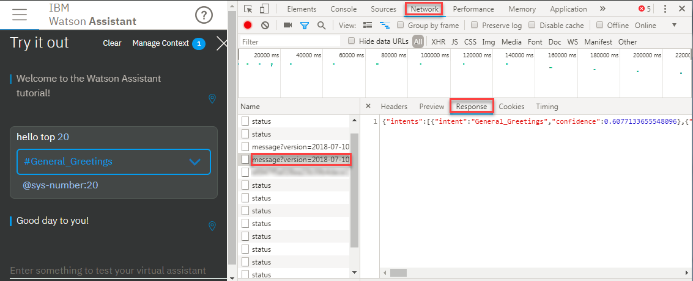

---

copyright:
  years: 2015, 2019
lastupdated: "2019-02-21"

subcollection: assistant

---

{:shortdesc: .shortdesc}
{:new_window: target="_blank"}
{:deprecated: .deprecated}
{:important: .important}
{:note: .note}
{:tip: .tip}
{:pre: .pre}
{:codeblock: .codeblock}
{:screen: .screen}
{:javascript: .ph data-hd-programlang='javascript'}
{:java: .ph data-hd-programlang='java'}
{:python: .ph data-hd-programlang='python'}
{:swift: .ph data-hd-programlang='swift'}
{:gif: data-image-type='gif'}

# ダイアログの作成のヒント
{: #dialog-tips}

ダイアログの作成に着手する方法と、より複雑な手順の実行に関するいくつかのヒントを得る方法について説明します。
{: shortdesc}

経験豊富なダイアログ・デザイナーからのこれらのヒントを確認してください。

## ダイアログ全体の計画
{: #dialog-tips-plan}

- ツールで単一のダイアログ・ノードを追加する前に、作成するダイアログの設計を慎重に計画します。必要に応じて紙にスケッチします。
- 可能な場合は、常に、実際の根拠と動作によるデータに基づいて設計を決定します。発生する可能性があると*考えた* 状況を処理するノードは追加しないでください。
- ビジネス・プロセスを現状のままコピーすることを避けます。会話型のビジネス・プロセスはほとんどありません。
- ユーザーがプロセスを既に使用している場合は、ユーザーがそのプロセスをどのように使用しているかを確認します。通常、ユーザーは会話の観点から、プロセスを最適化します。
- トーン、パーソナリティー、およびアシスタントの位置付けを決定します。作成したダイアログで、これらの選択が一貫して反映されます。
- アシスタントを人間であると偽って伝えないでください。ユーザーがアシスタントを人間と考え、そうでないことがわかった場合、アシスタントを信頼しなくなる可能性があります。
- すべてを会話にする必要があるわけではありません。Web フォームの方が適切に機能する場合があります。

## ノードの追加
{: #dialog-tips-nodes}

- ノードの目的を示すノード名を追加します。

  現時点でノードで実行される内容がわかっていても、数カ月にはわからなくなる場合があります。わかりやすいノード名を追加すると、将来的に自分自身およびチーム・メンバーにとって有益です。また、ノード名はログに表示されるため、今後の会話のデバッグに役立ちます。
- タスクを実行するために必要な情報を収集する場合は、情報をユーザーから引き出すために、個別のノードの集まりではなく、スロットを含むノードを使用してみてください。[スロットを使用した情報の収集](/docs/services/assistant?topic=assistant-dialog-slots)を参照してください。
- 複雑なプロセス・フローの場合、プロセスの開始時点で指定する必要がある情報についてユーザーに通知します。
- サービスによるダイアログ・ツリーの処理順序と、経路上でのフォルダー、ブランチ、ジャンプ先、および脱線の影響について理解します。[ダイアログのフロー](/docs/services/assistant?topic=assistant-dialog-overview#dialog-overview-flow)を参照してください。
- ジャンプ先はむやみに追加しないでください。ジャンプ先を追加すると、ダイアログ・フローが複雑化し、後でダイアログをデバッグすることが困難になります。
- 現在のノードと同じブランチのノードにジャンプするには、*「ジャンプ先 (Jump-to)」* ではなく*「ユーザー入力をスキップ (Skip user input)」* を使用します。

  このように選択すると、ジャンプ先の子ノードを削除または再配列するときに、現在のノードの設定を編集する必要がなくなります。[次の処理の定義](/docs/services/assistant?topic=assistant-dialog-overview#dialog-overview-jump-to)を参照してください。
- ノードからの脱線を有効にする前に、最も一般的なユーザー・シナリオをテストします。また、戻るために、考えられる脱線先ノードを必ず構成してください。[脱線](/docs/services/assistant?topic=assistant-dialog-runtime#dialog-runtime-digressions)を参照してください。

## 応答の追加
{: #dialog-tips-responses}

- 回答は、簡潔かつ有用になるようにします。
- 応答にユーザーのインテントを反映します。

  こうすることで、ユーザーに対し、ボットがユーザーを理解していることが示され、理解していない場合は、すぐに誤解を修正する機会がユーザーに与えられます。
- 回答が、頻繁に変更されるデータに依存する場合は、応答に外部サイトへのリンクのみを含めます。
- ボタンを過度に使用しないでください。ユーザーが一連のボタンから事前定義されたオプションを選択するようにすると、実際の会話との違いが大きくなり、ユーザーが真に求めることを学習する能力が低下します。実ユーザーが自分自身の言葉を使用して要求を伝達できるようにすると、この入力を使用してシステムをトレーニングし、より良いインテントを得ることができます。
- 1 つのノードで実行できるときは、ノードの集まりを使用しないでください。例えば、ユーザーが指定した詳細に応じてさまざまな応答を返す場合は、単一のノードに複数の条件付き応答を追加します。[条件付き応答](/docs/services/assistant?topic=assistant-dialog-overview#dialog-overview-multiple)を参照してください。
- 応答での言葉遣いには注意してください。システムに対するユーザーの反応は、単に応答をどのようなフレーズにするかに基づいて変化させることができます。1 行のテキストを変更することで、複雑なプログラムのソリューションを実装するために、複数行のコードを書き込む必要がなくなります。
- スキルを頻繁にバックアップします。[ダイアログ・スキルのダウンロード](/docs/services/assistant?topic=assistant-skill-add#skill-add-download)を参照してください。

## ユーザー入力から情報を取り込むためのヒント
{: #dialog-tips-user-input}

求める情報をユーザー入力から正確に取り込むためにダイアログ・ノードで使用する構文を知ることは、困難になる場合があります。一般的な目的に対応するために使用できる方法をいくつか示します。

- **ユーザーの入力を返す**: ユーザーが発したテキストをそのまま取り込み、それを応答で返すことができます。応答で次の SpEL 式を使用して、ユーザーが指定したテキストを応答で繰り返すことができます。

  `You said: <? input.text ?>.`

- **ユーザー入力の単語数の判別**: input.text オブジェクトでサポートされる任意のストリング・メソッドを実行できます。例えば、次の SpEL 式を使用して、ユーザー発話にある単語数を把握できます。

  `input.text.split(' ').size()`

  使用できるその他のメソッドについては、[式言語のメソッド](/docs/services/assistant?topic=assistant-dialog-methods#dialog-methods-strings)を参照してください。

- **複数のインテントの処理**: ユーザーの入力で、2 つの個別のタスクの完了を希望することが表現されます。`I want to open a savings account and apply for a credit card.` ダイアログでは、どのようにこの両方を認識して対処するのでしょうか。試行できる戦略については、Simon O'Doherty のブログの [Compound questions](https://sodoherty.ai/2017/02/06/compound-questions/){: new_window} の項目を参照してください。(Simon は、{{site.data.keyword.conversationshort}} チームの開発者です)。

- **あいまいなインテントの処理**: ユーザー入力で表現される希望があいまいで、サービスで、潜在的に対応するインテントを持つノードが複数検出されます。ダイアログは、後に続くダイアログのブランチをどのように認識するのでしょうか。明確化を有効にすると、オプションをユーザーに表示して、ユーザーに適切なものを選択するよう求めることができます。詳しくは、[明確化](/docs/services/assistant?topic=assistant-dialog-runtime#dialog-runtime-disambiguation)を参照してください。

- **入力に含まれている複数のエンティティーの処理**: あるエンティティー・タイプの最初に検出されたインスタンスの値のみを評価するには、`@entity:(specific-value)` ではなく、`@entity == 'specific-value'` という形式の構文を使用します。

  例えば、`@appliance == 'エアコン'` を使用すると、最初に検出された `@appliance` エンティティーの値のみが評価されます。 しかし、`@appliance:(エアコン)` を使用すると、`entity['appliance'].contains('エアコン')` に展開されます。これは、ユーザー入力に「エアコン」という値の `@appliance` エンティティーが 1 つ以上検出されたときに必ず一致します。

## 条件の使用上のヒント
{: #dialog-tips-condition-usage}

- **特殊文字を含む値があるかどうかを検査する**: エンティティーまたはコンテキスト変数に、アポストロフィ (') などの特殊文字を含む値が入っているかどうかを検査する場合は、検査する値を括弧で囲む必要があります。 例えば、エンティティーまたはコンテキスト変数に名前 `O'Reilly` が含まれているかどうかを検査するには、名前を括弧で囲む必要があります。

  `@person:(O'Reilly)` および `$person:(O'Reilly)`

  サービスは、これらの省略表現を以下の完全な SpEL 式に変換します。

  `entities['person']?.contains('O''Reilly')` および `context['person'] == 'O''Reilly'`

  SpEL では 2 つ目のアポストロフィを使用して、名前の中の単一のアポストロフィをエスケープします。
  {: note}

- **複数の値のチェック**: 複数の値をチェックする場合は、OR 演算子 (`||`) を使用する条件を作成して、条件に複数の値をリストできます。例えば、コンテキスト変数 `$state` にマサチューセッツ、メイン、またはニューハンプシャーの省略形が含まれる場合に true になる条件を定義するには、次の式を使用できます。

  `$state:MA || $state:ME || $state:NH`

- **数値のチェック**: 数値を比較する場合は、まずチェック対象のエンティティーまたは変数に値が含まれることを確認します。エンティティーまたは変数に数値が含まれない場合は、数値比較でヌル値 (0) として扱われます。

  例えば、ユーザー入力指定されたドルの値が 100 未満かどうかをチェックするとします。`@price < 100` という条件を使用し、`@price` エンティティーがヌルである場合、0 は 100 未満であるため、価格が設定されていなかったにもかかわらず、条件が `true` と評価されます。このタイプの不正確な結果を回避するには、`@price AND @price < 100` のような条件を使用します。`@price` に値がなければ、この条件は正しく false という結果を返します。

- **特定のインテント名パターンを持つインテントがあるかどうかを検査する**: パターンに一致するインテントを探す条件を使用できます。 例えば、「User_」で始まるインテント名のインテントを見つけるには、条件で次のような構文を使用します。

  `intents[0].intent.startsWith("User_")`

  ただし、この場合は、信頼度が 0.2 未満であっても、検出されたすべてのインテントが対象になります。 また、信頼度スコアに基づいて Watson が無関係と見なすインテントが返されていないことも検査してください。 そのためには、条件を次のように変更します。

  `!irrelevant && intents[0].intent.startsWith("User_")`

- **ファジー・マッチングがエンティティー認識に与える影響**: エンティティーを条件として使用し、ファジー・マッチングを有効にした場合、`@entity_name` が true と評価されるのは、一致の信頼度が 30% より大きい (`@entity_name.confidence > .3`) 場合のみです。

## 入力でのエンティティー・パターン・グループの格納および認識
{: #dialog-tips-get-pattern-groups}

パターン・エンティティーの値をコンテキスト変数に格納するには、エンティティー名に .literal を追加します。 この構文を使用すると、ユーザー入力のうち、指定したパターンと一致する正確な範囲のテキストが変数に格納されます。

| 変数   | 値               |
|------------|---------------------|
| email      | <? @email.literal ?> |

パターン・エンティティーに複数のグループを定義した場合に、単一グループのテキストを保管するには、保管するグループの配列番号を指定します。 例えば、@phone_number エンティティーのエンティティー・パターンが以下のように定義されているとします (括弧がパターン・グループを表すことに注意してください)。

`\b((958)|(555))-(\d{3})-(\d{4})\b`

ユーザー入力で指定された電話番号の市外局番だけを保管するには、以下の構文を使用します。

| 変数       | 値                         |
|----------------|-------------------------------|
| area_code      | <? @phone_number.groups[1] ?> |

グループ・パターンの定義に使用した正規表現ごとにグループに区切られます。 例えば、エンティティー `@phone_number` に定義したパターンに一致するユーザー入力が `958-234-3456` の場合、以下のグループが作成されます。

| グループ番号 | 正規表現エンジンの値  | ダイアログの値   | 説明 |
|--------------|---------------------|----------------|-------------|
| groups[0]    | `958-234-3456`      | `958-234-3456` | 最初のグループは、必ず、一致した文字列全体です。 |
| groups[1]    | `((958)`l`(555))`   | `958`          | 最初に定義されたグループの正規表現に一致する文字列。この場合は `((958)`l`(555))`。 |
| groups[2]    | `(958)`             | `958`          | OR 式の 1 つ目のオペランドとして指定されたグループと一致する `((958)`l`(555))` |
| groups[3]    | `(555)`             | `null`         | OR 式の 2 つ目のオペランドとして指定されたグループと一致しない `((958)`l`(555))` |
| groups[4]    | `(\d{3})`           | `234`          | グループに定義された正規表現に一致する文字列。 |
| groups[5]    | `(\d{4})`           | `3456`         | グループに定義された正規表現に一致する文字列。 |
{: caption="グループの詳細" caption-side="top"}

対象の入力部分を取得できるグループ番号を簡単に調べるには、一度にすべてのグループの情報を抽出します。 以下の構文を使用して、グループ分けされたすべてのパターン・エンティティーの一致部分を含む配列を返すコンテキスト変数を作成できます。

| 変数                 | 値                      |
|--------------------------|----------------------------|
| array_of_matched_groups  | <? @phone_number.groups ?> |

「Try it out」ペインを使用してテスト用の電話番号の値を入力します。 入力が `958-123-2345` の場合、この式によって `$array_of_matched_groups` に `["958-123-2345","958","958",null,"123","2345"]` が設定されます。

そのため、配列内の各値を 0 から始めてカウントすると、必要なグループのグループ番号がわかります。

| 配列要素の値 | 配列要素の番号 |
|---------------------|----------------------|
| "958-123-2345"      | 0 |
| "958"               | 1 |
| "958"               | 2 |
| null                | 3 |
| "123"               | 4 |
| "2345"              | 5 |
{: caption="配列エレメント" caption-side="top"}

結果から、例えば、電話番号の最後の 4 桁を取り込むには、グループ #5 が必要であることがわかります。

グループ分けされたパターン・エンティティーを表すために作成された JSONArray 構造を返すには、以下の構文を使用します。

| 変数             | 値                           |
|----------------------|---------------------------------|
| json_matched_groups  | <? @phone_number.groups_json ?> |

この式は、`$json_matched_groups` に以下の JSON 配列を設定します。

```json
[
  {"group": "group_0","location": [0, 12]},
  {"group": "group_1","location": [0, 3]},
  {"group": "group_2","location": [0, 3]},
  {"group": "group_3"},
  {"group": "group_4","location": [4, 7]},
  {"group": "group_5","location": [8, 12]}
]
```
{: codeblock}

`location` は、ゼロから始まる文字オフセットを使用して、入力テキストにおける検出されたエンティティー値の開始位置と終了位置を示す、エンティティーのプロパティーです。
{: note}

2 つの電話番号が入力として提供されることが想定される場合は、2 つの電話番号をチェックできます。 例えば、次の構文を使用して、2 つ目の番号の市外局番を取得できます。

| 変数         | 値                                       |
|------------------|---------------------------------------------|
| second_areacode  | <? entities['phone_number'][1].groups[1] ?> |

入力が `I want to change my phone number from 958-234-3456 to 555-456-5678` の場合、`$second_areacode` は `555` になります。

## API 呼び出しの詳細の表示
{: #dialog-tips-inspect-api}

「試行する (Try it out)」ペインを使用してダイアログをテストすると、サービスから返される基礎となる API 呼び出しがどのようなものなのかを把握できます。これらは、Web ブラウザーで提供される開発者用ツールを使用して検査できます。

例えば、Chrome から、「デベロッパー ツール」を開きます。「Network」ツールをクリックします。「Name」セクションに複数の API 呼び出しがリストされます。テスト発話に関連するメッセージ呼び出しをクリックして、「Response」列をクリックし、API 応答本文を表示します。ユーザー入力で認識されたインテントとエンティティーおよびその信頼度スコアが、呼び出し時点のコンテキスト変数の値とともにリストされます。構造化形式で応答本文を表示するには、「Preview」列をクリックします。


