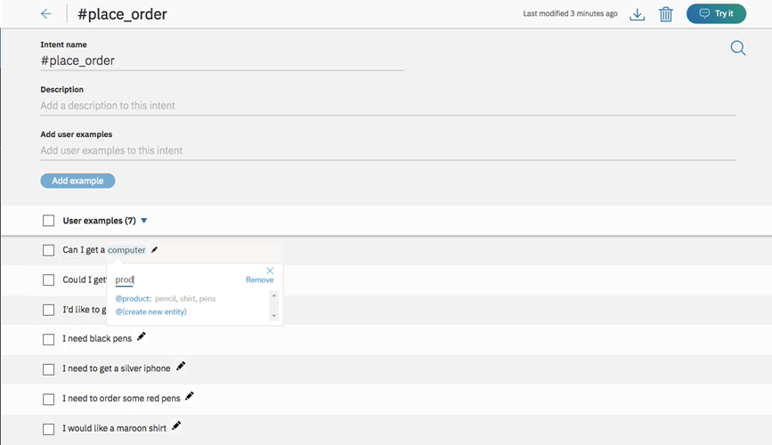
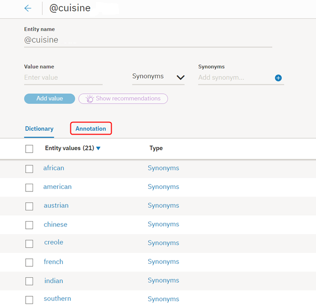
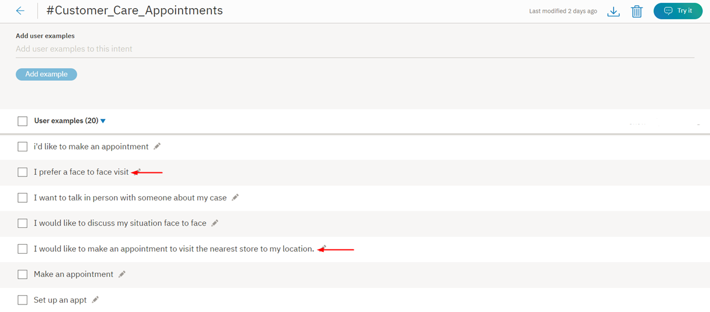
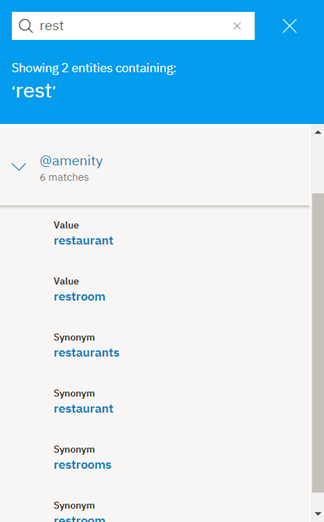

---

copyright:
  years: 2015, 2019
lastupdated: "2019-02-28"

subcollection: assistant

---

{:shortdesc: .shortdesc}
{:new_window: target="_blank"}
{:deprecated: .deprecated}
{:important: .important}
{:note: .note}
{:tip: .tip}
{:pre: .pre}
{:codeblock: .codeblock}
{:screen: .screen}
{:javascript: .ph data-hd-programlang='javascript'}
{:java: .ph data-hd-programlang='java'}
{:python: .ph data-hd-programlang='python'}
{:swift: .ph data-hd-programlang='swift'}

# エンティティーの作成
{: #entities}

***エンティティー*** とは、ユーザーの目的に関連した、ユーザー入力の情報を表しています。

インテントが動詞 (ユーザーが希望するアクション) を表す場合、エンティティーは名詞 (アクションの対象物またはコンテキスト) を表します。例えば、*インテント* が天気予報の取得のときは、アプリケーションで正確な予報が返されるようにするには、関連する場所と日付の*エンティティー* が必要です。

ユーザーの入力のエンティティーを認識すると、より有用なターゲット設定された応答を作成するのに役立ちます。例えば、`#buy_something` インテントがあるとします。ユーザーが `#buy_something` インテントをトリガーする要求を作成するときは、アシスタントの応答に、お客様が購入を希望する*もの* が何かについての認識が反映される必要があります。`@product` エンティティーを追加して使用し、お客様の興味のある製品に関するユーザー入力から、情報を抽出できます。(エンティティー名の前に付加される `@` は、エンティティーとして明確に識別するのに役立ちます。)

最後に、ユーザーの要求で検出された `@product` 値に基づいて、異なる言い回しで複数の応答をダイアログ・ツリーに追加できます。

<iframe class="embed-responsive-item" id="youtubeplayer" title="エンティティーの処理" type="text/html" width="640" height="390" src="https://www.youtube.com/embed/o-uhdw6bIyI" frameborder="0" webkitallowfullscreen mozallowfullscreen allowfullscreen> </iframe>

## エンティティーの評価の概要
{: #entities-described}

次のいずれかの評価メソッドを使用することで、サービスによってユーザー入力のエンティティーが検出されます。

### 辞書ベースのメソッド
{: #entities-dictionary-overview}

サービスでは、エンティティーに定義した値、同義語、またはパターンに一致するユーザー入力内の用語が検索されます。

- **同義語エンティティー**: エンティティーとして用語のカテゴリー (`color`) を定義してから、そのカテゴリーの 1 つ以上の値 (`blue`) を定義します。値ごとに、同義語の集まり (`aqua`、`navy`) を指定します。サービスによる推奨から、追加する同義語を選択することもできます。

    実行時には、サービスによって、そのエンティティーの言及としてエンティティーに定義した値または同義語に完全一致するユーザー入力内の用語が認識されます。
- **パターン・エンティティー**: エンティティーとして用語のカテゴリー (`contact_info`) を定義してから、そのカテゴリーの 1 つ以上の値 (`email`) を定義します。値ごとに、その値タイプの言及のテキスト・パターンを定義する正規表現を指定します。`email` エンティティー値には、`text@text.com` パターンを定義する正規表現を指定できます。

    実行時には、サービスによって、ユーザー入力の正規表現に一致するパターンが検索されて、すべての一致がそのエンティティーの言及として識別されます。
- **システム・エンティティー**: IBM によって事前作成されている同義語エンティティーです。これらは、数値、日付、時刻などの一般的に使用されるカテゴリーをカバーします。単純にシステム・エンティティーを有効にして、使用を開始します。

### コンテキスト・ベースのメソッド
{: #entities-annotations-overview}

コンテキスト・エンティティーを定義すると、*注釈付きの用語* と、注釈を付けた文の用語が使用される*コンテキスト* の両方でモデルがトレーニングされます。この新しいコンテキスト・エンティティー・モデルにより、単語または句がユーザー入力でどのように使用されるかに基づいて、単語または句がエンティティーのインスタンスになる可能性を示す信頼度スコアをサービスで計算できるようになります。

- **コンテキスト・エンティティー**: まず、エンティティーとしての用語のカテゴリー (`product`) を定義します。次に、*インテント* のページに移動し、エンティティーの言及を検出するための既存のインテントのユーザー例をマイニングし、そのようにラベル付けします。例えば、`#buy_something` インテントに移動し、`I want to buy a Coach bag` というユーザー例を見つけることができます。`@product` エンティティーの言及として `Coach bag` のラベルを付けることができます。

    トレーニング目的で、注釈を付けた用語 `Coach bag` は、`@product` エンティティーの値として追加されます。

    実行時には、サービスによって、文で用語が使用されるコンテキストのみに基づいて用語が評価されます。用語に言及するユーザー要求の構造が、言及がラベル付けされたインテントのユーザー例の構造と一致する場合、サービスによって、そのエンティティー・タイプの言及としてその用語が解釈されます。例えば、ユーザー入力に発話 `I want to buy a Gucci bag` が含まれるとします。この文の構造は、注釈を付けたユーザー例 (`I want to buy a Coach bag`) に似ているため、サービスによって、`Gucci bag` が `@product` エンティティーの言及として認識されます。

    エンティティーにコンテキスト・エンティティー・モデルが使用される場合、サービスによってユーザー入力のエンティティーに完全一致するテキストまたはパターンが検索されることはあり*ません* が、代わりにエンティティーが言及された文のコンテキストがフォーカスされます。

    注釈を使用してエンティティーの値を定義する場合は、エンティティーごとに少なくとも 10 個の注釈を追加して、信頼できるようにするための十分なデータをコンテキスト・エンティティー・モデルに付与します。

## エンティティーの作成
{: #entities-creating-task}

{{site.data.keyword.conversationshort}} ツールを使用してエンティティーを作成します。

1.  {{site.data.keyword.conversationshort}} ツールでワークスペースを開き、**「Entities」**タブをクリックします。 **「Entities」**が表示されていない場合は、 メニューを使用してページを開きます。

1.  **「エンティティーの追加 (Add entity)」**をクリックします。

    または、**「Use System Entities」**をクリックして、{{site.data.keyword.IBM_notm}} 提供の共通エンティティーのリストから選択することもできます。それらのエンティティーは、どのようなユース・ケースにも適用可能です。 詳しくは、[システム・エンティティーの有効化](#entities-enable-system-entities)を参照してください。

1.  **「エンティティー名 (Entity name)」**フィールドに、このエンティティーを表す名前を入力します。

    エンティティー名には、文字 (ユニコード)、数字、下線、ハイフンを使用できます。 次に例を示します。
    - `@location`
    - `@menu_item`
    - `@product`

    名前にスペースを含めないでください。64 文字を超える名前を指定することはできません。 名前の先頭にストリング `sys-` を付けることはできません。このストリングはシステム・エンティティー用に予約済みであるためです。

    このツールが自動的にエンティティー名に @ 文字を含めるため、この文字を追加する必要はありません。
    {: tip}

1.  **「エンティティーの作成 (Create entity)」**をクリックします。

    

1.  このエンティティーに対して、サービスでそのエンティティーの言及を見つけるために、辞書ベースの方法を使用するか、コンテキスト・ベースの方法を使用するかを選択し、該当する手順に従います。

    **作成するエンティティーごとに、使用するエンティティー・タイプを 1 つのみ選択します。**エンティティーに注釈を追加するとすぐにコンテキスト・モデルが初期化されて、コンテキスト・モデルが、そのエンティティーの言及を見つけるためにユーザー入力を分析する 1 次的な方法になります。ユーザー入力で言及が使用されるコンテキストは、完全一致 (存在する場合) よりも優先されます。各タイプが評価される方法について詳しくは、[エンティティーの評価の概要](#entities-described)を参照してください。

    - [辞書ベースのエンティティー](#entities-create-dictionary-based)
    - [コンテキスト・ベースのエンティティー](#entities-create-annotation-based)

## 辞書ベースのエンティティーの追加
{: #entities-create-dictionary-based}

辞書ベースのエンティティーは、特定の用語、同義語、またはパターンを定義するエンティティーです。実行時には、ユーザー入力の用語が値またはそのいずれかの同義語に完全一致 (またはファジー・マッチングが有効の場合は近似一致) する場合にのみ、サービスによって、エンティティー言及が検索されます。

1.  **「値の名前 (Value name)」**フィールドに、エンティティーに対して指定できる値のテキストを入力して、`Enter` キーを押します。 エンティティー値には、最大で 64 文字までの任意のストリングを使用できます。

    **重要:** エンティティーの名前と値には、機密情報や個人情報を含めないでください。 それらの名前や値は、アプリの URL として露出する可能性があります。

1.  指定したエンティティーの値および同義語に類似した構文の用語をサービスで認識する必要があり、完全一致する必要がない場合は、**「ファジー・マッチング (Fuzzy Matching)」**トグルをクリックしてオンにします。

    この機能は、[サポートされる言語](/docs/services/assistant?topic=assistant-language-support)トピックに示された言語で使用可能です。

    **ファジー・マッチング**
    {: #entities-fuzzy-matching}

    ファジー・マッチングは、以下のコンポーネントで構成されています。

    - *ステミング* - 文法的にさまざまな語形を取るエンティティー値の、語幹の形式を識別します。 例えば、「bananas」の語幹は「banana」、「running」の語幹は「run」などとなります。
    - *ミススペル* - つづりの誤りや構文上の微妙な違いがあっても、対応する適切なエンティティーにユーザー入力をマップすることができます。 例えば、*giraffe* を動物のエンティティーの同義語として定義したときに、*giraffes* や *girafe* という用語がユーザー入力に含まれる場合、ファジー・マッチングによって、その用語を動物のエンティティーに適切にマップできます。
    - *部分一致* - 部分一致により、ユーザー定義エンティティーに存在する、サブストリングに基づいた同義語を自動的に提案します。そして、エンティティーの完全一致と比較して、それより低い信頼性スコアを割り当てます。

    英語のファジー・マッチングでは、一般的で有効な英単語のいくつかは、特定のエンティティーのファジー・マッチとして取り込まれません。 この機能は、標準的な英語の辞書の単語を使用します。 英語のエンティティー値/同義語を定義することもできます。この場合、ファジー・マッチングは、定義したエンティティー値/同義語のみとマッチングされます。 例えば、ファジー・マッチングでは用語 `unsure` と `insurance` がマッチングされる可能性がありますが、`unsure` を `@option` のようなエンティティーの値/同義語として定義すると、`unsure` は `insurance` とはマッチングされず、常に `@option` とマッチングされます。
    {: note}

    ファジー・マッチングの設定が同義語の推奨に影響することはありません。ファジー・マッチングが有効になっている場合でも、同義語は指定した正確な値に対してのみ提案され、その値や値のバリエーションに対しては提案されません。

1.  値の名前を入力したら、そのエンティティー値について、同義語を追加したり特定のパターンを定義したりできます。これを行うには、*「タイプ」*ドロップダウン・メニューから`「同義語 (Synonyms)」`または`「パターン (Patterns)」`を選択します。

    

    **注:** 1 つのエンティティー値に対して、同義語またはパターンの*どちらか一方* を追加できます。両方を追加することはできません。

    ***同義語***
    {: #entities-synonyms}

    - **「同義語 (Synonyms)」**フィールドに、エンティティー値の同義語を入力します。同義語として、最大で 64 文字までの任意のストリングを使用できます。

      

      {{site.data.keyword.conversationshort}} サービスで、エンティティー値の同義語を推奨することもできます。この推奨機能では、記述されたテキストの大規模なソースを含む、膨大な既存の情報から抽出されたコンテキストの類似性に基づいて、関連する同義語が検索されます。また、エンティティー値の既存の同義語に類似する単語を識別するために、自然言語処理の手法が使用されます。

    - **「推奨の表示 (Show recommendations)」**をクリックします。

    - {{site.data.keyword.conversationshort}} サービスでは、同義語についてのいくつかの推奨が行われます。用語は小文字で表示されますが、サービスでは、小文字で指定されたか大文字で指定されたかに関係なく、同義語の言及が認識されます。

      エンティティー値の同義語がコヒーレントになるほど、推奨の関連性が高まり、より適切にフォーカスされます。例えば、テーマに対してフォーカスされたいくつかの単語がある場合、1 つまたは 2 つのランダムな単語がある場合よりも適切な提案が得られます。
      {: tip}

      

    - 追加する同義語を選択して、**「選択した項目の追加 (Add selected)」**をクリックします。

      追加対象として選択したすべての同義語に対して**「選択した項目の追加 (Add selected)」**ボタンをクリックする必要があります。このボタンを最初にクリックしないで次のセットに移動すると、選択内容が失われます。

      

    - {{site.data.keyword.conversationshort}} サービスによって、これらの同期語がエンティティーに追加されて、追加の同義語が提案されます。

      追加の同義語の推奨が表示されない場合は、エンティティーが既に適切に定義されているか、推奨機能で現在拡張できないコンテンツが含まれている可能性があります。
      {: tip}

      推奨された同義語を選択しないことを選択した場合は、興味のない用語としてその同義語が処理され、`「選択した項目の追加 (Add selected)」` または `「次のセット (Next set)」`を押したときに表示される次の推奨のセットが変更されます。この推論が持続するのは、同義語を選択しているときのみです。スキップされた同義語に関する情報は、他の目的でサービスによって使用されることはありません。
      {: note}

      

      必要に応じて同義語の追加を続けます。推奨の受け入れを完了したら、**「X」**をクリックして閉じます。

    ***パターン***
    {: #entities-patterns}

    - **「Patterns」**フィールドでは、エンティティー値に対して特定のパターンを定義できます。 パターンは**必ず**、正規表現としてフィールドに入力してください。

      - エンティティー値ごとに、最大 5 個のパターンを追加できます。
      - 各パターン (正規表現) は 512 文字に制限されます。

      
      {: #entities-pattern-entities}

      この例では、エンティティー *ContactInfo* について、電話番号、E メール、Web サイトの値のパターンを以下のように定義できます。
      - 電話番号
        - `localPhone`: `(\d{3})-(\d{4})`。例: 426-4968
        - `fullUSphone`: `(\d{3})-(\d{3})-(\d{4})`。例: 800-426-4968
        - `internationalPhone`: `^(\(?\+?[0-9]*\)?)?[0-9_\- \(\)]*$`。例: +44 1962 815000
      - `email`: `\b[A-Za-z0-9._%+-]+@[A-Za-z0-9.-]+\.[A-Za-z]{2,}\b`。例: name@ibm.com
      - `website`: `(https?:\/\/)?([\da-z\.-]+)\.([a-z\.]{2,6})([\/\w \.-]*)*\/?$`。例: https://www.ibm.com

      パターン・エンティティーを使用する場合はたいてい、対話ツリー内から、コンテキスト変数 (またはアクション変数) に、パターンと一致するテキストを格納する必要があります。 詳細については、[コンテキスト変数の定義](/docs/services/assistant?topic=assistant-dialog-runtime#dialog-runtime-context-var-define)を参照してください。

      これから、ユーザーに E メール・アドレスを要求するケースを検討します。 対話ノード条件には、`@contactInfo:email` のような条件が入ります。 ユーザーが入力した E メールをコンテキスト変数として割り当てるには、以下の構文を使用して、対話ノードの応答セクション内でパターン・マッチを取り込むことができます。

      <table>
      <caption>パターンの保存</caption>
        <tr>
          <th>変数</th>
          <th>値</th>
        </tr>
        <tr>
          <td>email</td>
          <td>`<? @contactInfo.literal ?>`</td>
        </tr>
      </table>

      ***グループの取り込み***
      {: #entities-capture-group}

      正規表現の場合、パターンの普通の括弧に囲まれた部分は、1 つのグループとして取り込まれます。 例えば、エンティティー `@ContactInfo` には、以下の 3 つのグループが取り込まれて含まれている `fullUSphone` というパターン値があります。

      - `(\d{3})` - 米国の市外局番
      - `(\d{3})` - 接頭部
      - `(\d{4})` - 回線番号

      グループ化が役立つ可能性がある場合の例としては、{{site.data.keyword.conversationshort}} サービスがユーザーに電話番号を尋ねた後、応答でユーザーから提供された番号の市外局番のみを使用するようにしたい場合などがあります。

      ユーザーが入力した市外局番をコンテキスト変数として割り当てるには、以下の構文を使用して、ダイアログ・ノードの応答セクション内でそのグループと一致するものを取り込むことができます。

      <table>
      <caption>キャプチャー・グループの保存</caption>
        <tr>
          <th>変数</th>
          <th>値</th>
        </tr>
        <tr>
          <td>area_code</td>
          <td>`<? @ContactInfo.groups[1] ?>`</td>
        </tr>
      </table>

      ダイアログのキャプチャー・グループの使用法に関する追加情報については、[入力でのエンティティー・パターン・グループの格納および認識](/docs/services/assistant?topic=assistant-dialog-tips#dialog-tips-get-pattern-groups)を参照してください。

      {{site.data.keyword.conversationshort}} サービスで使用されるパターン・マッチング・エンジンには、構文上の制約がいくつかあります。これらの制約は、他の正規表現エンジンを使用するときに生じる可能性がある、パフォーマンス上の問題を回避するために必要です。

      - 以下の内容をエンティティー・パターンに含めることはできません。
        - 正の反復 (例: `x*+`)
        - 逆参照 (例: `\g1`)
        - 条件付きブランチ (例: `(?(cond)true)`)
      - パターン・エンティティーの先頭または末尾が Unicode 文字で、ワード境界 (`\bš\b` など) が含まれている場合、パターン・マッチングはワード境界と正確に一致しません。 この例では、入力が `š zkouška` の場合、マッチングにより `Group 0: 6-7 š` (`š zkou`_**`š`**_`ka`) が返され、正しい結果である `Group 0: 0-1 š` (_**`š`**_ `zkouška`) は返されません。

      正規表現エンジンは、Java 正規表現エンジンにおおまかに基づいています。 サポートされないパターンを API によって、または {{site.data.keyword.conversationshort}} サービスのツール UI 内からアップロードしようとすると、{{site.data.keyword.conversationshort}} サービスはエラーを生成します。

1.  **「値の追加 (Add value)」**をクリックしてプロセスを繰り返すことで、さらにエンティティー値を追加します。

1.  エンティティー値の追加が終了したら、 をクリックしてエンティティーの作成を終了します。

作成したエンティティーが**「Entities」**タブに追加され、新規データについてのシステムのトレーニングが開始されます。

## コンテキスト・エンティティーの追加
{: #entities-create-annotation-based}

コンテキスト・ベースのエンティティーは、エンティティーが通常使用されるコンテキストについてサービスに学習させるために、サンプル文のエンティティーの出現に注釈を付けるエンティティーです。

コンテキスト・エンティティー・モデルをトレーニングするために、注釈を付けるための容易に使用可能な文を提供するインテントの例を活用できます。

コンテキスト・エンティティーを定義するためにインテントのユーザー例を使用しても、そのインテントの分類には影響しません。ただし、ラベルを付けたエンティティー言及もそのエンティティーに同義語として追加されます。また、インテントの分類で、インテントのユーザー例の同義語の言及が使用されて、インテントとエンティティーの間に弱参照が確立されます。
{: note}

1.  {{site.data.keyword.conversationshort}} ツールで、スキルを開き、**「インテント (Intents)」**タブをクリックします。**「インテント (Intents)」**が表示されない場合、 メニューを使用してこのページを開きます。

1.  インテントをクリックして開きます。

    この例では、インテント `#place_order` によって、オンライン小売業者のオーダー機能が定義されます。

    

1.  インテントの例で、潜在的なエンティティー言及について確認します。インテントの例から、潜在的なエンティティー言及を強調表示します。

    この例では、`computer` がエンティティー言及です。

    

    編集アイコン  は、インテントのユーザー例を編集するために使用されます。注釈の追加には関連しません。
    {: tip}

1.  検索ボックスが開きます。これを使用して、強調表示された単語または句が言及であるエンティティーを検索できます。

    

    この例では、`prod` を検索して、`@product` エンティティーの一致が表示されています。

    

    エンティティーに既存のエンティティー値が含まれる場合は、それが通知の目的のみで表示されます。注釈は、特定のエンティティー値ではなく、エンティティーに追加します。

    言及が既存のエンティティー値と同義であることをモデルに学習させる場合は、それを特定のエンティティー値に関連付けることができます。
    {: important}

    言及を特定のエンティティー値に関連付けるには、次の手順を実行します。

    1.  検索フィールドに、完全なエンティティーの名前と値を入力します。例えば、`@product:IT` と入力します。
    1.  ドロップダウン・メニューにエンティティー値が表示されたら、選択します。

1.  注釈を追加するエンティティーを選択します。

    この例では、`computer` が `@product` エンティティーの注釈として追加されます。

    コンテキスト・エンティティーごとに、*少なくとも* 10 個の注釈を作成します。実稼働環境で使用する場合は、これよりも注釈を増やすことをお勧めします。
    {: important}

1.  適切なエンティティーがない場合は、**「@(新しいエンティティーの作成) (@(create new entity))」**を選択して、新しいエンティティーを作成できます。

1.  注釈を付けるエンティティー言及ごとにこのプロセスを繰り返します。

    編集するユーザー例に出現するエンティティー・タイプのすべての言及に注釈を付けてください。詳しくは、[注釈を付けないことによる問題](#entities-counter-examples)を参照してください。
    {: important}

1.  ここで、先ほど作成した注釈をクリックします。ボックスが開き、`Go to:<entity-name>` と表示されます。このリンクをクリックすると、エンティティーに直接移動します。

    

    関連付けたエンティティーに注釈が追加され、システムはこれらの新規データでシステム自体のトレーニングを開始します。

    注釈を付けた用語が、新しい辞書の値としてエンティティーに追加されます。注釈付きの用語を既存のエンティティー値に関連付けた場合、その用語は、独立したエンティティー値としてではなく、そのエンティティー値の同義語として追加されます。
    {: important}

1.  特定のエンティティーの注釈を付けたすべての言及を表示するには、エンティティーの構成ページから、**「注釈 (Annotation)」**タブをクリックします。

    

    コンテキスト・エンティティーでは、明示的に定義されていない値が認識されます。システムによって、ユーザー例が注釈付けされる方法に基づいて追加のエンティティー値に関する予測が行われ、その値を使用してその他のエンティティーがトレーニングされます。類似のユーザー例が*「注釈 (Annotation)」*ビューに追加されるため、このオプションがトレーニングにどのように影響するかを確認できます。
    {: note}

    この拡張されたエンティティー値の理解能力を使用するコンテキスト・エンティティーが不要な場合は、*「注釈 (Annotation)」*ビューでそのエンティティーについてのすべてのユーザー例を選択して、**「削除」**をクリックします。

以下の動画は、エンティティー言及に注釈を付ける方法を示します。

<iframe class="embed-responsive-item" id="youtubeplayer0" title="エンティティー言及への注釈付け" type="text/html" width="640" height="390" src="https://www.youtube.com/embed/3WjzJpLsnhQ" frameborder="0" webkitallowfullscreen mozallowfullscreen allowfullscreen> </iframe>

コンテキスト・エンティティーを独自に追加する前に定義する方法を示すチュートリアルを確認するには、[チュートリアル: コンテキスト・エンティティーの定義 ](https://www.ibm.com/cloud/garage/demo/try-watson-assistant-contextual-entities){: new_window} に移動します。

### 注釈を付けないことによる問題
{: #entities-counter-examples}

注釈を含むインテントの例があり、その例の別の単語が同じエンティティーの値または同義語と一致するが、その値に注釈が付けられて*いない* 場合、注釈を付けなかったことによる影響が発生します。モデルは、注釈を付けなかった用語のコンテキストからも学習します。したがって、ある用語にユーザー例のエンティティーの言及としてラベルを付けた場合、その他の該当するすべての言及にもラベルを付けてください。

1.  `#Customer_Care_Appointments` インテントには、単語 `visit` を持つ 2 つのインテントの例が含まれています。

    

1.  最初の例では、`@meeting` エンティティーのエンティティー値として単語 `visit` に注釈を付ける必要があります。これにより、「I'd like to make an appointment」または「I'd like to schedule a visit」のように、`visit` が `appointment` などの他の `@meeting` エンティティー値と同等になります。

    

1.  2 番目の例では、単語 `visit` が meeting とは異なるコンテキストで使用されています。この場合、インテントの例から単語 `appointment` を選択して、`@meeting` エンティティーのエンティティー値として注釈を付けることができます。モデルは、同じ例の単語 `visit` に注釈が付けられていない事実から学習します。

    

## システム・エンティティーの有効化
{: #entities-enable-system-entities}

{{site.data.keyword.conversationshort}} サービスには、どのアプリケーションでも使用できる共通エンティティーである、*システム・エンティティー* が多数用意されています。 システム・エンティティーを有効にすると、多くのユース・ケースに共通のトレーニング・データを、スキルに迅速に取り込むことができます。

システム・エンティティーを使用すると、それらのエンティティーが表すオブジェクト・タイプの、広範囲の値を認識することができます。 例えば、`@sys-number` システム・エンティティーは、単語として表記された数字も含め、整数、小数など、あらゆる数値と一致します。

システム・エンティティーは一元的に管理されているため、更新内容は自動的に使用できるようになります。 システム・エンティティーを変更することはできません。

1.  「Entities」タブで**「System entities」**をクリックします。

    

1.  システム・エンティティーのリストを参照して、対象のアプリケーションで役立つものを選択します。
    - 一致する入力データの例を含め、システム・エンティティーに関する詳細情報を表示するには、リスト内のエンティティーをクリックします。
    - 使用できるシステム・エンティティーについて詳しくは、[システム・エンティティー](/docs/services/assistant?topic=assistant-system-entities)を参照してください。

1.  各システム・エンティティーの横にある切り替えスイッチをクリックすると、有効または無効にできます。

システム・エンティティーを有効にした後、{{site.data.keyword.conversationshort}} サービスはリトレーニングを開始します。 トレーニングが完了したら、エンティティーを使用できるようになります。

## エンティティーの制限
{: #entities-limits}

作成できるエンティティーの数、エンティティー値の数、同義語の数は、{{site.data.keyword.conversationshort}} のサービス・プランに応じて異なります。

| サービス・プラン      | 1 スキルあたりのエンティティーの数 | 1 スキルあたりのエンティティーの値 | 1 スキルあたりのエンティティーの同義語の数 |
|-------------------|-------------------:|------------------------:|--------------------------:|
| プレミアム           |               1000 |                 100,000 |                   100,000 |
| プラス              |               1000 |                 100,000 |                   100,000 |
| 標準          |               1000 |                 100,000 |                   100,000 |
| ライト              |                 25 |                 100,000 |                   100,000 |
{: caption="サービス・プランの詳細" caption-side="top"}

使用可能にしたシステム・エンティティーは、プラン使用量合計に加算されます。

| サービス・プラン | コンテキスト・エンティティーおよび注釈 |
|--------------|------------------------------------:|
| プレミアム      |        30 個のコンテキスト・エンティティーと 3000 個の注釈 |
| プラス         |        20 個のコンテキスト・エンティティーと 2000 個の注釈 |
| 標準     |        20 個のコンテキスト・エンティティーと 2000 個の注釈 |
| ライト         |        10 個のコンテキスト・エンティティーと 1000 個の注釈 |
{: caption="サービス・プランの詳細 (続き)" caption-side="top"}

## エンティティーの編集
{: #entities-edit}

リスト内の任意のエンティティーをクリックして開き、編集することができます。 エンティティーをリネームまたは削除したり、値、同義語、パターンを追加、編集、削除したりできます。

エンティティー・タイプを `synonym` から `pattern` に変更したりその逆に変更したりすると、既存の値は変換されますが、そのままでは役立たない可能性があります。
{: note}

## エンティティーの検索
{: #entities-search}

検索機能を使用して、エンティティー名、値、同義語を検索します。

1.  **「エンティティー (Entities)」**ページから検索アイコンをクリックします。

    

    システム・エンティティーは検索できません。
    {: note}

1.  検索対象の語句を入力します。

    

検索語が含まれるエンティティーと、対応する例が表示されます。

  

## エンティティーのエクスポート
{: #entities-export}

多数のエンティティーを CSV ファイルにエクスポートすることで、それらのエンティティーを別の {{site.data.keyword.conversationshort}} アプリケーションにインポートして再使用できるようになります。

- パターン情報は CSV エクスポートに含まれます。`/` で囲まれたストリングは、(同義語ではなく) パターンと見なされます。
- コンテキスト・エンティティーに関連付けられた注釈はエクスポートされません。ダイアログ・スキル全体をエクスポートして、エンティティー値とすべての関連する注釈の両方を取り込む必要があります。

1.  対象のエンティティーを選択してから、**「エクスポート」**をクリックします。

    

## エンティティーのインポート
{: #entities-import}

多数のエンティティーがある場合、{{site.data.keyword.conversationshort}} ツールで 1 つずつ定義するよりも、コンマ区切り値 (CSV) ファイルからインポートする方が簡単です。

エンティティーの注釈は、エンティティーの CSV ファイルのインポートには含まれません。ダイアログ・スキル全体をインポートして、そのスキルのコンテキスト・エンティティーの関連する注釈を保持する必要があります。エンティティーのみをエクスポートしてインポートする場合、エクスポートしたコンテキスト・エンティティーは、インポート後に辞書ベースのエンティティーとして処理されます。
{: note}

1.  エンティティーを CSV ファイルにまとめるか、またはスプレッドシート内のエンティティーを CSV ファイルにエクスポートします。 ファイルの各行のフォーマットは、以下のようにする必要があります。

    ```
    <entity>,<value>,<synonyms>
    ```
    {: screen}

    ここで、&lt;entity&gt; はエンティティーの名前で、&lt;value&gt; はエンティティーの値で、&lt;synonyms&gt; はその値の同義語からなるコンマ区切りリストです。

    ```
    weekday,Monday,Mon
    weekday,Tuesday,Tue,Tues
    weekday,Wednesday,Wed
    weekday,Thursday,Thur,Thu,Thurs
    weekday,Friday,Fri
    weekday,Saturday,Sat
    weekday,Sunday,Sun
    month,January,Jan
    month,February,Feb
    month,March,Mar
    month,April,Apr
    month,May
    ```
    {: screen}

    CSV ファイルをインポートする際には、パターンもサポートされます。 `/` で囲まれたストリングは、(同義語ではなく) パターンと見なされます。

    ```
    ContactInfo,localPhone,/(\d{3})-(\d{4})/
    ContactInfo,fullUSphone,/(\d{3})-(\d{3})-(\d{4})/
    ContactInfo,internationalPhone,/^(\(?\+?[0-9]*\)?)?[0-9_\- \(\)]*$/
    ContactInfo,email,/\b[A-Za-z0-9._%+-]+@[A-Za-z0-9.-]+\.[A-Za-z]{2,}\b/
    ContactInfo,website,/(https?:\/\/)?([\da-z\.-]+)\.([a-z\.]{2,6})([\/\w \.-]*)*\/?$/
    ```
    {: screen}

    CSV ファイルは、バイト・オーダー・マーク (BOM) を付加せず、UTF-8 エンコードで保存します。 CSV ファイルの最大サイズは 10MB です。 CSV ファイルがこれより大きい場合は、複数のファイルに分割し、別々にインポートすることを検討してください。  {{site.data.keyword.conversationshort}} ツールでワークスペースを開き、**「Entities」**タブをクリックします。
    {: tip}

1.   をクリックしてから、ファイルをドラッグするか、またはコンピューターにあるファイルを参照して選択します。 ファイルは検証されてインポートされます。そして、新規データについてのシステムのトレーニングが開始されます。

「Entities」タブで、インポートされたエンティティーを表示できます。 新しいエンティティーを表示するために、ページの最新表示が必要な場合もあります。

## エンティティーの削除
{: #entities-delete}

複数のエンティティーを選択して、削除することができます。

**重要**: エンティティーを削除すると、関連付けられたすべての値、同義語、またはパターンも削除され、それらの項目を後で取り出すことができなくなります。 それらのエンティティーまたは値を参照しているすべての対話ノードについては、削除されたコンテンツを今後参照することがないように、手動で更新する必要があります。

1.  削除する対象のエンティティーを選択し、**「削除 (Delete)」**をクリックします。

    
