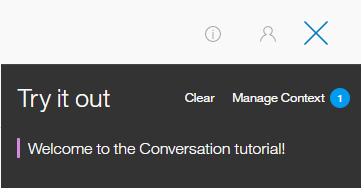
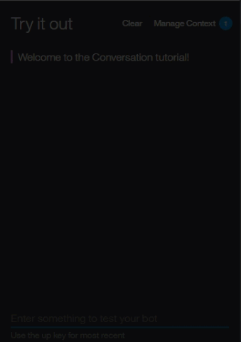

---

copyright:
  years: 2015, 2018
lastupdated: "2018-02-16"

---

{:shortdesc: .shortdesc}
{:new_window: target="_blank"}
{:tip: .tip}
{:pre: .pre}
{:codeblock: .codeblock}
{:screen: .screen}
{:javascript: .ph data-hd-programlang='javascript'}
{:java: .ph data-hd-programlang='java'}
{:python: .ph data-hd-programlang='python'}
{:swift: .ph data-hd-programlang='swift'}
{:download: .download}

# 概説チュートリアル
{: #getting-started}

この簡潔なチュートリアルでは、{{site.data.keyword.conversationshort}} ツールを紹介し、最初の会話を作成するプロセスを示します。
{: shortdesc}

## 始める前に
{: #prerequisites}

開始するにはサービス・インスタンスが必要です。

<!-- Remove the text marked `download` after there's no g-s tab in the catalog dashboard -->

サービス・インスタンスは作成済みです。**「管理」**、**「ツールの起動 (Launch Tool)」**の順にクリックします。 ステップ 2 に進みます。
{: download tip}

{{site.data.keyword.conversationshort}} サービスでプロジェクトを作成した場合、これらの前提条件はすべて設定されています。ステップ 1 に進みます。

1.  {{site.data.keyword.watson}} Developer Console の[サービス ](https://console.{DomainName}/developer/watson/services){: new_window} のページに移動します。
1.  {{site.data.keyword.conversationshort}} を選択し、**「サービスの追加」**をクリックし、無料の {{site.data.keyword.Bluemix_notm}} アカウントに登録するか、ログインします。
1.  プロジェクト名を `conversation-tutorial` に変更してから、**「プロジェクトの作成 (Create Project)」**をクリックします。

<!-- Remove this text after dedicated instances have the developer console: begin -->

{{site.data.keyword.Bluemix_dedicated_notm}} を使用する場合、カタログの [{{site.data.keyword.conversationshort}} ](https://console.{DomainName}/catalog/services/conversation/){: new_window} ページからサービス・インスタンスを作成します。

<!-- Remove this text after dedicated instances have the developer console: end -->

## ステップ 1: ツールを起動する
{: #launch-tool}

{{site.data.keyword.conversationshort}} サービスを含むプロジェクトを作成すると、プロジェクトの詳細ページが表示されます。ここから  {{site.data.keyword.conversationshort}} ツールを起動します。

**「サービス」**の下で、{{site.data.keyword.conversationshort}} の**「ツールの起動 (Launch Tool)」**をクリックします。

<!-- To do: Add screenshot for developer console -->

ツールへのログインを求めるプロンプトが出されたら、{{site.data.keyword.Bluemix_notm}} の資格情報を入力します。

{{site.data.keyword.conversationshort}} サービスのプロジェクトの詳細ページが表示されていない場合は、{{site.data.keyword.watson}} Developer Console の[プロジェクト ](https://console.{DomainName}/developer/watson/projects) のページに移動して、該当するプロジェクトを選択します。
{: tip}

<!-- Remove this text after dedicated instances have the developer console: begin -->

{{site.data.keyword.Bluemix_dedicated_notm}}: ダッシュボードから該当するサービス・インスタンスを選択してツールを起動します。

<!-- Remove this text after dedicated instances have the Developer Console: end -->

## ステップ 2: ワークスペースを作成する
{: #create-workspace}

{{site.data.keyword.conversationshort}} ツールでの最初のステップとして、ワークスペースを作成します。

[*ワークスペース*](configure-workspace.html) とは、会話フローを定義する成果物のコンテナーです。

1.  {{site.data.keyword.conversationshort}} ツールで**「Create」**をクリックします。
1.  ワークスペースに `{{site.data.keyword.conversationshort}} tutorial` という名前を付けます。作成しようとしているダイアログで英語以外の言語を使用する場合は、リストから該当する言語を選択します。**「Create」**をクリックします。 新規ワークスペースの**「Intents」**タブが表示されます。

## ステップ 3: インテントを作成する
{: #create-intents}

[インテント](intents.html)は、ユーザーの入力の目的を表します。 インテントは、ユーザーがアプリケーションを使用して実行したいアクションと見なすことができます。

この例では、分かりやすくするために 2 つのインテントのみを定義します。「こんにちは」と言うインテントと、「さようなら」と言うインテントです。

1.  「Intents」タブが表示されていることを確認します。 (ワークスペースを作成したところであれば、既に表示されているはずです。)
1.  **「インテントの追加 (Add intent)」**をクリックします。
1.  インテントに `hello` という名前を付けてから、**「インテントの作成 (Create intent)」**をクリックします。
1.  **「ユーザー例の追加 (Add user example)」**フィールドに「`こんにちは (hello)`」と入力して、**Enter** キーを押します。

   *サンプル* によって、どのようなユーザー入力をインテントと一致させるのかを {{site.data.keyword.conversationshort}} サービスに指示します。 サンプルが多ければ多いほど、サービスはユーザーのインテントをいっそう正確に認識できるようになります。
1.  以下の 4 つの例をさらに追加します。
    - `おはよう`
    - `おはようございます`
    - `こんにちは`
    - `やあ`

1.  **「閉じる」**  アイコンをクリックして、#hello インテントの作成を終了します。
1.  以下の 5 つのサンプルを追加して、#goodbye という名前の別のインテントを作成します。
    - `バイバイ`
    - `元気でね`
    - `さようなら`
    - `終わりました`
    - `またね`

ここまでで、#hello と #goodbye という 2 つのインテントを作成し、ユーザー入力サンプルを提供することで、ユーザーの入力に含まれるインテントを認識できるように {{site.data.keyword.watson}} がトレーニングされるようにしました。

## ステップ 4: カタログからインテントを追加する
{: #add-catalog}

カタログからインテントを追加して、IBM によって作成されたトレーニング・データをワークスペースに追加します。特に、`「ビジネス情報 (Business Information)」`カタログへのアクセス権をアシスタントに付与して、会社の連絡先情報を求めるユーザーの要求にダイアログが対応できるようにします。

1.  {{site.data.keyword.conversationshort}} ツールで、**「カタログ (Catalog)」**タブをクリックします。
1.  リスト内で**「ビジネス情報 (Business Information)」**を見つけて、**「ボットに追加 (Add to bot)」**をクリックします。
1.  **「インテント (Intents)」**タブを開き、トレーニング・データに追加されたインテントと、関連付けられている発話例を確認します。各インテント名の先頭は接頭部 `#Business_Information_` なので、それらを認識することができます。後のステップで、`#Business_Information_Contact_Us` インテントをダイアログに追加します。

IBM が提供している事前作成済みのコンテンツを使用して、トレーニング・データを正常に補足しました。

## ステップ 5: 対話を作成する
{: #build-dialog}

[対話](dialog-build.html)とは、論理ツリー形式で会話の流れを定義したものです。 ツリーの各ノードには、ユーザーの入力に基づいてトリガーとなる、条件があります。

これから、#hello インテントと #goodbye インテントを処理するシンプルな対話を作成します。それぞれのインテントにはノードが 1 つだけあります。

### 開始ノードの追加

1.  {{site.data.keyword.conversationshort}} ツールで、**「Dialog」**タブをクリックします。
1.  **「Create」**をクリックします。 2 つのノードが表示されます。
    - **Welcome**: ユーザーがボットとのやり取りを開始するときに表示される、あいさつが入ります。
    - **Anything else**: ユーザーの入力が認識されないときにユーザーへの応答に使用するフレーズが入ります。

    
1.  **Welcome** ノードをクリックして、編集ビューで開きます。
1.  デフォルトの応答を、`{{site.data.keyword.conversationshort}} チュートリアルへようこそ!` というテキストに置き換えます。

    
1.   をクリックして、編集ビューを閉じます。

`welcome` 条件がトリガーとなる対話ノードを作成しました。この条件は、ユーザーが新規会話を開始したことを示す特別な条件です。 このノードは、新規会話が開始されたらシステムがウェルカム・メッセージを使用して応答するよう指定しています。

### 開始ノードのテスト

いつでも対話をテストして、対話を検証することができます。 これからテストします。

-  アイコンをクリックして、「Try it out」ペインを開きます。 作成したウェルカム・メッセージが表示されるはずです。

    

### インテントを処理するノードの追加

`Welcome` ノードと `Anything else` ノードの間に、インテントを処理するためのノードを追加します。

1.  **Welcome** ノードの詳細アイコン  をクリックし、**「Add node below」**を選択します。
1.  このノードの **「Enter a condition」**フィールドに `#hello` と入力します。 それから、**#hello** オプションを選択します。
1.  応答として `良い一日を。` を追加します。
1.   をクリックして、編集ビューを閉じます。

   
1.  このノードの詳細アイコン  をクリックし、**「Add node below」**を選択してピア・ノードを作成します。 ピア・ノードで、`#Business_Information_Contact_Us` を条件として指定します。
1.  次のテキストを応答として追加します。

    ` 800-426-4968 にお電話いただくか、https://www.ibm.com/scripts/contact/contact/ja/jp にご意見をお寄せください。`
1.  このノードの「詳細 (More)」アイコン  をクリックし、**「下記のノードを追加 (Add node below)」**を選択して別のピア・ノードを作成します。ピア・ノードで、`#goodbye` を条件に指定し、`またお会いしましょう!` を応答に指定します。

### インテントの認識のテスト

hello 入力と goodbye 入力の両方を認識して応答する、単純な対話を作成しました。 これから、正しく機能することを確認します。

1.   アイコンをクリックして、「Try it out」ペインを開きます。 例のウェルカム・メッセージが表示されます。
1.  ペインの下部で `こんにちは` と入力し、Enter キーを押します。 #hello インテントが認識されたことが出力に示され、該当する応答 (`良い一日を。`) が表示されます。
1.  以下の入力を試してください。
    - `バイバイ`
    - `やあ`
    - `またね`
    - `おはよう`
    - `さよなら`

   
1.  「`質問がある場合の電話連絡先 (Who can I call if I have questions?)`」と入力して、Enter キーを押します。`#Business_Information_Contact_Us` インテントが認識されたことが出力に示され、このインテント用に追加した応答が表示されます。

{{site.data.keyword.watson}} は、入力内容が、提供されていたサンプルと完全に一致していなくても、インテントを認識できます。 対話ではインテントにより、使用される厳密な言葉遣いに関係なくユーザーの入力の目的を識別します。そして、指定された方法で応答します。

### 対話の作成の結果

これで完了です。 2 つのインテントとそれらを認識する対話からなる、単純な会話を作成しました。

## ステップ 6: サンプル・ワークスペースを確認する
{: #review-sample-workspace}

サンプル・ワークスペースを開いて、先ほど作成したのと同様のインテントや、その他多数のインテントを参照し、それらが複雑な対話でどのように使用されているかを確認します。

1.  「Workspaces」ページに戻ります。
   ナビゲーション・メニューから  ボタンをクリックすることができます。
1.  **「Car Dashboard - Sample」**ワークスペース・タイルで、**「Edit sample」**ボタンをクリックします。

    

## 次のステップ
{: #next-steps}

ここで示したチュートリアルは、単純なサンプルで作成されています。 実際のアプリケーションの場合は、より興味深いインテント、いくつかのエンティティー、より複雑な対話を定義する必要があります。

- 上級の[チュートリアル](tutorial.html)を試用して、エンティティーを追加し、ユーザーの目的を明確化します。
- ワークスペースをフロントエンド・ユーザー・インターフェース、ソーシャル・メディア、またはメッセージング・チャネルに接続して[デプロイ](deploy.html)します。
- [サンプル・アプリ](sample-applications.html)をチェックアウトします。
