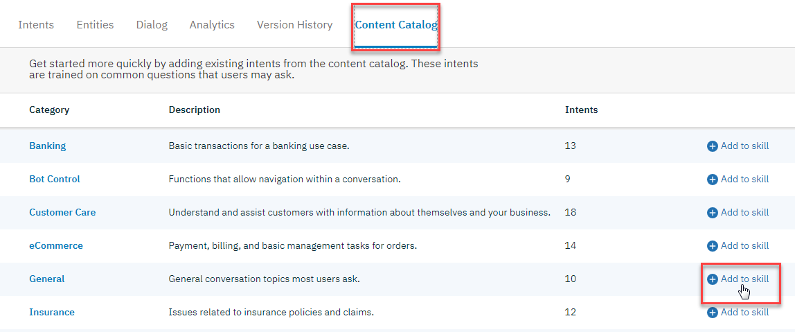
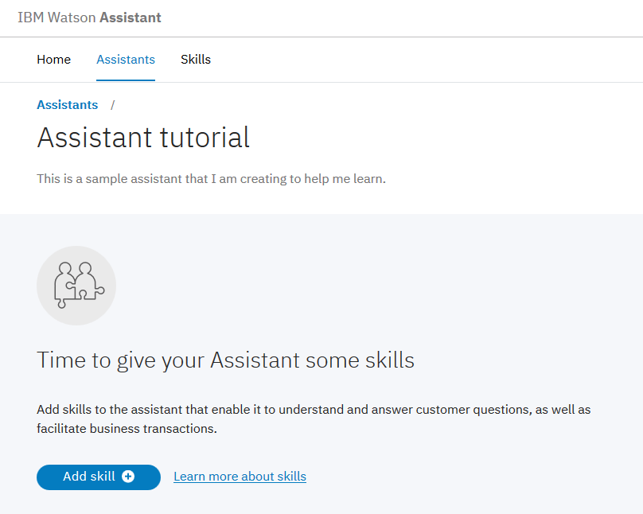

---

copyright:
  years: 2015, 2019
lastupdated: "2019-03-01"

subcollection: assistant

---

{:shortdesc: .shortdesc}
{:new_window: target="_blank"}
{:deprecated: .deprecated}
{:important: .important}
{:note: .note}
{:deprecated: .deprecated}
{:important: .important}
{:note: .note}
{:tip: .tip}
{:pre: .pre}
{:codeblock: .codeblock}
{:screen: .screen}
{:javascript: .ph data-hd-programlang='javascript'}
{:java: .ph data-hd-programlang='java'}
{:python: .ph data-hd-programlang='python'}
{:swift: .ph data-hd-programlang='swift'}
{:hide-dashboard: .hide-dashboard}
{:download: .download}
{:gif: data-image-type='gif'}

# 概説チュートリアル
{: #getting-started}

この簡潔なチュートリアルでは、{{site.data.keyword.conversationshort}} ツールを紹介し、最初のアシスタントを作成するプロセスを示します。
{: shortdesc}

## 始める前に
{: #getting-started-prerequisites}
{: hide-dashboard}

開始するにはサービス・インスタンスが必要です。
{: hide-dashboard}

1.  {: hide-dashboard}{{site.data.keyword.cloud_notm}} カタログの [{{site.data.keyword.conversationshort}} ](https://cloud.ibm.com/catalog/services/watson-assistant) ページに移動します。

    サービス・インスタンスは、別のリソース・グループが選択されない限り、**デフォルト**のリソース・グループで作成されます。後で変更することは*できません*。サービスを試す目的では、このグループで十分です。

    より堅牢性が必要な用途のインスタンスを作成する場合は、[リソース・グループ ](https://{DomainName}/docs/resources/bestpractice_rgs#bp_resourcegroups){: new_window} について学習してください。
1.  {: hide-dashboard} 無料の {{site.data.keyword.cloud_notm}} アカウントを登録するか、ログインします。
1.  {: hide-dashboard} **「作成」**をクリックします。

## ステップ 1: ツールを開く
{: #getting-started-launch-tool}

{{site.data.keyword.conversationshort}} サービス・インスタンスを作成したら、サービス・ダッシュボードの**「管理」**ページが表示されます。
{: hide-dashboard}

1.  **「Launch tool (ツールの起動)」**をクリックします。 ツールへのログインを求めるプロンプトが出されたら、{{site.data.keyword.cloud_notm}} の資格情報を入力します。

<!-- Remove this text after dedicated instances have the developer console: begin -->

{{site.data.keyword.Bluemix_dedicated_notm}}: ダッシュボードから該当するサービス・インスタンスを選択してツールを起動します。

<!-- Remove this text after dedicated instances have the Developer Console: end -->

## ステップ 2: ダイアログ・スキルの作成
{: #getting-started-add-skill}

{{site.data.keyword.conversationshort}} ツールでの最初のステップとして、スキルを作成します。

*ダイアログ・スキル* とは、アシスタントで可能なお客様との会話のフローを定義する成果物のコンテナーです。

1.  {{site.data.keyword.conversationshort}} ツールのホーム・ページから、**「スキルの作成 (Create a Skill)」**をクリックします。

    

1.  **「新規作成 (Create new)」**をクリックします。

    

1.  スキルに `Conversational skill tutorial` という名前を付けます。
1.  **オプション**。 作成しようとしているダイアログで英語以外の言語を使用する場合は、リストから該当する言語を選択します。
1.  **「作成」**をクリックします。

    

ツールの「インテント (Intents)」ページが表示されます。

## ステップ 3: コンテンツ・カタログからインテントを追加する
{: #getting-started-add-catalog}

コンテンツ・カタログからインテントを追加して、IBM によって作成されたトレーニング・データをスキルに追加します。 特に、**「一般 (General)」**コンテンツ・カタログへのアクセス権をアシスタントに付与して、ダイアログでユーザーにあいさつして、そのユーザーとの会話を終了できるようにします。

1.  {{site.data.keyword.conversationshort}} ツールで、**「コンテンツ・カタログ (Content Catalog)」**タブをクリックします。
1.  リスト内で**「一般 (General)」**を見つけて、**「スキルに追加 (Add to skill)」**をクリックします。

    
1.  **「インテント (Intents)」**タブを開き、トレーニング・データに追加されたインテントと、関連付けられている発話例を確認します。 各インテント名の先頭は接頭部 `#General_` なので、それらを認識することができます。 次のステップで `#General_Greetings` インテントと `#General_Ending` インテントをダイアログに追加します。

    

{{site.data.keyword.IBM_notm}} からの事前作成されているコンテンツが追加されて、トレーニング・データの作成が正常に開始されました。

## ステップ 4: 対話を作成する
{: #getting-started-build-dialog}

[対話](/docs/services/assistant?topic=assistant-dialog-overview)とは、論理ツリー形式で会話の流れを定義したものです。 インテント (ユーザーの発言) が応答 (ボットの回答) にマッチングされます。ツリーの各ノードには、ユーザーの入力に基づいてトリガーとなる、条件があります。

これから、あいさつのインテントと終了のインテントを処理するシンプルなダイアログを作成します。それぞれのインテントにはノードが 1 つだけあります。

### 開始ノードの追加

1.  {{site.data.keyword.conversationshort}} ツールで、**「Dialog」**タブをクリックします。
1.  **「作成」**をクリックします。 2 つのノードが表示されます。
    - **Welcome**: ユーザーがアシスタントとのやり取りを開始するときに表示される、あいさつが入ります。
    - **Anything else**: ユーザーの入力が認識されないときにユーザーへの応答に使用するフレーズが入ります。

    
1.  **Welcome** ノードをクリックして、編集ビューで開きます。
1.  デフォルトの応答を、`Welcome to the Watson Assistant tutorial!` というテキストに置き換えます。

    
1.   をクリックして、編集ビューを閉じます。

`welcome` 条件がトリガーとなるダイアログ・ノードを作成しました。(`welcome` は、インテントのように機能しますが、先頭に `#` が付かない特別な条件です。)新規会話が開始するとトリガーされます。このノードは、新規会話が開始されたら、この最初のノードの応答セクションに追加したウェルカム・メッセージを使用してシステムが応答するよう指定しています。

### 開始ノードのテスト

いつでも対話をテストして、対話を検証することができます。 これからテストします。

-  アイコンをクリックして、「試行する (Try it out)」ペインを開きます。作成したウェルカム・メッセージが表示されるはずです。

### インテントを処理するノードの追加

ここで、`Welcome` ノードと `Anything else` ノードの間に、インテントを処理するためのノードを追加しましょう。

1.  **Welcome** ノードの詳細アイコン  をクリックし、**「Add node below」**を選択します。
1.  このノードの **「Enter a condition」**フィールドに `#General_Greetings` と入力します。 それから、**`#General_Greetings`** オプションを選択します。
1.  応答として `Good day to you!` を追加します。
1.   をクリックして、編集ビューを閉じます。

   

1.  このノードの詳細アイコン  をクリックし、**「Add node below」**を選択してピア・ノードを作成します。 ピア・ノードで、`#General_Ending` を条件に指定し、`OK. See you later.` を応答に指定します。

   

1.   をクリックして、編集ビューを閉じます。

   

### インテントの認識のテスト

あいさつと終了の両方の入力を認識して応答する、単純なダイアログを作成しました。これから、正しく機能することを確認します。

1.   アイコンをクリックして、「試行する (Try it out)」ペインを開きます。例のウェルカム・メッセージが表示されます。
1.  ペインの下部で `こんにちは` と入力し、Enter キーを押します。 #hello インテントが認識されたことが出力に示され、該当する応答 (`良い一日を。`) が表示されます。
1.  以下の入力を試してください。
    - `バイバイ`
    - `やあ`
    - `またね`
    - `おはよう`
    - `さよなら`

{: gif}

{{site.data.keyword.watson}} は、入力内容が、提供されていたサンプルと完全に一致していなくても、インテントを認識できます。 対話ではインテントにより、使用される厳密な言葉遣いに関係なくユーザーの入力の目的を識別します。そして、指定された方法で応答します。

### 対話の作成の結果

これで完了です。 2 つのインテントとそれらを認識する対話からなる、単純な会話を作成しました。

## ステップ 5: アシスタントの作成
{: #getting-started-create-assistant}

[*アシスタント*](/docs/services/assistant?topic=assistant-assistants) は、便利な方法でお客様との対話を可能にするスキルを追加する対象の、コグニティブ・ボットです。

1.  **「アシスタント (Assistants)」**タブをクリックします。
1.  **「新規作成 (Create new)」**をクリックします。

    
1.  アシスタントに `Watson Assistant tutorial` と名前を付けます。
1.  「説明 (Description)」フィールドに、`This is a sample assistant that I am creating to help me learn.` と入力します。
1.  **「作成」**をクリックします。

    

## ステップ 6: アシスタントへのスキルの追加
{: #getting-started-add-skill-to-assistant}

作成したダイアログ・スキルを、作成したアシスタントに追加します。

1.  新しいアシスタント・ページから、**「スキルの追加 (Add skill)」**をクリックします。

    {{site.data.keyword.conversationshort}} サービスの一般出荷可能バージョンを使用してワークスペースを作成したか、作成されたワークスペースの開発者役割のアクセス権が付与されている場合は、それらのワークスペースが会話型スキルとして「スキル (Skills)」ページにリストされます。
    {: tip}

    
1.  以前に作成したスキルをアシスタントに追加するように選択します。

## ステップ 7: アシスタントの統合
{: #getting-started-integrate-assistant}

これで、アシスタントで単純な会話のやり取りに参加し、それをパブリックの Web ページに公開してテストできるようになりました。サービスでは、プレビュー・リンクと呼ばれる組み込みの統合が用意されています。このタイプの統合を作成すると、IBM ブランドの Web ページでホストされるチャット・ウィジェットにアシスタントが組み込まれます。Web ページを開き、アシスタントとチャットしてテストできます。

1.  **「アシスタント (Assistants)」**タブをクリックして、作成した `Watson Assistant tutorial` アシスタントを見つけて開きます。
1.  *「統合」*領域で、**「統合の追加 (Add integration)」**をクリックします。
1.  **「プレビュー・リンク (Preview Link)」**を見つけて、**「統合の選択 (Select integration)」**をクリックします。

1.  ページに表示される URL をクリックします。

    新しいタブにページが開きます。
1.  アシスタントに `hello` と言い、応答を監視します。アシスタントを試行する必要がある他のユーザーと URL を共有できます。

## 次のステップ
{: #getting-started-next-steps}

ここで示したチュートリアルは、単純なサンプルで作成されています。 実際のアプリケーションの場合は、より興味深いインテント、いくつかのエンティティー、およびその両方を使用するより複雑なダイアログを定義する必要があります。改善されたバージョンのアシスタントを使用すると、Slack などのお客様が使用するチャネルと統合できます。アシスタントとお客様の間のトラフィックが増えた場合は、**「分析 (Analytics)」**タブで提供されるツールを使用して実際の会話を分析し、改善できる領域を識別できます。

- より高度なダイアログを作成する後続のチュートリアルを完了してください。
    - [複雑なダイアログの作成](/docs/services/assistant?topic=assistant-tutorial)のチュートリアルを参照して標準ノードを追加します。
    - [スロットを含むノードをダイアログに追加する](/docs/services/assistant?topic=assistant-tutorial-slots)のチュートリアルを参照してスロットについて学習します。
- アイデアを得るために、他の[サンプル・アプリ](/docs/services/assistant?topic=assistant-sample-apps)をチェックアウトします。
