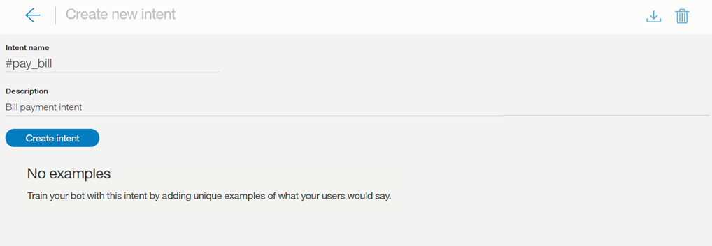
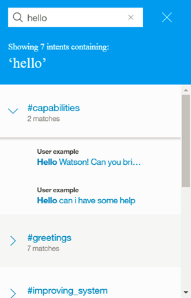
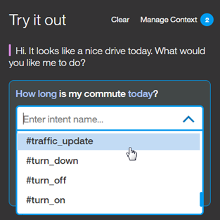

---

copyright:
  years: 2015, 2018
lastupdated: "2018-01-30"

---

{:shortdesc: .shortdesc}
{:new_window: target="_blank"}
{:tip: .tip}
{:pre: .pre}
{:codeblock: .codeblock}
{:screen: .screen}
{:javascript: .ph data-hd-programlang='javascript'}
{:java: .ph data-hd-programlang='java'}
{:python: .ph data-hd-programlang='python'}
{:swift: .ph data-hd-programlang='swift'}

# インテントの定義
{: #intents}

***インテント*** とは、質問に対する回答や請求書の支払処理などの顧客の入力に表現される目的または目標のことです。 顧客の入力で表現されたインテントを認識することによって、{{site.data.keyword.conversationshort}} サービスは、そのインテントに応答するための正しいダイアログ・フローを選択することができます。
{: shortdesc}

<iframe class="embed-responsive-item" id="youtubeplayer" type="text/html" width="640" height="390" src="https://www.youtube.com/embed/6HAZpBHqX8M" frameborder="0" webkitallowfullscreen mozallowfullscreen allowfullscreen> </iframe>

## インテント数の制限
{: #intent-limits}

作成できるインテントと例の数は、次に示すように {{site.data.keyword.conversationshort}} サービス・プランによって異なります。

| サービス・プラン     | インテント数/ワークスペース | 例の数/ワークスペース |
|------------------|----------------------:|-----------------------:|
| 標準/プレミアム |                 2,000 |                 25,000 |
| ライト             |                   100 |                 25,000 |

## インテントの作成
{: #creating-intents}

{{site.data.keyword.conversationshort}} ツールを使用してインテントを作成します。

1.  {{site.data.keyword.conversationshort}} ツールで、ワークスペースを開き、ナビゲーション・バーの**「インテント (Intents)」**タブを選択します。 **「インテント (Intents)」**が表示されない場合、 メニューを使用してこのページを開きます。

1.  **「新規作成 (Create new)」**を選択します。

1.  **「インテント名 (Intent name)」**フィールドに、インテントの名前を入力します。
    - インテント名には、文字 (ユニコード)、数字、下線、ハイフン、およびピリオドを使用できます。
    - この名前は、`..` またピリオドだけの他のストリングから構成することはできません。
    - インテント名にスペースを含めることはできず、128 文字を超えてはなりません。 次にインテント名の例を示します。
        - `#weather_conditions`
        - `#pay_bill`
        - `#escalate_to_agent`

    このツールが自動的にインテント名に `#` 文字を含めるため、この文字を追加する必要はありません。
    {: tip}

    **「説明 (Description)」**フィールドにインテントの説明を追加します。

1.  **「インテントの作成 (Create intent)」**を選択してインテント名を保存します。

    

1.  次に、**「ユーザー例の追加 (Add user examples)」**フィールドに、インテントに対するユーザー例のテキストを入力します。例は、長さが 1024 文字までの任意のストリングにできます。 次に `#pay_bill` インテントの例を示します。
    - `支払いをする必要があります。`
    - `残金を支払う`
    - `支払いをする`

    **インテントの例としてエンティティーおよび同義語を参照する**

    このインテントに対応するエンティティーを定義した場合、またはこれから定義する予定の場合は、いくつかの例で、それらのエンティティー、またはそれらに関連付けられている同義語を参照してください。そうすることで、インテントとエンティティーの間の関係を設定するために役立ちます。

    
    {: #entity-as-example}

    *重要*:

      - インテントの例のデータは、エンド・ユーザーが提供するであろうデータの代表的かつ典型的なものにする必要があります。例は、実際のユーザー・データから収集することも、特定の分野の専門家から収集することもできます。データが代表的で正確なものであることは重要です。
      - トレーニング・データとテスト・データ (評価用) の両方が、実際の使用法におけるインテントの分布を反映している必要があります。一般に、頻度の高いインテントほど例が比較的多くなり、応答の範囲が広がります。
      - 自然であれば、句読点を例のテキストに含めることができます。インテントを表現するときに、句読点を含む例を用いるユーザーもいれば、そうでないユーザーもいると思われる場合は、両方のバージョンを含めてください。一般に、各種のパターンの範囲が広がるほど、応答が改善されます。

    **インテントの例として @Entity を直接参照する**

    インテントの例の中で、エンティティーを直接参照することもできます。例えば、`@PhoneModelName` (電話のモデル名) というエンティティーがあり、このエンティティーには、*Galaxy S8*、*Moto Z2*、*LG G6*、および *Google Pixel 2* という値が含まれているとします。例えば、`#order_phone` (電話の注文) というインテントを作成する場合は、次のようなトレーニング・データを提供できます。
    - `@PhoneModelName` を購入したいのですが。 (Can I get a @PhoneModelName?)
    - `@PhoneModelName` の注文をお願いします。(Help me order a @PhoneModelName.)
    - `@PhoneModelName` は在庫がありますか? (Is the @PhoneModelName in stock?)
    - `@PhoneModelName` を注文に追加します。(Add a @PhoneModelName to my order.)

    

    **注**: 現時点で直接参照することができるのは、閉じたエンティティーのみです (パターン値は無視されます)。[システム・エンティティー](system-entities.html)は使用できません。

    トレーニング・データ内の*ある箇所*で、インテントの例としてのエンティティー (例えば、`@PhoneModelName`) を参照する場合、直接参照 (例えば、*Galaxy S8*) を使用する値は、他の箇所のインテント例では無効にされます。すべてのインテントで、「インテントの例としてのエンティティー」のアプローチを使用します。このアプローチは特定のインテントのみのために選択することはできません。

    これは、実際には、インテントの大部分を以前に直接参照 (*Galaxy S8*) に基づいてトレーニング済みの場合に、ある 1 つのインテントのみに対してエンティティー参照 (`@PhoneModelName`) を使用すると、それが以前のすべてのトレーニングに影響を与えるということを意味しています。`@Entity` 参照を使用する場合は、以前のすべての直接参照を `@Entity` 参照に置き換えるように注意する必要があります。

    **注**: 10 個の値が定義された `@Entity` を使用して 1 つのインテント例を定義しても、そのインテント例を 10 回指定したことには**なりません**。{{site.data.keyword.conversationshort}} サービスは、その 1 つのインテント例の構文にそれほどの重みは与えません。

    **重要**: アプリケーションがこのサービスと対話する際に、インテント名と例のテキストが URL 内に公開される可能性があります。 これらの成果物に機密情報または個人情報を含めないでください。

    **「例の追加 (Add example)」**を選択して、例を保存します。

1.  同じプロセスを繰り返して、さらに例を追加します。 それぞれの例の間はタブで移動できます。 インテントごとに少なくとも 5 つの例を提供してください。 提供する例が多ければ多いほど、アプリケーションは正確になります。

1.  例の追加が終了したら、 を選択してインテントの作成を終了します。

### 結果

作成したインテントが「インテント (Intents)」タブに追加され、システムはこれらの新規データでシステム自体のトレーニングを開始します。

## インテントの編集

リスト内の任意のインテントを選択して、編集のために開くことができます。 次の変更を行うことができます。

- インテントの名前を変更する。
- インテントを削除する。
- 例を追加、編集、または削除する。
- 例を別のインテントに移動する。

インテント名からそれぞれの例にタブで移動して選択すれば、例を編集できます。

例を移動したり削除したりするには、チェック・ボックスを選択してその例を選択してから**「移動 (Move)」**または**「削除」**を選択します。

  

## インテントの検索

ユーザー例、インテント名、および説明を検索するには、「検索 (Search)」機能を使用します。

1.  ナビゲーション・バーの**「インテント (Intents)」**タブを選択します。

    

1.  「検索」アイコン  を選択します。

1.  検索対象の語句を入力します。

    

    **注**: 初めて検索する際には、索引が作成されます。コンテンツの索引付けが行われている間、終わるまで待つように促すメッセージが表示される場合があります。

### 結果

検索語を含むインテントと、それに対応する例が表示されます。任意の結果を選択して、編集するために開きます。

  

## インテントと例のインポート

多数のインテントと例がある場合、{{site.data.keyword.conversationshort}} ツールで 1 つずつ定義するよりも、コンマ区切り値 (CSV) ファイルからインポートする方が簡単です。

1.  インテントと例を CSV ファイルに収集するか、またはそれらをスプレッドシートから CSV ファイルにエクスポートします。 ファイルの各行のフォーマットは、以下のようにする必要があります。

    ```
    <例>,<インテント>
    ```
    {: screen}

    ここで、`<例>` はユーザーの例のテキスト、`<インテント>` は例に一致してほしいインテントの名前です。 例えば、次のようにします。

    ```
    現在の天候状態を教えてください。,weather_conditions
    雨が降っていますか?,weather_conditions
    気温は何度ですか?,weather_conditions
    最も近い場所はどこですか?,find_location
    ローリーに店舗はありますか?,find_location
    ```
    {: screen}

    > **重要:** CSV ファイルは、UTF-8 エンコード方式で、バイト・オーダー・マーク (BOM) なしで保存してください。

1.  {{site.data.keyword.conversationshort}} ツールで、ワークスペースを開き、ナビゲーション・バーの**「インテント (Intents)」**タブを選択します。 **「インテント (Intents)」**が表示されない場合、 メニューを使用してこのページを開きます。

1.  *「インポート (Import)」*アイコン  を選択します。次に、ファイルをドラッグするか、コンピューター上のファイルを参照して選択します。ファイルは検証されてインポートされます。そして、新規データについてのシステムのトレーニングが開始されます。

    

    > **重要:** CSV ファイルの最大サイズは 10 MB です。 CSV ファイルがこれより大きい場合は、複数のファイルに分割し、別々にインポートすることを検討してください。

### 結果

インポートされたインテントと対応する例は、**「インテント (Intents)」**タブで表示できます。 新しいインテントと例を表示するためにページの最新表示が必要になる場合があります。

## インテントのエクスポート
{: #export_intents}

多数のインテントを CSV ファイルにエクスポートできるので、別の {{site.data.keyword.conversationshort}} アプリケーションでそれらをインポートして再利用することができます。

1.  「インテント (Intents)」タブで、任意のインテントをリストから選択して*「エクスポート (Export)」*を選択します。

    

## インテントの削除
{: #delete_intents}

多数のインテントを削除のために選択することができます。

**重要**: インテントを削除すると、関連付けられている例もすべて削除されます。これらの項目は後で復旧することはできません。 削除したインテントを参照するダイアログ・ノードはすべて、削除されたコンテンツを今後参照しないように手動で更新する必要があります。

1.  「インテント (Intents)」タブで、任意のインテントをリストから選択して*「削除 (Delete)」*を選択します。

    

## インテントのテスト
{: #testing-your-intents}

新しいインテントの作成が完了したら、システムがそれらのインテントを予期どおりに認識するかどうかを確認するためにシステムをテストできます。

1.  {{site.data.keyword.conversationshort}} ツールで、 アイコンを選択します。

1.  「*試行する (Try it out)*」ペインで、質問または他のテキスト・ストリングを入力し、Enter キーを押してどのインテントが認識されるかを確認します。 間違ったインテントが認識された場合、このテキストを正しいインテントに例として追加することにより、モデルを改善できます。

    ワークスペースに最近変更を加えた場合は、システムが引き続きリトレーニング中であることを示すメッセージが表示される場合があります。 このメッセージが表示された場合は、トレーニングが完了するまで待機し、完了後にテストを行います。
    {: tip}

    

    応答には、入力から認識されたインテントが示されます。

    

1.  システムが正しいインテントを認識しなかった場合、そのインテントを修正することができます。 認識されたインテントを修正するには、表示されたインテントを選択した後、リストから正しいインテントを選択します。 修正が送信されると、システムはこの新規データを取り込むためにシステム自体を自動的にリトレーニングします。

    

1.  入力がアプリケーションに関係ない場合、そのことを示すことができます。 表示されたインテントを選択して、**「無関係とマークを付ける (Mark as irrelevant)」**を選択します。

    

インテントが正しく認識されない場合は、次のような変更を行うことを検討してください。

- 認識されないテキストを正しいインテントに例として追加する。
- 既存の例を、あるインテントから別のインテントに移動する。
- インテント同士が似すぎていないかどうかを検討し、必要に応じてそれらを定義し直す。

## 絶対スコアリングと「無関係とマークを付ける (Mark as irrelevant)」

2017 年 2 月以降、インテントの信頼度をスコアリングしてインテントを返すための新しいアルゴリズムが組み込まれています。 また、入力に「*無関係*」とマークを付けることもできます。 これらの変更には、[ご使用のワークスペースのアップグレード ](upgrading.html){: new_window} が必要になる場合があります。

### 絶対スコアリング

{{site.data.keyword.conversationshort}} サービスは、各インテントの信頼度を、他のインテントとの比較によってではなく、サービスで独自にスコアリングするようになりました。これにより、複数のインテントを柔軟に返すことができます。 また、システムがインテントを全く返さない場合があることも意味しています。 上位インテントの信頼度が低く、すべてのインテントがユーザーの入力に関連している場合 (0.2 未満の場合)、その上位インテントは API によってインテントの配列の出力には含められますが、その #intent を条件として設定した結果として返されるのは、false です。良好な信頼度でインテントが検出されないケースを検出したい場合は、`irrelevant` (無関係/不適当) を条件として設定することができます。

インテントの信頼度スコアが変化した場合、ダイアログの再構築が必要になることがあります。 例えば、信頼度が低くなったインテントでダイアログを調整した場合、システムの応答は正しくなくなります。

### 「無関係とマークを付ける (Mark as irrelevant)」
{: #mark-irrelevant}

この機能が使用可能かどうかは、[サポートされる言語](lang-support.html)を参照してください。

ワークスペースをアップグレードしたら、*「試行する (Try it out)」*ペインで[入力をテスト](#testing-your-intents)して変更を確認することができます。**「無関係とマークを付ける (Mark as irrelevant)」**を使用して、入力がアプリケーションに関連付けられていないことを示すことができます。

有効範囲外またはトピックから外れている入力について #off_topic (トピック外) などのインテントがある場合、そのインテントを削除し、それらの入力が無関係であるとマークを付けることにより、ワークスペースをテストします。

**重要**: 無関係とマークが付けられた入力は、そのワークスペースに格納され、トレーニング用データの一部として組み込まれます。 この変更を本当に実行する必要があることを確認してください。

- これらの入力は、後でこのツール内でアクセスすることも変更することもできません。
- **「無関係 (Irrelevant)」**のタグを削除する唯一の方法は、*「試行する (Try it out)」*ペインで同じ入力を使用してから、そのインテントを変更することです。
