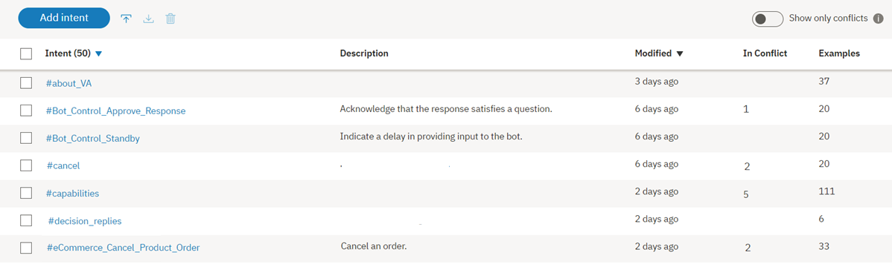

---

copyright:
  years: 2015, 2019
lastupdated: "2019-02-28"

subcollection: assistant

---

{:shortdesc: .shortdesc}
{:new_window: target="_blank"}
{:deprecated: .deprecated}
{:important: .important}
{:note: .note}
{:tip: .tip}
{:pre: .pre}
{:codeblock: .codeblock}
{:screen: .screen}
{:javascript: .ph data-hd-programlang='javascript'}
{:java: .ph data-hd-programlang='java'}
{:python: .ph data-hd-programlang='python'}
{:swift: .ph data-hd-programlang='swift'}

# インテントの定義
{: #intents}

***インテント*** とは、質問に対する回答や請求書の支払処理などの顧客の入力に表現される目的または目標のことです。 顧客の入力で表現されたインテントを認識することによって、{{site.data.keyword.conversationshort}} サービスは、そのインテントに応答するための正しいダイアログ・フローを選択することができます。
{: shortdesc}

<iframe class="embed-responsive-item" id="youtubeplayer" title="インテントの処理" type="text/html" width="640" height="390" src="https://www.youtube.com/embed/OPdOCUPGMIQ" frameborder="0" webkitallowfullscreen mozallowfullscreen allowfullscreen> </iframe>

## インテントの作成の概要
{: #intents-described}

- ご使用のアプリケーション向けにインテントを計画します。

  お客様が何をしたいのかを検討するとともに、ご使用のアプリケーションでお客様の代わりに何を処理したいのかを検討してください。例えば、アプリケーションによってお客様の購入を支援しようとしているとします。その場合は、`#buy_something` というインテントを追加できます (インテント名の前に付加された `#` は、これがインテントであるという目印となります)。

- 作成したインテントについて Watson に学習させます。

  お客様の代わりにアプリケーションで処理するビジネス要求を決定したら、それらの要求について Watson に学習させる必要があります。ビジネス目標 (`#buy_something` など) ごとに、お客様が自分の目標を示すために一般的に使用する発話の例を少なくとも 10 件提供する必要があります。例えば、`I want to make a purchase.` (購入を希望しています。) などです。
  
  既存のビジネス・プロセスから抽出できる実際のユーザー発話例を見つけることが理想的です。これらのユーザー例は、具体的なビジネス内容に合わせてカスタマイズされる必要があります。例えば、保険会社の場合は、`I want to buy a new XYZ insurance plan.` (新しい XYZ 保険プランの購入を希望しています。) というユーザー例が考えられます。
  
  このサービスでは、提供される例を使用して機械学習モデルを構築します。このモデルは、同じタイプの発話と類似するタイプの発話を認識して、それらの発話を適切なインテントにマップできます。

最初は少数のインテントを使用して、アプリケーションの範囲を反復的に拡張しながら、それらのインテントをテストしてください。

## インテントの作成
{: #intents-create-task}

{{site.data.keyword.conversationshort}} ツールを使用してインテントを作成します。

1.  {{site.data.keyword.conversationshort}} ツールで、ダイアログ・スキルを開きます。スキルが開いて、**「インテント (Intents)」**ページが表示されます。

1.  **「新規作成 (Create new)」**を選択します。

1.  **「インテント名 (Intent name)」**フィールドに、インテントの名前を入力します。
    - インテント名には、文字 (ユニコード)、数字、下線、ハイフン、およびピリオドを使用できます。
    - この名前は、`..` またピリオドだけの他のストリングから構成することはできません。
    - インテント名にスペースを含めることはできず、128 文字を超えてはなりません。 次にインテント名の例を示します。
        - `#weather_conditions`
        - `#pay_bill`
        - `#escalate_to_agent`

    このツールが自動的にインテント名に `#` 文字を含めるため、この文字を追加する必要はありません。
    {: tip}

    **「説明 (Description)」**フィールドにインテントの説明を追加します。

1.  **「インテントの作成 (Create intent)」**を選択してインテント名を保存します。

    

1.  次に、**「ユーザー例の追加 (Add user examples)」**フィールドに、インテントに対するユーザー例のテキストを入力します。 例は、長さが 1024 文字までの任意のストリングにできます。 次に `#pay_bill` インテントの例を示します。
    - `支払いをする必要があります。`
    - `残金を支払う`
    - `支払いをする`

    お客様による実際のサポート要求からマイニングされたユーザー例を追加するには、[ログ・ファイルからの例の追加](#intents-intent-recommendations)を参照してください。

    エンティティー参照をユーザー例に含めることによる影響について詳しくは、[エンティティー参照の処理方法](#intents-entity-references)を参照してください。
    {: tip}

    アプリケーションがこのサービスと対話する際に、インテント名と例のテキストが URL 内に公開される可能性があります。 これらの成果物に機密情報または個人情報を含めないでください。
    {: important}

1.  **「例の追加 (Add example)」**をクリックして、例を保存します。

1.  同じプロセスを繰り返して、さらに例を追加します。 タブによって例の間を移動できます。インテントごとに少なくとも 5 つの例を提供してください。 提供する例が多ければ多いほど、アプリケーションは正確になります。

    ユーザー例の作成に関するヘルプ情報については、[インテント・ユーザー例の推奨の取得](/docs/services/assistant?topic=assistant-intent-recommendations#intent-recommendations-get-example-recommendations)を参照してください。

1.  例の追加が終了したら、 をクリックしてインテントの作成を終了します。

システム側で、追加したユーザー例とインテントに関する自己トレーニングが開始されます。

## エンティティー参照の処理方法
{: #intents-entity-references}

エンティティーへの言及をユーザー例に含めた場合、機械学習モデルでは、以下のシナリオでそれぞれ異なる方法でその情報が使用されます。

- [インテントの例でのエンティティーの値と同義語の参照](#intents-related-entities)
- [注釈付きの言及](#intents-annotated-mentions)
- [インテントの例でのエンティティー名の直接参照](#intents-entity-as-example)

### インテントの例でのエンティティーの値と同義語の参照
{: #intents-related-entities}

このインテントに関連するエンティティーを定義済みであるか定義する予定の場合は、一部の例でそのエンティティーの値または同義語に言及してください。そうすることで、インテントとエンティティーの間の関係を設定するために役立ちます。 これは弱い関係ですが、モデルに情報を提供する役割を果たします。


*重要*:

  - インテントの例のデータは、エンド・ユーザーが提供するであろうデータの代表的かつ典型的なものにする必要があります。 例は、実際のユーザー・データから収集することも、特定の分野の専門家から収集することもできます。 データが代表的で正確なものであることは重要です。
  - トレーニング・データとテスト・データ (評価用) の両方が、実際の使用法におけるインテントの分布を反映している必要があります。 一般に、頻度の高いインテントほど例が比較的多くなり、応答の範囲が広がります。
  - 自然であれば、句読点を例のテキストに含めることができます。 インテントを表現するときに、句読点を含む例を用いるユーザーもいれば、そうでないユーザーもいると思われる場合は、両方のバージョンを含めてください。 一般に、各種のパターンの範囲が広がるほど、応答が改善されます。

### 注釈付きの言及
{: #intents-annotated-mentions}

エンティティーを定義する際に、既存のインテントのユーザー例から直接そのエンティティーの言及に注釈を付けることができます。インテントとエンティティーの間でこのようにして指定する関係は、インテントの分類モデルによって使用*されません*。ただし、言及をエンティティーに追加すると、その言及はそのエンティティーに新しい値としても追加されます。また、言及を既存のエンティティー値に追加すると、その言及はそのエンティティー値に新しい同義語としても追加されます。インテントの分類では、インテントのユーザー例内のこれらのタイプのディクショナリー参照が使用されて、インテントとエンティティーの間の弱参照が確立されます。

コンテキスト・エンティティーについて詳しくは、[コンテキスト・エンティティーの追加](/docs/services/assistant?topic=assistant-entities#entities-create-annotation-based)を参照してください。

### インテントの例でのエンティティー名の直接参照
{: #intents-entity-as-example}

これは、使用される場合は一貫して使用される必要のある高度なアプローチです。
{: note}

インテントの例内で、エンティティーを直接参照することを選択できます。例えば、`@PhoneModelName` (電話のモデル名) というエンティティーがあり、このエンティティーには、*Galaxy S8*、*Moto Z2*、*LG G6*、および *Google Pixel 2* という値が含まれているとします。例えば、`#order_phone` (電話の注文) というインテントを作成する場合は、次のようなトレーニング・データを提供できます。

- `@PhoneModelName` を購入したいのですが。 (Can I get a @PhoneModelName?)
- `@PhoneModelName` の注文をお願いします。(Help me order a @PhoneModelName.)
- `@PhoneModelName` は在庫がありますか? (Is the @PhoneModelName in stock?)
- `@PhoneModelName` を注文に追加します。(Add a @PhoneModelName to my order.)


現時点では、自分で定義する同義語エンティティーのみを直接参照できます (パターン値は無視されます)。[システム・エンティティー](/docs/services/assistant?topic=assistant-system-entities)は使用できません。

トレーニング・データ内の*ある箇所*で、インテントの例としてのエンティティー (例えば、`@PhoneModelName`) を参照する場合、直接参照 (例えば、*Galaxy S8*) を使用する値は、他の箇所のインテント例では無効にされます。 その場合は、すべてのインテントでは「インテントの例としてのエンティティー」のアプローチが使用されます。このアプローチを特定のインテント専用として適用することはできません。
{: important}

これが実際に意味することは、インテントの大部分を以前に直接参照 (*Galaxy S8*) に基づいてトレーニング済みの場合に、ある 1 つのインテントのみに対してエンティティー参照 (`@PhoneModelName`) を使用すると、その変更が以前のトレーニングに影響を与えるということです。`@Entity` 参照を使用することを選択する場合は、以前のすべての直接参照を `@Entity` 参照に置き換える必要があります。

10 個の値が定義された `@Entity` を使用して 1 つのインテント例を定義しても、そのインテント例を 10 回指定したことには**なりません**。 {{site.data.keyword.conversationshort}} サービスは、その 1 つのインテント例の構文にそれほどの重みは与えません。

## インテントのテスト
{: #intents-test}

新しいインテントの作成が完了したら、システムがそれらのインテントを予期どおりに認識するかどうかを確認するためにシステムをテストできます。

1.  {{site.data.keyword.conversationshort}} ツールで、 アイコンをクリックします。

1.  「*試行する (Try it out)*」ペインで、質問または他のテキスト・ストリングを入力し、Enter キーを押してどのインテントが認識されるかを確認します。 間違ったインテントが認識された場合、このテキストを正しいインテントに例として追加することにより、モデルを改善できます。

    スキルに最近変更を加えた場合は、システムが引き続きリトレーニング中であることを示すメッセージが表示される場合があります。 このメッセージが表示された場合は、トレーニングが完了するまで待機し、完了後にテストを行います。
    {: tip}

    

    応答には、入力から認識されたインテントが示されます。

    

1.  システムが正しいインテントを認識しない場合、そのインテントを修正することができます。 認識されたインテントを修正するには、表示されたインテントを選択した後、リストから正しいインテントを選択します。 修正が送信されると、システムはこの新規データを取り込むためにシステム自体を自動的にリトレーニングします。

    

1.  入力がアプリケーション内のどのインテントとも無関係の場合は、表示されているインテントを選択して**「無関係とマークを付ける (Mark as irrelevant)」**をクリックすることで、サービスに学習させることができます。

    

    *無関係とマークを付ける (Mark as irrelevant)*
    {: #intents-mark-irrelevant}

    *「無関係とマークを付ける (Mark as irrelevant)」* オプションは、すべての言語で使用できるわけではありません。詳しくは、[サポートされる言語](/docs/services/assistant?topic=assistant-language-support)を参照してください。

    **重要**: 無関係とマークが付けられたインテントは、反例として JSON ワークスペースに保存されて、トレーニング・データの一部として組み込まれます。入力を無関係として指定する前に確認してください。

      - これらの入力は、後でこのツール内でアクセスすることも変更することもできません。
      - 入力を無関係として識別したことを取り消すための唯一の方法は、*「試行する (Try it out)」* ペインで同じ入力を再び使用して、今回はその入力をいずれかのインテントに割り当てることです。

インテントが正しく認識されない場合は、次のような変更を行うことを検討してください。

- 認識されないテキストを正しいインテントに例として追加する。
- 既存の例を、あるインテントから別のインテントに移動する。
- インテント同士が似すぎていないかどうかを検討し、必要に応じてそれらを定義し直す。

## 絶対スコアリング
{: #intents-absolute-scoring}

{{site.data.keyword.conversationshort}} サービスでは、各インテントの信頼度スコアは、他のインテントと関係付けてではなく、独立して計算されます。このアプローチにより、単一のユーザー入力内で複数のインテントを検出できるという柔軟性が付加されます。また、システムがインテントを全く返さない場合があることも意味しています。 上位インテントの信頼度スコアが低い場合は (0.2 未満)、上位インテントは、API によって返されるインテント配列に含まれますが、そのインテントを条件とするどのノードもトリガーされません。良好な信頼度スコアのインテントが検出されなかったケースを検出するには、`irrelevant` という特殊条件をダイアログ・ノードで使用します。詳しくは、[特殊な条件](/docs/services/assistant?topic=assistant-dialog-overview#dialog-overview-special-conditions)を参照してください。

インテントの信頼度スコアが変化した場合、ダイアログの再構築が必要になることがあります。 例えば、あるダイアログ・ノードの条件で使用されているインテントの信頼度スコアが一貫して 0.2 未満に下落し始めた場合は、そのダイアログ・ノードは処理されなくなります。信頼度スコアが変化した場合は、このダイアログの動作も変化する可能性があります。

## インテント数の制限
{: #intents-limits}

作成できるインテントと例の数は、次に示すように {{site.data.keyword.conversationshort}} サービス・プランによって異なります。

| サービス・プラン     | 1 スキルあたりのインテントの数| 1 スキルあたりの例の数|
|------------------|------------------:|-------------------:|
| プレミアム          |             2,000 |             25,000 |
| プラス             |             2,000 |             25,000 |
| 標準         |             2,000 |             25,000 |
| ライト             |               100 |             25,000 |
{: caption="サービス・プランの詳細" caption-side="top"}

## インテントの編集
{: #intents-edit}

リスト内の任意のインテントをクリックして、編集のために開くことができます。 次の変更を行うことができます。

- インテントの名前を変更する。
- インテントを削除する。
- 例を追加、編集、または削除する。
- 例を別のインテントに移動する。

インテント名から各例にタブで移動して、希望に応じてそれらの例を編集できます。

例を移動または削除するには、その例に関連付けられたチェック・ボックスをクリックしてから、**「移動 (Move)」**または**「削除 (Delete)」**をクリックします。

  

## インテントの検索
{: #intents-search}

ユーザー例、インテント名、および説明を検索するには、「検索 (Search)」機能を使用します。

1.  **「インテント (Intents)」**ページで、「検索 (Search)」アイコンをクリックします。

    

1.  検索対象の語句を入力します。

    

検索語を含むインテントと、それに対応する例が表示されます。

  

## インテントのエクスポート
{: #intents-export}

多数のインテントを CSV ファイルにエクスポートできるので、別の {{site.data.keyword.conversationshort}} アプリケーションでそれらをインポートして再利用することができます。

1.  **「インテント (Intents)」**ページで、希望のインテントをリストから選択して、**「エクスポート (Export)」**をクリックします。

    

## インテントと例のインポート
{: #intents-import}

多数のインテントと例がある場合、{{site.data.keyword.conversationshort}} ツールで 1 つずつ定義するよりも、コンマ区切り値 (CSV) ファイルからインポートする方が簡単です。 ファイルに含めるユーザー例から必ず個人データを削除してください。

代わりの方法として、未加工のユーザー発話 (コール・センターのログなどから抽出したもの) が含まれたファイルをアップロードして、サービスにそのデータからユーザー例の候補を検索させることもできます。詳しくは、[ログ・ファイルからの例の追加](/docs/services/assistant?topic=assistant-intent-recommendations#intent-recommendations-get-example-recommendations)を参照してください。この機能は、プラス・プランまたはプレミアム・プランのユーザーのみが使用できます。

1.  インテントと例を CSV ファイルに収集するか、またはそれらをスプレッドシートから CSV ファイルにエクスポートします。 ファイルの各行のフォーマットは、以下のようにする必要があります。

    ```
    <例>,<インテント>
    ```
    {: screen}

    ここで、`<例>` はユーザーの例のテキスト、`<インテント>` は例に一致してほしいインテントの名前です。 次に例を示します。

    ```
    現在の天候状態を教えてください。,weather_conditions
    雨が降っていますか?,weather_conditions
    気温は何度ですか?,weather_conditions
    最も近い場所はどこですか?,find_location
    ローリーに店舗はありますか?,find_location
    ```
    {: screen}

    **重要:** CSV ファイルは、UTF-8 エンコード方式で、バイト・オーダー・マーク (BOM) なしで保存してください。

1.  **「インテント (Intents)」**ページで、*「インポート (Import)」* アイコン  をクリックしてから、ファイルをドラッグするか、ご使用のコンピューターからファイルを参照して選択します。

    

    **重要:** CSV ファイルの最大サイズは 10 MB です。 CSV ファイルがこれより大きい場合は、複数のファイルに分割し、別々にインポートすることを検討してください。

    ファイルは検証されてインポートされます。そして、新規データについてのシステムのトレーニングが開始されます。

インポートされたインテントと対応する例は、**「インテント (Intents)」**タブで表示できます。 新しいインテントと例を表示するためにページの最新表示が必要になる場合があります。

## インテントの競合の解決 
{: #intents-resolve-conflicts}

この機能は、プラスまたはプレミアムのユーザーのみが使用できます。
{: tip}

{{site.data.keyword.conversationshort}} アプリケーションで競合が検出されるのは、*別々の* インテント内の複数のインテント例がよく似ているため、{{site.data.keyword.conversationshort}} でどのインテントを使用すべきなのか判断できない場合です。

競合を解決するには、以下のようにします。

1.  **「インテント (Intents)」**ページで、競合しているすべてのインテントを確認します。

    

    **「競合のみを表示 (Show only conflicts)」**スイッチをオンに切り替え、競合しているインテントのみのリストを表示します。
    {: tip}

    

1.  任意のインテントの競合を開きます。競合の原因となっているインテントの例について、**「競合の解決 (Resolve conflict)」**をクリックします。

    

1.  この時点で、競合している例を別のインテントに移動するか、競合している例を完全に削除するかを選択できます。

    ここでは、`Cancel my order` (注文をキャンセルします) および `I want to cancel my order` (注文をキャンセルしたいです) という例が、`#cancel` および `#eCommerce_Cancel_Product_Order` というインテントの両方に含まれています。

    

    その他のユーザー例は、必ずしも競合していないトレーニングの例ですが、競合している例と似ています。これらの例は、競合の解決に役立つコンテキストを提供するために表示されています。

1.  `Cancel my order` (注文をキャンセルします) および `I want to cancel my order` (注文をキャンセルしたいです) という例を選択して、`#cancel` インテントから `#eCommerce_Cancel_Product_Order` インテントに移動します。

    

1.  例の配置先を決定する際は、同義の例またはほぼ同義の例が含まれたインテントを探してください。

    それぞれのインテントをできるだけ他のインテントとは異なるもの、かつ 1 つの目標に重点を置いたものにしてください。重複している複数のユーザー例が含まれた 2 つのインテントがある場合は、2 つのインテントを別々に維持する必要はない可能性があります。直接は重複しないユーザー例を、削除するか、一方のインテントに移動してから、他方のインテントを削除できます。
    {: tip}

    `#cancel` インテント内のもう一方の例を選択して削除します。

    

1.  **「送信 (Submit)」**ボタンをクリックして、競合を解決します。

    

    *「リセット (Reset)」* オプションを使用すると、競合する例をインテント間で移動する操作からやり直すことができます。*「キャンセル (Cancel)」* をクリックすると、インテントのページに戻ります。

これで 1 つの競合が解決されましたが、引き続き他の競合インテントを確認できます。

詳しくは、以下のビデオをご覧ください。

<iframe class="embed-responsive-item" id="youtubeplayer0" title="インテントの競合解決の概要" type="text/html" width="640" height="390" src="https://www.youtube.com/embed/9gQtjCBxjdc?rel=0" frameborder="0" webkitallowfullscreen mozallowfullscreen allowfullscreen> </iframe>

## インテントの削除
{: #intents-delete}

多数のインテントを削除のために選択することができます。

**重要**: インテントを削除すると、関連付けられている例もすべて削除されます。これらの項目は後で復旧することはできません。 削除したインテントを参照するダイアログ・ノードはすべて、削除されたコンテンツを今後参照しないように手動で更新する必要があります。

1.  **「インテント (Intents)」**ページで、希望のインテントをリストから選択して、**「削除 (Delete)」**をクリックします。

    
