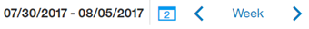

---

copyright:
  years: 2015, 2019
lastupdated: "2019-02-21"

subcollection: assistant

---

{:shortdesc: .shortdesc}
{:new_window: target="_blank"}
{:deprecated: .deprecated}
{:important: .important}
{:note: .note}
{:tip: .tip}
{:pre: .pre}
{:codeblock: .codeblock}
{:screen: .screen}
{:javascript: .ph data-hd-programlang='javascript'}
{:java: .ph data-hd-programlang='java'}
{:python: .ph data-hd-programlang='python'}
{:swift: .ph data-hd-programlang='swift'}

# メトリックの概要
{: #logs-overview}

「概要 (Overview)」ページには、ユーザーとアシスタントの間の対話の要約が表示されます。特定期間のトラフィック量や、ユーザーの会話で最も認識されたインテントとエンティティーを参照できます。
{: shortdesc}

メトリックを使用して、次のような質問に回答します。

* 先月で会話数が最多または最少であった日はいつか。
* 先月の週あたりの会話の平均数はいくつか。
* 先週最もよく出現したインテントは何か?
* 2 月に最も多く認識されたエンティティーは何か?

メトリックの情報を表示するには、ナビゲーション・バーの**「概要 (Overview)」**を選択します。 

  

## コントロール
{: #logs-overview-controls}

以下のコントロールを使用して情報をフィルタリングできます。

- *「インテント (Intents)」* および*「エンティティー (Entities)」* のフィルター - これらのドロップダウン・フィルターのいずれかを使用して、スキル内の特定のインテントまたはエンティティーのデータを表示します。

  **重要** - インテントとエンティティーのフィルターには、データ・ソースの内容ではなく、***スキル*** 内のインテントとエンティティーが含まれています。スキル以外の[データ・ソースを選択](/docs/services/assistant?topic=assistant-logs#logs-deploy-id)した場合は、フィルター内のオプションとしてデータ・ソース・ログ内のインテントやエンティティーは表示されない可能性があります (ただし、それらのインテントとエンティティーがスキルにも含まれている場合は除きます)。

- *データのリフレッシュ (Refresh data)* - 「概要 (Overview)」ページの統計を即座にリフレッシュできます。 「概要 (Overview)」ページには、表示データが最後に更新された時刻が表示されます。 新しいデータがあると考えられる場合は、**「データのリフレッシュ (Refresh data)」**を選択できます。

  これらの統計は、アシスタントと対話した外部トラフィック (ユーザーまたは API 呼び出しから発行) を表したものであり、ツールの*「試行する (Try it out)」* ペインからの対話を含んでいません。

- *期間 (Time period)* - このコントロールを使用して、表示データの期間を選択します。 このコントロールは、このページに表示されるすべてのデータに影響します。グラフに表示される会話数だけでなく、グラフと一緒に表示される統計、および上位インテントと上位エンティティーのリストにも影響します。

  これらの統計は、会話ログの保持期間より長い期間を対象範囲に含めることができます。
  {: note}

  

  表示データの期間として、1 日、1 週間、1 カ月、または四半期から選択できます。いずれの場合も、該当する測定期間に合わせてグラフのデータ・ポイントが調整されます。 例えば、1 日のグラフを表示する場合、データは時間単位の値で表示されますが、1 週間のグラフを表示する場合、データは日単位で表示されます。 1 週間は、日曜日から始まり土曜日に終わります。 木曜日から次の水曜日までの 1 週間、月初めが 1 日でない 1 カ月など、カスタム期間を作成することはできません。

  1 日のみの表示を選択した場合は、各会話について表示される時間は、お使いのブラウザーのタイム・ゾーンに合わせて現地時間で表示されます。API 呼び出しを通じて同じ会話ログを確認した場合は、この時間はタイム・スタンプとは異なることがあります。API ログ呼び出しは常に UTC で表示されるからです。

    

## グラフと統計
{: #logs-overview-graphs}

以下の複数の統計スコアカードによってアプリケーションのログ・データが提供されます。

* *会話総数 (Total conversations)* - 選択された期間中のアクティブ・ユーザーとアプリケーションの間の会話総数 (対応するグラフに表示)。

  1 件の会話は、アクティブ・ユーザーがアプリケーションに送信するメッセージと、アプリケーションが応答として返信するメッセージからなる一連のメッセージで構成されます。

  **重要**: アプリケーション/ボットによって送受信される一連のメッセージは*すべて* 「会話」と見なされるため、当サービスが「こんにちは、ご用件をどうぞ」と話し始めた後に、ユーザーが応答せずにブラウザーを閉じた場合でも、このメッセージは会話総数に含まれます。

* *会話あたりの平均メッセージ数 (Avg. msg. per conversation)* - 選択された期間中に受信されたメッセージの総数を、選択された期間中の会話総数で割った値 (対応するグラフに表示)。
* *最大会話数 (Max. conversations)* - 選択された期間内の単一データ・ポイントにおける最大会話数
* *理解不十分 (Weak understanding)* - 理解不十分な個別メッセージの数。これらのメッセージは、インテント別に分類されず、既知のエンティティーを一切含んでいません。これらはダイアログの潜在的な問題を見つけるために役立つことがあります。

以下の詳細なグラフによって追加情報が提供されます。

* *会話総数 (Total conversations)* - 選択された期間中のアクティブ・ユーザーとアプリケーションの間の会話総数。

  ***「会話 (Conversations)」*** グラフの参照中に、各データ・ポイントをクリックして、次に示すような数値を表示することができます。

  

* *会話あたりの平均メッセージ数 (Avg. msg. per conversation)* - 選択された期間中に受信されたメッセージの総数を、選択された期間中の会話総数で割った値。
* *メッセージ総数 (Total messages)* - 選択された期間中にアクティブ・ユーザーから受信されたメッセージの総数。
* *アクティブ・ユーザー (Active users)* - 選択された期間中にアプリケーションとやり取りしたユニーク・ユーザーの数。
* *ユーザーあたりの平均会話数 (Avg. conversations per user)* - 選択された期間中の会話総数を選択された期間中のユニーク・ユーザーの総数で割った値。

  *「アクティブ・ユーザー (Active users)」* と*「ユーザーあたりの平均会話数 (Avg. conversations per user)」* の統計は、固有の `user_id` パラメーターを必要とします。詳しくは、[ユーザー・メトリックの有効化](/docs/services/assistant?topic=assistant-logs-resources#logs-resources-user-id)を参照してください。
  {: important}

## 上位インテントと上位エンティティー
{: #logs-overview-tops}

指定した期間中に最も多く認識されたインテントとエンティティーも確認できます。

* *上位インテント (Top intents)* - インテントがシンプルなリストで表示されます。 インテントが認識された回数を表示するだけでなく、任意のインテントを選択することで、**「ユーザーの会話 (User conversations)」**ページを、表示データと一致するように日付範囲がフィルタリングされて、選択したインテントと一致するようにインテントがフィルタリングされた状態で開くことができます。

* *上位エンティティー (Top entities)* はリストにも表示されます。各エンティティーについて、**「値 (Values)」**列から選択して、期間中にこのエンティティーに対して最も多く検出された値のリストを表示できます。任意のエンティティーを選択することで、**「ユーザーの会話 (User conversations)」**ページを、表示データと一致するように日付範囲がフィルタリングされ、選択したエンティティーと一致するようにエンティティーがフィルタリングされた状態で開くこともできます。

当サービスで認識されるインテントとエンティティーを確認することで発見した内容に基づいて、インテントとエンティティーと編集する方法のヒントについては、[会話からの学習](/docs/services/assistant?topic=assistant-logs)を参照してください。
