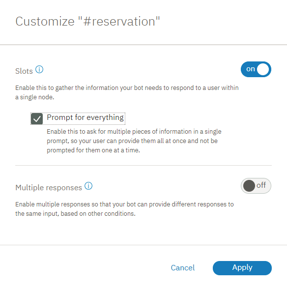

---

copyright:
  years: 2015, 2019
lastupdated: "2019-02-21"

subcollection: assistant

---

{:shortdesc: .shortdesc}
{:new_window: target="_blank"}
{:deprecated: .deprecated}
{:important: .important}
{:note: .note}
{:tip: .tip}
{:pre: .pre}
{:codeblock: .codeblock}
{:screen: .screen}
{:javascript: .ph data-hd-programlang='javascript'}
{:java: .ph data-hd-programlang='java'}
{:python: .ph data-hd-programlang='python'}
{:swift: .ph data-hd-programlang='swift'}

# チュートリアル: スロットを含むノードを改善する
{: #tutorial-slots-complex}

このチュートリアルでは、レストラン予約に必要な情報を収集するスロットを含む単純なノードを改善します。
{: shortdesc}

## 学習目標
{: #tutorial-slots-complex-objectives}

このチュートリアルを完了すると、以下の方法について理解できます。

- スロットを含むノードをテストする
- 一般的なユーザーの対話に対応するスロット応答の条件を追加する
- 無関係なユーザー入力を予測して対応する
- 予期しないユーザー応答を処理する

### 所要時間
{: #tutorial-slots-complex-duration}

このチュートリアルを完了するには、およそ 2 時間から 3 時間かかります。

### 前提条件
{: #tutorial-slots-complex-prereqs}

始める前に、[スロットを含むノードをダイアログに追加する](/docs/services/assistant?topic=assistant-tutorial-slots)を完了しておいてください。 このチュートリアルでは最初のチュートリアルで作成したスロットを含むノードを基に作業を行うため、このチュートリアルを開始する前に、最初のスロットのチュートリアルを完了しておく必要があります。

## ステップ 1: 応答の形式を改善する
{: #tutorial-slots-complex-fix-format}

日付と時刻のシステム・エンティティー値が保存されると、標準化された形式に変換されます。 この標準化された形式は、値の計算を行う場合は便利ですが、この形式の再設定をユーザーに公開するのは避けたい場合もあるでしょう。 このステップでは、ダイアログで参照される日付 (`2017-12-29`) と時刻 (`17:00:00`) の値の形式を再設定します。

1.  $date コンテキスト変数の値の形式を再設定するため、@sys-date スロットの**「応答の編集 (Edit response)」**アイコン  をクリックします。

1.  **「その他 (More)」**メニュー  から**「JSON エディターを開く (Open JSON editor)」**を選択し、コンテキスト変数を定義する JSON を編集します。 日付の形式を再設定するメソッドを追加して、`2017-12-29` という値が、曜日、月、日の順に表記される日付形式に変換されるようにします。 JSON を以下のように編集します。

    ```json
    {
      "context": {
        "date": "<? @sys-date.reformatDateTime('EEEE, MMMM d') ?>"
      }
    }
    ```
    {: codeblock}

    EEEE は、曜日を略さずに表記することを示します。 E を 3 つ (EEE) にすると、曜日の表記は Friday ではなく短縮形の Fri となります。 MMMM は、月を略さずに表記することを示します。 これについても、M を 3 つ (MMM) だけにすると、月の表記は December ではなく短縮形の Dec となります。

1.  **「保存」**をクリックします。

1.  $time コンテキスト変数への時刻値の保存形式を変更して、時間と分を使用し、AM または PM のどちらかを表示するようにするには、@sys-time スロットの **「応答の編集 (Edit response)」** アイコン  をクリックします。

1.  **「その他 (More)」**メニュー  から**「JSON エディターを開く (Open JSON editor)」**を選択し、コンテキスト変数を定義する JSON を次のように編集します。

    ```json
    {
      "context": {
        "time": "<? @sys-time.reformatDateTime('h:mm a') ?>"
      }
    }
    ```
    {: codeblock}

1.  **「保存」**をクリックします。

1.  ノードを再度テストします。 「試行する (Try it out)」ペインを開き、**「クリア」**をクリックして、以前にスロットを含むノードをテストした時に指定したスロット・コンテキスト変数の値を削除します。 変更の影響を確認するには、次のスクリプトを使用します。

    <table>
    <caption>スクリプトの詳細</caption>
    <tr>
      <th>発話者</th>
      <th>発話</th>
    </tr>
    <tr>
      <td>ユーザー</td>
      <td>予約をしたい (i want to make a reservation)</td>
    </tr>
    <tr>
      <td>Watson</td>
      <td>どの日に予約しますか? (What day would you like to come in?)</td>
    </tr>
    <tr>
      <td>ユーザー</td>
      <td>金曜日 (Friday)</td>
    </tr>
    <tr>
      <td>Watson</td>
      <td>何時に予約しますか? (What time do you want the reservation to be made for?)</td>
    </tr>
    <tr>
      <td>ユーザー</td>
      <td>午後 5 時 (5pm)</td>
    </tr>
    <tr>
      <td>Watson</td>
      <td>予約人数は何名ですか? (How many people will be dining?)</td>
    </tr>
    <tr>
      <td>ユーザー</td>
      <td>6</td>
    </tr>
    </table>

    今回は Watson は、`「わかりました。金曜日 12 月 29 日の午後 5 時に 6 名で予約します (OK. I am making you a reservation for 6 on Friday, December 29 at 5:00 PM)」`と応答します。

ダイアログが応答内でコンテキスト変数の値を参照するときに使用する形式が正常に改善されました。 `2017-12-29` という機械的な表記ではなく、`金曜日 12 月 29 日 (Friday, December 29)` という表記がダイアログで使用されるようになりました。 さらに、`17:00:00` ではなく `5:00 PM` が使用されます。 日付と時刻の値に使用できるその他の SpEL メソッドについては、[値を処理するメソッド](/docs/services/assistant?topic=assistant-dialog-methods#dialog-methods-date-time)を参照してください。

## ステップ 2: すべてを一度に尋ねる
{: #tutorial-slots-complex-ask-for-everything}

これまでに何度かダイアログのテストを行ってきましたが、スロットのプロンプトに 1 つずつ答えていかなければならないのは、煩わしい場合もあると感じておられるかもしれません。 ユーザーが情報を 1 つずつ提供しなくてもよいようにするために、必要な情報すべてを最初に尋ねることができます。 そうすれば、ユーザーは情報のすべてまたは一部を 1 回の入力で提供することができます。

スロットを含むノードは、現行ノードの処理中にユーザーが提供するすべてのスロット値を検出して保存するように設計されています。 指定する値をユーザーに知らせておけば、
ユーザーはこの設計をうまく利用することができます。

このステップでは、一度にすべての情報を求めるプロンプトを出す方法について説明します。

1.  スロットを含むメイン・ノードから、**「カスタマイズ (Customize)」**をクリックします。

1.  **「すべてを求めるプロンプトを出す (Prompt for everything)」**チェック・ボックスをオンにして最初のプロンプトを有効化し、**「適用」**をクリックします。

   

1.  ノード編集ビューに戻り、新しく追加された**「入力済みのスロットがない場合は、最初にこの質問を表示 (If no slots are pre-filled, ask this first)」**フィールドまでスクロールします。 「`ご予約を承ります。予約の日付と時間、および人数をお知らせください。(I can make a reservation for you. Just tell me the day and time of the reservation, and how many people it is for.)`」という最初のプロンプトをノードに追加します。

1.  ノード編集ビューを閉じるには、 をクリックします。

1.  この変更を「試行する (Try it out)」ペインからテストします。 ペインを開き、**「クリア」**をクリックして、前回のテストのスロット・コンテキスト変数値を消去します。

1.  「`予約がしたい。 (i'd like to make a reservation.)`」と入力します。

    ダイアログの応答は「`ご予約を承ります。予約の日付と時間、および人数をお知らせください。(I can make a reservation for you. Just tell me the day and time of the reservation, and how many people it is for.)`」となります。

1.  「`土曜日の午後 8 時に 2 名で (it's for Saturday. There will be 2 of us coming in at 8pm)`」と入力します。

    ダイアログは「`わかりました。土曜日の午後 8 時に 2 名で予約します。(OK. I am making you a reservation for 2 on Saturday at 8:00 PM.)`」と応答します。

    

ユーザーが最初の入力でいずれかのスロットの値を指定した場合は、すべての情報を尋ねるプロンプトは表示されません。 例えば、ユーザーからの最初の入力が「`金曜日の夜の予約がしたい。(I want to make a reservation for this Friday night.)`」だったとします。 この場合、ユーザーが既に提供している情報 (この例では、`金曜日 (Friday)` という曜日) を繰り返し尋ねるのを避けるために、最初のプロンプトはスキップされます。 ダイアログには、代わりに次の未入力のスロットのプロンプトが表示されます。
{: note}

## ステップ 3: ゼロの適切な処理
{: #tutorial-slots-complex-recognize-zero}

スロット条件で `sys-number` システム・エンティティーを使用する場合、ゼロは適切に処理されません。スロットに定義するコンテキスト変数を 0 に設定する代わりに、サービスによってコンテキスト変数が false に設定されます。その結果、スロットはいっぱいであるとは見なされず、ユーザーはゼロ以外の数字を指定するまで何度も数字の入力を求められます。

1.  問題をより理解できるようにノードをテストします。「試行する (Try it out)」ペインを開き、**「クリア」**をクリックして、以前にスロットを含むノードをテストした時に指定したスロット・コンテキスト変数の値を削除します。 以下のスクリプトを使用します。

    <table>
    <caption>スクリプトの詳細</caption>
    <tr>
      <th>発話者</th>
      <th>発話</th>
    </tr>
    <tr>
      <td>ユーザー</td>
      <td>予約をしたい (i want to make a reservation)</td>
    </tr>
    <tr>
      <td>Watson</td>
      <td>ご予約を承ります。予約の日付と時間、および人数をお知らせください。(I can make a reservation for you. Just tell me the day and time of the reservation, and how many people it is for.</td>
    </tr>
    <tr>
      <td>ユーザー</td>
      <td>5 月 23 日午後 8 時に食事をしたい。(We want to dine May 23 at 8pm.)ゲストはいません。(There will be 0 guests.)</td>
    </tr>
    <tr>
      <td>Watson</td>
      <td>予約人数は何名ですか? (How many people will be dining?)</td>
    </tr>
    <tr>
      <td>ユーザー</td>
      <td>0</td>
    </tr>
    <tr>
      <td>Watson</td>
      <td>予約人数は何名ですか? (How many people will be dining?)</td>
    </tr>
    </table>

    0 以外の数字を指定するまでこのループにスタックされます。

1.  スロットでゼロが適切に処理されるようにするには、スロット条件を `@sys-number` から `@sys-number || @sys-number:0` に変更します。

1.  スロットの**「応答の編集 (Edit response)」**  アイコンをクリックします。

1.  コンテキスト変数が作成されるときに、スロット条件に指定されている式と同じ式が自動的に使用されます。ただし、コンテキスト変数では数字のみを保存する必要があります。コンテキスト変数として保存された値を編集して、`OR` 演算子を削除します。**「その他 (More)」**メニュー  から**「JSON エディターを開く (Open JSON editor)」**を選択し、コンテキスト変数を定義する JSON を編集します。 変数を `"guests":"@sys-number || @sys-number:0"` から以下の構文を使用するように変更します。

    ```json
    {
      "context": {
        "guests": "@sys-number"
      }
    }
    ```
    {: codeblock}

1.  **「保存」**をクリックします。

1.  ノードを再度テストします。 「試行する (Try it out)」ペインを開き、**「クリア」**をクリックして、以前にスロットを含むノードをテストした時に指定したスロット・コンテキスト変数の値を削除します。 変更の影響を確認するには、次のスクリプトを使用します。

    <table>
    <caption>スクリプトの詳細</caption>
    <tr>
      <th>発話者</th>
      <th>発話</th>
    </tr>
    <tr>
      <td>ユーザー</td>
      <td>予約をしたい (i want to make a reservation)</td>
    </tr>
    <tr>
      <td>Watson</td>
      <td>ご予約を承ります。予約の日付と時間、および人数をお知らせください。(I can make a reservation for you. Just tell me the day and time of the reservation, and how many people it is for.</td>
    </tr>
    <tr>
      <td>ユーザー</td>
      <td>5 月 23 日午後 8 時に食事をしたい。(We want to dine May 23 at 8pm.)ゲストはいません。(There will be 0 guests.)</td>
    </tr>
    </table>

    今回は Watson は、`OK. I am making you a reservation for 0 on Wednesday, May 23 at 8:00 PM.` と応答します。

ゼロが適切に処理されるように数値スロットが正常にフォーマットされました。有効なゲスト数としてノードでゼロを受け入れたくない場合もあるでしょう。次のステップでは、ユーザーが指定した値を検証する方法について説明します。

## ステップ 4: ユーザー入力を検証する
{: #tutorial-slots-complex-slot-conditions}

これまでは、ユーザーがスロットに適切なタイプの値を提供することを前提としてきました。 しかし実際には、必ずしもそうなるとは限りません。 ユーザーが無効な値を提供する可能性に備えるには、スロットに条件付き応答を追加します。 このステップでは、条件付きスロット応答を使用して以下のタスクを実行します。

- 要求された日付が過去の日付でないことを確認する。
- 要求された予約時刻が入店可能時間枠内であるかどうかを確認する。
- ユーザー入力を確認する。
- 入力されたゲスト数がゼロより大きいことを確認する。
- ある値を別の値に置き換えようとしていることを通知する。

ユーザー入力を検証するには、以下の手順を実行します。

1.  スロットを含むノードの編集ビューから、`@sys-date` スロットの**「スロットの編集 (Edit slot)」**アイコン  をクリックします。

1.  *「スロット 1 の構成 (Configure slot 1)」*ヘッダーの**「オプション」**メニュー  から、**「条件付き応答を有効にする (Enable conditional responses)」**を選択します。

1.  **「Found」**セクションで、**「応答の編集 (Edit response)」**アイコン  をクリックして、条件付き応答を追加します。

1.  以下の条件と応答を追加して、ユーザーが指定した日付が今日より前であるかどうかを確認します。

    <table>
    <caption>スロット 1 の条件付き応答 1 の詳細</caption>
    <tr>
      <th>条件</th>
      <th>応答</th>
      <th>アクション</th>
    </tr>
    <tr>
      <td>`@sys-date.before(now())`</td>
      <td>過去の日付の予約はできません。(You cannot make a reservation for a day in the past.)</td>
      <td>スロットをクリアして再度プロンプトを表示する</td>
    </tr>
    </table>

1.  ユーザーが有効な日付を指定した場合に表示する 2 番目の条件付き応答を追加します。 このタイプの単純な確認により、ユーザーは自分の応答が理解されたことを知ることができます。

    <table>
    <caption>スロット 1 の条件付き応答 2 の詳細</caption>
    <tr>
      <th>条件</th>
      <th>応答</th>
      <th>アクション</th>
    </tr>
    <tr>
      <td>`true`</td>
      <td>$date ですね ($date it is)</td>
      <td>先へ進む</td>
    </tr>
    </table>

1.  スロットを含むノードの編集ビューから、`@sys-time` スロットの**「スロットの編集 (Edit slot)」**アイコン  をクリックします。

1.  *「スロット 2 の構成 (Configure slot 2)」*ヘッダーの**「オプション」**メニュー  から、**「条件付き応答を有効にする (Enable conditional responses)」**を選択します。

1.  **「Found」**セクションで、**「応答の編集 (Edit response)」**アイコン  をクリックして、条件付き応答を追加します。

1.  以下の条件と応答を追加して、ユーザーが指定した時刻が予約可能な時間枠内であるかどうかを確認します。

    <table>
    <caption>スロット 2 の条件付き応答の詳細</caption>
    <tr>
      <th>条件</th>
      <th>応答</th>
      <th>アクション</th>
    </tr>
    <tr>
      <td>`@sys-time.after('21:00:00')`</td>
      <td>入店可能な最終時刻は午後 9 時です。(Our last seating is at 9 PM.)</td>
      <td>スロットをクリアして再度プロンプトを表示する</td>
    </tr>
    <tr>
      <td>`@sys-time.before('09:00:00')`</td>
      <td>入店可能な時間は午前 9 時以降です。(Our first seating is at 9 AM.)</td>
      <td>スロットをクリアして再度プロンプトを表示する</td>
    </tr>
    </table>

1.  ユーザーが時間枠内の有効な時刻を指定した場合に表示する 3 番目の条件付き応答を追加します。 このタイプの単純な確認により、ユーザーは自分の応答が理解されたことを知ることができます。

    <table>
    <caption>スロット 2 の条件付き応答 3 の詳細</caption>
    <tr>
      <th>条件</th>
      <th>応答</th>
      <th>アクション</th>
    </tr>
    <tr>
      <td>`true`</td>
      <td>わかりました、$time の予約ですね。(Ok, the reservation is for $time.)</td>
      <td>先へ進む</td>
    </tr>
    </table>

1.  @sys-number スロットを編集して、ユーザーが入力した値を以下の方法で検証します。

    - 指定されたゲスト数がゼロより大きいことを確認する。
    - ユーザーがゲスト数を変更する場合のことを予測して対処する。

      スロットを含むノードの処理中のいずれかの時点でユーザーがスロット値を変更すると、対応するスロット・コンテキスト変数値が更新されます。 ただし、値が置き換えられることをユーザーに通知すると、ユーザーに明確なフィードバックを提供できるだけでなく、変更が意図したものでない場合にユーザーに修正の機会を与えることもできます。 

1.  スロットを含むノードの編集ビューから、`@sys-number` スロットの**「スロットの編集 (Edit slot)」**アイコン  をクリックします。

1.  *「スロット 3 の構成 (Configure slot 3)」*ヘッダーの**「オプション」**メニュー  から、**「条件付き応答を有効にする (Enable conditional responses)」**を選択します。

1.  **「Found」**セクションで、 アイコンをクリックして条件付き応答を追加し、以下の条件と応答を追加します。

    <table>
    <caption>スロット 3 の条件付き応答の詳細</caption>
    <tr>
      <th>条件</th>
      <th>応答</th>
      <th>アクション</th>
    </tr>
    <tr>
      <td>`entities['sys-number']?.value == 0`</td>
      <td>0 より大きい数を指定してください。(Please specify a number that is larger than 0.)</td>
      <td>スロットをクリアして再度プロンプトを表示する</td>
    </tr>
    <tr>
      <td>`(event.previous_value != null) && (event.previous_value != event.current_value)`</td>
      <td>わかりました。予約人数を `<? event.previous_value ?>` から `<? event.current_value ?>` に変更します。(Ok, updating the number of guests from `<? event.previous_value ?>` to `<? event.current_value ?>`.)</td>
      <td>先へ進む</td>
    </tr>
    <tr>
      <td>`true`</td>
      <td>わかりました。$guests 名の予約ですね。(Ok. The reservation is for $guests guests.)</td>
      <td>先へ進む</td>
    </tr>
    </table>

## ステップ 5: 確認スロットを追加する
{: #tutorial-slots-complex-confirmation-slot}

外部予約システムを呼び出して、そのシステムで実際にユーザーの予約を行うように、ダイアログを設計できます。 アプリケーションでこのアクションを実行する前に、ダイアログが予約の詳細を正確に認識していることをユーザーに確認してもらう必要があるでしょう。 そうするには、ノードに確認スロットを追加します。

1.  確認スロットに対するユーザーからの応答は、「はい (Yes)」または「いいえ (No)」であることが期待されます。 最初に、ユーザー入力の中にある「はい (Yes)」または「いいえ (No)」のインテントを認識できるように、ダイアログに学習させる必要があります。

1.  **「インテント (Intents)」**タブをクリックして、「インテント (Intents)」ページに戻ります。 以下のインテントと発話例を追加します。

- `#yes`

   ```json
   はい (Yes)
   ええ (Sure)
   それでいいです (I'd like that)
   そうしてください (Please do)
   はい、お願いします。(Yes please.)
   オーケー (Ok)
   良いです。(That sounds good.)
   ```
   {: screen}

   

- `#no`

   ```json
   いいえ (No)
   やめます。(No thanks.)
   やめてください。(Please don't.)
   やめて (Please do not!)
   全然違います (That's not what I want at all)
   まったく違う。(Absolutely not.)
   だめ (No way)
   ```
   {: screen}

   

1.  **「ダイアログ (Dialog)」**タブに戻り、スロットを含むノードをクリックして編集します。 **「スロットの追加 (Add slot)」**をクリックして、4 番目のスロットを追加し、以下の値を指定します。

    <table>
    <caption>確認スロットの詳細</caption>
    <tr>
      <th>チェック対象 (Check for)</th>
      <th>保存名</th>
      <th>存在しない場合の質問</th>
    </tr>
    <tr>
      <td>`(#yes || #no) && slot_in_focus`</td>
      <td>$confirmation</td>
      <td>$date $time に $guests 名で予約します。よろしいですか? (I'm going to reserve you a table for $guests on $date at $time. Should I go ahead?)</td>
    </tr>
    </table>

    この条件は、答えがどちらなのかをチェックします。 条件付きスロット応答を使用することにより、ユーザーの応答が「はい (Yes)」である場合と「いいえ (No)」である場合に次に実行するアクションを指定します。 `slot_in_focus` プロパティーは、この条件の適用スコープを強制的に「現行のスロットのみ」にします。 この設定は、ユーザーがするかもしれない、`#yes` または `#no` のインテントと一致する可能性がある無作為の発話によってこのスロットがトリガーされることを防ぎます。

    例えば、ユーザーはゲストの人数のスロットに対して「`はい、5 名です。(Yes, there will be 5 of us.)`」のような応答をする場合があります。 この応答に含まれている`「はい (Yes)」`が、誤って確認スロットに取り込まれてしまわないようにする必要があります。 `slot_in_focus` プロパティーを条件に追加しておけば、ユーザーによる「はい (yes)」または「いいえ (no)」の意思表示がこのスロットに適用されるのを、ユーザーが特にこのスロットのプロンプトに対して回答している場合のみに限定することができます。

1.  **「スロットの編集 (Edit slot)」**アイコン  をクリックします。 *「スロット 4 の構成 (Configure slot 4)」*ヘッダーの**「オプション」**メニュー  から、**「条件付き応答を有効にする (Enable conditional responses)」**を選択します。

1.  **Found** のプロンプトに、「いいえ (No)」の応答 (`#no`) をチェックする条件を追加します。 応答として `Alright. Let's start over. I'll try to keep up this time.` を使用します。それ以外の場合は、ユーザーが予約の詳細を確認したと見なして、予約処理に進むことができます。

    `#no` のインテントが見つかった場合は、それまでに保存したコンテキスト変数をヌルにリセットして、情報を再度要求する必要があります。 コンテキスト変数の値は、JSON エディターを使用してリセットできます。 追加した条件付き応答の**「応答の編集 (Edit response)」**アイコン  をクリックします。 **「オプション」**メニュー   から、**「JSON エディターを開く (Open JSON editor)」**をクリックします。 以下に示すように、スロットのコンテキスト変数を `null` に設定する `context` ブロックを追加します。

    ```json
    {
      "output":{
        "text": {
          "values": [
            "Alright. Let's start over. I'll try to keep up this time."
          ]
        }
      },
  "context":{
        "date": null,
        "time": null,
        "guests": null
      }
    }
    ```
    {: codeblock}

1.  **「戻る (Back)」**をクリックしてから、**「保存」**をクリックします。

1.  確認スロットの**「スロットの編集 (Edit slot)」**アイコン  を再度クリックします。 **Not found** のプロンプトで、ユーザーに「はい (Yes)」または「いいえ (No)」の応答を求めていることを明確に示します。 以下の値を持つ応答を追加します。

    <table>
    <caption>Not found の応答の詳細</caption>
    <tr>
      <th>条件</th>
      <th>応答</th>
    </tr>
    <tr>
      <td>`true`</td>
      <td>現在の情報で予約を進める場合は「はい」、そうしない場合は「いいえ」とお答えください。(Respond with Yes to indicate that you want the reservation to be made as-is, or No to indicate that you do not.)</td>
    </tr>
    </table>

1.  **「保存」**をクリックします。

1.  それぞれのスロット値に対応する確認応答を作成し、一度にすべての情報を尋ねるようにしたので、確認スロットの応答が表示される前に、個々のスロットの応答が表示されるようになり、それがユーザーに対して繰り返し表示される可能性があります。 特定の条件下でこれらが表示されないようにするには、スロットの Found の応答を編集します。

1.  @sys-date スロットの最後の条件付き応答の JSON スニペットで指定されている `true` 条件を `!($time && $guests)` に置き換えます。 次に例を示します。

    <table>
    <caption>スロット 1 の条件付き応答 2 の詳細</caption>
    <tr>
      <th>条件</th>
      <th>応答</th>
      <th>アクション</th>
    </tr>
    <tr>
      <td>`!($time && $guests)`</td>
      <td>$date ですね ($date it is)</td>
      <td>先へ進む</td>
    </tr>
    </table>

1.  @sys-time スロットの最後の条件付き応答の JSON スニペットで指定されている `true` 条件を `!($date && $guests)` に置き換えます。 次に例を示します。

    <table>
    <caption>スロット 2 の条件付き応答 3 の詳細</caption>
    <tr>
      <th>条件</th>
      <th>応答</th>
      <th>アクション</th>
    </tr>
    <tr>
      <td>`!($date && $guests)`</td>
      <td>わかりました、$time の予約ですね。(Ok, the reservation is for $time.)</td>
      <td>先へ進む</td>
    </tr>
    </table>

1.  @sys-number スロットの最後の条件付き応答の JSON スニペットで指定されている `true` 条件を `!($date && $time)` に置き換えます。 次に例を示します。

    <table>
    <caption>スロット 3 の条件付き応答 2 の詳細</caption>
    <tr>
      <th>条件</th>
      <th>応答</th>
      <th>アクション</th>
    </tr>
    <tr>
      <td>`!($date && $time)`</td>
      <td>わかりました。$guests 名の予約ですね。(Ok. The reservation is for $guests guests.)</td>
      <td>先へ進む</td>
    </tr>
    </table>

後でスロットを追加する場合は、追加スロットに関連付けられたコンテキスト変数を考慮するように、これらの条件を編集する必要があります。 確認スロットを含めない場合は、`!all_slots_filled` のみを指定することができます。これは、後で追加するスロットの数に関係なく有効となります。

## ステップ 6: スロットのコンテキスト変数の値をリセットする
{: #tutorial-slots-complex-reset-variables}

テストを実行する際にはその度にまず、前回のテストで作成されたコンテキスト変数の値をクリアする必要があります。 そうしなければならないのは、スロットを含むノードが、未入力であると見なしている情報のみをプロンプトでユーザーに要求するからです。 スロットのコンテキスト変数すべてに有効な値が入力されている場合は、プロンプトは表示されません。 これは、実行時のダイアログでも同様です。 スロットのコンテキスト変数をヌルにリセットするメカニズムをダイアログに組み込んで、次のユーザーがスロットに新たに値を入力できるようにする必要があります。 そうするには、コンテキスト変数をヌルに設定するノードを、スロットが含まれるノードの親ノードとして追加します。

1.  ダイアログのツリー・ビューで、スロットを含むノードの**「その他 (More)」**アイコン  をクリックして、**「上にノードを追加 (Add node above)」**を選択します。

1.  新規ノードの条件として `#reservation` を指定します。 (これは、スロットが含まれるノードで使用されているのと同じ条件ですが、この手順の後半でスロットが含まれるノードのこの条件を変更します。)

1.  このノードの応答の横にある**「オプション」**アイコン  をクリックし、**「JSON エディターを開く (Open JSON editor)」**をクリックします。 スロットが含まれるノードで定義されている各スロットのコンテキスト変数のエントリーを追加し、それを `null` に設定します。

    ```json
    {
      "context": {
        "date": null,
        "time": null,
        "guests": null,
        "confirmation": null
      },
      "output": {}
    }
    ```
    {: codeblock}

    

1.  以前に作成し、スロットを追加した、もう 1 つの #reservation ノードをクリックして編集します。

1.  ノードの条件を `#reservation` から `($date == null && $time == null)` に変更し、をクリックしてノード編集ビューを閉じます。

1.  スロットを含むノードの**「その他 (More)」**アイコン  をクリックして、**「移動 (Move)」**を選択します。

    

1.  移動先として `#reservation` ノードを選択し、メニューから**「下位ノードとして (As child node)」**を選択します。

1.  `#reservation` ノードをクリックして編集します。 *「最終処理 (And finally)」*セクションで、アクションを*「ユーザー入力を待機 (Wait for user input)」*から**「ユーザー入力をスキップ (Skip user input)」**に変更します。

    

    ユーザー入力が `#reservation` インテントと一致すると、このノードがトリガーされます。 スロットのコンテキスト変数はすべてヌルに設定され、ダイアログはスロットを含むノードに直接ジャンプして、それを処理します。

## ステップ 7: ユーザーにプロセスを終了する手段を提供する
{: #tutorial-slots-complex-handler}

スロットを含むノードの追加は、必要な情報を滞りなくユーザーに提供してもらい、ユーザーに意味のある応答を返したり、ユーザーに代わってアクションを実行したりすることができるため、大変効果的です。 ただしユーザーは、予約の詳細を入力している途中で予約をやめることにする場合もあります。 そのため、プロセスを正常に終了する手段をユーザーに提供する必要があります。 そうするには、ユーザーがプロセスを終了しようとしていることを検出し、収集された値を保存せずにノードを終了することができるスロット・ハンドラーを追加します。

1.  最初に、ユーザー入力の中にある #exit インテントを認識できるように、ダイアログに学習させる必要があります。

1.  **「インテント (Intents)」**タブをクリックして、「インテント (Intents)」ページに戻ります。 #exit インテントと以下の発話例を追加します。

    ```json
    中断します (I want to stop)
    中止 (Exit!)
    プロセスを取り消します (Cancel this process)
    気が変わりました。予約はやめます。(I changed my mind. I don't want to make a reservation.)
    予約を中止 (Stop the reservation)
    待った。これは取り消し。(Wait, cancel this.)
    なかったことにして。(Nevermind.)
    ```
    {: screen}

    

1.  **「ダイアログ (Dialog)」**タブをクリックしてダイアログに戻ります。 スロットを含むノードをクリックして開き、**「ハンドラーの管理 (Manage handlers)」**をクリックします。

    

1.  以下の値をフィールドに追加します。

    <table>
    <caption>ノード・レベルのハンドラーの詳細</caption>
    <tr>
      <th>条件</th>
      <th>応答</th>
      <th>アクション</th>
    </tr>
    <tr>
      <td>`#exit`</td>
      <td>わかりました。中断します。予約は行われません。( Ok, we'll stop there. No reservation will be made.)</td>
      <td>応答にスキップする (Skip to response)</td>
    </tr>
    </table>

    **「応答にスキップする (Skip to response)」**アクションは、残りの未入力スロットに関連付けられたプロンプトを表示せずに、ノード・レベルの応答に直接ジャンプします。

1.  **「戻る (Back)」**をクリックしてから、**「保存」**をクリックします。

1.  次に、ノード・レベルの応答を編集して、ユーザーが予約を行うのではなくプロセスを終了しようとしていることを認識できるようにさせる必要があります。 ノードに条件付き応答を追加します。

    スロットを含むノードの編集ビューから**「カスタマイズ (Customize)」**をクリックし、**「複数の応答 (Multiple responses)」**トグルをクリックして**オン**に切り替え、**「適用 (Apply)」**をクリックします。

    

1.  スロットを含むノードの応答のセクションまでスクロールダウンし、**「応答の追加 (Add response)」**をクリックします。

1.  以下の値をフィールドに追加します。

    <table>
    <caption>ノード・レベルの条件付き応答の詳細</caption>
    <tr>
      <th>条件</th>
      <th>応答</th>
    </tr>
    <tr>
      <td>`has_skipped_slots`</td>
      <td>次回のご予約をお待ちしています。よい 1 日をお過ごしください。(I look forward to helping you with your next reservation. Have a good day.)</td>
    </tr>
    </table>

    `has_skipped_slots` 条件は、スロット・ノードのプロパティーをチェックして、いずれかのスロットがスキップされたかどうかを確認します。 `#exit` ハンドラーは、残りのすべてのスロットをスキップして、ノードの応答に直接進みます。 したがって、`has_skipped_slots` プロパティーが存在する場合は、`#exit` インテントがトリガーされたことを識別でき、ダイアログに代替の応答を表示できます。

    他のスロットをスキップするように複数のスロットを構成するか、スロットをスキップするようにもう 1 つのノード・レベルのイベント・ハンドラーを構成する場合は、別の方法で #exit インテントがトリガーされたかどうかを確認する必要があります。 別の方法については、[プロセスを終了する要求を処理する](/docs/services/assistant?topic=assistant-dialog-slots#dialog-slots-node-level-handler)を参照してください。
    {: note}

1.  サービスが標準のノード・レベルの応答を表示する前に、`has_skipped_slots` プロパティーをチェックするように設定する必要があります。 `has_skipped_slots` 条件付き応答を上に移動することによって、この応答が元の条件付き応答より前に処理されるようにします。そうしなければ、これはトリガーされません。 そのために、追加した応答をクリックし、**上矢印**を使用して上に移動し、**「保存」**をクリックします。

1.  「試行する (Try it out)」ペインで次のスクリプトを使用して、この変更をテストします。

    <table>
    <caption>スクリプトの詳細</caption>
    <tr>
      <th>発話者</th>
      <th>発話</th>
    </tr>
    <tr>
      <td>ユーザー</td>
      <td>予約をしたい (i want to make a reservation)</td>
    </tr>
    <tr>
      <td>Watson</td>
      <td>ご予約を承ります。予約の日付と時間、および人数をお知らせください。(I can make a reservation for you. Just tell me the day and time of the reservation, and how many people it is for.</td>
    </tr>
    <tr>
      <td>ユーザー</td>
      <td>5 名 (it's for 5 people)</td>
    </tr>
    <tr>
      <td>Watson</td>
      <td>わかりました。(Ok.) 5 名の予約ですね。(The reservation is for 5 guests.) どの日に予約しますか? (What day would you like to come in?)</td>
    </tr>
    <tr>
      <td>ユーザー</td>
      <td>なかったことにして (Nevermind)</td>
    </tr>
    <tr>
      <td>Watson</td>
      <td>わかりました。中断します。予約は行われません。( Ok, we'll stop there. No reservation will be made.)  次回のご予約をお待ちしています。よい 1 日をお過ごしください。(I look forward to helping you with your next reservation. Have a good day.)</td>
    </tr>
    </table>

## ステップ 8: ユーザーが数回試行しても値を提供できなかった場合に有効な値を適用する

ユーザーは、どんな情報が求められているのかを正しく理解しない場合もあります。 正しくないタイプの値が応答で繰り返し提供される可能性があります。 この場合に備えるために、スロットにカウンターを追加することができます。ユーザーが有効な値の入力に 3 回失敗したら、ユーザーの代わりにスロットに値を適用して、先へ進められるようにします。

$time の情報については、ユーザーが有効な時刻を指定しなかった場合に表示するフォローアップの文言を定義します。

1.  スロットが期待している値のタイプと一致しない値をユーザーが指定した回数を追跡できるコンテキスト変数を作成します。 スロットを含むノードが処理される前に、コンテキスト変数を初期化して 0 に設定する必要があります。そのために、このノードを、その親にする `#reservation` ノードの子ノードとして追加します。

1.  `#reservation` ノードをクリックして編集します。 応答セクションの**「オプション」**アイコン  をクリックし、**「JSON エディターを開く (Open JSON editor)」**を選択して、ノードの応答に関連付けられている JSON エディターを開きます。 既存の `"context"` ブロックの一番下 (`confirmation` 変数の下) に `counter` というコンテキスト変数を追加します。 `counter` 変数を `0` に設定します。

       ```json
       {
         "context": {
           "date": null,
           "time": null,
           "guests": null,
           "confirmation": null,
           "counter": 0
         },
         "output": {}
       }
       ```
       {: codeblock}

1.  ツリー・ビューで `#reservation` ノードを展開し、スロットを含むノードをクリックして編集します。 

1.  `@sys-time` スロットの**「スロットの編集 (Edit slot)」**アイコン  をクリックします。

1.  *「スロット 2 の構成 (Configure slot 2)」*ヘッダーの**「オプション」**メニュー  から、**「条件付き応答を有効にする (Enable conditional responses)」**を選択します。

1.  **「Not found」**セクションで、条件付き応答を追加します。

    <table>
    <caption>Not found の応答の詳細</caption>
    <tr>
      <th>条件</th>
      <th>応答</th>
    </tr>
    <tr>
      <td>`true`</td>
      <td>予約時刻を指定してください。レストランの座席ご案内時間は午前 9 時から午後 9 時までです。(Please specify the time that you want to eat. The restaurant seats people between 9AM and 9PM.)</td>
    </tr>
    </table>

1.  この応答がトリガーされるたびに、`counter` 変数に 1 を加算します。 この応答は、ユーザーが有効な時間値を指定しなかった場合にのみトリガーされることに注意してください。 **「応答の編集 (Edit response)」**アイコン  をクリックします。

1.  **「オプション」**アイコン  をクリックし、**「JSON エディターを開く (Open JSON editor)」**をクリックします。 以下のコンテキスト変数定義を追加します。

    ```json
    {
      "output": {
        "text": {
          "values": [
            "予約時刻を指定してください (Please specify the time that you want to eat.)
              レストランの座席ご案内時間は午前 9 時から午後 9 時までです。(The restaurant seats people between 9AM and 9PM.)"
          ]
        }
      },
  "context": {
        "counter": "<? context['counter'] + 1 ?>"
      }
    }
    ```
    {: codeblock}

    この式によって、現在のカウンター計算に 1 が加算されます。

1.  **「戻る (Back)」**をクリックしてから、**「保存」**をクリックします。

1.  **「スロットの編集 (Edit slot)」**アイコン  をクリックして、@sys-time スロットを再オープンします。

    カウンターが 1 より大きいかどうかを確認する 2 番目の条件付き応答を**「Not found」**セクションに追加します。1 より大きいということは、ユーザーがこれまでに無効な応答を 3 回提供したことを示します。 この場合、ダイアログはユーザーの代わりに、時刻値を一般的なディナー予約時刻である午後 8 時に割り当てます。 ユーザーは、確認スロットがトリガーされた時点で時刻値を変更できるので、心配はいりません。 **「応答の追加 (Add a response)」**をクリックします。

1.  以下の条件と応答を追加します。

    <table>
    <caption>Not found の応答の詳細</caption>
    <tr>
      <th>条件</th>
      <th>応答</th>
    </tr>
    <tr>
      <td>`$counter > 1`</td>
      <td>正しい時刻が選択されていないようです。午後 8 時に予約をします。(You seem to be having trouble choosing a time. I will make the reservation at 8PM for you.)</td>
    </tr>
    </table>

    $time 変数を 8PM に設定する必要があるため、**「応答の編集 (Edit response)」**アイコン  をクリックします。 **「JSON エディターを開く (Open JSON editor)**」を選択し、次のコンテキスト変数定義を追加して、**「戻る (Back)」**をクリックします。

    ```json
    {
      "output": {
        "text": {
          "values": [
            "正しい時刻が選択されていないようです。(You seem to be having trouble choosing a time.)
              午後 8 時に予約をします。(I will make the reservation at 8 PM for you.)"
          ]
        }
      },
  "context": {
        "time": "<? '20:00:00'.reformatDateTime('h:mm a') ?>"
      }
    }
    ```
    {: codeblock}

1.  追加した条件付き応答の条件は、最初の条件付き応答で使用している true 条件よりも正確性が高まっています。 この応答を移動して、元の条件付き応答より前に配置する必要があります。そうしなければ、これはトリガーされません。 追加した応答をクリックし、上矢印を使用して上に移動し、**「保存」**をクリックします。

1.  次のスクリプトを使用して、変更をテストします。

| 発話者 | 発話 |
|---------|-----------|
| ユーザー     | 予約をしたい (i want to make a reservation) |
| Watson  | ご予約を承ります。予約の日付と時間、および人数をお知らせください。(I can make a reservation for you. Just tell me the day and time of the reservation, and how many people it is for. |
| ユーザー     | 明日(tomorrow) |
| Watson  |12 月 29 日 (金) ですね。(Friday, December 29 it is.) 何時に予約しますか? (What time do you want the reservation to be made for?) |
| ユーザー     | オレンジ (orange) |
| Watson  | 予約時刻を指定してください。レストランの座席ご案内時間は午前 9 時から午後 9 時までです。(Please specify the time that you want to eat. The restaurant seats people between 9AM and 9PM.) |
| ユーザー     | ピンク (pink) |
| Watson  | 予約時刻を指定してください。レストランの座席ご案内時間は午前 9 時から午後 9 時までです。(Please specify the time that you want to eat. The restaurant seats people between 9AM and 9PM.) |
| ユーザー     | 紫 (purple) |
| Watson  | 正しい時刻が選択されていないようです。午後 8 時に予約をします。(You seem to be having trouble choosing a time. I will make the reservation at 8PM for you.)  予約人数は何名ですか? (How many people will be dining?) |

## ステップ 9: 外部サービスに接続する
{: #tutorial-slots-complex-action}

ダイアログでユーザーの予約の詳細を収集して確認することができたので、外部サービスを呼び出して、レストランのシステムまたは複数のレストランのオンライン予約サービスを使用して、実際に予約することができます。 詳細については、[ダイアログ・ノードからのプログラムによる呼び出しの実行](/docs/services/assistant?topic=assistant-dialog-actions)を参照してください。

予約サービスを呼び出すロジックでは、必ず `has_skipped_slots` を確認し、これが存在する場合は予約を続行しないようにします。

### サマリー
{: #tutorial-slots-complex-summary}

このチュートリアルでは、スロットを含むノードをテストし、ユーザーとの実際の対話方法を最適化する変更を加えました。 詳細については、[スロットを使用した情報の収集](/docs/services/assistant?topic=assistant-dialog-slots)を参照してください。

## 次のステップ
{: #tutorial-slots-complex-deploy}

まずダイアログ・スキルをアシスタントに接続してからダイアログ・スキルをデプロイし、その後アシスタントをデプロイします。これを行う方法はいくつかあります。 詳しくは、[統合の追加](/docs/services/assistant?topic=assistant-deploy-integration-add)を参照してください。
