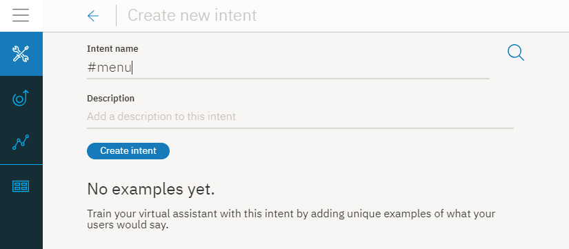
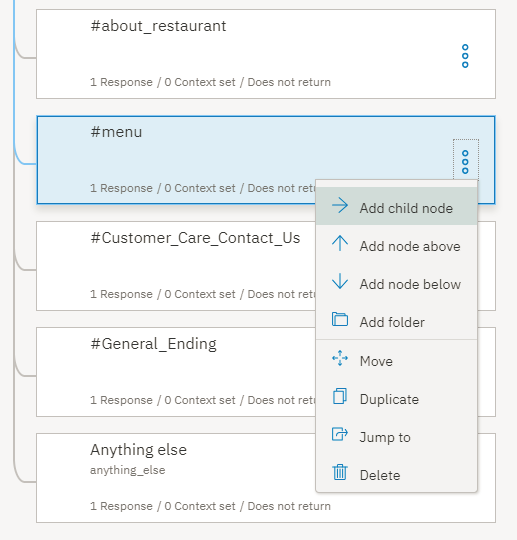
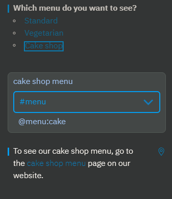
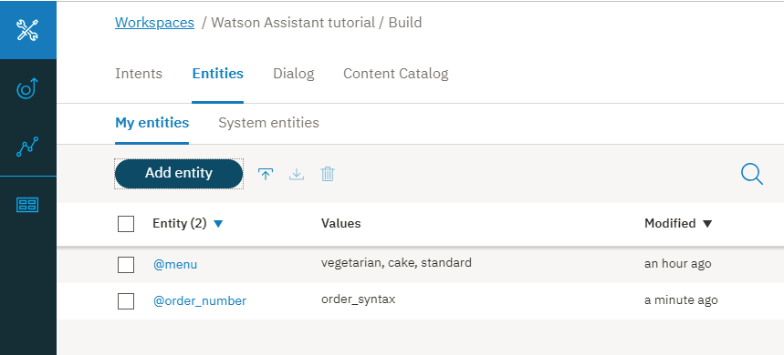
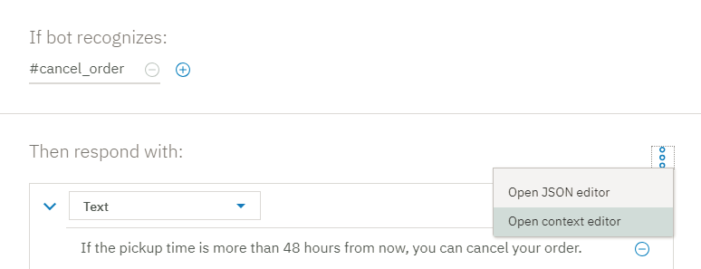
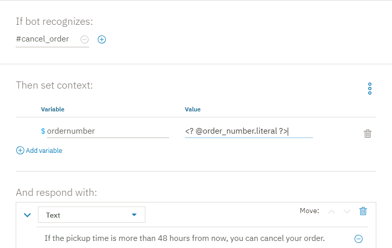
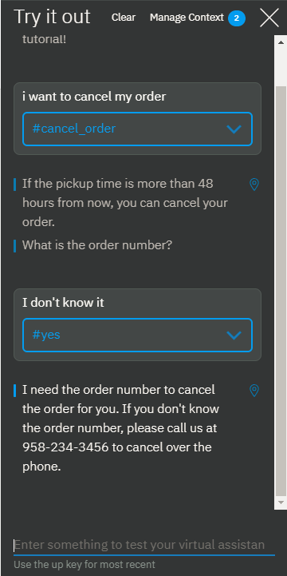
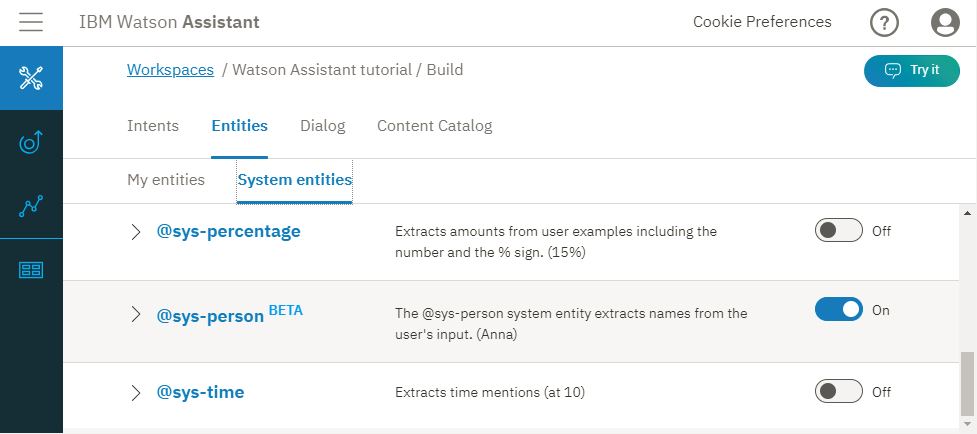
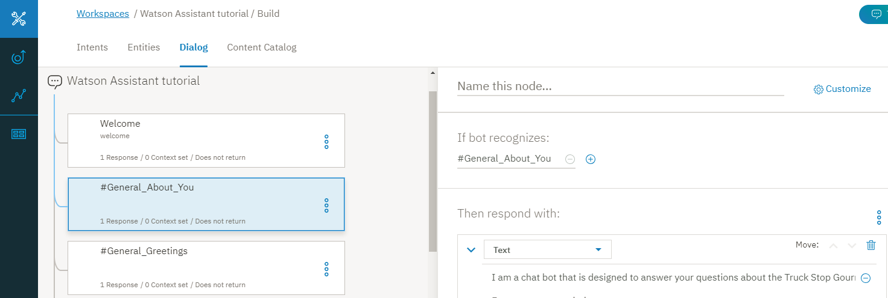
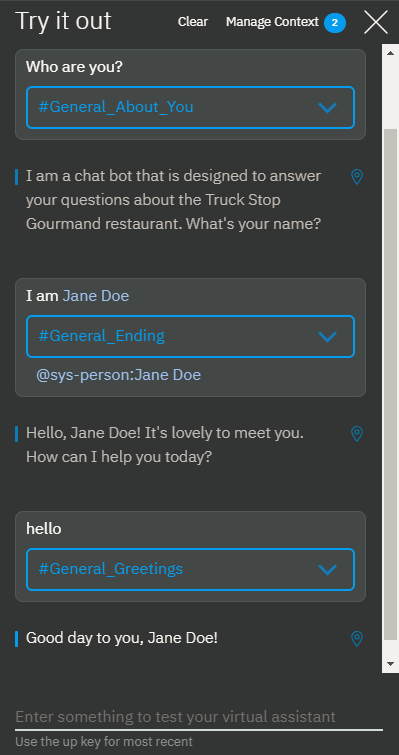

---

copyright:
  years: 2015, 2019
lastupdated: "2019-02-28"

subcollection: assistant

---

{:shortdesc: .shortdesc}
{:new_window: target="_blank"}
{:deprecated: .deprecated}
{:important: .important}
{:note: .note}
{:tip: .tip}
{:pre: .pre}
{:codeblock: .codeblock}
{:screen: .screen}
{:javascript: .ph data-hd-programlang='javascript'}
{:java: .ph data-hd-programlang='java'}
{:python: .ph data-hd-programlang='python'}
{:swift: .ph data-hd-programlang='swift'}
{:gif: data-image-type='gif'}

# チュートリアル: 複雑なダイアログの作成
{: #tutorial}

このチュートリアルでは、{{site.data.keyword.conversationshort}} サービスを使用して、*Truck Stop Gourmand* という架空のレストランに関する問い合わせを持つユーザーの役に立つアシスタントのダイアログを作成します。
{: shortdesc}

## 学習目標
{: #tutorial-objectives}

このチュートリアルを完了すると、以下の方法について理解できます。

- ダイアログを計画する
- カスタム・インテントを定義する
- インテントを処理できるダイアログ・ノードを追加する
- エンティティーを追加して応答をより具体的にする
- パターン・エンティティーを追加し、それをダイアログで使用してユーザー入力のパターンを見つける
- コンテキスト変数を設定して参照する

### 所要時間
{: #tutorial-duration}

このチュートリアルを完了するには、およそ 2 時間から 3 時間かかります。

### 前提条件
{: #tutorial-prereqs}

始めに、[開始チュートリアル](/docs/services/assistant?topic=assistant-getting-started)を完了します。

作成したダイアログ・スキルを使用して、開始演習の一部として作成した簡単なダイアログにノードを追加します。

## ステップ 1: ダイアログの計画
{: #tutorial-plan}

*Truck Stop Gourmand* というレストランのアシスタントを作成します。このレストランは 1 店舗で、ケーキ・ビジネスが好調です。レストランやそのメニューに関するユーザーの質問に答えたり、お客様のケーキのオーダーをキャンセルしたりする簡単なアシスタントが必要です。そのため、以下のサブジェクトに関連する問い合わせを処理するインテントを作成する必要があります。

- レストラン情報
- メニューの詳細
- オーダーのキャンセル

まず、これらのサブジェクトを表すインテントを作成し、それらに関するユーザーの質問に応答するダイアログを作成します。

## ステップ 2: レストランに関する質問への回答
{: #tutorial-add-about-intent}

お客様がレストランに関する詳細を尋ねたことを認識するインテントを追加します。インテントとは、ユーザー入力で表現される目的または目標のことです。 *一般* コンテンツ・カタログで提供される `#General_About_You` インテントは同じ機能を提供しますが、そのユーザー例は、お客様に役立つアシスタントを使用するビジネスではなく、アシスタントに関する照会に焦点を絞るように設計されています。そのため、独自のインテントを追加します。

### #about_restaurant インテントの追加
{: #tutorial-add-about-restaurant}

1.  **「インテント (Intents)」**タブで、**「インテントの追加 (Add intent)」**をクリックします。

    
1.  *「インテント名 (Intent name)」* フィールドに `about_restaurant` と入力し、**「インテントの作成 (Create intent)」**をクリックします。

    
1.  以下のユーザー例を追加します。

    ```
    Tell me about the restaurant
    i want to know about you
    who are the restaurant owners and what is their philosophy?
    What's your story?
    Where do you source your produce from?
    Who is your head chef and what is the chef's background?
    How many locations do you have?
    do you cater or host functions on site?
    Do you deliver?
    Are you open for breakfast?
    ```
    {: screen}

1.  **「閉じる」**  アイコンをクリックして、`#about_restaurant` インテントの追加を完了します。

インテントを追加し、実ユーザーが入力してこのインテントをトリガーする可能性がある発話の例を入力しました。

### #about_restaurant インテントでトリガーされるダイアログ・ノードの追加
{: #tutorial-trigger-about-intent}

ユーザー入力が前のステップで作成したインテントにマップされたことを認識するダイアログ・ノードを追加します (つまり、その条件によって、サービスがユーザー入力から `#about_restaurant` インテントを認識したかどうかチェックされます)。

1.  **「ダイアログ (Dialogs)」**タブをクリックします。
1.  ダイアログ・ツリーで `#General_Greetings` ノードを探します。

    この最初のあいさつノードの下にレストランに関する質問がないかチェックするノードを追加して、通常の会話で遭遇する可能性があるフローを反映させます。例えば、`Hello.` の後に `Tell me about yourself.` という会話が続くことがあります。

1.  `#General_Greetings` ノードで**「その他 (More)」**  アイコンをクリックしてから、**「ノードを下に追加 (Add node below)」**を選択します。

    
1.  このノードの**「条件の入力 (Enter a condition)」**フィールドに `#about_restaurant` と入力します。次に、`#about_restaurant` オプションを選択します。
1.  以下のテキストを応答として追加します。

    ```
    Truck Stop Gourmand is the brain child of Gloria and Fred Smith. What started out as a food truck in 2004 has expanded into a thriving restaurant. We now have one brick and mortar restaurant in downtown Portland. The bigger kitchen brought with it new chefs, but each one is faithful to the philosophy that made the Smith food truck so popular to begin with: deliver fresh, local produce in inventive and delicious ways. Join us for lunch or dinner seven days a week. Or order a cake from our bakery.
    ```
    {: codeblock}

1.  応答にイメージも追加しましょう。

    **「応答タイプの追加 (Add response type)」**をクリックします。ドロップダウン・リストから**「イメージ (Image)」**を選択します。**「イメージ・ソース (Image source)」**フィールドで、`https://www.ibmlearningcenter.com/wp-content/uploads/2018/02/IBM-Learning-Center-Food4.jpg` を追加します。
1.  イメージ応答タイプを上に移動して、テキストが表示される前にイメージが応答に表示されるようにします。**「移動 (Move)」**の上矢印をクリックして、2 つの応答タイプを並べ替えます。

    

1.   をクリックして、編集ビューを閉じます。

### #about_restaurant ダイアログ・ノードのテスト
{: #tutorial-test-about-intent}

似ているが完全には同じでないユーザー発話、つまりトレーニング・データに追加した例によって、サービスが `#about_restaurant` インテントで入力を認識するようにうまくトレーニングされているかどうかをチェックすることでインテントをテストします。

1.   アイコンをクリックして、「試行する (Try it out)」ペインを開きます。

1.  `I want to learn more about your restaurant.` と入力します。

    サービスは `#about_restaurant` インテントが認識されたことを示し、ダイアログ・ノードに指定したイメージとテキストを使用して応答を返します。

    

これで完了です。 カスタム・インテントおよびその処理方法がわかるダイアログ・ノードが追加されました。

`#about_restaurant` インテントは、レストランに関する一般的な各種質問を認識するように設計されています。そのような質問をキャプチャーする単一ノードを追加しました。応答は長いですが、1 文で以下のすべてのトピックに関する質問に回答できる可能性があります。

- レストラン所有者
- レストランの沿革
- 哲学
- 店舗数
- 営業日
- 提供される食事
- レストランではオーダーに応じてケーキを焼くということ

一般的な簡単に解決できる質問には、1 つの一般的な答えが適しています。

## ステップ 3: メニューに関する質問への回答
{: #tutorial-menu}

レストランの見込み客からの重要な質問は、メニューに関することです。Truck Stop Gourmand レストランでは、メニューを毎日変更します。標準メニュー以外に、ベジタリアン用のメニューとケーキ・ショップのメニューも用意しています。ユーザーがメニューについて尋ねると、ダイアログは共有するメニューを調べて、レストランの Web サイトで毎日最新の状態に維持されるメニューへのハイパーリンクを提供する必要があります。情報が定期的に変更される場合でも、その情報をダイアログ・ノードにハードコーディングする必要はありません。

### #menu インテントの追加
{: #tutorial-add-menu-intent}

1.  **「インテント (Intents)」**タブをクリックします。
1.  **「インテントの追加 (Add intent)」**をクリックします。

    

1.  *「インテント名 (Intent name)」* フィールドに `menu` と入力し、**「インテントの作成 (Create intent)」**をクリックします。

    

1.  以下のユーザー例を追加します。

    ```
    I want to see a menu
    What do you have for food?
    Are there any specials today?
    where can i find out about your cuisine?
    What dishes do you have?
    What are the choices for appetizers?
    do you serve desserts?
    What is the price range of your meals?
    How much does a typical dish cost?
    tell me the entree choices
    Do you offer a prix fixe option?
    ```
    {: screen}

1.  **「閉じる」**  アイコンをクリックして、`#menu` インテントの追加を完了します。

### #menu インテントでトリガーされるダイアログ・ノードの追加
{: #tutorial-trigger-menu-intent}

ユーザー入力が前のステップで作成したインテントにマップされたことを認識するダイアログ・ノードを追加します (つまり、その条件によって、サービスがユーザー入力から `#menu` インテントを認識したかどうかチェックされます)。

1.  **「ダイアログ (Dialogs)」**タブをクリックします。
1.  ダイアログ・ツリーで `#about_restaurant` ノードを探します。

    このノードの下にメニューに関する質問がないかチェックするノードを追加します。

1.  `#about_restaurant` ノードで**「その他 (More)」**  アイコンをクリックしてから、**「ノードを下に追加 (Add node below)」**を選択します。

    

1.  このノードの**「条件の入力 (Enter a condition)」**フィールドに `#menu` と入力します。それから、`#menu` オプションを選択します。

    

1.  以下のテキストを応答として追加します。

    `In keeping with our commitment to giving you only fresh local ingredients, our menu changes daily to accommodate the produce we pick up in the morning. You can find today's menu on our website.`

1.  ユーザーが選択するオプションのリストを提供する*オプション* 応答タイプを追加します。この例では、利用可能なメニューのさまざまなバージョンがオプションのリストに含まれます。

    **「応答タイプの追加 (Add response type)」**をクリックします。ドロップダウン・リストから**「オプション (Option)」**を選択します。

    

1.  **「タイトル (Title)」**フィールドに、*Which menu do you want to see?* を追加します。

    

1.  **「オプションの追加 (Add option)」**をクリックします。

1.  **「ラベル (Label)」**フィールドに、`Standard` を追加します。ラベルとして追加したテキストは、ユーザーへの応答に、選択可能なオプションとして表示されます。

1.  **「値 (Value)」**フィールドに、`standard menu` を追加します。値として指定したテキストは、ユーザーがリストからこのオプションを選択してクリックしたときに新しいユーザー入力としてサービスに送信されます。

1.  上記の 2 つのステップを繰り返して、残りのメニュー・タイプのラベルと値の情報を追加します。

    <table>
    <caption>オプション応答タイプの詳細</caption>
    <tr>
      <th>ラベル</th>
      <th>値</th>
    </tr>
    <tr>
      <td>Vegetarian</td>
      <td>vegetarian menu</td>
    </tr>
    <tr>
      <td>Cake shop</td>
      <td>cake shop menu</td>
    </tr>
    </table>

    

1.   をクリックして、編集ビューを閉じます。

### @menu エンティティーの追加
{: #tutorial-add-menu-entity}

お客様が見たがっているさまざまなタイプのメニューを認識するには、`@menu` エンティティーを追加します。エンティティーとは、ユーザーのある目的に関連した、オブジェクトのクラスまたはデータ・タイプを表しています。 特定のエンティティーがユーザー入力に存在するかどうかをチェックすることで、個別のユーザー要求に対応するように調整された応答を追加できます。この例では、異なるメニュー・タイプを区別できる `@menu` エンティティーを追加します。

1.  **「エンティティー (Entities)」**タブをクリックします。

    

1.  **「エンティティーの追加 (Add entity)」**をクリックします。

1.  エンティティー名フィールドに `menu` と入力します。

    

1.  **「エンティティーの作成 (Create entity)」**をクリックします。

1.  *「値名 (Value name)」* フィールドに `standard` を追加し、**「同義語 (Synonyms)」**フィールドに `standard menu` を追加して Enter キーを押します。

1.  以下の同義語を追加します。

    - bill of fare
    - cuisine
    - carte du jour

    

1.  **「値の追加 (Add value)」**をクリックして、`@menu:standard` 値を追加します。

1.  *「値名 (Value name)」* フィールドに `vegetarian` を追加し、**「同義語 (Synonyms)」**フィールドに `vegetarian menu` を追加して Enter キーを押します。

1.  **「推奨の表示 (Show recommendations)」**をクリックし、*meatless diet*、*meatless*、および *vegan diet* のチェック・ボックスをクリックします。

1.  **「選択した項目の追加 (Add selected)」**をクリックします。

1.  空の*「同義語の追加 (Add synonym)」* フィールドをクリックし、以下の同義語を追加します。

    - vegan
    - plants-only

    

1.  **「値の追加 (Add value)」**をクリックして、`@menu:vegetarian` 値を追加します。

1.  *「値名 (Value name)」* フィールドに `cake` を追加し、**「同義語 (Synonyms)」**フィールドに `cake menu` を追加して Enter キーを押します。

1.  以下の同義語を追加します。

    - cake shop menu
    - dessert menu
    - bakery offerings

    

1.  **「値の追加 (Add value)」**をクリックして、`@menu:cake` 値を追加します。

1.  **「閉じる」**  アイコンをクリックして、`@menu` エンティティーの追加を完了します。

### @menu エンティティー・タイプでトリガーされる下位ノードの追加
{: #tutorial-trigger-menu-entity}

このステップでは、`#menu` インテントをチェックするダイアログ・ノードに下位ノードを追加します。各下位ノードは、ユーザーがオプション・リストから選択した `@menu` エンティティー・タイプに応じてさまざまな応答を示します。

1.  **「ダイアログ (Dialogs)」**タブをクリックします。
1.  ダイアログ・ツリーで `#menu` ノードを探します。

    `#menu` ノードに追加した各メニュー・タイプ・オプションを処理する下位ノードを追加します。

1.  `#menu` ノードで**「その他 (More)」**  アイコンをクリックしてから、**「下位ノードの追加 (Add child node)」**を選択します。

    

1.  このノードの**「条件の入力 (Enter a condition)」**フィールドに `@menu:standard` と入力します。それから、`@menu:standard` オプションを選択します。

1.  応答のテキスト・フィールドにメッセージ `To see our menu, go to the <a href="https://www.example.com/menu.html" target="blank">menu</a> page on our website.` を追加します。

    

1.   をクリックして、編集ビューを閉じます。

1.  `@menu:standard` ノードで**「その他 (More)」**  アイコンをクリックしてから、**「ノードを下に追加 (Add node below)」**を選択します。

1.  このノードの**「条件の入力 (Enter a condition)」**フィールドに `@menu:vegetarian` と入力します。それから、`@menu:vegetarian` オプションを選択します。

1.  応答のテキスト・フィールドにメッセージ `To see our vegetarian menu, go to the <a href="https://www.example.com/vegetarian-menu.html" target="blank">vegetarian menu</a> page on our website.` を追加します。

    

1.   をクリックして、編集ビューを閉じます。

1.  `@menu:vegetarian` ノードで**「その他 (More)」**  アイコンをクリックしてから、**「ノードを下に追加 (Add node below)」**を選択します。

1.  このノードの**「条件の入力 (Enter a condition)」**フィールドに `@menu:cake` と入力します。それから、`@menu:cake` オプションを選択します。

1.  応答のテキスト・フィールドにメッセージ `To see our cake shop menu, go to the <a href="https://www.example.com/menu.html" target="blank">cake shop menu</a> page on our website.` を追加します。

    

1.   をクリックして、編集ビューを閉じます。

1.  標準メニューが最も頻繁に要求される可能性が高いため、これを下位ノード・リストの一番下に移動します。このメニューを最後に配置することで、誰かが標準メニューではなく特別メニューを要求したときに誤って標準メニューがトリガーされるのを防ぐことができます。

1.  `@menu:standard` ノードで**「その他 (More)」**  アイコンをクリックしてから、**「移動 (Move)」**を選択します。

    

1.  `@menu:cake` ノードを選択し、**「ノードを下に (Below node)」**を選択します。

    

メニュー詳細のユーザー要求を認識するノードが追加されました。応答により、ユーザーに 3 つのタイプのメニューが使用可能であることが示され、ユーザーはいずれか 1 つを選択するよう求められます。ユーザーがメニュー・タイプを選択すると、応答が表示され、要求されたメニュー詳細を含む Web ページへのハイパーテキスト・リンクが示されます。

### メニュー・オプション・ダイアログ・ノードのテスト
{: #tutorial-test-menu-options-intent}

メニューの質問を認識するために追加したダイアログ・ノードをテストします。

1.   アイコンをクリックして、「試行する (Try it out)」ペインを開きます。

1.  `What type of food do you serve?` と入力します。

    サービスは `#menu` インテントが認識されたことを示し、ユーザーが選択できるメニュー・オプションのリストを表示します。

    
1.  `Cake shop` オプションをクリックします。

    サービスは `#menu` インテントと `@menu:cake` エンティティー・リファレンスを認識し、応答 `To see our cake shop menu, go to the cake shop page on our website.` を表示します。

    
1.  応答の *cake shop* ハイパーリンクをクリックします。

    新しい Web ブラウザー・ページが開き、example.com Web サイトが表示されます。

1.  Web ブラウザー・ページを閉じます。

お疲れ様でした。メニュー詳細に対するユーザー要求を認識し、ユーザーを適切なメニューに導くことができるインテントとエンティティーが正常に追加されました。

`#menu` インテントは、レストランの見込み客の一般的で重要なニーズを表します。これは重要かつ一般的であるため、うまく対応するためにより複雑なセクションをダイアログに追加しました。

## ステップ 4: ケーキ・オーダーの管理
{: #tutorial-manage-orders}

お客様は、対面または電話でオーダーするか、Web サイトのオーダー・フォームを使用してオーダーします。オーダー後、ユーザーは仮想アシスタントからオーダーをキャンセルできます。まず、オーダー番号を認識できるエンティティーを定義します。次に、ユーザーがケーキ・オーダーのキャンセルを望んでいることを認識するインテントを追加します。

### オーダー番号パターン・エンティティーの追加
{: tutorial-add-pattern-entity}

アシスタントがオーダー番号を認識するようにする必要があるため、レストランでオーダーを識別するために使用される一意のフォーマットを認識するパターン・エンティティーを作成します。レストランのベーカリーで使用されるオーダー番号の構文は、2 つの大文字とその後に続く 5 桁の数字です。例えば、`YR34663` となります。この文字パターンを認識できるエンティティーを追加します。

1.  **「エンティティー (Entities)」**タブをクリックします。
1.  **「エンティティーの追加 (Add entity)」**をクリックします。
1.  エンティティー名フィールドに `order_number` と入力します。
1.  **「エンティティーの作成 (Create entity)」**をクリックします。

    
1.  *「値名 (Value name)」* フィールドに `order_syntax` を追加し、**「同義語 (Synonyms)」**の横にある下矢印をクリックして、タイプを**「パターン (Pattern)」**に変更します。

    
1.  「パターン (Pattern)」フィールドに正規表現 `[A-Z]{2}\d{5}` を追加します。

    

1.  **「値の追加 (Add value)」**をクリックします。

    

1.  **「閉じる」**  アイコンをクリックして、`@order_number` エンティティーの追加を完了します。

    

### オーダー・キャンセル・インテントの追加
{: #tutorial-cancel-order-intent}

1.  **「インテント (Intents)」**タブをクリックします。
1.  **「インテントの追加 (Add intent)」**をクリックします。
1.  *「インテント名 (Intent name)」* フィールドに `cancel_order` と入力し、**「インテントの作成 (Create intent)」**をクリックします。
1.  以下のユーザー例を追加します。

    ```
    I want to cancel my cake order
    I need to cancel an order I just placed
    Can I cancel my cake order?
    I'd like to cancel my order
    There's been a change. I need to cancel my bakery order.
    please cancel the birthday cake order I placed last week
    The party theme changed; we don't need a cake anymore
    that order i placed, i need to cancel it.
    ```
    {: screen}

    
1.  **「閉じる」**  アイコンをクリックして、`#cancel_order` インテントの追加を完了します。

### yes インテントの追加
{: #tutorial-yes-intent}

ユーザーの代わりにアクションを実行する前に、適切なアクションを実行するという確認を取る必要があります。ユーザーがサービスによる提案に同意したことを認識できるダイアログに #yes インテントを追加します。

1.  **「インテント (Intents)」**タブをクリックします。
1.  **「インテントの追加 (Add intent)」**をクリックします。
1.  *「インテント名 (Intent name)」* フィールドに `yes` と入力し、**「インテントの作成 (Create intent)」**をクリックします。
1.  以下のユーザー例を追加します。

    ```
    Yes
    Correct
    Please do.
    You've got it right.
    Please do that.
    that is correct.
    That's right
    yeah
    Yup
    Yes, I'd like to go ahead with that.
    ```
    {: screen}

    
1.  **「閉じる」**  アイコンをクリックして、`#yes` インテントの追加を完了します。

### オーダーをキャンセルする要求を管理できるダイアログ・ノードの追加
{: #tutorial-cancel-order-dialog}

次に、ケーキ・オーダーをキャンセルする要求を処理できるダイアログ・ノードを追加します。

1.  **「ダイアログ (Dialog)」**タブをクリックします。
1.  `#menu` ノードを探します。`#menu` ノードで**「その他 (More)」**  アイコンをクリックしてから、**「ノードを下に追加 (Add node below)」**を選択します。
1.  このノードの**「条件の入力 (Enter a condition)」**フィールドに `#cancel_order` と入力します。それから、`#cancel_order` オプションを選択します。
1.  以下のメッセージを応答のテキスト・フィールドで追加します。

    ```
    If the pickup time is more than 48 hours from now, you can cancel your order.
    ```
    {: codeblock}

    

    オーダーを実際にキャンセルする前に、オーダー番号を把握する必要があります。ユーザーは元の要求でオーダー番号を指定している可能性があります。そのため、オーダー番号を再度尋ねないようにするには、元の入力でオーダー番号パターンを使用して番号をチェックします。そのためには、オーダー番号を指定された場合に保存するコンテキスト変数を定義します。

1.  コンテキスト・エディターを開きます。**「その他 (More)」**  アイコンをクリックして、**「コンテキスト・エディターを開く (Open context editor)」**を選択します。

    
1.  以下のコンテキスト変数名と値のペアを入力します。

    <table>
    <caption>オーダー番号コンテキスト変数の詳細</caption>

    <tr>
      <th>変数</th>
      <th>値</th>
    </tr>
    <tr>
      <td>$ordernumber</td>
      <td><? @order_number.literal ?></td>
    </tr>
    </table>

    コンテキスト変数の値 (`<? @order_number.literal ?>`) は、ユーザーが指定した、@order_number パターン・エンティティーで定義されたパターンに一致する番号を取得する SpEL 式です。この値は `$ordernumber` 変数に保存されます。

    
1.   をクリックして、編集ビューを閉じます。

    次に、オーダー番号を尋ねるか、検出されたオーダー番号のオーダーをキャンセルすることをユーザーに確認する下位ノードを追加します。
1.  `#cancel_order` ノードで**「その他 (More)」**  アイコンをクリックしてから、**「下位ノードの追加 (Add child node)」**を選択します。

    
1.  ラベルをノードに追加して、追加する他の下位ノードと区別します。名前フィールドに `Ask for order number` を追加します。このノードの **「Enter a condition」**フィールドに `true` と入力します。

1.  以下のメッセージを応答のテキスト・フィールドで追加します。

    ```
    What is the order number?
    ```
    {: codeblock}

    
1.   をクリックして、編集ビューを閉じます。

    次に、オーダーをキャンセルすることをユーザーに通知する別の下位ノードを追加します。
1.  `Ask for order number` ノードで**「その他 (More)」**  アイコンをクリックしてから、**「下位ノードの追加 (Add child node)」**を選択します。
1.  このノードの **「Enter a condition」**フィールドに `@order_number` と入力します。
1.  コンテキスト・エディターを開きます。**「その他 (More)」**  アイコンをクリックして、**「コンテキスト・エディターを開く (Open context editor)」**を選択します。
1.  以下のコンテキスト変数名と値のペアを入力します。

    <table>
    <caption>オーダー番号コンテキスト変数の詳細</caption>

    <tr>
      <th>変数</th>
      <th>値</th>
    </tr>
    <tr>
      <td>$ordernumber</td>
      <td><? @order_number.literal ?></td>
    </tr>
    </table>

    コンテキスト変数の値 (`<? @order_number.literal ?>`) は、ユーザーが指定した、@order_number パターン・エンティティーで定義されたパターンに一致する番号を取得する SpEL 式です。この値は `$ordernumber` 変数に保存されます。
1.  以下のメッセージを応答のテキスト・フィールドで追加します。

    ```
    Ok. The order $ordernumber is canceled. We hope we get the opportunity to bake a cake for you sometime soon.
    ```
    {: codeblock}

    
1.   をクリックして、編集ビューを閉じます。
1.  ユーザーが番号を指定し、それが有効なオーダー番号ではないことをキャプチャーする別のノードを追加します。`@order_number` ノードで**「その他 (More)」**  アイコンをクリックしてから、**「ノードを下に追加 (Add node below)」**を選択します。
1.  このノードの **「Enter a condition」**フィールドに `true` と入力します。
1.  以下のメッセージを応答のテキスト・フィールドで追加します。

    ```
    I need the order number to cancel the order for you. If you don't know the order number, please call us at 958-234-3456 to cancel over the phone.
    ```
    {: codeblock}

    
1.   をクリックして、編集ビューを閉じます。

1.  ユーザーが最初の要求でオーダー番号を指定した場合に応答する最初のオーダー・キャンセル要求ノードの下にノードを追加します。これにより、ノード番号を再度尋ねる必要がなくなります。`#cancel_order` ノードで**「その他 (More)」**  アイコンをクリックしてから、**「下位ノードの追加 (Add child node)」**を選択します。
1.  ラベルをノードに追加して、他の下位ノードと区別します。名前フィールドに `Number provided` を追加します。このノードの **「Enter a condition」**フィールドに `@order_number` と入力します。
1.  以下のメッセージを応答のテキスト・フィールドで追加します。

    ```
    Just to confirm, you want to cancel order $ordernumber?
    ```
    {: codeblock}

    
1.   をクリックして、編集ビューを閉じます。

    確認質問に対するユーザーの応答をチェックする下位ノードを追加する必要があります。
1.  `Number provided` ノードで**「その他 (More)」**  アイコンをクリックしてから、**「下位ノードの追加 (Add child node)」**を選択します。
1.  このノードの **「Enter a condition」**フィールドに `#yes` と入力します。

1.  以下のメッセージを応答のテキスト・フィールドで追加します。

    ```
    Ok. The order $ordernumber is canceled. We hope we get the opportunity to bake a cake for you sometime soon.
    ```
    {: codeblock}

    
1.   をクリックして、編集ビューを閉じます。

1.  `#yes` ノードで**「その他 (More)」**  アイコンをクリックしてから、**「ノードを下に追加 (Add node below)」**を選択します。

1.  このノードの **「Enter a condition」**フィールドに `true` と入力します。

    応答を追加しないでください。代わりに、前に作成したオーダー番号の詳細を尋ねるブランチにユーザーをリダイレクトします。

1.  *「最後 (And finally)」* セクションで、**「ジャンプ先 (Jump-to)」**を選択します。

    
1.  *Ask for order number* ノードの条件を選択します。

    
1.   をクリックして、編集ビューを閉じます。
1.  *Number provided* ノードを *Ask for order number* ノードの上に移動します。`Number provided` ノードで**「その他 (More)」**  アイコンをクリックしてから、**「移動 (Move)」**を選択します。*Ask for order number* ノードを選択し、**「ノードを上に (Above node)」**をクリックします。

    
1.  `#cancel_order` ノードの下位ノードを実行時に評価することを会話に強制します。編集ビューで `#cancel_order` ノードをクリックして開き、`And finally` セクションで `Skip user input` を選択します。

    

### オーダー・キャンセルのテスト
{: #tutorial-test-cancel-order}

サービスがユーザー入力の製品オーダー番号に使用されているパターンに一致する文字パターンを認識できるかどうかをテストします。

1.   アイコンをクリックして、「試行する (Try it out)」ペインを開きます。

1.  `i want to cancel my order number TW12345.` と入力します。

    サービスは `#cancel_order` インテントと `@order_number` エンティティーの両方を認識します。`If the pickup time is more than 48 hours from now, you can cancel your order. Just to confirm, you want to cancel order TW12345?` で応答します。

1.  `Yes` と入力します。

    サービスは `#yes` インテントを認識し、`Ok. The order TW12345 is canceled. We hope we get the opportunity to bake a cake for you sometime soon.` で応答します。

    

    次に、オーダー番号がわからない場合を試してみます。
1.  「試行する (Try it out)」ペインで **「クリア (Clear)」**をクリックしてやり直します。`I want to cancel my order.` と入力します。

    サービスは `#cancel_order` インテントを認識し、`If the pickup time is more than 48 hours from now, you can cancel your order. What is the order number?` で応答します。

1.  `I don't know.` と入力します。

    サービスは `I need the order number to cancel the order for you. If you don't know the order number, please call us at 958-234-3456 to cancel over the phone.` で応答します。

    

さらにテストを実施すると、ユーザーがオーダー番号のフォーマットを覚えていない場合はダイアログがあまり役に立たないことがわかることがあります。ユーザーは数字のみを指定したり、文字も指定するが、大文字にすることを忘れていたりする可能性があります。したがって、そのような場合はヒントを出すのがよい方法です。親切にするなら、ダイアログ・ツリーに、ユーザー入力の番号をチェックする別のノードを追加します。

1.  *Ask order number* ノードの子である `@order-number` ノードを探します。

1.  `@order_number` ノードで**「その他 (More)」**  アイコンをクリックしてから、**「ノードを下に追加 (Add node below)」**を選択します。

1.  条件フィールドで、`input.text.find('\d')` を追加します。これは、ユーザー入力に 1 つ以上の番号を見つけた場合にこの応答をトリガーすることを示す SpEL 式です。

1.  テキスト応答フィールドで、以下の応答を追加します。

    ```
    The correct format for our order numbers is AAnnnnn. The A's represents 2 upper-case letters, and the n's represents 5 numbers. Do you have an order number in that format?
    ```
    {: codeblock}

1.   をクリックして、編集ビューを閉じます。

1.  `input.text.find('\d')` ノードで**「その他 (More)」**  アイコンをクリックしてから、**「下位ノードの追加 (Add child node)」**を選択します。

1.  このノードの **「Enter a condition」**フィールドに `true` と入力します。

1.  **「カスタマイズ (Customize)」**をクリックし、*「複数の応答 (Multiple responses)」* トグルを**「オン (on)」**に切り替えて、条件付き応答を有効にします。

1.  **「適用」**をクリックします。

1.  新しく追加された*「ボットが認識する場合 (If bot recognizes)」* フィールドに `@order_number` と入力し、*「応答 (Respond with)」* フィールドに以下のように入力します。

    ```
    Ok. The order $ordernumber is canceled. We hope we get the opportunity to bake a cake for you sometime soon.
    ```
    {: codeblock}

1.  **「応答の追加 (Add response)」**をクリックします。

1.  *「ボットが認識する場合 (If bot recognizes)」* フィールドに `true` と入力し、*「応答 (Respond with)」* フィールドに以下のように入力します。

    ```
    I need the order number to cancel the order for you. If you don't know the order number, please call us at 958-234-3456 to cancel over the phone.
    ```
    {: codeblock}

    
1.   をクリックして、編集ビューを閉じます。

テストするときに、入力として番号のセットまたは番号とテキストの組み合わせを指定でき、ダイアログによってオーダー番号の正しいフォーマットが示されます。ダイアログのテスト、弱点の検出、およびその修正が正常に終了しました。

このタイプのシナリオに対応できる別の方法は、スロットを含むノードの追加です。スロットを使用する方法について詳しくは、[スロットを含むノードをダイアログに追加する](/docs/services/assistant?topic=assistant-tutorial-slots)チュートリアルを参照してください。
{:tip}

## ステップ 5: 個人的な対応の追加
{: #tutorial-get-username}

ユーザーがボット自体に興味を示した場合は、仮想アシスタントでその好奇心を認識し、より個人的にユーザーとやり取りできます。*一般* コンテンツ・カタログで提供される `#General_About_You` インテントを思い出すかもしれません。独自のカスタム `#about_restaurant` インテントを追加する前に、これを使用することを検討しました。このインテントは、ユーザーからのこのような質問を認識するために組み込まれています。このインテントを条件とするノードを追加します。応答で、ユーザーの名前を尋ね、それをダイアログ内のどこでも使用できる $username 変数に保存します (使用可能な場合)。

まず、ユーザーが名前を入力した場合にそれをサービスが認識するようにします。一般的な氏名 (英語) を認識するように設計された `@sys-person` エンティティーを有効にできます。

### 個人システム・エンティティーの追加
{: #tutorial-add-person-entity}

サービスには、どのアプリケーションでも使用できる共通エンティティーである、*システム・エンティティー* が多数用意されています。

1.  **「エンティティー (Entities)」**タブをクリックし、**「システム・エンティティー (System entities)」**をクリックします。

1.  *`@sys-person`* エンティティー・トグルを探して**「オン (On)」**に切り替えます。

    

### ボットに関する質問を処理するノードの追加
{: #tutorial-add-about-you-node}

次に、ボットへのユーザーの興味を認識して応答できるダイアログ・ノードを追加します。

1.  **「ダイアログ (Dialogs)」**タブをクリックします。
1.  ダイアログ・ツリーで `Welcome` ノードを探します。
1.  `Welcome` ノードで**「その他 (More)」**  アイコンをクリックしてから、**「ノードを下に追加 (Add node below)」**を選択します。
1.  このノードの**「条件の入力 (Enter a condition)」**フィールドに `#General_About_You` と入力します。次に、`#General_About_You` オプションを選択します。
1.  以下のメッセージを応答のテキスト・フィールドで追加します。

    ```
    I am a virtual assistant that is designed to answer your questions about the Truck Stop Gourmand restaurant. What's your name?
    ```
    {: codeblock}

    
1.   をクリックして、編集ビューを閉じます。
1.  `#General_About_You` ノードで**「その他 (More)」**  アイコンをクリックしてから、**「下位ノードの追加 (Add child node)」**を選択します。
1.  このノードの**「条件の入力 (Enter a condition)」**フィールドに `@sys-person` と入力します。それから、`@sys-person` オプションを選択します。
1.  以下のメッセージを応答のテキスト・フィールドで追加します。

    ```
    Hello, <? @sys-person.literal ?>! It's lovely to meet you. How can I help you today.
    ```
    {: codeblock}

1.  ユーザーが指定した名前を取得するには、コンテキスト変数をノードに追加します。**「その他 (More)」**  アイコンをクリックして、**「コンテキスト・エディターを開く (Open context editor)」**を選択します。
1.  以下のコンテキスト変数名と値のペアを入力します。

    <table>
    <caption>ユーザー名コンテキスト変数の詳細</caption>

    <tr>
      <th>変数</th>
      <th>値</th>
    </tr>
    <tr>
      <td>$username</td>
      <td><? @sys-person.literal ?></td>
    </tr>
    </table>

    コンテキスト変数の値 (`<? @sys-person.literal ?>`) は、ユーザーが指定したユーザー名を取得し、それを `$username` コンテキスト変数に保存する SpEL 式です。

    
1.   をクリックして、編集ビューを閉じます。
1.  `@sys-person` ノードで**「その他 (More)」**  アイコンをクリックしてから、**「ノードを下に追加 (Add node below)」**を選択します。

    名前が含まれないユーザー応答を取得するノードを追加します。ユーザーが共有しない場合は、ボットでとにかく会話を続けることができます。
1.  このノードの **「Enter a condition」**フィールドに `true` と入力します。
1.  以下のメッセージを応答のテキスト・フィールドで追加します。

    ```
    How can I help you today?
    ```
    {: codeblock}

    
1.   をクリックして、編集ビューを閉じます。

実行時にユーザーがこのノードをトリガーして名前を指定した場合は、ユーザーの名前がわかります。名前がわかった場合は、それを使用します。ユーザー名 (わかる場合) を使用する条件付き応答を含めるために前に追加したあいさつダイアログ・ノードに条件付き応答を追加します。

### あいさつへのユーザー名の追加
{: #tutorial-add-username-to-greeting}

ユーザー名がわかっている場合は、それをあいさつメッセージに含めます。そのためには、条件付き応答を追加し、ユーザー名が含まれるあいさつのバリエーションを含めます。

1.  ダイアログ・ツリーで `#General_Greetings` ノードを探し、編集ビューでクリックして開きます。
1.  **「カスタマイズ (Customize)」**をクリックし、*「複数の応答 (Multiple responses)」* トグルを**「オン (on)」**に切り替えます。

    
1.  **「適用」**をクリックします。

    
1.  **「応答の追加 (Add response)」**をクリックします。
1.  *「ボットが認識する場合 (If bot recognizes)」* フィールドに `$username` と入力し、*「応答 (Respond with)」* フィールドに以下のように入力します。

    ```
    Good day to you, $username!
    ```
    {: codeblock}

1.  応答番号 2 の上矢印をクリックし、応答番号 1 (`Good day to you!`) の前にリストされるように移動します。

    
1.   をクリックして、編集ビューを閉じます。

### パーソナライゼーションのテスト
{: #tutorial-test-personalize}

サービスがユーザー名を認識して保存し、後でその名前でユーザーを参照できるかどうかをテストします。

1.   アイコンをクリックして、「試行する (Try it out)」ペインを開きます。

1.  **「クリア (Clear)」**をクリックして、会話セッションを再始動します。

1.  `Who are you?` と入力します。

    サービスは `#General_About_You` インテントを認識します。その応答は質問 `What's your name?` で終了します。
1.  `I am Jane Doe.` と入力します。

    サービスは `@sys-person` エンティティー言及として `Jane Doe` を認識します。名前がコメントされ、どのような用件か尋ねられます。
1.  `Hello.` と入力します。

    サービスは `#General_Greetings` インテントを認識し、`Good day to you, Jane Doe!` と応答します。`$username` コンテキスト変数にあいさつノードがトリガーされた時点の値が含まれるため、ユーザー名が含まれる条件付き応答を使用します。

    

パーソナライゼーションによって値が会話に追加される他の応答のために、ユーザー名を条件とし、そのユーザー名が含まれる条件付き応答を追加できます。

## ステップ 6: Web ページ統合からのアシスタントのテスト
{: #tutorial-integrate-assistant}

より洗練されたバージョンのアシスタントを構築したので、ここでは、前のチュートリアルでデプロイしたパブリック Web ページに戻り、追加した新機能をテストします。

1.  アシスタントを開きます。
1.  *「統合 (Integrations)」* 領域で、**「プレビュー・リンク (Preview Link)」**をクリックします。
1.  ページに表示される URL をクリックします。

    新しいタブにページが開きます。
1.  「試行する (Try it out)」ペインに送信したテスト発話のいくつかを繰り返して、実際の統合でのアシスタントの動作を確認します。

    「試行する (Try it out)」ペインからテスト発話をサービスに送信した場合とは異なり、標準の使用料は、チャット・ウィジェットに送信された発話に起因する API 呼び出しに適用されます。
    {: note}

## 次のステップ
{: #tutorial-deploy}

ダイアログ・スキルの作成とテストが完了したので、このスキルをお客様と共有できます。まずスキルをアシスタントに接続してからアシスタントをデプロイして、スキルをデプロイします。これを行う方法はいくつかあります。 詳しくは、[統合の追加](/docs/services/assistant?topic=assistant-deploy-integration-add)を参照してください。
