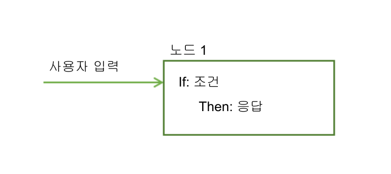
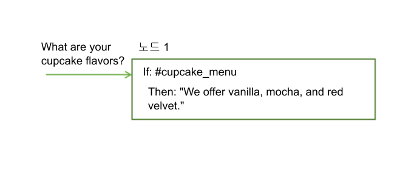
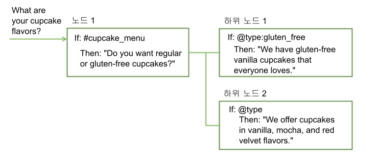
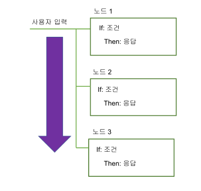
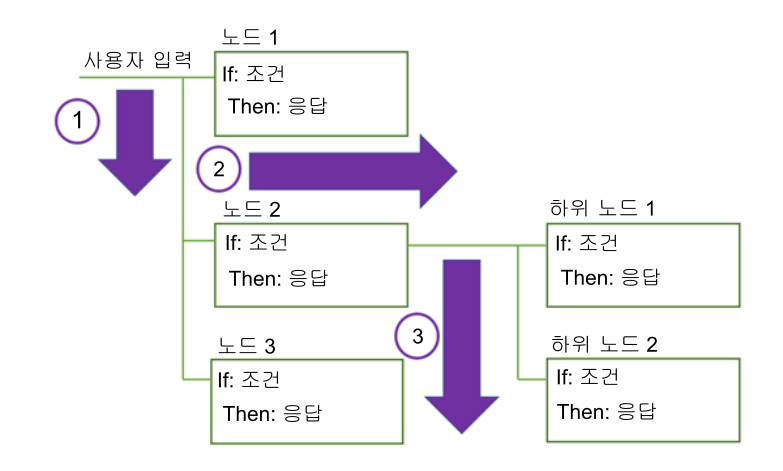
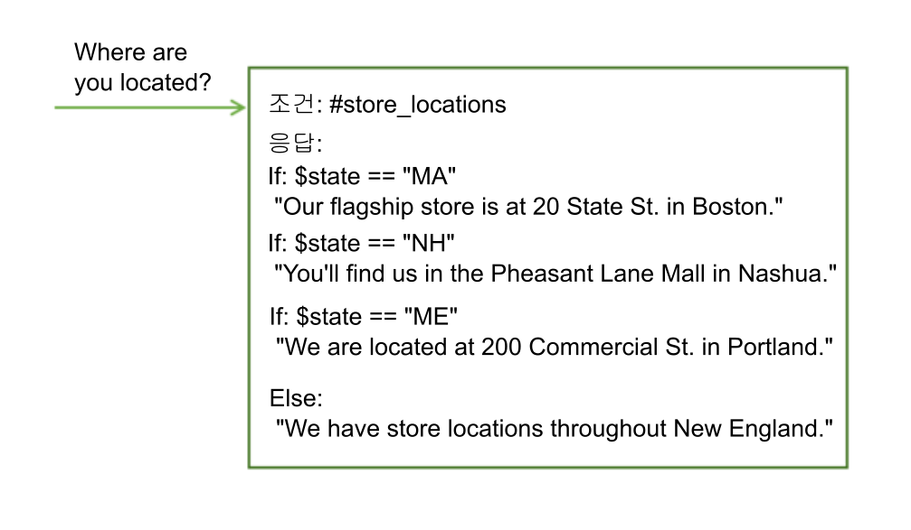

---

copyright:
  years: 2015, 2018
lastupdated: "2018-02-09"

---

{:shortdesc: .shortdesc}
{:new_window: target="_blank"}
{:tip: .tip}
{:pre: .pre}
{:codeblock: .codeblock}
{:screen: .screen}
{:javascript: .ph data-hd-programlang='javascript'}
{:java: .ph data-hd-programlang='java'}
{:python: .ph data-hd-programlang='python'}
{:swift: .ph data-hd-programlang='swift'}
{:table: .aria-labeledby="caption"}

# 대화 상자 개요
{: #dialog-overview}

대화 상자는 사용자 입력에서 식별되는 인텐트와 엔티티 및 애플리케이션의 컨텍스트를 사용하여 사용자와 상호작용하고 궁극적으로 유용한 응답을 제공합니다.
{: shortdesc}

응답은 `Where can I get some gas?`와 같은 질문에 대한 응답 또는 명령 실행(예: 라디오 켜기)일 수 있습니다. 인텐트와 엔티티가 올바른 응답을 식별하기에 충분한 정보가 될 수도 있고, 대화 상자가 올바르게 응답하는 데 필요한 추가 입력을 사용자에게 요청할 수도 있습니다. 예를 들어, 사용자가 `Where can I get some food?`라고 질문하는 경우, 식당을 갈지 아니면 식료품점을 갈지, 먹고 갈지 아니면 포장해 갈지 등을 명확하게 하길 원할 수 있습니다. 텍스트 응답에서 세부사항을 질문하고 하나 이상의 하위 노드를 작성하여 새 입력을 처리할 수 있습니다.

<iframe class="embed-responsive-item" id="youtubeplayer" type="text/html" width="640" height="390" src="https://www.youtube.com/embed/oQUpejt6d84?rel=0" frameborder="0" webkitallowfullscreen mozallowfullscreen allowfullscreen> </iframe>

대화 상자는 {{site.data.keyword.conversationshort}} 도구에서 트리로 표시됩니다. 분기를 작성하여 대화에서 다룰 각 인텐트를 처리하십시오. 분기는 여러 노드로 구성됩니다.

## 대화 상자 노드

각 대화 상자 노드에는 최소한 조건과 응답이 포함됩니다.



- 조건: 대화 상자의 해당 노드를 트리거하기 위해 사용자 입력에 있어야 하는 정보를 지정합니다. 정보는 특정 인텐트, 엔티티 값 또는 컨텍스트 변수값입니다. 자세한 정보는 [조건](dialog-runtime.html#conditions)을 참조하십시오.
- 응답: 서비스가 사용자에게 응답하는 데 사용하는 표현입니다. 또한 프로그래밍 방식의 조치를 트리거하도록 응답을 구성할 수 있습니다. 자세한 정보는 [응답](#responses)을 참조하십시오.

노드가 if/then 구현/구축(Construction)을 가진 것으로 간주할 수 있습니다. 이 조건이 true이면 이 응답을 리턴합니다.

예를 들어, 서비스의 자연어 처리 기능이 사용자 입력에 `#cupcake-menu` 인텐트가 포함되어 있다고 판별하는 경우 다음 노드가 트리거됩니다. 노드가 트리거되면 서비스가 적절하게 응답합니다.



하나의 조건과 응답이 있는 단일 노드는 단순 사용자 요청을 처리할 수 있습니다. 하지만 대개 사용자는 복잡한 질문을 하거나 복잡한 태스크에 대한 도움을 원합니다. 사용자에게 서비스에 필요한 추가 정보를 제공하도록 요청하는 하위 노드를 추가할 수 있습니다.



## 대화 상자 플로우

서비스는 사용자가 작성한 대화 상자를 트리의 첫 번째 노드에서 마지막으로 처리합니다.



트리에서 아래로 이동하면서 서비스가 충족되는 조건을 찾으면 해당 노드를 트리거합니다. 그런 다음 하위 노드 조건에 대한 사용자 입력을 검사하는 트리거 노드를 따라 이동합니다. 하위 노드를 검사함에 따라 첫 번째 하위 노드에서 마지막까지 다시 이동합니다.

서비스는 대화 상자 트리의 첫 번째 노드에서 마지막 노드까지, 트리거된 각 노드를 따라, 첫 번째에서 마지막 하위 노드까지, 트리거된 각 하위 노드를 따라 분기 트리의 마지막 노드에 도달할 때까지 계속 진행됩니다.



대화 상자를 빌드하기 시작할 때, 포함할 분기 및 위치를 판별해야 합니다. 분기의 순서는 노드가 처음부터 마지막까지 평가되기 때문에 중요합니다. 조건이 입력과 일치하는 첫 번째 루트 노드가 사용됩니다. 트리에서 나중에 오는 노드는 트리거되지 않습니다.

서비스가 분기의 끝에 도달하거나 평가 중인 현재 하위 노드 세트에서 true로 평가되는 조건을 찾을 수 없으면 트리 기본으로 다시 이동합니다. 다시 한번, 서비스는 루트 노드의 첫 번째에서 마지막까지 처리합니다. 조건 중 하나라도 true로 평가되지 않으면 일반적으로 항상 true로 평가되는 특별한 `anything_else` 조건을 갖는 트리의 마지막 노드에서 응답이 리턴됩니다.

노드가 처리된 후 발생하는 것을 사용자 정의하여 표준 First-To-Last 플로우를 방해할 수 있습니다. 예를 들어, 다른 노드가 트리에서 앞의 위치에 있더라도 노드가 처리된 후 다른 노드로 직접 점프하도록 노드를 구성할 수 있습니다. 세부사항은 [다음에 수행할 작업 정의](dialog-overview.html#jump-to)를 참조하십시오. 

각 노드의 다이그레션(Digression) 설정을 구성하는 방법은 사용자가 실행 중에 노드를 이동하는 방법에도 영향을 미칠 수 있습니다. 대부분의 노드에서 다이그레션(Digression) 벗어나기가 가능한 경우, 사용자는 한 노드에서 다른 노드로 점프하고 쉽게 다시 돌아갈 수 있습니다. 자세한 정보는 [다이그레션(Digression)](dialog-runtime.html#digressions)을 참조하십시오. 

## 조건
{: #conditions}

노드 조건은 해당 노드가 대화에서 사용되는지 여부를 판별합니다. 응답 조건은 사용자에게 표시할 응답을 판별합니다.

- [조건 아티팩트](dialog-overview.html#condition-artifacts)
- [조건 구문 세부사항](dialog-overview.html#condition-syntax)
- [조건 사용 팁](dialog-overview.html#condition-tips)

### 조건 아티팩트
{: #condition-artifacts}

다음 아티팩트 중 하나 이상을 임의 조합으로 사용하여 조건을 정의할 수 있습니다.

- **컨텍스트 변수**: 지정한 컨텍스트 변수 표현식이 true인 경우 노드가 사용됩니다. `$variable_name:value` 또는 `$variable_name == 'value'` 구문을 사용하십시오. 예를 들어, `$city:Boston`은 `$city` 컨텍스트 변수가 값(`Boston`)을 포함하고 있는지 검사합니다. 포함하고 있는 경우, 노드 또는 응답이 처리됩니다. 

  컨텍스트 변수값을 설정하는 동일한 대화 상자 노드에서 컨텍스트 변수의 값에 따라 노드 또는 응답 조건을 정의하지 마십시오.
  {: tip}

  컨텍스트 변수에 관한 자세한 정보는 [컨텍스트 변수](dialog-runtime.html#context)를 참조하십시오. 

- **엔티티**: 엔티티의 값이나 동의어가 사용자 입력에서 인식될 때 노드가 사용됩니다. `@entity_name` 구문을 사용하십시오. 예를 들어, `@city`는 사용자 입력에서 @city 엔티티에 대해 정의된 도시 이름이 있는지 여부를 검사합니다. 있는 경우, 노드 또는 응답이 처리됩니다. 

  엔티티의 값 또는 동의어가 인식되지 않는 경우를 처리하는 피어 노드를 작성하십시오.
  {: tip}

  엔티티에 대한 자세한 정보는 [엔티티 정의](entities.html)를 참조하십시오. 

- **엔티티 값**: 엔티티 값이 사용자 입력에서 발견되는 경우 노드가 사용됩니다. `@entity_name:value` 구문을 사용하여 동의어가 아닌 엔티티에 대한 정의된 값을 지정하십시오. 예: `@city:Boston`은 특정 도시 이름인 `Boston`이 사용자 입력에서 발견되었는지 여부를 확인합니다. 

  엔티티가 캡처 그룹이 있는 패턴 엔티티인 경우, 특정 그룹 값 일치에 대해 검사할 수 있습니다. 예를 들어, 다음 구문을 사용할 수 있습니다. `@us_phone.groups[1] == '617'`
  자세한 정보는 [컨텍스트 변수에서 패턴 엔티티 값 저장](dialog-runtime.html#context-pattern-entities)을 참조하십시오. 

  엔티티에 대해 특정 값을 지정하지 않고 피어 노드에서 엔티티의 존재에 대해 검사하려면, 엔티티 존재 여부만 확인하는 피어 노드 전에 이 노드(특정 엔티티 값을 확인)를 배치해야 합니다. 그렇지 않은 경우, 이 노드는 평가되지 않습니다.
  {: tip}

- **인텐트**: 가장 단순한 조건은 단일 인텐트입니다. 사용자 입력이 해당 인텐트에 맵핑되는 경우에 노드가 사용됩니다. `#intent_name` 구문을 사용하십시오. 예를 들어, `#weather`는 사용자 입력에서 발견된 인텐트가 `weather`인지 검사합니다. 해당 인텐트가 맞으면 노드가 처리됩니다.

  인텐트에 대한 자세한 정보는 [인텐트 정의](intents.html)를 참조하십시오. 

- **특수 조건**: 공통 대화 상자 기능을 수행하는 데 사용할 수 있는 서비스가 제공되는 조건입니다.

| 조건 구문     | 설명 |
|----------------------|-------------|
| `anything_else`      | 사용자 입력이 다른 대화 상자 노드와 일치하지 않는 경우에 처리하도록 대화 상자의 끝에 이 조건을 사용할 수 있습니다. 이 조건을 통해 **Anything else** 노드가 트리거됩니다. |
| `conversation_start` | **welcome**과 같이 이 조건은 첫 번째 대화 상자 턴 중에 true로 평가됩니다. **welcome**과 다른 점은 애플리케이션의 초기 요청이 사용자 입력을 포함하는지 여부에 관계없이 true라는 것입니다. **conversation_start** 조건이 있는 노드는 컨텍스트 변수를 초기화하거나 대화 상자의 처음에 다른 태스크를 수행하는 데 사용할 수 있습니다. |
| `false`              | 이 조건은 항상 false로 평가됩니다. 개발 중인 분기의 맨 위에 이 조건을 사용하여 분기 사용을 방지하거나, 공통 기능을 제공하고 **점프** 조치의 대상으로만 사용되는 노드의 조건으로 이 조건을 사용할 수 있습니다. |
| `irrelevant`         | 이 조건은 사용자 입력이 {{site.data.keyword.conversationshort}} 서비스에서 적절하지 않음으로 판별되는 경우, true로 평가됩니다. |
| `true`               | 이 조건은 항상 true로 평가됩니다. 노드 또는 응답 목록의 끝에 이 조건을 사용하여 이전 조건과 일치하지 않은 응답을 발견할 수 있습니다. |
| `welcome`            | 애플리케이션의 초기 요청에 사용자 입력이 없는 경우에만 이 조건이 첫 번째 대화 턴 중에(대화가 시작될 때) true로 평가됩니다. 모든 후속 대화 턴에서는 false로 평가됩니다. 이 조건을 통해 **Welcome** 노드가 트리거됩니다. 일반적으로 이 조건의 노드는 사용자에게 인사를 할 때(예: `Welcome to our Pizza ordering app.`과 같은 메시지 표시) 사용됩니다.|
{: caption="특수 조건" caption-side="top"}

### 조건 구문 세부사항
{: #condition-syntax}

다음 구문 옵션 중 하나를 사용하여 조건에 올바른 표현식을 작성하십시오.

- 인텐트, 엔티티 및 컨텍스트 변수를 참조하는 단축 표기. [오브젝트 액세스 및 평가](expression-language.html)를 참조하십시오.

- SpEL(Spring Expression) 언어. 런타임에서 오브젝트 그래프 조회 및 조작을 지원하는 표현식 언어입니다. 자세한 정보는 [SpEL(Spring Expression Language) 언어()](http://docs.spring.io/spring/docs/current/spring-framework-reference/html/expressions.html){: new_window}를 참조하십시오.

정규식을 사용하여 조건에 대해 값을 검사할 수 있습니다.  예를 들어, 일치하는 문자열을 찾기 위해 `String.find` 메소드를 사용할 수 있습니다. 세부사항은 [메소드](dialog-methods.html)를 참조하십시오.

### 조건 사용 팁
{: #condition-tips}

- **특수 문자가 있는 값에 대해 검사**: 엔티티 또는 컨텍스트 변수에 값이 들어 있는지 확인하고 값에 아포스트로피( ')와 같은 특수 문자가 포함되어 있는지 확인하려면 소괄호로 검사할 값을 묶어야 합니다. 예를 들어, 엔티티 또는 컨텍스트 변수에 `O'Reilly`라는 이름이 있는지 확인하려면, 이름을 소괄호로 묶어야합니다. 

  `@person:(O'Reilly)` 및 `$person:(O'Reilly)`

  서비스는 이러한 단축 참조를 전체 SpEL 표현식으로 변환합니다. 

  `entities['person']?.contains('O''Reilly')` 및 `context['person'] == 'O''Reilly'`

  **참고**: SpEL은 이름에 있는 단일 아포스트로프를 이스케이프하기 위해 두 번째 아포스트로프를 사용합니다. 

- **숫자 값에 대해 검사**: 숫자 값을 사용할 때 변수에 값이 있는지 확인하십시오. 변수에 값이 없는 경우 숫자 비교 시 널값(0)으로 간주됩니다.

  예를 들어, 조건이 `@price < 100`인 변수값을 검사하고 @price 엔티티가 널인 경우, 가격이 설정되지 않았어도 0이 100보다 작으므로 조건은 `true`로 평가됩니다. 널 변수 검사를 방지하려면 `@price AND @price < 100`과 같은 조건을 사용하십시오. `@price`에 값이 없으면, 이 조건은 올바르게 false를 리턴합니다. 

- **특정 인텐트 이름 패턴이 있는 인텐트 검사**: 패턴과 일치하는 인텐트를 찾는 조건을 사용할 수 있습니다. 예를 들어, 'User_'로 시작하는 인텐트 이름으로 발견된 인텐트를 찾으려면 조건에 다음과 같은 구문을 사용할 수 있습니다.

  `intents[0].intent.startsWith("User_")`

  그러나, 그렇게하면 발견된 모든 인텐트가 고려되며, 심지어 신뢰도가 0.2 미만인 경우에도 고려됩니다. 또한 Watson이 적절하지 않다고 판단한 인텐트가 신뢰도 스코어에 기반하여 리턴되지 않는다는 것을 확인하십시오. 이를 수행하려면, 다음과 같이 조건을 변경하십시오. 

  `!irrelevant && intents[0].intent.startsWith("User_")`

- **유사 일치가 엔티티 인식에 미치는 영향**: 엔티티를 조건으로 사용하고 유사 일치가 사용되면, 일치 신뢰도가 30%. 보다 높은 경우(즉, `@entity_name.confidence > .3`)에만 `@entity_name`이 true로 평가됩니다.

- **입력에서 다중 엔티티 핸들링**: 엔티티 유형의 첫 번째로 발견된 인스턴스의 값만 평가하려는 경우, `@entity:(specific-value)` 형식 대신 `@entity == 'specific-value'` 구문을 사용할 수 있습니다.

  예를 들어, `@appliance == 'air conditioner'`를 사용하면 첫 번째 발견된 `@appliance` 엔티티의 값만 평가합니다. 하지만 `@appliance:(air conditioner)` 사용이 `entity['appliance'].contains('air conditioner')`로 확장되며, 이는 사용자 입력에 하나 이상의 `@appliance` 엔티티 값 'air conditioner'가 발견될 때마다 일치합니다.

## 응답
{: #responses}

대화 상자 응답은 사용자에게 응답하는 방법을 정의합니다.

다음 응답 유형 중 하나로 응답할 수 있습니다.

- [단순 텍스트 응답](#simple-text)
- [조건부 응답](#multiple)
- [복잡한 응답](#complex)
- [멀티미디어 응답](#multimedia)

### 단순 텍스트 응답
{: #simple-text}

텍스트 응답을 제공하려면 서비스에서 사용자에게 표시할 텍스트를 입력하십시오.


응답에서 이메일 주소가 포함된 경우, (`@`) 기호를 백슬래시(`\`)로 이스케이프해야 합니다. 예: `Send us your feedback at feedback\@example.com.` 마찬가지로, 응답에 숫자 부호(`#`)가 있는 경우, 이스케이프해야 합니다. 예: `We are the \#1 seller of lobster rolls in Maine.` 엔티티 이름은 `@`로 시작하고 인텐트 이름은 `#`으로 시작합니다. 이런 기호를 이스케이프하면 서비스가 응답 텍스트를 잘못 읽지 않도록 할 수 있습니다.
{: tip}

#### 다양성 추가
{: #variety}

사용자가 자주 대화 서비스로 돌아가는 경우 매번 반복되는 동일한 인사와 응답을 원치 않을 수 있습니다.  대화 시 동일한 조건에서 여러 방식으로 응답할 수 있도록 응답의 *변형*을 추가할 수 있습니다.

<iframe class="embed-responsive-item" id="youtubeplayer" type="text/html" width="640" height="390" src="https://www.youtube.com/embed/nAlIW3YPrAs?rel=0" frameborder="0" webkitallowfullscreen mozallowfullscreen allowfullscreen> </iframe>

이 예제에서 서비스가 상점 위치에 대한 질문에 응답하는 내용이 하나의 상호작용과 다음 상호작용에서 다릅니다.


순차적으로 또는 임의 순서로 응답 변형을 교체하도록 선택할 수 있습니다. 기본적으로 순서가 지정된 목록에서 선택되는 것처럼 응답이 순차적으로 교체됩니다.

### 조건부 응답
{: #multiple}

단일 대화 상자 노드는 여러 응답을 제공할 수 있으며, 각각 다른 조건으로 트리거합니다.  단일 노드에서 여러 시나리오를 처리하려면 이러한 방식을 사용하십시오.

<iframe class="embed-responsive-item" id="youtubeplayer" type="text/html" width="640" height="390" src="https://www.youtube.com/embed/KcvVQAsnhLM?rel=0" frameborder="0" webkitallowfullscreen mozallowfullscreen allowfullscreen> </iframe>

노드에는 여전히 기본 조건이 있으며, 이 조건은 노드 사용 및 이 노드에 포함된 조건과 응답 처리를 위한 조건입니다.

이 예제에서 서비스는 사용자 위치에 대해 이전에 수집된 정보를 사용하여 해당 응답을 사용자 조정하고 사용자로부터 가장 가까운 상점에 대한 정보를 제공합니다. 사용자로부터 수집된 정보를 저장하는 방법에 대한 자세한 정보는 [컨텍스트 변수](dialog-runtime.html#context)를 참조하십시오.



이 단일 노드는 이제 4개의 개별 노드에 해당하는 기능을 제공합니다.

노드에 조건부 응답을 추가하려면, **사용자 정의**를 클릭한 다음 **다중 응답**을 클릭하여 **켜십시오**.

노드 내 조건은 노드처럼 순서대로 평가됩니다. 조건 및 응답이 올바른 순서로 나열되어 있는지 확인하십시오. 순서를 변경해야 하는 경우 조건을 선택하고 표시된 화살표를 사용하여 목록에서 위아래로 이동하십시오. 컨텍스를 업데이트하려면, 각 개별 응답에 대해 JSON 편집기에서 업데이트해야 합니다. 모든 응답에 대한 공통 JSON 편집기는 없습니다. **점프** 조치를 노드와 연관시키면 임의의 응답이 처리될 때까지 점프가 발생하지 않습니다.
{: tip}

### 복잡한 응답
{: #complex}

복잡한 응답을 지정하기 위해 JSON 편집기를 사용하여 `"output":{}` 특성에 응답을 지정할 수 있습니다.

응답에 컨텍스트 변수값을 포함하려면 구문 `$variable-name`을 사용하여 지정하십시오. 자세한 정보는 [컨텍스트 변수](dialog-runtime.html#context)를 참조하십시오.

```json
{
  "output": {
    "text": "Hello $user"
  }
}
```
{: codeblock}

개별 행으로 표시할 둘 이상의 문장을 지정하려면 출력을 JSON 배열로 정의하십시오.

```json
{
  "output": {
    "text": ["Hello there.", "How are you?"]
  }
}
```
{: codeblock}

첫 번째 문장이 하나의 행에 표시되고 두 번째 문장이 그 아래에 새로운 행으로 표시됩니다.

복잡한 동작을 구현하려면 출력 텍스트를 복합 JSON 오브젝트로 정의할 수 있습니다. 예를 들어, JSON 출력에 복합 오브젝트를 사용하여 노드에 응답 변형을 추가하는 동작을 모방할 수 있습니다. 복합 오브젝트에 다음 특성을 포함할 수 있습니다.

- **values**: 이 대화 상자 노드가 리턴할 수 있는 여러 버전의 출력 텍스트를 보유하는 문자열의 JSON 배열입니다. 배열의 값이 리턴되는 순서는 `selection_policy` 속성에 따라 다릅니다.

- **selection_policy**: 올바른 값은 다음과 같습니다.

    - **random**: 시스템이 `values` 배열에서 임의로 출력 텍스트를 선택하지만 연속하여 반복하지 않습니다. 예를 들어, 세 개의 값이 포함된 output.text를 고려하십시오. 처음 3번은 랜덤 값이 선택되지만 다음에는 반복되지 않습니다. 모든 출력 값이 지정되면 시스템이 임의로 다른 값을 선택하고 프로세스를 반복합니다.

        ```json
        {
            "output":{
                "text":{
                    "values":["Hello.","Hi.","Howdy!"],
                    "selection_policy":"random"
                }
            }
        }
        ```
        {: codeblock}

    시스템은 임의로 선택하는 세 옵션에서 하나의 인사를 리턴합니다. 다음에 응답이 트리거될 때는 목록에서 다른 인사가 표시됩니다. 이전에 사용된 인사를 의도적으로 반복하지 않는 경우를 제외하고 인사가 다시 임의로 선택됩니다.

    - **sequential**: 처음 대화 상자 노드가 트리거되면 시스템이 첫 번째 출력 텍스트를 리턴하고 두 번째로 노드가 트리거되면 두 번째 출력 텍스트를 리턴하는 식으로 계속됩니다.

        ```json
        {
            "output":{
                "text":{
                    "values":["Hello.", "Hi.", "Howdy!"],
                    "selection_policy":"sequential"
                }
            }
        }
        ```
        {: codeblock}

- **append**: 값을 배열에 추가할지 아니면 배열의 값을 새 값으로 겹쳐쓸지를 지정합니다. false로 설정되면, 이전에 실행된 대화 상자 노드에 수집된 출력을 이 특정 노드에 지정된 텍스트 값으로 겹쳐씁니다.

    ```json
    {
        "output":{
            "text":{
                "values": ["Hello."],
                "append":false
            }
        }
    }
    ```
    {: codeblock}

    이 경우 다른 모든 출력 텍스트를 이 출력 텍스트로 겹쳐씁니다.

기본 동작은 `selection_policy = random` 및 `append = true`라고 추정합니다. 값 배열에 둘 이상의 항목이 포함되면 출력 텍스트가 해당 요소에서 임의로 선택됩니다.

### 멀티미디어 응답
{: #multimedia}

{{site.data.keyword.conversationshort}} 커넥터를 사용하여 Slack 또는 Facebook Messenger와 대화 상자를 통합하려는 경우, 클릭 가능한 단추와 같은 멀티미디어 또는 대화식 요소를 포함하는 대화 상자 노드 응답을 지정할 수 있습니다. 

자세한 정보는 [멀티미디어 응답](dialog-multimedia.html)을 참조하십시오. 

## 다음 수행할 작업 정의
{: #jump-to}

지정된 응답을 작성한 후 서비스가 다음 중 하나를 수행하도록 지시할 수 있습니다.

- **사용자 입력 대기**: 사용자가 응답이 유도하는 새 입력을 제공하기를 서비스가 기다립니다. 예를 들어, 응답이 사용자에게 예 또는 아니오로 답하는 질문을 할 수 있습니다. 대화 상자는 사용자가 추가 입력을 제공할 때까지 진행되지 않습니다.
- **사용자 입력 건너뛰기**: 사용자 입력을 기다리지 않고 현재 노드의 첫 번째 하위 노드로 직접 이동하려면 이 옵션을 사용하십시오. 

  **참고**: 이 옵션을 사용하려면 현재 노드에 최소한 한 개의 하위 노드가 있어야 합니다. 

- **다른 대화 상자 노드로 점프e**: 사용자 입력을 기다리지 않고 대화가 전혀 다른 대화 상자 노드로 직접 이동하게 하려면 이 옵션을 사용하십시오. 예를 들어, *점프* 조치를 사용하여 트리의 여러 위치에서 공통 대화 상자 노드로 플로우를 라우팅할 수 있습니다.

  **참고**: 대상 노드를 사용하도록 점프 조치를 구성하려면 먼저 점프할 대상 노드가 있어야 합니다.

### 점프 조치 구성
{: #jump-to-config}

다른 노드로 점프하도록 선택하는 경우 조치가 선택한 대화 상자 노드의 **응답** 또는 **조건**을 대상으로 지정하는지 여부를 지정해야 합니다. 

- **응답**: 명령문이 선택한 대화 상자 노드의 응답 섹션을 대상으로 지정하는 경우 즉시 실행됩니다. 즉, 시스템은 선택한 대화 상자 노드의 조건을 평가하지 않으며 선택한 대화 상자 노드의 응답을 즉시 처리합니다.

  응답을 대상으로 지정하면 여러 대화 상자 노드를 함께 연결하는 데 유용합니다. 응답은 이 대화 상자 노드의 조건이 true인 것처럼 처리됩니다. 선택한 대화 상자 노드에 다른 **점프** 조치가 있는 경우에도 해당 조치가 즉시 실행됩니다.

- **조건**: 명령문이 선택한 대화 상자 노드의 조건 섹션을 대상으로 지정하면 서비스가 먼저 대상으로 지정된 노드의 조건이 true로 평가되는지 여부를 검사합니다. 
    - 조건이 true로 평가되면, 시스템은 대상 노드를 즉시 처리합니다.
    - 조건이 true로 평가되지 않는 경우, 시스템은 해당 조건을 평가하기 위하여 대상 노드의 다음 동위 노드로 이동하고, true로 평가되는 조건이 있는 대화 상자 노드를 찾을 때까지 이 프로세스를 반복합니다.
    - 시스템이 모든 동위를 처리하고 어떤 조건도 true로 평가되지 않으면 기본 폴백 전략이 사용되며 대화 상자는 대화 트리의 기본 레벨에 있는 노드를 평가합니다. 

    조건을 대상으로 지정하면 대화 상자 노드의 조건을 연결하는 데 유용합니다. 예를 들어, 입력에 `#turn_on`과 같은 인텐트가 있는지 여부를 먼저 검사하고, 인텐트가 있으면 입력에 `@lights`, `@radio` 또는 `@wipers` 등의 엔티티가 있는지 여부를 검사할 수 있습니다. 조건을 연결하면 큰 대화 상자 트리를 구조화하는 데 도움이 됩니다.

## 자세한 정보

대화 상자에서 사용되는 표현식 언어, 메소드, 시스템 엔티티 및 기타 유용한 세부사항에 대한 정보는 탐색 분할창에 있는 **참조** 섹션을 참조하십시오. 
