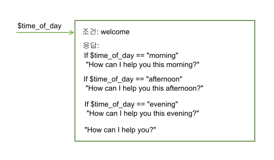
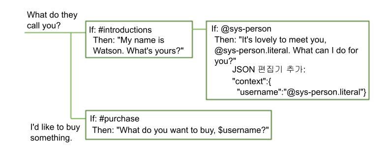

---

copyright:
  years: 2015, 2018
lastupdated: "2018-02-16"

---

{:shortdesc: .shortdesc}
{:new_window: target="_blank"}
{:tip: .tip}
{:pre: .pre}
{:codeblock: .codeblock}
{:screen: .screen}
{:javascript: .ph data-hd-programlang='javascript'}
{:java: .ph data-hd-programlang='java'}
{:python: .ph data-hd-programlang='python'}
{:swift: .ph data-hd-programlang='swift'}

# 대화 상자 처리 방법
{: #dialog-runtime}

사용자가 실행 중에 배치된 {{site.data.keyword.conversationshort}} 서비스의 인스턴스와 상호작용할 때 대화 상자가 처리하는 방법에 대해 이해합니다.
{: shortdesc}

## 대화 상자 호출 분석
{: message-anatomy}

각 사용자 표현은 /message API 호출로 대화 상자에 전달됩니다. 여기에는 자세한 정보를 요청하는 대화 상자에서 사용자가 프롬프트에 대해 응답하는 표현이 포함됩니다. 일부 구독 플랜은 API 호출 세트 번호를 포함하는데, 이것은 호출의 구성을 이해하는 도움이 됩니다. 단일 /message API 호출은 사용자로부터의 입력과 대화 상자에서의 해당 응답으로 구성된 단일 대화 상자 턴과 동일합니다. 

/message API 호출 요청 및 응답의 본문에는 다음 오브젝트가 포함됩니다. 

- `context`: 지속될 변수를 포함합니다. 한 호출에서 다음 호출로 정보를 전달하려면 애플리케이션 개발자는 각 후속 API 호출마다 이전 API 호출의 응답 컨텍스트를 전달해야 합니다. 예를 들어, 대화 상자는 사용자의 이름을 수집한 다음 후속 노드에서 사용자를 이름으로 참조할 수 있습니다.

  ```json
  {
    "context" : {
      "user_name" : "<? @sys-person.literal ?>"
    }
  ```
  {: codeblock}

  자세한 정보는 [대화 상자 턴에서 정보 보유](dialog-runtime.html#context)를 참조하십시오. 

- `input`: 사용자 제출한 텍스트 문자열입니다. 텍스트 문자열은 최대 2,048 자를 포함할 수 있습니다.

  ```json
  {
    "input": {
      "text" : "Where's your nearest store?"
    }
  ```
  {: codeblock}

- `output`: 사용자에게 대화 상자 응답을 표시합니다. 이 섹션을 사용하여 지속되지 않는 변수와 같은 오브젝트를 정의할 수 있습니다. 예를 들어, 대화 상자에서 정의한 `temp`라고 하는 컨텍스트 변수를 영구적으로 삭제하려면, 다음 표현식을 사용할 수 있습니다.

  ```json
  {
  "output": {
    "text" : {},
    "deleted_variable" : "<? context.remove('temp') ?>"
  ```
  {: codeblock}

  출력 오브젝트에 관한 자세한 정보는 [복합 응답](dialog-overview.html#complex)을 참조하십시오. 

/message API 호출에 관한 자세한 정보는 [API reference ](https://www.ibm.com/watson/developercloud/conversation/api/v1/){: new_window}를 참조하십시오.

## 대화 상자 턴에서 정보 보유
{: #context}

대화 상자는 Stateless이므로 사용자와의 상호작용에서 다음 상호작용까지의 정보를 유지하지 않습니다. 애플리케이션에 필요한 모든 정보를 계속 유지하는 것은 애플리케이션 개발자의 책임입니다. 애플리케이션은 메시지 API 응답에서 컨텍스트 오브젝트를 찾아서 저장하고 대화 플로우의 일부로 수행된 다음 /message API 요청과 함께 컨텍스트 오브젝트에 전달해야 합니다.

정보를 보존하는 가장 간단한 방법은 예를 들어, - 웹 브라우저와 같이 클라이언트 애플리케이션의 메모리에 전체 컨텍스트 오브젝트를 저장하는 것입니다. 애플리케이션이 점점 더 복잡해짐에 따라, 또는 전달하고 개인 식별 정보를 저장해야 하는 경우, 데이터베이스에서 정보를 저장하고 검색할 수 있습니다.

애플리케이션은 대화 상자에 정보를 전달할 수 있고, 대화 상자에서 이 정보를 업데이트하고 애플리케이션 또는 후속 노드에 다시 전달할 수 있습니다. 대화 상자는 컨텍스트 변수를 사용하여 수행합니다.

컨텍스트 변수는 노드에서 정의하고 선택적으로 기본값을 지정하는 변수입니다. 기타 노드 또는 애플리케이션 로직은 나중에 컨텍스트 변수의 값을 설정하거나 변경할 수 있습니다.

노드 실행 여부를 판별하기 위해 대화 상자 노드 조건에서 컨텍스트 변수를 참조하여 컨텍스트 변수값에 대해 조건을 지정할 수 있습니다. 그리고 대화 상자 노드 응답 조건에서 컨텍스트 변수를 참조하여 외부 서비스 또는 사용자가 제공하는 값에 따라 서로 다른 응답을 표시할 수 있습니다.

### 애플리케이션에서 컨텍스트 전달
{: #context-from-app}

컨텍스트 변수를 설정하고 대화 상자에 컨텍스트 변수를 전달하여 애플리케이션에서 대화 상자로 정보를 전달하십시오.

예를 들어, 애플리케이션은 $time_of_day 컨텍스트 변수를 설정하고, 정보를 사용하여 사용자에게 표시되는 인사를 사용자 조정할 수 있는 대화 상자에 이 변수를 전달할 수 있습니다.



이 예제에서 대화 상자는 애플리케이션이 변수를 다음 값 중 하나로 설정한다고 인식합니다. *morning*, *afternoon* 또는 *evening*. 또한 각 값을 검사하고 존재하는 값에 따라 적절한 인사를 리턴할 수 있습니다. 변수가 전달되지 않거나 예상 값 중 하나와 일치하지 않는 값을 포함하는 경우, 보다 일반적인 인사가 사용자에게 표시됩니다.

### 노드 간 컨텍스트 전달
{: #context-node-to-node}

대화 상자는 컨텍스트 변수를 추가하여 하나의 노드에서 다른 노드로 정보를 전달하거나 컨텍스트 변수값을 업데이트할 수 있습니다. 대화 상자가 사용자로부터 정보를 요청하여 가져오는 경우 정보를 추적하고 나중에 대화에서 참조할 수 있습니다.

예를 들어, 하나의 노드에서 사용자에게 이름을 묻고 후속 노드에서 이름별로 주소를 지정할 수 있습니다.



이 예제에서 시스템 엔티티 @sys-person은 입력에서 사용자 이름(사용자가 제공하는 경우)을 추출하는 데 사용됩니다. JSON 편집기에서 username 컨텍스트 변수가 정의되고 @sys-person 값으로 설정됩니다. 후속 노드에서 $username 컨텍스트 변수는 이름별로 사용자 주소를 지정하도록 응답에 포함됩니다.

## 컨텍스트 변수 정의
{: #context-var-define}

다음 편집기 중 하나로 변수의 이름 및 값 쌍을 정의하여 컨텍스트 변수를 정의하십시오.

- **컨텍스트 편집기**: 컨텍스트 변수 이름 및 값 정보로 채울 수 있는 노드 편집 보기에 있는 **변수** 필드 및 해당 **값** 필드를 표시합니다. 

  **참고**: 이 필드는 사용자가 추가하는 노드에서 자동으로 표시됩니다. 서비스의 이전 버전을 사용하여 작성한 노드의 경우, 추가할 수 있는 필드에 대한 컨텍스트 편집기를 열어야 합니다.

- **JSON 편집기**: 열면, {{site.data.keyword.conversationshort}} 서비스로 전송되는 /message API 요청과 함께 전달되는 기본 JSON 컨텐츠에 대한 보기를 제공합니다. JSON 본문의 `"context":{}` 섹션에 이름 및 값 쌍을 추가하여 컨텍스트 변수를 정의할 수 있습니다. 

이름 및 값 쌍은 다음 요구사항을 충족해야 합니다.

- `name`에는 대소문자 영문자, 숫자 문자(0 - 9) 및 밑줄이 포함될 수 있습니다.

  **참고**: 마침표 및 하이픈과 같은 기타 문자를 이름에 포함할 수 있습니다. 그러나, 만약 그렇게 한다면, 변수를 참조할 때마다 다음 접근 방법 중 하나를 사용해야 합니다.

  - **context['variable-name']**

      전체 SpEL 표현식 구문.
  - **$(variable-name)**

      변수 이름이 소괄호로 묶여 있는 단축 구문.
    세부사항은 [오브젝트 액세스 및 평가](expression-language.html#shorthand-syntax-for-context-variables)를 참조하십시오.

- `value`는 지원되는 JSON 유형일 수 있습니다(예: 단순 문자열 변수, 숫자,또는 JSON 배열). JSON 편집기를 사용하여 컨텍스트 변수를 정의하는 경우, JSON 오브젝트를 값으로 지정할 수도 있습니다.

다음 표에서는 컨텍스트 변수 편집기 필드에 이름 및 값 쌍을 정의하는 방법을 보여줍니다.

| Variable       | Value              |
|:---------------|--------------------|
| dessert        | cake               |
| toppings_array | ["onion","olives"] |
| age            | 18                 |

다음 JSON 샘플은 $dessert 문자열, $toppings_array 배열 및 $age number 컨텍스트 변수의 값을 정의합니다.

```json
{
  "context": {
    "dessert": "cake",
    "toppings_array": ["onion", "olives"],
    "age": 18
  }
}
```
{: codeblock}

컨텍스트 변수를 정의하려면 다음 단계를 완료하십시오.

1.  대화 상자 노드 평가 중에 설정할 것을 원하는 시간을 나타내는 노드의 섹션에 컨텍스트 변수를 정의하십시오.

    **참고**: 이 노드에 정의되어 있는 기존 컨텍스트 변수 값이 해당 **변수** 및 **값** 필드 세트에 표시됩니다. 사용자가 이 노드의 편집 보기에서 표시되지 않게 하려면, 컨텍스트 편집기를 닫아야 합니다. 편집기를 열 때 사용했던 동일한 메뉴에서 편집기를 닫을 수 있습니다. 다음 단계에서는 메뉴에 액세스하는 방법을 설명합니다. 

    - 노드 응답이 처리된 후 설정되거나 변경되는 컨텍스트 변수를 추가하려면, 응답 섹션에 컨텍스트 변수를 추가하십시오. 

      응답과 관련된 **옵션** 아이콘을 클릭한 후 다음 옵션 중 하나를 선택하여 편집기를 선택하십시오. 

      - **JSON 편집기 열기**
      - **컨텍스트 편집기 열기**

      

      **다중 응답** 설정이 노드에 대해 **켜져 있는**경우, **응답 편집**  아이콘을 먼저 클릭해야 합니다. 

      

    - 슬롯 조건이 충족된 후에 설정되거나 업데이트되는 컨텍스트 변수를 추가하려면, **슬롯 편집**  아이콘을 클릭하십시오. *슬롯 구성* 보기 머리글에 있는 **옵션**  메뉴에서, **JSON 편집기 열기**를 클릭하십시오. (슬롯에 대한 자세한 정보는 , [슬롯으로 정보 수집](dialog-slots.html)을 참조하십시오.)

      **참고**: 컨텍스트 편집기를 사용하여 대화 노드의 이 단계에서 설정되는 컨텍스트 변수를 정의할 수 있는 방법이 현 시점에선 없습니다. 

      

    - 슬롯에 대한 응답 조건이 충족된 후에 처리되는 컨테스트 변수를 추가하려면, **슬록 편집**  아이콘을 클릭하십시오. **옵션**  아이콘을 클릭한 후 **조건부 응답 사용**을 선택하십시오. 컨텍스트 변수를 연관시키려는 응답 다음의 **응답 편집**  아이콘을 클릭하십시오. 응답 섹션의 **옵션**  아이콘을 클릭하고 다음 옵션 중 하나를 선택하여 편집기를 선택하십시오. 

      - **JSON 편집기 열기**
      - **컨텍스트 편집기 열기**

      
1.  컨텍스트 편집기에 있는 컨텍스트 변수를 정의하려면, **변수** 및 **값** 필드에 추가 이름 및 값 쌍을 추가해야 합니다.
1.  JSON 편집기의 컨텍스트 변수를 정의하려면, 다음 추가 단계를 완료하십시오.

    - 없는 경우, `"context":{}` 블록을 추가하십시오.

      ```json
      {
        "context":{},
      "output":{}
    }
      ```
      {: codeblock}

    - 컨텍스트 블록에서 정의할 각 컨텍스트 변수의 이름과 값 쌍을 추가하십시오.

      ```json
      {
            "context":{
          "name": "value"
      },
        "output": {}
      }
      ```
      {: codeblock}

    이 예에서, `new_variable` 이름의 변수가 이미 변수가 있는 컨텍스트 블록에 추가되었습니다. 

    ```json
    {
          "context":{
        "existing_variable": "value",
        "new_variable":"value"
      }
    }
    ```
    {: codeblock}

    나중에 컨텍스트 변수를 참조하려면 *name*이 정의된 컨텍스트 변수의 이름인 `$name` 구문을 사용하십시오. 예: `$new_variable`.

## 공통 컨텍스트 변수 태스크
{: #context-common-tasks}

사용자가 입력한 전체 문자열을 저장하려면 `input.text`를 사용하십시오. 

| Variable | Value            |
|----------|------------------|
| repeat   | `<?input.text?>` |

```json
{
  "context": {
    "repeat": "<?input.text?>"
      }
}
```
{: codeblock}

컨텍스트 변수에 엔티티 값을 저장하려면 다음 구문을 사용하십시오.

| Variable | Value            |
|----------|------------------|
| place    | @place           |

```json
{
  "context": {
    "place": "@place"
      }
}
```
{: codeblock}

편집기를 사용하여 컨텍스트 변수에 JSON 오브젝트를 추가할 수 있습니다. 다음 표현식은 함께 사용자의 전체 이름을 형성하는 첫 번째 값과 마지막 값의 세트를 포함하는 full_name 오브젝트를 정의합니다.

| Variable      | Value            |
|---------------|------------------|
| full_name     | { "first":"Paul", "last":"Smith" } |

```json
{
  "context": {
    "full_name": {
      "first":"Paul",
      "last":"Smith"
      }
  }
}
```
{: codeblock}

응답에서 `$full_name.first`를 지정한 경우, `Paul`이 표시됩니다.

사용자가 사용자 입력에서 추출할 문자열의 값을 저장하려면 사용자 입력에 정규식을 적용해 추출 방법을 사용하는 SpEL 표현식을 포함할 수 있습니다. 다음 표현식은 사용자 입력에서 숫자를 추출하고 `$number` 컨텍스트 변수에 저장합니다. 

| Variable | Value                               |
|----------|-------------------------------------|
| number   | `<?input.text.extract('[\d]+',0)?>` |

```json
{
  "context": {
     "number": "<?input.text.extract('[\\d]+',0)?>"
  }
}
```
{: codeblock}

사용자가 JSON 편집기에서 정규식을 정의할 때 표현식에서 사용하는 백 슬래시를 다른 백 슬래시(`\\`)로 이스케이프해야 합니다. 사용자가 컨텍스트 변수 편집기를 사용하여 정의하는 정규식에서는 백 슬래시를 이스케이프할 필요가 없습니다.
{: tip}

패턴 엔티티의 값을 저장하려면 엔티티 이름에 .literal을 추가하십시오. 이 구문을 사용하면 지정된 패턴과 일치한 사용자 입력의 정확한 범위의 텍스트가 변수에 저장됩니다.

| Variable | Value            |
|----------|------------------|
| email    | @email.literal   |

```json
{
  "context": {
    "email": "<? @email.literal ?>"
  }
}
```
{: codeblock}

## 컨텍스트 변수 삭제
{: #context-delete}

컨텍스트 변수를 삭제하려면, 변수를 널로 설정하십시오.

```json
{
  "context": {
    "order_form": null
  }
}
```
{: codeblock}

컨텍스트 변수의 모든 추적을 제거하려는 경우, JSONObject.remove(string) 메소드를 사용하여 컨텍스트 오브젝트에서 삭제할 수 있습니다. 그러나 제거를 수행하려면 변수를 사용해야 합니다. 현재 호출 이후엔 저장되지 않으므로 메시지 출력에 새 변수를 정의하십시오.

```json
{
  "output": {
    "text" : {},
    "deleted_variable" : "<? context.remove('order_form') ?>"
  }
}
```
{: codeblock}

또는, 애플리케이션 로직에서 컨텍스트 변수를 삭제할 수 있습니다.

### 연산 순서
{: #context-order-of-ops}

컨텍스트 변수를 정의한 순서로 서비스에서 평가되는 순서를 판별할 수 없습니다. 서비스는 JSON 이름과 값 쌍으로 정의된 변수를 임의 순서로 평가합니다. 목록의 첫 번째 컨텍스트 변수가 목록의 두 번째 변수 앞에서 실행되지 않으므로 첫 번째 컨텍스트 변수에 값을 설정하지 말고 두 번째에서 사용할 수 있도록 요청하십시오. 예를 들어, 0과 노드에 전달된 몇 가지 높은 값 사이의 난수를 리턴하는 로직을 구현하는 데 두 개의 컨텍스트 변수를 사용하지 마십시오.

```json
"context": {
    "upper": "<? @sys-number.numeric_value + 1?>",
    "answer": "<? new Random().nextInt($upper) ?>"
}
```
{: codeblock}

$answer 컨텍스트 변수가 평가되기 전에 평가되는 $upper 컨텍스트 변수의 값에 의존하지 않도록 복잡한 표현식을 사용하십시오.

```json
"context": {
    "answer": "<? new Random().nextInt(@sys-number.numeric_value + 1) ?>"
}
```
{: codeblock}

### 패턴 엔티티 값 저장
{: #context-pattern-entities}

컨텍스트 변수에 패턴 엔티티 값을 저장하려면 엔티티 이름에 .literal을 추가하십시오. 이 구문을 사용하면 지정된 패턴과 일치한 사용자 입력의 정확한 범위의 텍스트가 변수에 저장됩니다.

```json
{
  "context": {
    "email": "<? @email.literal ?>"
  }
}
```
{: codeblock}

그룹이 정의된 패턴 엔티티에 단일 그룹의 텍스트를 저장하려면 저장하려는 그룹의 배열 번호를 지정하십시오. 예를 들어, 엔티티 패턴은 @phone_number 엔티티에 대해 다음과 같이 정의되어 있다고 가정합니다. (소괄호는 패턴 그룹을 나타냅니다.)

`\b((958)|(555))-(\d{3})-(\d{4})\b`

사용자 입력에 지정된 전화 번호의 지역 번호만 저장하려면 다음 구문을 사용할 수 있습니다.

```json
{
  "context": {
    "area_code": "<? @phone_number.groups[1] ?>"
  }
}
```
{: codeblock}

그룹은 그룹 패턴 정의에 사용되는 정규식으로 구분됩니다. 예를 들어, `@phone_number` 엔티티에 정의된 패턴과 일치하는 사용자 입력이 `958-234-3456`이면, 다음과 같은 그룹이 작성됩니다.

| 그룹 번호 | Regex 엔진 값  | 대화 상자 값   | 설명 |
|--------------|---------------------|----------------|-------------|
| groups[0]    | `958-234-3456`      | `958-234-3456` | 첫 번째 그룹은 항상 전체 일치 문자열. |
| groups[1]    | `((958)`l`(555))`   | `958`          | 첫 번째 정의된 그룹에 대한 regex와 일치하는 다음과 같은 문자열: `((958)`l`(555))`. |
| groups[2]    | `(958)`             | `958`          | OR 표현식의 첫 번째 피연산자로 포함된 그룹과 일치하는 문자열: `((958)`l`(555))` |
| groups[3]    | `(555)`             | `null`         | OR 표현식의 두 번째 피연산자로 포함된 그룹과 일치하는 문자열: `((958)`l`(555))` |
| groups[4]    | `(\d{3})`           | `234`          | 그룹에 대해 정의된 정규식과 일치하는 문자열. |
| groups[5]    | `(\d{4})`           | `3456`         | 그룹에 대해 정의된 정규식과 일치하는 문자열. |
{: caption="그룹 세부사항" caption-side="top"}

관심있는 입력 섹션을 캡처하는데 사용할 그룹 번호를 해독하려면, 한 번에 모든 그룹에 대한 정보를 추출 할 수 있습니다. 그룹화된 모든 패턴 엔티티 일치 배열을 리턴하는 컨텍스트 변수를 작성하려면 다음 구문을 사용하십시오.

```json
{
  "context": {
    "array_of_matched_groups": "<? @phone_number.groups ?>"
  }
}
```
{: codeblock}

"연습" 분할창을 사용하여 테스트 전화번호 값을 입력하십시오. `958-123-2345`의 경우, 이 표현식은 `$array_of_matched_groups`를 `["958-123-2345","958","958",null,"123","2345"]`로 설정합니다.

그런 다음 배열의 각 값을 0부터 시작하여 그룹 번호를 시작할 수 있습니다. 

| 배열 요소 값 | 배열 요소 번호 |
|---------------------|----------------------|
| "958-123-2345"      | 0 |
| "958"               | 1 |
| "958"               | 2 |
| null                | 3 |
| "123"               | 4 |
| "2345"              | 5 |
{: caption="배열 요소" caption-side="top"}

예를 들어, 전화번호의 마지막 4자리를 캡처하려면, 그룹 #5가 필요하다는 것을 쉽게 알 수 있습니다.

그룹화된 패턴 엔티티를 표시하기 위해 작성된 JSONArray 구조를 리턴하려면 다음 구문을 사용하십시오.

```json
{
  "context": {
    "json_matched_groups": "<? @phone_number.groups_json ?>"
  }
}
```
{: codeblock}

이 표현식은 `$json_matched_groups`를 다음과 같은 JSON 배열로 설정합니다.

```json
[
  {"group": "group_0","location": [0, 12]},
  {"group": "group_1","location": [0, 3]},
  {"group": "group_2","location": [0, 3]},
  {"group": "group_3"},
  {"group": "group_4","location": [4, 7]},
  {"group": "group_5","location": [8, 12]}
]
```
{: codeblock}

**참고**: `location`은 0부터 시작하는 문자 오프셋을 사용하여 발견된 엔티티 값이 입력 텍스트에서 시작하고 끝나는 위치를 표시하는 엔티티의 속성입니다.

두 개의 전화번호가 입력에 제공될 것으로 예상되면 두 개의 전화번호를 확인할 수 있습니다. 예를 들어, 다음 구문을 사용하여 두 번째 번호의 지역 번호를 캡처합니다.

```json
{
  "context": {
    "second_areacode": "<? entities['phone_number'][1].groups[1] ?>"
  }
}
```
{: codeblock}

입력이 `내 전화번호를 958-234-3456에서 555-456-5678으로 변경`이면, `$second_areacode`는 `555`입니다.

## 컨텍스트 변수값 업데이트
{: #context-update}

노드가 이미 설정된 컨텍스트 변수값을 설정하면 이 변수값이 이전 값을 겹쳐씁니다.

### 복합 JSON 오브젝트 업데이트

JSON 오브젝트를 제외한 모든 JSON 유형에 대해 이전 값을 겹쳐씁니다. 컨텍스트 변수가 JSON 오브젝트와 같은 복합 유형인 경우 JSON 병합 프로시저가 변수 업데이트에 사용됩니다. 병합 오퍼레이션은 새로 정의된 특성을 추가하고 오브젝트의 기존 특성을 겹쳐씁니다.

이 예제에서 이름 컨텍스트 변수는 복합 오브젝트로 정의됩니다.

```json
{
  "context": {
    "complex_object": {
      "user_firstname" : "Paul",
      "user_lastname" : "Pan",
      "has_card" : false
    }
  }
}
```
{: codeblock}

대화 상자 노드는 다음 값으로 컨텍스트 변수 JSON 오브젝트를 업데이트합니다.

```json
{
  "complex_object": {
    "user_firstname": "Peter",
    "has_card": true
  }
}
```
{: codeblock}

결과는 다음 컨텍스트입니다.

```json
{
  "complex_object": {
    "user_firstname": "Peter",
    "user_lastname": "Pan",
    "has_card": true
  }
}
```
{: codeblock}

오브젝트에서 수행할 수 있는 메소드에 관한 자세한 정보는 [표현식 언어 메소드](dialog-methods.html#objects)를 참조하십시오.

### 배열 업데이트

대화 상자 컨텍스트 데이터에 값 배열이 있는 경우, 값을 추가하거나 값을 제거하거나 값을 모두 바꿔 배열을 업데이트할 수 있습니다.

이러한 조치 중 하나를 선택하여 배열을 업데이트하십시오. 각각의 경우에 조치가 적용되기 전 배열, 조치, 그리고 조치가 적용된 후 배열이 표시됩니다.

- **추가**: 배열의 끝에 값을 추가하려면 `append` 메소드를 사용하십시오.

    다음 대화 상자 런타임 컨텍스트의 경우:

    ```json
    {
      "context": {
        "toppings_array": ["onion", "olives"]
      }
    }
    ```
    {: codeblock}

    다음 업데이트를 작성하십시오.

    ```json
    {
      "context": {
        "toppings_array": "<? $toppings_array.append('ketchup', 'tomatoes') ?>"
      }
    }
    ```
    {: codeblock}

    결과:

    ```json
    {
      "context": {
        "toppings_array": ["onion", "olives", "ketchup", "tomatoes"]
      }
    }
    ```
    {: codeblock}

- **제거**: 요소를 제거하려면 `remove` 메소드를 사용하고 배열에 해당 값 또는 위치를 지정하십시오.

    - **값을 기준으로 제거**는 값을 기준으로 배열에서 요소를 제거합니다.

        다음 대화 상자 런타임 컨텍스트의 경우:

        ```json
        {
          "context": {
            "toppings_array": ["onion", "olives"]
          }
        }
        ```
        {: codeblock}

        다음 업데이트를 작성하십시오.

        ```json
        {
          "context": {
            "toppings_array": "<? $toppings_array.removeValue('onion') ?>"
          }
        }
        ```
        {: codeblock}

        결과:

        ```json
        {
          "context": {
            "toppings_array": ["olives"]
          }
        }
        ```
        {: codeblock}

    - **위치를 기준으로 제거**: 인덱스 위치를 기준으로 배열에서 요소 제거:

        다음 대화 상자 런타임 컨텍스트의 경우:

        ```json
        {
          "context": {
            "toppings_array": ["onion", "olives"]
          }
        }
        ```
        {: codeblock}

        다음 업데이트를 작성하십시오.

        ```json
        {
          "context": {
            "toppings_array": "<? $toppings_array.remove(0) ?>"
          }
        }
        ```
        {: codeblock}

        결과:

        ```json
        {
          "context": {
            "toppings_array": ["olives"]
          }
        }
        ```
        {: codeblock}

- **겹쳐쓰기**: 배열에서 값을 겹쳐쓰려면 배열을 새 값으로 설정하십시오.

    다음 대화 상자 런타임 컨텍스트의 경우:

        ```json
        {
          "context": {
            "toppings_array": ["onion", "olives"]
          }
        }
        ```
        {: codeblock}

    다음 업데이트를 작성하십시오.

        ```json
        {
          "context": {
            "toppings_array": ["ketchup", "tomatoes"]
          }
        }
        ```
        {: codeblock}

    결과:

        ```json
        {
          "context": {
            "toppings_array": ["ketchup", "tomatoes"]
          }
        }
        ```
        {: codeblock}

배열에서 수행할 수 있는 메소드에 관한 자세한 정보는 [표현식 언어 메소드](dialog-methods.html#arrays)를 참조하십시오.

## 다이그레션(Digression)
{: #digressions}

다이그레션(Digression)은 사용자가 한 목표를 처리하도록 설계된 대화 상자 플로우의 중간에 있는 경우 발생하며 갑자기 다른 목표를 충족하도록 설계된 대화 상자 플로우를 시작하는 주제로 전환합니다. 대화 상자는 항상 사용자가 주제를 변경하는 기능을 지원합니다. 처리중인 대화 상자 분기의 어떤 노드도 사용자의 최신 입력 목표와 일치하지 않으면 대화 상자는 다시 트리로 이동하여 루트 노드 조건에서 적절한 일치 항목을 확인합니다. 노드 당 사용 가능한 다이그레션(Digression) 설정에서 이 동작을 훨씬 더 맞춤 설정하는 기능을 제공합니다.

다이그레션(Digression) 설정을 사용하면, 디그레션이 발생했을 때 중단된 대화 상자 플로우로 대화를 되돌릴 수 있습니다. 예를 들어, 사용자가 새 전화를 주문하고 있지만 주제를 전환하여 태블릿에 대해 질문합니다. 대화 상자는 태블릿에 대한 질문에 답변한 다음 전화를 주문하는 과정에서 중단한 위치로 사용자를 되돌릴 수 있습니다. 다이그레션(Digression)의 발생 및 리턴을 허용하면 사용자는 실행 중에 대화 플로우를 보다 잘 제어 할 수 있습니다. 다이그레션(Digression)은 주제를 변경할 수 있고, 관련이 없는 주제에 대한 대화 상자 플로우를 끝까지 따라갈 수 있으며 전에 있었던 곳으로 돌아갈 수 있습니다. 그 결과 사용자 간의 대화를 보다 밀접하게 시뮬레이션하는 대화 상자 플로우입니다.

다음 이미지는 대화 상자 트리 사용자 인터페이스의 모형을 사용하여 다이그레션(Digression)의 개념을 설명합니다. 이것은 진행 중인 대화 상자 플로우로 돌아가는 다이그레션(Digression)을 허용하도록 구성된 대화 상자 노드와 상호 작용하는 방법을 보여줍니다. 사용자가 저녁 식사 예약에 필요한 정보를 제공하기 시작합니다. #reservation 노드의 슬롯을 채우는 중에 사용자는 채식 메뉴 옵션에 대해 질문합니다. 대화 상자는 루트 노드(#cuisine 의도를 조건으로 하는 노드)중에서 노드를 찾아 사용자의 새 질문에 응답합니다. 그런 다음 원래 대화 상자 노드에서 다음 빈 슬롯에 대한 프롬프트를 표시하여 진행 중인 대화로 돌아갑니다.


### 시작하기 전에

전체 대화 상자를 테스트할 때 다이그레션(Digression)을 허용하고 발생해서 돌아오는 시기와 위치를 결정하십시오. 다음 다이그레션(Digression) 제어는 노드에 자동으로 적용됩니다. 사용자가 이 기본 동작을 변경하려는 경우에만 조치를 수행하십시오.

- 대화 상자의 모든 루트 노드는 기본적으로 대상을 다이그레션(Digression)할 수 있도록 구성됩니다. 하위 노드는 다이그레션(Digression)의 대상이 될 수 없습니다.
- 슬롯이 있는 노드는 다이그레션(Digression)을 방지하도록 구성됩니다. 기타 모든 노드는 다이그레션(Digression)을 허용하도록 구성됩니다. 그러나 다음과 같은 상황에서는 대화가 노드에서 벗어날 수 없습니다.

  - 현재 노드의 하위 노드 중 하나가 `anything_else` 또는 `true` 조건을 포함하는 경우

    이러한 조건은 항상 참으로 평가된다는 점에서 특별합니다. 알려진 동작으로 인해, 대화 상자에서 종종 상위 노드가 특정 하위 노드를 연속적으로 평가하도록 강제합니다. 기존의 대화 상자 플로우 논리를 위반하지 않기 위해, 이런 경우 다이그레션(Digression)은 허용되지 않습니다. 그러한 노드에서 다이그레션(Digression)을 가능하게 하기 전에 하위 노드의 조건을 다른 것으로 변경해야 합니다. 

  - 노드가 다른 노드로 점프하거나 처리 된 후 사용자 입력을 생략하도록 구성된 경우

    노드의 마지막 단계 섹션은 노드가 처리된 후 발생할 일을 지정합니다. 대화 상자가 다른 노드로 직접 이동하도록 구성될 때, 종종 특정 순서를 따르는지 확인하십시오. 그리고 노드가 사용자 입력을 건너뛰도록 구성된 경우, 이는 대화 상자가 현재 노드 다음의 첫 번째 하위 노드를 연속적으로 처리하도록 하는 것과 동일합니다. 기존 대화 상자 플로우 논리를 위반하지 않도록 하기 위해 이런 경우 다이그레션(Digression)은 허용되지 않습니다. 이 노드에서 다이그레션(Digression)을 가능하게 하기 전에 최종 단계 섹션에서 지정된 내용을 변경해야 합니다. 

### 다이그레션(Digression) 사용자 정의
{: #enable-digressions}

귀하는 다이그레션(Digression)의 시작과 끝을 정의하지 않습니다. 사용자는 실행 중에 다이그레션(Digression) 플로우를 완전히 제어합니다. 사용자는 각 노드가 사용자가 주도하는 다이그레션(Digression)에 참여할지 여부만 지정합니다. 각 노드에 대해 다음을 구성합니다. 

- 다이그레션(Digression)은 노드에서 시작하거나 떠날 수 있음
- 다른 곳에서 시작하는 다이그레션(Digression)은 대상이 될 수 있으며 노드에 들어갈 수 있음
- 다른 곳에서 시작하여 노드에 들어간 다이그레션(Digression)은 현재 대화 상자 플로우가 완료된 후 중단된 대화 상자 플로우로 돌아와야함

개별 노드의 다이그레션(Digression) 동작을 변경하려면, 다음 단계를 완료하십시오.

1.  편집 보기를 열려면 노드를 클릭하십시오.

1.  **사용자 정의**를 클릭하고, **다이그레션(Digression)** 탭을 클릭하십시오.

    구성 옵션은 편집 중인 노드가 루트 노드, 하위 노드, 하위 노드 또는 슬롯이 있는 노드인지 여부에 따라 다릅니다.

    **이 노드에서 다이그레션(Digression) 벗어나기**

    이전에 나열된 상황이 적용되지 않으면 다음과 같은 선택을 할 수 있습니다.

    - **모든 노드 유형**: 사용자가 현재 대화 상자 분기의 끝에 도달하기 전에 현재 노드에서 벗어날 수 있도록 허용할지 여부를 선택합니다.

    - **하위 노드가 있는 모든 노드**: 현재 노드의 응답이 이미 표시되고 하위 노드가 노드의 목표에 부수적인 경우 대화가 다이그레션(Digression) 후 현재 노드로 돌아갈지 여부를 선택하십시오. 대화 상자가 현재 노드로 돌아가는 것을 방지하고 분기 처리를 계속하려면, *이 노드의 응답 후에 실행된 다이그레션(Digression)에서 돌아오기 허용*을 **No**로 설정하십시오. 

      예를 들어, 사용자가 `컵케이크를 판매하십니까?`라고 문의하고 사용자가 주제를 변경하기 전에 `우리는 다양한 맛과 크기의 컵케이크를 제공합니다`라는 응답이 표시되면, 대화 상자가 중단된 위치로 돌아가는 것을 원하지 않을 수도 있습니다. 특히 하위 노드가 사용자로부터 가능한 후속 질문만 처리하고 안전하게 무시할 수 있습니다. 

      그러나, 노드가 하위 노드에 의존하여 질문을 처리하는 경우, 강제로 대화로 돌아가고 현재 분기의 노드 처리를 계속하기를 원할 수도 있습니다. 예를 들어, 초기 응답은 `우리는 모든 모양과 크기의 컵케이크를 제공합니다. 어떤 메뉴를 보고 싶습니까?: 무 글루텐, 유제품 또는 일반? `일 수 있습니다. 사용자가 이 시점에서 주제를 변경하면, 사용자가 메뉴 유형을 선택하고 원하는 정보를 얻을 수 있도록 대화 상자로 돌아가기를 원할 수 있습니다. 

    - **슬롯이 있는 노드**: 모든 슬롯이 채워지기 전에 사용자가 노드에서 벗어날 수 있도록 허용할지 여부를 선택하십시오. *슬롯을 채우는 중에 다이그레션(Digression) 벗어나기 허용*을 **Yes**로 설정하여 다이그레션(Digression) 벗어나기를 사용하십시오. 

      사용 가능한 경우, 대화가 다이그레션(Digression)에서 돌아오면 사용자가 계속 정보를 제공할 수 있도록 채워지지 않은 다음 슬롯에 대한 프롬프트가 표시됩니다. 사용 가능하지 않은 경우, 슬롯을 채울 수 있는 값을 포함하지 않는 사용자 입력 내용은 무시됩니다. 그러나 슬롯 핸들러를 정의하여 사용자가 노드와 상호작용하는 동안 사용자가 요청할 수 있는 원치 않는 질문을 처리 할 수 있습니다. 자세한 정보는 [슬롯 추가](dialog-slots.html#add-slots)를 참조하십시오. 

      다음 이미지는 슬롯이 있는 #reservation 노드(앞의 그림 참조)에서 다이그레션(Digression)을 벗어나는 구성에 관한 방법을 보여줍니다.

      

    - **슬롯이 있는 노드**: **돌아가기를 허용하는 슬롯에서 노드로만 벗어나기** 선택란을 선택하여 현재 노드로 돌아가는 경우에만 사용자가 벗어날 수 있는지 여부를 선택합니다.

      선택한 경우, 대화 상자에서 노드와 관련없는 질문에 답하는 노드를 찾으면 다이그레션(Digression) 후 돌아가도록 구성되지 않은 루트 노드는 무시됩니다. 사용자가 필수 슬롯을 채우기 전에 노드를 영구적으로 떠날 수 없도록 하려면 이 선택란을 선택하십시오.

    **이 노드에 다이그레션(Digression)**

    노드에 다이그레션(Digression)이 작동하는 방법에 대해 다음과 같은 선택을 할 수 있습니다.

    - 사용자가 노드에 들어갈 수 없도록 합니다. 자세한 정보는 [루트 노드에 다이그레션(Digression) 사용 안함](#diable-digressions)을 참조하십시오.

    - 노드에 다이그레션(Digression)이 사용 가능한 경우, 대화 상자가 멀리 떨어져 있는 대화 상자 플로우로 되돌아가야 하는지 여부를 선택하십시오. 선택한 경우, 현재 노드의 분기 처리가 완료된 후, 대화 상자 플로우는 중단된 노드로 다시 이동합니다. 나중에 대화 상자로 돌아가려면, **다이그레션(Digression) 후 돌아가기**를 선택하십시오.

    다음 이미지는 #cuisine 노드(앞의 그림 참조)에 다이그레션(Digression) 구성 방법을 보여줍니다.

    

1.  **적용**을 클릭하십시오.

1.  "연습" 분할창을 사용하여 다이그레션(Digression) 동작을 테스트하십시오.

    다시 말씀드리지만, 귀하는 다이그레션(Digression)의 시작과 끝을 정의할 수 없습니다. 사용자는 다이그레션(Digression)이 발생하는 시기와 위치를 제어합니다. 단일 노드가 하나의 노드에 참여하는 방식을 결정하는 설정만 적용할 수 있습니다. 다이그레션(Digression)은 예측할 수 없기 때문에 구성 결정이 전반적인 대화에 어떻게 영향을 미치는지 알기 어렵습니다. 사용자가 작성한 선택의 효과를 확인하려면 대화 상자를 테스트해야 합니다.

#reservation 및 #cuisine 노드는 단일 사용자 지정 다이그레션(Digression)에 참여할 수 있는 두 개의 대화 상자 분기를 나타냅니다. 각각의 개별 노드에 구성되는 다이그레션(Digression) 설정은 실행 중에 이런 유형의 다이그레션(Digression)을 가능하게 하는 요소입니다.


### 루트 노드에 다이그레션(Digression) 사용 안함
{: #disable-digressions}

플로우가 루트 노드로 들어가면 해당 노드에 대해 구성된 대화 상자의 과정을 따릅니다. 따라서 노드 분기의 끝에 도달하기 전에 일련의 하위 노드를 처리한 다음 중단하도록 구성된 경우 중단된 대화 상자 플로우로 돌아갑니다. 대화 테스트를 통해 루트 노드가 너무 자주 또는 예기치 않은 시간에 트리거되거나 대화 상자가 복잡하고 사용자가 너무 멀리 떨어져 임시 다이그레션(Digression)의 좋은 후보가 될 수 있음을 알 수 있습니다. 사용자가 벗어나는 것을 허용하지 않도록 결정한 경우 루트 노드가 다이그레션(Digression)을 허용하지 않도록 구성할 수 있습니다.

루트 노드 전체에 다이그레션(Digression)을 사용 안하려면, 다음 단계를 수행하십시오.

1.  편집하려는 루트 노드를 열려면 클릭하십시오.
1.  **사용자 정의**를 클릭하고 **다이그레션(Digression)** 탭을 클릭하십시오.
1.  *이 노드에 다이그레션(Digression) 허용*을 **Off**로 설정하십시오.
1.  **적용**을 클릭하십시오.

여러 루트 노드로 다이그레션(Digression)을 방지하고 각 노드를 개별적으로 편집하지 않으려면 노드를 폴더에 추가 할 수 있습니다. 폴더의 *사용자 정의* 페이지에서 *이 노드에 다이그레션(Digression) 허용*을 **Off**로 설정하여 모든 노드에 한 번에 구성을 적용할 수 있습니다. 자세한 정보는 [폴더가 있는 대화 상자 구성](dialog-build.html#folders)을 참조하십시오.

### 디자인 고려사항
{: #digression-design-considerations}

- **대체 노드 확산 방지**: 많은 대화 상자 디자이너는 사용자가 분기에 걸리지 않도록 하기 위해 모든 대화 상자 분기 끝에 `true` 또는 `anything_else` 조건이 있는 노드를 포함합니다. 이 디자인은 사용자 입력이 예상한 내용과 일치하지 않고 처리할 특정 대화 상자 노드를 포함할 경우 일반 메시지를 리턴합니다. 그러나, 사용자가 이 접근 방식을 사용하는 대화 상자 플로우에서 벗어날 수 없습니다.

  이 방법을 사용하는 모든 분기를 평가하여 분기에서 다이그레션(Digression) 벗어나기를 허용하는 것이 더 나은지 여부를 결정하십시오. 사용자 입력이 예상한 내용과 일치하지 않으면 트리에서 완전히 다른 대화 상자 플로우와 일치하는 내용을 찾을 수 있습니다. 일반 메시지에 응답하는 대신 나머지 대화 상자를 효과적으로 사용하여 사용자의 입력을 처리할 수 있습니다. 그리고 루트 레벨 `Anything else` 노드는 다른 루트 노드가 처리할 수 없는 입력에 항상 응답할 수 있습니다.

- **종료 노드로 이동 재검토**: 많은 대화 상자가 `오늘 귀하의 질문에 답변을 드렸습니까?`라고 하는 표준 종료 질문을 하도록 설계되어 있습니다. 사용자는 다른 노드로 점프하도록 구성된 노드에서 벗어날 수 없습니다. 따라서, 모든 최종 분기 노드를 공통 종료 노드로 점프하도록 구성하면 다이그레션(Digression)은 발생하지 않습니다. 메트릭 또는 다른 방법을 통해 사용자 만족 추적을 고려하십시오.

- **가능한 다이그레션(Digression) 체인 테스트**: 사용자가 현재 노드에서 다이그레션(Digression) 벗어나기를 허용하는 다른 노드로 벗어나 있는 경우, 사용자는 다른 노드에서 벗어나 잠재적으로 이 패턴을 한 번 이상 반복할 수 있습니다. 다이그레션(Digression) 체인의 모든 노드가 디그레션 후 리턴하도록 구성되어 있는 경우, 사용자는 결국 현재 대화 상자 노드로 돌아옵니다. 그러나 개별 노드가 예상대로 작동하는지 여부를 결정하기 위해 여러 번 벗어나는 테스트 시나리오. 

- **현재 노드에 우선순위가 있음**: 현재 플로우가 사용자 입력을 처리할 수 없는 경우 현재 플로우 외부의 노드는 다이그레션(Digression) 대상으로 간주됩니다. 특히 다이그레션(Digression) 벗어나기를 허용하는 슬롯이 있는 노드에서 중요한 것은 사용자에게 필요한 정보를 명확히 하고 사용자가 값을 제공한 후에 표시되는 확인 문장을 추가하는 것입니다.

  모든 슬롯은 슬롯 채우기 처리 중에 채워질 수 있습니다. 따라서, 슬롯이 사용자 입력을 캡처할 수 있습니다. 예를 들어, 저녁 식사 예약을 작성하는 데 필요한 정보를 수집하는 슬롯이 있는 노드가 포함될 수 있습니다. 슬롯 중 하나가 날짜 정보를 수집합니다. 예약 세부사항을 제공하는 중에 사용자는 `내일 날씨는 어떻습니까?`라고 문의할 수 있습니다. 귀하는 사용자에게 답변 가능한 #forecast 조건이 있는 루트 노드를 가지고 있을 수 있습니다. 그렇지만, 사용자의 입력에 `내일`이란 단어가 포함되어 있고 슬롯이 있는 예약 노드가 처리 중이기 때문에 서비스는 사용자가 예약 날짜를 제공하거나 업데이트한다고 가정합니다. *현재 노드가 항상 우선순위를 갖습니다.* 명확한 확인 문장을 정의한 경우, 예를 들어, `예약 날짜를 내일로 설정, 확인`, 사용자는 잘못된 의사 소통이 있었음을 깨닫고 이를 정정합니다.

  반대로, 슬롯을 채우는 동안 사용자가 슬롯 중 어느 곳에서도 예상하지 않는 값을 제공하면, 사용자가 절대 벗어나려고 하지 않은 전혀 관련없는 루트 노드와 일치할 가능성이 있습니다.

  다이그레션(Digression) 동작을 구성하려면 많은 테스트가 필요합니다.

- **슬롯 핸들러 대신 다이그레션(Digression)을 사용할때**: 사용자가 언제든지 문의할 수 있는 일반적인 질문의 경우, 다이그레션(Digression)을 허용하는 루트 노드를 사용하고 입력을 처리한 다음 진행 중인 플로우로 되돌아갑니다. 슬롯이 있는 노드의 경우, 사용자가 슬롯을 채우는 동안 문의할 수 있는 관련 질문 유형을 예상하고 노드에 핸들러를 추가하여 해결하십시오.

  예를 들어, 슬롯이 있는 노드가 보험 청구를 작성하는 데 필요한 정보를 수집하는 경우, 보험에 대한 일반적인 질문을 처리하는 핸들러를 추가할 수 있습니다. 그러나 도움말을 가져오는 방법이나 상점 위치 또는 회사의 기록에 대한 질문은 루트 레벨 노드를 사용하십시오.
