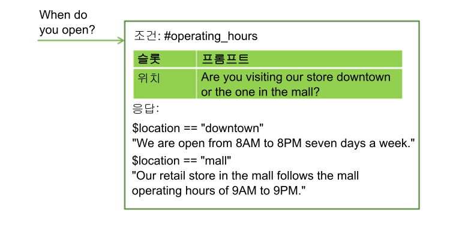
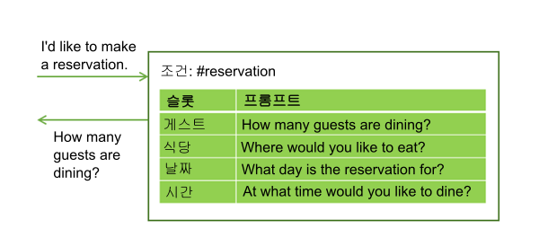
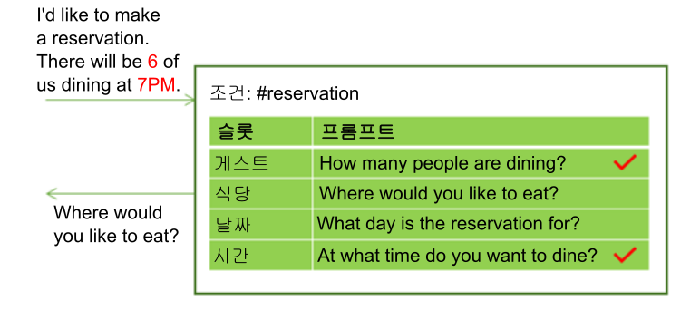
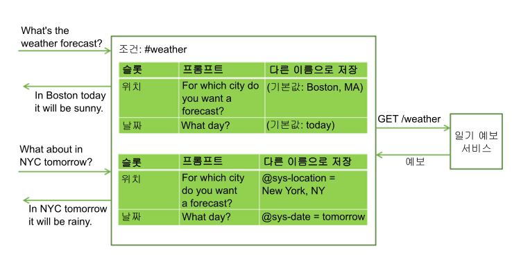

---

copyright:
  years: 2015, 2019
lastupdated: "2019-02-28"

subcollection: assistant

---

{:shortdesc: .shortdesc}
{:new_window: target="_blank"}
{:deprecated: .deprecated}
{:important: .important}
{:note: .note}
{:tip: .tip}
{:pre: .pre}
{:codeblock: .codeblock}
{:screen: .screen}
{:javascript: .ph data-hd-programlang='javascript'}
{:java: .ph data-hd-programlang='java'}
{:python: .ph data-hd-programlang='python'}
{:swift: .ph data-hd-programlang='swift'}
{:table: .aria-labeledby="caption"}

# 슬롯을 사용하여 정보 수집
{: #dialog-slots}

대화 노드에 슬롯을 추가하여 해당 노드 내에서 사용자로부터 여러 정보를 수집하십시오. 슬롯은 사용자의 속도에 맞춰 정보를 수집합니다. 사용자가 미리 제공하는 세부사항이 저장되고 서비스는 제공되지 않은 세부사항만 요청합니다.

<iframe class="embed-responsive-item" id="youtubeplayer" title="노드에 슬롯 추가" type="text/html" width="640" height="390" src="https://www.youtube.com/embed/kMLyKfmO9wI?rel=0" frameborder="0" webkitallowfullscreen mozallowfullscreen allowfullscreen> </iframe>

## 슬롯 추가 이유
{: #dialog-slots-why}

사용자에게 정확하게 응답하기 위해 필요한 정보를 가져오려면 슬롯을 사용하십시오. 예를 들어, 사용자가 운영 시간을 묻지만 상점 위치에 따라 시간이 다른 경우, 대답하기 전에 방문할 상점 위치에 대한 후속 질문을 할 수 있습니다. 그런 다음 제공된 위치 정보를 고려하는 응답 조건을 추가할 수 있습니다.



슬롯을 사용하면 사용자를 위해 복잡한 태스크(예: 저녁 식사 예약)를 완료하는 데 필요한 여러 정보를 수집할 수 있습니다.



사용자가 한 번에 여러 개의 슬롯 값을 제공할 수 있습니다. 예를 들어, 입력에 `There will be 6 of us dining at 7 PM.`이라는 정보가 포함될 수 있습니다. 하나의 입력에 두 개의 누락된 필수 값(예약 손님 수와 시간)이 있습니다. 서비스가 두 값을 모두 인식하고 해당 슬롯에 하나씩 저장합니다. 그리고 다음 빈 슬롯과 연관된 프롬프트를 표시합니다.



슬롯을 사용하면 서비스가 사용자 목적을 다시 설정하지 않고도 후속 질문에 응답할 수 있습니다. 예를 들어, 사용자는 일기 예보에 대해 물은 다음 다른 위치나 다른 날짜의 날씨에 대한 후속 질문을 할 수 있습니다. 필수 예보 변수(예: 위치 및 날짜)를 슬롯에 저장한 다음 사용자가 새 변수값에 대해 후속 질문을 하는 경우, 슬롯 값을 제공된 새 값으로 겹쳐쓰고 새 정보를 반영하는 응답을 제공할 수 있습니다. (대화에서 외부 서비스를 호출하는 방법에 대한 자세한 정보는 [대화 노드에서 프로그래밍 방식 호출 작성](/docs/services/assistant?topic=assistant-dialog-actions)을 참조하십시오.



슬롯을 사용하면 사용자와 서비스 간에 자연스러운 대화 플로우를 생성할 수 있으며, 많은 개별 노드를 사용하여 정보를 수집할 때보다 쉽게 관리할 수 있습니다.

## 슬롯 추가
{: #dialog-slots-add}

1.  수집할 정보 단위를 식별하십시오. 예를 들어, 사용자를 위해 피자를 주문하기 위해 다음 정보를 수집할 수 있습니다.

    - 배달 시간
    - 크기

1.  대화 작성을 시작하지 않은 경우, 작성하려면 [대화 작성](/docs/services/assistant?topic=assistant-dialog-build)의 지시사항을 따르십시오.

1.  대화 편집 보기에서, **사용자 정의**를 클릭한 후 **슬롯** 다음의 토글을 클릭하여 **켜십시오**.

    **모든 정보 프롬프트** 선택란에 대한 자세한 정보는 [한 번에 모든 정보 요청](#dialog-slots-prompt-for-everything)을 참조하십시오. 

1.  **필수 정보의 각 단위를 위한 슬롯을 추가하십시오**. 각 슬롯에 다음 세부사항을 지정하십시오.

    - **검사 대상(Check for)**: 사용자 응답에서 슬롯 프롬프트로 추출할 정보 유형을 식별하십시오. 대부분의 경우, 엔티티 값을 확인하십시오. 표시되는 조건 빌더는 확인할 수 있는 엔티티를 제안합니다. 그러나, 인텐트를 확인할 수도 있습니다. 필드에 인텐트 이름만 입력하면 됩니다. 여기에 AND 및 OR 연산자를 사용하여 복잡한 조건을 정의할 수 있습니다.

      *검사 대상* 값은 먼저 조건으로 사용되지만, 그런 다음 *저장할 이름* 필드에서 이름을 지정한 컨텍스트 변수값이 됩니다. **검사할 내용** 및 **저장할 내용**을 지정합니다. 사용자가 값이 저장되는 방법을 변경하려는 경우, 값을 직접 *검사 대상* 필드에 재형식화하는 표현식을 추가하십시오.
      {: important}

      예를 들어, 엔티티가 패턴 엔티티(예: `@email`)인 경우, 엔티티 이름을 추가한 후에 `.literal`을 추가하십시오. `.literal`을 추가하면 입력한 패턴에 기반하여 이메일 주소로 식별되는 정확한 텍스트를 캡처해야 합니다. 

      일부 경우에는 표현식을 사용하여 값을 캡처할 수 있지만, 저장된 내용에는 표현식을 적용하지 않을 수 있습니다. 그런 경우에는 *검사 대상* 필드에서 하나의 값을 사용하여 값을 캡처한 후 JSON 편집기를 열어 컨텍스트 변수의 값을 변경할 수 있으므로, 다른 내용도 저장됩니다. 예제를 보려면 [0을 올바르게 처리](/docs/services/assistant?topic=assistant-tutorial-slots-complex#tutorial-slots-complex-recognize-zero)를 참조하십시오.

      JSON 편집기에서 슬롯의 컨텍스트 변수 값에 대해 작성한 편집은 JSON 편집기를 종료할 때 **검사 대상** 필드에 반영되지 않습니다. JSON 편집기를 사용하여 값을 편집한 후 언제든지 **검사 대상** 필드를 클릭하여 필드에 초점을 주는 경우, 변경 내용이 유실됩니다.
      {: important}

      *검사 대상* 필드에서 컨텍스트 변수 값을 확인하지 마십시오. 확인하는 값은 저장된 값이기도 하므로 조건에서 컨텍스트 변수를 사용하면 예기치 않은 동작이 발생할 수 있습니다.

    - **저장할 이름(Save as)**: 슬롯 프롬프트에 대한 사용자 응답의 관심 값을 저장할 컨텍스트 변수의 이름을 제공하십시오.

       대화의 다른 위치에서 사용되는 컨텍스트 변수를 재사용하지 마십시오. 컨텍스트 변수에 값이 이미 있는 경우 슬롯의 프롬프트가 표시되지 않습니다. 슬롯에 대한 컨텍스트 변수가 널인 경우에만 슬롯에 대한 프롬프트가 표시됩니다.

    - **프롬프트(Prompt)**: 사용자로부터 필요한 정보를 유도하는 문장을 작성하십시오. 이 프롬프트를 표시한 후 대화가 일시정지되고 서비스는 사용자가 응답하기를 기다립니다.

    - 사용자가 초기 슬롯 프롬프트에 응답하여 필요한 정보를 제공하는지 여부에 따라 다른 후속 문장을 표시하려면 슬롯(**슬롯 편집**  아이콘 클릭)을 편집하고 후속 문장을 정의할 수 있습니다. 

      - **찾음(Found)**: 사용자가 예상 정보를 제공한 후에 표시됩니다.

      - **찾을 수 없음(Not found)**: 사용자가 제공한 정보가 이해되지 않거나 예상된 형식으로 제공되지 않은 경우 표시됩니다. 슬롯이 채워지거나 슬롯 핸들러에서 사용자 입력을 이해하고 처리하면 이 문장은 결코 표시되지 않습니다.

      찾음 및 찾을 수 없음 응답과 관련된 조치와 조건을 정의하는 방법에 관한 정보는 [찾음 및 찾을 수 없음 응답에 조건 추가](#dialog-slots-handler-next-steps)를 참조하십시오.

    이 테이블은 사용자가 두 가지 정보(피자 크기 및 배달 시간)를 수집하여 피자를 주문하는 데 도움이 되는 노드의 예제 슬롯 값을 보여줍니다.

    <table>
    <caption>피자 주문에 대한 예제 슬롯</caption>
    <tr>
      <th>검사 대상</th>
      <th>저장할 이름</th>
      <th>프롬프트</th>
      <th>찾은 경우 후속 문장</th>
      <th>찾을 수 없는 경우 후속 문장</th>
    </tr>
    <tr>
      <td>@size</td>
      <td>$size</td>
      <td>What size pizza would you like?</td>
      <td>$size it is.</td>
      <td>What size did you want? We have small, medium, and large.</td>
    </tr>
    <tr>
      <td>@sys-time</td>
      <td>$time</td>
      <td>When do you need the pizza by?</td>
      <td>For delivery by $time.</td>
      <td>What time did you want it delivered? We need at least a half hour to prepare it.</td>
    </tr>
    </table>

1.  **슬롯을 선택사항으로 설정하거나 특정 조건 하에서 사용 안함으로 설정하십시오**. 선택적으로 다음과 같은 방법으로 슬롯을 구성할 수 있습니다.

    - **선택사항**: 슬롯을 선택사항으로 설정하려면 프롬프트 없이 슬롯을 추가하십시오. 서비스는 사용자에게 정보를 요구하지 않지만 사용자 입력의 정보를 찾고, 사용자가 제공하는 경우 값을 저장합니다. 예를 들어, 사용자가 지정하는 경우 식이 제한 정보를 캡처하는 슬롯을 추가할 수 있습니다. 하지만 대부분의 경우 관련이 없으므로 모든 사용자에게 식이 제한 정보를 요청하지는 않으려고 합니다.

       <table>
       <caption>선택사항 슬롯</caption>
       <tr>
          <th>정보</th>
          <th>검사 대상</th>
          <th>저장할 이름</th>
       </tr>
       <tr>
          <td>Wheat restriction</td>
          <td>@dietary</td>
          <td>$dietary</td>
      </tr>
      </table>

      슬롯을 선택사항으로 설정하는 경우, 슬롯에 값이 제공되지 않은 경우에도 의미가 통하도록 말할 수 있으면 노드 레벨 응답 텍스트에서 해당 컨텍스트 변수만 참조하십시오. 예를 들어, 다음과 같은 요약문을 말할 수 있습니다. `I am ordering a $size $dietary pizza for delivery at $time.` 결과 텍스트는 `gluten-free` 또는 `dairy-free`와 같은 식이 제한 정보가 제공되는지 여부를 판단합니다. 결과는 `I am ordering a large gluten-free pizza for delivery at 3:00PM.` 또는 `I am ordering a large pizza for delivery at 3:00PM.`입니다.
      {: tip}

    - **조건부**: 특정 조건에서만 슬롯을 사용하려면 해당 슬롯에 조건을 추가할 수 있습니다. 예를 들어, 슬롯 1에서 미팅 시작 시간을 요청하는 경우 슬롯 2는 미팅 소요 시간을 캡처한 다음 슬롯 2 값이 제공되지 않은 경우에만 슬롯 3을 사용하고 미팅 종료 시간을 요청할 수 있습니다. 슬롯을 조건부로 작성하려면, 슬롯을 편집하고 **추가**  메뉴에서, **조건 사용**을 선택하십시오. 슬롯을 사용하기 위해 충족해야 하는 조건을 정의하십시오.

      이전 슬롯에서 컨텍스트 변수의 값은 슬롯이 나열되는 순서가 평가되는 순서이기 때문에 조건부로 지정할 수 있습니다. 그러나 이 슬롯을 평가할 때 사용자가 신뢰할 수 있는 슬롯 컨텍스트 변수에 대한 조건만 값을 포함할 수 있습니다. 예를 들어, 이전 슬롯은 필수 슬롯이어야 합니다.
    {: tip}
1.  **사용자를 추적하십시오**. 상호작용 중에 사용자가 노드 목적과 관계없는 질문을 할 때 응답을 제공하는 슬롯 핸들러를 선택적으로 정의할 수 있습니다.

    예를 들어, 사용자가 토마토 소스 레시피 또는 성분을 볼 수 있는 곳에 대해 물을 수 있습니다. 이와 같이 관계없는 질문을 처리하려면 **핸들러 관리** 링크를 클릭하고 각 예상 질문에 대한 조건과 응답을 추가하십시오.

    

    관계없는 질문에 응답하면 현재 빈 슬롯과 연관된 프롬프트가 표시됩니다.

    사용자가 노드 레벨 응답이 표시될 때까지 언제든지 대화 노드 플로우 중에 슬롯 핸들러 조건과 일치하는 입력을 제공하는 경우에 이 조건이 트리거됩니다. 슬롯 핸들러를 사용하는 다양한 방법에 관한 자세한 정보는 [프로세스 종료 요청 핸들링](#dialog-slots-node-level-handler)을 참조하십시오.
1.  **노드 레벨 응답을 추가하십시오**. 노드 레벨 응답은 모든 필수 슬롯이 채워지기 전에는 실행되지 않습니다. 수집한 정보를 요약하는 응답을 추가할 수 있습니다. 예: `A $size pizza is scheduled for delivery at $time. Enjoy!`

    특정 조건에 따라 다른 응답을 정의하려면, **사용자 정의**를 클릭한 다음 **다중 응답**을 클릭하여 **켜십시오**. 조건부 응답에 대한 정보는 [조건부 응답](/docs/services/assistant?topic=assistant-dialog-overview#dialog-overview-multiple)을 참조하십시오.
1.  **슬롯 컨텍스트 변수를 재설정하는 로직을 추가하십시오**. 슬롯마다 사용자의 응답을 수집하므로 이 응답이 컨텍스트 변수에 저장됩니다. 컨텍스트 변수를 사용하여 다른 노드로 또는 사용할 애플리케이션이나 외부 서비스로 정보를 전달할 수 있습니다. 하지만 정보를 전달한 후 정보 수집을 다시 시작하려면 컨텍스트 변수를 널로 설정하여 노드를 재설정해야 합니다. 필수 슬롯이 채워질 때까지 서비스가 노드를 종료하지 않으므로 현재 노드 내에서 컨텍스트 변수를 널로 설정할 수 없습니다. 대신 다음 방법 중 하나를 사용할 것을 고려하십시오.

    - 변수를 널로 설정하는 외부 애플리케이션에 처리를 추가하십시오.
    - 변수를 널로 설정하는 하위 노드를 추가하십시오.
    - 변수를 널로 설정하는 상위 노드를 삽입한 다음 슬롯이 있는 노드로 점프하십시오.

체험판을 사용해 보시기 바랍니다! 단계별 [튜토리얼](/docs/services/assistant?topic=assistant-tutorial-slots)을 수행하십시오.

## 슬롯 사용 팁
{: #dialog-slots-tips}

다음 슬롯 특성은 슬롯 컨텍스트 변수의 값을 확인하고 설정할 수 있도록 도와줍니다.

| 특성 이름              | 설명        |
|------------------------|-------------|
| `all_slots_filled`     | 노드의 모든 슬롯에 대한 모든 컨텍스트 변수가 설정된 경우에만 true로 평가됩니다. 사용법 예제는 [찾음 응답이 필요하지 않을 때 표시되지 않도록 방지](#dialog-slots-stifle-found-responses)를 참조하십시오. |
| `event.current_value`  | 이 슬롯에 대한 컨텍스트 변수의 현재 값입니다. 이 특성 및 event.previous_value 특성에 관한 정보는 [슬롯 컨텍스트 변수 값 바꾸기](#dialog-slots-found-handler-event-properties)를 참조하십시오. |
| `event.previous_value` | 이 슬롯에 대한 컨텍스트 변수의 이전 값입니다. |
| `has_skipped_slots`    | 슬롯을 건너뛴 다음 단계 옵션으로 구성된 슬롯 또는 슬롯 처리기 중 하나라도 처리 된 경우 true입니다. 슬롯에 대한 다음 단계 옵션에 관한 자세한 정보는 [찾음 및 찾을 수 없음 응답에 대한 조건 추가](#slot-handler-next-steps)를 참조하고 슬롯 핸들러에 대한 다음 단계 옵션에 관한 자세한 정보는 [프로세스 종료 요청 핸들링](#dialog-slots-node-level-handler)을 참조하십시오. |
| `slot_in_focus`        | 슬롯 조건을 현재 슬롯에만 강제로 적용합니다. 세부사항은 [확인](#dialog-slots-get-confirmation)을 참조하십시오. |
{: caption="슬롯 특성" caption-side="top"}

공통 태스크 처리를 위해 이러한 접근법을 고려하십시오.

- [한 번에 모든 정보 요청](#dialog-slots-prompt-for-everything)
- [다중 값 캡처](#dialog-slots-multiple-entity-values)
- [값 재형식화](#dialog-slots-reformat-values)
- [영(0) 처리](#dialog-slots-zero)
- [확인](#dialog-slots-get-confirmation)
- [슬롯 컨텍스트 변수값 바꾸기](#dialog-slots-found-handler-event-properties)
- [숫자 혼동 방지](#dialog-slots-avoid-number-confusion)
- [찾음 및 찾을 수 없음 응답에 조건 추가](#dialog-slots-handler-next-steps)
- [여러 번의 실패 후에 이동](#dialog-slots-stop-trying-after-3)
- [필요하지 않으면 찾음 응답이 표시되지 않도록 함](#dialog-slots-stifle-found-responses)
- [프로세스 종료 요청 핸들링](#dialog-slots-node-level-handler)

### 한 번에 모든 정보 요청
{: #dialog-slots-prompt-for-everything}

전체 노드에서 사용자가 제공할 정보의 단위를 사용자에게 분명하게 알리는 초기 프롬프트를 포함하십시오. 이 프롬프트를 처음에 표시하면 사용자가 한 번에 모든 세부사항을 제공할 수 있으며 한 번에 하나씩 정보를 요청하는 프롬프트가 표시되기를 기다리지 않아도 됩니다.

예를 들어, 고객이 피자 주문을 원하여 노드가 트리거될 때 다음과 같은 예비 프롬프트에 응답할 수 있습니다. `I can take your pizza order. Tell me what size pizza you want and the time that you want it delivered.`

사용자가 초기 요청에서 이 정보의 한 부분이라도 제공하면 프롬프트가 표시되지 않습니다. 예를 들어, 초기 입력이 `I want to order a large pizza.`일 수 있습니다. 서비스가 입력을 분석할 때 `large`를 피자 크기로 인식하고 **Size** 슬롯을 제공된 값으로 채웁니다. 슬롯 중 하나가 채워지므로 피자 크기 정보를 다시 요청하지 않도록 초기 프롬프트 표시를 건너뜁니다. 대신 정보가 누락된 나머지 슬롯에 대한 프롬프트를 표시합니다.

슬롯 기능을 사용한 사용자 정의 분할창에서 **모든 정보 프롬프트** 선택란을 선택하여 초기 프롬프트를 사용으로 설정하십시오. 이 설정은 **미리 채워진 슬롯이 없으면 먼저 이를 요청** 필드를 노드에 추가하고 여기서 사용자에게 모든 정보를 입력하라는 프롬프트를 표시하는 텍스트를 지정할 수 있습니다.

### 다중 값 캡처
{: #dialog-slots-multiple-entity-values}

항목 목록을 요청하고 하나의 슬롯에 저장할 수 있습니다.

예를 들어, 피자에 토핑을 원하는지 여부를 사용자에게 물을 수 있습니다. 이렇게 하려면 엔티티(@toppings) 및 이 엔티티에 허용된 값(pepperoni, cheese, mushroom 등)을 정의하십시오. 사용자에게 토핑에 대해 묻는 슬롯을 추가하십시오. 엔티티 유형의 값 특성을 사용하여 여러 값을 캡처하십시오(제공되는 경우).

<table>
<caption>다중 값 슬롯</caption>
<tr>
  <th>검사 대상</th>
  <th>저장할 이름</th>
  <th>프롬프트</th>
  <th>찾은 경우 후속 문장</th>
  <th>찾을 수 없는 경우 후속 문장</th>
</tr>
<tr>
  <td>@toppings.values</td>
  <td>$toppings</td>
  <td>Any toppings on that?</td>
  <td>Great addition.</td>
  <td>What toppings would you like? We offer ...</td>
</tr>
</table>

사용자 지정 토핑을 나중에 참조하려면 `<? $entity-name.join(',') ?>` 구문을 사용하여 토핑 배열에 각 항목을 나열하고 쉼표로 값을 구분하십시오. 예: `I am ordering you a $size pizza with <? $toppings.join(',') ?> for delivery by $time.`

### 값 재형식화
{: #dialog-slots-reformat-values}

사용자에게 정보를 묻고 응답의 사용자 입력을 참조해야 하므로 익숙한 형식으로 표시할 수 있도록 값 재형식화를 고려하십시오.

예를 들어, 시간 값이 `hh:mm:ss` 형식으로 저장됩니다. `hour:minutes AM/PM` 형식을 사용하도록 시간 값을 저장할 때 슬롯에 JSON 편집기를 사용하여 이 시간 값을 재형식화할 수 있습니다.

```json
{
      "context":{
    "time": "<? @sys-time.reformatDateTime('h:mm a') ?>"
  }
}
```
{: codeblock}

다른 재형식화 아이디어는 [표현식 언어 메소드](/docs/services/assistant?topic=assistant-dialog-methods)를 참조하십시오.

### 영(0) 처리
{: #dialog-slots-zero}

슬롯 조건에 `@sys-number`를 사용하면 입력에서 지정하는 모든 숫자를 캡처하는 데 도움이 됩니다. 그러나 숫자 0을 지정하는 경우에는 예상대로 작동하지 않습니다. 0을 유효한 숫자로 처리하는 대신, 조건은 false로 평가되고 서비스는 사용자에게 다시 숫자를 입력하도록 프롬프트합니다. 이 동작을 방지하려면 슬롯 조건에서 `@sys-number` 또는 `@sys-number:0`을 확인하십시오.

숫자 멘션을 확인하는 슬롯 조건이 0을 적절히 처리하는지 확인하려면 다음 단계를 완료하십시오.

1.  `@sys-number || @sys-number:0`을 슬롯 조건 필드에 추가한 다음, 컨텍스트 변수 이름과 텍스트 프롬프트를 제공하십시오.
1.  **응답 편집**  아이콘을 클릭하십시오.
1.  **추가**  메뉴를 클릭한 다음 **JSON 편집기 열기**를 선택하십시오. 
1.  `@sys-number`만 지정하려면 현재 `"number":"@sys-number || @sys-number:0"` 구문이 있는 컨텍스트 변수를 업데이트하십시오.

    ```json
    {
      "context":{
        "number":"@sys-number"
      }
    }
    ```
    {: codeblock}

0을 숫자 값으로 허용하지 않으려는 경우, 슬롯에 대한 조건부 응답을 추가하여 0을 확인하고 사용자에게 0보다 큰 숫자를 제공해야 함을 알릴 수 있습니다. 그러나 영(0)이 입력으로 제공되는 경우 슬롯 조건이 0을 인식할 수 있어야 합니다.

### 확인
{: #dialog-slots-get-confirmation}

사용자에게 수집한 정보가 정확하고 완전한지 확인하도록 요청하는 슬롯을 다른 슬롯 아래에 추가하십시오. 슬롯은 #yes 또는 #no 인텐트와 일치하는 응답을 검색할 수 있습니다.

<table>
<caption>슬롯 확인</caption>
<tr>
  <th>검사 대상</th>
  <th>저장할 이름</th>
  <th>프롬프트</th>
  <th>찾은 경우 후속 문장</th>
  <th>찾을 수 없는 경우 후속 문장</th>
</tr>
<tr>
  <td>#yes || #no</td>
  <td>$confirmation</td>
  <td>I'm going to order you a `$size` pizza for delivery at `$time`. 진행할까요?</td>
  <td>Your pizza is on its way!</td>
  <td>see *Complex response*</td>
</tr>
</table>

**복합 응답** 사용자는 대화(*Oh yes, we want the pizza delivered at 5pm* 또는 *no guests tonight, let's make it a small*) 중에 긍정 또는 부정적인 내용을 포함할 수 있으므로 `slot_in_focus` 특성을 사용하여 슬롯 조건에서 이 슬롯에 대한 프롬프트에 대해서만 Yes 또는 No 응답을 검색하십시오.

```json
(#yes || #no) && slot_in_focus
```
{: codeblock}

`slot_in_focus` 특성은 항상 부울(true 또는 false) 값으로 평가됩니다. 부울 결과를 원하는 조건에만 이 특성을 포함하십시오. 예를 들어, 엔티티 유형을 검사하는 슬롯 조건에는 사용하지 마십시오. 그런 다음 엔티티 값을 저장하십시오.
{: tip}

**찾을 수 없음** 프롬프트에서, 사용자가 Yes 또는 No 답변을 제공할 것으로 예상하는지 확인하십시오.

```json
{
  "output":{
    "text": {
      "values": [
        "Respond with Yes to indicate that you want the order to
         be placed as-is, or No to indicate that you do not."
      ]
    }
  }
}
```
{: codeblock}

**찾음** 프롬프트에서, 아니오 응답(#no)에 대해 검사하는 조건을 추가하십시오. 발견되면, 처음부터 다시 정보를 묻고 이전에 저장한 컨텍스트 변수를 재설정하십시오.

```json
{
  "conditions": "#no",
  "output":{
    "text": {
      "values": [
        "Let's try this again. Tell me what size pizza you want and the time..."
      ]
    }
  },
  "context":{
    "size": null,
    "time": null,
    "confirmation": null
  }
}
```
{: codeblock}

### 슬롯 컨텍스트 변수값 바꾸기
{: #dialog-slots-found-handler-event-properties}

사용자가 슬롯이 있는 노드를 종료하기 전에 언제든 슬롯에 새 값을 제공하면, 새 값이 슬롯 컨텍스트 변수에 저장되며 이전에 지정된 값을 바꿉니다. 대화는 찾음 조건에 정의된 특수 특성을 사용하여 이 바꾸기가 발생했음을 명시적으로 확인할 수 있습니다.

- `event.previous_value`: 이 슬롯에 대한 컨텍스트 변수의 이전 값입니다.
- `event.current_value`: 이 슬롯에 대한 컨텍스트 변수의 현재 값입니다.

예를 들어, 대화는 항공편 예약을 위해 목적지 도시를 묻습니다. 사용자는 `Paris`를 제공합니다. $destination 슬롯 컨텍스트 변수를 *Paris*로 설정합니다. 그런 다음 사용자는 `Oh wait. I want to fly to Madrid instead.`라고 대답합니다. 찾음 조건을 다음과 같이 설정하면 대화가 이 유형의 변경을 처리할 수 있습니다.

사용자가 응답할때 @destination이 발견되는 경우:

```json
Condition: (event.previous_value != null) &&
           (event.previous_value != event.current_value)
    Response: Ok, updating destination from
    <? event.previous_value ?> to <? event.current_value ?>.
Response: Ok, destination is $destination.
```
{: codeblock}

이 슬롯 구성을 사용하면 대화가 `Ok, updating the destination from Paris to Madrid.`라고 대답하여 사용자의 목적지 변경에 반응할 수 있습니다.

### 숫자 혼동 방지
{: #dialog-slots-avoid-number-confusion}

사용자가 제공하는 일부 값이 둘 이상의 엔티티 유형으로 식별될 수 있습니다.

예를 들어, 도착일과 출발일이라는 동일한 유형의 값을 저장하는 두 가지 슬롯이 있습니다. 로직을 슬롯 조건에 빌드하여 이와 같이 유사한 값을 구분하십시오.

또한 서비스는 단일 사용자 입력에서 여러 엔티티 유형을 인식할 수 있습니다. 예를 들어, 사용자가 통화를 제공하면 @sys-currency와 @sys-number 엔티티 유형 두 가지로 인식됩니다. *시험 사용* 분할창에서 몇 가지 테스트를 수행하여 시스템이 여러 사용자 입력을 해석하는 방법을 파악하고, 로직을 조건에 빌드하여 해석이 잘못되지 않도록 하십시오.

슬롯 기능에 고유한 로직의 경우 단일 사용자 입력에서 두 개의 시스템 엔티티가 인식되면 범위가 더 큰 엔티티가 사용됩니다. 예를 들어, 사용자가 *May 2*를 입력하면, {{site.data.keyword.conversationshort}} 서비스가 텍스트에서 @sys-date (05022017) 및 @sys-number (2) 엔티티를 둘 다 인식하더라도 범위가 더 큰 시스템 엔티티(@sys-date)만 등록되어 슬롯에 적용됩니다.
{: tip}

사용자 입력에서 인식되는 각 엔티티의 경우 하나의 슬롯만 채울 수 있습니다. 따라서 비슷한 값을 찾는 두 개의 슬롯이 있는 경우, 더 긴 문자열을 캡처하는 슬롯이 짧은 문자열을 캡처하는 슬롯 위에 있도록 위치를 지정하십시오. 예를 들어, 하나의 슬롯이 `GR1234`와 같은 구문이 포함된 제품 ID(`@id`)를 캡처하고 다른 슬롯이 `1234`와 같은 숫자(`@number`)를 캡처하는 경우, 숫자를 캡처하는 슬롯 위에 ID를 캡처하는 슬롯을 배치합니다. 그렇지 않은 경우, 사용자 입력에 `BR3344`와 같은 ID가 있는 경우, `@number` 슬롯이 이 ID를 숫자 참조로 요구하고 `$number` 컨텍스트 변수를 `3344`로 채웁니다. 그러나 이 값은 `@id` 슬롯의 `$id` 컨텍스트 변수에 `BR3344`로 저장되어야 하는 제품 ID 참조일 가능성이 많습니다.

### 찾음 및 찾을 수 없음 응답에 조건 추가
{: #dialog-slots-handler-next-steps}

각 슬롯에 대하여, 조치와 연관된 조건부 응답을 사용하여 사용자에게 필요한 정보를 추출하는 데 도움이 됩니다. 이렇게 하려면 다음 단계를 수행하십시오.

1.  찾음 및 찾을 수 없음 응답에 조건을 추가하려면 **슬롯 편집**  아이콘을 클릭하십시오.
1.  **추가**  메뉴에서, **조건부 응답 사용**을 선택하십시오.
1.  조건이 충족될 경우, 표시할 조건과 응답을 입력하십시오.

    **찾음 예제**: 슬롯은 저녁 식사 예약을 예상하고 있습니다. *검사 대상* 필드의 @sys-time을 사용하여 캡처할 수 있습니다. 올바르지 않은 시간이 저장되는 것을 방지하려면, 제공된 시간이 식당의 마지막 예약 가능 시간보다 이전인지 여부를 확인하는 조건부 응답을 추가할 수 있습니다. 예: `@sys-time.after('21:00:00')` 해당하는 응답은 다음과 같습니다. *예약 가능한 마지막 시간은 오후 9시입니다.*

    **찾을 수 없음 예제**: 슬롯은 레스토랑 체인에 레스토랑이 있는 특정 도시 세트를 허용하는 @location 엔티티를 예상하고 있습니다. 찾을 수 없음 조건은 사용자가 유효한 도시를 지정하는 경우 @sys-location을 확인하지만 체인에 사이트가 없는 도시를 확인합니다. 해당하는 응답은 다음과 같습니다. *저희는 이 위치에 식당이 없습니다. *

1.  조건이 충족되면 발생하는 사항을 사용자 정의하려는 경우, **응답 편집**  아이콘을 클릭하십시오.

    찾음 응답(검사 대상 필드에 지정된 값 유형과 일치하는 값을 제공할 때 표시됨)의 경우, 다음 조치 중 하나를 선택하여 다음을 수행할 수 있습니다.

      - **이동(기본값)**: 응답을 표시한 후 다음 빈 슬롯으로 이동하도록 서비스에 지시합니다. 관련 응답에서 사용자가 입력 내용을 이해했는지 확인하십시오. 예: *Ok. $date를 스케줄하려고 합니다.*
      - **슬롯 및 프롬프트 다시 지우기**: 잘못된 값을 선택할 수 있는 *검사 대상* 필드에서 엔티티를 사용하는 경우 잘못된 해석을 검출하는 조건을 추가하고 이 조치를 사용하여 현재 슬롯 값을 지우고 올바른 값을 표시합니다.
      - **응답 건너뛰기**: 정의한 조건이 충족되면 더 이상 이 노드의 나머지 슬롯을 채울 필요가 없으면 이 조치를 선택하여 나머지 슬롯을 건너 뛰고 다음 노드 레벨 응답으로 바로 이동하십시오. 예를 들어 사용자의 나이가 16세 미만인지 여부를 확인하는 조건을 추가 할 수 있습니다. 그런 경우, 사용자의 운전 기록에 대해 질문하는 나머지 슬롯을 건너 뛸 수 있습니다.

    찾을 수 없음 응답(사용자가 유효한 값을 제공하지 않을 때 표시됨)의 경우 수행할 조치 중 하나를 선택할 수 있습니다.

      - **사용자 입력 대기(기본값)**: 대화를 일시 중지하고 서비스가 사용자의 응답을 기다립니다. 가장 단순한 경우로, 사용자가 여기에 지정하는 텍스트는 제공해야 하는 정보 유형을 보다 명확하게 나타낼 수 있습니다. 조건부 응답과 함께 이 조치를 사용하는 경우 사용자 응답에 무엇이 잘못되었으며 무엇을 제공해야 하는지 명확하게 명시하도록 조건부 응답을 적어야 합니다.
      - **다시 프롬프트**: 찾을 수 없음 응답을 표시한 후 서비스는 슬롯 프롬프트를 다시 반복하고 사용자의 응답을 대기합니다. 조건부 응답과 함께 이 조치를 사용하면 응답은 사용자가 제공한 대답에 대해 잘못된 사항을 설명할 수 있습니다. 슬롯 프롬프트에서 설명하기 때문에 사용자가 제공하려는 정보 유형을 반복해서 표시할 필요가 없습니다.

        이 옵션을 선택한 경우, 사용자가 동일한 텍스트를 두 번 이상 볼 수 없도록 찾을 수 없음 응답의 변형을 하나 이상 추가하는 것을 고려하십시오. 다른 단어를 사용하여 사용자에게 제공해야 하는 정보와 형식을 설명하십시오.
        {: tip}

      - **이 슬롯 건너뛰기**: 현재 슬롯을 채우는 것을 중지하고 대신 다음 빈 슬롯에 대한 프롬프트로 이동하도록 서비스에 지시합니다. 이 옵션은 슬롯을 선택적으로 설정하고 사용자에게 정보를 묻는 프롬프트를 표시하려는 슬롯에서 유용합니다. 예를 들어, *외부*, *벽난로 근처*, *비공개* 등과 같이 레스토랑 좌석 환경 설정을 캡처하는 @seating 엔티티가 있을 수 있습니다. 사용자에게 *Do you have any seating preferences?* 및 `@seating.values`를 확인하는 프롬프트를 표시하는 슬롯을 추가할 수 있습니다. 올바른 응답이 제공되면 환경 설정 정보를 `$seating_preferences`에 저장합니다. 그러나, 이 조치를 찾을 수 없음 응답의 다음 단계로 선택하면 사용자가 올바른 값을 제공하지 않으면 이 슬롯을 채우는 것을 중지하도록 서비스에 지시합니다.
      - **응답 건너뛰기**: 정의한 조건이 충족되면 더 이상 이 노드의 나머지 슬롯을 채울 필요가 없으면 이 조치를 선택하여 나머지 슬롯을 건너 뛰고 다음 노드 레벨 응답으로 바로 이동하십시오. 예를 들어, 편도 비행 정보를 캡처한 후 슬롯 프롬프트에 *Are you buying round trip tickets?*가 표시됩니다. 찾을 수 없음 조건은 #No를 확인할 수 있습니다. #No가 발견되면, 이 옵션을 사용하여 리턴 비행 정보를 캡처하는 나머지 슬롯을 건너 뛰고 대신 노드 레벨 응답으로 바로 이동합니다.

    **뒤로**를 클릭하여 슬롯의 편집 보기로 돌아가십시오.
1.  다른 조건부 응답을 추가하려면, **응답 추가**를 클릭한 후, 조건이 충족되면 표시할 조건과 응답을 입력하십시오.

    표시될 응답을 하나 이상 추가하십시오. 모든 응답을 표시하려면 조건 필드를 공백으로 둘 수 있습니다. 서비스는 자동으로 빈 조건 필드를 `true` 특수 조건으로 채웁니다.

1.  **저장**을 클릭하여 변경사항을 저장하고 슬롯의 편집 보기를 닫은 다음 노드의 편집 보기로 돌아가십시오.

### 여러 번의 실패 후에 이동
{: #dialog-slots-stop-trying-after-3}

찾을 수 없음 조건 응답을 사용하여 여러 번 시도한 후에도 올바르게 응답할 수 없는 경우 사용자가 슬롯을 종료할 수 있는 방법을 제공할 수 있습니다. catchall 응답에서 JSON 편집기를 열어 찾을 수 없는 응답이 리턴된 횟수를 추적하는 카운터 컨텍스트 변수를 추가합니다. 이전 노드에서는 초기 카운터 컨텍스트 변수 값을 0으로 설정해야 합니다.

이 예에서, 서비스는 피자 크기를 문의합니다. 사용자의 변수에 크기(미디엄)를 적용하기 전에 사용자는 질문에 3회 잘못 대답할 수 있습니다. (주문 정보를 확인하라는 메시지가 표시되면 사용자가 언제든지 크기를 수정할 수 있는 확인 슬롯을 포함할 수 있습니다.)

검사 대상: @size</br>
저장할 이름: $size</br>
찾을 수 없음 catchall 조건:

```json
{
  "output": {
    "text": {
      "values": [
        "What size did you want? We have small, medium, and large."
      ],
      "selection_policy": "sequential"
    }
  },
"context": {
    "counter": "<? context['counter'] + 1 ?>"
  }
}
```
{: codeblock}

3회 시도 후에 다르게 답변하려면 다음과 같은 다른 찾을 수 없음 조건을 추가하십시오.
```json
{
  "conditions": "$counter > 1",
  "output": {
    "text": {
      "values": [
        "We will bring you a size medium pizza."
      ]
    }
  },
"context": {
    "size": "medium"
  }
  ```
  {: codeblock}

이 찾을 수 없음 조건이 찾을 수 없음 catchall 조건보다 더 정확하며 기본값은 `true`입니다. 따라서, 이 응답을 이동하여 원래 조건부 응답보다 먼저 나오게 하거나 실행되지 않도록 해야 합니다. 조건부 응답을 선택하고 화살표를 사용하여 위로 이동하십시오.

### 필요하지 않으면 찾음 응답이 표시되지 않도록 함
{: #dialog-slots-stifle-found-responses}

여러 슬롯에 찾음 응답을 지정하면 사용자가 한 번에 여러 슬롯의 값을 제공하는 경우 하나 이상의 슬롯에 대한 찾음 응답이 표시됩니다. 리턴할 모든 슬롯에 대한 찾음 응답을 원하거나 어떤 슬롯에 대해서도 찾음 응답을 원하지 않을 수 있습니다.

찾음 응답을 표시하지 않기 위해 각 찾음 응답에 대해 다음 중 하나를 수행할 수 있습니다.

- 특정 슬롯이 채워지면 표시되지 않도록 하는 조건을 응답에 추가하십시오. 예를 들어, $size 및 $time 컨텍스트 변수가 둘 다 제공되는 경우 응답이 표시되지 않도록 하는 조건(예: `!($size && $time)`)을 추가할 수 있습니다.
- 응답에 `!all_slots_filled` 조건을 추가하십시오. 이 설정은 모든 슬롯이 채워지면 응답이 표시되지 않도록 합니다. 확인 슬롯을 포함하는 경우에는 이 방식을 사용하지 마십시오. 확인 슬롯도 슬롯이며, 일반적으로 확인 슬롯 자체가 채워지기 전에 찾음 응답이 표시되지 않도록 할 수 있습니다.

### 프로세스 종료 요청 핸들링
{: #dialog-slots-node-level-handler}

사용자가 노드를 종료하려는 경우 인식할 수 있는 하나 이상의 슬롯 핸들러를 추가하십시오.

예를 들어, 애완동물 미용 약속을 스케줄하기 위해 정보를 수집하는 노드에서 #cancel 인텐트에 대한 조건을 지정하는 핸들러를 추가할 수 있으며, 이는 다음과 같은 발화(utterance)를 인식합니다. 예: <q>Forget it. I changed my mind.</q>

1.  핸들러의 JSON 편집기에서 모든 슬롯 컨텍스트 변수를 더미 값으로 채워 노드가 누락된 슬롯을 요청하지 않도록 하십시오. 핸들러 응답에서, 다음과 같은 메시지를 추가하십시오. 예: `Ok, we'll stop there. No appointment will be scheduled.`
1.  다음 옵션 중에서 서비스가 수행할 조치를 선택하십시오.

    - **다시 프롬프트(기본값)**: 주제를 벗어난 질문을 하기 전에 사용자가 작업하고 있던 슬롯에 대한 프롬프트를 표시합니다.
    - **현재 슬롯 건너뛰기**: 주제를 벗어난 질문을 하기 전에 사용자가 작업하고 있던 슬롯 다음에 오는 슬롯과 관련된 프롬프트를 표시합니다. 그리고 이 서비스는 건너뛴 슬롯을 채우려는 시도를 하지 않습니다.
    - **응답 건너뛰기**: 주제를 벗어난 질문을 하기 전에 사용자가 작업한 슬롯을 포함하여 나머지 빈 슬롯에 대한 프롬프트를 건너뜁니다.

1.  노드 레벨 응답의 경우 슬롯 컨텍스트 변수 중 하나에서 더미 값을 검사하는 조건을 추가하십시오. 찾으면, 다음과 같은 최종 메시지가 표시됩니다. 예: `If you decide to make an appointment later, I'm here to help.` 찾을 수 없는 경우, 다음과 같은 노드의 표준 요약 메시지를 표시합니다. 예: `I am making a grooming appointment for your $animal at $time on $date.`

다음은 피자 예제의 핸들러를 정의하는 JSON 샘플입니다. 앞서 설명한 바와 같이, 컨텍스트 변수는 모두 더미 값으로 설정됩니다. `$size` 컨텍스트 변수는 `dummy`로 설정됩니다. $size 값은 노드 레벨 응답을 트리거하여 적절한 메시지를 표시하고 슬롯 노드를 종료합니다.

```json
{
"conditions": "#cancel",
 "output": {
   "text": {
     "values": [
       "Ok, we'll stop there. No pizza delivery will be scheduled."
     ],
    "selection_policy": "sequential"
    }
  },
"context": {
   "time": "12:00:00",
   "size": "dummy",
   "confirmation":"true"
}
}
```
{: codeblock}

**중요**: 이 조건 이전에 평가된 조건에서 사용된 로직을 고려하여 고유한 조건을 작성할 수 있습니다. 사용자 입력이 수신되면 조건은 다음 순서로 평가됩니다.

- 현재 슬롯 레벨 찾음 조건.
- 나열된 순서의 슬롯 핸들러.
- 다이그레션(digression)이 허용되는 경우, 루트 레벨 노드 조건이 일치하는지 검사됩니다(대화 트리 루트 또는 루트 폴더의 최종 `anything else` 노드 ).
- 현재 슬롯 레벨 찾을 수 없음 조건.
- 최종 `anything else` 노드 조건.

슬롯 핸들러처럼 항상 true(예: `true` 또는 `anything_else`)인 조건을 추가할 때 주의하십시오. 슬롯마다, 슬롯 핸들러가 true로 평가되는 경우, 찾을 수 없음 조건을 완전히 건너뜁니다. 따라서 항상 true로 평가되는 슬롯 핸들러를 사용하면 모든 슬롯에 대해 찾을 수 없음 조건이 평가되지 않도록 효과적으로 방지할 수 있습니다.
{: tip}

예를 들어, 고양이를 제외한 모든 동물을 미용합니다. 동물 슬롯의 경우 다음 슬롯 조건을 사용하여 `cat`이 동물 슬롯에 저장되지 않도록 할 수 있습니다.

```json
Check for @animal && !@animal:cat, then save it as $animal.
```
{: codeblock}

사용자가 고양이가 허용되지 않음을 알게 하려면 동물 슬롯의 찾을 수 없음 조건에 다음 값을 지정할 수 있습니다.

```json
If @animal:cat then, "I'm sorry. We do not groom cats."
```
{: codeblock}

논리적인 상태이면, #exit 슬롯 핸들러를 정의하는 경우에도 조건 평가 순서를 고려할때 찾을 수 없음 조건이 트리거되지 않습니다. 대신 다음 슬롯 조건을 사용할 수 있습니다.

```json
Check for @animal, then save it as $animal.
```
{: codeblock}

가능한 `cat` 응답을 처리하려면 이 값을 찾음 조건에 추가하십시오.

```json
If @animal:cat then, "I'm sorry. We do not groom cats."
```
{: codeblock}

현재 cat으로 설정되어 있는 값은 설정되면 안되므로 찾음 조건의 JSON 편집기에서 $animal 컨텍스트 변수값을 재설정하십시오.

```json
{
  "output":{
    "text": {
      "values": [
        "I'm sorry. We do not groom cats."
      ]
    }
  },
  "context":{
    "animal": null
  }
}
```
{: codeblock}

## 슬롯 예제
{: #dialog-slots-examples}

서로 다른 공통 슬롯 사용 시나리오를 구현하는 JSON 파일에 액세스하려면 GitHub의 커뮤니티 [대화 저장소 ](https://github.com/watson-developer-cloud/community/tree/master/watson-assistant){: new_window}로 이동하십시오.

예제를 탐색하려면 예제 JSON 파일 중 하나를 다운로드한 다음 새 대화 스킬로 가져오십시오. 대화 탭에서 대화 노드를 검토하여 여러 유스 케이스를 처리하도록 슬롯을 구현한 방법을 볼 수 있습니다.
