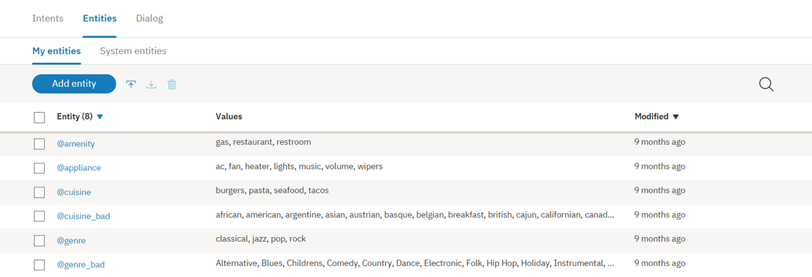
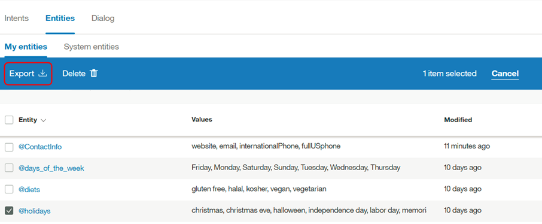

---

copyright:
  years: 2015, 2018
lastupdated: "2018-01-30"

---

{:shortdesc: .shortdesc}
{:new_window: target="_blank"}
{:tip: .tip}
{:pre: .pre}
{:codeblock: .codeblock}
{:screen: .screen}
{:javascript: .ph data-hd-programlang='javascript'}
{:java: .ph data-hd-programlang='java'}
{:python: .ph data-hd-programlang='python'}
{:swift: .ph data-hd-programlang='swift'}

# 엔티티 정의

***엔티티*** 사용자의 목적에 관련된 데이터 유형 또는 오브젝트의 클래스를 나타냅니다. 사용자 입력에 언급된 엔티티를 인식하여 {{site.data.keyword.conversationshort}} 서비스가 인텐트를 충족시키기 위해 수행할 특정 조치를 선택할 수 있습니다.

<iframe class="embed-responsive-item" id="youtubeplayer" type="text/html" width="640" height="390" src="https://www.youtube.com/embed/kAZ9m-oCKxM" frameborder="0" webkitallowfullscreen mozallowfullscreen allowfullscreen> </iframe>

## 엔티티 한계
{: #entity-limits}

작성할 수 있는 엔티티, 엔티티 값 및 동의어의 수는 {{site.data.keyword.conversationshort}} 서비스 플랜에 따라 다릅니다.

| 서비스 플랜      | 작업공간당 엔티티 | 작업공간당 엔티티 값 | 작업공간당 엔티티 동의어 |
|-------------------|-----------------------:|----------------------------:|--------------------------------:|
| 표준/프리미엄 |                          1000 |                            100,000 |                              100,000 |
| 라이트              |                            25 |                            100,000 |                              100,000 |

사용할 시스템 엔티티가 플랜 사용량 총계에 포함됩니다.

## 엔티티 작성
{: #creating-entities}

{{site.data.keyword.conversationshort}} 도구를 사용하여 엔티티를 작성하십시오.

1.  {{site.data.keyword.conversationshort}} 도구에서 작업공간을 연 다음 **엔티티** 탭을 클릭하십시오. **엔티티**가 표시되지 않으면  메뉴를 사용하여 페이지를 여십시오.

1.  **엔티티 추가**를 클릭하십시오.

        또한 **시스템 엔티티 사용**을 클릭하여 모든 유스 케이스에 적용할 수 있는 공통 엔티티 목록({{site.data.keyword.IBM_notm}}에서 제공됨)에서 선택할 수 있습니다. 세부사항은 [시스템 엔티티 사용](#enable_system_entities)을 참조하십시오.

1.  **엔티티 이름** 필드에서, 엔티티의 설명적 이름을 입력하십시오.

    엔티티 이름에 문자(유니코드), 숫자, 밑줄 및 하이픈이 포함될 수 있습니다. 예:
    - `@location`
    - `@menu_item`
    - `@product`

    {{site.data.keyword.conversationshort}} 도구에서 엔티티 이름을 작성할 때 이 이름에 `@` 문자를 포함하지 마십시오. 엔티티 이름은 공백을 포함할 수 없으며 64자가 넘을 수 없습니다. 그리고 엔티티 이름은 시스템 엔티티에 예약된 `sys-` 문자열로 시작하면 안됩니다.
    {: tip}

1.  **엔티티 작성**을 선택하십시오. 

    

1.  **값 이름** 필드에서, 엔티티에 가능한 값의 텍스트를 입력하고 `Enter` 키를 누르십시오. 엔티티 값은 길이가 최대 64자인 문자열일 수 있습니다.

    > **중요:** 엔티티 이름 또는 값에 민감한 정보 또는 개인 정보를 포함하지 마십시오. 이름 및 값은 앱에서 URL에 노출될 수 있습니다.

1.  **유사 일치**의 경우 단추를 클릭하여 켜기 또는 끄기를 선택하십시오. 유사 일치의 기본값은 끄기입니다. 이 기능은 [지원되는 언어](lang-support.html) 주제에서 언급된 언어에 사용 가능합니다.
 {: #fuzzy-matching}

    유사 일치를 켜서 엔티티와 유사한 구문으로 사용자 입력 용어를 인식하는 서비스 기능을 개선할 수 있으며, 정확한 일치는 필요하지 않습니다. 유사 일치에 대한 세 가지 컴포넌트(어간 추출, 오타 및 부분 일치)가 있습니다.
    - *어간 추출* - 기능이 여러 문법적 양식이 있는 엔티티 값의 어간 양식을 인식합니다. 예를 들어, 'bananas'의 어간은 'banana'이며 반면에 'running'의 어간은 'run'입니다.
    - *오타* - 기능은 오타 또는 약간의 구문상 차이가 있음에도 적절한 엔티티에 사용자 입력을 맵핑할 수 있습니다. 예를 들어, *giraffe*를 동물 엔티티와 동의어로 정의하고, 사용자 입력이 *giraffes* 또는 *girafe*를 포함한다면, 유사 일치는 동물 엔티티에 용어를 올바르게 맵핑할 수 있습니다.
    - *부분 일치* - 부분 일치를 사용하면 기능은 사용자 정의 엔티티에 있는 하위 문자열 기반 동의어를 자동으로 제안하며 정확한 엔티티 일치와 비교해 낮은 신뢰도 스코어를 지정합니다.

    **참고** - 영어의 경우 유사 일치는 일부 공통된 올바른 영어 단어를 지정된 엔티티의 유사 일치로 캡처하는 일을 방지합니다. 이 기능은 표준 영어 사전에 있는 단어를 사용합니다. 영어 엔티티 값/동의어를 정의할 수도 있으며, 유사 일치는 정의된 엔티티 값/동의어만 일치시킵니다. 예를 들어, 유사 일치는 `unsure`라는 용어를 `insurance`와 일치시킬 수 있습니다. 그러나 `@option`과 같은 엔티티의 값/동의어로 정의된 `unsure`를 가지고 있는 경우, `unsure`는 항상 `@option`과 일치하며 `insurance`와 일치되지 않습니다.

1.  값 이름을 입력하면 *유형* 드롭다운 메뉴에서 `Synonyms` 또는 `Patterns`를 선택하여 해당 엔티티 값에 대한 동의어를 추가하거나 특정 패턴을 정의할 수 있습니다.

    

    > **참고:** 단일 엔티티 값의 동의어나 패턴 중 *하나*를 추가할 수 있으며, 둘 다 추가할 수는 없습니다.

    - **동의어** 필드에 엔티티 값의 동의어를 입력하십시오. 동의어는 길이가 최대 64자인 문자열일 수 있습니다.

      

    - **패턴** 필드를 사용하면 엔티티 값의 특정 패턴을 정의할 수 있습니다. 패턴은 필드에 정규식으로 입력**해야** 합니다.

      
      {: #pattern-entities}

      이 예제에서와 같이 *ContactInfo* 엔티티의 경우 전화, 이메일 및 웹 사이트 값의 패턴을 다음과 같이 정의할 수 있습니다.
      - 전화
        - `localPhone`: `(\d{3})-(\d{4})`, 예: 426-4968
        - `fullUSphone`: `(\d{3})-(\d{3})-(\d{4})`, 예: 800-426-4968
        - `internationalPhone`: `^(\(?\+?[0-9]*\)?)?[0-9_\- \(\)]*$`, 예: +44 1962 815000
      - `email`: `\b[A-Za-z0-9._%+-]+@[A-Za-z0-9.-]+\.[A-Za-z]{2,}\b`, 예: name@ibm.com
      - `website`: `(https?:\/\/)?([\da-z\.-]+)\.([a-z\.]{2,6})([\/\w \.-]*)*\/?$`, 예: https://www.ibm.com

      패턴 엔티티를 사용하는 경우 종종 대화 상자 트리 내에서 컨텍스트 변수(또는 조치 변수)에 패턴과 일치하는 텍스트를 저장해야 합니다.

      사용자에게 이메일 주소를 묻는 경우를 가정하십시오. 대화 상자 노드 조건에는 `@contactInfo:email`과 유사한 조건이 포함됩니다. 사용자 입력 이메일을 컨텍스트 변수로 지정하려면 다음 구문을 사용하여 대화 상자 노드의 응답 섹션 내에서 패턴 일치를 캡처할 수 있습니다.

      ```json
      {
          "context" : {
              "email": "<? @contactInfo.literal ?>"
          }
      }
      ```
      {: screen}
      {: #capture-group}

      *그룹 캡처* - 정규식의 경우, 한 쌍의 일반 소괄호 안에 있는 패턴의 모든 파트는 그룹으로 캡처됩니다. 예를 들어, `fullUSphone` 엔티티 값에는 3 개의 캡처된 그룹이 포함되어 있습니다.

        - `(\d{3})` - US 지역 코드
        - `(\d{3})` - 접두부
        - `(\d{4})` - 전화번호

      그룹화는 예를 들어 {{site.data.keyword.conversationshort}} 서비스에서 사용자에게 전화 번호를 요청한 다음 응답에 제공된 번호의 지역 코드만 사용하려는 경우에 유용합니다.

      사용자가 입력한 지역 코드를 컨텍스트 변수로 지정하기 위해 다음 구문을 사용하여 대화 상자 노드의 응답 섹션 내에서 그룹 일치를 캡처할 수 있습니다.

        ```json
        {
            "context" : {
                "area_code": "<? @fullUSphone.groups[1] ?>"
            }
        }
        ```
       {: screen}

      대화 상자 런타임에서 캡처 그룹 사용에 대한 추가 정보를 보려면 [컨텍스트 변수에서 패턴 엔티티 값 저장](dialog-overview-context-groups.html)을 참조하십시오.

      {{site.data.keyword.conversationshort}} 서비스에서 사용되는 패턴 일치 엔진에는 몇 가지 구문 제한사항이 있으며, 이는 다른 정규식 엔진을 사용할 때 발생할 수 있는 성능 문제를 방지하기 위해 필요합니다.
        - 엔티티 패턴에는 다음이 포함될 수 있습니다. 
          - 긍정 반복(예: `x*+`)
          - 역참조(예: `\g1`)
          - 조건부 분기(예: `(?(cond)true)`)
        - 패턴 엔티티가 유니 코드 문자로 시작하거나 끝나고 단어 경계를 포함하면(예:`\bš\b`) 패턴 일치가 단어 경계와 정확하게 일치하지 않습니다. 이 예제에서, `š zkouška` 입력의 경우, 일치는 올바른 `Group 0: 0-1 š`(_**`š`**_ `zkouška`) 대신에 `Group 0: 6-7 š` (`š zkou`_**`š`**_`ka`)을 리턴합니다. 

      정규식 엔진은 Java 정규식 엔진을 대략적으로 반영합니다. API를 통해 또는 {{site.data.keyword.conversationshort}} 서비스 도구 UI 내에서 지원되지 않는 패턴을 업로드하려는 경우 {{site.data.keyword.conversationshort}} 서비스에 오류가 발생합니다.

1.  Click **값 추가**를 클릭하고 엔티티 값을 추가하는 프로세스를 반복하십시오.

1.  엔티티 값 추가를 완료하면, 를 선택하여 엔티티 작성을 완료하십시오. 

### 결과

작성한 엔티티가 **엔티티** 탭에 추가되며 시스템이 새 데이터에 대해 자체 훈련을 시작합니다.

## 엔티티 편집

목록에서 엔티티를 클릭하여 편집을 위해 열 수 있습니다. 엔티티를 이름 바꾸거나 삭제할 수 있으며, 값, 동의어 또는 패턴을 추가하거나 편집하거나 삭제할 수 있습니다.

> **참고**: `synonym`에서 `pattern`까지 엔티티 유형을 변경할 경우, 또는 그 반대의 경우, 기존 값은 변환되지만, 유용하지 않을 수도 있습니다.

## 엔티티 검색

엔티티 이름, 값 및 동의어를 찾으려면 검색 기능을 사용하십시오.

1.  탐색줄에서 **엔티티** 탭을 선택한 다음 *내 엔티티*를 선택하십시오.

    

    **참고**: 시스템 엔티티는 검색할 수 없습니다.

1.  검색 아이콘 선택: 

1.  검색어 또는 구를 입력하십시오.

    

    **참고**: 처음 검색할 때 인덱스가 생성됩니다. 컨텐츠가 인덱스화하는 동안 기다리라는 메시지가 표시될 수 있습니다.

### 결과

검색어를 포함한 엔티티가 해당 예제와 함께 표시됩니다. 편집하기 위해 열려면 결과를 선택하십시오. 

  

## 엔티티 가져오기

많은 수의 엔티티가 있는 경우 이러한 엔티티를 {{site.data.keyword.conversationshort}} 도구에서 하나씩 정의하는 것보다 쉼표로 구분된 값(CSV) 파일에서 가져오는 것이 더 쉽습니다.

1.  CSV 파일에 엔티티를 수집하거나 스프레드시트에서 CSV 파일로 내보내십시오. 파일의 각 행에 대한 필수 형식은 다음과 같습니다.

    ```
    <entity>,<value>,<synonyms>
    ```
    {: screen}

    여기서 &lt;entity&gt;는 엔티티 이름이고, &lt;value&gt;는 엔티티 값이며, &lt;synonyms&gt;는 해당 값에 대한 동의어의 쉼표로 구분된 목록입니다.

    ```
    weekday,Monday,Mon
    weekday,Tuesday,Tue,Tues
    weekday,Wednesday,Wed
    weekday,Thursday,Thur,Thu,Thurs
    weekday,Friday,Fri
    weekday,Saturday,Sat
    weekday,Sunday,Sun
    month,January,Jan
    month,February,Feb
    month,March,Mar
    month,April,Apr
    month,May
    ```
    {: screen}

    CSV 파일 가져오기는 패턴을 지원합니다. `/`로 감싼 모든 문자열은 패턴(동의어와 대조적으로)으로 간주됩니다.

    ```
    ContactInfo,localPhone,/(\d{3})-(\d{4})/
    ContactInfo,fullUSphone,/(\d{3})-(\d{3})-(\d{4})/
    ContactInfo,internationalPhone,/^(\(?\+?[0-9]*\)?)?[0-9_\- \(\)]*$/
    ContactInfo,email,/\b[A-Za-z0-9._%+-]+@[A-Za-z0-9.-]+\.[A-Za-z]{2,}\b/
    ContactInfo,website,/(https?:\/\/)?([\da-z\.-]+)\.([a-z\.]{2,6})([\/\w \.-]*)*\/?$/
    ```
    {: screen}

        UTF-8로 인코딩되고 BOM(Byte Order Mark)은 없는 CSV 파일을 저장하십시오. 최대 CSV 파일 크기는 10MB입니다. 더 큰 CSV 파일의 경우 여러 개의 파일로 분할하고 개별적으로 가져오는 것을 고려하십시오.  {{site.data.keyword.conversationshort}} 도구에서 작업공간을 연 다음 **엔티티** 탭을 클릭하십시오.
    {: tip}

1.  를 클릭한 다음 파일을 끌어오거나, 찾아보기를 수행하여 컴퓨터에서 파일을 선택하십시오. 파일을 유효성 검증하여 가져오며, 시스템은 새 데이터에 대한 자체 훈련을 시작합니다.

### 결과

엔티티 탭에서 가져온 엔티티를 볼 수 있습니다. 새 엔티티를 보려면 사용자는 페이지를 새로 고쳐야 합니다.

## 엔티티 내보내기
{: #export_entities}

여러 개의 인텐트를 CSV 파일로 내보낼 수 있으므로 다른 {{site.data.keyword.conversationshort}} 애플리케이션으로 가져와서 다시 사용할 수 있습니다.

CSV 파일 내보내기는 패턴을 지원합니다. `/`로 감싼 모든 문자열은 패턴(동의어와 대조적으로)으로 간주됩니다.
{: tip}

1.  원하는 엔티티를 선택하고 **내보내기**를 선택하십시오.

    

## 엔티티 삭제
{: #delete_entities}

삭제할 엔티티 수를 선택할 수 있습니다.

**중요**: 엔티티를 삭제하여 연관된 모든 값, 동의어 또는 패턴을 삭제하며 이러한 항목은 나중에 검색할 수 없습니다. 삭제된 컨텐츠를 더 이상 참조하지 않도록 이러한 엔티티 또는 값을 참조하는 모든 대화 상자 노드를 수동으로 업데이트해야 합니다.

1.  원하는 엔티티를 선택하고 **삭제**를 선택하십시오.

    

## 시스템 엔티티 사용
{: #enable_system_entities}

{{site.data.keyword.conversationshort}} 서비스는 여러 *시스템 엔티티*를 제공하며, 이러한 엔티티는 모든 애플리케이션에 사용할 수 있는 공통 엔티티입니다. 시스템 엔티티를 사용하면 많은 유스 케이스에 공통인 훈련 데이터로 작업공간을 빠르게 채울 수 있습니다.

시스템 엔티티를 사용하여 이 엔티티가 나타내는 오브젝트 유형의 광범위한 값을 인식할 수 있습니다. 예를 들어, `@sys-number` 시스템 엔티티는 정수, 소수 또는 심지어 단어로 기록된 짝수를 포함한 숫자 값과 일치합니다.

시스템 엔티티는 중앙에서 유지보수되므로 업데이트가 자동으로 사용 가능합니다. 시스템 엔티티는 수정할 수 없습니다.

1.  엔티티 탭에서 **시스템 엔티티**를 클릭하십시오.

    

1.  시스템 엔티티 목록에서 검색하여 애플리케이션에 유용한 엔티티를 선택하십시오.
    - 일치하는 입력 예제를 포함해 시스템 엔티티에 대한 자세한 정보를 보려면 목록에서 엔티티를 클릭하십시오.
    - 사용 가능한 시스템 엔티티에 대한 세부사항은 [시스템 엔티티](system-entities.html)를 참조하십시오.

1.  시스템 엔티티 옆에 있는 전환 스위치를 클릭하여 이 엔티티를 사용 또는 사용 안함으로 설정하십시오.

### 결과

시스템 엔티티를 사용으로 설정하면 {{site.data.keyword.conversationshort}} 서비스가 재훈련을 시작합니다. 훈련이 완료되면 엔티티를 사용할 수 있습니다.
