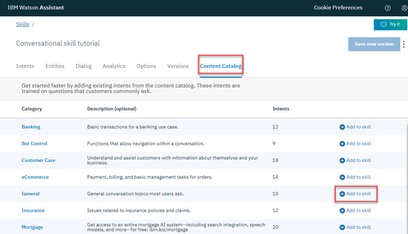

---

copyright:
  years: 2015, 2019
lastupdated: "2019-08-06"

keywords: assistant, omnichannel, virtual agent, virtual assistant, chatbot, conversation, watson assistant, watson conversation

subcollection: assistant

---

{:shortdesc: .shortdesc}
{:new_window: target="_blank"}
{:deprecated: .deprecated}
{:important: .important}
{:note: .note}
{:deprecated: .deprecated}
{:important: .important}
{:note: .note}
{:tip: .tip}
{:pre: .pre}
{:codeblock: .codeblock}
{:screen: .screen}
{:javascript: .ph data-hd-programlang='javascript'}
{:java: .ph data-hd-programlang='java'}
{:python: .ph data-hd-programlang='python'}
{:swift: .ph data-hd-programlang='swift'}
{:hide-dashboard: .hide-dashboard}
{:download: .download}
{:gif: data-image-type='gif'}

# {{site.data.keyword.conversationshort}} 시작하기
{: #getting-started}

이 짧은 튜토리얼에서는 {{site.data.keyword.conversationfull}}를 소개하고 첫 번째 어시스턴트를 작성하는 프로세스를 살펴봅니다.
{: shortdesc}

## 시작하기 전에
{: #getting-started-prerequisites}
{: hide-dashboard}

시작하려면 서비스 인스턴스가 필요합니다.
{: hide-dashboard}

1.  {: hide-dashboard}{{site.data.keyword.cloud}} 카탈로그에서 [{{site.data.keyword.conversationshort}} ](https://cloud.ibm.com/catalog/services/watson-assistant) 페이지로 이동하십시오.

    다른 리소스 그룹을 선택하지 않으면 서비스 인스턴스가 **기본** 리소스 그룹에 작성되며 나중에 이를 변경할 수 *없습니다*. 이 그룹은 제품을 시험 사용하기 위한 용도로 충분합니다.

    보다 강력한 사용을 위한 인스턴스를 작성 중인 경우 [리소스 그룹 ](https://{DomainName}/docs/resources/bestpractice_rgs#bp_resourcegroups){: new_window}에 대해 자세히 알아보십시오.
1.  {: hide-dashboard}무료 {{site.data.keyword.cloud_notm}} 계정에 가입하거나 로그인하십시오.
1.  {: hide-dashboard}**작성**을 클릭하십시오.

## 1단계: Watson Assistant 열기
{: #getting-started-launch-tool}

{{site.data.keyword.conversationshort}} 서비스 인스턴스를 작성하면 {{site.data.keyword.conversationshort}} 대시보드의 **관리** 페이지로 이동합니다.
{: hide-dashboard}

1.  **{{site.data.keyword.conversationshort}} 실행**을 클릭하십시오. 로그인하라는 프롬프트가 표시되면 {{site.data.keyword.cloud_notm}} 인증 정보를 제공하십오.

<!-- Remove this text after dedicated instances have the developer console: begin -->

{{site.data.keyword.Bluemix_dedicated_notm}}: 대시보드에서 서비스 인스턴스를 선택하여 제품을 실행하십시오.

<!-- Remove this text after dedicated instances have the Developer Console: end -->

새 사용자인 경우, *My first assistant*라는 어시스턴트가 자동으로 작성됩니다. 다음 단계를 건너뛰십시오. 

사용자의 위치에서 사용 가능한 경우, 제품에 대해 알 수 있도록 단계별로 안내하는 둘러보기가 시작됩니다. 둘러보기를 진행하십시오. 이 학습서 단계와 화면이 겹치므로 둘러보기가 종료된 후에 이 학습서를 다시 시작할 수 있습니다. {: tip}

[*어시스턴트*](/docs/services/assistant?topic=assistant-assistants)는 유용한 방법으로 고객과 상호작용할 수 있도록 하는 스킬을 추가하는 코그너티브 봇입니다.

어시스턴트가 자동으로 작성되지 않은 경우에는 1단계로 어시스턴트를 작성하십시오. 

## 2단계: 어시스턴트 작성
{: #getting-started-create-assistant}

1.  **어시스턴트 작성**을 클릭하십시오.

    
1.  어시스턴트 이름을 `My first assistant`로 지정하십시오. 
1.  **어시스턴트 작성**을 클릭하십시오.

    

## 3단계: 대화 스킬 작성
{: #getting-started-add-skill}

*대화 스킬*은 어시스턴트가 고객과 진행할 수 있는 대화의 플로우를 정의하는 아티팩트의 컨테이너입니다.

1.  어시스턴트가 작성된 경우에는 *My first assistant* 타일을 클릭하여 어시스턴트를 여십시오. 

1.  **대화 스킬 추가**를 클릭하십시오.

    

1.  스킬의 이름을 `Conversational skill tutorial`로 지정하십시오.
1.  **선택사항**: 빌드하려는 대화에 영어 이외의 언어를 사용할 경우 목록에서 해당 언어를 선택하십시오.

    

1.  **대화 스킬 작성**을 클릭하십시오.

    

1.  방금 작성한 스킬을 클릭하여 여십시오.

인텐트 페이지로 이동합니다.

## 4단계: 컨텐츠 카탈로그에서 인텐트 추가
{: #getting-started-add-catalog}

컨텐츠 카탈로그에서 인텐트를 추가하여 IBM에서 빌드된 훈련 데이터를 스킬에 추가하십시오. 특히, 대화에서 사용자를 환영하고 사용자와의 대화를 종료할 수 있도록 어시스턴트에 **일반** 컨텐츠 카탈로그에 대한 액세스 권한을 부여합니다.

1.  **컨텐츠 카탈로그** 탭을 클릭하십시오.
1.  목록에서 **일반**을 찾은 다음 **스킬에 추가**를 클릭하십시오.

    
1.  **인텐트** 탭을 열어 훈련 데이터에 추가된 인텐트 및 관련 예제 발화(utterance)를 검토하십시오. 각 인텐트 이름은 접두부 `#General_`로 시작하므로 이를 인식할 수 있습니다. 다음 단계에서 `#General_Greetings` 및 `#General_Ending` 인텐트를 대화에 추가합니다.

    

{{site.data.keyword.IBM_notm}}에서 사전 빌드된 컨텐츠를 추가하여 훈련 데이터를 빌드하기 시작했습니다.

## 5단계: 대화 빌드
{: #getting-started-build-dialog}

[대화](/docs/services/assistant?topic=assistant-dialog-overview)는 로직 트리 양식으로 대화의 플로우를 정의합니다. 대화는 인텐트(사용자가 말하는 내용)를 응답(봇이 답변하는 내용)에 일치시킵니다. 트리의 각 노드에는 사용자 입력에 따라 트리거하는 조건이 있습니다.

각각 단일 노드를 사용하는 인사 및 종료 인텐트를 처리하는 단순 대화를 작성합니다.

### 시작 노드 추가

1.  **대화** 탭을 클릭합니다.
1.  **대화 작성**을 클릭하십시오. 다음과 같은 두 개의 노드가 표시됩니다.
    - **Welcome**: 처음 어시스턴트를 사용할 때 사용자에게 표시되는 인사말을 포함합니다.
    - **Anything else**: 입력이 인식되지 않을 때 사용자에게 응답하는 데 사용되는 구가 포함됩니다.

    
1.  **Welcome** 노드를 클릭하여 편집 보기에서 여십시오.
1.  기본 응답을 `Welcome to the Watson Assistant tutorial!`이라는 텍스트로 대체하십시오.

    
1.  를 클릭하여 편집 보기를 닫습니다.

`welcome` 노드에서 트리거되는 대화 노드를 작성했습니다. (`welcome`은 인텐트와 같이 작동하는 특수 조건이지만 `#`으로 시작하지 않습니다.) 이 노드는 새 대화가 시작될 때 트리거됩니다. 노드는 새 대화가 시작될 때 시스템에서 이 첫 번째 노드의 응답 섹션에 추가한 환영 메시지로 응답해야 하도록 지정합니다.

### 시작 노드 테스트

언제든 대화를 테스트하여 대화를 확인할 수 있습니다. 이제 상자를 테스트합니다.

-  아이콘을 클릭하여 "시험 사용" 분할창을 여십시오. 환영 메시지가 표시됩니다.

### 노드를 추가하여 인텐트 처리

이제 `Welcome` 노드와 `Anything else` 노드 간에 인텐트를 처리하는 노드를 추가합니다.

1.  **Welcome** 노드에서 추가 아이콘 을 클릭한 다음 **아래에 노드 추가**를 선택하십시오.
1.  이 노드의 **If assistant recognizes** 필드에 `#General_Greetings`를 입력을 시작하십시오. 그런 다음 **`#General_Greetings`** 옵션을 선택하십시오.
1.  응답 텍스트 `Good day to you!`를 추가하십시오.
1.  를 클릭하여 편집 보기를 닫습니다.

   

1.  이 노드에서 추가 아이콘()을 클릭한 다음 **아래에 노드 추가**를 선택하여 피어 노드를 작성하십시오. 피어 노드에서 **If assistant recognizes** 필드에 `#General_Ending`을 지정하고 `OK. See you later.`를 응답 텍스트로 지정하십시오.

   

1.  를 클릭하여 편집 보기를 닫습니다.

### 인텐트 인식 테스트

인사 및 종료 입력 모두를 인식하고 이에 응답하는 단순 대화를 빌드했습니다. 작동 방식을 확인합니다.

1.   아이콘을 클릭하여 "시험 사용" 분할창을 여십시오. 환영 메시지가 있습니다.
1.  분할창의 맨 아래에 `Hello`를 입력하고 Enter를 누르십시오. 출력은 `#General_Greetings` 인텐트가 인식되었음을 나타내며 적절한 응답(`Good day to you.`)이 표시됩니다.
1.  다음 입력을 시도하십시오.
    - `bye`
    - `howdy`
    - `see ya`
    - `good morning`
    - `sayonara`

{: gif}

{{site.data.keyword.watson}}은 입력이 포함된 예제와 정확히 일치하지 않는 경우에도 인텐트를 인식할 수 있습니다. 대화는 인텐트를 사용하여 사용된 정확한 표현과 관계없이 사용자 입력의 목적을 식별한 다음, 지정된 방식으로 응답합니다.

### 대화 빌드 결과

완료되었습니다. 두 개의 인텐트와 이를 인식하는 대화가 포함된 단순 대화를 작성했습니다.

## 6단계: 어시스턴트 통합
{: #getting-started-integrate-assistant}

이제 단순 대화 교환에 참여할 수 있는 어시스턴트가 있으므로 이를 테스트하십시오.

1.  **어시스턴트** 탭을 클릭하고 *My first assistant* 어시스턴트를 찾아 여십시오.
1.  다음 중 하나를 수행하여 미리보기 링크 통합으로 어시스턴트를 테스트하십시오. 

    미리보기 링크 통합은 어시스턴트를 IBM 브랜드 웹 페이지에서 호스팅되는 대화 위젯에 빌드합니다. 웹 페이지를 열고 어시스턴트와 대화하여 사용해 볼 수 있습니다.

    - 어시스턴트가 작성되었으면 미리보기 링크 통합을 추가해야 합니다. *통합* 영역에서 **통합 추가**를 클릭한 후 **미리보기 링크**를 클릭하십시오. **작성**을 클릭하십시오.

    - 어시스턴트를 직접 작성한 경우, 미리보기 링크 통합 타일을 클릭하여 여십시오. 
    
      사용자를 직접 어시스턴트를 작성하면 자동으로 미리보기 링크 통합이 생성됩니다. 

1.  페이지에 표시된 URL을 클릭합니다.

    테스트 웹 페이지가 새 탭에서 열립니다.
1.  텍스트 필드에 `hello`를 입력하고 어시스턴트가 응답하는 것을 지켜보십시오.  

    

    어시스턴트를 사용해 보려는 다른 사용자와 URL을 공유할 수 있습니다.

1.  테스트 후, 웹 페이지를 닫으십시오. **X**를 클릭하여 미리보기 링크 통합 페이지를 닫으십시오.

## 다음 단계
{: #getting-started-next-steps}

이 튜토리얼은 단순 예제를 중심으로 빌드되었습니다. 실제 애플리케이션의 경우 일부 관심 있는 인텐트, 몇 가지 엔티티 및 이를 모두 사용하는 복잡한 대화를 정의해야 합니다. 정교한 버전의 어시스턴트가 있으면 고객이 사용하는 채널(예: Slack)과 통합할 수 있습니다. 어시스턴트와 고객 사이의 트래픽이 증가함에 따라 **분석** 탭에서 제공되는 도구를 사용하여 실제 대화를 분석하고 개선 영역을 식별할 수 있습니다.

- 고급 대화를 빌드하는 후속 튜토리얼을 완료하십시오.
    - [복잡한 대화 빌드](/docs/services/assistant?topic=assistant-tutorial) 튜토리얼을 통해 표준 노드를 추가하십시오.
    - [슬롯이 있는 노드 추가](/docs/services/assistant?topic=assistant-tutorial-slots) 튜토리얼을 통해 슬롯에 대해 학습하십시오.
- 아이디어를 얻으려면 추가 [샘플 앱](/docs/services/assistant?topic=assistant-sample-apps)을 살펴보십시오.
