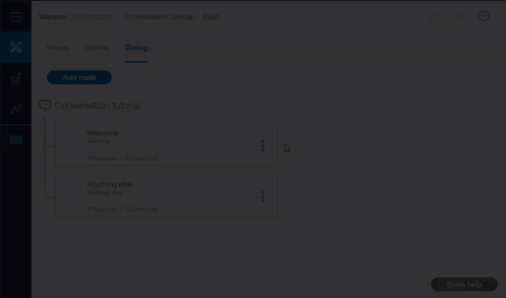

---

copyright:
  years: 2015, 2018
lastupdated: "2018-02-16"

---

{:shortdesc: .shortdesc}
{:new_window: target="_blank"}
{:tip: .tip}
{:pre: .pre}
{:codeblock: .codeblock}
{:screen: .screen}
{:javascript: .ph data-hd-programlang='javascript'}
{:java: .ph data-hd-programlang='java'}
{:python: .ph data-hd-programlang='python'}
{:swift: .ph data-hd-programlang='swift'}
{:download: .download}

# 튜토리얼 시작하기
{: #getting-started}

이 짧은 튜토리얼에서 {{site.data.keyword.conversationshort}} 도구를 소개하고 첫 번째 대화 작성 프로세스를 살펴봅니다.
{: shortdesc}

## 시작하기 전에
{: #prerequisites}

시작하려면 서비스 인스턴스가 필요합니다.

<!-- Remove the text marked `download` after there's no g-s tab in the catalog dashboard -->

서비스 인스턴스를 작성했습니다. **관리**를 클릭한 다음 **도구 실행**을 클릭하십시오. 2 단계로 이동하십시오.
{: download tip}

{{site.data.keyword.conversationshort}} 서비스로 프로젝트를 작성한 경우 이러한 모든 필수 조건이 설정됩니다. 1 단계로 이동하십시오.

1.  {{site.data.keyword.watson}} Developer Console [Services ](https://console.{DomainName}/developer/watson/services){: new_window} 페이지로 이동하십시오. 
1.  {{site.data.keyword.conversationshort}}를 선택하고 **서비스 추가**를 클릭한 다음 무료 {{site.data.keyword.Bluemix_notm}} 계정에 등록하거나 로그인하십시오. 
1.  프로젝트 이름을 `conversation-tutorial`로 변경한 다음 **프로젝트 작성**을 클릭하십시오.

<!-- Remove this text after dedicated instances have the developer console: begin -->

{{site.data.keyword.Bluemix_dedicated_notm}}를 사용하는 경우, 카탈로그의 [{{site.data.keyword.conversationshort}} ](https://console.{DomainName}/catalog/services/conversation/){: new_window} 페이지에서 서비스 인스턴스를 작성하십시오. 

<!-- Remove this text after dedicated instances have the developer console: end -->

## 1단계: 도구 실행
{: #launch-tool}

{{site.data.keyword.conversationshort}} 서비스를 포함하는 프로젝트를 작성한 후 프로젝트 세부사항 페이지로 이동합니다. 여기에서 {{site.data.keyword.conversationshort}} 도구를 실행하십시오.

**서비스** 아래에서 {{site.data.keyword.conversationshort}}에 대한 **도구 실행**을 클릭하십시오.

<!-- To do: Add screenshot for developer console -->

도구에 로그인하라는 메시지가 표시되면, {{site.data.keyword.Bluemix_notm}} 신임 정보를 제공하십시오.

{{site.data.keyword.conversationshort}} 서비스의 프로젝트 세부사항 페이지가 아닌 경우, {{site.data.keyword.watson}} Developer Console [Projects ](https://console.{DomainName}/developer/watson/projects) 페이지로 이동한 후 프로젝트를 선택하십시오.
{: tip}

<!-- Remove this text after dedicated instances have the developer console: begin -->

{{site.data.keyword.Bluemix_dedicated_notm}}: 대시보드에서 서비스 인스턴스를 선택하여 도구를 실행하십시오.

<!-- Remove this text after dedicated instances have the Developer Console: end -->

## 2단계: 작업공간 작성
{: #create-workspace}

{{site.data.keyword.conversationshort}} 도구의 첫 번째 단계는 작업공간을 작성하는 것입니다.

[*작업공간*](configure-workspace.html)은 대화 플로우를 정의하는 아티팩트의 컨테이너입니다.

1.  {{site.data.keyword.conversationshort}} 도구에서 **작성**을 클릭하십시오.
1.  작업영역 이름을 `{{site.data.keyword.conversationshort}} tutorial`로 지정하십시오. 빌드하려는 대화 상자에 영어 이외의 언어를 사용할 경우 목록에서 해당 언어를 선택하십시오.**작성**을 클릭하십시오. 새 작업공간의 **인텐트** 탭에서 시작합니다.

## 3단계: 인텐트 작성
{: #create-intents}

[인텐트](intents.html)는 사용자 입력의 목적을 나타냅니다. 인텐트를 사용자가 애플리케이션에서 수행할 수 있는 조치로 간주할 수 있습니다.

이 예제에서는 단순하게 두 개의 인텐트(환영 인사에 대한 인텐트와 작별 인사에 대한 인텐트)만 정의합니다.

1.  현재 인텐트 탭에 있는지 확인하십시오. (작업공간을 막 작성한 경우 이미 이 탭에 있습니다.)
1.  **인텐트 추가**를 클릭하십시오.
1.  인텐트의 이름을 `hello`로 지정한 다음 **인텐트 작성**을 클릭하십시오.
1.  **사용자 예제 추가** 필드에 `hello`를 입력한 다음 **Enter**를 누르십시오.

   *예제*는 {{site.data.keyword.conversationshort}} 서비스에 인텐트와 일치시킬 사용자 입력 유형을 알립니다. 제공하는 예제가 많을수록 서비스가 사용자 인텐트를 더 정확하게 인식할 수 있습니다.
1.  4 개의 예제를 추가하십시오.
    - `good morning`
    - `greetings`
    - `hi`
    - `howdy`

1.  #hello 인텐트 작성을 완료하려면, **닫기**  아이콘을 클릭하십시오.
1.  다음 다섯 가지 예제를 사용하여 또 다른 인텐트 #goodbye를 작성하십시오.
    - `bye`
    - `farewell`
    - `goodbye`
    - `I'm done`
    - `see you later`

두 개의 인텐트 #hello와 #goodbye를 작성했고 사용자 입력 예제를 제공하여 사용자 입력에서 이러한 인텐트를 인식하도록 {{site.data.keyword.watson}}을 훈련했습니다.

## 4 단계: 카탈로그에서 인텐트 추가
{: #add-catalog}

카탈로그에서 인텐트를 추가하여 IBM에서 작성한 훈련 데이터를 작업공간에 추가하십시오. 특히, 귀하의 비서가 `Business Information` 카탈로그에 액세스할 수 있도록 하여 대화 상자에서 회사 연락처 정보에 대한 사용자 요청을 처리할 수 있습니다. 

1.  {{site.data.keyword.conversationshort}} 도구에서, **카탈로그** 탭을 클릭하십시오.
1.  목록에서 **비즈니스 정보**를 찾은 다음 **봇에 추가**를 클릭하십시오.
1.  **인텐트** 탭을 열어 훈련 데이터에 추가된 인텐트 및 관련 예제 표현을 검토하십시오. 각 인텐트 이름의 접두부가 `#Business_Information_`으로 시작하므로 식별할 수 있습니다. 나중 단계에서 대화 상자에 `#Business_Information_Contact_Us` 인텐트를 추가할 것 입니다.

IBM에서 제공하는 사전 제작된 컨텐츠로 훈련 데이터를 보완했습니다.

## 5 단계: 대화 상자 빌드
{: #build-dialog}

[대화 상자](dialog-build.html)는 로직 트리 양식으로 대화의 플로우를 정의합니다. 트리의 각 노드에는 사용자 입력에 따라 트리거하는 조건이 있습니다.

각각 단일 노드를 사용하는 #hello와 #goodbye 인텐트를 처리하는 단순 대화 상자를 작성합니다.

### 시작 노드 추가

1.  {{site.data.keyword.conversationshort}} 도구에서 **대화 상자** 탭을 클릭하십시오.
1.  **작성**을 클릭하십시오. 다음 두 가지 노드가 표시됩니다.
    - **Welcome**: 처음 봇을 사용할 때 사용자에게 표시되는 인사가 포함됩니다.
    - **Anything else**: 입력이 인식되지 않을 때 사용자에게 응답하는 데 사용되는 구가 포함됩니다.

    
1.  **Welcome** 노드를 클릭하여 편집 보기에서 여십시오.
1.  기본 응답을 `Welcome to the {{site.data.keyword.conversationshort}} tutorial!`로 대체하십시오.

    
1.  를 클릭하여 편집 보기를 닫으십시오.

`welcome` 조건으로 트리거하는 대화 상자 노드를 작성했으며, 이 조건은 사용자가 새 대화를 시작했음을 표시하는 특수 조건입니다. 노드는 새 대화가 시작될 때 시스템이 환영 메시지로 응답하도록 지정합니다.

### 시작 노드 테스트

언제든 대화 상자를 테스트하여 대화 상자를 확인할 수 있습니다. 이제 상자를 테스트합니다.

-  아이콘을 클릭하여 "연습" 분할창을 여십시오. 환영 메시지가 표시됩니다.

    

### 노드를 추가하여 인텐트 처리

이제 노드를 추가하여 `Welcome` 노드와 `Anything else` 노드 간 인텐트를 처리합니다.

1.  **Welcome** 노드에서 추가 아이콘 을 클릭한 다음 **아래에 노드 추가**를 선택하십시오.
1.  이 노드의 **조건 입력** 필드에 `#hello`를 입력하십시오. 그런 다음 **#hello** 옵션을 선택하십시오.
1.  응답 `Good day to you.`를 추가하십시오.
1.  를 클릭하여 편집 보기를 닫으십시오.

   
1.  이 노드에서 추가 아이콘()을 클릭한 다음 **아래에 노드 추가**를 선택하여 피어 노드를 작성하십시오. 피어 노드에서, 조건으로 `#Business_Information_Contact_Us`를 지정하십시오. 
1.  다음 텍스트를 응답으로 추가하십시오.

    `Call us at 800-426-4968 or give us your feedback at https://www.ibm.com/scripts/contact/contact/us/en.`
1.  이 노드에서 추가 아이콘 을 클릭하고 다음 피어 노드를 작성하려면 **아래에 노드 추가**를 선택하십시오. 피어 노드에서 `#goodbye`를 조건으로 지정하고 `OK. See you later!`를 응답으로 지정하십시오.

### 인텐트 인식 테스트

hello와 goodbye 입력 둘 다 인식하고 이에 응답하는 단순 대화 상자를 빌드했습니다. 작동 방식을 확인합니다.

1.   아이콘을 클릭하여 "연습" 분할창을 여십시오. 환영 메시지가 있습니다.
1.  분할창의 맨 아래에 `Hello`를 입력하고 Enter를 누르십시오. 출력은 #hello 인텐트가 인식되었음을 표시하며 적절한 응답(`Good day to you.`)이 나타납니다.
1.  다음 입력을 시도하십시오.
    - `bye`
    - `howdy`
    - `see ya`
    - `good morning`
    - `sayonara`

   
1.  `Who can I call if I have questions?`를 입력한 다음 Enter를 누르십시오. 출력은 `#Business_Information_Contact_Us` 인텐트가 인식되었음을 표시하며 추가된 응답이 표시됩니다.

{{site.data.keyword.watson}}은 포함된 예제와 입력이 정확하게 일치하지 않는 경우에도 인텐트를 인식할 수 있습니다. 대화 상자는 인텐트를 사용하여 사용된 정확한 표현과 관계없이 사용자 입력의 목적을 식별한 다음, 지정된 방식으로 응답합니다.

### 대화 상자 빌드 결과

완료되었습니다. 두 개의 인텐트와 이를 인식하는 대화 상자가 포함된 단순 대화를 작성했습니다.

## 6 단계: 샘플 작업공간 검토
{: #review-sample-workspace}

샘플 작업공간을 열어 작성한 인텐트와 유사한 인텐트 및 더 많은 인텐트를 확인하고 복잡한 대화 상자에서 이러한 인텐트를 사용하는 방법을 확인하십시오.

1.  작업공간 페이지로 돌아가십시오.
   탐색 메뉴에서  단추를 클릭할 수 있습니다.
1.  **자동차 대시보드 - 샘플** 작업공간 타일에서 **샘플 편집** 단추를 클릭하십시오.

    

## 다음 단계
{: #next-steps}

이 튜토리얼은 단순 예제를 중심으로 빌드되었습니다. 실제 애플리케이션의 경우 관심 있는 인텐트, 몇 가지 엔티티 및 복잡한 대화 상자를 정의해야 합니다.

- 고급 [튜토리얼](tutorial.html)을 시도하여 엔티티를 추가하고 사용자의 목적을 분명하게 하십시오.
- 프론트 엔드 사용자 인터페이스, 소셜 미디어 또는 메시징 채널에 연결하여 작업공간을 [배치](deploy.html)하십시오.
- [샘플 앱](sample-applications.html)을 체크아웃하십시오.
