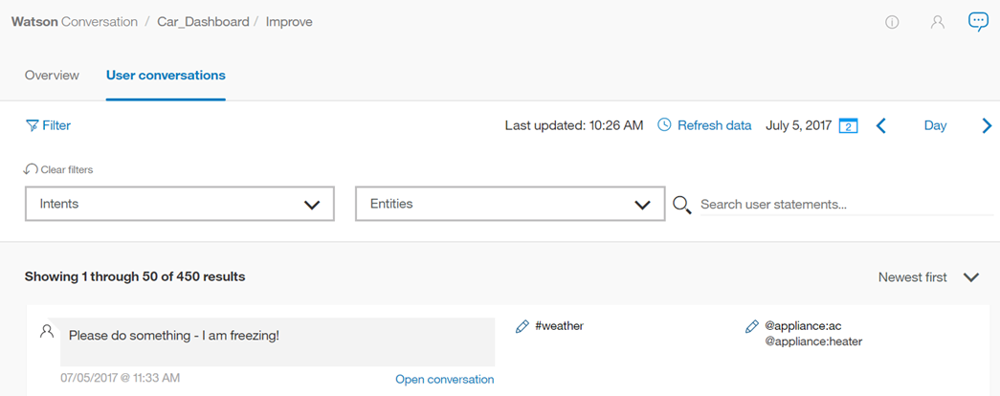
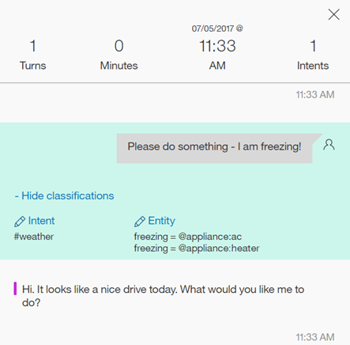
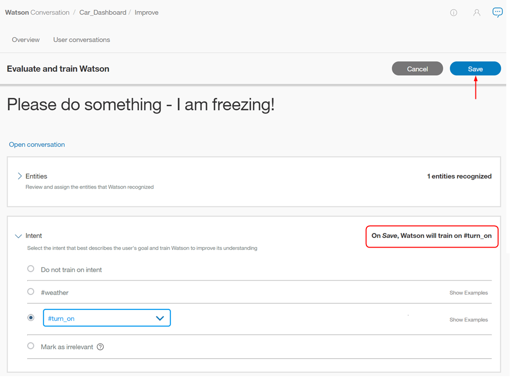

---

copyright:
  years: 2015, 2018
lastupdated: "2018-02-13"

---

{:shortdesc: .shortdesc}
{:new_window: target="_blank"}
{:tip: .tip}
{:pre: .pre}
{:codeblock: .codeblock}
{:screen: .screen}
{:javascript: .ph data-hd-programlang='javascript'}
{:java: .ph data-hd-programlang='java'}
{:python: .ph data-hd-programlang='python'}
{:swift: .ph data-hd-programlang='swift'}

# 대화에 대한 작업
{: #logs_convo}

사용자와 작업공간 간의 상호작용 목록을 열려면 탐색줄에서 **사용자 대화**를 선택하십시오. **사용자 대화**가 표시되지 않으면  메뉴를 사용하여 페이지를 여십시오.
{: shortdesc}

**사용자 대화** 페이지를 열면 기본 보기에 마지막 날의 결과가 나열되며, 최근 결과가 먼저 표시됩니다. 메시지에 사용되는 상위 인텐트(#intent)와 인식되는 모든 엔티티(@entity) 값 및 메시지 텍스트가 사용 가능합니다. 인식되지 않는 인텐트의 경우 표시되는 값은 *관련 없음*입니다. 엔티티가 인식되지 않거나 제공되지 않은 경우 표시되는 값은 *엔티티를 찾을 수 없음*입니다.

**사용자 대화** 페이지에 사용자와 작업공간 간의 총 *표현* 수를 표시하는 것은 중요합니다. 표현은 사용자가 대화 상자로 보내는 단일 메시지입니다. 각 대화는 여러 표현으로 구성될 수 있습니다. 따라서 이 **사용자 대화** 페이지의 결과 수는 [개요](logs_oview.html) 페이지에 표시된 대화 수와 다릅니다.

## 로그 한계
{: #log-limits}

메시지를 보유하는 시간은 {{site.data.keyword.conversationshort}} 서비스 플랜에 따라 다릅니다.

  서비스 플랜                         | 대화 메시지 보유
  ------------------------------------ | ------------------------------------
  프리미엄                              | 지난 90일
  표준                             | 지난 30일
  라이트                                 | 지난 7일

## 데이터 소스 선택
{: #select-source}

기본적으로 **사용자 대화** 페이지는 현재 작업공간에 대한 표현 데이터를 표시합니다. 그러나 인스턴스 내의 다른 작업공간으로 전송된 표현이 있는 작업공간을 개선하는 것이 유용한 경우가 있습니다. 예를 들어, 여러 버전의 프로덕션 작업공간 및 개발 작업공간이 있는 경우, 동일한 표현 데이터를 사용하여 이 작업공간을 향상시킬 수 있습니다. 

다른 데이터 소스로 전환하면, {{site.data.keyword.conversationshort}} 서비스는 `Deployment ID`라고 부르는 요소에 대한 표현을 검사합니다. 배치 ID는 메시지 API 호출에 추가하는 {{site.data.keyword.conversationshort}} 서비스 API의 고유 식별자입니다. 메시지 호출에 배치 ID 추가에 관한 정보는 [작업공간에서 개선](logs.html#deploy_id)을 참조하십시오.

지정된 배치 ID로 표현을 사용하여 섹션을 개선하려면 다음을 수행하십시오.

1.  **데이터 소스:** 선택 
1.  배치 선택 
1.  **데이터 보기** 클릭

선택된 데이터 소스가 이제 표시됩니다.

**참고:****데이터소스:**가 이 작업공간을 개선하기 위해 사용하는 표현의 소스를 보여주지만, 페이지 상단에는 변경 사항을 적용하고 있는 작업공간이 여전히 표시됩니다.

이 예제에서는 개선 페이지는 메시지 API 호출에 배치 ID(`HelpDesk-Production`)가 포함된 표현으로 채워지지만 *테스트 입력*이라는 표현이 **#No** 인텐트에 추가되면 **저장**을 클릭한 다음 *테스트 입력*이 `HelpDesk-Development` 작업영역에 `#No`의 예제로서 추가됩니다.

## 표현 필터링

*사용자 문장 검색*, *인텐트*, *엔티티* 및 *지난* n*일*을 기준으로 표현을 필터링할 수 있습니다.

*사용자 문장 검색* - 검색줄에 단어를 입력하십시오. 이렇게 하면 사용자 입력이 검색되지만 작업공간의 응답은 검색되지 않습니다.

*인텐트* - 드롭 다운 메뉴를 선택하고 입력 필드에 인텐트를 입력하거나 채워진 목록에서 선택하십시오. 둘 이상의 인텐트를 선택할 수 있으며, 선택한 인텐트를 사용하여 결과를 필터링할 수 있습니다(*관련 없음* 포함).

*엔티티* - 드롭 다운 메뉴를 선택하고 입력 필드에 엔티티 이름을 입력하거나 채워진 목록에서 선택하십시오. 둘 이상의 엔티티를 선택할 수 있으며, 선택한 엔티티를 기준으로 결과를 필터링할 수 있습니다. 인텐트 *및* 엔티티를 기준으로 필터링하는 경우 결과에 두 값을 모두 가진 메시지가 포함됩니다. 또한 *엔티티를 찾을 수 없음*으로 결과를 필터링할 수 있습니다.

표현 업데이트에는 시간이 다소 걸릴 수 있습니다. 컨텐츠를 필터링하기 전에 작업공간과 사용자의 상호작용 후 30분이 지나야 합니다.

## 개별 표현 보기
각 표현 항목을 펼쳐 전체 대화에서 사용자가 말한 내용과 작업공간의 응답을 볼 수 있습니다. 이렇게 하려면 **대화 열기**를 선택하십시오. 해당 대화 내에서 선택한 표현으로 자동으로 이동합니다.

그런 다음 선택한 표현의 분류를 표시하도록 선택할 수 있습니다.

## 인텐트 정정

1.  인텐트를 정정하려면 선택한 #intent 옆에 있는  편집 아이콘을 선택하십시오.
1.  제공된 목록에서 이 입력에 대한 올바른 인텐트를 선택하십시오.
    - 입력 필드에 입력을 시작하면 인텐트 목록이 필터링됩니다.
    - 또한 이 메뉴에서 **관련 없음으로 표시**를 선택할 수 있습니다. (자세한 정보는 [관련 없음으로 표시](intents.html#mark-irrelevant)를 참조하십시오.) 또는 **인텐트에 대해 훈련하지 않음**을 선택할 수 있습니다. 이 경우 이 표현을 훈련의 예제로 저장하지 않습니다.

    
1.  **저장**을 선택하십시오.

    

    **참고**: {{site.data.keyword.conversationshort}} 서비스는 인텐트 *대로* 사용자 입력을 예제로 추가하는 것을 지원합니다. 인텐트 훈련 데이터에서 @entity 참조를 예제로 사용하고 저장하려는 사용자 표현 훈련 데이터의 엔티티 값 또는 동의어가 포함된 경우 나중에 해당 단어를 편집해야 합니다. 저장 후에, 인텐트 페이지에서 표현을 편집하여 참조할 엔터티를 대체합니다. 자세한 정보는 [@Entity를 인텐트 예제로 직접 참조](intents.html#entity-as-example)를 참조하십시오.

## 엔티티 값 또는 동의어 추가

1.  엔티티 값이나 동의어를 추가하려면 선택한 @entity 옆에 있는  편집 아이콘을 선택하십시오.
1.  **엔티티 추가**를 선택하십시오.

    
1.  이제 밑줄이 있는 사용자 입력에서 단어나 구를 선택하십시오.

    
1.  강조표시된 구를 값으로 추가할 엔티티를 선택하십시오.
    - 입력 필드에 입력을 시작하면 엔티티 및 값 목록이 필터링됩니다.
    - 기존 값에 대한 동의어로 강조표시된 구를 추가하려면 드롭 다운 목록에서 `@entity:value`를 선택하십시오.

    
1.  **저장**을 선택하십시오.

    
