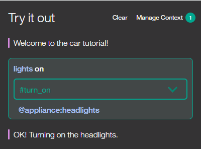
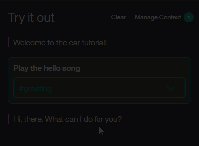

---

copyright:
  years: 2015, 2019
lastupdated: "2019-04-12"

subcollection: assistant

---

{:shortdesc: .shortdesc}
{:new_window: target="_blank"}
{:deprecated: .deprecated}
{:important: .important}
{:note: .note}
{:tip: .tip}
{:pre: .pre}
{:codeblock: .codeblock}
{:screen: .screen}
{:javascript: .ph data-hd-programlang='javascript'}
{:java: .ph data-hd-programlang='java'}
{:python: .ph data-hd-programlang='python'}
{:swift: .ph data-hd-programlang='swift'}
{:gif: data-image-type='gif'}

# 튜토리얼: 자동차 대시보드 대화 빌드
{: #tutorial-car-dashboard}

이 튜토리얼에서 {{site.data.keyword.conversationshort}} 서비스를 사용하여 사용자가 코그너티브 자동차 대시보드와 상호작용하는 데 도움이 되는 대화를 작성합니다.
{: shortdesc}

## 학습 목표
{: #car-dashboard-objectives}

튜토리얼을 완료할 때까지 다음을 수행하는 방법을 파악합니다.

- 엔티티 정의
- 대화 계획
- 대화에서 노드 및 응답 조건 사용

### 소요 시간
{: #tutorial-car-dashboard-duration}

이 튜토리얼을 완료하는 데 약 2 - 3시간이 걸립니다.

### 전제조건
{: #tutorial-car-dashboard-prereqs}

시작하기 전에 [시작하기 튜토리얼](/docs/services/assistant?topic=assistant-getting-started)을 완료하십시오.

사용자가 작성한 {{site.data.keyword.conversationshort}} 튜토리얼 스킬을 사용하고 시작하기 연습의 일부로 빌드된 단순 대화에 노드를 추가합니다.

## 1단계: 인텐트 및 예제 추가
{: #tutorial-car-dashboard-add-intents}

인텐트 탭에서 인텐트를 추가하십시오. 인텐트는 사용자 입력에 표현된 목적입니다.

1.  {{site.data.keyword.conversationshort}} 튜토리얼 스킬의 **인텐트** 페이지에서, **인텐트 추가**를 클릭하십시오.
1.  다음 인텐트 이름을 추가하고 **인텐트 작성**을 클릭하십시오.

    ```
    turn_on
    ```
    {: codeblock}

    `#`은 지정한 인텐트 이름 앞에 추가됩니다. `#turn_on` 인텐트는 사용자가 라디오, 와이퍼 또는 헤드라이트와 같은 어플라이언스를 켜려고 함을 표시합니다.
1.  **사용자 예제 추가** 필드에서, 다음 발화를 입력한 다음 **예제 추가**를 클릭하십시오.

    ```
    I need lights
    ```
    {: codeblock}

1.  5개가 넘는 다음 예제를 추가하여 Watson이 `#turn_on` 인텐트를 인식하도록 합니다.

    ```
    Play some tunes
    Turn on the radio
    turn on
    Air on please
    Crank up the AC
    Turn on the headlights
    ```
    {: codeblock}

1.  `#turn_on` 인텐트 추가를 완료하려면, **닫기** 아이콘을 클릭합니다.

이제 사용자는 방금 추가한 `#turn_on` 인텐트와 필수 단계로 완료한 *튜토리얼 시작하기*에 추가된 `#hello` 및 `#goodbye` 인텐트를 포함하여 3 개의 인텐트를 가지고 있습니다. 각 인텐트는 Watson이 사용자 입력의 인텐트를 인식하는데 도움이 되는 예제 발화(utterance) 세트를 가지고 있습니다.

## 2단계: 엔티티 추가
{: #tutorial-car-dashboard-add-entities}

엔티티 정의에는 여러 응답을 트리거하는 데 사용할 수 있는 엔티티 *값* 세트가 포함됩니다. 각 엔티티 값에는 여러 *동의어*가 포함될 수 있으며, 이러한 동의어는 동일한 값을 사용자 입력에 지정할 수 있는 여러 방법을 정의합니다.

#turn_on 인텐트가 있는 사용자 입력에서 발생할 수 있는 엔티티를 작성하여 사용자가 켜려는 대상을 나타내십시오.

1.  **엔티티** 탭을 클릭하여 엔티티 페이지를 여십시오.
1.  **엔티티 추가**를 클릭합니다.
1.  다음 엔티티 이름을 추가한 다음 Enter를 누르십시오.

    ```
    appliance
    ```
    {: codeblock}

    `@`는 지정한 엔티티 이름 앞에 추가됩니다. `@appliance` 엔티티는 사용자가 켜려는 자동차의 어플라이언스를 나타냅니다.
1.  다음 값을 **값 이름** 필드에 추가하십시오.

    ```
    radio
    ```
    {: codeblock}

    값은 사용자가 켜려는 특정 어플라이언스를 나타냅니다.
1.  **동의어** 필드에 라디오 어플라이언스 엔티티를 지정하는 다른 방법을 추가하십시오. **탭**을 눌러 필드에 초점을 맞춘 후 다음 동의어를 입력하십시오. 각 동의어 다음에 **Enter**를 누르십시오.

    ```
    music
    tunes
    ```
    {: codeblock}

1.  `@appliance` 엔티티에 대한 `radio` 값 정의를 완료하려면 **값 추가**를 클릭하십시오.
1.  어플라이언스의 기타 유형을 추가하십시오.

    - 값: `headlights`. 동의어: `lights`.
    - 값: `air conditioning`. 동의어: `air`와 `AC`.

1.  `@appliance` 엔티티에 대한 유사 일치를 **켜는** 토글을 클릭하십시오.
    이 설정을 사용하면 엔티티가 여기서 사용하는 구문과 정확하게 일치하지 않는 방식으로 지정된 경우에도 어시스턴트가 사용자 입력에서 엔티티에 대한 참조를 인식할 수 있습니다.
1.  `@appliance` 엔티티 추가를 완료하려면 **닫기** 아이콘을 클릭하십시오.
1.  2 - 8단계를 반복하여 유사 일치를 켠 상태의 `@genre` 엔티티 및 다음 값과 동의어를 작성하십시오.

    - 값: `classical`. 동의어: `symphonic`.
    - 값: `rhythm and blues`. 동의어: `r&b`.
    - 값: `rock`. 동의어: `rock & roll`, `rock and roll` 및 `pop`.

다음 두 개의 엔티티를 정의했습니다. `@appliance`(어시스턴트가 켤 수 있는 어플라이언스를 나타냄) 및 `@genre`(사용자가 청취하도록 선택할 수 있는 음악 장르를 나타냄).

사용자 입력이 수신되면 {{site.data.keyword.conversationshort}} 서비스가 인텐트와 엔티티를 둘 다 식별합니다. 이제 인텐트와 엔티티를 사용하여 올바른 응답을 선택하는 대화를 정의할 수 있습니다.

## 3단계: 복잡한 대화 작성
{: #tutorial-car-dashboard-complex-dialog}

이 복잡한 대화에서 이전에 정의한 #turn_on 인텐트를 처리하는 대화 분기를 작성합니다.

### #turn_on에 대한 루트 노드 추가
{: #tutorial-car-dashboard-add-turn-on}

#turn_on 인텐트에 응답하는 대화 분기를 작성하십시오. 루트 노드 작성을 시작하십시오.

1.  **#hello** 노드에 있는 추가 아이콘을 클릭한 다음 **아래 노드 추가**를 선택하십시오.
1.  조건 필드에 `#turn_on`을 입력하기 시작한 후 나타나는 목록에서 선택하십시오.
    이 조건은 #turn_on 인텐트와 일치하는 입력을 통해 트리거됩니다.
1.  이 노드에서 응답을 입력하지 마십시오. 노드 편집 보기를 닫으려면 를 클릭하십시오.

### 시나리오
{: #tutorial-car-dashboard-scenarios}

대화는 사용자가 켜려는 어플라이언스를 판별해야 합니다. 이를 처리하려면 추가 조건에 따라 여러 응답을 작성하십시오.

정의한 인텐트와 인텐트에 따라 세 가지 가능한 시나리오가 있습니다.

**시나리오 1**: 사용자가 음악을 틀기 원하며, 이 경우 어시스턴트가 장르를요청해야 합니다.

**시나리오 2**: 사용자가 다른 올바른 어플라이언스를 켜려고 하며, 이 경우 어시스턴트는 요청된 어플라이언스를 켜고 있다는 메시지에 이 어플라이언스의 이름을 반영합니다.

**시나리오 3**: 사용자가 인식 가능한 어플라이언스 이름을 지정하지 않으며, 이 경우 어시스턴트는 명확성을 요청해야 합니다.

대화가 먼저 가장 구체적인 조건을 평가하도록 이러한 시나리오 조건을 순서대로 검사하는 노드를 추가하십시오.

### 시나리오 1 처리
{: #tutorial-car-dashboard-address-scenario1}

사용자가 음악을 틀려고 한다는 시나리오 1을 처리하는 노드를 추가하십시오. 응답에서 어시스턴트는 음악 장르를 요청해야 합니다.

#### 어플라이언스 유형이 음악인지 여부를 검사하는 하위 노드 추가
{: #tutorial-car-dashboard-add-music-check}

1.  **#turn_on** 노드에서 추가 아이콘()을 클릭하고 **하위 노드 추가**를 선택하십시오.
1.  조건 필드에 `@appliance:radio`를 입력하십시오.
    엔티티 탭에 정의된 대로 @appliance 엔티티 값이 `radio`이거나 동의어 중 하나인 경우 이 조건은 true입니다.
1.  응답 필드에 `What kind of music would you like to hear?`를 입력하십시오.
1.  노드 이름을 `Music`으로 지정하십시오.
1.  노드 편집 보기를 닫으려면 를 클릭하십시오.

#### #turn_on 노드에서 Music 노드로 점프 추가
{: #tutorial-car-dashboard-add-jump-to-music}

더 이상 사용자 입력을 요청하지 않고 `#turn on` 노드에서 `Music` 노드로 직접 점프하십시오. 이렇게 하기 위해 **점프** 조치를 사용할 수 있습니다.

1.  **#turn_on** 노드에서 추가 아이콘()을 클릭하고 **점프**를 선택하십시오.
1.  **Music** 하위 노드를 선택한 다음 **If bot recognizes(조건)**를 선택하여 Music 노드의 조건을 처리하려고 함을 표시하십시오.


**점프** 조치를 추가하기 전에 대상 노드(점프할 노드)를 작성해야 했습니다.

점프 관계를 작성하면 트리에 새 항목이 표시됩니다.


#### 음악 장르를 검사하는 하위 노드 추가
{: #tutorial-car-dashboard-check-genre}

사용자가 요청하는 음악 유형을 처리하도록 노드를 추가하십시오.

1.  **Music** 노드에서 추가 아이콘()을 클릭하고 **하위 노드 추가**를 선택하십시오.
    이 하위 노드는 사용자가 들으려는 음악 유형에 대한 질문에 응답한 후에만 평가됩니다. 이 노드 전에 사용자 입력이 필요하므로 **점프** 조치를 사용할 필요가 없습니다.
1.  조건 필드에 `@genre`를 추가하십시오.  이 조건은 @genre 엔티티의 올바른 값이 발견될 때마다 true입니다.
1.  응답으로 `OK! Playing @genre.`를 입력하십시오. 이 응답은 사용자가 제공하는 장르 값을 반복합니다.

#### 사용자 응답에서 인식되지 않는 장르 유형을 처리하는 노드 추가
{: #tutorial-car-dashboard-catch-genre}

사용자가 @genre에 대해 인식되는 값을 지정하지 않을 때 응답할 노드를 추가하십시오.

1.  *@genre* 노드에서 추가 아이콘()을 클릭하여 **아래에 노드 추가**를 선택하여 피어 노드를 작성하십시오.
1.  조건 필드에 `true`를 입력하십시오.
    true 조건은 특수 조건입니다. 대화 플로우가 이 노드에 도달하는 경우 항상 true로 평가되도록 지정합니다. (사용자가 올바른 @genre 값을 지정하면 이 노드에 결코 도달하지 않습니다.)
1.  `I'm sorry, I don't understand. I can play classical, rhythm and blues, or rock music.`을 응답으로 입력하십시오.

사용자가 음악을 틀도록 요청하는 모든 경우를 처리합니다.

#### 음악을 위한 대화 테스트
{: #tutorial-car-dashboard-test-music}

1.   아이콘을 선택하여 대화 분할창을 여십시오.
1.  `Play music`을 입력하십시오.
    어시스턴트는 #turn_on 인텐트와 @appliance:music 엔티티를 인식하고 음악 장르에 대해 질문하여 응답합니다.

1.  올바른 @genre 값(예: `rock`)을 입력하십시오.
    어시스턴트는 @genre 엔티티를 인식하고 적절하게 응답합니다.

    

1.  `Play music`을 다시 입력하지만 이번에는 장르에 대한 올바르지 않은 응답이 지정됩니다. 어시스턴트는 이해하지 못한다고 응답합니다.

### 시나리오 2 처리
{: #tutorial-car-dashboard-address-scenario2}

사용자가 다른 올바른 어플라이언스를 켜려고 한다는 시나리오 2를 처리하는 노드를 추가합니다. 이 경우 어시스턴트는 요청된 어플라이언스를 켜고 있다는 메시지에 이 어플라이언스의 이름을 반영합니다.

#### 어플라이언스를 검사하는 하위 노드 추가
{: #tutorial-car-dashboard-check-applicance}

사용자가 다른 올바른 @appliance 값만 제공하는 경우에 트리거되는 노드를 추가하십시오.
다른 @appliance 값의 경우 어시스턴트가 추가 입력을 요청할 필요가 없습니다. 단지 긍정 응답을 리턴합니다.

1.  **Music** 노드에서 추가 아이콘()을 클릭한 다음 **아래에 노드 추가**를 선택하여 @appliance:music 조건이 평가된 후 평가되는 피어 노드를 작성하십시오.
1.  `@appliance`를 노드 조건으로 입력하십시오.
    사용자 입력에 음악 외에 @appliance 엔티티에 대해 인식되는 값이 포함되면 이 조건이 트리거됩니다.
1.  `OK! Turning on the @appliance.`를 응답으로 입력하십시오.
    이 응답은 사용자가 제공한 어플라이언스 값을 반복합니다.

#### 다른 어플라이언스를 사용하여 대화 테스트
{: #tutorial-car-dashboard-test-other-appliances}

1.   아이콘을 선택하여 대화 분할창을 여십시오.
1.  `lights on`을 입력하십시오.

    어시스턴트는 #turn_on 인텐트와 @appliance:headlights 엔티티를 인식하고 `OK, turning on the headlights`로 응답합니다.

    

1.  `turn on the air`를 입력하십시오.

    어시스턴트는 #turn_on 인텐트와 @appliance:(air conditioning) 엔티티를 인식하고 `OK, turning on the air conditioning.`으로 응답합니다.

1.  정의한 예제 발화와 엔티티 동의어에 따라 지원되는 모든 명령에 대한 변형을 시도하십시오.

### 시나리오 3 처리
{: #tutorial-car-dashboard-address-scenario3}

이제 사용자가 올바른 어플라이언스 유형을 지정하지 않는 경우 트리거되는 피어 노드를 추가하십시오.

1.  **@appliance** 노드에서 추가 아이콘()을 클릭한 다음 **아래에 노드 추가**를 선택하여 @appliance 조건이 평가된 후 평가되는 피어 노드를 작성하십시오.
1.  조건 필드에 `true`를 입력하십시오.
    (사용자가 올바른 @appliance 값을 지정하면 이 노드에 결코 도달하지 않습니다.)
1.  `I'm sorry, I'm not sure I understood you. I can turn on music, headlights, or air conditioning.`을 응답으로 입력하십시오.

#### 추가 테스트
{: #tutorial-car-dashboard-test-more}

1.  추가 발화 변형을 시도하여 대화를 테스트하십시오.

    어시스턴트가 올바른 인텐트 인식에 실패하면 대화 창에서 직접 이 봇을 재훈련할 수 있습니다. 올바르지 않은 인텐트 옆에 있는 화살표를 선택하고 목록에서 올바른 인텐트를 선택하십시오.

    {: gif}

선택적으로, **고객 서비스 - 샘플** 스킬을 검토하여 더 긴 대화 및 추가 기능을 사용하여 이 동일한 유스 케이스를 더욱 자세히 볼 수 있습니다.

1.  탐색 메뉴에서 **스킬로 돌아가기** 단추()를 클릭하십시오.

1.  **샘플 추가**를 클릭하십시오.

    샘플 스킬이 스킬 목록에 추가됩니다. 이는 모든 어시스턴트와 연관되어 있지 않습니다.

## 다음 단계
{: #tutorial-car-dashboard-deploy}

이제 대화 스킬을 빌드하고 테스트했으므로 고객과 공유할 수 있습니다. 먼저 어시스턴트에 스킬을 연결하여 배치한 다음, 어시스턴트를 배치하십시오. 이를 수행할 수 있는 다양한 방법이 있습니다. 자세한 내용은 [통합 추가](/docs/services/assistant?topic=assistant-deploy-integration-add)를 참조하십시오.

[GitHub](https://github.com/watson-developer-cloud/car-dashboard)에서 전체 자동차 대시보드 샘플 애플리케이션의 소스 코드에 액세스할 수 있습니다.
