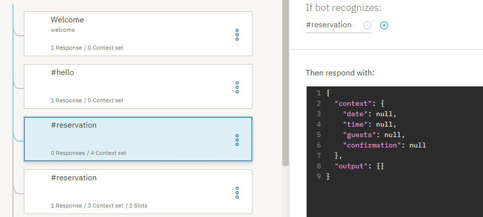

---

copyright:
  years: 2015, 2019
lastupdated: "2019-08-12"

subcollection: assistant

---

{:shortdesc: .shortdesc}
{:new_window: target="_blank"}
{:deprecated: .deprecated}
{:important: .important}
{:note: .note}
{:tip: .tip}
{:pre: .pre}
{:codeblock: .codeblock}
{:screen: .screen}
{:javascript: .ph data-hd-programlang='javascript'}
{:java: .ph data-hd-programlang='java'}
{:python: .ph data-hd-programlang='python'}
{:swift: .ph data-hd-programlang='swift'}

# 튜토리얼: 슬롯이 있는 노드 향상
{: #tutorial-slots-complex}

이 튜토리얼에서는 식당 예약을 작성하는 데 필요한 정보를 수집하는 슬롯이 있는 단순 노드를 향상시킵니다.
{: shortdesc}

## 학습 목표
{: #tutorial-slots-complex-objectives}

튜토리얼을 완료할 때까지 다음을 수행하는 방법을 파악합니다.

- 슬롯이 있는 노드 테스트
- 공통 사용자 상호작용을 처리하는 슬롯 응답 조건 추가
- 관련없는 사용자 입력 예상 및 처리
- 예상하지 않은 사용자 응답 처리

### 소요 시간
{: #tutorial-slots-complex-duration}

이 튜토리얼을 완료하는 데 약 2 - 3시간이 걸립니다.

### 전제조건
{: #tutorial-slots-complex-prereqs}

시작하기 전에, [슬롯이 있는 노드를 대화에 추가](/docs/services/assistant?topic=assistant-tutorial-slots)를 완료하십시오. 첫 번째 튜토리얼에서 작성한 슬롯이 있는 노드에서 빌드할 것이므로 이 튜토리얼을 시작하기 전에 첫 번째 슬롯 튜토리얼을 완료해야 합니다.

## 1 단계: 응답 형식 향상
{: #tutorial-slots-complex-fix-format}

날짜 및 시간 시스템 엔티티 값이 저장되는 경우, 표준 형식으로 변환됩니다. 이 표준화된 형식은 값에 대한 계산을 수행하는 데 유용하지만, 이 재형식화를 사용자에게 노출하는 것을 원하지 않을 수 있습니다. 이 단계에서, 대화에서 참조된 날짜(`2017-12-29`) 및 시간(`17:00:00`) 값을 재형식화합니다.

1.  $date 컨텍스트 변수 값을 재형식화하려면, @sys-date 슬롯의 **응답 편집**  아이콘을 클릭하십시오.

1.  **추가**  메뉴에서 **JSON 편집기 열기**를 선택한 후 컨텍스트 변수를 정의하는 JSON을 편집하십시오. `2017-12-29` 값을 전체 월과 일로 변환하는 방식으로 전체 요일로 변환한 후 날짜를 다시 재형식화하는 메소드를 추가하십시오. 다음과 같은 방법으로 JSON을 편집하십시오.

    ```json
    {
      "context": {
        "date": "<? @sys-date.reformatDateTime('EEEE, MMMM d') ?>"
      }
    }
    ```
    {: codeblock}

    EEEE는 요일의 철자를 의미합니다. 사용자가 3 E(EEE)를 사용할 경우, 요일은, 예를 들어, Friday 대신 Fri로 줄여 씁니다. MMMM은 월 철자를 의미합니다. 다시 말해, 사용자가 3 M(MMM)을 사용할 경우, 월은 December 대신 Dec로 줄여 씁니다.

1.  **저장**을 클릭하십시오.

1.  $time 컨텍스트 변수에 저장된 시간 값의 형식을 변경하여 시간, 분을 사용하고 AM 또는 PM을 나타내려면 @sys-time 슬롯의 **응답 편집**  아이콘을 클릭하십시오.

1.  **추가**  메뉴에서, **JSON 편집기 열기**를 선택한 후 컨텍스트 변수를 정의하는 JSON을 다음과 같이 편집하십시오.

    ```json
    {
      "context": {
        "time": "<? @sys-time.reformatDateTime('h:mm a') ?>"
      }
    }
    ```
    {: codeblock}

1.  **저장**을 클릭하십시오.

1.  노드를 다시 테스트하십시오. "시험 사용" 분할창을 열고, **지우기**를 클릭하여 이전에 슬롯이 있는 노드를 테스트할 때 지정한 슬롯 컨텍스트 변수 값을 삭제하십시오. 변경 사항의 효과를 확인하려면 다음 스크립트를 사용하십시오.

    <table>
    <caption>스크립트 세부사항</caption>
    <tr>
      <th>말하는 쪽</th>
      <th>발화</th>
    </tr>
    <tr>
      <td>사용자</td>
      <td>i want to make a reservation</td>
    </tr>
    <tr>
      <td>Watson</td>
      <td>What day would you like to come in?</td>
    </tr>
    <tr>
      <td>사용자</td>
      <td>Friday</td>
    </tr>
    <tr>
      <td>Watson</td>
      <td>What time do you want the reservation to be made for?</td>
    </tr>
    <tr>
      <td>사용자</td>
      <td>5pm</td>
    </tr>
    <tr>
      <td>Watson</td>
      <td>How many people will be dining?</td>
    </tr>
    <tr>
      <td>사용자</td>
      <td>6</td>
    </tr>
    </table>

    이번에는 Watson이 다음과 같이 응답합니다. `OK. I am making you a reservation for 6 on Friday, December 29 at 5:00 PM.`

응답에서 컨텍스트 변수 값을 참조할 때 대화가 사용하는 형식이 향상되었습니다. 대화는 이제 `2017-12-29` 대신, `Friday, December 29`를 사용합니다. 또한, `17:00:00` 대신, `5:00 PM`을 사용합니다. 사용자가 날짜 및 시간 값으로 사용할 수 있는 기타 SpEL 메소드에 대해 자세히 알아보려면, [값을 처리하는 메소드](/docs/services/assistant?topic=assistant-dialog-methods#dialog-methods-date-time)를 참조하십시오.

## 2 단계: 한 번에 모든 정보 요청
{: #tutorial-slots-complex-ask-for-everything}

이제 대화를 두 번 이상 테스트 했으므로 한 번에 하나의 슬롯 프롬프트에 응답하는 것이 번거롭다고 느낄 수 있습니다. 사용자가 한 번에 하나의 정보를 제공하는 것을 방지하려면 필요하다고 예상되는 모든 정보를 요청할 수 있습니다. 이렇게 하면 사용자가 단일 입력으로 전체 또는 일부 정보를 제공할 수 있습니다.

슬롯이 있는 노드는 현재 노드가 처리되는 동안 사용자가 제공하는 모든 슬롯 값을 찾아서 저장하도록 설계되었습니다. 사용자가 지정하는 값을 알 수 있도록 하여 이 설계의 이점을 활용할 수 있습니다.

이 단계에서는, 한 번에 모든 정보를 프롬프트하는 방법을 배우게 됩니다.

1.  노드가 있는 기본 노드에서, **사용자 정의**를 클릭하십시오.

1.  **모든 정보 프롬프트** 선택란을 선택하여 초기 프롬프트를 사용으로 설정한 다음 **적용**을 클릭하십시오.

   

1.  노드 편집 보기로 돌아가서, 새로 추가된 **미리 채워진 슬롯이 없으면 먼저 이를 요청** 필드로 스크롤하십시오. 노드에 다음과 같은 초기 프롬프트를 추가하십시오. `I can make a reservation for you. Just tell me the day and time of the reservation, and how many people it is for.`

1.  노드 편집 보기를 닫으려면 를 클릭하십시오.

1.  이 변경사항을 "시험 사용" 분할창에서 테스트하십시오. 창을 열고, 이전 테스트의 슬롯 컨텍스트 변수 값을 초기화하려면 **지우기**를 클릭하십시오.

1.  `i'd like to make a reservation.`을 입력하십시오.

    대화가 이제 다음과 같이 응답합니다. `I can make a reservation for you. Just tell me the day and time of the reservation, and how many people it is for.`

1.  다음과 같이 입력하십시오. `it's for Saturday. There will be 2 of us coming in at 8pm`

    대화가 다음과 같이 응답합니다. `OK. I am making you a reservation for 2 on Saturday at 8:00 PM.`

    

사용자가 초기 입력에서 슬롯 값 중 하나를 제공하면 모든 정보를 묻는 프롬프트가 표시되지 않습니다. 예를 들어, 사용자의 초기 입력이 `I want to make a reservation for this Friday night.`일 수 있습니다. 이 경우, 사용자가 이미 제공한 정보- 날짜(`Friday`)를 요청하지 않기 때문에 초기 프롬프트가 생략됩니다. 대화는 대신에 다음 빈 슬롯에 대한 프롬프트를 표시합니다.
{: note}

## 3단계: 영(0)을 적절하게 처리
{: #tutorial-slots-complex-recognize-zero}

슬롯 조건에서 `sys-number`시스템 엔티티를 사용할 경우 영(0)을 올바르게 처리하지 않습니다. 슬롯에 대해 정의한 컨텍스트 변수를 0으로 설정하는 대신, 어시스턴트는 컨텍스트 변수를 false로 설정합니다. 그 결과, 슬롯은 가득 차지 않았다고 간주하고 사용자가 숫자를 0으로 지정할 때까지 숫자를 입력하라는 메시지를 계속해서 표시합니다.

1.  문제점을 더 잘 이해할 수 있도록 노드를 테스트하십시오. "시험 사용" 분할창을 열고, **지우기**를 클릭하여 이전에 슬롯이 있는 노드를 테스트할 때 지정한 슬롯 컨텍스트 변수 값을 삭제하십시오. 다음 스크립트를 사용하십시오.

    <table>
    <caption>스크립트 세부사항</caption>
    <tr>
      <th>말하는 쪽</th>
      <th>발화</th>
    </tr>
    <tr>
      <td>사용자</td>
      <td>i want to make a reservation</td>
    </tr>
    <tr>
      <td>Watson</td>
      <td>I can make a reservation for you. Just tell me the day and time of the reservation, and how many people it is for.</td>
    </tr>
    <tr>
      <td>사용자</td>
      <td>We want to dine May 23 at 8pm. There will be 0 guests.</td>
    </tr>
    <tr>
      <td>Watson</td>
      <td>How many people will be dining?</td>
    </tr>
    <tr>
      <td>사용자</td>
      <td>0</td>
    </tr>
    <tr>
      <td>Watson</td>
      <td>How many people will be dining?</td>
    </tr>
    </table>

    0이외의 숫자를 지정할 때까지 이 루프가 계속됩니다.

1.  슬롯이 0을 적절하게 처리하는지 확인하려면 슬롯 조건을 `@sys-number`에서 `@sys-number >= 0`으로 변경하십시오.

1.  **슬롯 편집**  아이콘을 클릭하여 슬롯을 열어 편집하십시오. **옵션**  메뉴에서 JSON 편집기를 여십시오.

1.  컨텍스트 변수 값을 변경하십시오.

    값은 다음과 같습니다.

    ```json
    {
      "context": {
        "number": "@sys-number >= 0"
      }
    }
    ```
    {: codeblock}

    다음과 같이 변경하십시오. 

    ```json
    {
      "context": {
        "number":"@sys-number"
      }
    }
    ```
    {: codeblock}

1.  변경사항을 저장하십시오. 

1.  노드를 다시 테스트하십시오. "시험 사용" 분할창을 열고, **지우기**를 클릭하여 이전에 슬롯이 있는 노드를 테스트할 때 지정한 슬롯 컨텍스트 변수 값을 삭제하십시오. 변경 사항의 효과를 확인하려면 다음 스크립트를 사용하십시오.

    <table>
    <caption>스크립트 세부사항</caption>
    <tr>
      <th>말하는 쪽</th>
      <th>발화</th>
    </tr>
    <tr>
      <td>사용자</td>
      <td>i want to make a reservation</td>
    </tr>
    <tr>
      <td>Watson</td>
      <td>I can make a reservation for you. Just tell me the day and time of the reservation, and how many people it is for.</td>
    </tr>
    <tr>
      <td>사용자</td>
      <td>We want to dine May 23 at 8pm. There will be 0 guests.</td>
    </tr>
    </table>

    이번에는 Watson이 다음과 같이 응답합니다. `OK. I am making you a reservation for 0 on Wednesday, May 23 at 8:00 PM.`

0을 올바르게 처리하도록 숫자 슬롯의 형식을 지정했습니다. 물론, 노드가 유효한 게스트 수로 0을 승인하는 것을 원하지 않을 수도 있습니다. 다음 단계에서는 사용자가 지정한 값을 유효성 검증하는 방법을 알아봅니다.

## 4단계: 사용자 입력 유효성 검증
{: #tutorial-slots-complex-slot-conditions}

지금까지는 사용자가 슬롯에 대한 적절한 값 유형을 제공한다고 가정했습니다. 현실에선 항상 그렇진 않습니다. 사용자가 슬롯에 조건부 응답을 추가하여 올바르지 않은 값을 제공하는 경우를 고려할 수 있습니다. 이 단계에서는, 조건부 슬롯 응답을 사용하여 다음 작업을 수행합니다.

- 요청된 날짜가 과거가 아닌지 확인하십시오.
- 요청된 예약 시간이 예약 가능 시간 내에 있는지 확인하십시오.
- 사용자 입력을 확인하십시오.
- 제공된 게스트 수가 0보다 큰지 확인하십시오.
- 한 값을 다른 값으로 대체하는 것을 표시하십시오.

사용자 입력을 유효성 검증하려면, 다음 단계를 완료하십시오.

1.  슬롯이 있는 노드의 편집 보기에서, `@sys-date` 슬롯의 **슬롯 편집** 아이콘을 클릭하십시오.

1.  *슬롯 1 구성* 머리글의 **옵션** 메뉴에서, **조건부 응답 사용**을 선택하십시오.

1.  **찾음** 섹션에서, **응답 편집** 아이콘을 클릭하여 조건부 응답을 추가하십시오.

1.  다음 조건 및 응답을 추가하여 사용자가 지정한 날짜가 오늘 이전인지 확인하십시오.

    <table>
    <caption>슬롯 1 조건부 응답 1 세부사항</caption>
    <tr>
      <th>조건</th>
      <th>응답</th>
      <th>조치</th>
    </tr>
    <tr>
      <td>`@sys-date.before(now())`</td>
      <td>You cannot make a reservation for a day in the past.</td>
      <td>슬롯을 지우고 다시 프롬프트하십시오.</td>
    </tr>
    </table>

1.  사용자가 유효한 날짜를 제공하는 경우에 표시되는 두 번째 조건부 응답을 추가하십시오. 이 유형의 간단한 확인을 통해 사용자가 응답을 이해했음을 알 수 있습니다.

    <table>
    <caption>슬롯 1 조건부 응답 2 세부사항</caption>
    <tr>
      <th>조건</th>
      <th>응답</th>
      <th>조치</th>
    </tr>
    <tr>
      <td>`true`</td>
      <td>$date it is</td>
      <td>이동</td>
    </tr>
    </table>

1.  슬롯이 있는 노드의 편집 보기에서, `@sys-time` 슬롯의 **슬롯 편집** 아이콘을 클릭하십시오.

1.  *슬롯 2 구성* 머리글의 **옵션** 메뉴에서, **조건부 응답 사용**을 선택하십시오.

1.  **찾음** 섹션에서, **응답 편집** 아이콘을 클릭하여 조건부 응답을 추가하십시오.

1.  다음 조건 및 응답을 추가하여 사용자가 지정한 시간이 허용된 시간 범위 내에 있는지 확인하십시오.

    <table>
    <caption>슬롯 2 조건부 응답 세부사항</caption>
    <tr>
      <th>조건</th>
      <th>응답</th>
      <th>조치</th>
    </tr>
    <tr>
      <td>`@sys-time.after('21:00:00')`</td>
      <td>Our last seating is at 9 PM.</td>
      <td>슬롯을 지우고 다시 프롬프트하십시오.</td>
    </tr>
    <tr>
      <td>`@sys-time.before('09:00:00')`</td>
      <td>Our first seating is at 9 AM.</td>
      <td>슬롯을 지우고 다시 프롬프트하십시오.</td>
    </tr>
    </table>

1.  사용자가 예약 가능한 시간 내에 있는 유효한 시간을 제공하는 경우에 표시되는 세 번째 조건부 응답을 추가하십시오. 이 유형의 간단한 확인을 통해 사용자가 응답을 이해했음을 알 수 있습니다.

    <table>
    <caption>슬롯 2 조건부 응답 3 세부사항</caption>
    <tr>
      <th>조건</th>
      <th>응답</th>
      <th>조치</th>
    </tr>
    <tr>
      <td>`true`</td>
      <td>Ok, the reservation is for $time.</td>
      <td>이동</td>
    </tr>
    </table>

1.  다음과 같은 방법으로 사용자가 제공한 값을 유효성 검증하기 위해 @sys-number 슬롯을 편집하십시오.

    - 지정한 게스트 수가 0보다 큰지 확인하십시오.
    - 사용자가 게스트 수를 변경할 때 예상하고 처리하십시오.

      슬롯이 있는 노드가 처리되는 어느 시점에서도 사용자가 슬롯 값을 변경할 경우, 해당 슬롯 컨텍스트 변수 값이 업데이트됩니다. 그러나, 사용자에게 명확한 피드백을 제공하고 사용자가 의도한 대로 변경되지 않은 경우 사용자가 수정할 수 있는 기회를 제공하기 위해 값을 대체한다는 사실을 사용자에게 알려주는 것이 유용할 수 있습니다.

1.  슬롯이 있는 노드의 편집 보기에서, `@sys-number` 슬롯의 **슬롯 편집** 아이콘을 클릭하십시오.

1.  *슬롯 3 구성* 머리글의 **옵션** 메뉴에서, **조건부 응답 사용**을 선택하십시오.

1.  **찾음** 섹션에서,  아이콘을 클릭하여 조건부 응답을 추가한 후 다음 조건 및 응답을 추가하십시오.

    <table>
    <caption>슬롯 3 조건부 응답 세부사항</caption>
    <tr>
      <th>조건</th>
      <th>응답</th>
      <th>조치</th>
    </tr>
    <tr>
      <td>`@sys-number == 0`</td>
      <td>Please specify a number that is larger than 0.</td>
      <td>슬롯을 지우고 다시 프롬프트하십시오.</td>
    </tr>
    <tr>
      <td>`(event.previous_value != null) && (event.previous_value != event.current_value)`</td>
      <td>Ok, updating the number of guests from `<? event.previous_value ?>` to `<? event.current_value ?>`.</td>
      <td>이동</td>
    </tr>
    <tr>
      <td>`true`</td>
      <td>    Ok. The reservation is for $guests guests.</td>
      <td>이동</td>
    </tr>
    </table>

## 5단계: 확인 슬롯 추가
{: #tutorial-slots-complex-confirmation-slot}

외부 예약 시스템을 호출하고 시스템의 사용자 예약을 실제로 예약하도록 대화를 설계할 수 있습니다. 애플리케이션에서 이 조치를 수행하기 전에 대화에서 예약 세부 정보를 올바르게 이해했는지 사용자에게 확인하고 싶을 수 있습니다. 노드에 확인 슬롯을 추가하여 이를 확인할 수 있습니다.

1.  확인 슬롯은 사용자의 응답이 Yes 또는 No로 예상합니다. 대화가 사용자 입력의 Yes 또는 No 인텐트를 인식할 수 있도록 설계해야 합니다.

1.  인텐트 페이지로 돌아가려면, **인텐트** 탭을 클릭하십시오. 다음 인텐트 및 예제 발화를 추가하십시오.

- `#yes`

   ```json
   Yes
   Sure
   I'd like that
   Please do
   Yes please.
   Ok
   That sounds good.
   ```
   {: screen}

   

- `#no`

   ```json
   No
   No thanks.
   Please don't.
   Please do not!
   That's not what I want at all
   Absolutely not.
   No way
   ```
   {: screen}

   

1.  **대화** 탭으로 돌아가서, 슬롯이 있는 노드 편집을 클릭하십시오. **슬롯 추가**를 클릭하여 네 번째 슬롯을 추가하고, 다음 값을 지정하십시오.

    <table>
    <caption>확인 슬롯 세부사항</caption>
    <tr>
      <th>검사 대상</th>
      <th>저장할 이름</th>
      <th>지정되지 않은 경우, 요청</th>
    </tr>
    <tr>
      <td>`(#yes || #no) && slot_in_focus`</td>
      <td>$confirmation</td>
      <td>I'm going to reserve you a table for $guests on $date at $time. Should I go ahead?</td>
    </tr>
    </table>

    이 조건은 다음의 답변을 확인합니다. 조건부 슬롯 응답을 사용하여 사용자가 Yes 또는 No로 응답하는지 여부에 따라 다음에 수행할 작업을 지정합니다. `slot_in_focus` 특성은 이 조건의 범위를 강제로 현재 슬롯에만 적용하도록 합니다. 이 설정은 사용자가 이 슬롯을 트리거하지 않도록 하는 `#yes` 또는 `#no` 인텐트와 일치할 수 있는 임의의 문장을 방지합니다.

    예를 들어, 손님 수 슬롯을 답변하고 있는 중이고, `Yes, there will be 5 of us.`라고 답변한 경우, 이 응답에 포함된 `Yes`가 실수로 확인 슬롯에 포함되는 것을 원하지 않습니다. 조건에 `slot_in_focus` 특성을 추가하면, 사용자가 이 슬롯에 대한 프롬프트에 구체적으로 답변할 때만 사용자가 표시한 예 또는 아니오가 이 슬롯에 적용됩니다.

1.  **슬롯 편집**  아이콘을 클릭하십시오. *슬롯 4 구성* 머리글의 **옵션** 메뉴에서, **조건부 응답 사용**을 선택하십시오.

1.  **찾음** 프롬프트에서, 아니오 응답(`#no`)에 대해 검사하는 조건 추가하십시오. 다음과 같은 응답을 사용합니다. `Alright. Let's start over. I'll try to keep up this time.` 그렇지 않으면 사용자가 예약 세부 사항을 확인하고 예약을 진행한다고 가정할 수 있습니다.

    `#no` 인텐트가 발견되면, 이전에 널로 저장한 컨텍스트 변수를 재설정해야 하므로 사용자가 정보를 다시 요청할 수 있습니다. JSON 편집기를 사용하여 컨텍스트 변수 값을 재설정할 수 있습니다. 방금 추가한 조건부 응답에 대한 **응답 편집**  아이콘을 클릭하십시오. **옵션**   메뉴에서, **JSON 편집기 열기**를 클릭하십시오. 아래 표시된 대로, 슬롯 컨텐스트 변수를 `null`로 설정하는 `context` 블록을 추가하십시오.

    ```json
    {
      "output":{
        "text": {
          "values": [
            "Alright. Let's start over. I'll try to keep up this time."
          ]
        }
      },
      "context":{
        "date": null,
        "time": null,
        "guests": null
      }
    }
    ```
    {: codeblock}

1.  **이전**을 클릭한 다음 **저장**을 클릭하십시오.

1.  확인 슬롯의 **슬롯 편집**  아이콘을 다시 클릭하십시오. **찾을 수 없음** 프롬프트에서, 사용자가 Yes 또는 No 답변을 제공할 것으로 예상하는지 확인하십시오. 다음 값이 있는 응답을 추가하십시오.

    <table>
    <caption>찾을 수 없음 응답 세부사항</caption>
    <tr>
      <th>조건</th>
      <th>응답</th>
    </tr>
    <tr>
      <td>`true`</td>
      <td>Respond with Yes to indicate that you want the reservation to be made as-is, or No to indicate that you do not.</td>
    </tr>
    </table>

1.  **저장**을 클릭하십시오.

1.  이제 슬롯 값에 대한 확인 응답을 있고 모든 정보를 한번에 요청하는 경우, 사용자에게 반복적으로 나타날 수 있는 확인 슬롯 응답이 표시되기 전에 개별 슬롯 응답이 표시됩니다. 찾음 슬롯 응답을 편집하여 특정 조건 아래에서 표시되지 않도록 하십시오.

1.  @sys-date 슬롯의 마지막 조건부 응답에 대해 JSON 스니펫에 지정된 `true` 조건을 `!($time && $guests)`로 대체합니다. 예:

    <table>
    <caption>슬롯 1 조건부 응답 2 세부사항</caption>
    <tr>
      <th>조건</th>
      <th>응답</th>
      <th>조치</th>
    </tr>
    <tr>
      <td>`!($time && $guests)`</td>
      <td>$date it is</td>
      <td>이동</td>
    </tr>
    </table>

1.  @sys-time 슬롯의 마지막 조건부 응답에 대해 JSON 스니펫에 지정된 `true` 조건을 `!($date && $guests)`로 대체합니다. 예:

    <table>
    <caption>슬롯 2 조건부 응답 3 세부사항</caption>
    <tr>
      <th>조건</th>
      <th>응답</th>
      <th>조치</th>
    </tr>
    <tr>
      <td>`!($date && $guests)`</td>
      <td>Ok, the reservation is for $time.</td>
      <td>이동</td>
    </tr>
    </table>

1.  @sys-number 슬롯의 마지막 조건부 응답에 대해 JSON 스니펫에 지정된 `true` 조건을 `!($date && $time)`로 대체합니다. 예:

    <table>
    <caption>슬롯 3 조건부 응답 2 세부사항</caption>
    <tr>
      <th>조건</th>
      <th>응답</th>
      <th>조치</th>
    </tr>
    <tr>
      <td>`!($date && $time)`</td>
      <td>    Ok. The reservation is for $guests guests.</td>
      <td>이동</td>
    </tr>
    </table>

나중에 슬롯을 더 추가하는 경우, 추가 슬롯의 관련 컨텍스트 변수를 고려하여 이 조건을 편집해야 합니다. 확인 슬롯을 포함하지 않으면, `!all_slots_filled`만 지정할 수 있으며 나중에 추가할 슬롯 수에 관계없이 유효합니다.

## 6단계: 슬롯 컨텍스트 변수 값 재설정
{: #tutorial-slots-complex-reset-variables}

각 테스트를 실행하기 전에 이전 테스트 중에 생성된 컨텍스트 변수 값을 지워야 한다는 것을 알았을 것입니다. 슬롯이 있는 노드는 사용자에게 누락으로 간주되는 정보를 묻는 메시지만 표시하기 때문에 이 작업을 수행해야 합니다. 슬롯 컨텍스트 변수가 모두 올바른 값으로 채워진 경우에는 프롬프트가 표시되지 않습니다. 실행 중에 대화에서도 마찬가지입니다. 슬롯에 다음 사용자가 새로운 슬롯을 채울 수 있도록 슬롯 컨텍스트 변수를 null로 재설정하는 메커니즘을 대화에 내장해야 합니다. 이를 수행하려면, 컨텍스트 변수를 null로 설정하는 슬롯이 있는 노드에 상위 노드를 추가해야 합니다.

1.  대화의 트리 보기에서, 슬롯이 있는 노드의 **추가**  아이콘을 클릭한 다음 **위에 노드 추가**를 선택하십시오.

1.  새 노드에 대한 조건으로 `#reservation`을 지정하십시오. (이는 슬롯이 있는 노드가 사용하는 조건과 동일하지만 이 프로시저의 후반부에 슬롯이 있는 노드의 조건을 변경합니다.)

1.  노드 응답 옆에 있는 **옵션**  아이콘을 클릭한 다음 **JSON 편집기 열기**를 클릭하십시오. 슬롯이 있는 노드에서 정의한 각 슬롯 컨텍스트 변수에 대한 항목을 추가하고 `null`로 설정하십시오.

    ```json
    {
      "context": {
        "date": null,
        "time": null,
        "guests": null,
        "confirmation": null
      },
      "output": {}
    }
    ```
    {: codeblock}

    

1.  이전에 생성하여 슬롯을 추가한 다른 #reservation 노드를 편집하려면 클릭하십시오.

1.  노드 조건을 `#reservation`에서 `($date == null && $time == null)`로 변경한 다음 를 클릭하여 노드 편집 보기를 닫으십시오.

1.  슬롯이 있는 노드의 **추가** 아이콘을 클릭한 다음 **이동**을 선택하십시오.

    

1.  이동 위치 대상으로 `#reservation` 노드를 선택하고 메뉴에서 **하위 노드로**를 선택하십시오.

1.  `#reservation` 노드를 편집하려면 클릭하십시오. *마침* 섹션에서, 조치를 *사용자 입력 대기*에서 **사용자 입력 건너뛰기**로 변경하십시오.

    

    사용자 입력이 `#reservation` 인텐트와 일치할 때, 이 노드가 트리거됩니다. 슬롯 컨텍스트 변수는 모두 null로 설정되고 대화는 슬롯이 있는 노드로 직접 점프하여 처리합니다.

## 7단계: 사용자에게 프로세스 종료 방법 제공
{: #tutorial-slots-complex-handler}

슬롯이 있는 노드를 추가하는 것은 사용자에게 의미있는 응답을 제공하거나 사용자를 대신하여 조치를 수행하는 데 필요한 정보를 제공하여 사용자를 계속 추적하므로 강력합니다. 그러나, 사용자가 예약 세부 사항을 제공하는 중일 때가 있지만 예약을 하지 않는 것으로 결정할 수도 있습니다. 사용자에게 프로세스를 정상적으로 종료하는 방법을 제공해야 합니다. 프로세스를 종료하려는 사용자의 요구를 발견할 수 있는 슬롯 핸들러를 추가하고 수집된 값을 저장하지 않고 노드를 종료하면 됩니다.

1.  먼저, 사용자 입력에서 대화가 #exit 인텐트를 인식할 수 있도록 설계해야 합니다.

1.  인텐트 페이지로 돌아가려면, **인텐트** 탭을 클릭하십시오. 다음과 같은 예제 발화를 #exit 인텐트에 추가하십시오.

    ```json
    I want to stop
    Exit!
    Cancel this process
    I changed my mind. I don't want to make a reservation.
    Stop the reservation
    Wait, cancel this.
    Nevermind.
    ```
    {: screen}

    

1.  **대화** 탭을 클릭하여 대화로 돌아가십시오. 슬롯이 있는 노드 열기를 클릭한 다음 **핸들러 관리**를 클릭하십시오.

    

1.  필드에 다음 값을 추가하십시오.

    <table>
    <caption>노드 레벨 핸들러 세부사항</caption>
    <tr>
      <th>조건</th>
      <th>응답</th>
      <th>조치</th>
    </tr>
    <tr>
      <td>`#exit`</td>
      <td>Ok, we'll stop there. No reservation will be made.</td>
      <td>응답 건너뛰기</td>
    </tr>
    </table>

    **응답 건너뛰기** 조치는 채워지지 않은 남은 슬롯과 연관된 프롬프트를 표시하지 않고 노드 레벨 응답으로 직접 점프합니다.

1.  **이전**을 클릭한 다음 **저장**을 클릭하십시오.

1.  이제, 노드 레벨 응답을 편집하여 사용자가 예약을 작성할 때가 아니라 프로세스를 종료하려고 할 때 인식하도록 해야 합니다. 노드에 대한 조건부 응답을 추가하십시오.

    슬롯이 있는 노드의 편집 보기에서, **사용자 정의**를 클릭한 다음 **다중 응답**을 클릭하여 **켠 **다음 **적용**을 클릭하십시오.

    

1.  슬롯이 있는 노드에 대한 응답 섹션으로 스크롤 다운하고 **응답 추가**를 클릭하십시오.

1.  필드에 다음 값을 추가하십시오.

    <table>
    <caption>노드 레벨 조건부 응답 세부사항</caption>
    <tr>
      <th>조건</th>
      <th>응답</th>
    </tr>
    <tr>
      <td>`has_skipped_slots`</td>
      <td>I look forward to helping you with your next reservation. Have a good day.</td>
    </tr>
    </table>

    `has_skipped_slots` 조건은 슬롯 노드의 특성을 검사하여 건너뛴 슬롯이 있는지 확인합니다. `#exit` 핸들러는 남아 있는 모든 슬롯을 건너 뛰어 노드 응답으로 바로 이동합니다. 따라서, `has_skipped_slots` 특성이 존재하는 경우, `#exit` 인텐트가 트리거되고 대화가 대체 응답을 표시할 수 있습니다.

    다른 슬롯을 건너 뛰도록 둘 이상의 슬롯을 구성하거나 슬롯을 건너 뛰도록 다른 노드 레벨 이벤트 핸들러를 구성하는 경우 #exit 인텐트가 트리거되었는지 여부를 확인하기 위해 다른 방법을 사용해야 합니다. 그렇게 하기 위한 대체 방법은 [프로세스 종료 요청 핸들링](/docs/services/assistant?topic=assistant-dialog-slots#dialog-slots-node-level-handler)을 참조하십시오.
    {: note}

1.  어시스턴트가 표준 노드 레벨 응답을 표시하기 전에 `has_skipped_slots` 특성을 검사하려고 합니다. `has_skipped_slots` 조건부 응답을 위로 이동하여 원래 조건부 응답 전에 처리되도록 하거나 해당 응답이 트리거되지 않습니다. 이를 수행하려면, 방금 추가한 응답을 클릭하고 **위로 화살표**를 사용하여 위로 이동한 다음 **저장**을 클릭하십시오.

1.  "시험 사용" 분할창에 있는 다음 스크립트를 사용하여 이 변경사항을 테스트하십시오.

    <table>
    <caption>스크립트 세부사항</caption>
    <tr>
      <th>말하는 쪽</th>
      <th>발화</th>
    </tr>
    <tr>
      <td>사용자</td>
      <td>i want to make a reservation</td>
    </tr>
    <tr>
      <td>Watson</td>
      <td>I can make a reservation for you. Just tell me the day and time of the reservation, and how many people it is for.</td>
    </tr>
    <tr>
      <td>사용자</td>
      <td>it's for 5 people</td>
    </tr>
    <tr>
      <td>Watson</td>
      <td>    Ok. The reservation is for 5 guests.  What day would you like to come in?</td>
    </tr>
    <tr>
      <td>사용자</td>
      <td>Nevermind</td>
    </tr>
    <tr>
      <td>Watson</td>
      <td>Ok, we'll stop there. No reservation will be made.  I look forward to helping you with your next reservation. Have a good day.</td>
    </tr>
    </table>

## 7단계: 사용자가 여러 번의 시도 후에 값을 제공하지 못하는 경우 올바른 값 적용

일부 경우, 사용자가 요청한 내용을 이해하지 못할 수도 있습니다. 이로 인해, 잘못된 유형의 값으로 계속해서 응답할 수 있습니다. 이 가능성을 염두에 두고 슬롯에 카운터를 추가할 수 있으며 올바른 값을 제공하기 위해 사용자가 3회 시도를 실패하면 사용자를 대신하여 슬롯에 값을 적용하고 이동할 수 있습니다.

$time 정보의 경우, 사용자가 올바른 시간을 제공하지 않을 경우 표시되는 후속 문장을 정의합니다.

1.  사용자가 슬롯이 기대하는 값 유형과 일치하지 않는 값을 제공하는 횟수를 추적할 수 있는 컨텍스트 변수를 작성하십시오. 슬롯이 있는 노드를 처리하기 전에 컨텍스트 변수를 초기화하고 0으로 설정하려는 경우 이를 상위 `#reservation` 노드에 추가할 것입니다.

1.  `#reservation` 노드를 편집하려면 클릭하십시오. 노드 응답과 연관된 JSON 편집기를 열려면, 응답 섹션의 **옵션**  아이콘을 클릭하고 **JSON 편집기 열기**를 선택하십시오. `counter`라는 컨텍스트 변수를 `확인` 변수 아래의 기존 `"context"` 블록 마지막에 추가하십시오. `counter` 변수를 `0`으로 설정하십시오.

       ```json
       {
         "context": {
           "date": null,
           "time": null,
           "guests": null,
           "confirmation": null,
           "counter": 0
         },
         "output": {}
       }
       ```
       {: codeblock}

1.  트리 보기에서, `#reservation` 노드를 확장한 후 슬롯이 있는 노드를 편집하려면 클릭하십시오. 

1.  `@sys-time` 슬롯의 **슬롯 편집** 아이콘을 클릭하십시오.

1.  *슬롯 2 구성* 머리글의 **옵션** 메뉴에서, **조건부 응답 사용**을 선택하십시오.

1.  **찾을 수 없음** 섹션에서, 조건부 응답을 추가하십시오.

    <table>
    <caption>찾을 수 없음 응답 세부사항</caption>
    <tr>
      <th>조건</th>
      <th>응답</th>
    </tr>
    <tr>
      <td>`true`</td>
      <td>Please specify the time that you want to eat. The restaurant seats people between 9AM and 9PM.</td>
    </tr>
    </table>

1.  이 응답이 트리거 될 때마다 `counter` 변수에 1을 추가하십시오. 이 응답은 사용자가 올바른 시간 값을 제공하지 않을 때에만 트리거됩니다. **응답 편집**  아이콘을 클릭하십시오.

1.  **옵션**  아이콘을 클릭하고 **JSON 편집기 열기**를 선택하십시오. 다음 컨텍스트 변수 정의를 추가하십시오.

    ```json
    {
      "output": {
        "text": {
          "values": [
            "Please specify the time that you want to eat.
              The restaurant seats people between 9AM and 9PM."
          ]
        }
      },
      "context": {
        "counter": "<? context['counter'] + 1 ?>"
      }
    }
    ```
    {: codeblock}

    이 표현식은 현재 카운터 계정에 1을 추가합니다.

1.  **이전**을 클릭한 다음 **저장**을 클릭하십시오.

1.  **슬롯 편집**  아이콘을 클릭하여 @sys-time 슬롯을 다시 여십시오.

    **찾을 수 없음** 섹션에 두번째 조건부 응답을 추가하여 카운터가 1보다 큰지 여부를 확인합니다. 이는 사용자가 이전에 3번 잘못된 응답을 제공했음을 나타냅니다. 이번 경우, 대화는 사용자를 대신하여 시간 값을 인기있는 저녁 예약 시간인 오후 8시에 지정합니다. 걱정하지 마십시오. 사용자는 확인 슬롯이 트리거될 때 시간 값을 변경할 수 있습니다. **응답 추가**를 클릭하십시오.

1.  다음 조건 및 응답을 추가하십시오.

    <table>
    <caption>찾을 수 없음 응답 세부사항</caption>
    <tr>
      <th>조건</th>
      <th>응답</th>
    </tr>
    <tr>
      <td>`$counter > 1`</td>
      <td>You seem to be having trouble choosing a time. I will make the reservation at 8PM for you.</td>
    </tr>
    </table>

    **응답 편집**  아이콘을 클릭하여 $time 변수를 오후 8시로 설정해야 합니다. **JSON 편집기 열기**를 선택하고 다음 컨텍스트 변수 정의를 추가한 후 **이전**을 클릭하십시오.

    ```json
    {
      "output": {
        "text": {
          "values": [
            "You seem to be having trouble choosing a time.
              I will make the reservation at 8 PM for you."
          ]
        }
      },
      "context": {
        "time": "<? '20:00:00'.reformatDateTime('h:mm a') ?>"
      }
    }
    ```
    {: codeblock}

1.  방금 추가한 조건부 응답은 첫 번째 조건부 응답에 사용되는 true 조건보다 더 정확한 조건이 있습니다. 이 응답을 이동하여 원래 조건부 응답보다 먼저 나오게 하거나 실행되지 않도록 해야 합니다. 방금 추가한 응답을 클릭하고 위로 화살표를 사용하여 위로 이동한 다음 **저장**을 클릭하십시오.

1.  다음 스크립트를 사용하여 변경 사항을 테스트하십시오.

| 말하는 쪽 | 발화 |
|---------|-----------|
| 사용자     | i want to make a reservation |
| Watson  | I can make a reservation for you. Just tell me the day and time of the reservation, and how many people it is for. |
| 사용자     | tomorrow |
| Watson  | Friday, December 29 it is.  What time do you want the reservation to be made for? |
| 사용자     | orange |
| Watson  | Please specify the time that you want to eat. The restaurant seats people between 9AM and 9PM. |
| 사용자     | pink |
| Watson  | Please specify the time that you want to eat. The restaurant seats people between 9AM and 9PM. |
| 사용자     | purple |
| Watson  | You seem to be having trouble choosing a time. I will make the reservation at 8PM for you.  How many people will be dining? |

## 9단계: 외부 서비스에 연결
{: #tutorial-slots-complex-action}

대화에서 사용자의 예약 세부사항을 수집하여 확인할 수 있으므로 외부 서비스에 전화하여 실제로 식당 시스템이나 다중 식당 온라인 예약 서비스를 통해 테이블을 예약할 수 있습니다. 세부사항은 [대화 노드에서 프로그래밍 방식 호출 작성](/docs/services/assistant?topic=assistant-dialog-webhooks)을 참조하십시오.

예약 서비스를 호출하는 로직에서는, `has_skipped_slots`을 검사하고 예약이 있는 경우 계속하지 마십시오.

### 요약
{: #tutorial-slots-complex-summary}

이 튜토리얼에서는 슬롯이 있는 노드를 테스트하고 실제 사용자와 상호작용하는 방식을 최적화하는 변경사항을 수행했습니다. 이 주제에 대한 자세한 정보는 [슬롯으로 정보 수집](/docs/services/assistant?topic=assistant-dialog-slots)을 참조하십시오.

## 다음 단계
{: #tutorial-slots-complex-deploy}

먼저 어시스턴트에 대화 스킬을 연결하여 배치한 다음, 어시스턴트를 배치하십시오. 이를 수행할 수 있는 다양한 방법이 있습니다. 자세한 내용은 [통합 추가](/docs/services/assistant?topic=assistant-deploy-integration-add)를 참조하십시오.
