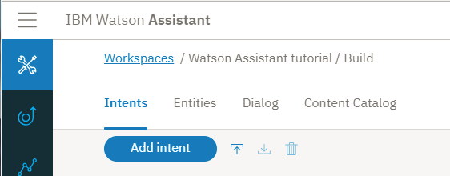
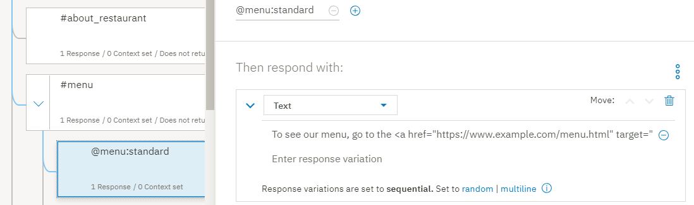
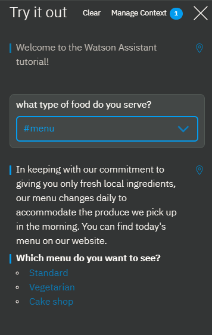

---

copyright:
  years: 2015, 2019
lastupdated: "2019-02-28"

subcollection: assistant

---

{:shortdesc: .shortdesc}
{:new_window: target="_blank"}
{:deprecated: .deprecated}
{:important: .important}
{:note: .note}
{:tip: .tip}
{:pre: .pre}
{:codeblock: .codeblock}
{:screen: .screen}
{:javascript: .ph data-hd-programlang='javascript'}
{:java: .ph data-hd-programlang='java'}
{:python: .ph data-hd-programlang='python'}
{:swift: .ph data-hd-programlang='swift'}
{:gif: data-image-type='gif'}

# 튜토리얼: 복잡한 대화 빌드
{: #tutorial}

이 튜토리얼에서는 {{site.data.keyword.conversationshort}} 서비스를 사용하여 *Truck Stop Gourmand*라는 가상의 레스토랑에 대한 문의를 도와주는 어시스턴트에 사용할 대화를 작성합니다.
{: shortdesc}

## 학습 목표
{: #tutorial-objectives}

튜토리얼을 완료할 때까지 다음을 수행하는 방법을 파악합니다.

- 대화 계획
- 사용자 정의 인텐트 정의
- 인텐트를 처리할 수 있는 노드 추가 
- 응답을 보다 명확하게 하기 위해 엔티티 추가
- 패턴 엔티티를 추가하여 이를 대화에 사용하여 사용자 입력에서 패턴을 찾기
- 컨텍스트 변수 설정 및 참조

### 소요 시간
{: #tutorial-duration}

이 튜토리얼을 완료하는 데 약 2 - 3시간이 걸립니다.

### 전제조건
{: #tutorial-prereqs}

시작하기 전에 [시작하기 튜토리얼](/docs/services/assistant?topic=assistant-getting-started)을 완료하십시오.

사용자가 작성한 대화 스킬을 사용하고 시작하기 연습의 일부로 빌드한 단순 대화에 노드를 추가합니다. 

## 1단계: 대화 계획
{: #tutorial-plan}

하나의 소재지가 있고 케익-베이킹 사업이 잘 되고 있는 *Truck Stop Gourmand*라는 레스토랑에 사용할 어시스턴트를 빌드하고 있습니다. 간단한 어시스턴트가 레스토랑, 메뉴에 대한 사용자 문의에 대답하고 고객 케익 주문을 취소하도록 합니다. 따라서 다음 주제와 관련된 문의를 처리하는 인텐트를 작성해야 합니다.

- 레스토랑 정보
- 메뉴 세부사항
- 주문 취소

이러한 주제를 나타내는 인텐트를 작성하여 시작한 다음, 이에 대한 사용자 질문에 응답하는 대화를 빌드합니다.

## 2단계: 레스토랑에 대한 질문에 응답
{: #tutorial-add-about-intent}

고객이 레스토랑 자체에 대한 세부사항을 요청할 때 인식하는 인텐트를 추가합니다. 인텐트는 사용자 입력에 표현된 목적입니다. *일반* 컨텐츠 카탈로그와 함께 제공되는 `#General_About_You` 인텐트가 유사한 기능을 수행하지만, 사용자 예제는 어시스턴트를 사용하여 고객을 돕는 비즈니스와는 반대로 보조 프로그어시스턴트 대한 쿼리에 중점을 두도록 설계되었습니다. 따라서, 사용자 고유의 인텐트를 추가합니다.

###  #about_restaurant 인텐트 추가
{: #tutorial-add-about-restaurant}

1.  **인텐트** 탭에서 **인텐트 추가**를 클릭합니다.

    
1.  *인텐트 이름* 필드에서 `about_restaurant`를 입력한 다음 **인텐트 작성**을 클릭합니다.

    
1.  다음과 같은 사용자 예제를 추가합니다.

    ```
    Tell me about the restaurant
    i want to know about you
    who are the restaurant owners and what is their philosophy?
    What's your story?
    Where do you source your produce from?
    Who is your head chef and what is the chef's background?
    How many locations do you have?
    do you cater or host functions on site?
    Do you deliver?
    Are you open for breakfast?
    ```
    {: screen}

1.  `#about_restaurant` 인텐트 추가를 완료하려면, **닫기** 아이콘을 클릭합니다. 

인텐트를 추가하고 실제 사용자가 이 인텐트를 트리거하기 위해 입력할 수 있는 발화(utterance)의 예제를 공급했습니다.

### #about_restaurant 인텐트에서 트리거되는 대화 노드를 추가합니다.
{: #tutorial-trigger-about-intent}

사용자 입력이 이전 단계에서 작성한 인텐트에 맵핑할 때를 인식하는 대화 노드를 추가합니다. 이는 해당 조건이 서비스가 사용자 입력에서 `#about_restaurant` 인텐트를 인식했는지 여부를 확인합니다.

1.  **대화** 탭을 클릭합니다.
1.  대화 트리에서 `#General_Greetings` 노드를 찾습니다.

    정상적인 대화에서 발생할 수 있는 플로우를 반영하도록 이 초기 인사 노드 아래에 레스토랑에 대한 질문을 확인하는 노드를 추가합니다. 예: `Hello.` 다음에 `Tell me about yourself` 

1.  `#General_Greetings` 노드에서 **추가**  아이콘을 클릭한 다음, **아래에 노드 추가**를 선택합니다.

    
1.  이 노드의 **조건 입력** 필드에 `#about_restaurant` 입력을 시작합니다. 그런 다음 `#about_restaurant`를 선택합니다.
1.  다음 텍스트를 응답으로 추가합니다.

    ```
    Truck Stop Gourmand is the brain child of Gloria and Fred Smith. What started out as a food truck in 2004 has expanded into a thriving restaurant. We now have one brick and mortar restaurant in downtown Portland. The bigger kitchen brought with it new chefs, but each one is faithful to the philosophy that made the Smith food truck so popular to begin with: deliver fresh, local produce in inventive and delicious ways. Join us for lunch or dinner seven days a week. Or order a cake from our bakery.
    ```
    {: codeblock}

1.  응답에 이미지를 추가합니다.

**응답 유형 추가**를 클릭합니다. 드롭 다운 목록에서 **이미지**를 선택합니다. **Image source** 필드에서 `https://www.ibmlearningcenter.com/wp-content/uploads/2018/02/IBM-Learning-Center-Food4.jpg`를 추가합니다.
1.  이미지 응답 유형을 위로 이동하여 텍스트가 표시되기 전에 이 유형이 응답에 표시되도록 합니다. 두 개의 응답 유형을 다시 정렬하려면 위로 **이동** 화살표를 클릭합니다.

    

1.  를 클릭하여 편집 보기를 닫습니다.

### #about_restaurant 대화 노드 테스트
{: #tutorial-test-about-intent}

훈련 데이터에 추가한 예제와 유사하지만, 정확하게 동일하지는 않은 사용자 발화가 서비스 훈련을 성공적으로 받고 `#about_restaurant` 인텐트가 있는 입력을 인식하는지를 확인하여 인텐트를 테스트합니다.

1.   아이콘을 클릭하여 "시험 사용" 분할창을 엽니다. 

1.  `I want to learn more about your restaurant.`를 입력합니다.

    서비스는 `#about_restaurant` 인텐트가 인식되고, 대화 노드에 대해 지정한 이미지와 텍스트로 응답을 리턴한다는 것을 나타냅니다. 

    

축하합니다! 사용자 정의 인텐트와 이를 처리하는 방법을 아는 대화 노드를 추가했습니다.

`#about_restaurant` 인텐트는 레스토랑에 대한 다양한 일반적인 질문들을 인식하도록 설계되었습니다. 이러한 질문을 캡처하기 위해 단일 노드를 추가했습니다. 응답은 길지만 다음 주제에 대한 질문에 잠재적으로 응답할 수 있는 단일 문장입니다.

- 레스토랑 소유자
- 레스토랑 히스토리
- 철학
- 매장 수
- 운영 기간(일)
- 제공되는 식사
- 레스토랑에서 주문 케익 제공

일반적인 간단한 질문의 경우, 일반적인 단일 응답이 적합합니다.

## 3단계: 레스토랑에 대한 질문에 응답
{: #tutorial-menu}

잠재적인 레스토랑 고객의 주요 질문은 메뉴에 관한 것입니다. Truck Stop Gourmand 레스토랑은 매일 메뉴를 바꿉니다. 표준 메뉴 외에도 채식주의자와 케이크샵 메뉴까지 갖추고 있습니다. 사용자가 메뉴에 대해 문의하는 경우, 대화에서 공유할 메뉴를 찾고 레스토랑의 웹 사이트에 매일 최신 상태로 유지되는 메뉴의 하이퍼링크를 제공해야 합니다. 정보가 정기적으로 변경되면 정보를 대화 노드에 하드 코딩할 필요가 없습니다.

### #menu 인텐트 추가
{: #tutorial-add-menu-intent}

1.  **인텐트** 탭을 클릭합니다.
1.  **인텐트 추가**를 클릭합니다.

    

1.  *인텐트 이름* 필드에서 `menu`를 입력한 다음 **인텐트 작성**을 클릭합니다.

    

1.  다음과 같은 사용자 예제를 추가합니다.

    ```
    I want to see a menu
    What do you have for food?
    Are there any specials today?
    where can i find out about your cuisine?
    What dishes do you have?
    What are the choices for appetizers?
    do you serve desserts?
    What is the price range of your meals?
    How much does a typical dish cost?
    tell me the entree choices
    Do you offer a prix fixe option?
    ```
    {: screen}

1.  `#menu` 인텐트 추가를 완료하려면, **닫기** 아이콘을 클릭합니다. 

### #menu 인텐트에서 트리거되는 대화 노드를 추가합니다.
{: #tutorial-trigger-menu-intent}

사용자 입력이 이전 단계에서 작성한 인텐트에 맵핑할 때를 인식하는 대화 노드를 추가합니다. 이는 해당 조건이 서비스가 사용자 입력에서 `#menu` 인텐트를 인식했는지 여부를 확인합니다.

1.  **대화** 탭을 클릭합니다.
1.  대화 트리에서 `#about_restaurant` 노드를 찾습니다.

    이 노드 아래에서 메뉴에 대한 질문을 확인하는 노드를 추가합니다.

1.  `#about_restaurant` 노드에서 **추가**  아이콘을 클릭한 다음, **아래에 노드 추가**를 선택합니다.

    

1.  이 노드의 **조건 입력** 필드에 `#menu` 입력을 시작합니다. 그런 다음 `#menu` 옵션을 선택합니다.

    

1.  다음 텍스트를 응답으로 추가합니다.

    `In keeping with our commitment to giving you only fresh local ingredients, our menu changes daily to accommodate the produce we pick up in the morning. You can find today's menu on our website.`

1.  사용자가 선택할 수 있는 옵션 목록을 제공하는 *옵션* 응답 유형을 추가합니다. 이 경우 옵션 목록에는 사용 가능한 다른 버전의 메뉴가 포함됩니다.

    **응답 유형 추가**를 클릭합니다. 드롭 다운 목록에서 **옵션**을 선택합니다. 

    

1.  **제목** 필드에서, *Which menu do you want to see?*를 추가합니다.

    

1.  **추가 옵션**을 클릭합니다. 

1.  **레이블** 필드에서 `Standard`를 추가합니다. 레이블로 추가하는 텍스트가 사용자의 응답에 선택 가능한 옵션으로 표시됩니다.

1.  **값** 필드에서 `standard menu`를 추가합니다. 값으로 지정하는 텍스트는 사용자가 목록에서 이 옵션을 선택하고 클릭할 때 새 사용자 입력으로 서비스에 전송되는 것입니다.

1.  이전 두 단계를 반복하여 나머지 메뉴 유형에 대한 레이블 및 값 정보를 추가합니다.

    <table>
    <caption>옵션 응답 유형 세부 사항</caption>
    <tr>
      <th>레이블</th>
      <th>값</th>
    </tr>
    <tr>
      <td>Vegetarian</td>
      <td>vegetarian menu</td>
    </tr>
    <tr>
      <td>Cake shop</td>
      <td>cake shop menu</td>
    </tr>
    </table>

    

1.  를 클릭하여 편집 보기를 닫습니다.

### @menu 엔티티 추가
{: #tutorial-add-menu-entity}

고객이 보고자 하는 메뉴의 다양한 유형을 인식하기 위해 `@menu` 엔티티를 추가합니다. 엔티티 사용자의 목적에 관련된 데이터 유형 또는 오브젝트의 클래스를 나타냅니다. 사용자 입력에서 특정 엔티티의 존재를 확인하여 응답을 추가하고, 각 응답을 개별 사용자 요청을 처리하도록 조정할 수 있습니다. 이 경우, 다른 메뉴 유형을 구별할 수 있는 `@menu` 엔티티를 추가합니다.

1.  **엔티티** 탭을 클릭합니다. 

    

1.  **엔티티 추가**를 클릭합니다.

1.  엔티티 이름 필드에 `menu`를 입력합니다.

    

1.  **엔티티 작성**을 클릭합니다.

1.  `standard`를 *값 이름* 필드에 추가하고 `standard menu`를 **동의어** 필드에 추가한 다음 Enter를 누릅니다.

1.  다음과 같은 추가 동의어를 추가합니다.

    - bill of fare
    - cuisine
    - carte du jour

    

1.  `@menu:standard` 값을 추가하려면 **값 추가**를 클릭합니다.

1.  `vegetarian`을 *값 이름* 필드에 추가하고 `vegetarian menu`를 **동의어** 필드에 추가한 다음 Enter를 누릅니다.

1.  **권장사항 표시**를 클릭하고 *meatless diet*, *meatless* 및 *vegan diet*에 대해 확인란을 선택합니다.

1.  **선택사항 추가**를 클릭합니다.

1.  비어 있는 *동의어 추가* 필드를 클릭한 후, 다음과 같은 추가 동의어를 추가합니다.

    - vegan
    - plants-only

    

1.  `@menu:vegetarian` 값을 추가하려면 **값 추가**를 클릭합니다.

1.  `cake`를 *값 이름* 필드에 추가한 후 `cake menu`를 **동의어** 필드에 추가한 다음 Enter를 누릅니다.

1.  다음과 같은 추가 동의어를 추가합니다.

    - cake shop menu
    - dessert menu
    - bakery offerings

    

1.  `@menu:cake` 값을 추가하려면 **값 추가**를 클릭합니다.

1.  `@menu` 엔티티 추가를 완료하려면 **닫기** 아이콘을 클릭합니다.

### @menu 엔티티 유형에서 트리거되는 하위 노드 추가
{: #tutorial-trigger-menu-entity}

이 단계에서는 `#menu` 인텐트를 확인하는 대화 노드에 하위 노드를 추가합니다. 각 하위 노드는 사용자가 옵션 목록에서 선택하는 `@menu` 엔티티 유형에 따라 다른 응답을 표시합니다.

1.  **대화** 탭을 클릭합니다.
1.  대화 트리에서 `#menu` 노드를 찾습니다.

    하위 노드를 추가하여 `#menu` 노드에 추가한 각 메뉴 유형 옵션을 처리합니다.

1.  `#menu` 노드에서 **추가**  아이콘을 클릭한 다음, **하위 노드 추가**를 선택합니다.

    

1.  이 노드의 **조건 입력** 필드에 `@menu:standard` 입력을 시작합니다. 그런 다음 `@menu:standard` 옵션을 선택합니다.

1.  응답 텍스트 필드에 다음 메시지를 추가합니다. `To see our menu, go to the <a href="https://www.example.com/menu.html" target="blank">menu</a> page on our website.`

    

1.  를 클릭하여 편집 보기를 닫습니다.

1.  `@menu:standard` 노드에서 **추가**  아이콘을 클릭한 다음, **아래에 노드 추가**를 선택합니다.

1.  이 노드의 **조건 입력** 필드에 `@menu:vegetarian` 입력을 시작합니다. 그런 다음 `@menu:vegetarian` 옵션을 선택합니다.

1.  응답 텍스트 필드에 다음 메시지를 추가합니다. `To see our vegetarian menu, go to the <a href="https://www.example.com/vegetarian-menu.html" target="blank">vegetarian menu</a> page on our website.`

    

1.  를 클릭하여 편집 보기를 닫습니다.

1.  `@menu:vegetarian` 노드에서 **추가**  아이콘을 클릭한 다음, **아래에 노드 추가**를 선택합니다.

1.  이 노드의 **조건 입력** 필드에 `@menu:cake` 입력을 시작합니다. 그런 다음 `@menu:cake` 옵션을 선택합니다.

1.  응답 텍스트 필드에 다음 메시지를 추가합니다. `To see our cake shop menu, go to the <a href="https://www.example.com/menu.html" target="blank">cake shop menu</a> page on our website.`

    

1.  를 클릭하여 편집 보기를 닫습니다.

1.  표준 메뉴가 가장 자주 요청되므로 하위 노드 목록의 맨 아래로 이동합니다. 이를 마지막에 배치하면 누군가가 표준 메뉴 대신 스페셜티 메뉴를 요청할 때 실수로 트리거되는 것을 방지합니다.

1.  `@menu:standard` 노드에서 **추가**  아이콘을 클릭한 다음, **이동**을 선택합니다.

    

1.  `@menu:cake` 노드를 선택한 다음, **노드 아래**를 선택합니다.

    

메뉴 세부 정보에 대한 사용자 요청을 인식하는 노드를 추가했습니다. 사용자의 응답은 사용 가능한 메뉴의 세 가지 유형이 있음을 사용자에게 알리고 하나를 선택하도록 요청합니다. 사용자가 메뉴 유형을 선택하면 요청된 메뉴 세부사항이 있는 웹 페이지의 하이퍼텍스트 링크를 제공하는 응답이 표시됩니다.

### 메뉴 옵션 대화 노드 테스트
{: #tutorial-test-menu-options-intent}

메뉴 질문을 인식하기 위해 추가한 대화 노드를 테스트합니다.

1.   아이콘을 클릭하여 "시험 사용" 분할창을 엽니다. 

1.  `What type of food do you serve?`를 입력합니다.

    서비스가 `#menu` 인텐트가 인식됨을 나타내고 사용자가 선택할 수 있는 메뉴 옵션 목록을 표시합니다.

    
1.  `Cake shop` 옵션을 클릭합니다. 

    이 서비스는 `#menu` 인텐트와 `@menu:cake` 엔티티를 참조하고, `To see our cake shop menu, go to the cake shop page on our website.` 응답을 표시합니다.

    
1.  응답에서 *cake shop* 하이퍼링크를 클릭합니다.

    새 웹 브라우저 페이지가 열리고 example.com를 표시합니다.

1.  웹 브라우저 페이지를 종료합니다.

수고하셨습니다. 메뉴 세부사항에 대한 사용자 요청을 인식할 수 있고 사용자를 적절한 메뉴로 보낼 수 있는 인텐트와 엔티티를 성공적으로 추가했습니다.

`#menu` 인텐트는 레스토랑의 잠재 고객의 요구를 나타냅니다. 중요하고 인기가 높으므로 대화에 더 복잡한 섹션을 추가하여 이를 잘 해결했습니다.

## 4단계: 케이크 주문 관리
{: #tutorial-manage-orders}

고객이 전화로 또는 웹 사이트에서 주문 양식을 사용하여 직접 주문합니다. 주문한 후, 가상 어시스턴트를 통해 주문을 취소할 수 있습니다. 먼저, 주문 전호를 인식할 수 있는 엔티티를 정의합니다. 그런 다음, 사용자가 케이크 주문을 취소하는 시기를 인식하는 인텐트를 추가합니다.

### 주문 번호 패턴 엔티티 추가
{: tutorial-add-pattern-entity}

어시스턴트가 주문 번호를 인식하도록 하려면 해당 주문을 식별하기 위해 식당에서 사용하는 고유한 형식을 인식하는 패턴 엔티티를 작성합니다. 레스토랑의 베이커리에서 사용하는 주문 번호의 구문은 2개의 대문자 뒤에 5개의 숫자가 이어집니다. 예: `YR34663`. 이 문자 패턴을 인식할 수 있는 엔티티를 추가하십시오.

1.  **엔티티** 탭을 클릭합니다. 
1.  **엔티티 추가**를 클릭합니다.
1.  엔티티 이름 필드에 `order_number`를 입력합니다.
1.  **엔티티 작성**을 클릭합니다.

    
1.  *값 이름* 필드에 `order_syntax`를 추가한 후 **동의어** 옆에 있는 아래로 화살표를 클릭하여 유형을 **패턴**으로 변경합니다.

    
1.  `[A-Z]{2}\d{5}` 패턴 필드에 다음 정규식을 추가합니다.

    

1.  **값 추가**를 클릭합니다. 

    

1.  `@order_number` 엔티티 추가를 완료하려면 **닫기** 아이콘을 클릭합니다.

    

### 주문 취소 인텐트 추가
{: #tutorial-cancel-order-intent}

1.  **인텐트** 탭을 클릭합니다.
1.  **인텐트 추가**를 클릭합니다.
1.  *인텐트 이름* 필드에서 `cancel_order`를 입력한 다음, **인텐트 작성**을 클릭합니다.
1.  다음과 같은 사용자 예제를 추가합니다.

    ```
    I want to cancel my cake order
    I need to cancel an order I just placed
    Can I cancel my cake order?
    I'd like to cancel my order
    There's been a change. I need to cancel my bakery order.
    please cancel the birthday cake order I placed last week
    The party theme changed; we don't need a cake anymore
    that order i placed, i need to cancel it.
    ```
    {: screen}

    
1.  `#cancel_order` 인텐트 추가를 완료하려면, **닫기** 아이콘을 클릭합니다. 

### 예(yes) 인텐트 추가
{: #tutorial-yes-intent}

사용자 대신 조치를 수행하기 전에 적절한 조치를 취하고 있는지 확인해야 합니다. 사용자가 서비스가 제안하는 내용에 동의할 때 인식할 수 있는 대화에 #yes 인텐트를 추가합니다.

1.  **인텐트** 탭을 클릭합니다.
1.  **인텐트 추가**를 클릭합니다.
1.  *인텐트 이름* 필드에서 `yes`를 입력한 다음, **인텐트 작성**을 클릭합니다.
1.  다음과 같은 사용자 예제를 추가합니다.

    ```
    Yes
    Correct
    Please do.
    You've got it right.
    Please do that.
    that is correct.
    That's right
    yeah
    Yup
    Yes, I'd like to go ahead with that.
    ```
    {: screen}

    
1.  `#yes` 인텐트 추가를 완료하려면, **닫기** 아이콘을 클릭합니다. 

### 주문 취소 요청을 관리할 수 있는 대화 노드 추가
{: #tutorial-cancel-order-dialog}

이제 케이크 주문 취소 요청을 처리할 수 있는 대화 노드를 추가합니다.

1.  **대화** 탭을 클릭합니다. 
1.  `#menu` 노드를 찾습니다. `#menu` 노드에서 **추가**  아이콘을 클릭한 다음, **아래에 노드 추가**를 선택합니다.
1.  이 노드의 **조건 입력** 필드에 `#cancel_order` 입력을 시작합니다. 그런 다음 `#cancel_order` 옵션을 선택합니다.
1.  응답 텍스트 필드에 다음 메시지를 추가합니다.

    ```
    If the pickup time is more than 48 hours from now, you can cancel your order.
    ```
    {: codeblock}

    

    주문을 취소하려면 먼저 주문 번호를 알아야 합니다. 사용자는 원래 요청에서 주문 번호를 지정할 수 있습니다. 따라서 주문 번호를 다시 묻지 않으려면 원래 입력에서 주문 번호 패턴이 있는 번호를 확인하십시오. 이를 수행하려면, 주문 번호를 지정한 경우 이 번호를 저장할 컨텍스트 변수를 정의하십시오.

1.  컨텍스트 편집기를 엽니다. **추가**  아이콘을 클릭하고 **컨텍스트 편집기 열기**를 선택합니다. 

    
1.  다음 컨텍스트 변수 이름 및 값 쌍을 입력합니다.

    <table>
    <caption>주문 번호 컨텍스트 변수 세부사항</caption>

    <tr>
      <th>변수</th>
      <th>값</th>
    </tr>
    <tr>
      <td>$ordernumber</td>
      <td><? @order_number.literal ?></td>
    </tr>
    </table>

    컨텍스트 변수 값(`<? @order_number.literal ?>`)은 @order_number 패턴 엔티티에서 정의하는 패턴과 일치하고 사용자가 지정하는 번호를 캡처하는 SpEL 표현식입니다. 이는 `$ordernumber` 변수에 저장됩니다.

    
1.  를 클릭하여 편집 보기를 닫습니다.

    이제 주문 번호를 요청하거나 주문 번호가 발견된 주문의 취소에 대해 사용자의 확인을 받을 수 있는 하위 노드를 추가하십시오.

1.  `#cancel_order` 노드에서 **추가**  아이콘을 클릭한 다음, **하위 노드 추가**를 선택합니다.

    
1.  추가할 다른 하위 노드와 구별하기 위해 노드에 레이블을 추가합니다. 이름 필드에 `주문 번호 요청`을 추가합니다. 이 노드의 **조건 입력** 필드에 `true`를 입력합니다. 

1.  응답 텍스트 필드에 다음 메시지를 추가합니다.

    ```
    What is the order number?
    ```
    {: codeblock}

    
1.  를 클릭하여 편집 보기를 닫습니다.

    이제, 사용자에게 주문 취소를 알리는 다른 하위 노드를 추가하십시오.
1.  `Ask for order number` 노드에서 **추가**  아이콘을 클릭한 다음, **하위 노드 추가**를 선택합니다.
1.  이 노드의 **조건 입력** 필드에 `@order_number`를 입력합니다. 
1.  컨텍스트 편집기를 엽니다. **추가**  아이콘을 클릭하고 **컨텍스트 편집기 열기**를 선택합니다. 
1.  다음 컨텍스트 변수 이름 및 값 쌍을 입력합니다.

    <table>
    <caption>주문 번호 컨텍스트 변수 세부사항</caption>

    <tr>
      <th>변수</th>
      <th>값</th>
    </tr>
    <tr>
      <td>$ordernumber</td>
      <td><? @order_number.literal ?></td>
    </tr>
    </table>

    컨텍스트 변수 값(`<? @order_number.literal ?>`)은 @order_number 패턴 엔티티에서 정의하는 패턴과 일치하고 사용자가 지정하는 번호를 캡처하는 SpEL 표현식입니다. 이는 `$ordernumber` 변수에 저장됩니다.1.  응답 텍스트 필드에 다음 메시지를 추가합니다.

    ```
    Ok. The order $ordernumber is canceled. We hope we get the opportunity to bake a cake for you sometime soon.
    ```
    {: codeblock}

    
1.  를 클릭하여 편집 보기를 닫습니다.
1.  사용자가 번호를 제공하지만 올바른 주문 번호가 아닌 경우를 캡처하려면 다른 노드를 추가합니다. `@order_number` 노드에서 **추가**  아이콘을 클릭한 다음, **아래에 노드 추가**를 선택합니다.
1.  이 노드의 **조건 입력** 필드에 `true`를 입력합니다. 
1.  응답 텍스트 필드에 다음 메시지를 추가합니다.

    ```
    I need the order number to cancel the order for you. If you don't know the order number, please call us at 958-234-3456 to cancel over the phone.
    ```
    {: codeblock}

    
1.  를 클릭하여 편집 보기를 닫습니다.

1.  최초 요청에서 사용자가 주문 번호를 제공하는 경우에 응답하는 최초 주문 취소 요청 노드 아래에 노드를 추가하므로, 다시 요청하지 않아도 됩니다. `#cancel_order` 노드에서 **추가**  아이콘을 클릭한 다음, **하위 노드 추가**를 선택합니다.
1.  다른 하위 노드와 구별하기 위해 노드에 레이블을 추가합니다. 이름 필드에 `Number provided`를 추가합니다. 이 노드의 **조건 입력** 필드에 `@order_number`를 입력하십시오. 
1.  응답 텍스트 필드에 다음 메시지를 추가합니다.

    ```
    Just to confirm, you want to cancel order $ordernumber?
    ```
    {: codeblock}

    
1.  를 클릭하여 편집 보기를 닫습니다.

    확인 질문에 대한 사용자의 응답을 확인하는 하위 노드를 추가해야 합니다.
1.  `Number provided` 노드에서 **추가**  아이콘을 클릭한 다음, **하위 노드 추가**를 선택합니다.
1.  이 노드의 **조건 입력** 필드에 `#yes`를 입력합니다. 

1.  응답 텍스트 필드에 다음 메시지를 추가합니다.

    ```
    Ok. The order $ordernumber is canceled. We hope we get the opportunity to bake a cake for you sometime soon.
    ```
    {: codeblock}

    
1.  를 클릭하여 편집 보기를 닫습니다.

1.  `#yes` 노드에서 **추가**  아이콘을 클릭한 다음, **아래에 노드 추가**를 선택합니다.

1.  이 노드의 **조건 입력** 필드에 `true`를 입력합니다. 

    응답을 추가하지 마십시오. 대신, 이전에 작성한 주문 번호 세부사항을 요청하는 지점으로 사용자를 재지정합니다.

1.  *마침* 섹션에서 **이동**을 선택합니다.

    
1.  *Ask for order number* 노드의 조건을 선택합니다.

    
1.  를 클릭하여 편집 보기를 닫습니다.
1.  *Number provided* 노드를 *Ask for order number* 노드 위로 이동합니다. `Number provided` 노드에서 **추가**  아이콘을 클릭한 다음, **이동**을 선택합니다. *Ask for order number* 노드를 선택한 다음, **노드 위로**를 클릭합니다.

    
1.  대화를 강제 실행하여 런타임 시 `#cancel_order` 노드 아래에 있는 하위 노드를 평가합니다. 편집 보기에서 `#cancel_order` 노드를 연 다음, `마침` 섹션에서 `사용자 입력 건너뛰기`를 선택합니다.

    

### 주문 취소 테스트
{: #tutorial-test-cancel-order}

서비스가 사용자 입력의 상품 주문 번호에 사용된 패턴과 일치하는 문자 패턴을 인식할 수 있는지 여부를 테스트합니다.

1.   아이콘을 클릭하여 "시험 사용" 분할창을 엽니다. 

1.  `i want to cancel my order number TW12345`를 입력합니다.

    서비스는 `#cancel_order` 인텐트와 `@order_number` 엔티티를 둘 다 인식합니다. 응답: `픽업 시간이 지금부터 48시간 후인 경우 주문을 취소할 수 있습니다. 확인을 위해, TW12345 주문을 취소하시겠습니까?`

1.  `예`를 입력합니다.

    서비스에서 `#yes` 인텐트를 인식하고 다음과 같이 응답합니다. `Ok. The order TW12345 is canceled. We hope we get the opportunity to bake a cake for you sometime soon.`

    

    이제 주문 번호를 모르는 경우 시도해 보십시오.
1.  다시 시작하려면 "시험 사용" 분할창에서 **지우기**를 클릭합니다. `I want to cancel my order.`를 입력합니다.

    서비스에서 `#cancel_order` 인텐트를 인식하고 다음과 같이 응답합니다. `If the pickup time is more than 48 hours from now, you can cancel your order. What is the order number?`

1.  `I don't know.`를 입력합니다.

    서비스에서 다음과 같이 응답합니다. `I need the order number to cancel the order for you. If you don't know the order number, please call us at 958-234-3456 to cancel over the phone.`

    

더 많은 테스트를 수행하는 경우, 사용자가 주문 번호 형식을 기억하지 못하는 시나리오에서는 대화가 별로 도움이 되지 않는다는 것을 알 수 있습니다. 사용자는 숫자나 문자만 포함할 수 있지만, 대문자라는 것을 잊습니다. 따라서, 그런 경우 힌트를 주면 좋을 것입니다. 친절하게 하려면, 사용자 입력에서 숫자를 확인하는 대화 트리에 다른 노드를 추가하십시오.

1.  *Ask order number* 노드의 하위인 `@order-number` 노드를 찾습니다.

1.  `@order-number` 노드에서 **추가**  아이콘을 클릭한 다음, **아래에 노드 추가**를 선택합니다.

1.  조건 필드에서, 하나 이상의 숫자를 사용자 입력에서 찾는 경우 이 응답을 트리거하는 SpEL 표현식인 `input.text.find('\d')`를 추가합니다.

1.  텍스트 응답 필드에서 다음 응답을 추가합니다.

    ```
    The correct format for our order numbers is AAnnnnn. The A's represents 2 upper-case letters, and the n's represents 5 numbers. Do you have an order number in that format?
    ```
    {: codeblock}

1.  를 클릭하여 편집 보기를 닫습니다.

1.  `input.text.find('\d')` 노드에서 **추가**  아이콘을 클릭한 다음, **하위 노드 추가**를 선택합니다.

1.  이 노드의 **조건 입력** 필드에 `true`를 입력합니다. 

1.  **사용자 정의**를 클릭하여 조건부 응답을 사용하도록 설정한 후 *다중 응답* 토글을 **설정**으로 전환합니다.

1.  **적용**을 클릭합니다.

1.  새로 추가된 *If bot recognizes* 필드에 `@order_number`를 입력하고, *Respond with* 필드에는 다음을 입력합니다.

    ```
    Ok. The order $ordernumber is canceled. We hope we get the opportunity to bake a cake for you sometime soon.
    ```
    {: codeblock}

1.  **응답 추가**를 클릭합니다.

1.  *If bot recognizes* 필드에 `true`를 입력하고, *Respond with* 필드에는 다음을 입력합니다.

    ```
    I need the order number to cancel the order for you. If you don't know the order number, please call us at 958-234-3456 to cancel over the phone.
    ```
    {: codeblock}

    
1.  를 클릭하여 편집 보기를 닫습니다.

이제, 테스트할 때 숫자 세트 또는 숫자와 텍스트 혼합하여 입력할 수 있고 대화가 올바른 주문 번호 형식을 보여줍니다. 대화를 성공적으로 테스트하여 약점을 발견하고 수정했습니다.

이 유형의 시나리오를 처리하는 또 다른 방법은 슬롯이 있는 노드를 추가하는 것입니다. 슬롯 사용에 대해 자세히 보려면 [슬롯이 있는 노드를 대화에 추가](/docs/services/assistant?topic=assistant-tutorial-slots)를 참조하십시오.
{:tip}

## 5 단계: 개인적인 터치 추가
{: #tutorial-get-username}

사용자가 봇 자체에 관심을 보이는 경우, 가상 어시스턴트가 호기심을 인식하고 더 개인적인 방식으로 사용자와 관계를 맺을 수 있습니다. 사용자 정의 `#about_restaurant` 인텐트를 추가하기 전에 사용을 고려한 *일반적인* 컨텐츠 카탈로그와 함께 제공되는 `#General_About_You` 인텐트를 기억할 수 있습니다. 그와 같은 사용자 질문만 인식하도록 빌드되었습니다. 이 인텐트를 조건으로 하는 노드를 추가하십시오. 응답에서 사용자 이름을 요청하고 가능한 경우 대화의 다른 곳에서 사용할 수 있는 $username 변수에 이를 저장할 수 있습니다.

우선, 사용자에게 이름이 있는 경우 서비스가 이름을 인식하는지 확인해야 합니다. 따라서 일반적인 이름 및 성(영어)을 인식하도록 설계된 `@sys - person` 엔티티를 사용하도록 설정할 수 있습니다.

### 개인 시스템 엔티티 추가
{: #tutorial-add-person-entity}

서비스는 여러 *시스템 엔티티*를 제공하며, 이러한 엔티티는 모든 애플리케이션에 사용할 수 있는 일반적인 엔티티입니다. 

1.  **엔티티** 탭에서 **시스템 엔티티**를 클릭합니다.

1.  *`@sys-person`* 엔티티 토글을 찾은 다음, **설정**으로 전환합니다.

    

### 봇에 대한 질문을 처리하는 노드 추가
{: #tutorial-add-about-you-node}

이제, 봇에 대한 사용자의 관심을 인식하고 응답할 수 있는 대화 노드를 추가합니다.

1.  **대화** 탭을 클릭합니다.
1.  대화 트리에서 `Welcome` 노드를 찾습니다.
1.  `Welcome` 노드에서 **추가**  아이콘을 클릭한 다음, **아래에 노드 추가**를 선택합니다.
1.  이 노드의 **조건 입력** 필드에 `#General_About_You` 입력을 시작합니다. 그런 다음 `#General_About_You` 옵션을 선택합니다.
1.  응답 텍스트 필드에 다음 메시지를 추가합니다.

    ```
    I am a virtual assistant that is designed to answer your questions about the Truck Stop Gourmand restaurant. What's your name?
    ```
    {: codeblock}

    
1.  를 클릭하여 편집 보기를 닫습니다.
1.  `#General_About_You` 노드에서 **추가**  아이콘을 클릭한 다음, **하위 노드 추가**를 선택합니다.
1.  이 노드의 **조건 입력** 필드에 `@sys-person` 입력을 시작합니다. 그런 다음 `@sys-person` 옵션을 선택합니다.
1.  응답 텍스트 필드에 다음 메시지를 추가합니다.

    ```
    Hello, <? @sys-person.literal ?>! It's lovely to meet you. How can I help you today.
    ```
    {: codeblock}

1.  사용자가 제공하는 이름을 캡처하려면 노드에 컨텍스트 변수를 추가합니다. **추가**  아이콘을 클릭하고 **컨텍스트 편집기 열기**를 선택합니다. 
1.  다음 컨텍스트 변수 이름 및 값 쌍을 입력합니다.

    <table>
    <caption>사용자 이름 컨텍스트 변수 세부사항</caption>

    <tr>
      <th>변수</th>
      <th>값</th>
    </tr>
    <tr>
      <td>$username</td>
      <td><? @sys-person.literal ?></td>
    </tr>
    </table>

    컨텍스트 변수 값(`<? @sys-person.literal ?>`)은 사용자 이름을 지정할 때 이름을 캡처하여 `$username` 컨텍스트 변수에 저장하는 SpEL 표현식입니다.

    
1.  를 클릭하여 편집 보기를 닫습니다.
1.  `@sys-person` 노드에서 **추가**  아이콘을 클릭한 다음, **아래에 노드 추가**를 선택합니다.

    이름이 포함되지 않은 사용자 응답을 캡처하기 위해 노드를 추가합니다. 사용자가 공유하지 않도록 선택하는 경우 봇이 대화를 계속 진행하기를 원합니다.
1.  이 노드의 **조건 입력** 필드에 `true`를 입력합니다. 
1.  응답 텍스트 필드에 다음 메시지를 추가합니다.

    ```
    How can I help you today?
    ```
    {: codeblock}

    
1.  를 클릭하여 편집 보기를 닫습니다.

런타임 시 사용자가 이 노드를 트리거하고 이름을 제공하는 경우 사용자 이름을 알게 됩니다. 이름을 아는 경우, 이를 사용해야 합니다. 사용자 이름(아는 경우)을 사용하는 조건부 응답을 포함하기 위해 이전에 추가한 인사 대화 노드에 조건부 응답을 추가하십시오.

### 인사에 사용자 이름 추가
{: #tutorial-add-username-to-greeting}

사용자 이름을 아는 경우, 인사말 메시지에 이를 포함시켜야 합니다. 이를 수행하려면 조건부 응답을 추가하고 사용자 이름을 포함하는 인사의 변형을 포함하십시오.

1.  대화 트리에서 `#General_Greetings` 노드를 찾은 후 편집 보기에서 클릭하여 엽니다.
1.  **사용자 정의**를 클릭하여 *다중 응답* 토글을 **설정**으로 전환합니다.

    
1.  **적용**을 클릭합니다.

    
1.  **응답 추가**를 클릭합니다.
1.  *If bot recognizes* 필드에 `$username`을 입력하고, *Respond with* 필드에는 다음을 입력합니다.

    ```
    Good day to you, $username!
    ```
    {: codeblock}

1.  위로 화살표를 클릭하여 응답 번호 2를 응답 번호 1(`Good day to you!`) 앞에 오도록 이동합니다.

    
1.  를 클릭하여 편집 보기를 닫습니다.

### 개인화 테스트
{: #tutorial-test-personalize}

서비스가 사용자 이름을 인식하고 저장할 수 있는지 여부를 테스트한 다음, 나중에 이를 사용하여 사용자를 참조하십시오.

1.   아이콘을 클릭하여 "시험 사용" 분할창을 엽니다. 

1.  대화 세션을 다시 시작하려면 **지우기**를 클릭합니다.

1.  `Who are you?`를 입력합니다.

    서비스는 `#General_About_You` 인텐트를 인식합니다. 응답이 `What's your name?` 질문으로 끝납니다.
1.  `I am Jane Doe`를 입력합니다.

    서비스가 `Jane Doe`를 `@sys - person` 엔티티 멘션으로 인식합니다. 사용자 이름에 댓글을 달고 도움이 될지를 물어봅니다.
1.  `Hello`를 입력합니다.

    이 서비스는  `#General_Greetings` 인텐트를 인식하고 `Good day to you, Jane Doe!`라고 표시됩니다. 인사 노드가 트리거될 때 `$username` 컨텍스트 변수에 값이 포함되므로 사용자 이름을 포함하는 조건부 응답을 사용합니다.

    ![사용자가 누구인지를 물어보며 이름(Jane Doe)를 제공하고 인사하면 이름으로 환영을 받는 시험 사용 분할창을 표시합니다.

개인화가 대화에 값을 추가하는 다른 응답에 대한 사용자 이름을 조건으로 하고 이를 포함하는 조건부 응답을 추가할 수 있습니다.

## 6단계: 웹 페이지 통합에서 어시스턴트 테스트
{: #tutorial-integrate-assistant}

이제 더 정교한 버전의 어시스턴트를 빌드했으므로 이전 튜토리얼의 일부로 배치한 공용 웹 페이지로 돌아가서 추가한 새 기능을 테스트하십시오.

1.  어시스턴트를 엽니다.
1.  통합 영역에서 미리보기 링크를 클릭합니다.
1.  페이지에 표시된 URL을 클릭합니다.

    페이지가 새 탭에서 열립니다.
1.  어시스턴트가 실제 통합에서 작동하는 방식을 보기 위해 '시험 사용' 분할창에 제출했던 테스트 발화 중 몇 개를 반복합니다.

    '시험 사용' 분할창에서 서비스로 테스트 발화를 보내는 경우와 달리, 표준 사용 요금이 채팅 위젯에 제출된 발화에서 발생하는 API 호출에 적용됩니다.
    {: note}

## 다음 단계
{: #tutorial-deploy}

이제 대화 스킬을 빌드하고 테스트했으므로 고객과 공유할 수 있습니다. 먼저 어시스턴트에 스킬을 연결하여 배치한 다음, 어시스턴트를 배치하십시오. 이를 수행할 수 있는 다양한 방법이 있습니다. 자세한 내용은 [통합 추가]를 참조하십시오.
