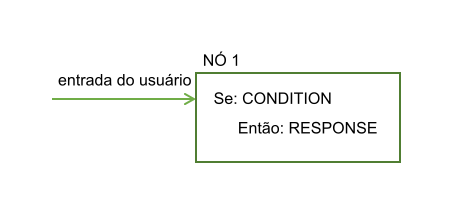
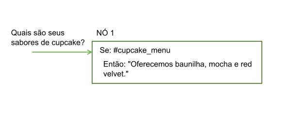
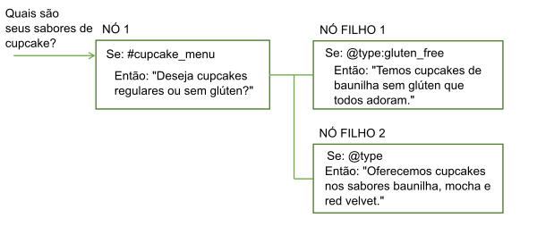
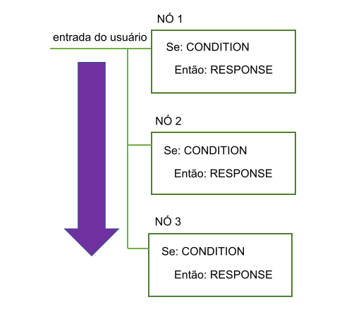
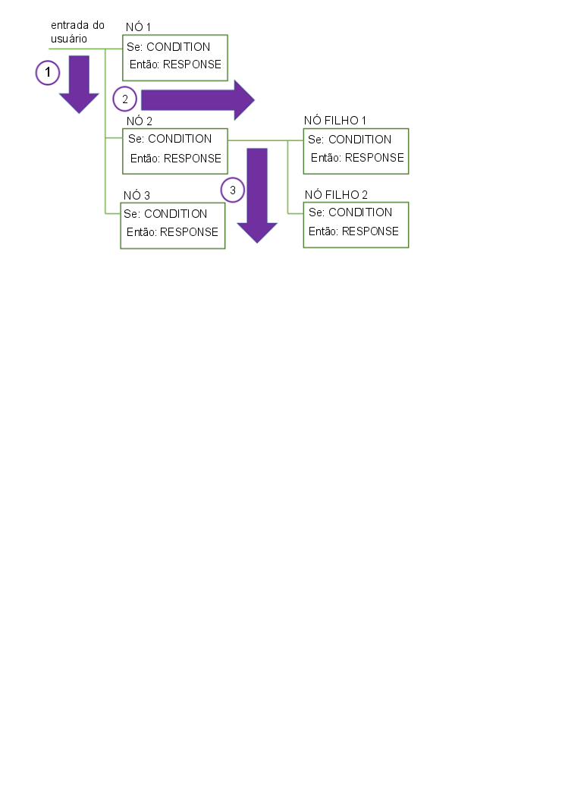
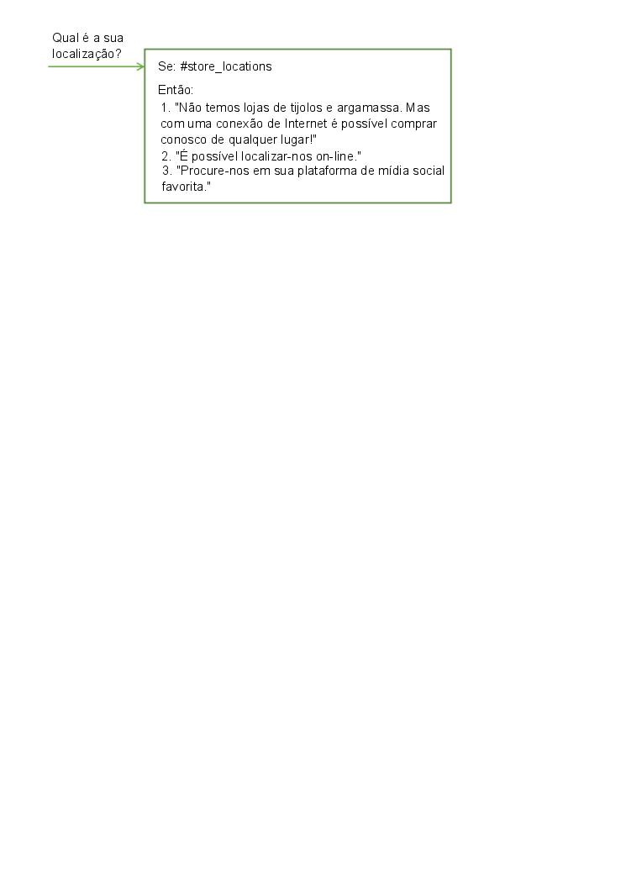
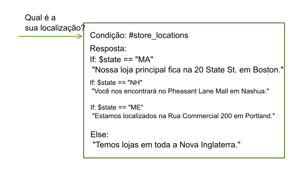

---

copyright:
  years: 2015, 2018
lastupdated: "2018-02-09"

---

{:shortdesc: .shortdesc}
{:new_window: target="_blank"}
{:tip: .tip}
{:pre: .pre}
{:codeblock: .codeblock}
{:screen: .screen}
{:javascript: .ph data-hd-programlang='javascript'}
{:java: .ph data-hd-programlang='java'}
{:python: .ph data-hd-programlang='python'}
{:swift: .ph data-hd-programlang='swift'}
{:table: .aria-labeledby="caption"}

# Visão geral do diálogo
{: #dialog-overview}

O diálogo utiliza as intenções e entidades que são identificadas na entrada do usuário, além de contexto do aplicativo, para interagir com o usuário e finalmente fornecer uma resposta útil.
{: shortdesc}

A resposta pode ser a resposta para uma pergunta como `Where can I get some gas?` ou a execução de um comando, como ligar o rádio. A intenção e a entidade podem ser informações suficientes para identificar a resposta correta, ou o diálogo pode pedir ao usuário uma entrada adicional, necessária para responder corretamente. Por exemplo, se um usuário pergunta `Where can I get some food?`, convém esclarecer se eles desejam um restaurante ou uma mercearia, jantar no local ou levar para viagem e assim por diante. É possível pedir mais detalhes em uma resposta de texto e criar um ou mais nós-filhos para processar a nova entrada.

<iframe class="embed-responsive-item" id="youtubeplayer" type="text/html" width="640" height="390" src="https://www.youtube.com/embed/oQUpejt6d84?rel=0" frameborder="0" webkitallowfullscreen mozallowfullscreen allowfullscreen> </iframe>

O diálogo é representado graficamente na ferramenta {{site.data.keyword.conversationshort}} como uma árvore. Crie uma ramificação para processar cada intenção que você deseja que sua conversa manipule. Uma ramificação é composta de múltiplos nós.

## Nós de diálogo

Cada nó de diálogo contém, no mínimo, uma condição e uma resposta.



- Condição: Especifica as informações que devem estar presentes na entrada do usuário para que esse nó no diálogo seja acionado. As informações podem ser uma intenção específica, um valor de entidade ou um valor variável de contexto. Consulte [Condições](dialog-runtime.html#conditions) para obter informações adicionais.
- Resposta: A elocução que o serviço usa para responder ao usuário. A resposta também pode ser configurada para acionar ações programáticas. Consulte [Respostas](#responses) para obter informações adicionais.

É possível pensar no nó como tendo uma construção if/then: se esta condição for verdadeira, então retornar essa resposta.

Por exemplo, o nó a seguir é acionado se a função de processamento de linguagem natural do serviço determina que a entrada do usuário contém a intenção `#cupcake-menu`. Como resultado do nó sendo acionado, o serviço responde com uma resposta apropriada.



Um nó único com uma condição e resposta pode manipular solicitações simples do usuário. Porém, mais frequentemente, os usuários têm perguntas mais sofisticadas ou desejam ajuda com tarefas mais complexas. É possível incluir nós-filhos que pedem para o usuário fornecer qualquer informação adicional que o serviço necessite.



## Fluxo de diálogo

O diálogo que você cria é processado pelo serviço do primeiro nó na árvore para o último.



À medida que ele viajar pela árvore, se o serviço localizar uma condição que foi atendida, ele acionará aquele nó. Em seguida, ele se move ao longo do nó acionado para verificar a entrada do usuário com relação a quaisquer condições do nó-filho. Conforme verifica os nós-filhos, ele se move novamente a partir do primeiro nó-filho para o último.

Os serviços continuam funcionando por meio da árvore de diálogo do primeiro ao último nó, junto a cada nó acionado, em seguida, do primeiro ao último nó-filho e junto a cada nó-filho acionado até atingir o último nó na ramificação que está seguindo.



Ao iniciar a construção do diálogo, deve-se determinar as ramificações a serem incluídas e onde colocá-las. A ordem das ramificações é importante porque os nós são avaliados da primeira à última. O primeiro nó raiz cuja condição corresponde à entrada é usado; quaisquer nós que vêm depois na árvore não são acionados.

Quando o serviço atinge o término de uma ramificação ou não pode localizar uma condição que é avaliada como true do conjunto atual de nós-filhos que estão sendo avaliados, ele salta de volta para a base da árvore. E mais uma vez, o serviço processa os nós raiz do primeiro ao último. Se nenhuma das condições é avaliada como true, a resposta do último nó na árvore, que geralmente tem uma condição especial `anything_else` que sempre é avaliada como true, é retornada.

É possível interromper o fluxo padrão do primeiro ao último customizando o que acontece depois de um nó ser processado. Por exemplo, é possível configurar um nó para ir diretamente para outro nó após ele ser processado, mesmo se o outro nó está posicionado antes na árvore. Veja [Definindo o que fazer em seguida](dialog-overview.html#jump-to) para obter mais detalhes.

Como você define as configurações de digressão para cada nó também pode afetar como os usuários se movem pelos nós no tempo de execução. Se você ativa digressões longe da maioria dos nós, os usuários podem ir de um nó para outro e voltar mais facilmente. Veja [Digressões](dialog-runtime.html#digressions) para obter mais informações.

## Condições
{: #conditions}

Uma condição de nó determina se esse nó é usado na conversa. As condições de resposta determinam qual resposta exibir para um usuário.

- [Artefatos de condição](dialog-overview.html#condition-artifacts)
- [Detalhes da sintaxe de condição](dialog-overview.html#condition-syntax)
- [Dicas de uso da condição](dialog-overview.html#condition-tips)

### Artefatos de condição
{: #condition-artifacts}

É possível usar um ou mais dos seguintes artefatos em qualquer combinação para definir uma condição:

- **Variável de contexto**: o nó é usado se a expressão da variável de contexto que você especifica é verdadeira. Use a sintaxe `$variable_name:value` ou `$variable_name == 'value'`. Por exemplo, `$city:Boston` verifica se a variável de contexto `$city` contém o valor `Boston`. Se for assim, o nó ou a resposta será processada.

  Não defina um nó ou condição de resposta com base no valor de uma variável de contexto no mesmo nó de diálogo no qual você configura o valor da variável de contexto.
  {: tip}

  Para obter mais informações sobre variáveis de contexto, veja [Variáveis de contexto](dialog-runtime.html#context).

- **Entidade**: O nó é usado quando qualquer valor ou sinônimo para a entidade é reconhecido na entrada do usuário. Use a sintaxe `@entity_name`. Por exemplo, `@city` verifica se algum dos nomes de cidades que são definidos para a entidade @city foram detectados na entrada do usuário. Se for assim, o nó ou a resposta será processada.

  Tenha certeza de criar um nó de mesmo nível para manipular o caso em que nenhum dos valores ou sinônimos da entidade são reconhecidos.
  {: tip}

  Para obter mais informações sobre entidades, veja [Definindo entidades](entities.html).

- **Valor da entidade**: o nó é usado se o valor da entidade é detectado na entrada do usuário. Use a sintaxe `@entity_name:value` e especifique um valor definido para a entidade, não um sinônimo. Por exemplo: `@city:Boston` verifica se o nome da cidade específica, `Boston`, foi detectado na entrada do usuário.

  Se a entidade é uma entidade de padrão com grupos de captura, é possível verificar uma determinada correspondência de valor do grupo. Por exemplo, é possível usar a sintaxe: `@us_phone.groups[1] == '617'`
  Veja [Armazenando os valores de entidade de padrão em variáveis de contexto](dialog-runtime.html#context-pattern-entities) para obter mais informações.

  Se você verificar a presença da entidade, sem especificar um valor específico para ela, em um nó de mesmo nível, certifique-se de posicionar esse nó (que verifica um valor de entidade específico) antes do nó de mesmo nível que verifica somente a presença da entidade. Caso contrário, esse nó nunca será avaliado.
  {: tip}

- **Intenção**: a condição mais simples é uma única intenção. O nó é usado se a entrada do usuário é mapeada para essa intenção. Use a sintaxe `#intent_name`. Por exemplo, `#weather` verifica se a intenção detectada na entrada do usuário é `weather`. Em caso afirmativo, o nó é processado.

  Para obter mais informações sobre intenções, veja [Definindo intenções](intents.html).

- **Condição especial**: condições que são fornecidas com o serviço que você pode usar para executar funções de diálogo comuns.

| Sintaxe da condição     | Descrição |
|----------------------|-------------|
| `anything_else`      | É possível usar essa condição no final de um diálogo, para ser processada quando a entrada do usuário não corresponde a nenhum outro nó de diálogo. O nó **Qualquer outra coisa** é acionado por essa condição. |
| `conversation_start` | Como **welcome**, essa condição é avaliada como true durante a primeira rodada do diálogo. Diferentemente de **welcome**, é true se a solicitação inicial do aplicativo contém entrada do usuário ou não. Um nó com a condição **conversation_start** pode ser usado para inicializar variáveis de contexto ou executar outras tarefas no início do diálogo. |
| `false`              | Essa condição é sempre avaliada como false. Você pode usar isso no início de uma ramificação que está em desenvolvimento, para evitar que seja usada ou como a condição para um nó que fornece uma função comum e é usada somente como o destino de uma ação **Ir para**. |
| `irrelevant`         | Essa condição será avaliada como true se a entrada do usuário for determinada como irrelevante pelo serviço {{site.data.keyword.conversationshort}}. |
| `true`               | Essa condição é sempre avaliada como true. É possível usá-la no final de uma lista de nós ou respostas para capturar quaisquer respostas que não correspondam a nenhuma das condições anteriores. |
| `welcome`            | Essa condição é avaliada como true durante a primeira rodada do diálogo (quando a conversa começa), apenas se a solicitação inicial do aplicativo não contém nenhuma entrada do usuário. Ela é avaliada como false em todas as rodadas de diálogo subsequentes. O nó **Welcome** é acionado por essa condição. Geralmente, um nó com essa condição é usado para saudar o usuário, por exemplo, para exibir uma mensagem como `Welcome to our Pizza ordering app.`|
{: caption="Condições especiais" caption-side="top"}

### Detalhes da sintaxe de condição
{: #condition-syntax}

Use uma dessas opções de sintaxe para criar expressões válidas em condições:

- Notações abreviadas para consultar intenções, entidades e variáveis de contexto. Consulte [Acessando e avaliando objetos](expression-language.html).

- A linguagem Spring Expression (SpEL), que é uma linguagem de expressão que suporta a consulta e a manipulação de um gráfico do objeto no tempo de execução. Consulte [Linguagem Spring Expression Language (SpEL) ](http://docs.spring.io/spring/docs/current/spring-framework-reference/html/expressions.html){: new_window} para obter informações adicionais.

É possível usar expressões regulares para verificar valores com relação a uma condição.  Para localizar uma sequência correspondente, por exemplo, é possível usar o método `String.find`. Consulte [Métodos](dialog-methods.html) para obter mais detalhes.

### Dicas de uso da condição
{: #condition-tips}

- **Verificando valores com caracteres especiais**: se você deseja verificar se uma entidade ou variável de contexto contém um valor e o valor inclui um caractere especial, como um apóstrofo ('), deve-se circundar o valor que deseja verificar com parênteses. Por exemplo, para verificar se uma entidade ou variável de contexto contém o nome `O'Reilly`, deve-se circundar o nome com parênteses.

  `@person:(O'Reilly)` e `$person:(O'Reilly)`

  O serviço converte essas referências abreviadas para estas expressões SpEL integrais:

  `entities['person']?.contains('O''Reilly')` e `context['person'] == 'O''Reilly'`

  **Nota**: o SpEL usa um segundo apóstrofo para escapar o único apóstrofo no nome.

- **Verificando valores numéricos**: ao usar variáveis numéricas, certifique-se de que as variáveis tenham valores. Se uma variável não tiver um valor, ela será tratada como tendo um valor nulo (0) em uma comparação numérica.

  Por exemplo, se você verificar o valor de uma variável com a condição `@price < 100`e a entidade @price for nula, a condição será avaliada como `true` porque 0 é menor do que 100, embora o preço nunca tenha sido configurado. Para evitar a verificação de variáveis nulas, use uma condição como `@price AND @price < 100`. Se `@price` não tem nenhum valor, essa condição retorna corretamente false.

- **Verificando intenções com um padrão de nome de intenção específico**: é possível usar uma condição que procura intenções que correspondem a um padrão. Por exemplo, para localizar quaisquer intenções detectadas com nomes de intenção que iniciam com 'User_', é possível usar uma sintaxe como esta na condição:

  `intents[0].intent.startsWith("User_")`

  No entanto, ao fazer isso, todas as intenções detectadas são consideradas, mesmo aquelas com uma confiança inferior a 0,2. Verifique também se intenções que são consideradas irrelevantes pelo Watson com base em sua pontuação de confiança não são retornadas. Para fazer isso, mude a condição conforme a seguir:

  `!irrelevant && intents[0].intent.startsWith("User_")`

- **Como a correspondência difusa afeta o reconhecimento de entidade**: se você usa uma entidade como a condição e a correspondência difusa está ativada, `@entity_name` é avaliado como true somente se a confiança da correspondência é maior que 30%. Ou seja, somente se `@entity_name.confidence > .3`.

- **Manipulando múltiplas entidades na entrada**: se você deseja avaliar somente o valor da primeira instância detectada de um tipo de entidade, é possível usar a sintaxe `@entity == 'specific-value'` em vez do formato `@entity:(specific-value)`.

  Por exemplo, quando você usa `@appliance == 'air conditioner'`, você está avaliando apenas o valor da primeira entidade `@appliance` detectada. Mas, o uso de `@appliance:(air conditioner)` é expandido para `entity['appliance'].contains('air conditioner')`, que corresponderá sempre que houver pelo menos uma entidade `@appliance` com o valor 'air conditioner' detectado na entrada do usuário.

## Respostas
{: #responses}

A resposta do diálogo define como responder ao usuário.

É possível responder com um desses tipos de resposta:

- [Resposta de texto simples](#simple-text)
- [Respostas condicionais](#multiple)
- [Resposta complexa](#complex)
- [Resposta de multimídia](#multimedia)

### Resposta de texto simples
{: #simple-text}

Se você deseja fornecer uma resposta de texto, simplesmente insira o texto que deseja que o serviço exiba para o usuário.


Se você inclui um endereço de e-mail na resposta, deve-se escapar o símbolo de arroba (`@`) com uma barra invertida (`\`). Por exemplo, `Send us your feedback at feedback\@example.com.` Da mesma forma, se você inclui um sinal de número (`#`) na resposta, deve-se escapá-lo. Por exemplo, `We are the \#1 seller of lobster rolls in Maine.` Os nomes de entidades iniciam com `@` e os nomes de intenção iniciam com `#`. Escapar esses símbolos evita que o serviço interprete incorretamente o texto de resposta.
{: tip}

#### Incluindo variedade
{: #variety}

Se seus usuários retornam ao seu serviço de conversa com frequência, eles podem ficar entediados de sempre ouvir as mesmas saudações e respostas.  É possível incluir *variações* para suas respostas para que sua conversa possa responder à mesma condição de diferentes maneiras.

<iframe class="embed-responsive-item" id="youtubeplayer" type="text/html" width="640" height="390" src="https://www.youtube.com/embed/nAlIW3YPrAs?rel=0" frameborder="0" webkitallowfullscreen mozallowfullscreen allowfullscreen> </iframe>

Neste exemplo, a resposta que o serviço fornece em resposta a perguntas sobre locais da loja difere de uma interação para a outra:



É possível optar por alternar pelas variações de respostas sequencialmente ou em ordem aleatória. Por padrão, as respostas são alternadas sequencialmente, como se fossem escolhidas em uma lista ordenada.

### Respostas condicionais
{: #multiple}

Um único nó de diálogo pode fornecer diferentes respostas, cada uma acionada por uma condição diferente.  Use essa abordagem para abordar cenários múltiplos em um único nó.

<iframe class="embed-responsive-item" id="youtubeplayer" type="text/html" width="640" height="390" src="https://www.youtube.com/embed/KcvVQAsnhLM?rel=0" frameborder="0" webkitallowfullscreen mozallowfullscreen allowfullscreen> </iframe>

O nó ainda tem uma condição principal, que é a condição para usar o nó e processar as condições e respostas que ele contém.

Neste exemplo, o serviço usa informações que ele coletou anteriormente sobre a localização do usuário para customizar sua resposta e fornecer informações sobre a loja mais próxima do usuário. Consulte [Variáveis de contexto](dialog-runtime.html#context) para obter informações adicionais sobre como armazenar informações coletadas do usuário.



Esse nó único agora fornece a função equivalente de quatro nós separados.

Para incluir respostas condicionais em um nó, clique em **Customizar** e, em seguida, clique na alternância **Múltiplas respostas** para **Ativá-la**.

As condições em um nó são avaliadas na ordem, assim como os nós.  Certifique-se de que suas condições e respostas estejam listadas na ordem correta.  Se você precisa muda a ordem, selecione uma condição e mova-a para cima ou para baixo na lista usando as setas que são exibidas. Se você deseja atualizar o contexto, deve-se fazer isso no editor JSON de cada resposta individual. Não há um editor JSON comum para todas as respostas. Se você associou uma ação **Ir para** com o nó, o salto não ocorre até que quaisquer respostas sejam processadas.
{: tip}

### Uma resposta complexa
{: #complex}

Para especificar uma resposta mais complexa, é possível usar o editor JSON para especificar a resposta na propriedade `"output":{}`.

Para incluir um valor de variável de contexto na resposta, use a sintaxe `$variable-name` para especificar isso. Veja [Variáveis de contexto](dialog-runtime.html#context) para obter mais detalhes.

```json
{
  "output": {
    "text": "Hello $user"
  }
}
```
{: codeblock}

Para especificar mais de uma instrução que você deseja exibir em linhas separadas, defina a saída como uma matriz JSON.

```json
{
  "output": {
    "text": ["Hello there.", "How are you?"]
  }
}
```
{: codeblock}

A primeira sentença é exibida em uma linha e a segunda sentença é exibida como uma nova linha após ela.

Para implementar um comportamento mais complexo, é possível definir o texto de saída como um objeto JSON complexo. Por exemplo, é possível usar um objeto complexo na saída JSON para imitar o comportamento de incluir variações de resposta no nó. É possível incluir as propriedades a seguir no objeto complexo:

- **values**: uma matriz JSON de sequências que contém várias versões de texto de saída que este nó de diálogo pode retornar. A ordem na qual os valores na matriz são retornados depende do atributo `selection_policy`.

- **selection_policy**: os valores a seguir são válidos:

    - **random**: o sistema seleciona aleatoriamente o texto de saída da matriz `values` e não os repete consecutivamente. Por exemplo, considere output.text, que contém três valores. Nas três primeiras vezes, um valor aleatório é selecionado, mas não repetido outra vez. Após todos os valores de saída serem fornecidos, o sistema seleciona aleatoriamente outro valor e repete o processo.

        ```json
        {
            "output":{
                "text":{
                    "values":["Hello.","Hi.","Howdy!"],
                    "selection_policy":"random"
                }
            }
        }
        ```
        {: codeblock}

    O sistema retorna uma saudação dessas três opções que ele seleciona aleatoriamente. Na próxima vez que a resposta é acionada, outra saudação da lista é exibida. A saudação é novamente escolhida aleatoriamente, exceto a saudação usada anteriormente que intencionalmente não é repetida.

    - **sequential**: o sistema retorna o primeiro texto de saída na primeira vez que o nó de diálogo é acionado, o segundo texto de saída na segunda vez que o nó é acionado e assim por diante.

        ```json
        {
            "output":{
                "text":{
                    "values":["Hello.", "Hi.", "Howdy!"],
                    "selection_policy":"sequential"
                }
            }
        }
        ```
        {: codeblock}

- **append**: especifica se deve-se anexar um valor em uma matriz ou sobrescrever os valores na matriz com o novo valor ou valores. Quando configurada como false, a saída coletada em nós de diálogo executados anteriormente é sobrescrita pelo valor de texto especificado nesse nó específico.

    ```json
    {
        "output":{
            "text":{
                "values": ["Hello."],
                "append":false
            }
        }
    }
    ```
    {: codeblock}

    Nesse caso, todos os outros textos de saída serão sobrescritos por esse texto de saída.

O comportamento padrão assume `selection_policy = random` e `append = true`. Quando a matriz de valores contém mais de um item, o texto de saída é selecionado aleatoriamente de seus elementos.

### Resposta de multimídia
{: #multimedia}

Se você planeja integrar o diálogo com o Slack ou Facebook Messenger usando o conector do {{site.data.keyword.conversationshort}}, é possível especificar respostas do nó de diálogo que incluem multimídia ou elementos interativos, como botões clicáveis.

Veja [Respostas de multimídia](dialog-multimedia.html) para obter mais informações.

## Definindo o que fazer em seguida
{: #jump-to}

Depois de fazer a resposta especificada, você pode instruir o serviço a fazer uma das seguintes coisas:

- **Aguardar entrada do usuário**: o serviço aguarda o usuário fornecer nova entrada que a resposta induz. Por exemplo, a resposta poderá fazer ao usuário uma pergunta de sim ou não. O diálogo não progredirá até que o usuário forneça mais entrada.
- **Ignorar entrada do usuário**: use esta opção quando desejar efetuar bypass aguardando a entrada do usuário e ir diretamente para o primeiro nó-filho do nó atual.

  **Nota**: o nó atual deve ter pelo menos um nó-filho para que esta opção fique disponível.

- **Ir para outro nó de diálogo**: use esta opção quando desejar efetuar bypass aguardando entrada do usuário e desejar que a conversa vá diretamente para um nó de diálogo totalmente diferente. É possível usar uma ação *Ir para* para rotear o fluxo para um nó de diálogo comum de múltiplos locais na árvore, por exemplo.

  **Nota**: o nó de destino para o qual você deseja ir deve existir antes que possa configurar a ação Ir Para para usá-lo.

### Configurando a ação Ir Para
{: #jump-to-config}

Se você escolhe ir para outro nó, deve-se especificar se a ação se destina à **resposta** ou **condição** do nó de diálogo selecionado.

- **Resposta**: se a instrução se destina à seção de resposta do nó de diálogo selecionado, ela é executada imediatamente. Ou seja, o sistema não avalia a condição do nó de diálogo selecionado; ele processa a resposta do nó de diálogo selecionado imediatamente.

  Destinar a resposta é útil para encadear vários nós de diálogo juntos. A resposta é processada como se a condição desse nó de diálogo fosse true. Se o nó de diálogo selecionado tiver outra ação **Ir para**, essa ação também será executada imediatamente.

- **Condição**: se a instrução destina-se à seção de condição do nó de diálogo selecionado, o serviço verifica primeiro se a condição do nó de destino é avaliada como true.
    - Se a condição é avaliada como true, o sistema processa o nó de destino imediatamente.
    - Se a condição não é avaliada como true, o sistema move para o próximo nó irmão do nó de destino para avaliar sua condição e repete esse processo até que localize um nó de diálogo com uma condição que seja avaliada como true.
    - Se o sistema processa todos os irmãos e nenhuma das condições é avaliada como true, a estratégia básica de fallback é usada e o diálogo avalia os nós no nível base da árvore de diálogo.

    Destinar a condição é útil para encadear as condições de nós de diálogo. Por exemplo, você pode desejar primeiro verificar se a entrada contém uma intenção, tal como `#turn_on` e, se contém, você pode desejar verificar se a entrada contém entidades, como `@lights`, `@radio` ou `@wipers`. O encadeamento das condições ajuda a estruturar árvores de diálogo maiores.

## Mais informações

Para obter informações sobre a linguagem de expressão usada pelo diálogo, além de métodos, entidades do sistema e outros detalhes úteis, veja a seção **Referência** na área de janela de navegação.
