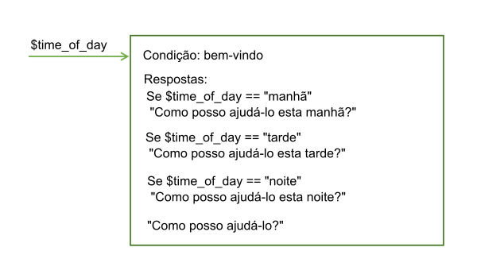
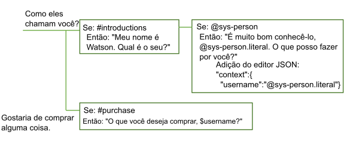
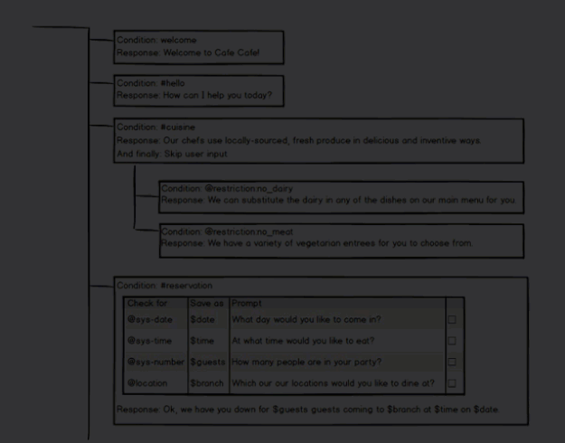

---

copyright:
  years: 2015, 2018
lastupdated: "2018-02-16"

---

{:shortdesc: .shortdesc}
{:new_window: target="_blank"}
{:tip: .tip}
{:pre: .pre}
{:codeblock: .codeblock}
{:screen: .screen}
{:javascript: .ph data-hd-programlang='javascript'}
{:java: .ph data-hd-programlang='java'}
{:python: .ph data-hd-programlang='python'}
{:swift: .ph data-hd-programlang='swift'}

# Como o diálogo é processado
{: #dialog-runtime}

Entenda como seu diálogo é processado quando uma pessoa interage com sua instância do serviço {{site.data.keyword.conversationshort}} implementado no tempo de execução.
{: shortdesc}

## Anatomia de uma chamada de diálogo
{: message-anatomy}

Cada elocução do usuário é passada para o diálogo como uma chamada de API /message. Isso inclui elocuções que os usuários fazem em resposta a prompts do diálogo que fazem perguntas a eles para obter mais informações. Alguns planos de assinatura incluem um número configurado de chamadas API, assim isso ajuda a entender o que constitui uma chamada. Uma única chamada API /message é equivalente a uma única rodada de diálogo, que consiste em uma entrada do usuário e uma resposta correspondente do diálogo.

O corpo da solicitação e resposta de chamada API /message inclui os objetos a seguir:

- `context`: contém as variáveis que devem ser persistidas. Para passar informações de uma chamada para a próxima, o desenvolvedor de aplicativos deve passar o contexto de resposta da chamada API anterior com cada chamada API subsequente. Por exemplo, o diálogo pode coletar o nome do usuário e, então, referir-se ao usuário pelo nome em nós subsequentes.

  ```json
  {
    "context" : {
      "user_name" : "<? @sys-person.literal ?>"
    }
  ```
  {: codeblock}

  Veja [Retendo informações em rodadas de diálogo](dialog-runtime.html#context) para obter mais informações.

- `input`: a sequência de texto que foi enviada pelo usuário. A sequência de texto pode conter até 2.048 caracteres.

  ```json
  {
    "input": {
      "text" : "Where's your nearest store?"
    }
  ```
  {: codeblock}

- `output`: a resposta de diálogo a ser exibida para o usuário. É possível usar esta seção para definir objetos, como variáveis, que não se destinam a ser persistidos. Por exemplo, se você deseja excluir permanentemente uma variável de contexto nomeada `temp` que foi definida em outro lugar no diálogo, é possível usar a expressão a seguir para fazer isso.

  ```json
  {
  "output": {
    "texto" : {}, "deleted_variable" : "<? context.remove('temp') ?>"
  ```
  {: codeblock}

  Veja [Uma resposta complexa](dialog-overview.html#complex) para obter mais informações sobre o objeto de saída.

É possível aprender mais sobre a chamada de API /message na [Referência de API ](https://www.ibm.com/watson/developercloud/conversation/api/v1/){: new_window}.

## Retendo informações em rodadas de diálogo
{: #context}

O diálogo é stateless, significando que ele não retém informações de uma interação com o usuário para a próxima. É responsabilidade do desenvolvedor de aplicativos manter quaisquer informações contínuas que o aplicativo precisa. O aplicativo deve procurar e armazenar o objeto de contexto na resposta da API da mensagem e passá-lo no objeto de contexto com a próxima solicitação de API /message que for feita como parte do fluxo de conversa.

A maneira mais simples de reter as informações é armazenar o objeto de contexto inteiro na memória no aplicativo cliente, um navegador da web, por exemplo. Conforme um aplicativo se torna mais complexo ou se ele precisa passar e armazenar informações pessoalmente identificáveis, é possível armazenar e recuperar as informações de um banco de dados.

O aplicativo pode passar informações para o diálogo e o diálogo pode atualizar essas informações e passá-las de volta para o aplicativo ou para um nó subsequente. O diálogo faz isso usando variáveis de contexto.

Uma variável de contexto é uma variável que você define em um nó e, opcionalmente, para a qual especifica um valor padrão. Outros nós ou lógicas de aplicativo podem posteriormente configurar ou mudar o valor da variável de contexto.

É possível condicionar com relação aos valores das variáveis de contexto referenciando uma variável de contexto de uma condição de nó de diálogo para determinar se deve executar um nó. E você pode referenciar uma variável de contexto de condições de resposta do nó de diálogo para mostrar diferentes respostas, dependendo de um valor fornecido por um serviço externo ou pelo usuário.

### Transmitindo o contexto do aplicativo
{: #context-from-app}

Transmita informações do aplicativo para o diálogo configurando uma variável de contexto e transmitindo a variável de contexto para o diálogo.

Por exemplo, seu aplicativo pode configurar uma variável de contexto $time_of_day e transmiti-la para o diálogo, que pode usar as informações para customizar a saudação exibida para o usuário.



Neste exemplo, o diálogo sabe que o aplicativo configura a variável com um destes valores: *manhã*, *tarde* ou *noite*. Ele pode verificar cada valor e, dependendo de qual valor estiver presente, retornar a saudação apropriada. Se a variável não for transmitida ou possuir um valor que não corresponde a um dos valores esperados, uma saudação mais genérica será exibida para o usuário.

### Transmitindo o contexto de nó para nó
{: #context-node-to-node}

O diálogo também pode incluir variáveis de contexto para transmitir informações de um nó para outro ou para atualizar os valores de variáveis de contexto. Conforme o diálogo pede e obtém informações do usuário, ele pode rastrear as informações e fazer referência a elas mais tarde na conversa.

Por exemplo, em um nó você pode perguntar o nome dos usuários e, em um nó posterior, tratá-los pelo nome.



Neste exemplo, a entidade do sistema @sys-person será usada para extrair o nome do usuário da entrada, se o usuário fornecer um. No editor JSON, a variável de contexto username é definida e configurada com o valor @sys-person. Em um nó subsequente, a variável de contexto $username é incluída na resposta para tratar o usuário pelo nome.

## Definindo uma variável de contexto
{: #context-var-define}

Defina uma variável de contexto definindo um par de nome e valor para a variável em um dos editores a seguir:

- **Editor de contexto**: mostra um campo **Variável** e um campo **Valor** correspondente na visualização de edição do nó que é possível preencher com as informações de nome e valor da variável de contexto.

  **Nota**: esses campos são exibidos automaticamente nos nós que você inclui. Para os nós que foram criados com uma versão anterior do serviço, deve-se abrir o editor de contexto para os campos a serem incluídos.

- **Editor JSON**: quando aberto, ele fornece uma visualização para o conteúdo JSON subjacente que é passado com a solicitação de API /message enviada ao serviço {{site.data.keyword.conversationshort}}. É possível definir variáveis de contexto incluindo pares de nome e valor para a seção `"context":{}` do corpo JSON.

O par de nome e valor deve atender a estes requisitos:

- O `name` pode conter quaisquer caracteres alfabéticos em maiúsculas e minúsculas, caracteres numéricos (0-9) e sublinhados.

  **Nota**: é possível incluir outros caracteres, como pontos e hifens, no nome. No entanto, caso faça isso, deve-se usar uma das abordagens a seguir cada vez que referenciar subsequentemente a variável:

  - **context['variable-name']**

      A sintaxe da expressão SpEL integral.
  - **$(variable-name)**

      Sintaxe abreviada com o nome de variável entre parênteses.
    Consulte [Acessando e avaliando objetos](expression-language.html#shorthand-syntax-for-context-variables) para obter mais detalhes.

- O `value` pode ser qualquer tipo JSON suportado, tal como uma variável de sequencia de caracteres simples, um número ou uma matriz JSON. Quando você define a variável de contexto usando o editor JSON, também é possível especificar um objeto JSON como o valor.

A tabela a seguir mostra como definir pares de nome e valor em campos do editor de variável de contexto:

| Variável       | Valor              |
|:---------------|--------------------|
| dessert        | cake               |
| toppings_array | ["onion","olives"] |
| age            | 18                 |

A amostra JSON a seguir define valores para a sequência $dessert, a matriz $toppings_array e as variáveis de contexto numéricas $age:

```json
{
  "context": {
    "dessert": "cake",
    "toppings_array": ["onion", "olives"],
    "age": 18
  }
}
```
{: codeblock}

Para definir uma variável de contexto, conclua as etapas a seguir:

1.  Defina a variável de contexto na seção do nó que representa o horário em que você deseja que a variável seja configurada durante a avaliação do nó de diálogo.

    **Nota**: quaisquer valores das variáveis de contexto existentes que estão definidos para esse nó são exibidos em um conjunto de campos **Variável** e **Valor** correspondentes. Se você não deseja que eles sejam exibidos na visualização de edição do nó, deve-se fechar o editor de contexto. É possível fechar o editor no mesmo menu que é usado para abri-lo; as etapas a seguir descrevem como acessar o menu.

    - Para incluir uma variável de contexto que é configurada ou mudada após a resposta do nó ser processada, inclua a variável de contexto na seção de resposta.

      Clique no ícone **Opções**  que está associado com a resposta e, em seguida, escolha um editor selecionando uma das opções a seguir:

      - **Abrir o editor da JSON**
      - **Abrir o editor de contexto**

      

      Se a configuração **Múltiplas respostas** é **Ativado** para o nó, deve-se clicar primeiro no ícone **Editar resposta** .

      

    - Para incluir uma variável de contexto que é configurada ou atualizada após uma condição do intervalo ser atendida, clique no ícone **Editar intervalo** . No menu **Opções**  no cabeçalho de visualização *Configurar intervalo*, clique em **Abrir editor JSON**. (Para obter mais informações sobre intervalos, veja [Reunindo informações com intervalos](dialog-slots.html).)

      **Nota**: atualmente não há como usar o editor de contexto para definir as variáveis de contexto configuradas durante esta fase de avaliação do nó de diálogo.

      

    - Para incluir uma variável de contexto que é processada após uma condição de resposta para um intervalo ser atendida, clique no ícone **Editar intervalo** . Clique no ícone **Opções**  e, em seguida, selecione **Ativar respostas condicionais**. Clique no ícone **Editar resposta**  ao lado da resposta com a qual você deseja associar a variável de contexto. Clique no ícone **Opções**  na seção de resposta e, em seguida, escolha um editor selecionando uma das opções a seguir:

      - **Abrir o editor da JSON**
      - **Abrir o editor de contexto**

      
1.  Para definir a variável de contexto no editor de contexto, inclua o par de nome e valor de variável nos campos **Variável** e **Valor**.
1.  Para definir a variável de contexto no editor JSON, conclua estas etapas adicionais:

    - Inclua um bloco `"context":{}` se um não estiver presente.

      ```json
      {
        "context":{},
      "output":{}
    }
      ```
      {: codeblock}

    - No bloco de contexto, inclua um par de nome e valor para cada variável de contexto que você deseja definir.

      ```json
      {
        "context":{
          "name": "value"
      }, "output": {} }
      ```
      {: codeblock}

    Neste exemplo, uma variável nomeada `new_variable` é incluída em um bloco de contexto que já contém uma variável.

    ```json
    {
      "context":{
        "existing_variable": "value",
        "new_variable":"value"
      }
    }
    ```
    {: codeblock}

    Para referenciar a variável de contexto subsequentemente, use a sintaxe `$name` em que *name* é o nome da variável de contexto que você definiu. Por exemplo, `$new_variable`.

## Tarefas comuns de variável de contexto
{: #context-common-tasks}

Para armazenar a sequência inteira que foi fornecida pelo usuário como entrada, use `input.text`:

| Variável | Valor            |
|----------|------------------|
| repeat   | `<?input.text?>` |

```json
{
  "context": {
    "repeat": "<?input.text?>"
      }
}
```
{: codeblock}

Para armazenar o valor de uma entidade em uma variável de contexto, use esta sintaxe:

| Variável | Valor            |
|----------|------------------|
| place    | @place           |

```json
{
  "context": {
    "place": "@place"
  }
}
```
{: codeblock}

É possível incluir um objeto JSON em uma variável de contexto usando um ou outro editor. A expressão a seguir define um objeto full_name que contém um conjunto de primeiro e último valores, que juntos formam o nome completo de uma pessoa.

| Variável      | Valor            |
|---------------|------------------|
| full_name     | { "first":"Paul", "last":"Smith" } |

```json
{
  "context": {
    "full_name": {
      "first":"Paul",
      "last":"Smith"
      }
  }
}
```
{: codeblock}

Se você especifica `$full_name.first` na resposta, `Paul` é exibido.

Para armazenar o valor de uma sequência extraída da entrada do usuário, é possível incluir uma expressão SpEL que usa o método de extração para aplicar uma expressão regular à entrada do usuário. A expressão a seguir extrai um número da entrada do usuário e o salva na variável de contexto `$number`.

| Variável | Valor                               |
|----------|-------------------------------------|
| número   | `<?input.text.extract('[\d]+',0)?>` |

```json
{
  "context": {
     "number": "<?input.text.extract('[\\d]+',0)?>"
  }
}
```
{: codeblock}

Quando você define uma expressão regular no editor JSON, deve-se escapar quaisquer barras invertidas usadas na expressão com outra barra invertida (`\\`). Você não precisa escapar as barras invertidas em expressões regulares definidas usando o editor de variável de contexto.
{: tip}

Para armazenar o valor de uma entidade padrão, anexe .literal ao nome da entidade. O uso desta sintaxe assegura que a extensão exata de texto da entrada do usuário que correspondeu ao padrão especificado seja armazenada na variável.

| Variável | Valor            |
|----------|------------------|
| email    | @email.literal   |

```json
{
  "context": {
    "e-mail": "<? @email.literal?>"
  }
}
```
{: codeblock}

## Excluindo uma variável de contexto
{: #context-delete}

Para excluir uma variável de contexto, configure a variável para nulo.

```json
{
  "context": {
    "order_form": null
  }
}
```
{: codeblock}

Se você deseja remover todo rastreio da variável de contexto, é possível usar o método JSONObject.remove(string) para excluí-lo do objeto de contexto. No entanto, deve-se usar uma variável para executar a remoção. Defina a nova variável na saída de mensagem para que ela não seja salva além da chamada atual.

```json
{
  "output": {
    "texto" : {}, "deleted_variable" : "<? context.remove('order_form') ?>"
  }
}
```
{: codeblock}

Como alternativa, é possível excluir a variável de contexto na sua lógica de aplicativo.

### Ordem de operação
{: #context-order-of-ops}

A ordem na qual você define as variáveis de contexto não determina a ordem na qual elas são avaliadas pelo serviço. O serviço avalia as variáveis, que são definidas como pares de nome e valor JSON, em ordem aleatória. Não configure um valor na primeira variável de contexto e espere ser capaz de usá-lo na segunda, porque não há garantia de que a primeira variável de contexto em sua lista será executada antes da segunda em sua lista. Por exemplo, não use duas variáveis de contexto para implementar a lógica que retorna um número aleatório entre zero e algum valor mais alto que é transmitido ao nó.

```json
"context": {
    "upper": "<? @sys-number.numeric_value + 1?>",
    "answer": "<? new Random().nextInt($upper) ?>"
}
```
{: codeblock}

Use uma expressão um pouco mais complexa para evitar ter que depender do valor da variável de contexto $upper ser avaliado antes da variável de contexto $answer ser avaliada.

```json
"context": {
    "answer": "<? new Random().nextInt(@sys-number.numeric_value + 1) ?>"
}
```
{: codeblock}

### Armazenando valores de entidade padrão
{: #context-pattern-entities}

Para armazenar o valor de uma entidade padrão em uma variável de contexto, anexe .literal ao nome da entidade. O uso desta sintaxe assegura que a extensão exata de texto da entrada do usuário que correspondeu ao padrão especificado seja armazenada na variável.

```json
{
  "context": {
    "e-mail": "<? @email.literal?>"
  }
}
```
{: codeblock}

Para armazenar o texto de um único grupo em uma entidade padrão com grupos definidos, especifique o número da matriz do grupo que você deseja armazenar. Por exemplo, suponha que o padrão de entidade seja definido como a seguir para a entidade @phone_number. (Lembre-se, os parênteses denotam grupos padrão):

`\b((958)|(555))-(\d{3})-(\d{4})\b`

Para armazenar somente o código de área do número do telefone especificado na entrada do usuário, é possível usar a sintaxe a seguir:

```json
{
  "context": {
    "area_code": "<? @phone_number.groups[1] ?>"
  }
}
```
{: codeblock}

Os grupos são delimitados pela expressão regular que é usada para definir o padrão de grupo. Por exemplo, se a entrada do usuário que corresponde ao padrão definido na entidade `@phone_number` é: `958-234-3456`, os grupos a seguir são criados:

| Número do grupo | Valor do mecanismo Regex  | Valor do diálogo   | Explicação |
|--------------|---------------------|----------------|-------------|
| groups[0]    | `958-234-3456`      | `958-234-3456` | O primeiro grupo é sempre a sequência de correspondência total. |
| groups[1]    | `((958)`l`(555))`   | `958`          | A sequência que corresponde ao regex para o primeiro grupo definido, que é `((958)`l`(555))`. |
| groups[2]    | `(958)`             | `958`          | Correspondência com relação ao grupo incluído como o primeiro operando na expressão OR `((958)`l`(555))` |
| groups[3]    | `(555)`             | `null`         | Nenhuma correspondência com relação ao grupo que é incluído como o segundo operando na expressão OR `((958)`l`(555))` |
| groups[4]    | `(\d{3})`           | `234`          | Sequência que corresponde à expressão regular que está definida para o grupo. |
| groups[5]    | `(\d{4})`           | `3456`         | Sequência que corresponde à expressão regular que está definida para o grupo. |
{: caption="Detalhes do grupo" caption-side="top"}

Para ajudá-lo a decifrar qual número de grupo usar para capturar a seção de entrada em que você está interessado, é possível extrair informações sobre todos os grupos de uma vez. Use a sintaxe a seguir para criar uma variável de contexto que retorna uma matriz de todas as correspondências de entidade padrão agrupadas:

```json
{
  "context": {
    "array_of_matched_groups": "<? @phone_number.groups ?>"
  }
}
```
{: codeblock}

Use a área de janela "Experimente" para inserir alguns valores de número de telefone de teste. Para a entrada `958-123-2345`, essa expressão configura `$array_of_matched_groups` para `["958-123-2345","958","958",null,"123","2345"]`.

É possível então contar cada valor na matriz iniciando com 0 para obter o número do grupo para ele.

| Valor do elemento de matriz | Número do elemento de matriz |
|---------------------|----------------------|
| "958-123-2345"      | 0 |
| "958"               | 1 |
| "958"               | 2 |
| null                | 3 |
| "123"               | 4 |
| "2345"              | 5 |
{: caption="Elementos de matriz" caption-side="top"}

É fácil determinar que, para capturar os últimos quatro dígitos do número de telefone, você precisa do grupo #5, por exemplo.

Para retornar a estrutura JSONArray que é criada para representar a entidade padrão agrupada, use a sintaxe a seguir:

```json
{
  "context": {
    "json_matched_groups": "<? @phone_number.groups_json ?>"
  }
}
```
{: codeblock}

Essa expressão configura `$json_matched_groups` para a matriz JSON a seguir:

```json
[
  {"group": "group_0","location": [0, 12]},
  {"group": "group_1","location": [0, 3]},
  {"group": "group_2","location": [0, 3]},
  {"group": "group_3"},
  {"group": "group_4","location": [4, 7]},
  {"group": "group_5","location": [8, 12]}
]
```
{: codeblock}

**Nota**: `local` é uma propriedade de uma entidade que usa um deslocamento de caractere baseado em zero para indicar onde o valor de entidade detectado inicia e termina no texto de entrada.

Se você espera que dois números de telefone sejam fornecidos na entrada, é possível verificar dois números de telefone. Se presentes, use a sintaxe a seguir para capturar o código de área do segundo número, por exemplo.

```json
{
  "context": {
    "second_areacode": "<? entities['phone_number'][1].groups[1] ?>"
  }
}
```
{: codeblock}

Se a entrada é `I want to change my phone number from 958-234-3456 to 555-456-5678`, `$second_areacode` é igual a `555`.

## Atualizando um valor da variável de contexto
{: #context-update}

Se um nó configura o valor de uma variável de contexto que já foi configurado, o valor anterior é sobrescrito.

### Atualizando um objeto JSON complexo

Os valores anteriores são sobrescritos para todos os tipos de JSON, exceto um objeto JSON. Se a variável de contexto é um tipo complexo tal como o objeto JSON, um procedimento de mesclagem JSON é usado para atualizar a variável. A operação de mesclagem inclui quaisquer propriedades recém-definidas e sobrescreve quaisquer propriedades existentes do objeto.

Neste exemplo, uma variável de contexto name é definida como um objeto complexo.

```json
{
  "context": {
    "complex_object": {
      "user_firstname" : "Paul",
      "user_lastname" : "Pan",
      "has_card" : false
    }
  }
}
```
{: codeblock}

Um nó de diálogo atualiza o objeto JSON da variável de contexto com os valores a seguir:

```json
{
  "complex_object": {
    "user_firstname": "Peter",
    "has_card": true
  }
}
```
{: codeblock}

O resultado é este contexto:

```json
{
  "complex_object": {
    "user_firstname": "Peter",
    "user_lastname": "Pan",
    "has_card": true
  }
}
```
{: codeblock}

Veja [Métodos de linguagem de expressão](dialog-methods.html#objects) para obter mais informações sobre os métodos que podem ser executados em objetos.

### Atualizando matrizes

Se seus dados de contexto de diálogo contiverem uma matriz de valores, você poderá atualizar a matriz anexando valores, removendo um valor ou substituindo todos os valores.

Escolha uma dessas ações para atualizar a matriz. Em cada caso, vemos a matriz antes da ação, a ação e a matriz após a ação ter sido aplicada.

- **Anexar**: para incluir valores no final de uma matriz, use o método `append`.

    Para esse Contexto de tempo de execução de diálogo:

    ```json
    {
      "context": {
        "toppings_array": ["onion", "olives"]
      }
    }
    ```
    {: codeblock}

    Faça essa atualização:

    ```json
    {
      "context": {
        "toppings_array": "<? $toppings_array.append('ketchup', 'tomatoes') ?>"
      }
    }
    ```
    {: codeblock}

    Resultado:

    ```json
    {
      "context": {
        "toppings_array": ["onion", "olives", "ketchup", "tomatoes"]
      }
    }
    ```
    {: codeblock}

- **Remover**: Para remover um elemento, use o método `remove` e especifique seu valor ou posição na matriz.

    - **Remover por valor** remove um elemento de uma matriz por seu valor.

        Para esse Contexto de tempo de execução de diálogo:

        ```json
        {
          "context": {
            "toppings_array": ["onion", "olives"]
          }
        }
        ```
        {: codeblock}

        Faça essa atualização:

        ```json
        {
          "context": {
            "toppings_array": "<? $toppings_array.removeValue('onion') ?>"
          }
        }
        ```
        {: codeblock}

        Resultado:

        ```json
        {
          "context": {
            "toppings_array": ["olives"]
          }
        }
        ```
        {: codeblock}

    - **Remover por posição**: removendo um elemento de uma matriz por sua posição de índice:

        Para esse Contexto de tempo de execução de diálogo:

        ```json
        {
          "context": {
            "toppings_array": ["onion", "olives"]
          }
        }
        ```
        {: codeblock}

        Faça essa atualização:

        ```json
        {
          "context": {
            "toppings_array": "<? $toppings_array.remove(0) ?>"
          }
        }
        ```
        {: codeblock}

        Resultado:

        ```json
        {
          "context": {
            "toppings_array": ["olives"]
          }
        }
        ```
        {: codeblock}

- **Sobrescrever**: para sobrescrever os valores em uma matriz, simplesmente configure a matriz com os novos valores:

    Para esse Contexto de tempo de execução de diálogo:

        ```json
        {
          "context": {
            "toppings_array": ["onion", "olives"]
          }
        }
        ```
        {: codeblock}

    Faça essa atualização:

        ```json
        {
          "context": {
            "toppings_array": ["ketchup", "tomatoes"]
          }
        }
        ```
        {: codeblock}

    Resultado:

        ```json
        {
          "context": {
            "toppings_array": ["ketchup", "tomatoes"]
          }
        }
        ```
        {: codeblock}

Veja [Métodos de linguagem de expressão](dialog-methods.html#arrays) para obter mais informações sobre os métodos que podem ser executados em matrizes.

## Digressões
{: #digressions}

Uma digressão ocorre quando um usuário está no meio de um fluxo de diálogo projetado para endereçar um objetivo e alterna abruptamente os tópicos para iniciar um fluxo de diálogo projetado para endereçar um objetivo diferente. O diálogo sempre suportou a capacidade do usuário de mudar assuntos. Se nenhum dos nós na ramificação de diálogo que está sendo processada corresponde ao objetivo da entrada mais recente do usuário, a conversa volta para a árvore para verificar as condições do nó raiz para uma correspondência apropriada. As configurações de digressão que estão disponíveis por nó fornecem a capacidade de customizar esse comportamento ainda mais.

Com as configurações de digressão, é possível permitir que a conversa retorne para o fluxo de diálogo que foi interrompido quando a digressão ocorreu. Por exemplo, o usuário pode estar pedindo um novo telefone, mas alterna os tópicos para perguntar sobre tablets. Seu diálogo pode responder à pergunta sobre tablets e depois levar o usuário de volta para onde ele parou no processo de pedir um telefone. Permitir que digressões ocorram e retornem fornece a seus usuários mais controle sobre o fluxo da conversa no tempo de execução. Eles podem mudar tópicos, seguir um fluxo de diálogo sobre o tópico não relacionado até seu término e, em seguida, retornar para onde estavam antes. O resultado é um fluxo de diálogo que simula mais estritamente uma conversa entre humanos.

A imagem a seguir usa um modelo da interface com o usuário da árvore de diálogo para ilustrar o conceito de uma digressão. Ela mostra como um usuário interage com os nós de diálogo que são configurados para permitir digressões que retornam ao fluxo de diálogo que estava em andamento. O usuário começa a fornecer as informações necessárias para fazer uma reserva de jantar. No meio de preenchimento de intervalos no nó #reservation, o usuário faz uma pergunta sobre as opções de menu vegetariano. O diálogo responde à nova pergunta do usuário localizando um nó que a endereça entre os nós raiz (um nó que condiciona na intenção #cuisine). Em seguida, retorna à conversa que estava em andamento mostrando o prompt para o próximo intervalo vazio do nó de diálogo original.



### Antes de iniciar

Ao testar seu diálogo geral, decida quando e onde faz sentido permitir que digressões e devoluções de digressões ocorram. Os controles de digressão a seguir são aplicados aos nós automaticamente. Tome a ação somente se desejar mudar esse comportamento padrão.

- Cada nó raiz em seu diálogo está configurado para permitir que as digressões os destinem por padrão. Os nós-filhos não podem ser o destino de uma digressão.
- Os nós com intervalos são configurados para evitar digressões fora. Todos os outros nós são configurados para permitir digressões fora. No entanto, a conversa não pode digressionar fora de um nó sob as circunstâncias a seguir:

  - Se algum dos nós-filhos do nó atual contém a condição `anything_else` ou `true`

    Essas condições são especiais por serem sempre avaliadas como true. Por causa de seu comportamento conhecido, elas são frequentemente usadas em diálogos para forçar um nó pai a avaliar um nó-filho específico sucessivamente. Para evitar a quebra da lógica do fluxo de diálogo existente, a digressão não é permitida neste caso. Antes de poder ativar digressões fora de, por exemplo, um nó, deve-se mudar a condição do nó-filho para outra coisa.

  - Se o nó estiver configurado para ir para outro nó ou ignorar a entrada do usuário após ela ser processada

    A seção de etapa final de um nó especifica o que deve acontecer após o nó ser processado. Quando o diálogo é configurado para ir diretamente para outro nó, é frequentemente para assegurar que uma sequência específica seja seguida. E quando o nó é configurado para ignorar entrada do usuário, é equivalente a forçar o diálogo para processar o primeiro nó-filho após o nó atual sucessivamente. Para evitar a quebra da lógica do fluxo de diálogo existente, as digressões não são permitidas em qualquer um desses casos. Antes de poder ativar as digressões fora desse nó, deve-se mudar o que é especificado na seção de etapa final.

### Customizando digressões
{: #enable-digressions}

Você não define o início e o término de uma digressão. O usuário está inteiramente no controle do fluxo de digressão no tempo de execução. Você somente especifica como cada nó deve ou não deve participar em uma digressão liderada pelo usuário. Para cada nó, você configura se:

- uma digressão pode ser iniciada no nó e deixar o nó
- uma digressão iniciada em outro lugar pode destinar e inserir o nó
- uma digressão que é iniciada em outro lugar e insere o nó deve retornar para o fluxo de diálogo interrompido após o fluxo de diálogo atual ser concluído

Para mudar o comportamento de digressão para um nó individual, conclua as etapas a seguir:

1.  Clique no nó para abrir sua visualização de edição.

1.  Clique em **Customizar** e, em seguida, clique na guia **Digressões**.

    As opções de configuração diferem dependendo se o nó que você está editando é um nó raiz, um nó-filho, um nó com filhos ou um nó com intervalos.

    **Digressions fora desse nó**

    Se as circunstâncias listadas anteriormente não se aplicam, é possível fazer as opções a seguir:

    - **Todos os tipos de nós**: escolha se deseja permitir a digressão do nó atual pelos usuários antes de atingirem o término da ramificação do diálogo atual.

    - **Todos os nós que têm filhos**: escolha se você deseja que a conversa volte para o nó atual após uma digressão se a resposta do nó atual já foi exibida e seus nós-filhos são incidentais com o objetivo do nó. Configure a alternância *Permitir retorno de digressões acionadas após a resposta deste nó* para **Não** para evitar que o diálogo retorne para o nó atual e continue a processar sua ramificação.

      Por exemplo, se o usuário pergunta `Deseja vender cupcakes?` e a resposta `Oferecemos cupcakes em uma variedade de sabores e tamanhos` é exibida antes de o usuário mudar os assuntos, você talvez não deseje que o diálogo retorne para onde parou. Especialmente, se os nós-filhos direcionam somente perguntas de acompanhamento possíveis do usuário e podem ser ignorados com segurança.

      No entanto, se o nó depende de seus nós-filhos para direcionar a questão, você pode desejar forçar a conversa para retornar e continuar processando os nós na ramificação atual. Por exemplo, a resposta inicial pode ser `We offer cupcakes in all shapes and sizes. Which menu do you want to see: gluten-free, dairy-free, or regular?` Se o usuário muda os assuntos neste momento, você pode desejar que o diálogo seja retornado para que o usuário possa escolher um tipo de menu e obter as informações desejadas.

    - **Nós com intervalos**: escolha se você deseja permitir aos usuários digressionar fora do nó antes de todos os intervalos serem preenchidos. Configure a alternância *Permitir digressões fora durante o preenchimento de intervalo* para **Sim** para ativar digressões fora.

      Se ativado, quando a conversa retorna da digressão, o prompt para o próximo intervalo vazio é exibido para encorajar o usuário a continuar fornecendo informações. Se desativado, quaisquer entradas enviadas pelo usuário que não contêm um valor que possa preencher um intervalo são ignoradas. No entanto, é possível direcionar questões não solicitadas que você prevê que os usuários podem perguntar enquanto interagem com o nó definindo manipuladores de intervalos. Consulte [Incluindo intervalos](dialog-slots.html#add-slots) para obter mais informações.

      A imagem a seguir mostra como as digressões fora do nó #reservation com intervalos (mostrados na ilustração anterior) são configuradas.

      

    - **Nós com intervalos**: escolha se o usuário será permitido somente digressionar fora se ele retornar para o nó atual marcando a caixa de seleção **Somente digressionar de intervalos para os nós que permitem devoluções**.

      Quando selecionado, conforme o diálogo procura um nó para responder à pergunta não relacionada do usuário, ele ignora quaisquer nós raiz que não estão configurados para retornar após a digressão. Marque essa caixa de seleção se você deseja evitar que os usuários sejam capazes de deixar permanentemente o nó antes de terem concluído o preenchimento dos intervalos necessários.

    **Digressões neste nó**

    É possível fazer as opções a seguir sobre como as digressões em um nó se comportam:

    - Evitar que os usuários possam digressionar no nó. Veja [Desativando digressões em um nó raiz](#diable-digressions) para obter mais detalhes.

    - Quando as digressões no nó são ativadas, escolha se o diálogo deve voltar para o fluxo de diálogo do qual ele é digressionado. Quando selecionado, após a ramificação do nó atual terminar de ser processada, o fluxo de diálogo volta para o nó interrompido. Para fazer o diálogo retornar depois disso, selecione **Retornar após digressão**.

    A imagem a seguir mostra como as digressões no nó #cuisine (mostrado na ilustração anterior) são configuradas.

    

1.  Clique em **Aplicar**.

1.  Use a área de janela "Experimente" para testar o comportamento de digressão.

    Novamente, não é possível definir o início e o término de uma digressão. O usuário controla onde e quando as digressões acontecem. É possível aplicar somente configurações que determinam como um único nó participa de uma. Como as digressões são imprevisíveis, é difícil saber como suas decisões de configuração impactarão a conversa geral. Para realmente ver o impacto das opções feitas, deve-se testar o diálogo.

Os nós #reservation e #cuisine representam duas ramificações de diálogo que podem participar de uma única digressão direcionada ao usuário. As configurações de digressão definidas para cada nó individual são o que torna esse tipo de digressão possível no tempo de execução.


### Desativando digressões em um nó raiz
{: #disable-digressions}

Quando um fluxo digressiona em um nó raiz, ele segue o caminho do diálogo que está configurado para esse nó. Em seguida, ele pode processar uma série de nós-filhos antes de atingir o final da ramificação de nós e, então, se configurado para fazer isso, volta para o fluxo de diálogo que foi interrompido. Por meio do teste de diálogo, você pode achar que um nó raiz é acionado com muita frequência, ou em horários inesperados, ou que seu diálogo é muito complexo e leva o usuário muito longe do curso para ser um bom candidato a uma digressão provisória. Se você determina que prefere não permitir que usuários digressionem nele, é possível configurar o nó raiz para não permitir digressões dentro dele.

Para desativar completamente as digressões em um nó raiz, conclua as etapas a seguir:

1.  Clique para abrir o nó raiz que você deseja editar.
1.  Clique em **Customizar** e, em seguida, clique na guia **Digressões**.
1.  Configure a alternância *Permitir digressões neste nó* para **Desativado**.
1.  Clique em **Aplicar**.

Se você decide que deseja evitar digressões em vários nós raiz, mas não deseja editar cada um individualmente, é possível incluir os nós em uma pasta. Na página *Customizar* da pasta, é possível configurar a alternância *Permitir digressões neste nó* para **Desativado** para aplicar a configuração a todos os nós de uma vez. Veja [Organizando o diálogo com pastas](dialog-build.html#folders) para obter mais informações.

### Considerações de design
{: #digression-design-considerations}

- **Evite proliferação do nó de fallback**: muitos designers de diálogo incluem um nó com uma condição `true` ou `anything_else` no término de cada ramificação de diálogo como uma maneira de evitar que os usuários fiquem presos na ramificação. Esse design retorna uma mensagem genérica se a entrada do usuário não corresponde nada que você previu e incluiu um nó de diálogo específico para direcionar. No entanto, os usuários não podem digressionar fora de fluxos de diálogo que usam essa abordagem.

  Avalie as ramificações que usam essa abordagem para determinar se seria melhor permitir digressões fora da ramificação. Se a entrada do usuário não corresponde nada que você previu, ela pode localizar uma correspondência com relação a um fluxo de diálogo totalmente diferente em sua árvore. Em vez de responder com uma mensagem genérica, é possível colocar efetivamente o resto do diálogo para trabalhar para tentar direcionar a entrada do usuário. Além disso, o nó `Anything else` de nível raiz pode sempre responder à entrada que nenhum dos outros nós raiz pode direcionar.

- **Reconsidere saltos para um nó de fechamento**: muitos diálogos são projetados para fazer uma pergunta de fechamento padrão, como `Did I answer your question today?` Os usuários não podem digressionar fora dos nós que estão configurados para ir para outro nó. Então, se você configura todos os nós de ramificação final para ir para um nó de fechamento comum, as digressões não podem ocorrer. Considere rastrear a satisfação do usuário por meio de métricas ou algum outro meio.

- **Teste possíveis cadeias de digressão**: se um usuário digressiona fora do nó atual para outro nó que permite digressões fora, o usuário pode potencialmente digressionar fora daquele outro nó e repetir esse padrão uma ou mais vezes novamente. Se todos os nós na cadeia de digressão forem configurados para retornar após a digressão, o usuário será eventualmente trazido de volta ao nó de diálogo atual. No entanto, teste os cenários que digressionam múltiplas vezes para determinar se os nós individuais funcionam conforme o esperado.

- **Lembre-se de que o nó atual tem prioridade**: lembre-se de que os nós fora do fluxo atual somente são considerados como destinos de digressão se o fluxo atual não pode direcionar a entrada do usuário. É ainda mais importante em um nó com intervalos que permite digressões fora, em particular, deixar claro aos usuários quais informações são necessárias deles e incluir instruções de confirmação que são exibidas após o usuário fornecer um valor.

  Qualquer intervalo pode ser preenchido durante o processo de preenchimento de intervalo. Portanto, um intervalo pode capturar entrada do usuário inesperadamente. Por exemplo, talvez você tenha um nó com intervalos que coleta as informações necessárias para fazer uma reserva de jantar. Um dos intervalos coleta informações de data. Ao fornecer os detalhes de reserva, o usuário pode perguntar `What's the weather meant to be tomorrow?` Você pode ter um nó raiz que condiciona em #forecast o que pode responder ao usuário. No entanto, como a entrada do usuário inclui a palavra `tomorrow` e o nó de reserva com intervalos está sendo processado, o serviço presume que o usuário está fornecendo ou atualizando a data de reserva. *O nó atual sempre tem prioridade.* Se você define uma instrução de confirmação clara, como `Ok, setting the reservation date to tomorrow,` é mais provável que o usuário perceba que houve um erro de comunicação e o corrige.

  Por outro lado, enquanto preenche os intervalos, se o usuário fornece um valor que não é esperado por nenhum dos intervalos, há uma chance que ele corresponderá com relação a um nó raiz completamente não relacionado para o qual o usuário nunca pretendeu digressionar.

  Certifique-se de fazer vários testes enquanto você configura o comportamento de digressão.

- **Ao usar digressões em vez de manipuladores de intervalos**: para perguntas gerais que os usuários podem fazer a qualquer momento, use um nó raiz que permita digressões nele, processe a entrada e depois volte para o fluxo que estava em andamento. Para os nós com intervalos, tente prever os tipos de perguntas relacionadas que os usuários podem desejar fazer ao preencher os intervalos e direcione-os incluindo manipuladores no nó.

  Por exemplo, se o nó com intervalos coleta as informações necessárias para preencher uma solicitação de seguro, você pode desejar incluir manipuladores que direcionam perguntas comuns sobre o seguro. No entanto, para perguntas sobre como obter ajuda, ou seus locais de lojas ou o histórico de sua empresa, use um nó de nível raiz.
