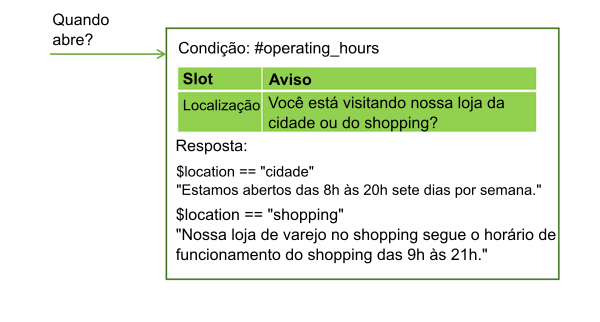
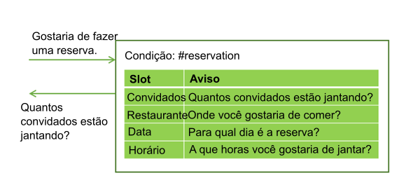
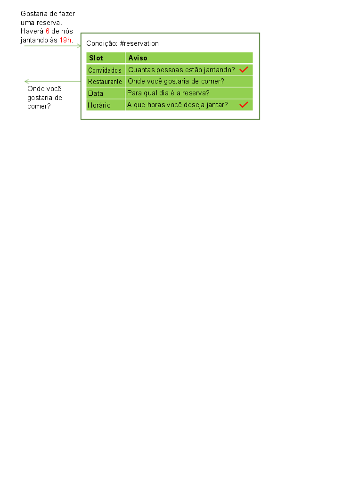
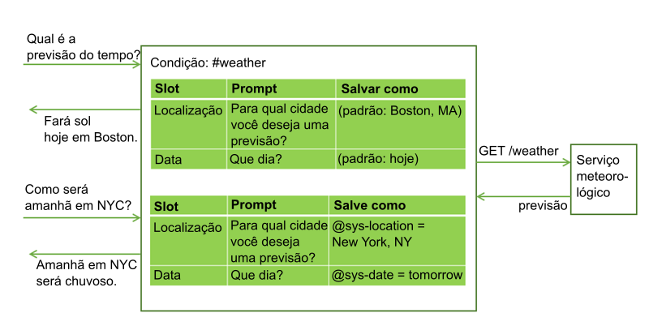
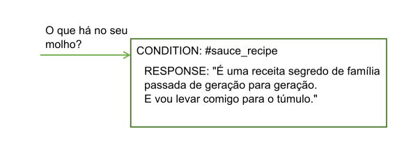

---

copyright:
  years: 2015, 2019
lastupdated: "2019-02-28"

subcollection: assistant

---

{:shortdesc: .shortdesc}
{:new_window: target="_blank"}
{:deprecated: .deprecated}
{:important: .important}
{:note: .note}
{:tip: .tip}
{:pre: .pre}
{:codeblock: .codeblock}
{:screen: .screen}
{:javascript: .ph data-hd-programlang='javascript'}
{:java: .ph data-hd-programlang='java'}
{:python: .ph data-hd-programlang='python'}
{:swift: .ph data-hd-programlang='swift'}
{:table: .aria-labeledby="caption"}

# Reunindo informações com intervalos
{: #dialog-slots}

Inclua intervalos em um nó de diálogo para reunir várias partes de informações de um usuário dentro desse nó. Os intervalos coletam informações no ritmo dos usuários. Detalhes que o usuário fornece inicialmente são salvos e o serviço pede apenas os detalhes não fornecidos.

<iframe class="embed-responsive-item" id="youtubeplayer" title="Incluindo intervalos em um nó" type="text/html" width="640" height="390" src="https://www.youtube.com/embed/kMLyKfmO9wI?rel=0" frameborder="0" webkitallowfullscreen mozallowfullscreen allowfullscreen> </iframe>

## Por que incluir intervalos?
{: #dialog-slots-why}

Use intervalos para obter as informações de que precisa antes de poder responder com precisão ao usuário. Por exemplo, se os usuários perguntarem sobre as horas de funcionamento, mas as horas diferirem por localização da loja, você poderá fazer uma pergunta complementar sobre qual local da loja eles planejam visitar antes de responder. Em seguida, será possível incluir condições de resposta que considerem as informações de local fornecidas.



Os intervalos podem ajudá-lo a coletar várias partes de informações que você precisa para concluir uma tarefa complexa para um usuário, tal como fazer uma reserva para jantar.



O usuário pode fornecer valores para vários intervalos de uma vez. Por exemplo, a entrada poderia incluir as informações `There will be 6 of us dining at 7 PM.` Esta entrada contém dois dos valores necessários ausentes: o número de convidados e o horário da reserva. O serviço reconhece e armazena ambos, cada um em seu intervalo correspondente. Ele então exibe o prompt que está associado ao próximo intervalo vazio.



Os intervalos tornam possível para o serviço responder às perguntas complementares sem precisar restabelecer o objetivo do usuário. Por exemplo, um usuário pode solicitar uma previsão do tempo, então fazer uma pergunta complementar sobre o clima em outro local ou em um dia diferente. Se você salvar as variáveis de previsão necessárias, como local e dia, em intervalos, se um usuário fizer uma pergunta complementar com novos valores de variáveis, você poderá sobrescrever os valores de intervalo com os novos valores fornecidos, e dar uma resposta que reflita as novas informações. (Para obter mais informações sobre como chamar um serviço externo por meio de um diálogo, veja [Fazendo chamadas programáticas por meio de um nó de diálogo](/docs/services/assistant?topic=assistant-dialog-actions)).



O uso de intervalos produz um fluxo de diálogo mais natural entre o usuário e o serviço e é mais fácil para você gerenciar do que tentar coletar as informações usando muitos nós separados.

## Incluindo intervalos
{: #dialog-slots-add}

1.  Identifique as unidades de informações que deseja coletar. Por exemplo, para pedir uma pizza para alguém, você pode desejar coletar as informações a seguir:

    - Horário da entrega
    - Tamanho

1.  Se você não começou a criar um diálogo, siga as instruções em [Criando um diálogo](/docs/services/assistant?topic=assistant-dialog-build) para criar um.

1.  Na visualização de edição do nó de diálogo, clique em **Customizar** e, em seguida, clique na alternância próxima a **Intervalos** para **Ativar**.

    Para obter mais informações sobre a caixa de seleção **Solicitar tudo**, consulte [Solicitando tudo de uma vez](#dialog-slots-prompt-for-everything).

1.  **Inclua um intervalo para cada unidade de informações necessárias**. Para cada intervalo, especifique estes detalhes:

    - **Verificar**: identifique o tipo de informações que deseja extrair da resposta do usuário para o prompt do intervalo. Na maioria dos casos, você verifica os valores de entidade. Na verdade, o construtor de condição que é exibido sugere entidades que você pode procurar. No entanto, também é possível verificar uma intenção; apenas digite o nome da intenção no campo. É possível usar os operadores AND e OR aqui para definir condições mais complexas.

      O valor *Verificar* é usado primeiro como uma condição, mas depois se torna o valor da variável de contexto que você nomeia no campo *Salvar como*. Ele especifica **o que verificar** e **o que salvar**. Se você desejar mudar como o valor é salvo, inclua a expressão que reformata o valor para o campo *Verificar*.
      {: important}

      Por exemplo, se a entidade for uma entidade padrão, tal como `@email`, depois de incluir o nome da entidade, anexe `.literal` a ele. A inclusão de `.literal` indica que você deseja capturar o texto exato que foi inserido pelo usuário e foi identificado como um endereço de e-mail com base em seu padrão.

      Em alguns casos, você pode desejar usar uma expressão para capturar o valor, mas não aplicar a expressão ao que está salvo. Nesses casos, é possível usar um valor no campo *Verificar* para capturar o valor e, em seguida, abrir o editor JSON para mudar o valor da variável de contexto, assim ele salva algo mais. Consulte [Tratar zeros adequadamente](/docs/services/assistant?topic=assistant-tutorial-slots-complex#tutorial-slots-complex-recognize-zero) para obter um exemplo.

      Qualquer edição que for feita no valor da variável de contexto de um intervalo no editor JSON não será refletida no campo **Verificar** quando você sair do editor JSON. E, se você clicar no campo **Verificar** para focar o campo a qualquer momento depois de usar o editor JSON para editar o valor, a mudança feita será perdida.
      {: important}

      Evite verificar os valores das variáveis de contexto no campo *Verificar*. Como o valor verificado é também o valor que é salvo, o uso de uma variável de contexto na condição pode levar a um comportamento inesperado.

    - **Salvar como**: forneça um nome para a variável de contexto na qual armazenar o valor de interesse da resposta do usuário no prompt do intervalo.

       Não reutilize uma variável de contexto que é usada em outro lugar no diálogo. Se a variável de contexto já tiver um valor, o prompt do intervalo não será exibido. Somente quando a variável de contexto para o intervalo é nula que o prompt para o intervalo é exibido.

    - **Prompt**: grave uma instrução que extraia a parte das informações que você precisa do usuário. Após exibir esse prompt, a conversa pausa e o serviço aguarda o usuário responder.

    - Se você desejar que diferentes instruções de acompanhamento sejam mostradas com base no fato de o usuário fornecer as informações necessárias em resposta ao prompt de intervalo inicial, será possível editar o intervalo (clicando no ícone **Editar intervalo** ) e definir as instruções de acompanhamento:

      - **Localizado**: exibido após o usuário fornecer as informações esperadas.

      - **Não localizado**: exibido se as informações fornecidas pelo usuário não são compreendidas ou não são fornecidas no formato esperado. Se o intervalo é preenchido com êxito ou a entrada do usuário é compreendida e manipulada por um manipulador de intervalo, essa instrução nunca é exibida.

      Para obter informações sobre como definir condições e ações associadas para respostas Localizado e Não localizado, veja [Incluindo condições em respostas Localizado e Não localizado](#dialog-slots-handler-next-steps).

    Esta tabela mostra valores de intervalo de exemplo para um nó que ajuda os usuários a fazerem um pedido de pizza coletando duas informações, o tamanho da pizza e o horário da entrega.

    <table>
    <caption>Intervalos de exemplo para pedido de pizza</caption>
    <tr>
      <th>Verificar</th>
      <th>Salvar como</th>
      <th>Prompt</th>
      <th>Acompanhar, se localizado</th>
      <th>Acompanhar, se não localizado</th>
    </tr>
    <tr>
      <td>@size</td>
      <td>$size</td>
      <td>Que tamanho de pizza você gostaria?</td>
      <td>É $size.</td>
      <td>Qual tamanho você deseja? Temos pequeno, médio e grande.</td>
    </tr>
    <tr>
      <td>@sys-time</td>
      <td>$time</td>
      <td>Para quando você precisa da pizza?</td>
      <td>Para entrega às $time.</td>
      <td>Em que horário você deseja que ela seja entregue? Precisamos de pelo menos meia hora para prepará-la.</td>
    </tr>
    </table>

1.  **Torne um intervalo opcional ou desative-o sob determinadas condições**. É possível opcionalmente configurar um intervalo destas maneiras:

    - **Opcional**: para tornar um intervalo opcional, inclua um intervalo sem um prompt. O serviço não pergunta ao usuário as informações, mas procura as informações na entrada do usuário e salva o valor se o usuário o fornece. Por exemplo, você pode incluir um intervalo que captura informações de restrição alimentar caso o usuário especifique alguma. No entanto, você não deseja solicitar informações de dieta a todos os usuários, pois isso é irrelevante na maioria dos casos.

       <table>
       <caption>Intervalo opcional</caption>
       <tr>
          <th>Informações</th>
          <th>Verificar</th>
          <th>Salvar como</th>
       </tr>
       <tr>
          <td>Restrição de trigo</td>
          <td>@dietary</td>
          <td>$dietary</td>
      </tr>
      </table>

      Se você tornar um intervalo opcional, referencie sua variável de contexto no texto da resposta no nível do nó apenas se puder descrevê-la de maneira que faça sentido mesmo que não seja fornecido nenhum valor para o intervalo. Por exemplo, você pode escrever uma instrução de resumo como esta, `I am ordering a $size $dietary pizza for delivery at $time.` O texto resultante faz sentido se as informações de restrição alimentar, como `gluten-free` ou `dairy-free`, são fornecidas ou não. O resultado é `I am ordering a large gluten-free pizza for delivery at 3:00PM.` ou `I am ordering a large pizza for delivery at 3:00PM.`
      {: tip}

    - **Condicional**: se você deseja que um intervalo seja ativado apenas sob determinadas condições, é possível incluir uma condição para isso. Por exemplo, se o intervalo 1 pede um horário de início de reunião, o intervalo 2 captura a duração da reunião e o intervalo 3 captura o horário de encerramento, você pode desejar ativar o intervalo 3 (e pedir o horário de encerramento de reunião) somente se um valor para o intervalo 2 não é fornecido. Para tornar um intervalo condicional, edite o intervalo e, em seguida, no menu **Mais** , selecione **Ativar condição**. Defina a condição que deve ser atendida para que o intervalo seja ativado.

      É possível condicionar o valor de uma variável de contexto de um intervalo anterior porque a ordem na qual os intervalos são listados é a ordem na qual eles são avaliados. No entanto, somente a condição em uma variável de contexto de intervalo confiável conterá um valor quando esse intervalo for avaliado. O intervalo anterior deve ser um intervalo necessário, por exemplo.
    {: tip}
1.  **Mantenha os usuários no trilho**. É possível opcionalmente definir manipuladores de intervalo que fornecem respostas às perguntas que os usuários podem fazer durante a interação que são tangenciais ao propósito do nó.

    Por exemplo, o usuário pode perguntar sobre a receita de molho de tomate ou onde você obtém seus ingredientes. Para manipular essas perguntas fora do tópico, clique no link **Gerenciar manipuladores** e inclua uma condição e resposta para cada pergunta prevista.

    

    Depois de responder à pergunta fora do tópico, o prompt associado ao intervalo vazio atual é exibido.

    Essa condição é acionada se o usuário fornece entrada que corresponde às condições do manipulador de intervalo a qualquer momento durante o fluxo do nó de diálogo até que a resposta no nível do nó seja exibida. Veja [Manipulando solicitações para sair de um processo](#dialog-slots-node-level-handler) para obter mais maneiras de usar o manipulador de intervalo.
1.  **Incluir uma resposta no nível do nó**. A resposta no nível do nó não é executada até que todos os intervalos necessários sejam preenchidos. É possível incluir uma resposta que resuma as informações que você coletou. Por exemplo, `A $size pizza is scheduled for delivery at $time. Enjoy!`

    Se você deseja definir respostas diferentes com base em determinadas condições, clique em **Customizar** e, em seguida, clique na alternância **Múltiplas respostas** para **Ativar**. Para obter informações sobre respostas condicionais, veja [Respostas condicionais](/docs/services/assistant?topic=assistant-dialog-overview#dialog-overview-multiple).
1.  **Incluir lógica que reconfigura as variáveis de contexto do intervalo**. À medida que você coleta respostas do usuário por intervalo, elas são salvas em variáveis de contexto. É possível usar as variáveis de contexto para passar as informações para outro nó ou para um aplicativo ou serviço externo para uso. No entanto, após passar as informações, deve-se configurar as variáveis de contexto para nulo para reconfigurar o nó para que ele possa começar a coletar informações novamente. Não é possível anular as variáveis de contexto dentro do nó atual porque o serviço não sairá do nó até que os intervalos necessários sejam preenchidos. Em vez disso, considere usar um dos métodos a seguir:

    - Inclua processamento para o aplicativo externo que anule as variáveis.
    - Inclua um nó filho que anule as variáveis.
    - Insira um nó pai que anule as variáveis e, em seguida, vá para o nó com os intervalos.

Experimente! Siga o [tutorial](/docs/services/assistant?topic=assistant-tutorial-slots) passo a passo.

## Dicas de uso de intervalo
{: #dialog-slots-tips}

As propriedades de intervalo a seguir podem ajudá-lo a verificar e configurar os valores das variáveis de contexto de intervalo.

| Nome da propriedade          | Descrição |
|------------------------|-------------|
| `all_slots_filled`     | Avalia como true somente se todas as variáveis de contexto para todos os intervalos no nó foram configuradas. Veja [Evitando que uma resposta Localizado seja exibida quando ela não é necessária](#dialog-slots-stifle-found-responses) para um exemplo de uso. |
| `event.current_value`  | O valor atual da variável de contexto para esse intervalo. Veja [Substituindo um valor da variável de contexto de intervalo](#dialog-slots-found-handler-event-properties) para um exemplo de uso para essa propriedade e a propriedade event.previous_value. |
| `event.previous_value` | O valor anterior da variável de contexto para esse intervalo. |
| `has_skipped_slots`    | True se algum dos intervalos ou manipuladores de intervalo configurados com uma opção de próxima etapa que ignora intervalos foi processado. Veja [Incluindo condições em respostas Localizado e Não localizado](#slot-handler-next-steps) para obter mais informações sobre opções de próxima etapa para intervalos e [Manipulando solicitações para sair de um processo](#dialog-slots-node-level-handler) para obter informações sobre as próximas opções de etapa para manipuladores de intervalo. |
| `slot_in_focus`        | Força a condição do intervalo ser aplicada somente ao intervalo atual. Veja [Obtendo confirmação](#dialog-slots-get-confirmation) para obter mais detalhes. |
{: caption="Propriedades de intervalo" caption-side="top"}

Considere usar essas abordagens para manipular tarefas comuns.

- [Pedindo tudo de uma vez](#dialog-slots-prompt-for-everything)
- [Capturando diversos valores](#dialog-slots-multiple-entity-values)
- [Reformatando valores](#dialog-slots-reformat-values)
- [ Traficando com zeros ](#dialog-slots-zero)
- [Obtendo confirmação](#dialog-slots-get-confirmation)
- [Substituindo um valor de variável de contexto do intervalo](#dialog-slots-found-handler-event-properties)
- [Evitar confusão de números](#dialog-slots-avoid-number-confusion)
- [Incluindo condições para respostas Localizado e Não Localizado](#dialog-slots-handler-next-steps)
- [Movendo-se após múltiplas tentativas com falha](#dialog-slots-stop-trying-after-3)
- [Evitando que uma resposta Found seja exibida quando ela não é necessária](#dialog-slots-stifle-found-responses)
- [Manipulando solicitações para sair de um processo](#dialog-slots-node-level-handler)

### Pedindo tudo de uma vez
{: #dialog-slots-prompt-for-everything}

Inclua um prompt inicial para o nó inteiro que informe claramente aos usuários quais unidades de informações você deseja que eles forneçam. Exibir esse prompt primeiro dá aos usuários a oportunidade de fornecer todos os detalhes de uma vez e de não precisar esperar a solicitação de cada parte da informação uma de cada vez.

Por exemplo, quando o nó é acionado porque um cliente deseja pedir uma pizza, é possível responder com o prompt preliminar: `I can take your pizza order. Tell me what size pizza you want and the time that you want it delivered.`

Se o usuário fornecer uma parte dessas informações em seu pedido inicial, o prompt não será exibido. Por exemplo, a entrada inicial pode ser `I want to order a large pizza.` Quando o serviço analisa a entrada, ele reconhece `large` como o tamanho da pizza e preenche o intervalo **Size** com o valor fornecido. Como um dos intervalos foi preenchido, ele ignora a exibição do prompt inicial para evitar pedir as informações de tamanho da pizza novamente. Em vez disso, ele exibe os prompts para quaisquer intervalos restantes com informações ausentes.

Na área de janela Customizar na qual você ativou o recurso Intervalos, selecione a caixa de seleção **Solicitar tudo** para ativar o prompt inicial. Essa configuração inclui o campo **Se nenhum intervalo foi preenchido previamente, solicitar isso primeiro** no nó, em que é possível especificar o texto que solicita tudo ao usuário.

### Capturando diversos valores
{: #dialog-slots-multiple-entity-values}

É possível solicitar uma lista de itens e salvá-los em um intervalo.

Por exemplo, você pode desejar perguntar aos usuários se eles querem coberturas em suas pizzas. Para isso, defina uma entidade (@toppings) e os valores aceitos para ela (pepperoni, queijo, cogumelo, etc.). Inclua um intervalo que pergunte ao usuário sobre as coberturas. Use a propriedade values do tipo de entidade para capturar diversos valores, se fornecidos.

<table>
<caption>Intervalo de múltiplos valores</caption>
<tr>
  <th>Verificar</th>
  <th>Salvar como</th>
  <th>Prompt</th>
  <th>Acompanhar, se localizado</th>
  <th>Acompanhar, se não localizado</th>
</tr>
<tr>
  <td>@toppings.values</td>
  <td>$toppings</td>
  <td>Qualquer recheio nisso?</td>
  <td>Grande adição.</td>
  <td>Quais coberturas você gostaria? Oferecemos...</td>
</tr>
</table>

Para referenciar as coberturas especificadas pelo usuário mais tarde, use a sintaxe `<? $entity-name.join(',') ?>` para listar cada item na matriz de coberturas e separar os valores com uma vírgula. Por exemplo, `I am ordering you a $size pizza with <? $toppings.join(',') ?> for delivery by $time.`

### Reformatando valores
{: #dialog-slots-reformat-values}

Como você está pedindo informações do usuário e precisa referenciar suas entradas nas respostas, considere reformatar os valores para que possa exibi-los em um formato mais amigável.

Por exemplo, os valores de horário são salvos no formato `hh:mm:ss`. É possível usar o editor JSON para o intervalo para reformatar o valor de horário à medida que você o salvar para que ele use o formato `hour:minutes AM/PM` ao invés:

```json
{
  "context":{
    "time": "<? @sys-time.reformatDateTime('h:mm a') ?>"
  }
}
```
{: codeblock}

Consulte [Métodos de linguagem de expressão](/docs/services/assistant?topic=assistant-dialog-methods) para outras ideias de reformatação.

### Lidando com zeros
{: #dialog-slots-zero}

O uso de `@sys-number` em uma condição do intervalo é útil para capturar quaisquer números que os usuários especificam em suas entradas. No entanto, ele não se comporta conforme esperado quando os usuários especificam o número zero (0). Em vez de tratar zero como um número válido, a condição é avaliada como false e o serviço solicita um número novamente ao usuário. Para evitar esse comportamento, verifique `@sys-number` ou `@sys-number:0` na condição do intervalo.

Para assegurar que uma condição do intervalo que verifica menções de número lide com zeros adequadamente, conclua as etapas a seguir:

1.  Inclua `@sys-number || @sys-number:0` no campo de condição do intervalo e, em seguida, forneça o nome de variável de contexto e o prompt de texto.
1.  Clique no ícone **Editar resposta** .
1.  Clique no menu **Mais**  e, em seguida, selecione **Abrir editor JSON**.
1.  Atualize a variável de contexto que tem agora a sintaxe `"number":"@sys-number || @sys-number:0"` para especificar somente `@sys-number`.

    ```json
    {
      "context":{
        "number":"@sys-number"
      }
    }
    ```
    {: codeblock}

Se você não desejar aceitar um zero como o valor numérico, será possível incluir uma resposta condicional para o intervalo para verificar um zero e informar ao usuário que ele deve fornecer um número maior que zero. Mas, é importante que a condição do intervalo seja capaz de reconhecer um zero quando ele é fornecido como entrada.

### Obtendo confirmação
{: #dialog-slots-get-confirmation}

Inclua um intervalo após os outros que peça ao usuário para confirmar que as informações coletadas estão precisas e completas. O intervalo pode procurar respostas que correspondam à intenção #yes ou #no.

<table>
<caption>Intervalo de confirmação</caption>
<tr>
  <th>Verificar</th>
  <th>Salvar como</th>
  <th>Prompt</th>
  <th>Acompanhar, se localizado</th>
  <th>Acompanhar, se não localizado</th>
</tr>
<tr>
  <td>#yes || #no</td>
  <td>$confirmation</td>
  <td>Eu vou pedir uma pizza `$size` para entrega às `$time`. Devo prosseguir?</td>
  <td>Sua pizza está a caminho!</td>
  <td>veja *Resposta complexa*</td>
</tr>
</table>

**Resposta complexa**: como os usuários podem incluir declarações afirmativas ou negativas em outros momentos durante o diálogo (*Sim, desejamos que a pizza seja entregue às 17h*) ou (*sem convidados hoje, vamos pegar uma pequena*), use a propriedade `slot_in_focus` para deixar claro na condição do intervalo que você está procurando uma resposta Sim ou Não ao prompt somente para esse intervalo.

```json
(#yes || #no) && slot_in_focus
```
{: codeblock}

A propriedade `slot_in_focus` sempre é avaliada para um valor Booleano (true ou false). Inclua-a apenas em uma condição para a qual você deseja um resultado booleano. Não a use em condições do intervalo que verificam um tipo de entidade e, em seguida, salvam o valor da entidade, por exemplo.
{: tip}

No prompt **Não localizado**, esclareça que você está esperando o usuário fornecer uma resposta Sim ou Não.

```json
{
  "output":{
    "text": {
      "values": [
        "Respond with Yes to indicate that you want the order to
         be placed as-is, or No to indicate that you do not."
      ]
    }
  }
}
```
{: codeblock}

No prompt **Localizado**, inclua uma condição que verifique uma resposta Não (#no). Quando localizado, pergunte todas as informações novamente e reconfigure as variáveis de contexto que você salvou anteriormente.

```json
{
  "condições": "#no", "output":{
    "text": {
      "values": [
        "Let's try this again. Tell me what size pizza you want and the time..."
      ]
    }
  },
  "context":{
    "size": null,
    "time": null,
    "confirmation": null
  }
}
```
{: codeblock}

### Substituindo um valor de variável de contexto do intervalo
{: #dialog-slots-found-handler-event-properties}

Se, a qualquer momento antes de o usuário sair de um nó com intervalos, o usuário fornecer um novo valor para um intervalo, o novo valor será salvo na variável de contexto do intervalo, substituindo o valor especificado anteriormente. Seu diálogo pode reconhecer explicitamente que essa substituição ocorreu usando propriedades especiais que são definidas para a condição Localizado:

- `event.previous_value`: valor anterior da variável de contexto para esse intervalo.
- `event.current_value`: valor atual da variável de contexto para esse intervalo.

Por exemplo, seu diálogo pede uma cidade de destino para uma reserva de voo. O usuário fornece `Paris.` Você configura a variável de contexto de intervalo $destination como *Paris*. Em seguida, o usuário diz, `Oh, wait. I want to fly to Madrid instead.` Se você configurar a condição Found conforme a seguir, seu diálogo poderá lidar com esse tipo de mudança tranquilamente.

Quando o usuário responde, se @destination é localizado:

```json
Condition: (event.previous_value != null) &&
           (event.previous_value != event.current_value)
    Response: Ok, updating destination from
    <? event.previous_value ?> to <? event.current_value ?>.
Response: Ok, destination is $destination.
```
{: codeblock}

Essa configuração do intervalo permite que seu diálogo reaja à mudança do usuário no destino dizendo: `Ok, updating the destination from Paris to Madrid.`

### Evitar confusão de números
{: #dialog-slots-avoid-number-confusion}

Alguns valores que são fornecidos pelos usuários podem ser identificados como mais de um tipo de entidade.

É possível ter dois intervalos que armazenam o mesmo tipo de valor, como uma data de chegada e uma data de partida, por exemplo. Construa a lógica para suas condições do intervalo para distinguir esses valores semelhantes um do outro.

Além disso, o serviço pode reconhecer vários tipos de entidade em uma única entrada do usuário. Por exemplo, quando um usuário fornece uma moeda, ela é reconhecida como um tipo de entidade @sys-currency e @sys-number. Faça um teste na área de janela *Experimente* para entender como o sistema interpretará diferentes entradas do usuário e construa a lógica em suas condições para evitar possíveis interpretações errôneas.

Na lógica que é exclusiva para o recurso de intervalos, quando duas entidades do sistema são reconhecidas em uma única entrada do usuário, aquela com o período maior é usada. Por exemplo, se o usuário inserir *2 de maio*, mesmo que o serviço {{site.data.keyword.conversationshort}} reconheça as entidades @sys-date (05022017) e @sys-number (2) no texto, somente a entidade do sistema com o período mais longo (@sys-date) será registrada e aplicada a um intervalo.
{: tip}

Para cada entidade que é reconhecida na entrada do usuário, somente um intervalo pode ser preenchido. Portanto, se você tiver dois intervalos que estejam procurando valores semelhantes, posicione-os de forma que o intervalo que captura a sequência mais longa esteja acima do intervalo que captura a sequência mais curta. Por exemplo, se um intervalo capturar um ID do produto (`@id`) com uma sintaxe como `GR1234` e outro intervalo capturar um número (`@number`), como `1234`, coloque o intervalo que captura o ID acima do intervalo que captura o número. Caso contrário, quando a entrada do usuário contiver um ID, como `BR3344`, o intervalo `@number` poderá solicitar isso como uma referência de número e preencher a variável de contexto `$number` com `3344`. No entanto, o valor será mais provavelmente uma referência de ID do produto que deve ser salva na variável de contexto `$id` do intervalo `@id` como `BR3344`.

### Incluindo condições em respostas Localizado e Não localizado
{: #dialog-slots-handler-next-steps}

Para cada intervalo, é possível usar respostas condicionais com ações associadas para ajudar você a extrair as informações necessárias do usuário. Para fazer isso, siga estas etapas:

1.  Clique no ícone **Editar intervalo**  para o intervalo no qual você deseja incluir as respostas condicionais Localizado e Não localizado.
1.  No menu **Mais** , selecione **Ativar respostas condicionais**.
1.  Insira a condição e a resposta a serem exibidas se a condição for atendida.

    **Exemplo de Localizado**: O intervalo está esperando o horário para uma reserva de jantar. Você pode usar @sys-time no campo *Verificar* para capturar isso. Para evitar que um horário inválido seja salvo, é possível incluir uma resposta condicional que verifica se o horário fornecido é antes do último horário de assento do restaurante, por exemplo. `@sys-time.after('21:00:00')` A resposta correspondente pode ser algo como, *Nosso último assento é às 21h.*

    **Exemplo de Não localizado**: O intervalo está esperando uma entidade @location que aceita um conjunto específico de cidades em que a cadeia de restaurantes tem restaurantes. A condição Não localizado pode verificar @sys-location caso o usuário especifique uma cidade válida, mas uma na qual a cadeia não tem sites. A resposta correspondente pode ser *Não temos restaurantes nesse local.*

1.  Se você deseja customizar o que acontece em seguida se a condição é atendida, clique no ícone **Editar resposta** .

    Para respostas Localizado (que são exibidas quando o usuário fornece um valor que corresponde ao tipo de valor especificado no campo Verificar), é possível escolher uma destas ações para executar em seguida:

      - **Mover-se (padrão)**: instrui o serviço a mover-se para o próximo intervalo vazio depois de exibir a resposta. Na resposta associada, assegure ao usuário que sua entrada foi compreendida. Por exemplo, *Ok. Você deseja planejar isso para $date.*
      - **Limpar intervalo e solicitar novamente**: se você está usando uma entidade no campo *Verificar* que possa assimilar o valor errado, inclua condições que capturem qualquer provável interpretação errônea e use essa ação para limpar o valor do intervalo atual e solicitar o valor correto.
      - **Ir para resposta**: se não for mais necessário preencher qualquer um dos intervalos restantes neste nó quando a condição que você definir for atendida, escolha essa ação para ignorar os intervalos restantes e ir diretamente para a resposta no nível do nó em seguida. Por exemplo, você poderia incluir uma condição que verifica se a idade do usuário é abaixo de 16. Se sim, você pode ignorar os intervalos restantes que fazem perguntas sobre registro de condução do usuário.

    Para respostas Não localizado (que são exibidas quando o usuário não fornece um valor válido), é possível escolher uma destas ações para executar:

      - **Aguardar entrada do usuário (padrão)**: pausa a conversa e o serviço aguarda o usuário responder. No caso mais simples, o texto que você especifica aqui pode indicar mais explicitamente o tipo de informação que o usuário precisa fornecer. Se você usa essa ação com uma resposta condicional, certifique-se de que escrever a resposta condicional de forma que indique claramente o que estava errado com a resposta do usuário e o que espera-se que ele forneça.
      - **Solicitar novamente**: depois de exibir a resposta Não localizado, o serviço repete o prompt de intervalo novamente e aguarda o usuário responder. Se você usa essa ação com uma resposta condicional, a resposta pode apenas explicar o que estava errado sobre a resposta que o usuário forneceu. Não é necessário reiterar o tipo de informações que você deseja que o usuário forneça porque o prompt de intervalo geralmente explica isso.

        Se você escolhe essa opção, considere incluir pelo menos uma variação da resposta Não localizado para que o usuário não veja exatamente o mesmo texto mais de uma vez. Aproveite a oportunidade de usar palavras diferentes para explicar ao usuário as informações que você precisa que ele forneça e em qual formato.
        {: tip}

      - **Ignorar este intervalo**: instrui o serviço a parar de tentar preencher o intervalo atual e, em vez disso, mover-se para o prompt do próximo intervalo vazio. Essa opção é útil em um intervalo em que você deseja tanto tornar o intervalo opcional quanto exibir um prompt que solicita informações ao usuário. Por exemplo, você pode ter uma entidade @seating que captura as preferências de assentos de restaurante, como *fora*, *perto da lareira*, *privado* e assim por diante. É possível incluir um intervalo que solicita ao usuário *Você tem quaisquer preferências de assentos?* e verifica `@seating.values`. Se uma resposta válida é fornecida, ele salva as informações de preferência para `$seating_preferences`. No entanto, escolhendo essa ação como a próxima etapa da resposta Não localizado, você instrui o serviço a parar de tentar preencher esse intervalo se o usuário não fornece um valor válido.
      - **Ir para resposta**: se não for mais necessário preencher qualquer um dos intervalos restantes neste nó quando a condição que você definir for atendida, escolha essa ação para ignorar os intervalos restantes e ir diretamente para a resposta no nível do nó em seguida. Por exemplo, se depois de capturar informações de voo só de ida, o prompt de intervalo é *Você está comprando passagens de ida e volta?*, a condição Não localizado pode verificar #No. Se #No for localizado, use essa opção para ignorar os intervalos restantes que capturam informações sobre o voo de retorno e vá direto para a resposta no nível do nó, como alternativa.

    Clique em **Voltar** para retornar à visualização de edição do intervalo.
1.  Para incluir outra resposta condicional, clique em **Incluir uma resposta** e, em seguida, insira a condição e a resposta a serem exibidas se a condição for atendida.

    Certifique-se de incluir pelo menos uma resposta que será exibida independentemente do que for. É possível deixar o campo de condição em branco para essa resposta catchall. O serviço preenche automaticamente o campo de condição vazio com a condição especial `true`.

1.  Clique em **Salvar** para salvar suas mudanças, fechar a visualização de edição do intervalo e retornar à visualização de edição do nó.

### Movendo-se após múltiplas tentativas com falha
{: #dialog-slots-stop-trying-after-3}

É possível fornecer aos usuários uma maneira de sair de um intervalo se eles não podem responder a ele corretamente depois de várias tentativas usando respostas condicionais Não localizado. Na resposta catchall, abra o editor JSON para incluir uma variável de contexto de contador que acompanhará o número de vezes que a resposta Não localizado for retornada. Em um nó anterior, certifique-se de configurar o valor da variável de contexto de contador inicial para 0.

Neste exemplo, o serviço pergunta o tamanho da pizza. Ele permite que o usuário responda à pergunta incorretamente 3 vezes antes de aplicar um tamanho (médio) à variável para o usuário. (É possível incluir um intervalo de confirmação em que os usuários podem sempre corrigir o tamanho quando eles são perguntados para confirmar as informações do pedido.)

Verificar: @size
Salvar como: $size
Condição de depósito não localizado:

```json
{
  "output": {
    "text": {
      "values": [
        "What size did you want? We have small, medium, and large."
      ],
      "selection_policy": "sequential"
    }
  },
"context": {
    "contador": "<? context['counter'] + 1 ?>"
  }
}
```
{: codeblock}

Para responder de forma diferente após 3 tentativas, inclua outra condição Não localizado assim:
```json
{
  "condições": "$counter > 1", "output": {
    "text": {
      "values": [
        "We will bring you a size medium pizza."
      ]
    }
  },
"context": {
    "size": "medium"
  }
  ```
  {: codeblock}

Essa condição Não localizado é mais precisa do que a condição Depósito não localizado, que é padronizada para `true`. Portanto, deve-se mover essa resposta para que ela venha antes da resposta condicional original ou ela nunca será acionada. Selecione a resposta condicional e use a seta para cima para movê-la para cima.

### Evitando que uma resposta Found seja exibida quando ela não é necessária
{: #dialog-slots-stifle-found-responses}

Se você especificar respostas Found para múltiplos intervalos, se um usuário fornecer valores para múltiplos intervalos de uma vez, a resposta Found para pelo menos um dos intervalos será exibida. Você provavelmente deseja que a resposta Found para todos eles ou nenhum deles seja retornada.

Para evitar que as respostas Found sejam exibidas, é possível executar um dos procedimentos a seguir para cada resposta Found:

- Inclua uma condição na resposta que evite que ela seja exibida se intervalos específicos forem preenchidos. Por exemplo, é possível incluir uma condição como `!($size && $time)`, que evita que a resposta seja exibida se ambas as variáveis de contexto $size e $time forem fornecidas.
- Inclua a condição `!all_slots_filled` na resposta. Essa configuração evita que a resposta seja exibida se todos os intervalos forem preenchidos. Não use essa abordagem se você estiver incluindo um intervalo de confirmação. O intervalo de confirmação também é um intervalo e você geralmente deseja evitar que respostas Found sejam exibidas antes do próprio intervalo de confirmação ser preenchido.

### Manipulando solicitações para sair de um processo
{: #dialog-slots-node-level-handler}

Inclua pelo menos um manipulador de intervalo que possa reconhecer quando um usuário deseja sair do nó.

Por exemplo, em um nó que coleta informações para planejar um compromisso de banho e tosa de animais de estimação, é possível incluir um manipulador que condicione na intenção #cancel, que reconheça elocuções como <q>Esqueça. Eu mudei de ideia.</q>

1.  No editor JSON para o manipulador, preencha todas as variáveis de contexto do intervalo com valores simulados para evitar que o nó continue pedindo alguma que esteja ausente. E na resposta do manipulador, inclua uma mensagem como `Ok, we´ll stop there. No appointment will be scheduled.`
1.  Escolha qual ação você deseja que o serviço tome em seguida dentre as opções a seguir:

    - **Solicitar novamente (padrão)**: exibe o prompt para o intervalo com o qual o usuário estava trabalhando um pouco antes de fazer a pergunta fora do tópico.
    - **Ignorar o intervalo atual**: exibe o prompt associado ao intervalo que vem após o intervalo com o qual o usuário estava trabalhando um pouco antes de fazer a pergunta fora do tópico. Além disso, o serviço não faz tentativas adicionais de preencher o intervalo ignorado.
    - **Ir para resposta**: ignora os prompts para todos os intervalos vazios restantes, incluindo o intervalo com o qual o usuário estava trabalhando um pouco antes de fazer a pergunta fora do tópico.

1.  Na resposta no nível do nó, inclua uma condição que verifique se há um valor simulado em uma das variáveis de contexto do intervalo. Se localizado, mostre uma mensagem final como `If you decide to make an appointment later, I'm here to help.` Se não localizado, ele exibe a mensagem de resumo padrão para o nó, como `I am making a grooming appointment for your $animal at $time on $date.`

Aqui está uma amostra de JSON que define um manipulador para o exemplo de pizza. Observe que, conforme descrito anteriormente, as variáveis de contexto estão sendo configuradas com valores simulados. Na verdade, a variável de contexto `$size` está sendo configurada para `dummy`. Esse valor $size aciona a resposta no nível do nó para mostrar a mensagem apropriada e sair do nó de intervalos.

```json
{
"conditions": "#cancel",
 "output": {
   "text": {
     "values": [
       "Ok, we'll stop there. No pizza delivery will be scheduled."
     ],
    "selection_policy": "sequential"
    }
  },
"context": {
   "time": "12:00:00",
   "size": "dummy",
   "confirmation":"true"
}
}
```
{: codeblock}

**Importante**: leve em consideração a lógica usada em condições que são avaliadas antes dessa condição para que seja possível construir condições distintas. Quando uma entrada do usuário é recebida, as condições são avaliadas na ordem a seguir:

- Condições Localizado de nível de intervalo atual.
- Manipuladores de intervalo na ordem em que estão listados.
- Se as digressões fora forem permitidas, as condições do nó de nível raiz serão verificadas para uma correspondência (exceto o nó final `anything else` na raiz da árvore de diálogo ou em uma pasta raiz).
- Condições Não localizado de nível de intervalo atual.
- Condição final de  ` qualquer outra coisa `  nó do nó.

Tenha cuidado com a inclusão de condições que sempre são avaliadas como true (como as condições especiais, `true` ou `anything_else`) como manipuladores de intervalo. Por intervalo, se o manipulador de intervalo é avaliado como true, a condição Não localizado é completamente ignorada. Portanto, usar um manipulador de intervalo que sempre é avaliado como true evita efetivamente que a condição Não localizado seja avaliada para cada intervalo.
{: tip}

Por exemplo, você dá banho em todos os animais, exceto gatos. Para o intervalo Animal, você pode ser levado a usar a condição do intervalo a seguir para evitar que `cat` seja salvo no intervalo Animal:

```json
Check for @animal && !@animal:cat, then save it as $animal.
```
{: codeblock}

E para permitir que os usuários saibam que você não aceita gatos, pode-se especificar o valor a seguir na condição Não localizado do intervalo Animal:

```json
If @animal:cat then, "I'm sorry. We do not groom cats."
```
{: codeblock}

Embora lógico, se você também define um manipulador de intervalo #exit, então, dada a ordem de avaliação de condição, essa condição Não localizado provavelmente nunca será acionada. Em vez disso, você poderá usar essa condição do intervalo:

```json
Check for @animal, then save it as $animal.
```
{: codeblock}

E, para lidar com uma possível resposta `cat`, inclua esse valor na condição Found:

```json
If @animal:cat then, "I'm sorry. We do not groom cats."
```
{: codeblock}

No editor JSON para a condição Found, reconfigure o valor da variável de contexto $animal porque ele está atualmente configurado para gato e não deve estar.

```json
{
  "output":{
    "text": {
      "values": [
        "I'm sorry. We do not groom cats."
      ]
    }
  },
  "context":{
    "animal": null
  }
}
```
{: codeblock}

## Exemplos de intervalos
{: #dialog-slots-examples}

Para acessar arquivos JSON que implementam diferentes cenários de uso de intervalo comum, acesse a comunidade [repositório de conversa ](https://github.com/watson-developer-cloud/community/tree/master/watson-assistant){: new_window} no GitHub.

Para explorar um exemplo, faça download de um dos arquivos JSON de exemplo e, em seguida, importe-o como uma nova qualificação de diálogo. Na guia Diálogo, é possível revisar os nós de diálogo para ver como os intervalos foram implementados para direcionar diferentes casos de uso.
