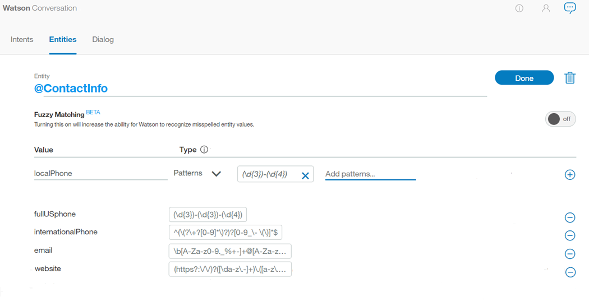
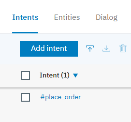
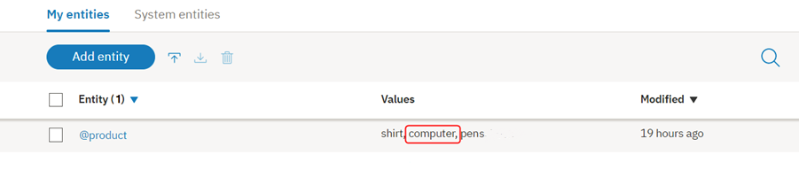

---

copyright:
  years: 2015, 2019
lastupdated: "2019-02-28"

subcollection: assistant

---

{:shortdesc: .shortdesc}
{:new_window: target="_blank"}
{:deprecated: .deprecated}
{:important: .important}
{:note: .note}
{:tip: .tip}
{:pre: .pre}
{:codeblock: .codeblock}
{:screen: .screen}
{:javascript: .ph data-hd-programlang='javascript'}
{:java: .ph data-hd-programlang='java'}
{:python: .ph data-hd-programlang='python'}
{:swift: .ph data-hd-programlang='swift'}

# Criando entidades
{: #entities}

***Entidades*** representam informações na entrada do usuário que são relevantes para o propósito do usuário.

Se as intenções representam verbos (a ação que um usuário deseja executar), as entidades representam substantivos (o objeto ou o contexto para essa ação). Por exemplo, quando a *intenção* é obter uma previsão meteorológica, as *entidades* relevantes de local e data são necessários antes que o aplicativo possa retornar uma previsão exata.

Reconhecer entidades na entrada do usuário ajuda a criar respostas mais úteis e direcionadas. Por exemplo, você pode ter uma intenção `#buy_something`. Quando um usuário faz uma solicitação que aciona a intenção `#buy_something`, a resposta do assistente deve refletir um entendimento do que *something* é o que o cliente deseja comprar. É possível incluir uma entidade `@product` e, em seguida, usá-la para extrair informações da entrada do usuário sobre o produto em que o cliente está interessado. (A `@` pré-anexada ao nome da entidade ajuda a identificá-lo claramente como uma entidade.)

Finalmente, é possível incluir múltiplas respostas em sua árvore de diálogo com o texto que difere com base no valor `@product` que é detectado na solicitação do usuário.

<iframe class="embed-responsive-item" id="youtubeplayer" title="Trabalhando com entidades" type="text/html" width="640" height="390" src="https://www.youtube.com/embed/o-uhdw6bIyI" frameborder="0" webkitallowfullscreen mozallowfullscreen allowfullscreen> </iframe>

## Visão Geral da Avaliação da Entidade
{: #entities-described}

O serviço detecta entidades na entrada do usuário usando um dos métodos de avaliação a seguir:

### Método baseado em dicionário
{: #entities-dictionary-overview}

O serviço procura termos na entrada do usuário que correspondem aos valores, sinônimos ou padrões definidos para a entidade.

- **Entidade de sinônimo**: você define uma categoria de termos como uma entidade (`color`) e, em seguida, um ou mais valores nessa categoria (`blue`). Para cada valor, você especifica vários sinônimos (`aqua`, `navy`). Também é possível selecionar sinônimos para incluir por meio de recomendações feitas a você pelo serviço.

    No tempo de execução, o serviço reconhece os termos na entrada do usuário que correspondem exatamente aos valores ou sinônimos que você definiu para a entidade como menções dessa entidade.
- **Entidade padrão**: você define uma categoria de termos como uma entidade (`contact_info`) e, em seguida, um ou mais valores nessa categoria (`email`). Para cada valor, você especifica uma expressão regular que define o padrão textual de menções desse tipo de valor. Para um valor de entidade `email`, você pode desejar especificar uma expressão regular que defina um padrão `text@text.com`.

    No tempo de execução, o serviço procura padrões que correspondem à sua expressão regular na entrada do usuário e identifica quaisquer correspondências como menções dessa entidade.
- **Entidade do sistema**: entidades de sinônimo que são pré-construídas para você pela IBM. Elas cobrem categorias comumente usadas, como números, datas e horários. Você simplesmente ativa uma entidade do sistema para começar a usá-la.

### Método baseado em contexto
{: #entities-annotations-overview}

Quando você define uma entidade contextual, um modelo é treinado no *termo anotado* e no *contexto* no qual o termo é usado na sentença anotada. Esse novo modelo de entidade contextual permite que o serviço calcule uma pontuação de confiança que identifica a probabilidade de uma palavra ou frase ser uma instância de uma entidade, com base em como ela é usada na entrada do usuário.

- **Entidade contextual**: primeiro, você define uma categoria de termos como uma entidade (`product`). Em seguida, você acessa a página *Intenções* e extrai seus exemplos do usuário de intenção existentes para localizar quaisquer menções da entidade e rotulá-las como tais. Por exemplo, você pode acessar a intenção `#buy_something` e localizar um exemplo do usuário que diz `I want to buy a Coach bag`. É possível rotular `Coach bag` como uma menção da entidade `@product`.

    Para propósitos de treinamento, o termo que você anotou, `Coach bag`, é incluído como um valor da entidade `@product`.

    No tempo de execução, o serviço avalia termos com base no contexto no qual eles são usados somente na sentença. Se a estrutura de uma solicitação do usuário que menciona o termo corresponde à estrutura de um exemplo do usuário de intenção no qual uma menção é rotulada, o serviço interpreta o termo como uma menção desse tipo de entidade. Por exemplo, a entrada do usuário pode incluir a elocução `I want to buy a Gucci bag`. Devido à similaridade da estrutura dessa sentença para o exemplo do usuário que você anotou (`I want to buy a Coach bag`), o serviço reconhece `Gucci bag` como uma menção de entidade `@product`.

    Quando um modelo de entidade contextual é usado para uma entidade, o serviço *não* procura correspondências exatas de texto ou padrão para a entidade na entrada do usuário, mas foca no contexto da sentença na qual a entidade é mencionada.

    Se você escolher definir valores de entidade usando anotações, inclua pelo menos 10 anotações por entidade para fornecer ao modelo de entidade contextual dados suficientes para que seja confiável.

## Criando entidades
{: #entities-creating-task}

Use a ferramenta {{site.data.keyword.conversationshort}} para criar entidades.

1.  Na ferramenta {{site.data.keyword.conversationshort}}, abra sua qualificação de diálogo e, em seguida, clique na guia **Entidades**. Se **Entidades** não estiver visível, use o menu  para abrir a página.

1.  Clique em **Incluir entidade**.

    Também é possível clicar em **Usar Entidades do Sistema** para selecionar desde uma lista de entidades comuns, fornecidas pelo {{site.data.keyword.IBM_notm}}, que podem ser aplicadas a qualquer caso de uso. Consulte [Ativando entidades do sistema](#entities-enable-system-entities) para obter detalhes adicionais.

1.  No campo **Nome da entidade**, digite um nome descritivo para a entidade.

    O nome da entidade pode conter letras (em Unicode), números, sublinhados e hifens. Por exemplo:
    - `@location`
    - `@menu_item`
    - `@product`

    Não inclua espaços no nome. O nome não pode ter mais que 64 caracteres. Não inicie o nome com a sequência `sys-` porque ela está reservada para entidades do sistema.

    A ferramenta inclui automaticamente o caractere @ no nome da entidade, portanto você não precisa incluir um.
    {: tip}

1.  Clique em  ** Criar entidade **.

    

1.  Para essa entidade, escolha se você deseja que o serviço use uma abordagem baseada em dicionário ou baseada em contexto para localizar menções dele e, em seguida, siga o procedimento apropriado.

    **Para cada entidade que você criar, escolha somente um tipo de entidade para usar.** Assim que você inclui uma anotação para uma entidade, o modelo contextual é inicializado e se torna a abordagem primária para analisar a entrada do usuário para localizar menções dessa entidade. O contexto no qual a menção é usada na entrada do usuário tem precedência sobre quaisquer correspondências exatas que possam estar presentes. Consulte [Visão geral de avaliação de entidade](#entities-described) para obter mais informações sobre como cada tipo é avaliado.

    - [ Entidades Baseadas em Dicionário ](#entities-create-dictionary-based)
    - [Entidades baseadas em contexto](#entities-create-annotation-based)

## Incluindo entidades baseadas em dicionário
{: #entities-create-dictionary-based}

As entidades baseadas em dicionário são aquelas para as quais você define termos, sinônimos ou padrões específicos. No tempo de execução, o serviço localiza menções de entidade somente quando um termo na entrada do usuário corresponde exatamente (ou corresponde aproximadamente se a correspondência difusa está ativada) ao valor ou um de seus sinônimos.

1.  No campo **Nome do valor**, digite o texto de um valor possível para a entidade e pressione a tecla `Enter`. Um valor de entidade pode ser qualquer sequência de até 64 caracteres de comprimento.

    **Importante:** Não inclua informações sensíveis ou pessoais em nomes de entidades ou valores. Os nomes e valores podem ser expostos em URLs em um aplicativo.

1.  Se você desejar que o serviço reconheça termos com sintaxe semelhante ao valor de entidade e sinônimos especificados, mas sem requerer uma correspondência exata, clique na alternância **Correspondência difusa** para ativá-la.

    Esse recurso está disponível para os idiomas observados no tópico [Idiomas suportados](/docs/services/assistant?topic=assistant-language-support).

    **Correspondência difusa**
    {: #entities-fuzzy-matching}

    Correspondência difusa tem estes componentes:

    - *Stemming* - o recurso reconhece o formulário raiz de valores de entidade que possuem várias formas gramaticais. Por exemplo, a raiz das 'bananas' seria 'banana', enquanto a raiz de 'execução' seria 'executar'.
    - *Erro de ortografia* - o recurso é capaz de mapear a entrada do usuário para a entidade correspondente apropriada apesar da presença de erros ortográficos ou pequenas diferenças de sintaxe. Por exemplo, se você define *girafa* como um sinônimo para uma entidade animal e a entrada do usuário contém os termos *girafas* ou *girafa*, a correspondência difusa é capaz de mapear o termo para a entidade animal corretamente.
    - *Correspondência parcial* - com correspondência parcial, o recurso sugere automaticamente sinônimos baseados em subsequência presentes nas entidades definidas pelo usuário e designa uma pontuação de confiança inferior em comparação com a correspondência de entidade exata.

    Para inglês, a correspondência difusa evita a captura de algumas palavras comuns válidas em inglês como correspondências difusas para uma determinada entidade. Esse recurso usa palavras do dicionário em inglês padrão. Também é possível definir um valor/sinônimo de entidade em inglês e a correspondência difusa corresponderá somente a seu valor/sinônimo de entidade definido. Por exemplo, a correspondência difusa pode corresponder o termo `unsure` com `insurance`; mas se você tiver `unsure` definido como um valor/sinônimo para uma entidade como `@option`, `unsure` sempre será correspondido com `@option` e não com `insurance`.
    {: note}

    Sua configuração de correspondência difusa não tem impacto nas recomendações de sinônimos. Mesmo se a correspondência difusa estiver ativada, os sinônimos serão sugeridos somente para o valor exato especificado, não o valor e as pequenas variações do valor.

1.  Depois de inserir um nome do valor, é possível incluir quaisquer sinônimos ou definir padrões específicos para esse valor de entidade selecionando `Synonyms` ou `Patterns` no menu suspenso *Tipo*.

    

    **Nota:** é possível incluir sinônimos *ou* padrões para um único valor de entidade, não ambos.

    ***Sinônimos***
    {: #entities-synonyms}

    - No campo **Sinônimos**, digite qualquer sinônimo para o valor de entidade. Um sinônimo pode ser qualquer sequência de até 64 caracteres de comprimento.

      

      O serviço {{site.data.keyword.conversationshort}} também pode recomendar sinônimos para seus valores de entidade. O recomendador localiza sinônimos relacionados com base na similaridade contextual extraída de um vasto corpo de informações existentes, incluindo grandes fontes de texto escrito, além de usar técnicas de processamento de linguagem natural para identificar palavras semelhantes aos sinônimos existentes em seu valor de entidade.

    - Clique em **Mostrar recomendações**.

    - O serviço {{site.data.keyword.conversationshort}} fará várias recomendações para sinônimos. Os termos são exibidos em minúsculas, mas o serviço reconhece menções dos sinônimos independentemente de elas serem especificadas em minúsculas ou maiúsculas.

      Quanto mais coerentes forem os sinônimos de valor de entidade, mais relevantes e melhor focadas suas recomendações serão. Por exemplo, se houver várias palavras que estão focadas em um tema, você obterá melhores sugestões do que se tiver uma ou duas palavras aleatórias.
      {: tip}

      

    - Selecione quaisquer sinônimos que você deseja incluir e, em seguida, clique em **Incluir selecionado**.

      Deve-se clicar no botão **Incluir selecionado** para quaisquer sinônimos selecionados para serem incluídos. Se você mover para o próximo conjunto sem clicar nesse botão primeiro, suas seleções serão perdidas.

      

    - O serviço {{site.data.keyword.conversationshort}} inclui esses sinônimos em sua entidade e sugere sinônimos adicionais.

      Se você não receber nenhuma recomendação de sinônimo adicional, isso poderá ser porque sua entidade já está bem definida ou tem conteúdo que o recomendador não está atualmente apto a expandir.
      {: tip}

      Caso escolha não selecionar um sinônimo recomendado, o sistema tratará isso como um termo em que você não está interessado e alterará o próximo conjunto de recomendações que você vir quando pressionar `Add selected` ou `Next set`. Essa inferência persiste somente enquanto você está escolhendo sinônimos; informações sobre sinônimos ignorados não são usadas para nenhum outro propósito pelo serviço.
      {: note}

      

      Continue incluindo sinônimos conforme desejado. Quando você tiver concluído a aceitação das recomendações, clique no **X** para fechar.

    ***Padrões***
    {: #entities-patterns}

    - O campo **Padrões** permite definir padrões específicos para um valor de entidade. Um padrão **deve** ser inserido como uma expressão regular no campo.

      - Para cada valor de entidade, pode haver um máximo de até 5 padrões.
      - Cada padrão (expressão regular) é limitado a 512 caracteres.

      
      {: #entities-pattern-entities}

      Como neste exemplo, para a entidade *ContactInfo*, os padrões para os valores de telefone, e-mail e website podem ser definidos como a seguir:
      - Telefone
        - `localPhone`: `(\d{3})-(\d{4})`, por exemplo, 426-4968
        - `fullUSphone`: `(\d{3})-(\d{3})-(\d{4})`, por exemplo, 800-426-4968
        - `internationalPhone`: `^(\(?\+?[0-9]*\)?)?[0-9_\- \(\)]*$`, por exemplo, +44 1962 815000
      - `email`: `\b[A-Za-z0-9._%+-]+@[A-Za-z0-9.-]+\.[A-Za-z]{2,}\b`, por exemplo, nome@ibm.com
      - `website`: `(https?:\/\/)?([\da-z\.-]+)\.([a-z\.]{2,6})([\/\w \.-]*)*\/?$`, por exemplo, https://www.ibm.com

      Geralmente ao usar as entidades padrão, será necessário armazenar o texto que corresponde ao padrão em uma variável de contexto (ou variável de ação) desde sua árvore de diálogos. Para obter informações adicionais, consulte [Definindo uma variável de contexto](/docs/services/assistant?topic=assistant-dialog-runtime#dialog-runtime-context-var-define).

      Imagine um caso em que você está perguntando a um usuário por seu endereço de e-mail. A condição do nó de diálogo conterá uma condição semelhante a `@contactInfo:email`. Para designar o e-mail inserido pelo usuário como uma variável de contexto, a sintaxe a seguir pode ser usada para capturar a correspondência padrão dentro da seção de resposta do nó de diálogo:

      <table>
      <caption>Salvando um padrão</caption>
        <tr>
          <th>Variável</th>
          <th>Valor</th>
        </tr>
        <tr>
          <td>email</td>
          <td>`<? @contactInfo.literal ?>`</td>
        </tr>
      </table>

      ***Grupos de captura***
      {: #entities-capture-group}

      Para expressões regulares, qualquer parte de um padrão dentro de um par de parênteses normais será capturada como um grupo. Por exemplo, a entidade `@ContactInfo` tem um valor padrão denominado `fullUSphone` que contém três grupos capturados:

      - `(\d{3})` - código de área dos EUA
      - `(\d{3})` - prefixo
      - `(\d{4})` - número da linha

      O agrupamento pode ser útil se, por exemplo, você deseja que o serviço {{site.data.keyword.conversationshort}} pergunte aos usuários seus números de telefone e, então, use somente o código de área do número fornecido em uma resposta.

      Para designar o código de área inserido pelo usuário como uma variável de contexto, a sintaxe a seguir pode ser usada para capturar a correspondência do grupo dentro da seção de resposta do nó de diálogo:

      <table>
      <caption>Salvando um grupo de captura</caption>
        <tr>
          <th>Variável</th>
          <th>Valor</th>
        </tr>
        <tr>
          <td>area_code</td>
          <td>`<? @ContactInfo.groups[1] ?>`</td>
        </tr>
      </table>

      Para obter informações adicionais sobre como usar grupos de captura em seu diálogo, consulte [Armazenando e reconhecendo grupos de padrões de entidade na entrada](/docs/services/assistant?topic=assistant-dialog-tips#dialog-tips-get-pattern-groups).

      O mecanismo de correspondência padrão utilizado pelo serviço {{site.data.keyword.conversationshort}} tem algumas limitações de sintaxe, que são necessárias para evitar problemas de desempenho que podem ocorrer ao usar outros mecanismos de expressão regular.

      - Os padrões de entidade não podem conter:
        - Repetições positivas (por exemplo `x*+`)
        - Referências anteriores (por exemplo `\g1`)
        - Ramificações condicionais (por exemplo `(?(cond)true)`)
      - Quando uma entidade padrão inicia ou termina com um caractere Unicode e inclui limites de palavras, por exemplo `\bš\b`, a correspondência de padrões não corresponde ao limite de palavra corretamente. Neste exemplo, para a entrada `š zkouška`, a correspondência retorna `Group 0: 6-7 š` (`š zkou`_**`š`**_`ka`), em vez do `Group 0: 0-1 š` correto (_**`š`**_ `zkouška`).

      O mecanismo de expressão regular baseia-se vagamente no mecanismo de expressão regular Java. O serviço {{site.data.keyword.conversationshort}} produzirá um erro se você tentar fazer upload de um padrão não suportado, por meio da API ou de dentro da Tooling UI do serviço {{site.data.keyword.conversationshort}}.

1.  Clique em **Incluir valor** e repita o processo para incluir mais valores de entidade.

1.  Quando você tiver concluído a inclusão de valores de entidade, clique em  para concluir a criação da entidade.

A entidade criada é incluída na guia **Entidades** e o sistema começa a treinar com os novos dados.

## Incluindo entidades contextuais
{: #entities-create-annotation-based}

As entidades baseadas em contexto são aquelas para as quais você anota as ocorrências da entidade em sentenças de amostra para ensinar o serviço sobre o contexto no qual a entidade é geralmente usada.

Para treinar um modelo de entidade contextual, é possível obter vantagem de seus exemplos de intenção, que fornecem sentenças prontamente disponíveis para anotar.

O uso de exemplos do usuário de uma intenção para definir entidades contextuais não afeta a classificação dessa intenção. No entanto, as menções de entidade que você rotula também são incluídas nessa entidade como sinônimos. E a classificação de intenção usa as menções de sinônimo em exemplos do usuário de intenção para estabelecer uma referência fraca entre uma intenção e uma entidade.
{: note}

1.  Na ferramenta {{site.data.keyword.conversationshort}}, abra sua qualificação e, em seguida, clique na guia **Intenções**. Se **Intenções** não estiver visível, use o menu  para abrir a página.

1.  Clique em uma intenção para abri-la.

    Para este exemplo, a intenção `#place_order` define a função de ordem para um varejista on-line.

    

1.  Revise os exemplos de intenção para potenciais menções de entidade. Destaque uma potencial menção de entidade por meio dos exemplos de intenção.

    Neste exemplo, `computer` é a menção de entidade.

    

    O ícone Editar  é usado para editar um exemplo do usuário de intenção; ele não está relacionado à inclusão de anotações.
    {: tip}

1.  É aberta uma caixa de Procura que pode ser usada para procurar a entidade da qual a palavra ou frase destacada é uma menção.

    

    Neste exemplo, procurar `prod` traz correspondências para a entidade `@product`.

    

    Se a entidade tiver quaisquer valores de entidade existentes, eles serão exibidos somente para propósitos informacionais. Você está incluindo a anotação na entidade, não em qualquer valor de entidade específico.

    Se você desejar ensinar ao modelo que a menção é sinônimo de um valor de entidade existente, será possível associá-la a um valor de entidade específico.
    {: important}

    Para associar a menção a um valor de entidade específico, siga estas etapas:

    1.  Digite o nome completo da entidade e o valor no campo de procura. Por exemplo, digite  ` @product :IT `.
    1.  Quando o valor de entidade for exibido no menu suspenso, selecione-o.

1.  Selecione a entidade na qual você deseja incluir a anotação.

    Neste exemplo, `computer` está sendo incluído como uma anotação para a entidade `@product`.

    Crie *pelo menos* 10 anotações para cada entidade contextual; mais anotações são recomendadas para uso de produção.
    {: important}

1.  Se nenhuma das entidades for apropriada, será possível criar uma nova entidade escolhendo **@(create new entity)**.

1.  Repita esse processo para cada menção de entidade que você deseja anotar.

    Certifique-se de anotar cada menção de um tipo de entidade que ocorrer em qualquer exemplo do usuário que você editar. Consulte [O que você não anota importa](#entities-counter-examples) para obter mais detalhes.
    {: important}

1.  Agora, clique na anotação que você acabou de criar. Uma caixa é aberta que diz `Go to: <entity-name>`. Clicar nesse link leva você diretamente para a entidade.

    

    A anotação é incluída na entidade com a qual você a associou e o sistema começa a treinar a si mesmo nos novos dados.

    O termo anotado é incluído na entidade como um novo valor de dicionário. Se você associou o termo anotado a um valor de entidade existente, o termo será incluído como um sinônimo desse valor de entidade em vez de como um valor de entidade independente.
    {: important}

1.  Para ver todas as menções que você anotou para uma entidade específica, na página de configuração da entidade, clique na guia **Anotação**.

    

    As entidades contextuais entendem os valores que você não definiu explicitamente. O sistema faz predições sobre valores de entidade adicionais com base em como os exemplos do usuário são anotados e usa esses valores para treinar outras entidades. Quaisquer exemplos do usuário semelhantes são incluídos na visualização *Anotação*, para que seja possível ver como essa opção afeta o treinamento.
    {: note}

    Se você não desejar que suas entidades contextuais usem esse entendimento expandido de valores de entidade, selecione todos os exemplos do usuário na visualização *Anotação* para essa entidade e, em seguida, clique em **Excluir**.

O vídeo a seguir demonstra como anotar menções de entidade.

<iframe class="embed-responsive-item" id="youtubeplayer0" title="Anotando menções de entidade" type="text/html" width="640" height="390" src="https://www.youtube.com/embed/3WjzJpLsnhQ" frameborder="0" webkitallowfullscreen mozallowfullscreen allowfullscreen> </iframe>

Para percorrer um tutorial que mostra como definir entidades contextuais antes de incluir as suas próprias, acesse [Tutorial: definindo entidades contextuais ](https://www.ibm.com/cloud/garage/demo/try-watson-assistant-contextual-entities){: new_window}.

### O que você não anota importa
{: #entities-counter-examples}

Se você tiver um exemplo de intenção com uma anotação e outra palavra nesse exemplo corresponder ao valor ou a um sinônimo da mesma entidade, mas o valor *não* estiver anotado, essa omissão terá impacto. O modelo também aprende por meio do contexto do termo que você não anotou. Portanto, se você rotular um termo como uma menção de uma entidade em um exemplo do usuário, certifique-se de rotular quaisquer outras menções aplicáveis também.

1.  A intenção `#Customer_Care_Appointments` inclui dois exemplos de intenção com a palavra `visit`.

    

1.  No primeiro exemplo, você deseja anotar a palavra `visit` como um valor de entidade da entidade `@meeting`. Isso torna `visit` equivalente a outros valores de entidade `@meeting`, como `appointment`, como em "I'd like to make an appointment" ou "I'd like to schedule a visit".

    

1.  Para o segundo exemplo, a palavra `visit` está sendo usada em um contexto diferente de uma reunião. Nesse caso, é possível selecionar a palavra `appointment` por meio do exemplo de intenção e anotá-la como um valor de entidade da entidade `@meeting`. O modelo aprende por meio do fato de que a palavra `visit` no mesmo exemplo não é anotada.

    

## Ativando entidades do sistema
{: #entities-enable-system-entities}

O serviço {{site.data.keyword.conversationshort}} fornece um número de *entidades de sistema*, que são entidades comuns que você pode usar para qualquer aplicativo. A ativação de uma entidade do sistema torna possível preencher rapidamente sua qualificação com dados de treinamento que são comuns a muitos casos de uso.

Entidades do Sistema podem ser usadas para reconhecer uma ampla variedade de valores para os tipos de objetos que eles representam. Por exemplo, a entidade do sistema `@sys-number` corresponde a qualquer valor numérico, incluindo números inteiros, frações decimais ou mesmo números gravados como palavras.

As entidades do sistema são mantidas centralmente, portanto, quaisquer atualizações ficarão disponíveis automaticamente. Não é possível modificar entidades do sistema.

1.  Na guia Entidades, clique em **Entidades do sistema**.

    

1.  Navegue pela lista de entidades do sistema para escolher as que são úteis para seu aplicativo.
    - Para consultar informações adicionais sobre uma entidade do sistema, incluindo exemplos de entrada correspondente, clique na entidade na lista.
    - Para obter detalhes sobre as entidades do sistema disponíveis, consulte [Entidades do Sistema](/docs/services/assistant?topic=assistant-system-entities).

1.  Clique no interruptor de duas posições próximo a uma entidade do sistema para ativá-la ou desativá-la.

Depois de ativar entidades do sistema, o serviço {{site.data.keyword.conversationshort}} começa a treinar novamente. Após o treinamento ser concluído, você poderá usar as entidades.

## Limites de entidade
{: #entities-limits}

O número de entidades, valores de entidade e sinônimos que você pode criar depende de seu plano de serviço {{site.data.keyword.conversationshort}}:

| Plano de Serviço      | Entidades por habilidade | Valores de Entidade por Habilidade | Sinônimos de entidade por qualificação |
|-------------------|-------------------:|------------------------:|--------------------------:|
| Premium           |               1000 |                 100.000 |                   100.000 |
| Mais              |               1000 |                 100.000 |                   100.000 |
| Padrão          |               1000 |                 100.000 |                   100.000 |
| Lite              |                 25 |                 100.000 |                   100.000 |
{: caption="Detalhes do plano de serviço" caption-side="top"}

Entidades do sistema que você ativa para uso contam para o total de uso do seu plano.

| Plano de Serviço | Entidades e Anotações Contextuais |
|--------------|------------------------------------:|
| Premium      |        30 entidades contextuais com 3.000 anotações |
| Mais         |        20 entidades contextuais com anotações de 2000 |
| Padrão     |        20 entidades contextuais com anotações de 2000 |
| Lite         |        10 entidades contextuais com 1000 anotações |
{: caption="Detalhes do plano de serviço continuado" caption-side="top"}

## Editando entidades
{: #entities-edit}

É possível clicar em qualquer entidade na lista para abri-la para edição. É possível renomear ou excluir entidades e é possível incluir, editar ou excluir valores, sinônimos ou padrões.

Se você muda o tipo de entidade de `synonym` para `pattern` ou vice-versa, os valores existentes são convertidos, mas podem não ser úteis no estado em que se encontram.
{: note}

## Procurando entidades
{: #entities-search}

Use o recurso de Procura para localizar nomes de entidade, valores e sinônimos.

1.  Na página **Entidades**, clique no ícone de Procura.

    

    As entidades do sistema não são pesquisáveis.
    {: note}

1.  Inserir um termo de procura ou frase.

    

As entidades que contêm seu termo de procura, com exemplos correspondentes, são mostradas.

  

## Exportando entidades
{: #entities-export}

É possível exportar várias entidades para um arquivo CSV, depois é possível importar e reutilizá-las para outro aplicativo {{site.data.keyword.conversationshort}}.

- As informações de padrão são incluídas na exportação CSV. Qualquer sequência agrupada com `/` será considerada um padrão (em oposição a um sinônimo).
- As anotações associadas a entidades contextuais não são exportadas. Deve-se exportar a qualificação de diálogo inteira para capturar o valor de entidade e quaisquer anotações associadas.

1.  Selecione as entidades desejadas e, em seguida, clique em **Exportar**.

    

## Importando entidades
{: #entities-import}

Se ver um grande número de entidades, você poderá achar mais fácil importá-los de um arquivo CSV (Comma-Separated Value) do que defini-los um por um na ferramenta {{site.data.keyword.conversationshort}}.

As anotações de entidade não são incluídas na importação de um arquivo CSV de entidade. Deve-se importar a qualificação de diálogo inteira para reter as anotações associadas para uma entidade contextual nessa qualificação. Se você exportar e importar somente entidades, quaisquer entidades contextuais exportadas serão tratadas como entidades baseadas em dicionário depois de importá-las.
{: note}

1.  Colete as entidades em um arquivo CSV ou exporte-as de uma planilha para um arquivo CSV. O formato obrigatório para cada linha no arquivo é o seguinte:

    ```
    <entity>,<value>,<synonyms>
    ```
    {: screen}

    Em que &lt;entity&gt; é o nome de uma entidade, &lt;value&gt; é um valor para a entidade e &lt;synonyms&gt; é uma lista separada por vírgula de sinônimos para esse valor.

    ```
    weekday,Monday,Mon
    weekday,Tuesday,Tue,Tues
    weekday,Wednesday,Wed
    weekday,Thursday,Thur,Thu,Thurs
    weekday,Friday,Fri
    weekday,Saturday,Sat
    weekday,Sunday,Sun
    month,January,Jan
    month,February,Feb
    month,March,Mar
    month,April,Apr
    month,May
    ```
    {: screen}

    A importação de um arquivo CSV também suporta padrões. Qualquer sequência agrupada com `/` será considerada um padrão (em oposição a um sinônimo).

    ```
    ContactInfo,localPhone,/(\d{3})-(\d{4})/
    ContactInfo,fullUSphone,/(\d{3})-(\d{3})-(\d{4})/
    ContactInfo,internationalPhone,/^(\(?\+?[0-9 ] * \)?)?[0-9_\- \(\)]*$/
    ContactInfo,email,/\b[A-Za-z0-9._%+-]+@[A-Za-z0-9.-]+\.[A-Za-z]{2,}\b/
    ContactInfo,website,/(https?:\/\/)?([\da-z\.-]+)\.([a-z\.]{2, 6 }) ([ \/ \w \.-] *) * \/? $/
    ```
    {: screen}

    Salve o arquivo CSV com codificação UTF-8 e nenhuma marca de ordem de byte (BOM). O tamanho máximo do arquivo CSV é 10MB. Se seu arquivo CSV for maior, considere dividir isso em vários arquivos e importá-los separadamente.  Na ferramenta {{site.data.keyword.conversationshort}}, abra sua qualificação de diálogo e, em seguida, clique na guia **Entidades**.
    {: tip}

1.  Clique em  e, em seguida, arraste um arquivo ou navegue para selecionar um arquivo de seu computador. O arquivo é validado e importado e o sistema começa a treinar com os novos dados.

É possível visualizar as entidades importadas na guia Entidades. Você pode precisar atualizar a página para ver as novas entidades.

## Excluindo entidades
{: #entities-delete}

É possível selecionar um número de entidades para exclusão.

**IMPORTANTE**: Ao excluir entidades, você também estará excluindo todos os valores, sinônimos ou padrões associados e esses itens não podem ser recuperados posteriormente. Todos os nós de diálogo que referenciam essas entidades ou valores devem ser atualizados manualmente para não fazer referência ao conteúdo excluído.

1.  Selecione as entidades que você deseja excluir e, em seguida, clique em **Excluir**.

    
