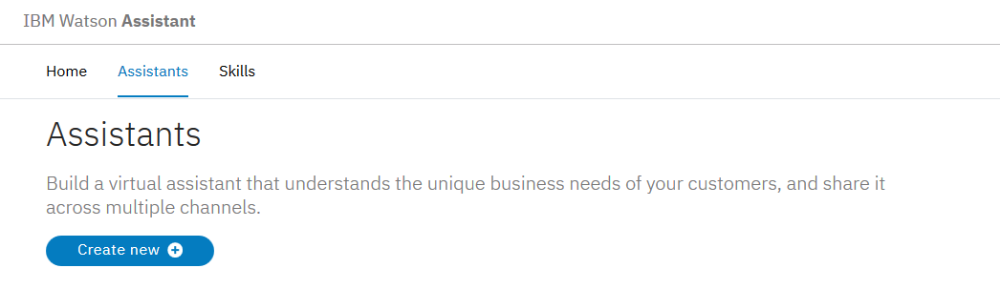

---

copyright:
  years: 2015, 2019
lastupdated: "2019-08-06"

keywords: assistant, omnichannel, virtual agent, virtual assistant, chatbot, conversation, watson assistant, watson conversation

subcollection: assistant

---

{:shortdesc: .shortdesc}
{:new_window: target="_blank"}
{:deprecated: .deprecated}
{:important: .important}
{:note: .note}
{:deprecated: .deprecated}
{:important: .important}
{:note: .note}
{:tip: .tip}
{:pre: .pre}
{:codeblock: .codeblock}
{:screen: .screen}
{:javascript: .ph data-hd-programlang='javascript'}
{:java: .ph data-hd-programlang='java'}
{:python: .ph data-hd-programlang='python'}
{:swift: .ph data-hd-programlang='swift'}
{:hide-dashboard: .hide-dashboard}
{:download: .download}
{:gif: data-image-type='gif'}

# Introdução ao {{site.data.keyword.conversationshort}}
{: #getting-started}

Neste breve tutorial, introduziremos o {{site.data.keyword.conversationfull}} e forneceremos instruções sobre o processo de criação de seu primeiro assistente.
{: shortdesc}

## Antes de iniciar
{: #getting-started-prerequisites}
{: hide-dashboard}

É necessária uma instância de serviço para iniciar.
{: hide-dashboard}

1.  {: hide-dashboard} Acesse a página [{{site.data.keyword.conversationshort}} ](https://cloud.ibm.com/catalog/services/watson-assistant) no catálogo do {{site.data.keyword.cloud}}.

    A instância do serviço será criada no grupo de recursos **default** se você não escolher uma diferente e *não poderá* ser mudada posteriormente. Esse grupo é suficiente para o propósito de experimentar o produto.

    Se você estiver criando uma instância para uso mais robusto, saiba mais sobre os [grupos de recursos ](https://{DomainName}/docs/resources/bestpractice_rgs#bp_resourcegroups){: new_window}.
1.  {: hide-dashboard} Inscreva-se para obter uma conta gratuita do {{site.data.keyword.cloud_notm}} ou efetue login.
1.  {: hide-dashboard} Clique em **Criar**.

## Etapa 1: abrir o Watson Assistant
{: #getting-started-launch-tool}

Depois de criar uma instância de serviço do {{site.data.keyword.conversationshort}}, você será direcionado à página **Gerenciar** do painel do {{site.data.keyword.conversationshort}}.
{: hide-dashboard}

1.  Clique em **Ativar o {{site.data.keyword.conversationshort}}**. Se for solicitado que você efetue login, forneça suas credenciais do {{site.data.keyword.cloud_notm}}.

<!-- Remove this text after dedicated instances have the developer console: begin -->

{{site.data.keyword.Bluemix_dedicated_notm}}: selecione sua instância de serviço no painel para ativar o produto.

<!-- Remove this text after dedicated instances have the Developer Console: end -->

Se for um novo usuário, um assistente denominado *Meu primeiro assistente* será criado automaticamente para você. Ignore a próxima etapa. 

Se o tour estiver disponível em seu local, ele será iniciado e será possível saber mais sobre o produto. Siga e conclua o tour. Como ele se sobrepõe às etapas do tutorial, será possível voltar ao tutorial após sua conclusão.
  {: tip}

Um [*assistente*](/docs/services/assistant?topic=assistant-assistants) é um robô cognitivo no qual você inclui uma qualificação que permite que ele interaja com seus clientes de maneiras úteis.

Se um assistente não for criado automaticamente, sua primeira etapa será criar um assistente.

## Etapa 2: criar um assistente
{: #getting-started-create-assistant}

1.  Clique em **Criar assistente**.

    
1.  Nomeie o assistente como `Meu primeiro assistente`.
1.  Clique em **Criar assistente**.

    

## Etapa 3: criar uma qualificação de diálogo
{: #getting-started-add-skill}

Uma *qualificação de diálogo* é um contêiner para os artefatos que definem o fluxo de uma conversa que seu assistente pode ter com seus clientes.

1.  Se o assistente foi criado para você, clique no quadro *Meu primeiro assistente* para abri-lo.

1.  Clique em **Incluir qualificação de diálogo**.

    

1.  Forneça à sua qualificação o nome `Conversational skill tutorial`.
1.  ** Opcional **. Se o diálogo que você planeja construir usará uma linguagem diferente do inglês, escolha a linguagem apropriada na lista.

    

1.  Clique em **Criar qualificação de diálogo**.

    

1.  Clique para abrir a qualificação que você acabou de criar.

Você será direcionado para a página Intenções.

## Etapa 4: incluir intenções de um catálogo de conteúdo
{: #getting-started-add-catalog}

Inclua dados de treinamento que foram construídos pela IBM para sua qualificação, incluindo intenções de um catálogo de conteúdo. Em particular, você fornecerá ao seu assistente acesso ao catálogo de conteúdo **Geral** para que seu diálogo possa saudar os usuários e terminar conversas com eles.

1.  Clique na guia **Catálogo de conteúdo**.
1.  Localize **Geral** na lista e, em seguida, clique em **Incluir na qualificação**.

    
1.  Abra a guia **Intenções** para revisar as intenções e as elocuções de exemplo associadas que foram incluídas em seus dados de treinamento. É possível reconhecê-las porque cada nome de intenção inicia com o prefixo `#General_`. Você incluirá as intenções `#General_Greetings` e `#General_Ending` em seu diálogo na próxima etapa.

    

Você iniciou com êxito a construção de seus dados de treinamento incluindo o conteúdo pré-construído da {{site.data.keyword.IBM_notm}}.

## Etapa 5: construir um diálogo
{: #getting-started-build-dialog}

Um [diálogo](/docs/services/assistant?topic=assistant-dialog-overview) define o fluxo de sua conversa na forma de uma árvore lógica. Ele corresponde intenções (o que os usuários dizem) a respostas (o que o robô diz de volta). Cada nó da árvore tem uma condição que o aciona, com base na entrada do usuário.

Nós criaremos um diálogo simples que manipula as intenções de saudação e encerramento, cada uma com um único nó.

### Incluindo um nó inicial

1.  Clique na guia  ** Diálogo ** .
1.  Clique em **Criar diálogo**. Você vê dois nós:
    - **Bem-vindo**: contém uma saudação que é exibida para os usuários quando eles se engajam pela primeira vez com o assistente.
    - **Qualquer outra coisa**: contém frases que são usadas para responder aos usuários quando a entrada deles não é reconhecida.

    
1.  Clique no nó **Bem-vindo** para abri-lo na visualização de edição.
1.  Substitua a resposta padrão pelo texto `Welcome to the Watson Assistant tutorial!`.

    
1.  Clique em  para fechar a visualização de edição.

Você criou um nó de diálogo que é acionado pela condição `welcome`. (`welcome` é uma condição especial que funciona como uma intenção, mas não inicia com um `#`.) Ela é acionada quando uma nova conversa se inicia. Seu nó especifica que quando uma nova conversa se inicia, o sistema deve responder com a mensagem de boas-vindas que você inclui na seção de resposta desse primeiro nó.

### Testando o nó inicial

É possível testar seu diálogo a qualquer momento para verificar o diálogo. Vamos testá-lo agora.

- Clique no ícone  para abrir a área de janela "Experimente". Você deverá ver sua mensagem de boas-vindas.

### Incluindo nós para manipular intenções

Agora, vamos incluir nós entre o nó `Welcome` e o nó `Anything else` que manipula nossas intenções.

1.  Clique no ícone Mais  no nó **Bem-vindo** e, em seguida, selecione **Incluir nó abaixo**.
1.  No campo **Se o assistente reconhecer** desse nó, comece a digitar `#General_Greetings`. Em seguida, selecione a opção  ** ` #General_Greetings ` ** .
1.  Inclua o texto de resposta `Good day to you!`
1.  Clique em  para fechar a visualização de edição.

   

1.  Clique no ícone Mais  nesse nó e, em seguida, selecione **Incluir nó abaixo** para criar um nó de mesmo nível. No nó de peer, especifique `#General_Ending` no campo **Se o assistente reconhecer** e `OK. See you later.` como o texto de resposta.

   

1.  Clique em  para fechar a visualização de edição.

### Testando o reconhecimento de intenção

Você construiu um diálogo simples para reconhecer e responder às entradas de saudação e de encerramento. Vamos ver o quão bem ele funciona.

1.  Clique no ícone  para abrir a área de janela "Experimente". Há aquela mensagem de boas-vindas tranquilizadora.
1.  Na parte inferior da área de janela, digite `Hello` e pressione Enter. A saída indica que a intenção `#General_Greetings` foi reconhecida e a resposta apropriada (`Good day to you.`) é exibida.
1.  Tente a seguinte entrada:
    - `bye`
    - `howdy`
    - `see ya`
    - `good morning`
    - `sayonara`

{: gif}

O {{site.data.keyword.watson}} pode reconhecer suas intenções mesmo quando sua entrada não corresponde exatamente aos exemplos incluídos. O diálogo utiliza intenções para identificar o propósito da entrada do usuário independentemente do texto exato usado e então responde da maneira que você especificar.

### Resultado da construção de um diálogo

É isso. Você criou uma conversa simples com duas intenções e um diálogo para reconhecê-las.

## Etapa 6: integrar o assistente
{: #getting-started-integrate-assistant}

Agora que você tem um assistente que pode participar de uma conversa simples, teste-o.

1.  Clique na guia **Assistentes**, localize o assistente *Meu primeiro assistente* e abra-o.
1.  Execute uma das ações a seguir para testar seu assistente com uma integração de link de visualização. 

    A integração de link de visualização integra seu assistente a um widget de bate-papo hospedado por uma página da web da marca IBM. É possível abrir a página da web e bater papo com seu assistente para testá-lo.

    - Se o assistente foi criado para você, uma integração de link de visualização deverá ser incluída. Na área *Integrações*, clique em **Incluir integração** e, em seguida, em **Link de visualização**. Clique em **Criar**.

    - Se você criou o assistente por conta própria, clique no quadro de integração do link de visualização para abri-lo. 
    
      Ao criar um assistente por conta própria, uma integração de link de visualização é criada automaticamente.

1.  Clique na URL exibida na página.

    A página da web de teste é aberta em uma nova guia.
1.  Digite `hello` no campo de texto e observe a resposta de seu assistente. 

    

    É possível compartilhar a URL com outras pessoas que podem desejar experimentar seu assistente.

1.  Após o teste, feche a página da web. Clique no **X** para fechar a página de integração do link de visualização.

## Próximas etapas
{: #getting-started-next-steps}

Este tutorial é construído em torno de um exemplo simples. Para um aplicativo real, é necessário definir algumas intenções mais interessantes, algumas entidades e um diálogo mais complexo que use ambas. Quando você tem uma versão polida do assistente, é possível integrá-la a canais que seus clientes usam, como o Slack. À medida que o tráfego aumenta entre o assistente e seus clientes, é possível usar as ferramentas que são fornecidas na guia **Analítica** para analisar conversas reais e identificar áreas para melhoria.

- Conclua os tutoriais de continuidade que constroem diálogos mais avançados:
    - Inclua nós padrão com o tutorial [Construindo um diálogo complexo](/docs/services/assistant?topic=assistant-tutorial).
    - Saiba sobre os intervalos com o tutorial [Incluindo um nó com intervalos](/docs/services/assistant?topic=assistant-tutorial-slots).
- Verifique mais [aplicativos de amostra](/docs/services/assistant?topic=assistant-sample-apps) para obter ideias.
