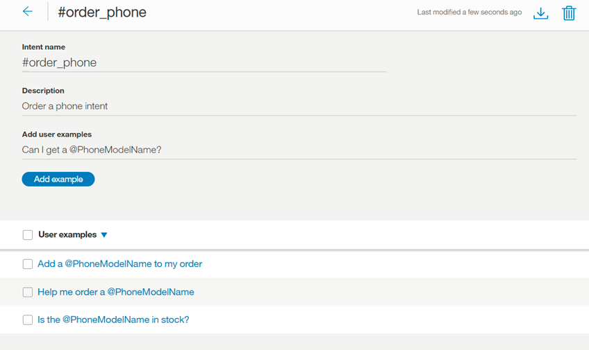
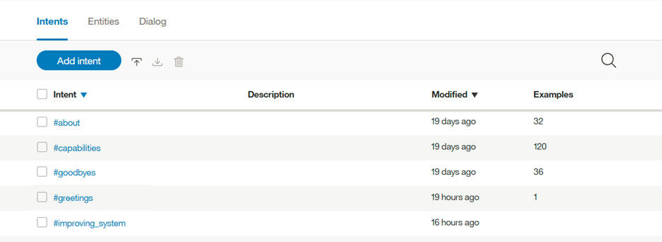

---

copyright:
  years: 2015, 2018
lastupdated: "2018-01-30"

---

{:shortdesc: .shortdesc}
{:new_window: target="_blank"}
{:tip: .tip}
{:pre: .pre}
{:codeblock: .codeblock}
{:screen: .screen}
{:javascript: .ph data-hd-programlang='javascript'}
{:java: .ph data-hd-programlang='java'}
{:python: .ph data-hd-programlang='python'}
{:swift: .ph data-hd-programlang='swift'}

# Definindo intenções
{: #intents}

***Intenções*** são propósitos ou objetivos expressos em uma entrada do cliente, como responder a uma pergunta ou processar um pagamento de conta. Ao reconhecer a intenção expressa na entrada de um cliente, o serviço {{site.data.keyword.conversationshort}} pode escolher o fluxo de diálogo correto para responder a isso.
{: shortdesc}

<iframe class="embed-responsive-item" id="youtubeplayer" type="text/html" width="640" height="390" src="https://www.youtube.com/embed/6HAZpBHqX8M" frameborder="0" webkitallowfullscreen mozallowfullscreen allowfullscreen> </iframe>

## Limites de intenção
{: #intent-limits}

O número de intenções e exemplos que você pode criar depende de seu plano de serviço {{site.data.keyword.conversationshort}}:

| Plano de Serviço     | Intenções por área de trabalho | Exemplos por área de trabalho |
|------------------|----------------------:|-----------------------:|
| Standard/Premium |                 2.000 |                 25.000 |
| Lite             |                   100 |                 25.000 |

## Criando intenções
{: #creating-intents}

Use a ferramenta {{site.data.keyword.conversationshort}} para criar intenções.

1.  Na ferramenta do {{site.data.keyword.conversationshort}}, abra a sua área de trabalho e, em seguida, selecione a guia **Intenções** na barra de navegação. Se **Intenções** não estiver visível, use o menu  para abrir a página.

1.  Selecione **Criar novo**.

1.  No campo **Nome da intenção**, digite um nome para a intenção.
    - O nome de intenção pode conter letras (em Unicode), números, sublinhados, hifens e pontos.
    - O nome não pode ser composto de `..` ou qualquer outra cadeia de somente pontos.
    - Os nomes das intenções não podem conter espaços e não devem exceder 128 caracteres. A seguir estão exemplos de nomes de intenção:
        - `#weather_conditions`
        - `#pay_bill`
        - `#escalate_to_agent`

    O conjunto de ferramentas inclui automaticamente o caractere `#` nos nomes de intenção, então você não precisa incluir um.
    {: tip}

    Inclua uma descrição da intenção no campo **Descrição**.

1.  Selecione **Criar intenção** para salvar o nome da intenção.

    

1.  Em seguida, no campo **Incluir exemplos do usuário**, digite o texto de um exemplo do usuário para a intenção. Um exemplo pode ser qualquer sequência de até 1024 caracteres de comprimento. Os seguintes podem ser exemplos para a intenção `#pay_bill`:
    - `I need to pay my bill.`
    - `Pay my account balance`
    - `make a payment`

    **Referenciando entidades e sinônimos como exemplos de intenção**

    Se você tiver definido ou planeja definir entidades que correspondam a essa intenção, consulte as entidades ou seus sinônimos associados em alguns dos exemplos. Fazer isso ajuda a estabelecer um relacionamento entre a intenção e as entidades.

    
    {: #entity-as-example}

    *Importante*:

      - Os dados de exemplo de intenção devem ser representativos e típicos de dados que os usuários finais fornecerão. Os exemplos podem ser coletados de dados reais do usuário ou de pessoas que são especialistas em seu campo específico. A natureza representativa e precisa dos dados é importante.
      - Os dados de treinamento e teste (para propósitos de avaliação) devem refletir a distribuição de intenções no uso real. Geralmente, intenções mais frequentes têm relativamente mais exemplos e melhor cobertura de resposta.
      - É possível incluir pontuação no texto de exemplo, contanto que apareça naturalmente. Se você acredita que alguns usuários expressarão suas intenções com exemplos que incluem pontuação e alguns usuários não, inclua as duas versões. Geralmente, quando mais cobertura para vários padrões, melhor a resposta.

    **Referenciando diretamente um @Entity como um exemplo de intenção**

    Você também pode escolher referenciar entidades diretamente em seus exemplos de intenção. Por exemplo, suponha que você tenha uma entidade chamada `@PhoneModelName`, que contém os valores *Galaxy S8*, *Moto Z2*, *LG G6* e *Google Pixel 2*. Ao criar uma intenção, por exemplo `#order_phone`, você pode fornecer dados de treinamento conforme a seguir:
    - Posso obter um `@PhoneModelName`?
    - Ajude-me pedir um `@PhoneModelName`.
    - O `@PhoneModelName` está no estoque?
    - Inclua um `@PhoneModelName` em minha ordem.

    

    **Nota**: atualmente, é possível referenciar diretamente somente as entidades encerradas que você define (os valores padrão serão ignorados). Não é possível usar [entidades do sistema](system-entities.html).

    Se você escolhe referenciar uma entidade como um exemplo de intenção (por exemplo, `@PhoneModelName`) *em qualquer lugar* em seus dados de treinamento, ela cancela a valor de uso de uma referência direta (por exemplo, *Galaxy S8*) em um exemplo de intenção em outro lugar. Todas as intenções então usarão a abordagem de entidade como um exemplo de intenção; não é possível selecionar essa abordagem somente para uma intenção específica.

    Na prática, isso significa que se você tiver treinado anteriormente a maioria das suas intenções com base em referências diretas (*Galaxy S8*) e agora usar referências de entidade (`@PhoneModelName`) para apenas uma intenção, isso impactará todo o seu treinamento anterior. Se você escolhe usar referências `@Entity`, precisa ter cuidado em substituir todas as referências diretas anteriores com referências `@Entity`.

    **Nota**: definir uma intenção de exemplo com um `@Entity` que tem 10 valores definidos **não** equivale a especificar essa intenção de exemplo 10 vezes. O serviço {{site.data.keyword.conversationshort}} não dá tanto peso a essa sintaxe de intenção de exemplo.

    **Importante**: os nomes de intenção e o texto de exemplo podem ser expostos em URLs quando um aplicativo interage com o serviço. Não inclua informações sensíveis ou pessoais nestes artefatos.

    Pressione **Incluir exemplo** para salvar o exemplo.

1.  Repita o mesmo processo para incluir mais exemplos. É possível usar a tecla tab entre cada exemplo. Forneça pelo menos 5 exemplos para cada intenção. Quanto mais exemplos você fornecer, mais preciso seu aplicativo pode ser.

1.  Quando você tiver concluído a inclusão de exemplos, selecione  para concluir a criação da intenção.

### Resultados

A intenção que você criou é incluída na guia Intenções e o sistema começa a treinar a si mesmo com os novos dados.

## Editando intenções

É possível selecionar qualquer intenção na lista para abri-la para edição. É possível fazer as seguintes mudanças:

- Renomear a intenção.
- Excluir a intenção.
- Incluir, editar ou excluir exemplos.
- Mover um exemplo para uma intenção diferente.

É possível usar a tecla tab do nome da intenção para cada exemplo, editando os exemplos, se você escolher.

Para mover ou excluir um exemplo, selecione o exemplo marcando a caixa de seleção e, em seguida, selecione **Mover** ou **Excluir**.

  

## Procurando intenções

Use o recurso Procurar para localizar exemplos de usuários, nomes de intenções e descrições.

1.  Seleção a guia **Intenções** na barra de navegação.

    

1.  Selecione o ícone Procurar: 

1.  Inserir um termo de procura ou frase.

    

    **Nota**: na primeira vez que você procurar, um índice será criado; você poderá ver uma mensagem para esperar enquanto os seus conteúdos estiverem sendo indexados.

### Resultados

As intenções contendo seu termo de procura, com exemplos correspondentes, são mostradas. Selecione qualquer resultado para abri-lo para edição.

  

## Importando intenções e exemplos

Se você tiver um grande número de intenções e exemplos, você pode achar mais fácil importá-los de um arquivo CSV (Valor Separado por Vírgula) do que defini-los um por um na ferramenta {{site.data.keyword.conversationshort}}.

1.  Colete as intenções e exemplos em um arquivo CSV ou exporte-os de uma planilha para um arquivo CSV. O formato obrigatório para cada linha no arquivo é o seguinte:

    ```
    <example>,<intent>
    ```
    {: screen}

    em que `<example>` é o texto de um exemplo do usuário e `<intent>` é o nome da intenção que você deseja que corresponda ao exemplo. Por exemplo:

    ```
    Tell me the current weather conditions.,weather_conditions
    Is it raining?,weather_conditions
    What's the temperature?,weather_conditions
    Where is your nearest location?,find_location
    Do you have a store in Raleigh?,find_location
    ```
    {: screen}

    > **Importante:** Salve o arquivo CSV com codificação UTF-8 e nenhuma marca de ordem de byte (BOM).

1.  Na ferramenta do {{site.data.keyword.conversationshort}}, abra a sua área de trabalho e, em seguida, selecione a guia **Intenções** na barra de navegação. Se **Intenções** não estiver visível, use o menu  para abrir a página.

1.  Selecione o ícone *Importar* . Em seguida, arraste um arquivo ou procure e selecione um arquivo de seu computador. O arquivo é validado e importado e o sistema começa a treinar com os novos dados.

    

    > **Importante:** O tamanho máximo do arquivo CSV é 10MB. Se o seu arquivo CSV for maior, considere dividi-lo em múltiplos arquivos e importá-los separadamente.

### Resultados

É possível visualizar as intenções importadas e os exemplos correspondentes na guia **Intenções**. Você pode precisar atualizar a página para ver as novas intenções e exemplos.

## Exportando intenções
{: #export_intents}

É possível exportar várias intenções para um arquivo CSV, depois é possível importar e reutilizá-las para outro aplicativo {{site.data.keyword.conversationshort}}.

1.  Na guia Intenções, selecione as intenções desejadas na lista e escolha *Exportar*.

    

## Excluindo intenções
{: #delete_intents}

É possível selecionar várias intenções para exclusão.

**IMPORTANTE**: ao excluir intenções, você também exclui todos os exemplos associados e esses itens não podem ser recuperados posteriormente. Todos os nós de diálogo que fazem referência a essas intenções devem ser atualizados manualmente para que não façam referencia ao conteúdo excluído.

1.  Na guia Intenções, selecione as intenções desejadas na lista e escolha *Excluir*.

    

## Testando suas intenções
{: #testing-your-intents}

Depois de ter concluído a criação de novas intenções, é possível testar o sistema para ver se ele reconhece suas intenções como você espera.

1.  Na ferramenta {{site.data.keyword.conversationshort}}, selecione o ícone .

1.  Na área de janela *Experimente*, insira uma pergunta ou outra sequência de texto e pressione Enter para ver qual intenção é reconhecida. Se a intenção incorreta é reconhecida, você pode melhorar seu modelo incluindo esse texto como um exemplo para a intenção correta.

    Se tiver feito mudanças recentemente em sua área de trabalho, você poderá ver uma mensagem indicando que o sistema ainda está treinando. Se você vir essa mensagem, aguarde até que o treinamento seja concluído antes de testar:
    {: tip}

    

    A resposta indica qual intenção foi reconhecida de sua entrada.

    

1.  Se o sistema não reconhecer a intenção correta, será possível corrigi-lo. Para corrigir a intenção reconhecida, selecione a intenção exibida e, em seguida, selecione a intenção correta na lista. Após o envio de sua correção, o sistema inicia automaticamente um novo treinamento para incorporar os novos dados.

    

1.  Se a entrada não estiver relacionada ao seu aplicativo, será possível indicar isso. Selecione a intenção exibida e escolha **Marcar como irrelevante**.

    

Se suas intenções não estão sendo corretamente reconhecidas, considere fazer os seguintes tipos de mudanças:

- Inclua o texto não reconhecido como um exemplo para a intenção correta.
- Mova exemplos existentes de uma intenção para outra.
- Considere se suas intenções são muito semelhantes e redefina-as conforme apropriado.

## Pontuação absoluta e Marcar como irrelevante

Desde fevereiro de 2017, há um novo algoritmo para pontuar a confiança da intenção e retornar intenções. Também é possível marcar entradas como *irrelevantes*. Essas mudanças podem requerer que você [atualizar para sua área de trabalho ](upgrading.html){: new_window}.

### Pontuação absoluta

O serviço {{site.data.keyword.conversationshort}} agora pontua a confiança de cada intenção sozinho, não em relação a outras intenções. Isso permite a flexibilidade de ter diversas intenções retornadas. Também significa que o sistema não pode retornar uma intenção de modo algum. Se a intenção superior tiver confiança baixa quanto a quaisquer intenções relacionadas à entrada do usuário (menos de 0,2), ela ainda será incluída na saída da matriz de intenções pela API, mas o condicionamento nessa #intent retornará false. Se desejar detectar o caso em que nenhuma intenção foi detectada com confiança recomendável, será possível condicionar em `irrelevant`.

Conforme as pontuações de confiança da intenção mudam, seus diálogos podem precisar de reestruturação. Por exemplo, se você condicionou seu diálogo com uma intenção que agora tem baixa confiança, a resposta do sistema não será mais correta.

### Marcar como irrelevante
{: #mark-irrelevant}

Consulte [linguagens suportadas](lang-support.html) para a disponibilidade desse recurso.

Depois de fazer upgrade de sua área de trabalho, é possível [testar a entrada](#testing-your-intents) na área de janela *Experimente* para ver as mudanças. É possível usar **Marcar como irrelevante** para indicar que a entrada não está relacionada ao seu aplicativo.

Se você tiver uma intenção, como #off_topic, para aquelas entradas que estão fora do escopo ou tópico, exclua a intenção e teste sua área de trabalho marcando que as entradas são irrelevantes.

**Importante**: Entradas que são marcadas como irrelevantes são armazenadas na área de trabalho e são incluídas como parte dos dados de treinamento. Certifique-se de que você deseja fazer essa mudança.

- As entradas não podem ser acessadas ou mudadas posteriormente no conjunto de ferramentas.
- A única maneira de remover a tag **Irrelevante** é usar a mesma entrada na área de janela *Experimente* e, em seguida, mudar a intenção.
