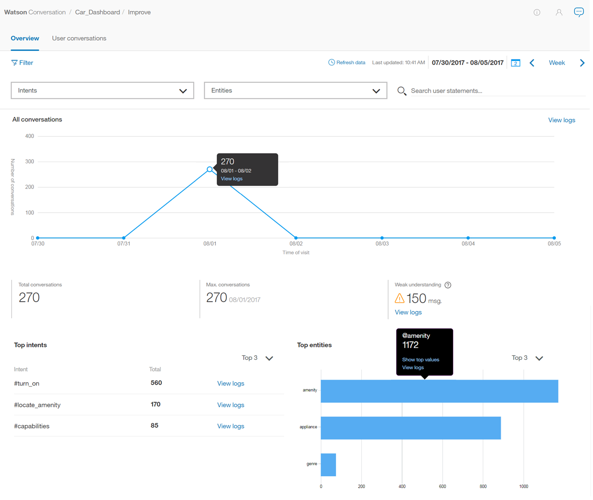

---

copyright:
  years: 2015, 2019
lastupdated: "2019-05-28"

subcollection: assistant

---

{:shortdesc: .shortdesc}
{:new_window: target="_blank"}
{:deprecated: .deprecated}
{:important: .important}
{:note: .note}
{:tip: .tip}
{:pre: .pre}
{:codeblock: .codeblock}
{:screen: .screen}
{:javascript: .ph data-hd-programlang='javascript'}
{:java: .ph data-hd-programlang='java'}
{:python: .ph data-hd-programlang='python'}
{:swift: .ph data-hd-programlang='swift'}

# Visão Geral de Métr
{: #logs-overview}

A página Visão geral fornece um resumo das interações entre os usuários e seu assistente. É possível visualizar a quantia de tráfego para um determinado período de tempo, bem como as intenções e entidades que foram reconhecidas mais frequentemente nas conversas do usuário.
{: shortdesc}

Use as métricas para responder perguntas como:

* Quais dias tiveram o maior ou menor número de conversas no último mês?
* Qual foi o número médio de conversas por semana durante o último mês?
* Quais intenções apareceram mais vezes na semana passada?
* Quais valores de entidade foram reconhecidos na maioria das vezes durante fevereiro?

Para ver informações de métricas, selecione **Visão geral** na barra de navegação.

  

## Controles
{: #logs-overview-controls}

É possível usar os controles a seguir para filtrar as informações:

- Filtros *Intenções* e *Entidades* - use um desses filtros suspensos para mostrar dados para uma intenção ou entidade específica em sua qualificação.

  **Importante** - os filtros de intenção e entidade são preenchidos pelas intenções e entidades na ***qualificação*** e não no que está na origem de dados. Se você tiver [selecionado uma origem de dados](/docs/services/assistant?topic=assistant-logs#logs-deploy-id) diferente da qualificação, talvez não veja uma intenção ou entidade de seus logs de origem de dados como uma opção nos filtros, a menos que essas intenções e entidades também estejam na qualificação.

- *Atualizar dados* - Permite atualizar as estatísticas da página Visão Geral imediatamente. A página Visão Geral mostra quando os dados que ela exibe foram atualizados pela última vez. É possível selecionar **Atualizar dados** se você acha que dados mais recentes podem estar disponíveis.

  As estatísticas representam o tráfego externo (de usuários ou chamadas da API) que interagiu com seu assistente; elas não incluem interações da área de janela *Experimente* na ferramenta.

- *Controle de período de tempo* - use esse controle para escolher o período durante o qual os dados são exibidos. Esse controle afeta todos os dados mostrados na página: não apenas o número de conversações exibidas no gráfico, mas também as estatísticas exibidas juntamente com o gráfico e as listas de principais intenções e entidades.

  As estatísticas podem cobrir um período de tempo mais longo do que o período para o qual os logs de conversas são retidos.
  {: note}

  

  É possível escolher se deve visualizar dados para um único dia, uma semana, um mês ou um trimestre. Em cada caso, os pontos de dados no gráfico são ajustados para um período de medição apropriado. Por exemplo, ao visualizar um gráfico para um dia, os dados são apresentados em valores por hora, mas ao visualizar um gráfico para uma semana, os dados são mostrados por dia. Uma semana sempre é executada de domingo até sábado. Não é possível criar períodos de tempo customizados, como uma semana que é executada de quinta à quarta-feira seguinte, ou um mês que começa em qualquer data diferente do dia primeiro.

  Se você escolher uma visualização de único dia, por exemplo, o horário mostrado para cada conversa será localizado para refletir o fuso horário de seu navegador. Diferenças poderão ocorrer no registro de data e hora mostrado se você revisar o mesmo log de conversa por meio de uma chamada de API, pois elas são sempre mostradas em UTC.

    

## Gráficos e estatísticas
{: #logs-overview-graphs}

Vários scorecards estatísticos fornecem dados do log para seu aplicativo:

* *Total de conversas* - o número total de conversas entre usuários ativos e seu aplicativo, durante o período selecionado, conforme mostrado no gráfico correspondente.

  Uma única conversa é um conjunto de mensagens que consiste nas mensagens que um usuário ativo envia para seu aplicativo e as mensagens com as quais seu aplicativo responde.

  **Importante**: uma 'conversa' é considerada como *qualquer* conjunto de mensagens enviadas ou recebidas por um aplicativo/robô, portanto, se seu assistente começar dizendo "Olá, como posso ajudá-lo?" e, em seguida, o usuário fechar seu navegador sem responder, essa mensagem será incluída na contagem total de conversas.

* * Média. msg. por conversa* - o total de mensagens recebidas durante o período selecionado dividido pelo total de conversas durante o período selecionado, conforme mostrado no gráfico correspondente.
* *Máx. de conversas* - o número máximo de conversas para um único ponto de dados dentro do período selecionado.
* *Entendimento fraco* - o número de mensagens individuais com entendimento fraco. Essas mensagens não são classificadas por uma intenção e não contêm nenhuma entidade conhecida. Isso pode ser útil para identificar problemas de diálogo potenciais.

Os gráficos detalhados fornecem informações adicionais:

* *Total de conversas* - o número total de conversas entre usuários ativos e seu aplicativo, durante o período selecionado.

  Ao visualizar o gráfico ***Conversas***, é possível clicar em um ponto de dados individual para ver o valor numérico, conforme mostrado aqui:

  

* * Média. msg. por conversa* - o total de mensagens recebidas durante o período selecionado dividido pelo total de conversas durante o período selecionado.
* *Total de mensagens* - o número total de mensagens recebidas de usuários ativos no período selecionado.
* *Usuários ativos* - o número de usuários exclusivos que se engajaram com seu aplicativo dentro do período selecionado.
* * Média. de conversas por usuário* - o total de conversas durante o período selecionado dividido pelo total de usuários exclusivos durante o período selecionado.

  Estatísticas para usuários do  * Active *  e  * Avg. de conversas por usuário* requerem um parâmetro `user_id` exclusivo. Consulte [Ativando as métricas do usuário](/docs/services/assistant?topic=assistant-logs-resources#logs-resources-user-id) para obter mais informações.
  {: important}

## Principais Intents e Principais Entidades
{: #logs-overview-tops}

Também é possível visualizar as intenções e as entidades que foram reconhecidas com maior frequência durante o período especificado.

* *Intenções principais* - Intenções são mostradas em uma lista simples. Além de ver o número de vezes que uma intenção foi reconhecida, é possível selecionar uma intenção de abrir a página **Conversas do usuário** com o intervalo de data filtrado para corresponder aos dados que você está visualizando e a intenção filtrada para corresponder à intenção selecionada.

* *Entidades principais* também são mostradas em uma lista. Para cada entidade, é possível selecionar na coluna **Valores** para ver uma lista dos valores mais comuns que foram identificados para essa entidade durante o período. Também é possível selecionar uma entidade para abrir a página **Conversas do usuário** com o intervalo de data filtrado para corresponder aos dados que você está visualizando e a entidade filtrada para corresponder à entidade selecionada.

Consulte [Melhorar suas qualificações](/docs/services/assistant?topic=assistant-logs) para obter dicas sobre como editar intenções e entidades com base em descobertas feitas, revisando aquelas que são reconhecidas por seu assistente.
