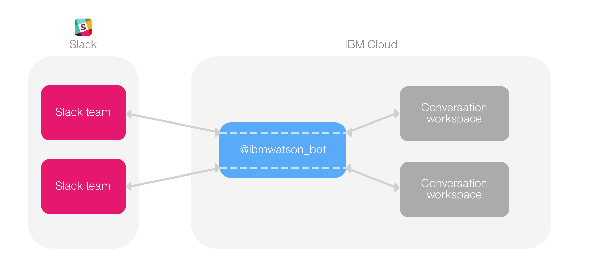

---

copyright:
  years: 2015, 2018
lastupdated: "2018-01-24"

---

{:shortdesc: .shortdesc}
{:new_window: target="_blank"}
{:tip: .tip}
{:pre: .pre}
{:codeblock: .codeblock}
{:screen: .screen}
{:javascript: .ph data-hd-programlang='javascript'}
{:java: .ph data-hd-programlang='java'}
{:python: .ph data-hd-programlang='python'}
{:swift: .ph data-hd-programlang='swift'}

# Testando no Slack

É possível usar a ferramenta de implementação de teste para integrar sua área de trabalho do {{site.data.keyword.conversationshort}} em uma equipe Slack como um usuário robô. Use esse método se você deseja testar rapidamente usando um robô Slack como a interface com o usuário para sua área de trabalho.

A ferramenta de implementação de teste usa o serviço {{site.data.keyword.openwhisk}} para implementar um aplicativo Slack pré-construído para sua equipe como um usuário robô. Esse aplicativo manipula a comunicação com suas áreas de trabalho do {{site.data.keyword.conversationshort}}.



Observe que a ferramenta de implementação de teste tem algumas limitações:

- Não é possível usar essa ferramenta para publicar um aplicativo para uso por outras equipes.
- Se você usar esse método para implementar mais de uma área de trabalho para a mesma equipe, todas as áreas de trabalho responderão para o nome do usuário `@ibmwatson_bot`. É recomendado que você utilize essa ferramenta para implementar apenas uma área de trabalho por vez para cada equipe Slack.
- Deve-se ter permissão para instalar aplicativos para sua equipe Slack. Verifique com seu administrador do Slack se você não tiver certeza se possui essa permissão.
- O aplicativo Slack pré-construído é para propósitos de teste apenas e pode não estar disponível durante todo o tempo.
- Devido a restrições do {{site.data.keyword.openwhisk_short}}, esta ferramenta está disponível atualmente apenas para a Região Sul dos EUA {{site.data.keyword.Bluemix_notm}}.

Para instalar seu aplicativo como um usuário robô:

1. Na ferramenta {{site.data.keyword.conversationshort}}, abra a área de trabalho que deseja testar no Slack.
1. Clique no ícone de menu no canto superior esquerdo e, em seguida, selecione **Implementar**. A página Opções de Implementação é aberta.

   

1. Em **Implementar com o {{site.data.keyword.openwhisk_short}}**, clique em **Testar no Slack** e siga as instruções.

   

## Conversando com o robô

Depois de concluir o processo de implementação, é possível usar o nome do usuário `@ibmwatson_bot` para interagir com a área de trabalho do {{site.data.keyword.conversationshort}}, assim como você faria com qualquer outro robô Slack.

Mantenha em mente que o robô implementado em sua equipe preserva estado para cada usuário em um canal específico. Isso significa que qualquer variável armazenada no contexto de diálogo é mantida indefinidamente, a menos que seu diálogo a limpe.

Se precisar ser capaz de reconfigurar a conversa para um estado inicial conhecido, você deverá fazer isso em seu diálogo. Certifique-se de que o diálogo possui um nó que é executado no final da conversa ou a qualquer outro momento necessário para recomeçar. Atualize o JSON para este nó para reconfigurar todas as variáveis de contexto para os valores iniciais apropriados. (Se necessário, é possível usar as ações **Ir para** ou uma intenção especial "terminar conversa" para executar esse nó.)

Por exemplo, se sua área de trabalho usa uma variável de contexto chamada `drink_order` para armazenar uma seleção de bebidas de um usuário, é possível utilizar o método `context.remove` para excluir esta variável quando a conversa termina:

```json
"context": {
   "reset_drink_order": "<?context.remove('drink_order')?>"
 }
```
{: codeblock}

Para obter informações adicionais sobre modificação de valores de variáveis de contexto, consulte [Atualizando um valor de variável de contexto](dialog-overview.html#updating-a-context-variable-value).

**Nota:** quando tiver concluído o teste de sua área de trabalho, você poderá excluir a implementação de teste voltando para a ferramenta de implementação de teste e clicando em **Excluir teste**. Lembre-se de que você também deve separadamente desautorizar o aplicativo robô em sua equipe do Slack.
