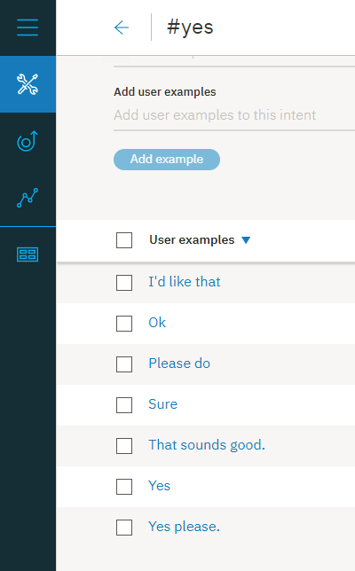
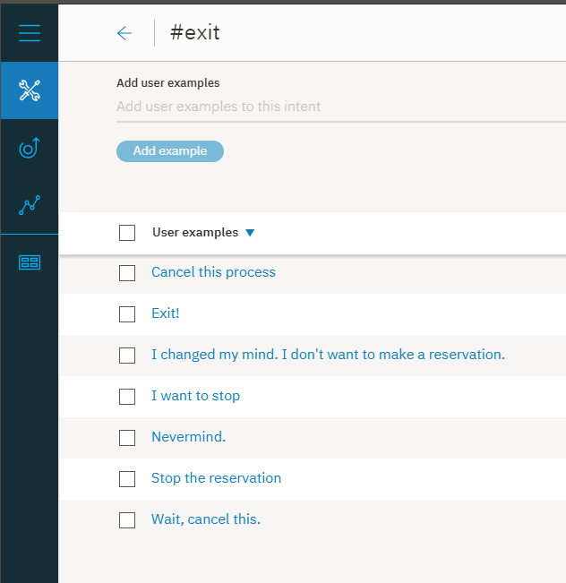
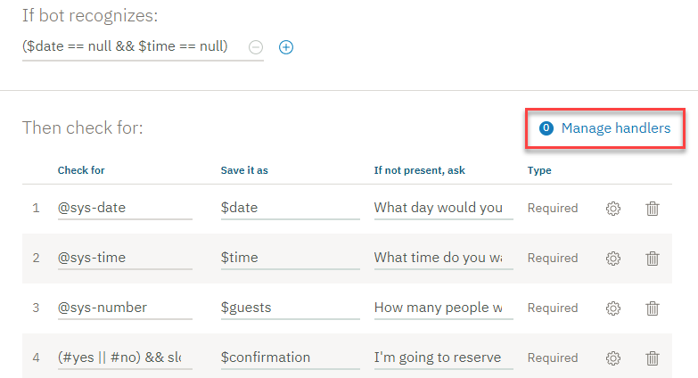

---

copyright:
  years: 2015, 2018
lastupdated: "2018-02-16"

---

{:shortdesc: .shortdesc}
{:new_window: target="_blank"}
{:tip: .tip}
{:pre: .pre}
{:codeblock: .codeblock}
{:screen: .screen}
{:javascript: .ph data-hd-programlang='javascript'}
{:java: .ph data-hd-programlang='java'}
{:python: .ph data-hd-programlang='python'}
{:swift: .ph data-hd-programlang='swift'}

# Tutorial: melhorando um nó com intervalos
{: #tutorial-slots-complex}

Neste tutorial, você aprimorará um nó simples com intervalos que coletam as informações necessárias para fazer uma reserva de restaurante.
{: shortdesc}

## Objetivos do aprendizado

Quando terminar o tutorial, você entenderá como:

- Testar um nó com intervalos
- Incluir condições de resposta de intervalo que direcionam interações com o usuário comum
- Prever e direcionar entrada do usuário não relacionada
- Manipular respostas inesperadas do usuário

### Duração
Este tutorial levará aproximadamente de 2 a 3 horas para ser concluído.

### Pré-requisito

Antes de iniciar, conclua [Incluindo um nó com intervalos em um diálogo](tutorial-slots.html). Deve-se concluir o primeiro tutorial de intervalos antes de iniciar este porque você construirá o nó com intervalos criados no primeiro tutorial.

## Etapa 1: melhorar o formato das respostas
{: #fix-format}

Quando os valores de entidade do sistema de data e hora são salvos, eles são convertidos em um formato padronizado. Esse formato padronizado é útil para executar cálculos nos valores, mas você pode não desejar expor essa reformatação para usuários. Nesta etapa, você reformatará os valores de data (`2017-12-29`) e horário (`17:00:00`) que são referenciados pelo diálogo.

1.  Para reformatar o valor da variável de contexto $date, clique no ícone **Editar resposta**  para o intervalo @sys-date.

1.  No menu **Mais**  na parte superior da página, selecione **Abrir editor JSON** e, em seguida, edite o JSON que define a variável de contexto. Inclua um método que reformate a data de modo que converta o valor `2017-12-29` para um dia integral da semana, seguido pelo mês e dia integrais. Edite o JSON como a seguir:

    ```json
    {
      "context": {
        "date": "<? @sys-date.reformatDateTime('EEEE, MMMM d') ?>"
      }
    }
    ```
    {: codeblock}

    O EEEE indica que você deseja escrever a dia da semana. Se você usar 3 Es (EEE), o dia da semana será reduzido para Fri em vez de Friday, por exemplo. O MMMM indica que você deseja escrever a mês. Novamente, se você usar somente 3 Ms (MMM), o mês será reduzido para Dec em vez de December.

1.  Clique em **Salvar**.

1.  Para mudar o formato no qual o valor de horário é armazenado na variável de contexto $time para usar a hora, os minutos e indicar AM ou PM, clique no ícone **Editar resposta**  para o intervalo @sys-time.

1.  No menu **Mais**  na parte superior da página, selecione **Abrir editor JSON**e, em seguida, edite o JSON que define a variável de contexto para que ele seja lido conforme a seguir:

    ```json
    {
      "context": {
        "time": "<? @sys-time.reformatDateTime('h:mm a') ?>"
      }
    }
    ```
    {: codeblock}

1.  Clique em **Salvar**.

1.  Teste o nó novamente. Abra a área de janela "Experimente" e clique em **Limpar** para excluir os valores das variáveis de contexto de intervalo que você especificou quando testou o nó com os intervalos antes. Para ver o impacto das mudanças feitas, use o script a seguir:

    <table>
    <caption>Detalhes do script</caption>
    <tr>
      <th>Alto-falante</th>
      <th>Elocução</th>
    </tr>
    <tr>
      <td>Você</td>
      <td>quero fazer uma reserva</td>
    </tr>
    <tr>
      <td>Watson</td>
      <td>Que dia você gostaria de vir?</td>
    </tr>
    <tr>
      <td>Você</td>
      <td>sexta-feira</td>
    </tr>
    <tr>
      <td>Watson</td>
      <td>Para qual horário você deseja que a reserva seja feita?</td>
    </tr>
    <tr>
      <td>Você</td>
      <td>5pm</td>
    </tr>
    <tr>
      <td>Watson</td>
      <td>Quantas pessoas estarão jantando?</td>
    </tr>
    <tr>
      <td>Você</td>
      <td>6</td>
    </tr>
    </table>

    Desta vez o Watson responde com `OK. I am making you a reservation for 6 on Friday, December 29 at 5:00 PM.`

Você melhorou com êxito o formato que o diálogo usa quando ele referencia valores das variáveis de contexto em suas respostas. O diálogo agora usa `Friday, December 29` em vez do mais técnico, `2017-12-29`. E ele usa `5:00 PM` em vez de `17:00:00`. Para aprender sobre outros métodos SpEL que podem ser usados com os valores de data e hora, veja [Métodos para processar valores](dialog-methods.html#date-time).

## Etapa 2: perguntar tudo de uma vez
{: #ask-for-everything}

Agora que você testou o diálogo mais de uma vez, talvez tenha notado que ele pode ser chato por ter que responder um prompt de intervalo de cada vez. Para evitar que os usuários tenham que fornecer cada uma das informações por vez, é possível pedir todas as informações necessárias antecipadamente. Fazer isso fornece ao usuário uma chance de fornecer todas ou algumas das informações em uma única entrada.

O nó com intervalos foi projetado para localizar e salvar quaisquer e todos os valores de intervalo que o usuário fornece enquanto o nó atual está sendo processado. É possível ajudar os usuários a aproveitar o design permitindo que eles saibam quais valores especificar.

Nesta etapa, você aprenderá como solicitar tudo de uma vez.

1.  No nó principal com intervalos, clique em **Customizar**.

1.  Marque a caixa de seleção **Solicitar tudo** para ativar o prompt inicial e, em seguida, clique em **Aplicar**.

   

1.  De volta na visualização de edição do nó, role para baixo até o campo recém-incluído **Se nenhum intervalo estiver pré-preenchido, perguntar isto primeiro**. Inclua o prompt inicial a seguir para o nó, `I can make a reservation for you. Just tell me the day and time of the reservation, and how many people it is for.`

1.  Clique em  para fechar a visualização de edição de nó.

1.  Teste essa mudança na área de janela "Experimente". Abra a área de janela e, em seguida, clique em **Limpar** para anular os valores das variáveis de contexto de intervalo do teste anterior.

1.  Insira `i'd like to make a reservation.`

    O diálogo agora responde com `I can make a reservation for you. Just tell me the day and time of the reservation, and how many people it is for.`

1.  Insira `it's for Saturday. There will be 2 of us coming in at 8pm`

    O diálogo responde com `OK. I am making you a reservation for 2 on Saturday at 8:00 PM.`

    

**Nota**: se o usuário fornece qualquer um dos valores de intervalo na entrada inicial, o prompt que pergunta tudo não é exibido. Por exemplo, a entrada inicial do usuário pode ser `I want to make a reservation for this Friday night.` Nesse caso, o prompt inicial é ignorado porque você não deseja perguntar informações que o usuário já forneceu - a data (`Friday`), neste exemplo. O diálogo mostra o prompt para o próximo intervalo vazio.

## Etapa 3: validar a entrada do usuário
{: #slot-conditions}

Até agora, temos considerado que o usuário fornecerá os tipos de valores apropriados para os intervalos. Na verdade, esse nem sempre é o caso. É possível considerar as vezes em que os usuários podem fornecer um valor inválido incluindo respostas condicionais em intervalos. Nesta etapa, você usará as respostas condicionais de intervalo para executar as tarefas a seguir:

- Assegure-se de que a data solicitada não esteja no passado.
- Verifique se um horário de reserva solicitado cai dentro do espaço de tempo de assento.
- Confirme a entrada do usuário.
- Indique que você está substituindo um valor por outro.

Para validar a entrada do usuário, conclua as etapas a seguir:

1.  Na visualização de edição do nó com intervalos, clique no ícone **Editar intervalo**  para o intervalo `@sys-date`.

1.  No menu **Opções**  no cabeçalho *Configurar intervalo 1*, selecione **Ativar respostas condicionais**.

1.  Na seção **Localizado**, inclua uma resposta condicional clicando no ícone **Editar resposta** .

1.  Inclua a condição e a resposta a seguir para verificar se a data que o usuário especifica cai antes de hoje:

    <table>
    <caption>Detalhes da resposta condicional 1 do intervalo 1</caption>
    <tr>
      <th>Condição</th>
      <th>Resposta</th>
      <th>Ação</th>
    </tr>
    <tr>
      <td>`@sys-date.before(now())`</td>
      <td>Não é possível fazer uma reserva para um dia no passado.</td>
      <td>Limpar o intervalo e o prompt novamente</td>
    </tr>
    </table>

1.  Inclua uma segunda resposta condicional que é exibida se o usuário fornece uma data válida. Esse tipo de confirmação simples permite que o usuário saiba que a sua resposta foi entendida.

    <table>
    <caption>Detalhes da resposta condicional 2 do intervalo 1</caption>
    <tr>
      <th>Condição</th>
      <th>Resposta</th>
      <th>Ação</th>
    </tr>
    <tr>
      <td>`true`</td>
      <td>$date it is</td>
      <td>Ir em frente</td>
    </tr>
    </table>

1.  Na visualização de edição do nó com intervalos, clique no ícone **Editar intervalo**  para o intervalo `@sys-time`.

1.  No menu **Opções**  no cabeçalho *Configurar o intervalo 2*, selecione **Ativar respostas condicionais**.

1.  Na seção **Localizado**, inclua uma resposta condicional clicando no ícone **Editar resposta** .

1.  Inclua as condições e respostas a seguir para verificar se o horário que o usuário especifica cai dentro do espaço de tempo permitido:

    <table>
    <caption>Detalhes da resposta condicional do intervalo 2</caption>
    <tr>
      <th>Condição</th>
      <th>Resposta</th>
      <th>Ação</th>
    </tr>
    <tr>
      <td>`@sys-time.after('21:00:00')`</td>
      <td>Nosso último assento é às 21h.</td>
      <td>Limpar o intervalo e o prompt novamente</td>
    </tr>
    <tr>
      <td>`@sys-time.before('09:00:00')`</td>
      <td>Nosso primeiro assento é às 9h.</td>
      <td>Limpar o intervalo e o prompt novamente</td>
    </tr>
    </table>

1.  Inclua uma resposta condicional terceiro que é exibida se o usuário fornece um horário válido que cai dentro da janela. Esse tipo de confirmação simples permite que o usuário saiba que a sua resposta foi entendida.

    <table>
    <caption>Detalhes da resposta condicional 3 do intervalo 2</caption>
    <tr>
      <th>Condição</th>
      <th>Resposta</th>
      <th>Ação</th>
    </tr>
    <tr>
      <td>`true`</td>
      <td>Ok, a reserva é para $time.</td>
      <td>Ir em frente</td>
    </tr>
    </table>

1.  Edite o intervalo @sys-number para prever e direcionar o caso quando o usuário muda o número de convidados. Se, em algum ponto enquanto o nó com intervalos está sendo processado, o usuário muda um valor de intervalo, o valor da variável de contexto de intervalo correspondente é atualizado. No entanto, isso pode ser útil para permitir que o usuário saiba que o valor está sendo substituído, tanto para dar um feedback claro ao usuário quanto para dar ao usuário uma chance de retificar isso se a mudança não era o que se pretendia. Na visualização de edição do nó com intervalos, clique no ícone **Editar intervalo**  para o intervalo `@sys-number`.

1.  No menu **Opções**  no cabeçalho *Configurar intervalo 3*, selecione **Ativar respostas condicionais**.

1.  Na seção **Localizado**, inclua uma resposta condicional clicando no ícone  e, depois, inclua a condição e resposta a seguir:

    <table>
    <caption>Detalhes da resposta condicional do intervalo 3</caption>
    <tr>
      <th>Condição</th>
      <th>Resposta</th>
      <th>Ação</th>
    </tr>
    <tr>
      <td>`(event.previous_value != null) && (event.previous_value != event.current_value)`</td>
      <td>Ok, atualizando o número de convidados de `<? event.previous_value ?>` para `<? event.current_value ?>`.</td>
      <td>Ir em frente</td>
    </tr>
    <tr>
      <td>`true`</td>
      <td>Ok. A reserva é para $guests convidados.</td>
      <td>Ir em frente</td>
    </tr>
    </table>

## Etapa 4: incluir um intervalo de confirmação
{: #confirmation-slot}

Você pode desejar projetar seu diálogo para chamar um sistema de reserva externa e realmente fazer uma reserva para o usuário no sistema. Antes que seu aplicativo tome essa ação, você provavelmente deseja confirmar com o usuário que o diálogo entendeu os detalhes da reserva corretamente. É possível fazer isso incluindo um intervalo de confirmação para o nó.

1.  O intervalo de confirmação esperará uma resposta Sim ou Não do usuário. Deve-se ensinar o diálogo para ser capaz de reconhecer uma intenção Sim ou Não na entrada do usuário primeiro.

1.  Clique na guia **Intenções** para retornar à página Intenções. Inclua as intenções e elocuções de exemplo a seguir.

- `#yes`

   ```json
   Yes
   Sure
   I'd like that
   Please do
   Yes please.
   Ok
   That sounds good.
   ```
   {: screen}

   

- `#no`

   ```json
   No
   No thanks.
   Please don't.
   Please do not!
   That's not what I want at all
   Absolutely not.
   No way
   ```
   {: screen}

   

1.  Retorne à guia **Diálogo** e, em seguida, clique para editar o nó com intervalos. Clique em **Incluir intervalo** para incluir um quarto intervalo e, em seguida, especifique os valores a seguir para ele:

    <table>
    <caption>Detalhes do intervalo de confirmação</caption>
    <tr>
      <th>Verificar</th>
      <th>Salvá-lo como</th>
      <th>Se não estiver presente, peça</th>
    </tr>
    <tr>
      <td>`(#yes || #no) && slot_in_focus`</td>
      <td>$confirmation</td>
      <td>Vou reservar para você uma mesa para $guests em $guests on $date at $time. Devo prosseguir?</td>
    </tr>
    </table>

    Esta condição verifica qualquer resposta. Você especificará o que acontece em seguida dependendo se o usuário responde Sim ou Não usando as respostas de intervalo condicional. A propriedade `slot_in_focus` força o escopo desta condição para aplicar somente ao intervalo atual. Essa configuração evita instruções aleatórias que podem corresponder a uma intenção `#yes` ou `#no` que o usuário pode fazer no acionamento desse intervalo.

    Por exemplo, o usuário pode estar respondendo o intervalo de número de convidados e dizer algo como `Yes, there will be 5 of us.` Você não deseja que o `Yes` incluído nessa resposta preencha acidentalmente o intervalo de confirmação. Ao incluir a propriedade `slot_in_focus` na condição, um yes ou no indicado pelo usuário é aplicado a esse intervalo somente quando o usuário está respondendo o prompt para esse intervalo especificamente.

1.  Clique no ícone **Editar intervalo** . No menu **Opções**  no cabeçalho *Configurar intervalo 4*, selecione **Ativar respostas condicionais**.

1.  No prompt **Localizado**, inclua uma condição que verifique uma resposta Não (`#no`). Use a resposta `Alright. Let's start over. I'll try to keep up this time.` Caso contrário, é possível presumir que o usuário confirmou os detalhes de reserva e continuar com a reserva.

    Quando a intenção `#no` é localizada, deve-se também reconfigurar as variáveis de contexto que você salvou anteriormente para nulo, para que possa perguntar as informações novamente. É possível reconfigurar os valores das variáveis de contexto usando o editor JSON. Clique no ícone **Editar resposta**  para a resposta condicional que você acabou de incluir. No menu **Opções** , clique em **Abrir editor JSON**. Inclua um bloco `context` que configure as variáveis de contexto de intervalo para `null`, conforme mostrado abaixo.

    ```json
    {
      "condições": "#no", "output":{
        "text": {
          "values": [
            "Alright. Let's start over. I'll try to keep up this time."
          ]
        }
      },
  "context":{
        "date": null,
        "time": null,
        "guests": null
      }
    }
    ```
    {: codeblock}

1.  Clique em **Voltar** e, em seguida, clique em **Salvar**.

1.  Clique no ícone **Editar intervalo**  para o intervalo de confirmação novamente. No prompt **Não localizado**, esclareça que você está esperando o usuário fornecer uma resposta Sim ou Não. Inclua uma resposta com os valores a seguir.

    <table>
    <caption>Detalhes da resposta não localizados</caption>
    <tr>
      <th>Condição</th>
      <th>Resposta</th>
    </tr>
    <tr>
      <td>`true`</td>
      <td>Responda com Sim para indicar que você deseja que a reserva seja feita no estado em que se encontra ou Não para indicar que não deseja isso.</td>
    </tr>
    </table>

1.  Clique em **Salvar**.

1.  Agora que você tem as respostas de confirmação para os valores de intervalo e pergunta tudo de uma vez, pode-se observar que as respostas de intervalo individual são exibidas antes de a resposta de intervalo de confirmação ser exibida, o que pode parecer repetitivo para os usuários. Edite as respostas localizadas do intervalo para evitar que elas sejam exibidas sob determinadas condições.

1.  Substitua a condição `true` especificada no fragmento JSON para a última resposta condicional no intervalo @sys-date por `!($time && $guests)`. Por exemplo:

    <table>
    <caption>Detalhes da resposta condicional 2 do intervalo 1</caption>
    <tr>
      <th>Condição</th>
      <th>Resposta</th>
      <th>Ação</th>
    </tr>
    <tr>
      <td>`!($time && $guests)`</td>
      <td>$date it is</td>
      <td>Ir em frente</td>
    </tr>
    </table>

1.  Substitua a condição `true` especificada no fragmento JSON para a última resposta condicional no intervalo @sys-time por `!($date && $guests)`. Por exemplo:

    <table>
    <caption>Detalhes da resposta condicional 3 do intervalo 2</caption>
    <tr>
      <th>Condição</th>
      <th>Resposta</th>
      <th>Ação</th>
    </tr>
    <tr>
      <td>`!($date && $guests)`</td>
      <td>Ok, a reserva é para $time.</td>
      <td>Ir em frente</td>
    </tr>
    </table>

1.  Substitua a condição `true` especificada no fragmento JSON para a última resposta condicional no intervalo @sys-number por `!($date && $time)`. Por exemplo:

    <table>
    <caption>Detalhes da resposta condicional 2 do intervalo 3</caption>
    <tr>
      <th>Condição</th>
      <th>Resposta</th>
      <th>Ação</th>
    </tr>
    <tr>
      <td>`!($date && $time)`</td>
      <td>Ok. A reserva é para $guests convidados.</td>
      <td>Ir em frente</td>
    </tr>
    </table>

Se você inclui mais intervalos posteriormente, deve-se editar essas condições para considerar as variáveis de contexto associadas para os intervalos adicionais. Se você não inclui um intervalo de confirmação, é possível especificar somente `!all_slots_filled` e isso permaneceria válido não importando quantos intervalos são incluídos mais tarde.

## Etapa 5: reconfigurar os valores das variáveis de contexto de intervalo
{: #reset-variables}

Você pode ter observado que, antes de cada teste, deve-se limpar os valores das variáveis de contexto que foram criados durante o teste anterior. Deve-se fazer isso porque o nó com intervalos somente solicita aos usuários as informações que ele considera ausentes. Se as variáveis de contexto de intervalo são todas preenchidas com valores válidos, nenhum prompt é exibido. O mesmo é verdadeiro para o diálogo no tempo de execução. Deve-se construir no diálogo um mecanismo pelo qual você reconfigura as variáveis de contexto de intervalo para nulo para que os intervalos possam ser preenchidos novamente pelo próximo usuário. Para fazer isso, você vai incluir um nó pai no nó com intervalos que configura as variáveis de contexto para nulo.

1.  Na visualização em árvore do diálogo, clique no ícone **Mais**  no nó com intervalos e, em seguida, selecione **Incluir nó acima**.

1.  Especifique `#reservation` como a condição para o novo nó. (Essa é a mesma condição que é usada pelo nó com intervalos, mas você mudará a condição para o nó com intervalos mais tarde neste procedimento.)

1.  Clique no ícone **Opções**  próximo à resposta do nó e, em seguida, clique em **Abrir editor JSON**. Inclua uma entrada para cada variável de contexto de intervalo que você definiu no nó com intervalos e configure-a igual a `null`.

    ```json
    {
      "context": {
        "date": null,
        "time": null,
        "guests": null,
        "confirmation": null
      },
      "output": {}
    }
    ```
    {: codeblock}

    

1.  Clique para editar o outro nó #reservation, aquele criado anteriormente e no qual os intervalos foram incluídos.

1.  Mude a condição do nó de `#reservation` para `($date == null && $time == null)` e, em seguida, feche a visualização de edição do nó clicando em .

1.  Clique no ícone **Mais**  no nó com intervalos e, em seguida, selecione **Mover**.

    

1.  Selecione o nó `#reservation` como o destino de local para o qual mover e, em seguida, escolha **Como nó-filho** no menu.

1.  Clique para editar o nó `#reservation`. Na seção *E finalmente*, mude a ação de *Aguardar entrada do usuário* para **Ignorar entrada do usuário**.

    

    Quando uma entrada do usuário corresponde à intenção `#reservation`, esse nó é acionado. As variáveis de contexto de intervalo são todas configuradas para nulo e, então, o diálogo vai diretamente para o nó com intervalos para processá-lo.

## Etapa 6: fornecer aos usuários uma maneira de sair do processo
{: #handler}

A inclusão de um nó com intervalos é poderosa, pois mantém os usuários controlando o fornecimento das informações necessárias para dar a eles uma resposta significativa ou executar uma ação em seu nome. No entanto, pode haver momentos em que um usuário está no meio do fornecimento dos detalhes de reserva, mas decide não continuar a fazer a reserva. Deve-se fornecer aos usuários uma maneira de sair do processo com êxito. É possível fazer isso incluindo um manipulador de intervalo que possa detectar o desejo de um usuário de sair do processo e sair do nó sem salvar nenhum valor coletado.

1.  Deve-se ensinar o diálogo a ser capaz de reconhecer uma intenção #exit na entrada do usuário primeiro.

1.  Clique na guia **Intenções** para retornar à página Intenções. Inclua a intenção #exit com as elocuções de exemplo a seguir.

    ```json
    I want to stop
    Exit!
    Cancel this process
    I changed my mind. I don't want to make a reservation.
    Stop the reservation
    Wait, cancel this.
    Nevermind.
    ```
    {: screen}

    

1.  Retorne ao diálogo clicando na guia **Diálogo**. Clique para abrir o nó com intervalos e, em seguida, clique em **Gerenciar manipuladores**.

    

1.  Inclua os valores a seguir nos campos.

    <table>
    <caption>Detalhes do manipulador de nível do nó</caption>
    <tr>
      <th>Condição</th>
      <th>Resposta</th>
      <th>Ação</th>
    </tr>
    <tr>
      <td>`#exit`</td>
      <td>Ok, vamos parar por aí. Nenhuma reserva será feita.</td>
      <td>Ir para resposta</td>
    </tr>
    </table>

    A ação **Ir para resposta** vai diretamente para a resposta no nível do nó sem exibir os prompts associados a qualquer um dos intervalos restantes não preenchidos.

1.  Clique em **Voltar** e, em seguida, clique em **Salvar**.

1.  Agora, você precisa editar a resposta no nível do nó para fazer com que ela reconheça quando um usuário deseja sair do processo em vez de fazer uma reserva. Inclua uma resposta condicional para o nó.

    Na visualização de edição do nó com intervalos, clique em **Customizar**, clique na alternância **Múltiplas respostas** para **ativar** e, em seguida, clique em **Aplicar**.

    

1.  Role para baixo até a seção de resposta para o nó com intervalos e, em seguida, clique em **Incluir resposta**.

1.  Inclua os valores a seguir nos campos.

    <table>
    <caption>Detalhes da resposta condicional no nível do nó</caption>
    <tr>
      <th>Condição</th>
      <th>Resposta</th>
    </tr>
    <tr>
      <td>`has_skipped_slots`</td>
      <td>Posso ajudá-lo a fazer sua próxima reserva. Tenha um bom dia.</td>
    </tr>
    </table>

    A condição `has_skipped_slots` verifica as propriedades do nó de intervalos para ver se algum dos intervalos foi ignorado. O manipulador `#exit` ignora todos os intervalos restantes para ir diretamente para a resposta do nó. Então, quando a propriedade `has_skipped_slots` está presente, você sabe que a intenção `#exit` foi acionada e o diálogo pode exibir uma resposta alternativa.

    **Nota**: se você configura mais de um intervalo para ignorar outros intervalos ou configura outro manipulador de eventos no nível do nó para ignorar intervalos, deve-se usar uma abordagem diferente para verificar se a intenção #exit foi acionada. Veja [Manipulando solicitações para sair de um processo](dialog-slots.html#slots-node-level-handler) para obter uma maneira alternativa de fazer isso.

1.  Você deseja que o serviço verifique a propriedade `has_skipped_slots` antes que ela exiba a resposta no nível do nó padrão. Mova a resposta condicional `has_skipped_slots` para cima para que ela seja processada antes da resposta condicional original ou ela nunca será acionada. Para fazer isso, clique na resposta que você acabou de incluir, use a **seta para cima** para movê-la para cima e, em seguida, clique em **Salvar**.

1.  Teste essa mudança usando o script a seguir na área de janela "Experimente".

    <table>
    <caption>Detalhes do script</caption>
    <tr>
      <th>Alto-falante</th>
      <th>Elocução</th>
    </tr>
    <tr>
      <td>Você</td>
      <td>quero fazer uma reserva</td>
    </tr>
    <tr>
      <td>Watson</td>
      <td>Eu posso fazer uma reserva para você. Basta informar o dia e a hora da reserva e para quantas pessoas ela é.</td>
    </tr>
    <tr>
      <td>Você</td>
      <td>é para 5 pessoas</td>
    </tr>
    <tr>
      <td>Watson</td>
      <td>Ok. A reserva é para 5 convidados. Que dia você gostaria de vir?</td>
    </tr>
    <tr>
      <td>Você</td>
      <td>Não faz mal</td>
    </tr>
    <tr>
      <td>Watson</td>
      <td>Ok, vamos parar por aí. Nenhuma reserva será feita.  Posso ajudá-lo a fazer sua próxima reserva. Tenha um bom dia.</td>
    </tr>
    </table>

## Etapa 7: aplicar um valor válido se o usuário falha em fornecer um após várias tentativas

Em alguns casos, um usuário pode não entender o que você está perguntando. Ele pode responder várias vezes com os tipos de valores errados. Para planejar-se para esta possibilidade, é possível incluir um contador no intervalo e, após 3 tentativas com falha pelo usuário em fornecer um valor válido, é possível aplicar um valor ao intervalo em nome do usuário e seguir em frente.

Para as informações de $time, você definirá uma instrução de acompanhamento que é exibida quando o usuário não fornece um horário válido.

1.  Crie uma variável de contexto que possa controlar quantas vezes o usuário fornece um valor que não corresponde ao tipo de valor que o intervalo espera. Você deseja que a variável de contexto seja inicializada e configurada para 0 antes de o nó com intervalos ser processado, então você irá incluí-la no nó pai `#reservation`.

1.  Clique para editar o nó `#reservation`. Abra o editor JSON associado à resposta do nó, clicando no ícone **Opções**  na seção de resposta e escolhendo **Abrir editor JSON**. Inclua uma variável de contexto chamada `counter` na parte inferior do bloco `"context"` existente, abaixo da variável `confirmation`. Configure a variável `counter` igual a `0`.

       ```json
       {
         "context": {
           "date": null,
           "time": null,
           "guests": null,
           "confirmation": null,
           "counter": 0
         }, "output": {} }
       ```
       {: codeblock}

1.  Na visualização em árvore, expanda o nó `#reservation` e, em seguida, clique para editar o nó com intervalos. 

1.  Clique no ícone **Editar intervalo**  para o intervalo `@sys-time`.

1.  No menu **Opções**  no cabeçalho *Configurar o intervalo 2*, selecione **Ativar respostas condicionais**.

1.  Na seção **Não localizado**, inclua uma resposta condicional.

    <table>
    <caption>Detalhes da resposta não localizados</caption>
    <tr>
      <th>Condição</th>
      <th>Resposta</th>
    </tr>
    <tr>
      <td>`true`</td>
      <td>Especifique o horário no qual você deseja comer. O restaurante acomoda as pessoas entre as 9h e as 21h.</td>
    </tr>
    </table>

1.  Inclua um 1 na variável `counter` cada vez que essa resposta é acionada. Lembre-se, essa resposta é acionada somente quando o usuário não fornece um valor de horário válido. Clique no ícone **Editar resposta** .

1.  Clique no ícone **Opções**  e selecione **Abrir editor JSON**. Inclua a definição de variável de contexto a seguir.

    ```json
    {
      "conditions": "true",
      "output": {
        "text": {
          "values": [
            "Please specify the time that you want to eat.
              The restaurant seats people between 9AM and 9PM."
          ]
        }
      },
"context": {
        "contador": "<? context['counter'] + 1 ?>"
      }
    }
    ```
    {: codeblock}

    This expression adds a 1 to the current counter tally.

1.  Clique em **Voltar** e, em seguida, clique em **Salvar**.

1.  Reabra o intervalo @sys-time clicando no ícone **Editar intervalo** .

    Você incluirá uma segunda resposta condicional na seção **Não localizado** que verifica se o contador é maior que 1, que indica que o usuário forneceu uma resposta inválida 3 vezes anteriormente. Nesse caso, o diálogo designa o valor de horário em nome do usuário ao horário de reserva de jantar popular de 20h. Não se preocupe, o usuário terá uma chance de mudar o valor de horário quando o intervalo de confirmação for acionado. Clique em **Incluir uma resposta**.

1.  Inclua a condição e a resposta a seguir.

    <table>
    <caption>Detalhes da resposta não localizados</caption>
    <tr>
      <th>Condição</th>
      <th>Resposta</th>
    </tr>
    <tr>
      <td>`$counter > 1`</td>
      <td>Parece que você está tendo problemas para escolher o horário. Eu farei a reserva para as 20h para você.</td>
    </tr>
    </table>

    Deve-se configurar a variável $time para 8PM, então clique no ícone **Editar resposta** . Selecione **Abrir editor JSON**, inclua a definição de variável de contexto a seguir e, em seguida, clique em **Voltar**.

    ```json
    {
      "condições": "$counter > 1", "output": {
        "text": {
          "values": [
            "You seem to be having trouble choosing a time.
              I will make the reservation at 8 PM for you."
          ]
        }
      },
"context": {
        "time": "<? '20:00:00'.reformatDateTime('h:mm a') ?>"
      }
    }
    ```
    {: codeblock}

1.  A resposta condicional que você acabou de incluir tem uma condição mais precisa do que a condição verdadeira que é usada pela primeira resposta condicional. Deve-se mover essa resposta para que venha antes da resposta condicional original ou ela nunca será acionada. Clique na resposta que você acabou de incluir e use a seta para cima para movê-la para cima e, em seguida, clique em **Salvar**.

1.  Teste suas mudanças usando o script a seguir.

| Interlocutor | Elocução |
|---------|-----------|
| Você     | quero fazer uma reserva |
| Watson  | Eu posso fazer uma reserva para você. Basta informar o dia e a hora da reserva e para quantas pessoas ela é. |
| Você     | amanhã |
| Watson  | É sexta-feira, 29 de dezembro. Para qual horário você deseja que a reserva seja feita? |
| Você     | laranja |
| Watson  | Especifique o horário no qual você deseja comer. O restaurante acomoda as pessoas entre as 9h e as 21h. |
| Você     | rosa |
| Watson  | Especifique o horário no qual você deseja comer. O restaurante acomoda as pessoas entre as 9h e as 21h. |
| Você     | púrpura |
| Watson  | Parece que você está tendo problemas para escolher o horário. Eu farei a reserva para as 20h para você.  Quantas pessoas estarão jantando? |

## Etapa 8: conectar-se a um serviço externo
{: #action}

Agora que seu diálogo pode coletar e confirmar detalhes de reserva de um usuário, é possível chamar um serviço externo para realmente reservar uma mesa no sistema do restaurante ou por meio de um serviço de reservas on-line de múltiplos restaurantes. Veja [Fazendo chamadas programáticas de um nó de diálogo](dialog-actions.html) para obter mais detalhes.

Na lógica que chama o serviço reserva, certifique-se de verificar `has_skipped_slots` e não continue com a reserva se ele estiver presente.

### Resumo

Neste tutorial, você testou um nó com intervalos e fez mudanças que otimizam como ele interage com usuários reais. Para obter mais informações sobre este assunto, veja [Reunindo informações com intervalos](dialog-slots.html).

## Próximas etapas
{: #deploy}

Implemente sua área de trabalho conectando-a com uma interface com o usuário. Há várias maneiras de fazer isso. Veja [Visão geral de implementação](deploy.html) para obter mais detalhes.
