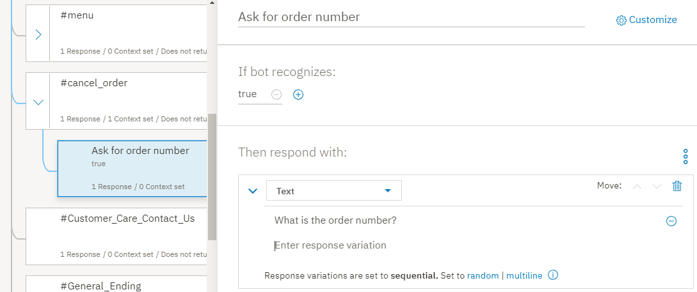
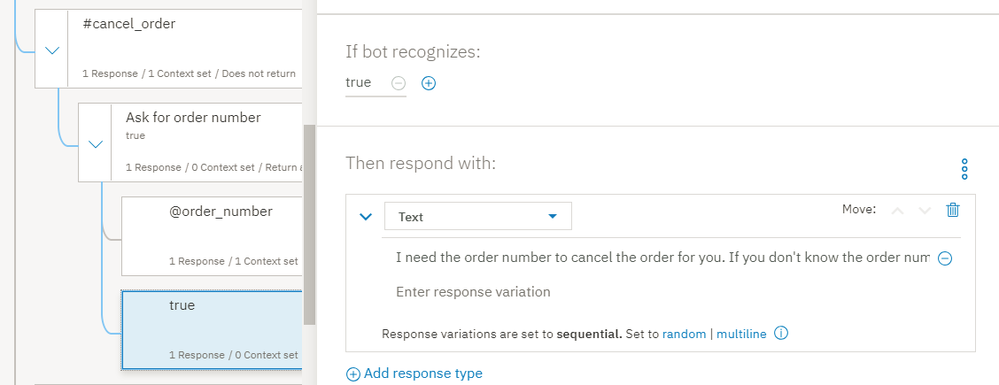
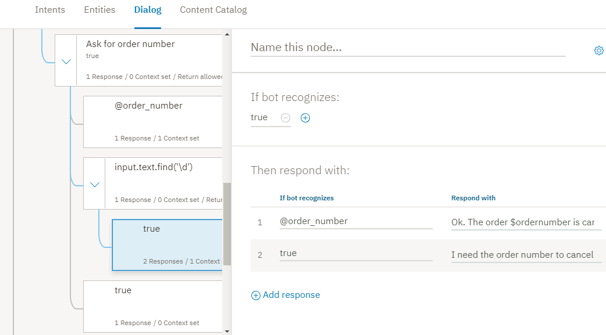
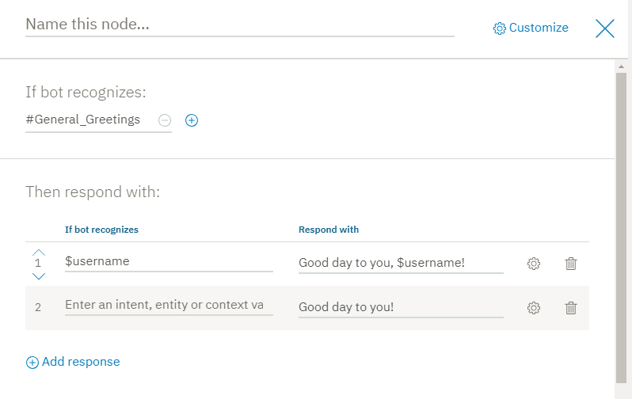

---

copyright:
  years: 2015, 2019
lastupdated: "2019-02-28"

subcollection: assistant

---

{:shortdesc: .shortdesc}
{:new_window: target="_blank"}
{:deprecated: .deprecated}
{:important: .important}
{:note: .note}
{:tip: .tip}
{:pre: .pre}
{:codeblock: .codeblock}
{:screen: .screen}
{:javascript: .ph data-hd-programlang='javascript'}
{:java: .ph data-hd-programlang='java'}
{:python: .ph data-hd-programlang='python'}
{:swift: .ph data-hd-programlang='swift'}
{:gif: data-image-type='gif'}

# Tutorial: Construindo um diálogo complexo
{: #tutorial}

Neste tutorial, você usará o serviço {{site.data.keyword.conversationshort}} para criar um diálogo para um assistente que ajuda os usuários com consultas sobre um restaurante fictício chamado *Truck Stop Gourmand*.
{: shortdesc}

## Objetivos do aprendizado
{: #tutorial-objectives}

Quando terminar o tutorial, você entenderá como:

- Planejar um diálogo
- Definir intents customizados
- Incluir nós de diálogo que podem manipular suas intenções
- Incluir entidades para tornar suas respostas mais específicas
- Incluir uma entidade padrão e usá-la no diálogo para localizar padrões na entrada do usuário
- Configurar e referenciar variáveis de contexto

### Duração
{: #tutorial-duration}

Este tutorial levará aproximadamente de 2 a 3 horas para ser concluído.

### Pré-requisito
{: #tutorial-prereqs}

Antes de iniciar, conclua o [Tutorial de Introdução](/docs/services/assistant?topic=assistant-getting-started).

Você usará a qualificação de diálogo que criou e incluirá os nós no diálogo simples que construiu como parte do exercício de introdução.

## Etapa 1: Planejar o Diálogo
{: #tutorial-plan}

Você está construindo um assistente para um restaurante denominado *Truck Stop Gourmand* que tem um local e um próspero negócio de bolinhos. Você deseja que o assistente simples responda perguntas do usuário sobre o restaurante, seu menu e cancele os pedidos de bolo do cliente. Portanto, é necessário criar intenções que manipulam consultas relacionadas aos assuntos a seguir:

- Informações de Restaurante
- Detalhes do Menu
- Pedir cancelamentos

Você iniciará criando intenções que representam esses assuntos e, em seguida, construirá um diálogo que responda às perguntas do usuário sobre eles.

## Etapa 2: responder perguntas sobre o restaurante
{: #tutorial-add-about-intent}

Inclua uma intenção que reconheça quando os clientes perguntarem detalhes sobre o restaurante em si. Uma intenção é o propósito ou objetivo expresso em entrada do usuário. A intenção `#General_About_You` que é fornecida com o catálogo de conteúdo *Geral* atende a uma função semelhante, mas seus exemplos do usuário são projetados para focar as consultas sobre o assistente, em oposição ao negócio que está usando o assistente para ajudar seus clientes. Então, você incluirá sua própria intenção.

### Inclua a intenção #about_restaurante
{: #tutorial-add-about-restaurant}

1.  Na guia **Intenções**, clique em **Incluir intenção**.

    
1.  Insira `about_restaurant` no campo *Nome da intenção* e, em seguida, clique em **Criar intenção**.

    
1.  Inclua os exemplos de usuário a seguir:

    ```
    Tell me about the restaurant
    i want to know about you
    who are the restaurant owners and what is their philosophy?
    What's your story?
    Where do you source your produce from?
    Who is your head chef and what is the chef's background?
    How many locations do you have?
    do you cater or host functions on site?
    Do you deliver?
    Are you open for breakfast?
    ```
    {: screen}

1.  Clique no ícone **Fechar**  para concluir a inclusão da intenção `#about_restaurant`.

Você incluiu uma intenção e forneceu exemplos de elocuções que os usuários reais podem inserir para acionar essa intenção.

### Incluir um nó de diálogo que é acionado pela intenção #about_restaurant
{: #tutorial-trigger-about-intent}

Inclua um nó de diálogo que reconheça quando a entrada do usuário é mapeada para a intenção que você criou na etapa anterior, significando que sua condição verifica se o serviço reconheceu a intenção `#about_restaurant` da entrada do usuário.

1.  Clique na guia  ** Diálogos ** .
1.  Localize o nó `#General_Greetings` na árvore de diálogo.

    Você incluirá um nó que verifica as perguntas sobre o restaurante abaixo desse nó de saudação inicial para refletir o fluxo que você pode esperar encontrar em uma conversa normal. Por exemplo, `Hello.` então  ` Conte-me sobre você mesmo. `

1.  Clique no ícone **Mais**  no nó `#General_Greetings` e, em seguida, selecione **Incluir o nó abaixo**.

    
1.  Comece a digitar `#about_restaurant` no campo **Inserir uma condição** desse nó. Em seguida, selecione a opção  ` #about_restaurante ` .
1.  Inclua o texto a seguir como a resposta:

    ```
    Truck Stop Gourmand é a criação de Gloria e Fred Smith. O que começou como um food truck em 2004 se expandiu para um próspero restaurante. Agora temos um restaurante tradicional no centro de Portland. A cozinha maior trouxe consigo novos chefs, mas cada um é fiel à filosofia que tornou o food truck de Smith tão popular, a começar por: entrega de produtos frescos e locais de maneira criativa e deliciosa. Junte-se a nós para o almoço ou jantar, sete dias por semana. Ou peça um bolo da nossa padaria.
    ```
    {: codeblock}

1.  Vamos incluir uma imagem na resposta também.

    Clique em  ** Incluir tipo de resposta **. Selecione  ** Imagem **  na lista suspensa. No campo **Origem de imagem**, inclua `https://www.ibmlearningcenter.com/wp-content/uploads/2018/02/IBM-Learning-Center-Food4.jpg`.
1.  Mova o tipo de resposta da imagem para cima, para que ele seja exibido na resposta antes que o texto seja exibido. Clique na seta para cima **Mover** para reordenar os dois tipos de resposta.

    

1.  Clique em  para fechar a visualização de edição.

### Teste o nó de diálogo #about_restaurante
{: #tutorial-test-about-intent}

Teste a intenção verificando se as elocuções do usuário que são semelhantes, mas não exatamente iguais, aos exemplos que você incluiu nos dados de treinamento treinaram com êxito o serviço para reconhecer a entrada com uma intenção `#about_restaurant`.

1.  Clique no ícone  para abrir a área de janela "Experimente".

1.  Insira `I want to learn more about your restaurant.`

    O serviço indica que a intenção `#about_restaurant` é reconhecida e retorna uma resposta com a imagem e o texto que você especificou para o nó de diálogo.

    

Parabéns! Você incluiu uma intenção customizada e um nó de diálogo que sabe como manipulá-lo.

A intenção `#about_restaurant` foi projetada para reconhecer uma variedade de perguntas gerais sobre o restaurante. Você incluiu um único nó para capturar essas perguntas. A resposta é longa, mas é uma instrução única que pode potencialmente responder perguntas sobre todos os tópicos a seguir:

- Os proprietários do restaurante
- A história do restaurante
- A filosofia
- O número de sites
- Os dias de operação
- As refeições servidas
- O fato de o restaurante fazer bolos por encomenda

Para tipos de perguntas gerais e mais fáceis, uma única resposta geral é adequada.

## Etapa 3: responder perguntas sobre o menu
{: #tutorial-menu}

Uma pergunta chave de potenciais clientes do restaurante é sobre o menu. O restaurante Truck Stop Gourmand muda o menu diariamente. Além de seu menu padrão, ele tem menus vegetariano e de confeitaria. Quando um usuário pergunta sobre o menu, o diálogo precisa descobrir qual menu deve ser compartilhado e, em seguida, fornecer um hyperlink para o menu que é mantido atualizado diariamente no website do restaurante. Você nunca desejará codificar permanentemente as informações em um nó de diálogo se essas informações mudarem regularmente.

### Incluir uma intenção de #menu
{: #tutorial-add-menu-intent}

1.  Clique na guia **Intenções**.
1.  Clique em **Incluir intenção**.

    

1.  Insira `menu` no campo *Nome da intenção* e, em seguida, clique em **Criar intenção**.

    

1.  Inclua os exemplos de usuário a seguir:

    ```
    I want to see a menu
    What do you have for food?
    Are there any specials today?
    where can i find out about your cuisine?
    What dishes do you have?
    What are the choices for appetizers?
    você serve desserts?
    What is the price range of your meals?
    How much does a typical dish cost?
    tell me the entree choices
    Do you offer a prix fixe option?
    ```
    {: screen}

1.  Clique no ícone **Fechar**  para concluir a inclusão da intenção `#menu`.

### Incluir um nó de diálogo que é acionado pela intenção #menu
{: #tutorial-trigger-menu-intent}

Inclua um nó de diálogo que reconheça quando a entrada do usuário é mapeada para a intenção que você criou na etapa anterior, o que significa que sua condição verifica se o serviço reconheceu a intenção `#menu` da entrada do usuário.

1.  Clique na guia  ** Diálogos ** .
1.  Localize o nó `#about_restaurant` na árvore de diálogo.

    Você incluirá um nó que verifica as perguntas sobre o menu abaixo desse nó.

1.  Clique no ícone **Mais**  no nó `#about_restaurant` e, em seguida, selecione **Incluir o nó abaixo**.

    

1.  Comece a digitar `#menu` no campo **Inserir uma condição** desse nó. Em seguida, selecione a opção  ` #menu ` .

    

1.  Inclua o texto a seguir como a resposta:

    `In keeping with our commitment to giving you only fresh local ingredients, our menu changes daily to accommodate the produce we pick up in the morning. You can find today's menu on our website.`

1.  Inclua um tipo de resposta *opção* que forneça uma lista de opções para o usuário escolher. Nesse caso, a lista de opções inclui as diferentes versões do menu que estão disponíveis.

    Clique em  ** Incluir tipo de resposta **. Selecione  ** Opção **  na lista suspensa.

    

1.  No campo **Título**, inclua *Que menu você deseja ver?*

    

1.  Clique em  ** Incluir opção **.

1.  No campo  ** Rótulo ** , inclua  ` Padrão `. O texto que você inclui como o rótulo é exibido na resposta para o usuário como uma opção selecionável.

1.  No campo **Valor**, inclua `standard menu`. O texto que você especifica como o valor é o que é enviado para o serviço como uma nova entrada do usuário quando um usuário escolhe essa opção na lista e clica nela.

1.  Repita as duas etapas anteriores para incluir informações de rótulo e de valor para os tipos de menu restantes:

    <table>
    <caption>Detalhes do Tipo de Resposta da Opção</caption>
    <tr>
      <th>Rótulo</th>
      <th>Valor</th>
    </tr>
    <tr>
      <td>Vegetariano</td>
      <td>menu vegetariano</td>
    </tr>
    <tr>
      <td>Cake shop</td>
      <td>cardápio de bolo</td>
    </tr>
    </table>

    

1.  Clique em  para fechar a visualização de edição.

### Incluir uma entidade @menu
{: #tutorial-add-menu-entity}

Para reconhecer os diferentes tipos de menus que os clientes indicam que desejam ver, você incluirá uma entidade `@menu`. As entidades representam uma classe de objeto ou um tipo de dados que é relevante para o propósito de um usuário. Verificando a presença de entidades específicas na entrada do usuário, é possível incluir mais respostas, cada uma padronizada para direcionar uma solicitação do usuário distinta. Nesse caso, você incluirá uma entidade `@menu` que pode distinguir entre tipos de menu diferentes.

1.  Clique na guia  ** Entidades ** .

    

1.  Clique em **Incluir entidade**.

1.  Insira `menu` no campo de nome da entidade.

    

1.  Clique em  ** Criar entidade **.

1.  Inclua `standard` no campo *Nome do valor* e, em seguida, inclua `standard menu` no campo **Sinônimos** e pressione Enter.

1.  Inclua os sinônimos adicionais a seguir:

    - bill of fare
    - cuisine
    - carte du jour

    

1.  Clique em **Incluir valor** para incluir o valor `@menu:standard`.

1.  Inclua `vegetarian` no campo *Nome do valor* e, em seguida, inclua `vegetarian menu` no campo **Sinônimos** e pressione Enter.

1.  Clique em **Mostrar recomendações** e, em seguida, clique nas caixas de seleção para *meatless diet*, *meatless* e *vegan diet*.

1.  Clique em  ** Incluir selecionado **.

1.  Clique no campo *Incluir sinônimo* vazio e, em seguida, inclua estes sinônimos adicionais:

    - vegan
    - somente plantas

    

1.  Clique em **Incluir valor** para incluir o valor `@menu:vegetarian`.

1.  Inclua `cake` no campo *Nome do valor* e, em seguida, inclua `cake menu` no campo **Sinônimos** e pressione Enter.

1.  Inclua os sinônimos adicionais a seguir:

    - cardápio de bolo
    - menu de sobremesas
    - Ofertas de padaria

    

1.  Clique em **Incluir valor** para incluir o valor `@menu:cake`.

1.  Clique no ícone **Fechar**  para concluir a inclusão da entidade `@menu`.

### Incluir nós-filhos que são acionados pelos tipos de entidade @menu
{: #tutorial-trigger-menu-entity}

Nesta etapa, você incluirá nós-filhos no nó de diálogo que verifica a intenção `#menu`. Cada nó-filho mostrará uma resposta diferente dependendo do tipo de entidade `@menu` que o usuário escolhe na lista de opções.

1.  Clique na guia  ** Diálogos ** .
1.  Localize o nó `#menu` na árvore de diálogo.

    Você incluirá um nó-filho para manipular cada opção de tipo de menu que você incluiu no nó `#menu`.

1.  Clique no ícone **Mais**  no nó `#menu` e, em seguida, selecione **Incluir nó-filho**.

    

1.  Comece a digitar `@menu:standard` no campo **Inserir uma condição** desse nó. Em seguida, selecione a opção  ` @menu:standard ` .

1.  Inclua a mensagem a seguir no campo de texto de resposta, `To see our menu, go to the <a href="https://www.example.com/menu.html" target="blank">menu</a> page on our website.`

    

1.  Clique em  para fechar a visualização de edição.

1.  Clique no ícone **Mais**  no nó `@menu:standard` e, em seguida, selecione **Incluir o nó abaixo**.

1.  Comece a digitar `@menu:vegetarian` no campo **Inserir uma condição** desse nó. Em seguida, selecione a opção  ` @menu:vegetariano ` .

1.  Inclua a mensagem a seguir no campo de texto de resposta, `To see our vegetarian menu, go to the <a href="https://www.example.com/vegetarian-menu.html" target="blank">vegetarian menu</a> page on our website.`

    

1.  Clique em  para fechar a visualização de edição.

1.  Clique no ícone **Mais**  no nó `@menu:vegetarian` e, em seguida, selecione **Incluir o nó abaixo**.

1.  Comece a digitar `@menu:cake` no campo **Inserir uma condição** desse nó. Em seguida, selecione a opção  ` @menu:cake ` .

1.  Inclua a mensagem a seguir no campo de texto de resposta, `To see our cake shop menu, go to the <a href="https://www.example.com/menu.html" target="blank">cake shop menu</a> page on our website.`

    

1.  Clique em  para fechar a visualização de edição.

1.  É provável que o menu padrão seja solicitado com mais frequência, portanto, mova-o para a parte inferior da lista de nós-filhos. Colocá-lo por último pode ajudar a evitar que ele seja acionado acidentalmente quando alguém perguntar sobre um menu de especialidade em vez do menu padrão.

1.  Clique no ícone **Mais**  no nó `@menu:standard` e, em seguida, selecione **Mover**.

    

1.  Selecione o nó `@menu:cake` e, em seguida, escolha **Abaixo do nó**.

    

Você incluiu nós que reconhecem solicitações do usuário para detalhes do menu. Sua resposta informa ao usuário que há três tipos de menus disponíveis e solicita que ele escolha um. Quando o usuário escolhe um tipo de menu, é exibida uma resposta que fornece um link de hipertexto para uma página da web com os detalhes do menu solicitados.

### Testar os nós de diálogo de opções de menu
{: #tutorial-test-menu-options-intent}

Teste os nós de diálogo que você incluiu para reconhecer as perguntas do menu.

1.  Clique no ícone  para abrir a área de janela "Experimente".

1.  Insira `What type of food do you serve?`

    O serviço indica que a intenção `#menu` é reconhecida e exibe a lista de opções de menu para o usuário escolher.

    
1.  Clique na opção  ` Cake shop ` .

    O serviço reconhece a intenção `#menu` e a referência de entidade `@menu:cake` e exibe a resposta `To see our cake shop menu, go to the cake shop page on our website.`

    
1.  Clique no hyperlink *confeitaria* na resposta.

    Uma nova página do navegador da web é aberta e exibe o website example.com.

1.  Feche a página do navegador da web.

Bom trabalho. Você incluiu com êxito uma intenção e uma entidade que podem reconhecer solicitações do usuário para obter detalhes do menu e podem direcionar os usuários para o menu apropriado.

A intenção `#menu` representa uma necessidade chave comum de potenciais clientes do restaurante. Devido à sua importância e popularidade, você incluiu uma seção mais complexa no diálogo para direcioná-lo bem.

## Etapa 4: Gerenciar pedidos de bolo
{: #tutorial-manage-orders}

Os clientes fazem pedidos pessoalmente, pelo telefone ou usando o formulário de pedido no website. Depois que o pedido é feito, os usuários podem cancelá-lo por meio do assistente virtual. Primeiro, defina uma entidade que possa reconhecer números de pedido. Em seguida, inclua uma intenção que reconheça quando os usuários desejam cancelar um pedido de bolo.

### Incluindo uma entidade padrão de número de pedido
{: tutorial-add-pattern-entity}

Você deseja que o assistente reconheça os números de pedido, portanto, criará uma entidade padrão para reconhecer o formato exclusivo que o restaurante usa para identificar seus pedidos. A sintaxe de números de pedido usados pela padaria do restaurante é 2 letras maiúsculas seguidas por 5 números. Por exemplo,  ` YR34663 `. Inclua uma entidade que possa reconhecer esse padrão de caractere.

1.  Clique na guia  ** Entidades ** .
1.  Clique em **Incluir entidade**.
1.  Insira `order_number` no campo de nome da entidade.
1.  Clique em  ** Criar entidade **.

    
1.  Inclua `order_syntax` no campo *Nome do valor* e, em seguida, clique na seta para baixo ao lado de **Sinônimos** para mudar o tipo para **Padrões**.

    
1.  Inclua a expressão regular a seguir no campo Padrão: `[A-Z]{2}\d{5}`

    

1.  Clique em **Incluir valor**.

    

1.  Clique no ícone **Fechar** para concluir a inclusão da entidade `@order_number`.

    

### Incluir uma intenção de ordem de cancelamento
{: #tutorial-cancel-order-intent}

1.  Clique na guia **Intenções**.
1.  Clique em **Incluir intenção**.
1.  Insira `cancel_order` no campo *Nome da intenção* e, em seguida, clique em **Criar intenção**.
1.  Inclua os exemplos de usuário a seguir:

    ```
    I want to cancel my cake order
    I need to cancel an order I just placed
    Can I cancel my cake order?
    I'd like to cancel my order
    There's been a change. I need to cancel my bakery order.
    please cancel the birthday cake order I placed last week
    The party theme changed; we don't need a cake anymore
    that order i placed, i need to cancel it.
    ```
    {: screen}

    
1.  Clique no ícone **Fechar**  para concluir a inclusão da intenção `#cancel_order`.

### Incluir uma intenção de yes
{: #tutorial-yes-intent}

Antes de executar uma ação em nome do usuário, deve-se obter a confirmação de que você está tomando a ação adequada. Inclua uma intenção #yes no diálogo que possa reconhecer quando um usuário concorda com o que o serviço está propondo.

1.  Clique na guia **Intenções**.
1.  Clique em **Incluir intenção**.
1.  Insira `yes` no campo *Nome da intenção* e, em seguida, clique em **Criar intenção**.
1.  Inclua os exemplos de usuário a seguir:

    ```
    Yes
    Correct
    Please do.
    You've got it right.
    Please do that.
    that is correct.
    That's right
    yeah
    Yup
    Yes, I'd like to go ahead with that.
    ```
    {: screen}

    
1.  Clique no ícone **Fechar**  para concluir a inclusão da intenção `#yes`.

### Incluir nós de diálogo que podem gerenciar solicitações para cancelar um pedido
{: #tutorial-cancel-order-dialog}

Agora, inclua um nó de diálogo que possa manipular solicitações para cancelar um pedido de bolo.

1.  Clique na guia  ** Diálogo ** .
1.  Localize o nó  ` #menu ` . Clique no ícone **Mais**  no nó `#menu` e, em seguida, selecione **Incluir o nó abaixo**.
1.  Comece a digitar `#cancel_order` no campo **Inserir uma condição** desse nó. Em seguida, selecione a opção  ` #cancel_order ` .
1.  Inclua a mensagem a seguir no campo de texto de resposta:

    ```
    If the pickup time is more than 48 hours from now, you can cancel your order.
    ```
    {: codeblock}

    

    Antes de poder realmente cancelar o pedido, é necessário saber o número do pedido. O usuário pode especificar o número do pedido na solicitação original. Portanto, para evitar perguntar o número do pedido novamente, verifique um número com o padrão de número do pedido na entrada original. Para fazer isso, defina uma variável de contexto que salvará o número do pedido se ele for especificado.

1.  Abra o editor de contexto. Clique no ícone **Mais**  e selecione **Abrir editor de contexto**.

    
1.  Insira o par de valores e nome da variável de contexto a seguir:

    <table>
    <caption>Detalhes da Variável de Contexto do</caption>

    <tr>
      <th>Variável</th>
      <th>Valor</th>
    </tr>
    <tr>
      <td>$ordernumber</td>
      <td><? @order_number.literal ?></td>
    </tr>
    </table>

    O valor da variável de contexto (`<? @order_number.literal ?>`) é uma expressão SpEL que captura o número especificado pelo usuário que corresponde ao padrão definido pela entidade padrão @order_number. O salvamento é feito na variável `$ordernumber`.

    
1.  Clique em  para fechar a visualização de edição.

    Agora, inclua nós-filhos que perguntam o número do pedido ou obtêm confirmação do usuário de que deseja cancelar um pedido com o número do pedido detectado.
1.  Clique no ícone **Mais**  no nó `#cancel_order` e, em seguida, selecione **Incluir nó-filho**.

    
1.  Inclua um rótulo no nó para distingui-lo de outros nós-filhos que você incluirá. No campo de nome, inclua `Ask for order number`. Digite `true` no campo **Inserir uma condição** desse nó.

1.  Inclua a mensagem a seguir no campo de texto de resposta:

    ```
    What is the order number?
    ```
    {: codeblock}

    
1.  Clique em  para fechar a visualização de edição.

    Agora, inclua outro nó-filho que informa ao usuário que você está cancelando o pedido.
1.  Clique no ícone **Mais**  no nó `Add child node` e, em seguida, selecione **Incluir nó-filho**.
1.  Digite `@order_number` no campo **Inserir uma condição** desse nó.
1.  Abra o editor de contexto. Clique no ícone **Mais**  e selecione **Abrir editor de contexto**.
1.  Insira o par de valores e nome da variável de contexto a seguir:

    <table>
    <caption>Detalhes da Variável de Contexto do</caption>

    <tr>
      <th>Variável</th>
      <th>Valor</th>
    </tr>
    <tr>
      <td>$ordernumber</td>
      <td><? @order_number.literal ?></td>
    </tr>
    </table>

    O valor da variável de contexto (`<? @order_number.literal ?>`) é uma expressão SpEL que captura o número especificado pelo usuário que corresponde ao padrão definido pela entidade padrão @order_number. O salvamento é feito na variável `$ordernumber`.
1.  Inclua a mensagem a seguir no campo de texto de resposta:

    ```
    Ok. The order $ordernumber is canceled. We hope we get the opportunity to bake a cake for you sometime soon.
    ```
    {: codeblock}

    
1.  Clique em  para fechar a visualização de edição.
1.  Inclua outro nó para capturar o caso em que um usuário fornece um número, mas ele não é um número do pedido válido. Clique no ícone **Mais** no nó `@order_number` e, em seguida, selecione **Incluir o nó abaixo**.
1.  Digite `true` no campo **Inserir uma condição** desse nó.
1.  Inclua a mensagem a seguir no campo de texto de resposta:

    ```
    I need the order number to cancel the order for you. If you don't know the order number, please call us at 958-234-3456 to cancel over the phone.
    ```
    {: codeblock}

    
1.  Clique em  para fechar a visualização de edição.

1.  Inclua um nó abaixo do nó da solicitação de cancelamento de pedido inicial que responde no caso em que o usuário fornece o número do pedido na solicitação inicial, assim não é necessário perguntá-lo novamente. Clique no ícone **Mais**  no nó `#cancel_order` e, em seguida, selecione **Incluir nó-filho**.
1.  Inclua um rótulo no nó para distingui-lo de outros nós-filhos. No campo de nome, inclua `Number provided`. Digite `@order_number` no campo **Inserir uma condição** desse nó.
1.  Inclua a mensagem a seguir no campo de texto de resposta:

    ```
    Just to confirm, you want to cancel order $ordernumber?
    ```
    {: codeblock}

    
1.  Clique em  para fechar a visualização de edição.

    Deve-se incluir nós-filhos que verificam a resposta do usuário para sua pergunta de confirmação.
1.  Clique no ícone **Mais**  no nó `Number provided` e, em seguida, selecione **Incluir nó-filho**.
1.  Digite `#yes` no campo **Inserir uma condição** desse nó.

1.  Inclua a mensagem a seguir no campo de texto de resposta:

    ```
    Ok. The order $ordernumber is canceled. We hope we get the opportunity to bake a cake for you sometime soon.
    ```
    {: codeblock}

    
1.  Clique em  para fechar a visualização de edição.

1.  Clique no ícone **Mais**  no nó `#yes` e, em seguida, selecione **Incluir o nó abaixo**.

1.  Digite `true` no campo **Inserir uma condição** desse nó.

    Não inclua uma resposta. Em vez disso, você redirecionará os usuários para a ramificação que pergunta os detalhes do número do pedido criados anteriormente.

1.  Na seção *E finalmente*, escolha **Ir para**.

    
1.  Selecione a condição do nó *Perguntar o número do pedido*.

    
1.  Clique em  para fechar a visualização de edição.
1.  Mova o nó *Número fornecido* acima do nó *Perguntar o número do pedido*. Clique no ícone **Mais**  no nó `Number provided` e, em seguida, selecione **Mover**. Selecione o nó *Perguntar o número do pedido* e, em seguida, clique em **Acima do nó**.

    
1.  Force a conversa para avaliar os nós-filhos sob o nó `#cancel_order` no tempo de execução. Clique para abrir o nó `#cancel_order` na visualização de edição e, em seguida, na seção `And finally`, selecione `Skip user input`.

    

### Testar os cancelamentos de pedido
{: #tutorial-test-cancel-order}

Teste se o serviço pode reconhecer padrões de caracteres que correspondem ao padrão usado para números de pedido do produto na entrada do usuário.

1.  Clique no ícone  para abrir a área de janela "Experimente".

1.  Insira `i want to cancel my order number TW12345.`

    O serviço reconhece a intenção `#cancel_order` e a entidade `@order_number`. Ele responde com `If the pickup time is more than 48 hours from now, you can cancel your order. Just to confirm, you want to cancel order TW12345?`

1.  Insira,  ` Sim `.

    O serviço reconhece a intenção `#yes` e responde com `Ok. The order TW12345 is canceled. We hope we get the opportunity to bake a cake for you sometime soon.`

    

    Agora, tente isso quando você não souber o número do pedido.
1.  Clique em **Limpar** na área de janela "Experimente" para recomeçar. Insira `I want to cancel my order.`

    O serviço reconhece a intenção `#cancel_order` e responde com `If the pickup time is more than 48 hours from now, you can cancel your order. What is the order number?`

1.  Insira,  ` Eu não sei. `

    O serviço responde com `I need the order number to cancel the order for you. If you don't know the order number, please call us at 958-234-3456 to cancel over the phone.`

    

Se você fizer mais testes, poderá achar que o diálogo não é muito útil em cenários em que o usuário não se lembra do formato do número do pedido. O usuário pode incluir somente os números ou as letras também, mas esquecer que elas devem estar em maiúsculas. Então, seria muito bom dar a eles uma sugestão em tais casos, certo? Se você desejar ser gentil, inclua outro nó na árvore de diálogo que verifica os números na entrada do usuário.

1.  Localize o nó `@order-number` que é um filho do nó *Perguntar o número do pedido*.

1.  Clique no ícone **Mais**  no nó `@order-number` e, em seguida, selecione **Incluir o nó abaixo**.

1.  No campo de condição, inclua `input.text.find('\d')`, que é uma expressão SpEL que diz que se você localizar um ou mais números na entrada do usuário, essa resposta será acionada.

1.  No campo de resposta de texto, inclua a resposta a seguir:

    ```
    The correct format for our order numbers is AAnnnnn. The A's represents 2 upper-case letters, and the n's represents 5 numbers. Você tem um número do pedido nesse formato?
    ```
    {: codeblock}

1.  Clique em  para fechar a visualização de edição.

1.  Clique no ícone **Mais**  no nó `input.text.find('\d')` e, em seguida, selecione **Incluir nó-filho**.

1.  Digite `true` no campo **Inserir uma condição** desse nó.

1.  Ative as respostas condicionais clicando em **Customizar** e, em seguida, fazendo a alternância de *Múltiplas respostas* para **ativado**.

1.  Clique em **Aplicar**.

1.  No campo recém-incluído *Se o robô reconhecer*, digite `@order_number` e, no campo *Responder com*, digite:

    ```
    Ok. The order $ordernumber is canceled. We hope we get the opportunity to bake a cake for you sometime soon.
    ```
    {: codeblock}

1.  Clique em  ** Incluir resposta **.

1.  No campo *Se o robô reconhecer*, digite `true` e, no campo *Responder com*, digite:

    ```
    I need the order number to cancel the order for you. If you don't know the order number, please call us at 958-234-3456 to cancel over the phone.
    ```
    {: codeblock}

    
1.  Clique em  para fechar a visualização de edição.

Agora, quando você testar, será possível fornecer um conjunto de números ou uma combinação de números e texto como entrada e o diálogo lembrará o formato do número do pedido correto. Você testou com êxito seu diálogo, localizou uma fragilidade nele e corrigiu-a.

Outra maneira possível de direcionar esse tipo de cenário é incluir um nó com intervalos. Consulte o tutorial [Incluindo um nó com intervalos em um diálogo](/docs/services/assistant?topic=assistant-tutorial-slots) para saber mais sobre o uso de intervalos.
{:tip}

## Etapa 5: incluir o toque pessoal
{: #tutorial-get-username}

Se o usuário mostrar interesse no robô em si, você desejará que o assistente virtual reconheça essa curiosidade e se engaje com o usuário de uma maneira mais pessoal. Você pode se lembrar da intenção `#General_About_You`, que é fornecida com o catálogo de conteúdo *Geral*, que consideramos usar anteriormente, antes de ter incluído sua própria intenção `#about_restaurant` customizada. Ela é construída para reconhecer apenas essas perguntas do usuário. Inclua um nó que condicione essa intenção. Em sua resposta, é possível perguntar o nome do usuário e salvá-lo em uma variável $username que pode ser usada em outro lugar no diálogo, se disponível.

Primeiro, é necessário certificar-se de que o serviço reconheça um nome se o usuário fornece um. Portanto, é possível ativar a entidade `@sys-person`, que é projetada para reconhecer os nomes e sobrenomes comuns (em inglês).

### Incluir uma entidade do sistema de pessoa
{: #tutorial-add-person-entity}

O serviço fornece várias *entidades do sistema*, que são entidades comuns que podem ser usadas para qualquer aplicativo.

1.  Clique na guia **Entidades** e, em seguida, clique em **Entidades do sistema**.

1.  Localize a alternância de entidade *`@sys-person`* e, em seguida, alterne-a para **Ativado**.

    

### Incluir um nó que manipula perguntas sobre o robô
{: #tutorial-add-about-you-node}

Agora, inclua um nó de diálogo que possa reconhecer o interesse do usuário no robô e responda.

1.  Clique na guia  ** Diálogos ** .
1.  Localize o nó `Welcome` na árvore de diálogo.
1.  Clique no ícone **Mais**  no nó `Welcome` e, em seguida, selecione **Incluir o nó abaixo**.
1.  Comece a digitar `#General_About_You` no campo **Inserir uma condição** desse nó. Em seguida, selecione a opção  ` #General_About_You ` .
1.  Inclua a mensagem a seguir no campo de texto de resposta:

    ```
    I am a virtual assistant that is designed to answer your questions about the Truck Stop Gourmand restaurant. What's your name?
    ```
    {: codeblock}

    
1.  Clique em  para fechar a visualização de edição.
1.  Clique no ícone **Mais**  no nó `#General_About_You` e, em seguida, selecione **Incluir nó-filho**.
1.  Comece a digitar `@sys-person` no campo **Inserir uma condição** desse nó. Em seguida, selecione a opção  ` @sys-person ` .
1.  Inclua a mensagem a seguir no campo de texto de resposta:

    ```
    Hello, <? @sys-person.literal ?>! It's lovely to meet you. How can I help you today.
    ```
    {: codeblock}

1.  Para capturar o nome que o usuário fornece, inclua uma variável de contexto no nó. Clique no ícone **Mais**  e selecione **Abrir editor de contexto**.
1.  Insira o par de valores e nome da variável de contexto a seguir:

    <table>
    <caption>Detalhes da variável de contexto do nome do</caption>

    <tr>
      <th>Variável</th>
      <th>Valor</th>
    </tr>
    <tr>
      <td>$username</td>
      <td><? @sys-person.literal ?></td>
    </tr>
    </table>

    O valor da variável de contexto (`<? @sys-person.literal ?>`) é uma expressão SpEL que captura o nome do usuário como ele é especificado pelo usuário e, em seguida, salva-o na variável de contexto `$username`.

    
1.  Clique em  para fechar a visualização de edição.
1.  Clique no ícone **Mais**  no nó `@sys-person` e, em seguida, selecione **Incluir o nó abaixo**.

    Você incluirá um nó para capturar respostas do usuário que não incluem um nome. Se o usuário escolher não compartilhá-lo, você desejará que o robô mantenha a conversa seguindo de qualquer maneira.
1.  Digite `true` no campo **Inserir uma condição** desse nó.
1.  Inclua a mensagem a seguir no campo de texto de resposta:

    ```
    How can I help you today?
    ```
    {: codeblock}

    
1.  Clique em  para fechar a visualização de edição.

Se, no tempo de execução, o usuário acionar esse nó e fornecer um nome, você saberá o nome do usuário. Se você o souber, deverá usá-lo. Inclua respostas condicionais no nó de diálogo de saudação que você incluiu anteriormente para incluir uma resposta condicional que use o nome do usuário, se ele for conhecido.

### Incluir o nome do usuário na saudação
{: #tutorial-add-username-to-greeting}

Se você souber o nome do usuário, deverá incluí-lo em sua mensagem de saudação. Para fazer isso, inclua respostas condicionais e inclua uma variação da saudação que inclui o nome do usuário.

1.  Localize o nó `#General_Greetings` na árvore de diálogo e clique para abri-lo na visualização de edição.
1.  Clique em **Customizar** e, em seguida, alterne *Múltiplas respostas* para **Ativado**.

    
1.  Clique em **Aplicar**.

    
1.  Clique em  ** Incluir resposta **.
1.  No campo *Se o robô reconhecer*, digite `$username` e, no campo *Responder com*, digite:

    ```
    Good day to you, $username!
    ```
    {: codeblock}

1.  Clique na seta para cima para o número de resposta 2 para movê-lo de forma que seja listado antes do número de resposta 1 (`Good day to you!`).

    
1.  Clique em  para fechar a visualização de edição.

### Testar a personalização
{: #tutorial-test-personalize}

Teste se o serviço pode reconhecer e salvar o nome de um usuário e, em seguida, referir-se ao usuário por ele posteriormente.

1.  Clique no ícone  para abrir a área de janela "Experimente".

1.  Clique em **Limpar** para reiniciar a sessão de conversa.

1.  Insira,  ` Quem é você? `

    O serviço reconhece a intenção  ` #General_About_You ` . Sua resposta termina com a pergunta `What's your name?`
1.  Insira,  ` I am Jane Doe. `

    O serviço reconhece `Jane Doe` como uma menção de entidade `@sys-person`. Ele faz comentários sobre seu nome e, em seguida, pergunta como pode ajudá-lo.
1.  Insira `Hello.`

    O serviço reconhece a intenção `#General_Greetings` e diz `Good day to you, Jane Doe!` Ele usa a resposta condicional que inclui o nome do usuário porque a variável de contexto `$username` contém um valor no momento em que o nó de saudação é acionado.

    

É possível incluir uma resposta condicional que condiciona e inclui o nome do usuário para quaisquer outras respostas em que a personalização incluiria um valor na conversa.

## Etapa 6: testar o assistente em sua integração de página da web
{: #tutorial-integrate-assistant}

Agora que você construiu uma versão mais sofisticada do assistente, retorne para a página da web pública implementada como parte do tutorial anterior e, em seguida, teste os novos recursos incluídos.

1.  Abra o assistente.
1.  Na área *Integrações*, clique em **Visualizar link**.
1.  Clique na URL exibida na página.

    A página é aberta em uma nova guia.
1.  Repita algumas das elocuções de teste que você enviou para a área de janela "Experimente" para ver como o assistente se comporta em uma integração real.

    Ao contrário de quando você envia elocuções de teste para o serviço por meio da área de janela "Experimente", os encargos de uso padrão se aplicam a chamadas da API que resultam de elocuções que são enviadas para o widget de bate-papo.
    {: note}

## Próximas etapas
{: #tutorial-deploy}

Agora que você construiu e testou sua qualificação de diálogo, é possível compartilhá-la com os clientes. Implemente sua qualificação conectando-a primeiramente a um assistente e, em seguida, implementando o assistente. Há várias maneiras de fazer isso. Consulte  [ Incluindo Integrações ](/docs/services/assistant?topic=assistant-deploy-integration-add)  para obter mais detalhes.
