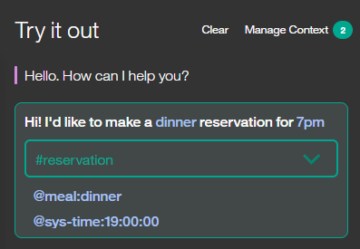

---

copyright:
  years: 2015, 2018
lastupdated: "2018-03-19"

---

{:shortdesc: .shortdesc}
{:new_window: target="_blank"}
{:tip: .tip}
{:pre: .pre}
{:codeblock: .codeblock}
{:screen: .screen}
{:javascript: .ph data-hd-programlang='javascript'}
{:java: .ph data-hd-programlang='java'}
{:python: .ph data-hd-programlang='python'}
{:swift: .ph data-hd-programlang='swift'}
{:table: .aria-labeledby="caption"}

# 创建对话
{: #dialog-build}

使用 {{site.data.keyword.conversationshort}} 工具来创建对话。
{: shortdesc}

## 对话节点限制
{: #dialog-node-limits}

可以创建的对话节点数取决于服务套餐。

| 服务套餐         | 每个工作空间的对话节点数   |
|------------------|---------------------------:|
| 标准/高级        |                    100,000 |
| Lite             |                     25,000 |
{: caption="服务套餐详细信息" caption-side="top"}

树深度限制：服务支持 2,000 个对话节点后代；节点数不超过 20 个时，工具的性能最好。

## 过程
{: #dialog-procedure}

要创建对话，请完成以下步骤：

1.  从导航栏打开**构建**页面，单击**对话**选项卡，然后单击**创建**。

    首次打开对话构建器时，将为您创建以下节点：
    - **欢迎**：第一个节点。此节点包含用户首次使用服务时向用户显示的问候语。可以编辑问候语。
    - **其他**：最后一个节点。此节点包含用于在无法识别用户输入时对用户进行回复的短语。可以替换所提供的响应，或者添加其他具有类似含义的响应，以向会话添加各种变体。还可以选择希望服务是依次返回定义的每个响应，还是按随机顺序返回响应。
1.  要向对话树添加更多节点，请单击**欢迎**节点上的**更多 ** 图标，然后选择**在下方添加节点**。
1.  输入条件，在满足该条件时会触发服务处理该节点。

    开始定义条件时，会显示一个框，框中显示选项。可以输入以下某个字符，然后从显示的选项列表中选择一个值。

    <table>
    <caption>条件构建器语法</caption>
    <tr>
      <th>字符</th>
      <th>列出以下工件类型的定义值</th>
    </tr>
    <tr>
      <td>`#`</td>
      <td>意向</td>
    </tr>
    <tr>
      <td>`@`</td>
      <td>实体</td>
    </tr>
    <tr>
      <td>`@{entity-name}:`</td>
      <td>{entity-name} 值</td>
    </tr>
    <tr>
      <td>`$`</td>
      <td>在对话其他位置定义或引用的上下文变量</td>
    </tr>
    </table>

    可以通过定义使用新意向、实体、实体值或上下文变量的新条件来创建意向、实体、实体值或上下文变量。如果通过此方式创建工件，请确保返回并完成要完全创建工件所需的其他任何步骤，例如定义意向的样本发声。

    要定义基于多个条件触发的节点，请输入一个条件，然后单击其旁边的加号 (+) 图标。如果要将 `OR` 运算符（而不是 `AND`）应用于多个条件，请单击字段之间显示的 `and` 以更改运算符类型。AND 运算会在 OR 运算之前执行，但可以使用括号来更改这一顺序。例如：`$isMember:true AND ($memberlevel:silver OR $memberlevel:gold)`

    定义的条件的长度必须小于 500 个字符。

有关如何测试条件中的值的更多信息，请参阅[条件](dialog-overview.html#conditions)。
1.  **可选**：如果要在此节点中从用户那里收集多条信息，请单击**定制**，然后启用**槽**。有关更多详细信息，请参阅[使用槽收集信息](dialog-slots.html)。
1.  输入响应。
    - 添加您希望服务作为响应向用户显示的文本。
    - 如果要基于特定条件定义其他响应，请单击**定制**，然后启用**多个响应**。
    - 有关条件响应或如何使响应多样化的信息，请参阅[响应](dialog-overview.html##responses)。

1.  指定处理当前节点后要执行的操作。可以从以下选项中进行选择：

    - **等待用户输入**：服务暂停，直到用户提供新的输入。
    - **跳过用户输入**：服务直接跳转至第一个子节点。此选项仅在当前节点至少有一个子节点时才可用。
    - **跳转至**：服务通过处理您指定的节点来继续对话。可以选择服务是应该对目标节点的条件求值，还是直接跳至目标节点的响应。有关更多详细信息，请参阅[配置“跳转至”操作](dialog-overview.html#jump-to-config)。

1.  **可选**：对节点命名。

    对话节点名可以包含字母（Unicode 格式）、数字、空格、下划线、连字符和句点。

    对节点命名会更容易记住其用途，并且在最小化时更方便找到节点。如果未提供名称，那么将使用节点条件作为名称。

1.  要添加更多节点，请选择树中的节点，然后单击**更多**  图标。
    - 要创建不符合现有节点的条件时，对其进行检查的下一个对等节点，请选择**在下方添加节点**。
    - 要创建检查现有节点的条件之前，先对其进行检查的对等节点，请选择**在上方添加节点**。
    - 要为所选节点创建子节点，请选择**添加子节点**。子节点会在其父节点后进行处理。
    - 要复制当前节点，请选择**复制**。

有关对话节点处理顺序的更多信息，请参阅[对话概述](dialog-overview.html#dialog-flow)。
1.  在构建对话时对其进行测试。有关更多信息，请参阅[测试对话](#test)。

## 测试对话
{: #test}

更改对话时，可以随时对其进行测试，以了解其如何对输入进行响应。

1.  在“对话”选项卡中，单击 图标。
1.  在交谈窗格中，输入一些文本，然后按 Enter 键。

    在开始测试对话之前，请确保系统已完成对最新更改的培训。如果系统仍在培训，*试用*窗格中将显示一条消息：
    {: tip}

    
1.  检查响应，以确定对话是否正确解释了您的输入并选择了正确的响应。

    交谈窗口会指示在输入中识别到的意向和实体：

    
1.  如果要了解对话树中的哪个节点触发了响应，请单击其旁边的**位置**  图标。如果您尚未处于“对话”选项卡中，请将其打开。

    源节点将获得焦点，并且服务在树中遍历至源节点的路径会突出显示。此路径会一直保持突出显示，直到您执行其他操作（例如，输入新的测试输入）。
1.  要检查或设置上下文变量的值，请单击**管理上下文**链接。

    这将显示在对话中已定义的所有上下文变量。

    此外，还会列出 `$timezone` 上下文变量。*试用*窗格用户界面会从 Web 浏览器获取用户语言环境信息，并使用此信息来设置 `$timezone` 上下文变量。通过此上下文变量，能更轻松地在测试对话交流中处理时间引用。请考虑在用户应用程序中执行类似操作。如果未指定，将使用格林威治标准时间 (GMT)。

    可以添加变量并设置其值，以查看对话如何在下一轮测试对话中进行响应。例如，如果将对话设置为根据用户提供的上下文变量值来显示不同响应，那么此功能非常有用。

    1.  要添加上下文变量，请指定变量名称，然后按 **Enter** 键。
    1.  要为上下文变量定义缺省值，请查找在列表中添加的上下文变量，然后为其指定值。

    有关更多信息，请参阅[上下文变量](dialog-runtime.html#context)。

1.  继续与对话交互以查看会话如何在其中进行。
    - 要找到并重新提交测试发声，可以按“向上”键来循环浏览最近的输入。
    - 要从交谈窗格中除去先前的测试发声，然后从头开始，请单击**清除**链接。此操作不仅会除去测试发声和响应，还会清除因与对话交互而设置的任何上下文变量的值。但不会清除显式设置或更改的上下文变量值。

### 后续操作

如果确定识别到错误的意向或实体，那么可能需要修改意向或实体定义。

如果识别到正确的意向和实体，但在对话中触发了错误的节点，请确保条件编写正确。

## 复制对话节点
{: #copy-node}

可以复制节点以将其精确副本创建为对话树中该节点正下方的对等节点。复制的节点本身会命名为与原始节点相同的名称，但是会附加 `- copy`*`n`*，其中 *`n`* 是从 1 开始的数字。如果多次复制同一个节点，那么每个副本的名称中的 *`n`* 会递增 1，以帮助区分不同的副本。如果节点没有名称，那么会将其命名为 `copy`*`n`*。

复制具有子节点的节点时，会一并复制子节点。复制的子节点具有与原始子节点完全相同的名称。区分复制的子节点与原始子节点的唯一方法是看父节点名中是否含有 `copy`。

1.  在要复制的节点上，单击**更多**  图标，然后选择**复制**。
1.  考虑对复制的节点重命名，或编辑这些节点的条件以使其不同。

## 移动对话节点
{: #move-node}

您创建的每个节点都可以移动到对话树中的其他位置。

您可能希望将先前创建的节点移至流的另一个区域以更改会话。可以移动节点，使其成为另一个分支中的同代或对等节点。

1.  在要移动的节点上，单击**更多**  图标，然后选择**移动**。
1.  要将此节点移动到哪个位置，即在树中的该位置附近选择一个目标节点。选择是将此节点放在目标节点之前还是之后，还是使其成为目标节点的子节点。

## 使用文件夹组织对话
{: #folders}

可以通过将多个对话节点添加到一个文件夹中，从而将这些节点分组在一起。对节点分组的原因有多种，包括：

- 将处理类似主题的节点放在一起，以方便查找。例如，可以将处理用户帐户相关问题的节点分组到*用户帐户*文件夹中，将处理付款相关查询的节点分组到*付款*文件夹中。
- 将您希望对话仅当满足特定条件时才处理的一组节点分组在一起。例如，对于提供额外服务，并且只有当前用户有权接收这些额外服务时才应对其进行处理的节点，请使用条件（例如 `$isPlatinumMember`）将这些节点分组在一起。
- 在处理节点期间向运行时隐藏这些节点。可以将这些节点添加到具有 `false` 条件的文件夹，以避免处理这些节点。
- 将用于离题到节点的相同配置设置一次性应用于多个根节点。有关更多信息，请参阅[离题](dialog-runtime.html#digressions)。

文件夹的这些特征会影响对文件夹中节点的处理方式：

- 条件：如果指定条件，服务会首先对文件夹条件求值，以确定是否处理其中的节点。
- 定制：文件夹中的节点会继承应用于该文件夹的任何配置设置。例如，如果更改文件夹的离题设置，那么该文件夹中的所有节点都会继承这些更改。
- 树层次结构：根据文件夹是添加到对话树中的根级别还是子级别，该文件夹中的节点会视为根节点或子节点。添加到根级别文件夹的任何根级别节点都会继续作为根节点运行；例如，这些节点不会成为文件夹的子节点。但是，如果将根级别节点移入属于另一个节点的子代的文件夹中，那么这些根节点会成为这另一个节点的子代。

文件夹对节点的求值顺序没有影响。节点会继续从第一个到最后一个进行处理。随着服务沿树向下推进，遇到文件夹时，如果文件夹条件为 true，那么服务会立即处理该文件夹中的第一个节点，然后从该节点继续沿树向下按顺序执行。如果文件夹没有文件夹条件，那么该文件夹对于服务是透明的。

### 添加文件夹
{: #folders-add}

要向对话树添加文件夹，请完成以下步骤：

1.  在**对话**选项卡的树形视图中，单击**添加文件夹**。

    这会将文件夹添加到对话树的末尾，刚好位于 **Anything else** 节点之前。除非选择了树中的现有节点，在这种情况下，文件夹会添加到所选节点下方。

    如果要在树中其他位置添加文件夹，请在要添加文件夹的位置上方的节点中，单击**更多**  图标，然后选择**添加文件夹**。

    可以在现有对话框分支内的子节点下方添加文件夹。为此，请单击子节点上的**更多**  图标，然后选择**添加文件夹**。

    该文件夹会在编辑视图中打开。

1.  **可选**：对文件夹命名。

1.  **可选**：为文件夹定义条件。

    如果未指定条件，将使用 `true`，这意味着始终会处理该文件夹中的节点。

1.  向该文件夹添加对话节点。

    - 要向该文件夹添加现有对话节点，您一次只能将一个节点移至该文件夹。

      在要移动的节点上，单击**更多**  图标，选择**移动**，然后单击该文件夹。选择**目标文件夹**作为移至目标。

      移动节点时，会将这些节点添加到文件夹内树的起始位置。因此，例如，如果要保留一组连续的根对话节点的顺序，请首先从最后一个节点开始移动。
      {: tip}

    - 要向文件夹添加新的对话节点，请单击文件夹上的**更多 ** 图标，然后选择**向文件夹添加节点**。

      这会将对话节点添加到文件夹内对话树的末尾。

### 删除文件夹
{: #folders-delete}

可以仅删除文件夹，也可以删除文件夹及其中的所有对话节点。

要删除文件夹，请完成以下步骤：

1.  在**对话**选项卡的树形视图中，找到要删除的文件夹。

1.  单击该文件夹上的**更多**  图标，然后选择**删除**。

1.  执行下列其中一个操作：

    - 要仅删除文件夹而保留文件夹中的对话节点，请取消选中**删除文件夹内的节点**复选框，然后单击**是，删除**。
    - 要删除文件夹及其中的所有对话节点，请单击**是，删除**。

如果仅删除了文件夹，那么该文件夹中的节点将显示在对话树中该文件夹原先所在的位置。

## 按节点标识查找对话节点
{: #get-node-id}

出于以下任何原因，您可能希望查找与已知节点标识关联的对话节点：

- 您在查看日志，并且日志通过对话节点标识引用了对话的某个部分。
- 您希望将 API 消息输出的 `nodes_visited` 属性中列出的节点标识，映射到可以在对话树中查看的节点。
- 对话运行时错误消息通知您有关语法错误的信息，并使用节点标识来标识需要修正的节点。

要根据节点标识来发现节点，请完成以下步骤：

1.  在工具的“对话”选项卡中，选择对话树中的任一节点。
1.  如果当前节点的编辑视图已打开，请将其关闭。
1.  在 Web 浏览器的“位置”字段中的 URL 显示的语法应该如下所示：

    `    https://watson-conversation.ng.bluemix.net/space/instance-id/workspaces/workspace-id/build/dialog#node=node-id
    `

1.  编辑该 URL 并将当前 `node-id` 值替换为要查找的节点的标识，然后提交新的 URL。
1.  如果需要，请再次突出显示已编辑的 URL，然后重新进行提交。

工具会刷新，并将焦点切换到具有您指定节点标识的对话节点。如果节点标识用于槽、槽处理程序或条件响应，那么定义该槽或条件响应的节点将获得焦点并显示相应的模态。

**注**：如果仍然找不到节点，可以导出工作空间，然后使用 JSON 编辑器来搜索工作空间 JSON 文件。
