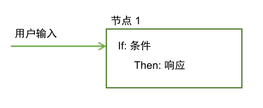
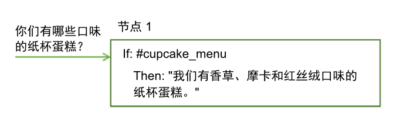
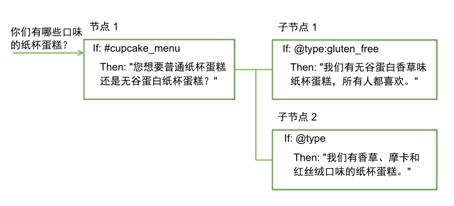
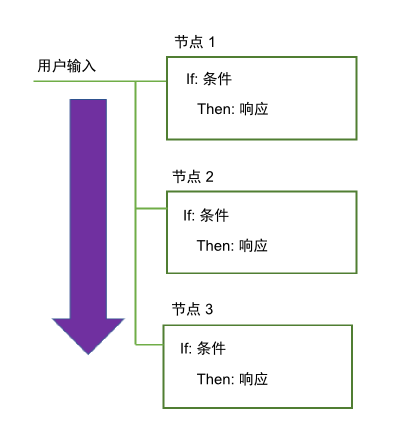
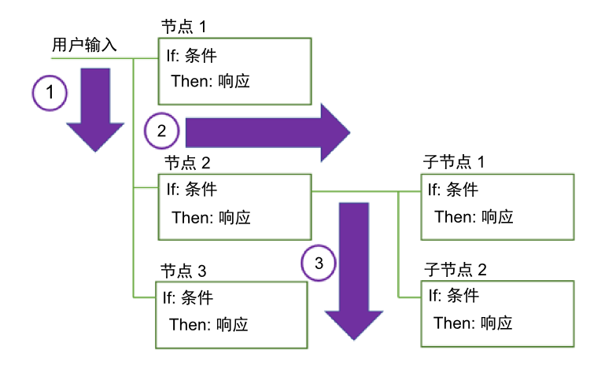
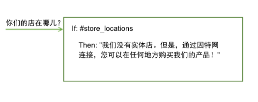
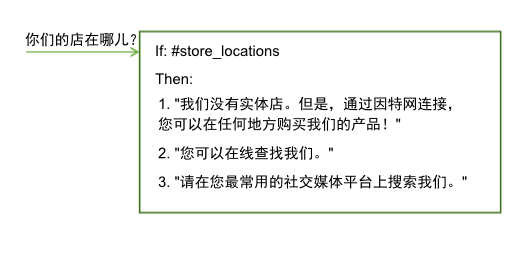
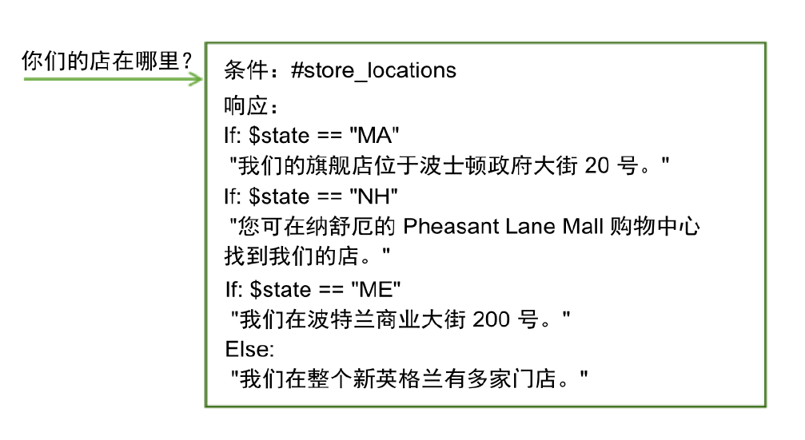

---

copyright:
  years: 2015, 2018
lastupdated: "2018-02-09"

---

{:shortdesc: .shortdesc}
{:new_window: target="_blank"}
{:tip: .tip}
{:pre: .pre}
{:codeblock: .codeblock}
{:screen: .screen}
{:javascript: .ph data-hd-programlang='javascript'}
{:java: .ph data-hd-programlang='java'}
{:python: .ph data-hd-programlang='python'}
{:swift: .ph data-hd-programlang='swift'}
{:table: .aria-labeledby="caption"}

# 对话概述
{: #dialog-overview}

对话使用在用户输入中识别到的意向和实体以及应用程序中的上下文与用户进行交互，并最终提供有用的响应。
{: shortdesc}

响应可能是对问题（例如，`在哪里能加点天然气？`）的回答，也可能是执行命令，例如打开收音机。意向和实体的信息可能足以确定正确的响应，但若不能，对话可能会要求用户提供正确响应所需的更多输入。例如，如果用户询问：`我在哪里能找到吃的？`您可能希望弄清楚他们是想去餐馆还是杂货店，是要去店里吃还是外卖等等。您可以在文本响应中要求提供更多详细信息，并创建一个或多个子节点来处理新的输入。

<iframe class="embed-responsive-item" id="youtubeplayer" type="text/html" width="640" height="390" src="https://www.youtube.com/embed/oQUpejt6d84?rel=0" frameborder="0" webkitallowfullscreen mozallowfullscreen allowfullscreen> </iframe>

对话在 {{site.data.keyword.conversationshort}} 工具中以图形方式表示为树。创建分支来处理您希望会话处理的每个意向。分支由多个节点组成。

## 对话节点

每个对话节点至少包含一个条件和一个响应。



- 条件：指定要触发对话中的此节点，用户输入中必须提供的信息。信息可以是特定意向、实体值或上下文变量值。有关更多信息，请参阅[条件](dialog-runtime.html#conditions)。
- 响应：服务用于响应用户的发声。响应还可以配置为触发程序化操作。有关更多信息，请参阅[响应](#responses)。

您可以将节点视为具有 if/then 构造：如果此条件为 true，那么返回此响应。

例如，如果服务的自然语言处理功能确定用户输入包含 `#cupcake-menu` 意向，那么将触发以下节点。触发节点的结果是，服务会使用相应的回答进行响应。



具有一个条件和响应的单个节点可以处理简单的用户请求。但是，用户往往会有更复杂的问题，或者希望获得更复杂任务的帮助。为此，可以添加子节点，这些子节点会要求用户提供服务所需的任何其他信息。



## 对话流

创建的对话由服务从树中的第一个节点到最后一个节点进行处理。



服务沿着树一路向下，如果发现符合的条件，就会触发相应节点。然后，服务会沿着触发的节点移动，以根据任何子节点条件检查用户输入。服务检查子节点时，同样是从第一个子节点移至最后一个子节点。

服务将继续在对话树中从第一个节点移至最后一个节点，然后沿每个触发的节点从第一个子节点移至最后一个子节点，再沿着每个触发的子节点移动，直至到达所在分支中的最后一个节点。



开始构建对话时，必须确定要包含的分支数以及这些分支的放置位置。分支的顺序非常重要，因为节点是按第一个到最后一个的顺序求值的。将使用其条件与输入相匹配的第一个根节点；树中后续的任何节点都不会触发。

服务到达分支末尾，或者在当前所求值的子节点集内找不到求值为 true 的条件时，会跳回至树的基本节点。随后，服务将再一次从第一个根节点到最后一个根节点进行处理。如果没有任何条件求值为 true，那么将返回树中最后一个节点的响应，该响应通常具有始终求值为 true 的特殊 `anything_else` 条件。

可以通过定制在处理某个节点后执行的操作，中断从第一个到最后一个的标准流。例如，可以将一个节点配置为在进行处理后直接跳转至另一个节点，即便这另一个节点位于树中的更早位置。有关更多详细信息，请参阅[定义后续操作](dialog-overview.html#jump-to)。

如何为每个节点配置离题设置还会影响用户在运行时如何在节点中移动。如果从大多数节点启用离题，那么用户可以更轻松地从一个节点跳转至另一个节点，然后再跳转回前者。有关更多信息，请参阅[离题](dialog-runtime.html#digressions)。

## 条件
{: #conditions}

节点条件确定会话中是否使用该节点。响应条件确定要向用户显示的响应。

- [条件工件](dialog-overview.html#condition-artifacts)
- [条件语法详细信息](dialog-overview.html#condition-syntax)
- [条件用法提示](dialog-overview.html#condition-tips)

### 条件工件
{: #condition-artifacts}

可以使用下列一个或多个工件的任何组合来定义条件：

- **上下文变量**：如果指定的上下文变量表达式为 true，那么将使用该节点。请使用语法 `$variable_name:value` 或 `$variable_name == 'value'`。例如，`$city:Boston` 会检查 `$city` 上下文变量是否包含值 `Boston`。如果包含，那么会处理该节点或响应。

  不要在已设置上下文变量值的同一对话节点中，基于该上下文变量值来定义节点或响应条件。
  {: tip}

  有关上下文变量的更多信息，请参阅[上下文变量](dialog-runtime.html#context)。

- **实体**：在用户输入中识别到实体的任何值或同义词时，将使用该节点。请使用语法 `@entity_name`。例如，`@city` 会检查在用户输入中是否检测到为 @city 实体定义的任何城市名称。如果检测到，那么会处理该节点或响应。

  确保创建对等节点来处理未识别到任何实体值或同义词的情况。
  {: tip}

  有关实体的更多信息，请参阅[定义实体](entities.html)。

- **实体值**：如果在用户输入中检测到实体值，那么将使用该节点。请使用语法 `@entity_name:value`，并为实体指定定义的值，而不要指定同义词。例如：`@city:Boston` 会检查在用户输入中是否检测到特定城市名称 `Boston`。

  如果实体是具有捕获组的模式实体，那么可以检查特定组值匹配情况。例如，可以使用语法：`@us_phone.groups[1] == '617'`
  有关更多信息，请参阅[在上下文变量中存储模式实体值](dialog-runtime.html#context-pattern-entities)。

  如果在对等节点中检查实体是否存在，而不为其指定特定值，请确保将此节点（用于检查特定实体值）置于仅检查该实体是否存在的对等节点之前。否则，将永远不会对此节点求值。
  {: tip}

- **意向**：最简单的条件是单个意向。如果用户的输入映射到该意向，那么将使用该节点。请使用语法 `#intent_name`。例如，`#weather` 检查用户输入中检测到的意向是否为 `weather`。如果是，那么会处理该节点。

  有关意向的更多信息，请参阅[定义意向](intents.html)。

- **特殊条件**：随服务一起提供可用于执行通用对话函数的条件。

| 条件语法| 描述|
|----------------------|-------------|
| `anything_else`      | 可以在对话末尾使用此条件，在用户输入与其他任何对话节点都不匹配时，将处理此条件。此条件将触发**其他**节点。|
| `conversation_start` | 与 **welcome** 一样的是，此条件在第一轮对话期间会求值为 true。但与 **welcome** 不同的是，无论应用程序的初始请求是否包含用户输入，其都为 true。具有 **conversation_start** 条件的节点可用于在对话开始时初始化上下文变量或执行其他任务。|
| `false`              | 此条件始终求值为 false。可以在正在开发的分支开始处使用此项，以阻止使用此分支，或者将其用作提供常见函数且仅用作**跳转至**操作目标的节点的条件。|
| `irrelevant`         | 如果 {{site.data.keyword.conversationshort}} 服务确定用户的输入为不相关，那么此条件将求值为 true。|
| `true`               | 此条件始终求值为 true。可以在节点或响应列表末尾使用此条件，以捕获与任何先前条件都不匹配的任何响应。|
| `welcome`            | 仅当应用程序的初始请求不包含任何用户输入时，才会在第一轮对话期间（当会话启动时），将此条件求值为 true。在所有随后的多轮对话中，都会将其求值为 false。此条件会触发**欢迎**节点。通常，使用此条件的节点用于对用户进行问候，例如显示诸如`欢迎使用我们的披萨订购应用程序`之类的消息。|
{: caption="特殊条件" caption-side="top"}

### 条件语法详细信息
{: #condition-syntax}

使用以下某个语法选项在条件中创建有效的表达式：

- 用于引用意向、实体和上下文变量的速记符号。请参阅[访问对象和对象求值](expression-language.html)。

- Spring Expression (SpEL) 语言，这是一种表达式语言，用于支持在运行时查询和操作对象图形。有关更多信息，请参阅 [Spring Expression Language (SpEL) 语言 ](http://docs.spring.io/spring/docs/current/spring-framework-reference/html/expressions.html){: new_window}。

可以使用正则表达式来检查是否有以其为条件的值。例如，要查找匹配的字符串，可以使用 `String.find` 方法。有关更多详细信息，请参阅[方法](dialog-methods.html)。

### 条件用法提示
{: #condition-tips}

- **检查具有特殊字符的值**：如果要检查实体或上下文变量是否包含某个值，并且该值包含特殊字符（如撇号 (')），那么必须使用圆括号将要检查的值括起。例如，要检查实体或上下文变量是否包含名称 `O'Reilly`，必须使用圆括号将该名称括起。

  `@person:(O'Reilly)` 和 `$person:(O'Reilly)`

  服务会将这些简写引用转换为以下完整的 SpEL 表达式：

  `entities['person']?.contains('O''Reilly')` 和 `context['person'] == 'O''Reilly'`

  **注**：SpEL 会使用另一个撇号来对名称中的单个撇号转义。

- **检查数字值**：使用数字变量时，确保变量具有值。如果变量没有值，那么在数字比较中，会将其视为空值 (0)。

  例如，如果通过条件 `@price < 100` 来检查变量的值，但 @price 实体为空，那么条件会求值为 `true`，因为 0 小于 100，虽然从未设置过价格。要避免检查空变量，请使用诸如 `@price AND @price < 100`。如果 `@price` 没有值，那么此条件会正确返回 false。

- **检查具有特定意图名称模式的意向**：可以使用用于查找与模式相匹配的意向的条件。例如，要查找意向名称以“User_”开头的任何检测到的意向，可以在条件中使用类似以下内容的语法：

  `intents[0].intent.startsWith("User_")`

  但是，如果使用此语法，那么会考虑所有检测到的意向，甚至是置信度低于 0.2 的意向。此外，还会检查是否未返回 Watson 根据其置信度分数视为不相关的意向。为此，请按如下所示更改该条件：

  `!irrelevant && intents[0].intent.startsWith("User_")`

- **模糊匹配如何影响实体识别**：如果将实体用作条件并启用了模糊匹配，那么仅当匹配项的置信度大于 30% 时，`@entity_name` 才会求值为 true。即，仅当 `@entity_name.confidence > .3` 时才会求值为 true。

- **处理输入中的多个实体**：如果要仅对实体类型的检测到的第一个实例值求值，那么可以使用语法 `@entity == 'specific-value'`，而不使用 `@entity:(specific-value)` 格式。

  例如，使用 `@appliance == 'air conditioner'` 时，将仅对检测到的第一个 `@appliance` 实体的值求值。但是，使用 `@appliance:air conditioner` 会扩展到 `entity['appliance'].contains('air conditioner')`，只要在用户输入中检测到至少一个值为“空调”的 `@appliance` 实体，即为匹配。

## 响应
{: #responses}

对话响应定义如何回复用户。

可以使用以下某种响应类型进行回复：

- [简单文本响应](#simple-text)
- [条件响应](#multiple)
- [复杂响应](#complex)
- [多媒体响应](#multimedia)

### 简单文本响应
{: #simple-text}

如果要提供文本响应，只需输入您希望服务向用户显示的文本即可。



如果响应中包含电子邮件地址，那么必须使用反斜杠 (`\`) 对 `@` 符号进行转义。例如，`请通过 feedback\@example.com 向我们发送反馈。`同样，如果响应中包含编号符号 (`#`)，也必须对其进行转义。例如，`我们是缅因州排名第一 (\#1) 的龙虾卷销售商。`实体名称以 `@` 开头，意向名称以 `#` 开头。对这些符号进行转义可避免服务误读响应文本。

{: tip}

#### 添加变体
{: #variety}

如果用户频繁返回到 Conversation 服务，那么若是他们每次都听到相同的问候和响应，可能会感到厌烦。为此，可以向响应添加*变体*，以便会话能够以不同方式对同一条件进行响应。

<iframe class="embed-responsive-item" id="youtubeplayer" type="text/html" width="640" height="390" src="https://www.youtube.com/embed/nAlIW3YPrAs?rel=0" frameborder="0" webkitallowfullscreen mozallowfullscreen allowfullscreen> </iframe>

在此示例中，服务在响应有关门店位置的问题时，针对不同的交互提供不同的回答：



可以选择按顺序或按随机顺序循环提供响应变体。缺省情况下，响应按顺序循环，如同从排序的列表中进行选择一样。

### 条件响应
{: #multiple}

单个对话节点可以提供不同的响应，每个响应由不同的条件触发。使用此方法可在单个节点中应对多个场景。

<iframe class="embed-responsive-item" id="youtubeplayer" type="text/html" width="640" height="390" src="https://www.youtube.com/embed/KcvVQAsnhLM?rel=0" frameborder="0" webkitallowfullscreen mozallowfullscreen allowfullscreen> </iframe>

节点仍然具有一个主要条件，也就是可以使用该节点并处理其所包含的条件和响应的条件。

在此示例中，服务使用其先前收集的有关用户位置的信息来定制其响应，并提供有关离该用户最近的门店的信息。有关如何存储从用户那里所收集的信息的更多信息，请参阅[上下文变量](dialog-runtime.html#context)。



现在，此单个节点提供的功能相当于四个单独的节点。

要向节点添加条件响应，请单击**定制**，然后单击**多个响应**切换开关以将其**开启**。

节点中的条件按顺序进行求值，如同节点一样。请确保条件和响应按正确的顺序列出。如果需要更改顺序，请选择一个条件，然后使用显示的箭头在列表中上移或下移该条件。如果要更新上下文，必须在 JSON 编辑器中对每个响应执行此操作。没有适合所有响应的通用 JSON 编辑器。如果将**跳转至**操作关联到节点，那么只有在处理任何响应之后才会发生跳转。
{: tip}

### 复杂响应
{: #complex}

要指定更复杂的响应，可以使用 JSON 编辑器在 `"output":{}` 属性中指定响应。

要在响应中包含上下文变量值，请使用语法 `$variable-name` 来指定上下文变量值。有关更多信息，请参阅[上下文变量](dialog-runtime.html#context)。

```json
{
  "output": {
    "text": "Hello $user"
  }
}
```
{: codeblock}

要指定多个语句并分别显示在单独的行上，请将输出定义为 JSON 数组。

```json
{
  "output": {
    "text": ["Hello there.", "How are you?"]
  }
}
```
{: codeblock}

第一句会显示在一行上，第二句会另起一行显示在第一句后面。

要实现更复杂的行为，可以将输出文本定义为复杂 JSON 对象。例如，可以在 JSON 输出中使用复杂对象来模拟将响应变体添加到节点的行为。可以在复杂对象中包含以下属性：

- **values**：包含此对话节点可返回的多个输出文本版本的字符串 JSON 数组。数组中值的返回顺序取决于属性 `selection_policy`。

- **selection_policy**：以下值有效：

    - **random**：系统将从 `values` 数组中随机选择输出文本，并且不会连续重复这些文本。例如，假设 output.text 包含三个值。在前三次均会选择一个随机值，但不会重复选择值。在提供过所有输出值之后，系统会随机选择其他值并重复该过程。

        ```json
        {
            "output":{
                "text":{
                    "values":["Hello.","Hi.","Howdy!"],
                    "selection_policy":"random"
                }
            }
        }
        ```
        {: codeblock}

    系统会从随机选取的这三个选项中返回一个问候语。下一次触发响应时，将显示列表中的另一个问候语。该问候语同样是随机选择的，但会有意不重复先前使用过的问候语。

    - **sequential**：系统在第一次触发对话节点时返回第一个输出文本，第二次触发节点时返回第二个输出文本，依此类推。

        ```json
        {
            "output":{
                "text":{
                    "values":["Hello.", "Hi.", "Howdy!"],
                    "selection_policy":"sequential"
                }
            }
        }
        ```
        {: codeblock}

- **append**：指定是将值附加到数组还是使用新值覆盖数组中的值。设置为 false 时，先前执行的对话节点中收集的输出将被此特定节点中指定的文本值覆盖。

    ```json
    {
        "output":{
            "text":{
                "values": ["Hello."],
                "append":false
            }
        }
    }
    ```
    {: codeblock}

    在本例中，其他所有输出文本都会被此输出文本覆盖。

缺省行为假定 `selection_policy = random` 和 `append = true`。如果值数组包含多个项，那么会从其元素中随机选择输出文本。

### 多媒体响应
{: #multimedia}

如果计划使用 {{site.data.keyword.conversationshort}} 连接器将对话与 Slack 或 Facebook Messenger 相集成，那么可以指定包含多媒体或交互式元素（例如，可单击按钮）的对话节点响应。

有关更多信息，请参阅[多媒体响应](dialog-multimedia.html)。

## 定义后续操作
{: #jump-to}

在做出指定的响应后，可以指示服务执行以下某项操作：

- **等待用户输入**：服务等待用户提供响应引导的新输入。例如，响应可能会询问用户“是”或“否”问题。在用户提供更多输入之前，此对话不会继续。
- **跳过用户输入**：希望不等待用户输入而改为直接转至当前节点的第一个子节点时，请使用此选项。

  **注**：当前节点必须具有至少一个子节点，此选项才可用。

- **跳转至其他对话节点**：希望不等待用户输入而希望会话直接转至完全不同的对话节点时，请使用此选项。例如，可以使用*跳转至*操作将流从树中的多个位置路由到一个常见对话节点。

  **注**：必须存在要跳转至的目标节点，然后才能配置“跳转至”操作来使用该节点。

### 配置“跳转至”操作
{: #jump-to-config}

如果选择跳转至其他节点，那么必须指定操作的目标是所选对话节点的**响应**还是**条件**。

- **响应**：如果语句的目标是所选对话节点的响应部分，那么会立即运行。即，系统不会对所选对话节点的条件求值，而是立即处理所选对话节点的响应。

  将响应设置为目标对于将多个对话节点链接在一起很有用。响应的处理就像此对话节点的条件为 true 时一样。如果所选对话节点有其他**跳转至**操作，那么该操作也会立即运行。

- **条件**：如果语句的目标是所选对话节点的条件部分，那么服务会首先检查目标节点的条件是否求值为 true。
    - 如果条件求值为 true，那么系统会立即处理目标节点。
    - 如果条件未求值为 true，那么系统将移至目标节点的下一个同代节点以对其条件求值，并重复此过程，直至找到具有求值为 true 的条件的对话节点为止。
    - 如果系统处理了所有同代，仍然没有任何条件求值为 true，那么将使用基本回退策略，并且对话会对对话树基本级别的节点求值。

    将条件设置为目标对于链接对话节点的条件很有用。例如，您可能希望首先检查输入是否包含意向，例如 `#turn_on`；如果输入包含意向，那么您可能希望检查输入是否包含实体，例如 `@lights`、`@radio` 或 `@wips`。链接条件有助于构造更大的对话树。

## 更多信息

有关对话使用的表达式语言及方法和系统实体的信息以及其他有用的详细信息，请参阅“导航”窗格中的**参考**部分。
