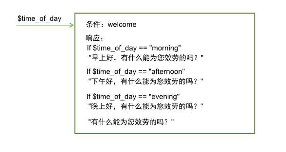
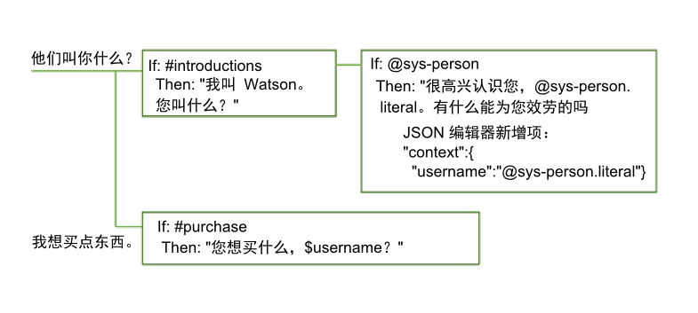
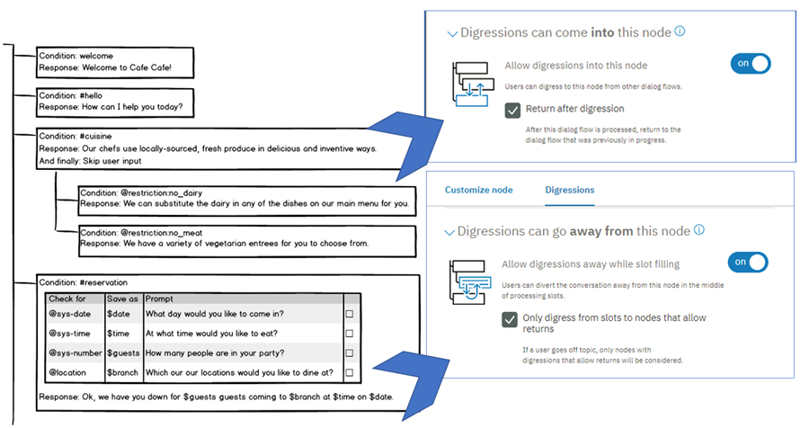

---

copyright:
  years: 2015, 2018
lastupdated: "2018-02-16"

---

{:shortdesc: .shortdesc}
{:new_window: target="_blank"}
{:tip: .tip}
{:pre: .pre}
{:codeblock: .codeblock}
{:screen: .screen}
{:javascript: .ph data-hd-programlang='javascript'}
{:java: .ph data-hd-programlang='java'}
{:python: .ph data-hd-programlang='python'}
{:swift: .ph data-hd-programlang='swift'}

# 如何处理对话
{: #dialog-runtime}

了解当有人在运行时与您的已部署 {{site.data.keyword.conversationshort}} 服务的实例进行交互时，如何处理您的对话。
{: shortdesc}

## 对话调用剖析
{: message-anatomy}

每个用户发声都会作为一个 /message API 调用传递给对话。这包括用户在回复要求自己提供更多信息的对话提示时所做的发声。一些预订套餐包含固定数量的 API 调用，因此了解构成调用的内容会很有用。单个 /message API 调用相当于一轮对话，由来自用户的输入和来自对话的相应响应组成。

/message API 调用请求和响应的主体包含以下对象：

- `context`：包含打算持久存储的变量。要将一个调用中的信息传递到下一个调用，应用程序开发者必须在每个后续 API 调用中传入先前 API 调用的响应上下文。例如，对话可以收集用户的名称，然后在随后的节点中通过名称引用该用户。

  ```json
  {
    "context" : {
            "user_name" : "<? @sys-person.literal ?>"
    }
  ```
  {: codeblock}

  有关更多信息，请参阅[跨多轮会话保留信息](dialog-runtime.html#context)。

- `input`：用户提交的文本字符串。文本字符串最多可以包含 2,048 个字符。

  ```json
  {
    "input": {
      "text" : "Where's your nearest store?"
    }
  ```
  {: codeblock}

- `output`：向用户显示的对话响应。您可以使用此部分来定义不打算持久存储的对象，如变量。例如，如果要永久删除在对话中其他位置定义的名为 `temp` 的上下文变量，那么可以使用以下表达式来执行此操作。

  ```json
  {
  "output": {
    "text" : {},
    "deleted_variable" : "<? context.remove('temp') ?>"
  ```
  {: codeblock}

  有关输出对象的更多信息，请参阅[复杂响应](dialog-overview.html#complex)。

您可以从 [API 参考 ](https://www.ibm.com/watson/developercloud/conversation/api/v1/){: new_window} 中了解有关 /message API 调用的更多信息。

## 跨多轮对话保留信息
{: #context}

对话是无状态的，这意味着从与用户的一个交互到下一个交互，对话不会保留相关信息。应用程序开发者负责维护应用程序所需的任何持续信息。应用程序必须查找 context 对象并将其存储在消息 API 响应中，然后在作为对话流一部分发起的下一个 /message API 请求的 context 对象中进行传递。

保留信息的最简单方法是将整个 context 对象存储在客户机应用程序（例如，Web 浏览器）的内存中。随着应用程序变得更加复杂，或者如果需要传递和存储个人可标识信息，您可以在数据库中存储和检索信息。

应用程序可以将信息传递到对话，对话可以更新此信息，然后将其传递回应用程序，或者传递到后续节点。对话使用上下文变量来执行此操作。

上下文变量是在节点中定义的变量，可选择为其指定缺省值。其他节点或应用程序逻辑可以随后设置或更改上下文变量的值。

可以通过引用对话节点条件中的上下文变量来根据上下文变量值检查条件，以确定是否执行节点。还可以引用对话节点响应条件中的上下文变量，以根据外部服务或用户提供的值来显示不同响应。

### 从应用程序传递上下文
{: #context-from-app}

通过设置上下文变量并将上下文变量传递到对话，可将信息从应用程序传递到对话。

例如，应用程序可以设置 $time_of_day 上下文变量，并将其传递到对话，该对话可以使用此信息来定制其向用户显示的问候语。



在此示例中，对话知道应用程序将此变量设置为以下某个值：*morning*、*afternoon* 或 *evening*。它可以检查每个值，并根据提供的值，返回相应的问候语。如果该变量未传递或具有与某个期望值不匹配的值，那么会向用户显示更通用的问候语。

### 在节点之间传递上下文
{: #context-node-to-node}

对话还可以添加上下文变量，以将信息从一个节点传递到另一个节点，或更新上下文变量的值。对话要求用户提供信息，从用户那里获得信息后，即可以跟踪信息，并且稍后在会话中引用这些信息。

例如，在一个节点中，您可能要求用户提供名字，然后在后面的节点中用名字来称呼他们。



在此示例中，系统实体 @sys-person 用于从输入中抽取用户的名字（如果用户提供了名字）。在 JSON 编辑器中，username 上下文变量已定义并设置为 @sys-person 值。在随后的节点中，$username 上下文变量包含在响应中，这样就可以用名字来称呼用户。

## 定义上下文变量
{: #context-var-define}

通过在以下其中一个编辑器中定义上下文变量的名称和值对来定义该变量：

- **上下文编辑器**：在节点编辑视图中显示**变量**字段和相应的**值**字段，可以使用上下文变量名称和值信息来填充这两个字段。

  **注**：这两个字段会自动显示在添加的节点中。对于使用较早版本的服务创建的节点，必须打开上下文编辑器来添加这两个字段。

- **JSON 编辑器**：打开时，可查看随发送到 {{site.data.keyword.conversationshort}} 服务的 /message API 请求一起传递的底层 JSON 内容。您可以通过将名称和值对添加到 JSON 主体的 `"context":{}` 部分来定义上下文变量。

名称和值对必须满足以下要求：

- `name` 可以包含任何大写和小写字母字符、数字字符 (0-9) 和下划线。

  **注**：可以在名称中包含其他字符，例如句点和连字符。但是，如果这样做，那么每次后续引用该变量时，都必须使用以下其中一种方法：

  - **context['variable-name']**

      完整 SpEL 表达式语法。
  - **$(variable-name)**

      用圆括号括起变量名的简写语法。
    有关更多详细信息，请参阅[访问对象和对象求值](expression-language.html#shorthand-syntax-for-context-variables)。

- `value` 可以是任何受支持的 JSON 类型，如简单字符串变量、数字或 JSON 数组。使用 JSON 编辑器定义上下文变量时，还可以指定 JSON 对象作为值。

下表显示了如何在上下文变量编辑器字段中定义名称和值对：

| 变量           | 值                 |
|:---------------|--------------------|
| dessert        | cake               |
| toppings_array | ["onion","olives"] |
| age            | 18                 |

以下 JSON 样本定义 $dessert 字符串、$toppings_array 数组和 $age number 上下文变量的值：

```json
{
  "context": {
   "dessert": "cake",
    "toppings_array": ["onion", "olives"],
    "age": 18
  }
}
```
{: codeblock}

要定义上下文变量，请完成以下步骤：

1.  在表示对话节点求值期间要设置上下文变量的时间的节点部分中，定义该上下文变量。

    **注**：为此节点定义的任何现有上下文变量值都会显示在一组相应的**变量**和**值**字段中。如果不希望这些字段显示在节点的编辑视图中，您必须关闭上下文编辑器。您可以通过用于打开编辑器的相同菜单来关闭编辑器；以下步骤描述如何访问该菜单。

    - 要添加在处理节点响应后设置或更改的上下文变量，请将该上下文变量添加到响应部分中。

      单击与响应关联的**选项**  图标，然后通过选择以下其中一个选项来选择编辑器：

      - **打开 JSON 编辑器**
      - **打开上下文编辑器**

      

      如果节点的**多个响应**设置为**打开**，那么必须先单击**编辑响应**  图标。

      

    - 要添加在满足槽条件后设置或更新的上下文变量，请单击**编辑槽**  图标。从*配置槽*视图标题的**选项**  菜单中，单击**打开 JSON 编辑器**。（有关槽的更多信息，请参阅[使用槽收集信息](dialog-slots.html)。）

      **注**：目前没有办法使用上下文编辑器来定义在此对话节点求值阶段内设置的上下文变量。

      

    - 要添加在满足槽响应条件后处理的上下文变量，请单击**编辑槽**  图标。单击**选项**  图标，然后选择**启用条件响应**。单击要将上下文变量与其关联的响应旁边的**编辑响应**  图标。单击响应部分中的**选项**  图标，然后通过选择以下其中一个选项来选择编辑器：

      - **打开 JSON 编辑器**
      - **打开上下文编辑器**

      
1.  要在上下文编辑器中定义上下文变量，请将变量名称和值对添加到**变量**和**值**字段。
1.  要在 JSON 编辑器中定义上下文变量，请完成以下附加步骤：

    - 添加 `"context":{}` 块（如果不存在）。

      ```json
      {
        "context":{},
      "output":{}
    }
    ```
      {: codeblock}

    - 在 context 块中，为要定义的每个上下文变量添加名称/值对。

      ```json
      {
            "context":{
      "name": "value"
    },
        "output": {}
      }
      ```
      {: codeblock}

    在此示例中，将名为 `new_variable` 的变量添加到已经包含变量的 context 块中。

    ```json
    {
          "context":{
      "existing_variable": "value",
        "new_variable":"value"
      }
    }
    ```
    {: codeblock}

    要随后引用上下文变量，请使用语法 `$name`，其中 *name* 是定义的上下文变量的名称。例如，`$new_variable`。

## 常见上下文变量任务
{: #context-common-tasks}

要存储由用户作为输入提供的整个字符串，请使用 `input.text`：

| 变量     | 值               |
|----------|------------------|
| repeat   | `<?input.text?>` |

```json
{
  "context": {
   "repeat": "<?input.text?>"
  }
}
```
{: codeblock}

要在上下文变量中存储实体的值，请使用以下语法：

| 变量     | 值               |
|----------|------------------|
| place    | @place           |

```json
{
  "context": {
   "place": "@place"
  }
}
```
{: codeblock}

可以使用任一编辑器将 JSON 对象添加到上下文变量。以下表达式定义了 full_name 对象，该对象包含一组 first 和 last 值，两个值共同构成一个人的全名。

| 变量          | 值               |
|---------------|------------------|
| full_name     | { "first":"Paul", "last":"Smith" } |

```json
{
  "context": {
   "full_name": {
      "first":"Paul",
      "last":"Smith"
      }
  }
}
```
{: codeblock}

如果在响应中指定 `$full_name.first`，那么将显示 `Paul`。

要存储从用户输入中抽取的字符串值，可以包含 SpEL 表达式，以使用 extract 方法将正则表达式应用于用户输入。以下表达式从用户输入中抽取数字，并将其保存到 `$number` 上下文变量。

| 变量     | 值                                  |
|----------|-------------------------------------|
| 数字   | `<?input.text.extract('[\d]+',0)?>` |

```json
{
  "context": {
   "number": "<?input.text.extract('[\\d]+',0)?>"
  }
}
```
{: codeblock}

在 JSON 编辑器中定义正则表达式时，对于表达式中使用的任何反斜杠，必须使用另一个反斜杠进行转义 (`\\`)。在使用上下文变量编辑器定义的正则表达式中，无需对反斜杠转义。
{: tip}

要存储模式实体的值，请将 .literal 附加到实体名称。使用此语法可确保将用户输入中与指定模式匹配的精确范围的文本存储在变量中。

| 变量     | 值               |
|----------|------------------|
| email    | @email.literal   |

```json
{
  "context": {
   "email": "<? @email.literal ?>"
  }
}
```
{: codeblock}

## 删除上下文变量
{: #context-delete}

要删除上下文变量，请将该变量设置为 null。

```json
{
  "context": {
   "order_form": null
  }
}
```
{: codeblock}

如果要删除上下文变量的所有跟踪，可以使用 JSONObject.remove(string) 方法将其从 context 对象中删除。但是，您必须使用变量来执行除去操作。在消息输出中定义新变量，以使其不会保存在当前调用之外。

```json
{
  "output": {
    "text" : {},
    "deleted_variable" : "<? context.remove('order_form') ?>"
  }
}
```
{: codeblock}

或者，可以删除应用程序逻辑中的上下文变量。

### 操作顺序
{: #context-order-of-ops}

定义上下文变量的顺序不会确定服务对其进行求值的顺序。服务会按随机顺序对定义为 JSON 名称/值对的变量进行求值。不要在第一个上下文变量中设置值，并且期望能够在第二个上下文变量中使用该值，因为无法保证列表中的第一个上下文变量将在列表中的第二个上下文变量之前执行。例如，如果要实现的逻辑是：返回传递到该节点的零与某个更高值之间的随机数，请不要使用两个上下文变量。

```json
"context": {
   "upper": "<? @sys-number.numeric_value + 1?>",
    "answer": "<? new Random().nextInt($upper) ?>"
}
```
{: codeblock}

使用略复杂一些的表达式，可避免在对 $answer 上下文变量求值之前，必须依赖于对 $upper 上下文变量求值。

```json
"context": {
   "answer": "<? new Random().nextInt(@sys-number.numeric_value + 1) ?>"
}
```
{: codeblock}

### 存储模式实体值
{: #context-pattern-entities}

要在上下文变量中存储模式实体的值，请将 .literal 附加到实体名称。使用此语法可确保将用户输入中与指定模式匹配的精确范围的文本存储在变量中。

```json
{
  "context": {
   "email": "<? @email.literal ?>"
  }
}
```
{: codeblock}

要在定义了组的模式实体中存储来自单个组的文本，请指定要存储的组的数组编号。例如，假定为 @phone_number 实体定义的实体模式如下所示。（请记住，圆括号表示模式组）：

`\b((958)|(555))-(\d{3})-(\d{4})\b`

要仅存储用户输入中指定的电话号码中的区号，可以使用以下语法：

```json
{
  "context": {
   "area_code": "<? @phone_number.groups[1] ?>"
  }
}
```
{: codeblock}

这些组由用于定义组模式的正则表达式定界。例如，如果与实体 `@phone_number` 中定义的模式匹配的用户输入是 `958-234-3456`，那么会创建以下组：

| 组号         | 正则表达式引擎值    | 对话值         | 说明        |
|--------------|---------------------|----------------|-------------|
| groups[0]    | `958-234-3456`      | `958-234-3456` | 第一个组始终是完整的匹配字符串。|
| groups[1]    | `((958)`l`(555))`   | `958`          | 与第一个已定义组的正则表达式相匹配的字符串，即 `((958)`l`(555))`。|
| groups[2]    | `(958)`             | `958`          | 与包含在 OR 表达式 `((958)`l`(555))` 中作为第一个操作数的组相匹配 |
| groups[3]    | `(555)`             | `null`         | 与包含在 OR 表达式 `((958)`l`(555))` 中作为第二个操作数的组不匹配 |
| groups[4]    | `(\d{3})`           | `234`          | 与为组定义的正则表达式相匹配的字符串。|
| groups[5]    | `(\d{4})`           | `3456`         | 与为组定义的正则表达式相匹配的字符串。|
{: caption="组详细信息" caption-side="top"}

为了帮助解码用于捕获您感兴趣的输入部分的组号，您可以一次抽取有关所有组的信息。使用以下语法创建上下文变量，该上下文变量返回所有分组模式实体匹配项的数组：

```json
{
  "context": {
   "array_of_matched_groups": "<? @phone_number.groups ?>"
  }
}
```
{: codeblock}

使用“试用”窗格来输入某些测试电话号码值。对于输入 `958-123-2345`，此表达式会将 `$array_of_matched_groups` 设置为 `["958-123-2345","958","958",null,"123","2345"]`。

然后，可以对数组中的每个值从 0 开始进行计数，以获取其组号。

| 数组元素值          | 数组元素编号         |
|---------------------|----------------------|
| "958-123-2345"      | 0 |
| "958"               | 1 |
| "958"               | 2 |
| null                | 3 |
| "123"               | 4 |
| "2345"              | 5 |
{: caption="数组元素" caption-side="top"}

例如，可以轻松确定，要捕获电话号码的最后四位数字，您需要组 #5。

要返回创建用于表示分组模式实体的 JSONArray 结构，请使用以下语法：

```json
{
  "context": {
   "json_matched_groups": "<? @phone_number.groups_json ?>"
  }
}
```
{: codeblock}

此表达式将 `$json_matched_groups` 设置为以下 JSON 数组：

```json
[
  {"group": "group_0","location": [0, 12]},
  {"group": "group_1","location": [0, 3]},
  {"group": "group_2","location": [0, 3]},
  {"group": "group_3"},
  {"group": "group_4","location": [4, 7]},
  {"group": "group_5","location": [8, 12]}
]
```
{: codeblock}

**注**：`location` 是实体的属性，使用从零开始的字符偏移量来指示检测到的实体值在输入文本中的开始和结束位置。

如果您期望在输入中提供两个电话号码，那么可以检查两个电话号码。例如，如果提供了两个电话号码，请使用以下语法来捕获第二个号码的区号。

```json
{
  "context": {
   "second_areacode": "<? entities['phone_number'][1].groups[1] ?>"
  }
}
```
{: codeblock}

如果输入是 `I want to change my phone number from 958-234-3456 to 555-456-5678`，那么 `$second_areacode` 等于 `555`。

## 更新上下文变量值
{: #context-update}

如果节点为已经设置的上下文变量设置值，那么新设置的值将覆盖先前的值。

### 更新复杂 JSON 对象

这将覆盖除 JSON 对象以外的所有 JSON 类型的先前值。如果上下文变量是复杂类型（如 JSON 对象），那么会使用 JSON 合并过程来更新变量。合并操作将添加任何新定义的属性，并覆盖对象的任何现有属性。

在此示例中，名称上下文变量定义为复杂对象。

```json
{
  "context": {
   "complex_object": {
      "user_firstname" : "Paul",
      "user_lastname" : "Pan",
      "has_card" : false
    }
  }
}
```
{: codeblock}

对话节点使用以下值来更新该上下文变量 JSON 对象：

```json
{
  "complex_object": {
    "user_firstname": "Peter",
    "has_card": true
  }
}
```
{: codeblock}

结果为以下上下文：

```json
{
  "complex_object": {
    "user_firstname": "Peter",
    "user_lastname": "Pan",
    "has_card": true
  }
}
```
{: codeblock}

有关可以在对象上执行的方法的更多信息，请参阅[表达式语言方法](dialog-methods.html#objects)。

### 更新数组

如果对话上下文数据包含值的数组，那么可以通过附加值、除去值或替换所有值来更新该数组。

选择以下某个选项以更新数组。在每种情况下，都会看到应用了操作之前的数组、操作和应用了操作之后的数组。

- **附加**：要将值添加到数组末尾，请使用 `append` 方法。

    对于以下对话运行时上下文：

    ```json
    {
      "context": {
   "toppings_array": ["onion", "olives"]
      }
    }
    ```
    {: codeblock}

    进行以下更新：

    ```json
    {
      "context": {
   "toppings_array": "<? $toppings_array.append('ketchup', 'tomatoes') ?>"
      }
    }
    ```
    {: codeblock}

    结果：

    ```json
    {
      "context": {
   "toppings_array": ["onion", "olives", "ketchup", "tomatoes"]
      }
    }
    ```
    {: codeblock}

- **除去**：要除去元素，请使用 `remove` 方法并在数组中指定其值或位置。

    - **按值除去**：按元素的值从数组中除去元素。

        对于以下对话运行时上下文：

        ```json
        {
          "context": {
   "toppings_array": ["onion", "olives"]
          }
        }
        ```
        {: codeblock}

        进行以下更新：

        ```json
        {
          "context": {
   "toppings_array": "<? $toppings_array.removeValue('onion') ?>"
          }
        }
        ```
        {: codeblock}

        结果：

        ```json
        {
          "context": {
   "toppings_array": ["olives"]
          }
        }
        ```
        {: codeblock}

    - **按位置除去**：按元素的索引位置从数组中除去元素：

        对于以下对话运行时上下文：

        ```json
        {
          "context": {
   "toppings_array": ["onion", "olives"]
          }
        }
        ```
        {: codeblock}

        进行以下更新：

        ```json
        {
          "context": {
   "toppings_array": "<? $toppings_array.remove(0) ?>"
          }
        }
        ```
        {: codeblock}

        结果：

        ```json
        {
          "context": {
   "toppings_array": ["olives"]
          }
        }
        ```
        {: codeblock}

- **覆盖**：要覆盖数组中的值，只需将数组设置为新值即可：

    对于以下对话运行时上下文：

        ```json
        {
          "context": {
   "toppings_array": ["onion", "olives"]
          }
        }
        ```
        {: codeblock}

    进行以下更新：

        ```json
        {
          "context": {
   "toppings_array": ["ketchup", "tomatoes"]
          }
        }
        ```
        {: codeblock}

    结果：

        ```json
        {
          "context": {
   "toppings_array": ["ketchup", "tomatoes"]
          }
        }
        ```
        {: codeblock}

有关可以在数组上执行的方法的更多信息，请参阅[表达式语言方法](dialog-methods.html#arrays)。

## 离题
{: #digressions}

用户处于旨在处理一个目标的对话流中，然后突然切换主题以启动旨在处理其他目标的对话流时，即会发生离题。对话始终支持用户更改主题。如果正在处理的对话分支中没有任何节点与用户的最新输入的目标相匹配，那么对话将返回到树中来检查根节点条件以寻找相应的匹配项。通过每个节点可用的离题设置，您可以进一步定制这种行为。

使用离题设置，您可以允许对话返回到发生离题时中断的对话流。例如，用户可能正在订购一部新手机，但切换主题来询问有关平板电脑的问题。对话可以回答有关平板电脑的问题，然后使用户返回到在订购电话的过程中中断的位置。通过允许发生离题并返回，用户在运行时可更好地控制对话流。他们可以更改主题，关注有关不相关主题的对话流直到结束，然后返回到原来的位置。结果是对话流更接近模拟人与人之间的对话。

下图使用对话树用户界面的实体模型来说明离题的概念。图中显示了用户如何与配置为允许离题的对话节点进行交互，离题可返回到正在进行的对话流。用户开始提供预订晚餐所需的信息。在填充 #reservation 节点中槽的过程中，用户提出了有关素食菜单选项的问题。该对话通过在根节点（以 #cuisine 意向为条件的节点）中查找能处理用户新问题的节点来回答此问题。然后通过显示原始对话节点中下一个空槽的提示来返回到正在进行的对话。


### 开始之前

测试总体对话时，请决定何时以及何处可合理地允许发生离题以及从离题返回。以下离题控件将自动应用于节点。请仅在要更改此缺省行为时才执行操作。

- 缺省情况下，对话中的每个根节点都配置为允许离题将其设定为目标。子节点不能成为离题的目标。
- 有槽的节点配置为阻止离题。其他所有节点都配置为允许离题。但是，在以下情况下，对话无法从节点离题：

  - 如果当前节点的任何子节点包含 `anything_else` 或 `true` 条件

    这些条件的特殊之处在于，它们始终求值为 true。由于这些条件的已知行为，因此通常在对话中将这些条件用于强制父节点对特定子节点连续求值。为了防止破坏现有的对话流逻辑，在这种情况下不允许离题。您必须将该子节点的条件更改为其他内容后，才能允许从此类节点离题。

  - 如果将节点配置为跳转至另一个节点，或者在处理后跳过用户输入

    节点的最后一步部分指定处理该节点后应该发生的情况。对话配置为直接跳转至另一个节点时，通常要确保遵循特定的顺序。此外，节点配置为跳过用户输入时，等同于强制对话连续处理当前节点之后的第一个子节点。为了防止破坏现有的对话流逻辑，在这两种情况下都不允许离题。必须更改最后一步部分中指定的内容后，才能允许从此节点离题。

### 定制离题
{: #enable-digressions}

您无法定义离题的开始和结束。用户在运行时对离题流具备完全控制权。您只能指定每个节点是否应该参与用户导向型离题。对于每个节点，您可配置：

- 离题是否可以从节点开始以及离开该节点
- 其他位置开始的离题是否可以将节点设定为目标并进入该节点
- 其他位置开始并进入节点的离题是否必须在当前对话流完成后返回到中断的对话流

要更改单个节点的离题行为，请完成以下步骤：

1.  单击节点以打开其编辑视图。

1.  单击**定制**，然后单击**离题**选项卡。

    配置选项根据您在编辑的节点是根节点、子节点、有子节点的节点还是有槽的节点而有所不同。

    **从此节点离题**

    如果早先列出的情况不适用，那么可以做出以下选择：

    - **所有节点类型**：选择是否允许用户在到达当前对话分支末尾之前从当前节点离题。

    - **有子节点的所有节点**：选择在已经显示当前节点的响应，并且其子节点对于该节点的目标比较次要时，是否希望对话在离题后返回到当前节点。将*允许从在此节点的响应后触发的离题返回*切换控件设置为**否**，以阻止对话返回到当前节点并继续处理其分支。

      例如，如果用户提问 `Do you sell cupcakes?`，并且在用户更改主题之前显示的响应为 `We offer cupcakes in a variety of flavors and sizes`，那么您可能并不希望对话返回到中断的位置。尤其是，如果子节点只处理用户可能提出的跟进问题，那么可以将其安全地忽略。

      但是，如果节点依赖其子节点来处理问题，那么可能需要强制对话返回并继续处理当前分支中的节点。例如，初始响应可能为 `We offer cupcakes in all shapes and sizes. Which menu do you want to see: gluten-free, dairy-free, or regular?`。如果用户此时更改主题，那么可能需要对话返回，以便用户可以选取菜单类型并获取想要的信息。

    - **有槽的节点**：选择是否要允许用户在填充所有槽之前从节点离题。将*允许在槽填充时离题*切换控件设置为**是**以启用离题。

      如果启用，当对话从离题返回时，将显示下一个未填充槽的提示，以鼓励用户继续提供信息。如果禁用，那么在用户提交的任何输入中不包含可填充槽的值时，将忽略这些输入。但是，您可以通过定义槽处理程序来处理您预期用户在与节点交互时可能会主动提出的问题。有关更多信息，请参阅[添加槽](dialog-slots.html#add-slots)。

      下图显示了如何配置从有槽的 #reservation 节点（如上图中所示）发生的离题。

      

    - **有槽的节点**：通过选中**仅从槽离题到允许返回的节点**复选框，以选择是否仅当用户将返回到当前节点时，才允许用户离题。

      选中后，当对话查找节点以回答用户的不相关问题时，将忽略未配置为在离题后返回的所有根节点。如果要阻止用户在完成填充必需槽之前永久离开节点，请选中此复选框。

    **离题到此节点**

    针对离题到节点的行为表现，您可以做出以下选择：

    - 阻止用户离题到节点。有关更多详细信息，请参阅[禁止离题到根节点](#diable-digressions)。

    - 在允许离题到节点后，选择对话是否必须返回到之前从中离题的对话流。如果选择是，在处理完当前节点的分支后，对话流将返回到中断的节点。要使对话在此之后返回，请选择**离题后返回**。

    下图显示了如何配置离题到 #cuisine 节点（如上图中所示）的情况。

    

1.  单击**应用**。

1.  使用“试用”窗格来测试离题行为。

    同样，您无法定义离题的开始和结束。用户可以控制何处以及何时发生离题。您只能应用用于确定单个节点如何参与离题的设置。由于离题非常难以预测，因此很难知道您的配置决策将如何影响总体对话。要真正了解所做选择的影响，您必须测试对话。

#reservation 和 #cuisine 节点代表可以参与单个用户导向型离题的两个对话分支。为每个单独的节点配置的离题设置用于在运行时实现此类型的离题。



### 禁止离题到根节点
{: #disable-digressions}

当流离题到根节点时，会遵循为该节点配置的对话过程。因此，可能会在到达节点分支末尾之前处理一系列子节点，然后（如果这样配置）返回到中断的对话流。通过对话测试，您可能会发现某个根节点触发得太频繁、在意外时间触发，或者其对话太复杂，导致用户离题太远而不适合作为临时离题的候选项。如果您确定不想允许用户离题到根节点，那么可以将根节点配置为不允许离题到其中。

要完全禁止离题到根节点，请完成以下步骤：

1.  单击以打开要编辑的根节点。
1.  单击**定制**，然后单击**离题**选项卡。
1.  将*允许离题到此节点*切换控件设置为**关闭**。
1.  单击**应用**。

如果您决定要阻止离题到多个根节点，但又不想分别编辑每一个根节点，那么可以将这些节点添加到一个文件夹中。在该文件夹的*定制*页面中，可以将*允许离题到此节点*切换控件设置为**关闭**，以将该配置一次性应用于所有节点。有关更多信息，请参阅[使用文件夹组织对话](dialog-build.html#folders)。

### 设计注意事项
{: #digression-design-considerations}

- **避免回退节点过多**：许多对话设计人员会在每个对话分支的末尾包含一个具有 `true` 或 `anything_else` 条件的节点，以防止用户卡在分支中。如果用户输入与您预期的任何内容都不匹配并且包含要处理的特定对话节点，那么此设计会返回一条通用消息。但是，用户无法从使用这种方法的对话流离题。

  对使用此方法的任何分支求值，以确定允许从该分支离题是否更好。如果用户的输入与您预期的任何内容都不匹配，那么可能会根据树中完全不同的对话流来查找匹配项。您可以使对话的其余部分有效地用于尝试处理用户的输入，而不使用通用消息进行响应。此外，根级别的 `Anything else` 节点始终可以响应其他任何根节点都无法处理的输入。

- **重新考虑跳转至结束节点**：许多对话旨在提出一个标准的结束问题，例如 `Did I answer your question today?`。用户无法从配置为跳转至另一个节点的节点离题。因此，如果将所有最终分支节点配置为跳转至通用结束节点，那么不会发生离题。请考虑通过度量值或其他某种方式来跟踪用户满意度。

- **测试可能的离题链**：如果用户从当前节点离题到另一个允许从中离题的节点，那么用户可能会从后一个节点离题，并且重复此模式一次或更多次。如果将离题链中的所有节点都配置为在离题后返回，那么用户最终会回到当前对话节点。但是，请对多次离题的场景进行测试，以确定各个节点是否按预期运行。

- **记住当前节点优先**：请记住，仅在当前流无法处理用户输入时，才会考虑将当前流之外的节点作为离题目标。这在允许离题（尤其是离题以向用户明确说明需要提供哪些信息，以及添加在用户提供值后显示的确认语句）的有槽的节点中甚至更加重要。

  在槽填充过程中可以填充任何槽。所以，槽可能会意外捕获用户输入。例如，您可能有一个有槽的节点，用于收集进行晚餐预订所需的信息。其中一个槽收集日期信息。在提供预订详细信息时，用户可能会问 `What's the weather meant to be tomorrow?`。您可能有一个以 #forecast 为条件的根节点可回答用户。但是，因为用户的输入包含单词 `tomorrow`，并且正在处理有槽的 reservation 节点，所以服务假定用户将改为提供或更新预订日期。*当前节点始终优先。*如果定义了明确的确认语句（例如 `Ok, setting the reservation date to tomorrow`），那么用户更有可能意识到存在理解错误并进行相应更正。

  反过来，在填充槽时，如果用户提供的值不是任何槽所期望的值，有可能会将其与用户从未打算离题到的完全不相关的根节点进行匹配。

  在配置离题行为时，务必执行大量测试。

- **何时使用离题，而不使用槽处理程序**：对于用户随时可能会提出的常规问题，请使用允许离题到的根节点，处理输入，然后返回到正在执行的流。对于有槽的节点，请在填充槽时尝试预测用户可能会提出的相关问题的类型，并通过向节点添加处理程序来处理这些问题。

  例如，如果有槽的节点收集填写保险索赔所需的信息，那么您可能需要添加用于处理有关保险的常见问题的处理程序。但是，有关如何获取帮助、您商店的位置或公司历史的问题，请使用根级别节点。
