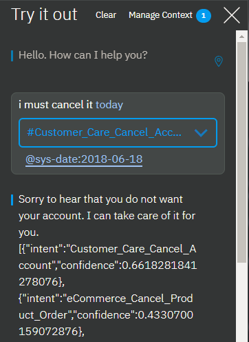

---

copyright:
  years: 2015, 2019
lastupdated: "2018-02-21"

subcollection: assistant

---

{:shortdesc: .shortdesc}
{:new_window: target="_blank"}
{:deprecated: .deprecated}
{:important: .important}
{:note: .note}
{:tip: .tip}
{:pre: .pre}
{:codeblock: .codeblock}
{:screen: .screen}
{:javascript: .ph data-hd-programlang='javascript'}
{:java: .ph data-hd-programlang='java'}
{:python: .ph data-hd-programlang='python'}
{:swift: .ph data-hd-programlang='swift'}
{:gif: data-image-type='gif'}

# 如何处理对话
{: #dialog-runtime}

了解当有人在运行时与您的已部署 {{site.data.keyword.conversationshort}} 服务的实例进行交互时，如何处理您的对话。
{: shortdesc}

## 对话调用剖析
{: #dialog-runtime-message-anatomy}

每个用户发声都会作为一个 /message API 调用传递给对话。这包括用户在回复要求自己提供更多信息的对话提示时所做的发声。一些预订套餐包含固定数量的 API 调用，因此了解构成调用的内容会很有用。单个 /message API 调用相当于一轮对话，由来自用户的输入和来自对话的相应响应组成。

/message API 调用请求和响应的主体包含以下对象：

- `context`：包含打算持久存储的变量。要将一个调用中的信息传递到下一个调用，应用程序开发者必须在每个后续 API 调用中传入先前 API 调用的响应上下文。例如，对话可以收集用户的名称，然后在随后的节点中通过名称引用该用户。

  ```json
  {
    "context" : {
            "user_name" : "<? @sys-person.literal ?>"
    }
  ```
  {: codeblock}

  有关更多信息，请参阅[跨多轮会话保留信息](#dialog-runtime-context)。

- `input`：用户提交的文本字符串。文本字符串最多可以包含 2,048 个字符。

  ```json
  {
    "input": {
      "text" : "Where's your nearest store?"
    }
  ```
  {: codeblock}

- `output`：向用户返回的对话响应。

  ```json
  {
  "output": {
    "generic":[
      {
        "values": [
          {
            "text": "This is my response text."
          }
        ],
        "response_type": "text",
        "selection_policy": "sequential"
      }
    ]
  }
  }
  ```
  {: codeblock}

在生成的 /message API 响应中，文本响应的格式如下所示：

```json
{
   "text": "This is my response text.",
   "response_type": "text"
}
```

支持以下 `output` 对象格式，以实现向后兼容性。使用此格式指定文本响应的任何工作空间都将继续正常运行。引入了富文本响应类型后，`output.text` 结构已使用 `output.generic` 结构进行扩充，以便于不仅支持文本，还支持其他类型的响应。创建新节点时，请使用新格式，以获取更高的灵活性，因为您后续可以根据需要更改响应类型。
{: note}

  ```json
  {
  "output": {
    "text": {
      "values": [
        "This is my response text."
      ]
    }
  }
  ```
  {: codeblock}

除了文本响应外，还有其他响应类型可以定义。有关更多详细信息，请参阅[响应](/docs/services/assistant?topic=assistant-dialog-overview#dialog-overview-responses)。

您可以从 [API 参考 ](https://{DomainName}/apidocs/assistant-v2){: new_window} 中了解有关 /message API 调用的更多信息。

### 跨多轮对话保留信息
{: #dialog-runtime-context}

对话技能中的对话是无状态的，这意味着从与用户的一个交互转至下一个交互时，对话不会保留相关信息。向助手添加对话技能并进行部署时，助手会保存一个消息调用中的上下文，然后在整个当前会话中针对下一个请求重新提交该上下文。当前会话的持续时间等于用户与助手进行交互的时间，对于增强版或高端套餐，最长不活动时间为 60 分钟（对于轻量或标准套餐，为 5 分钟）。如果未向助手添加对话技能，那么您作为定制应用程序开发者，应负责维护应用程序所需的任何持续信息。应用程序必须查找 context 对象并将其存储在消息 API 响应中，然后在作为对话流一部分发起的下一个 /message API 请求的 context 对象中进行传递。

自行保留信息的一种方法是将整个 context 对象存储在客户机应用程序（例如，Web 浏览器）的内存中。随着应用程序变得更加复杂，或者如果需要传递和存储个人可标识信息，您可以在数据库中存储和检索信息。当然，最简单的方法是让您根本不必存储上下文的方法。要实施此方法，请向助手添加对话技能，然后让助手代您跟踪上下文。

应用程序可以将信息传递到对话，对话可以更新此信息，然后将其传递回应用程序，或者传递到后续节点。对话使用*上下文变量*来执行此操作。

## 上下文变量
{: #dialog-runtime-context-variables}

上下文变量是在节点中定义的变量。可以为其指定缺省值。其他节点、应用程序逻辑或用户输入可以随后设置或更改上下文变量的值。

可以通过引用对话节点条件中的上下文变量来根据上下文变量值检查条件，以确定是否执行节点。还可以引用对话节点响应条件中的上下文变量，以根据外部服务或用户提供的值来显示不同响应。

了解更多信息：

- [从应用程序传递上下文](#dialog-runtime-context-from-app)
- [在节点之间传递上下文](#dialog-runtime-context-node-to-node)
- [定义上下文变量](#dialog-runtime-context-var-define)
- [常见上下文变量任务](#dialog-runtime-context-common-tasks)
- [删除上下文变量](#dialog-runtime-context-delete)
- [更新上下文变量](#dialog-runtime-context-update)
- [如何处理上下文变量](#dialog-runtime-context-processing)
- [操作顺序](#dialog-runtime-context-order-of-ops)
- [向带槽的节点添加上下文变量](#dialog-runtime-context-var-slots)

### 从应用程序传递上下文
{: #dialog-runtime-context-from-app}

通过设置上下文变量并将上下文变量传递到对话，可将信息从应用程序传递到对话。

例如，应用程序可以设置 $time_of_day 上下文变量，并将其传递到对话，该对话可以使用此信息来定制其向用户显示的问候语。


在此示例中，对话知道应用程序将此变量设置为以下某个值：*morning*、*afternoon* 或 *evening*。它可以检查每个值，并根据提供的值，返回相应的问候语。如果该变量未传递或具有与某个期望值不匹配的值，那么会向用户显示更通用的问候语。

### 在节点之间传递上下文
{: #dialog-runtime-context-node-to-node}

对话还可以添加上下文变量，以将信息从一个节点传递到另一个节点，或更新上下文变量的值。对话要求用户提供信息，从用户那里获得信息后，即可以跟踪信息，并且稍后在会话中引用这些信息。

例如，在一个节点中，您可能要求用户提供名字，然后在后面的节点中用名字来称呼他们。


在此示例中，系统实体 @sys-person 用于从输入中抽取用户的名字（如果用户提供了名字）。在 JSON 编辑器中，username 上下文变量已定义并设置为 @sys-person 值。在随后的节点中，$username 上下文变量包含在响应中，这样就可以用名字来称呼用户。

### 定义上下文变量
{: #dialog-runtime-context-var-define}

在节点的编辑视图中，通过将变量名称添加到**变量**字段，并向**值**字段添加该变量的缺省值，可定义上下文变量。

1.  单击以打开要向其添加上下文变量的对话节点。

1.  单击与节点响应关联的**选项**  图标，然后单击**打开上下文编辑器**。

      

      如果节点的**多个响应**设置为**开启**，那么对于要关联上下文变量的响应，必须先单击其**编辑响应**  图标。

      

1.  将变量名称和值对添加到**变量**和**值**字段。

    - `name` 可以包含任何大写和小写字母字符、数字字符 (0-9) 和下划线。

      可以在名称中包含其他字符，例如句点和连字符。但是，如果这样做，那么每次后续引用该变量时，都必须指定简写语法 `$(variable-name)`。有关更多详细信息，请参阅[用于访问对象的表达式](/docs/services/assistant?topic=assistant-expression-language#expression-language-shorthand-context)。
{:tip}

    - `value` 可以是任何受支持的 JSON 类型，如简单字符串变量、数字、JSON 数组或 JSON 对象。

下表显示了有关如何为不同类型的值定义名称和值对的一些示例：

|变量     |值               |值类型|
|:---------------|-------------------------------|------------|
|dessert        | "cake"                        |字符串|
|age            |18                 |数字|
|toppings_array | ["onions","olives"]            |JSON 数组|
|full_name     | {"first":"John","last":"Doe"} |JSON 对象|

要随后引用这些上下文变量，请使用语法 `$name`，其中 *name* 是定义的上下文变量的名称。

例如，可将以下表达式指定为对话响应：

`The customer, $age-year-old <? $full_name.first ?>, wants a pizza with <? $toppings_array.join(' and ') ?>, and then $dessert.`

生成的输出如下所示：

`The customer, 18-year-old John, wants a pizza with onions and olives, and then cake.`

还可以使用 JSON 编辑器来定义上下文变量。如果要将复杂表达式添加为变量值，那么您可能希望使用 JSON 编辑器。有关更多详细信息，请参阅 [JSON 编辑器中的上下文变量](#dialog-runtime-context-var-json)。

### 常见上下文变量任务
{: #dialog-runtime-context-common-tasks}

要存储由用户作为输入提供的整个字符串，请使用 `input.text`：

|变量     |值               |
|----------|------------------|
|repeat   | `<?input.text?>` |

例如，用户输入为：`I want to order a device.` 如果节点响应为 `You said: $repeat`，那么响应将显示为 `You said: I want to order a device.`

要在上下文变量中存储实体的值，请使用以下语法：

|变量     |值               |
|----------|------------------|
|place    | `@place`         |

例如，用户输入为：`I want to go to Paris.` 如果 @place 实体识别到 `Paris`，那么服务会在 `$place` 上下文变量中保存 `Paris`。

要存储从用户输入中抽取的字符串的值，可以包含使用 `extract` 方法将正则表达式应用于用户输入的 SpEL 表达式。以下表达式从用户输入中抽取数字，并将其保存到 `$number` 上下文变量。

|变量     |值               |
|----------|-------------------------------------|
|数字   | `<?input.text.extract('[\d]+',0)?>` |

要存储模式实体的值，请将 .literal 附加到实体名称。使用此语法可确保将用户输入中与指定模式匹配的精确范围的文本存储在变量中。

|变量     |值               |
|----------|------------------------|
|email    | `<? @email.literal ?>` |

例如，用户输入为：`Contact me at joe@example.com.` 名为 `@email` 的实体会识别到 `name@domain.com` 电子邮件格式。通过配置上下文变量来存储 `@email.literal`，可指示要存储与模式匹配的输入部分。如果省略值表达式中的 `.literal` 属性，那么会返回为模式指定的实体值名称，而不是与模式匹配的用户输入分段。

这些值示例中有许多是使用方法来捕获用户输入的不同部分。有关可用方法的更多信息，请参阅[表达式语言方法](/docs/services/assistant?topic=assistant-dialog-methods)。

### 删除上下文变量
{: #dialog-runtime-context-delete}

要删除上下文变量，请将该变量设置为 null。

|变量     |值               |
|------------|------------------|
|order_form|`null`         |

或者，可以删除应用程序逻辑中的上下文变量。有关如何完全除去该变量的信息，请参阅[删除 JSON 格式的上下文变量](#dialog-runtime-context-delete-json)。

### 更新上下文变量值
{: #dialog-runtime-context-update}

要更新上下文变量的值，请使用与先前上下文变量相同的名称来定义上下文变量，但这次为其指定不同的值。

多个节点设置同一上下文变量的值时，该上下文变量的值可能会在与用户的会话过程中更改。在任意给定时间应用哪个值取决于用户在会话过程中触发哪个节点。为最后一个节点中的上下文变量指定的值将覆盖先前处理的节点为该变量设置的任何值。

有关在上下文变量值为 JSON 对象或 JSON 数组数据类型时如何更新该值的信息，请参阅[更新 JSON 格式的上下文变量值](#dialog-runtime-context-update-json)。

### 如何处理上下文变量
{: #dialog-runtime-context-processing}

定义上下文变量的位置很重要。服务处理了在对话节点中定义了上下文变量的部分后，才会创建该上下文变量，并将其设置为您所指定的值。在大多数情况下，可将上下文变量定义为节点响应的一部分。执行此操作时，将在服务返回节点响应时创建上下文变量并为其提供指定的值。

对于具有条件响应的节点，将在满足特定响应的条件并处理该响应时创建并设置上下文变量。例如，如果为条件响应 #1 定义了上下文变量，但服务仅处理条件响应 #2，那么不会创建和设置为条件响应 #1 定义的上下文变量。

有关将您希望服务在用户与带槽的节点进行交互时创建并设置的上下文变量添加到何处的信息，请参阅[向带槽的节点添加上下文变量](#dialog-runtime-context-var-slots)。

### 操作顺序
{: #dialog-runtime-context-order-of-ops}

定义要一起处理的多个变量时，定义这些变量的顺序不会确定服务对其进行求值的顺序。服务会按随机顺序对变量求值。因此，不要在列表中的第一个上下文变量中设置值并期望能够在列表中的第二个变量中使用该值，因为无法保证第一个上下文变量将在第二个变量之前执行。例如，不要使用两个上下文变量来实现用于检查用户输入是否包含单词 `Yes` 的逻辑。

|变量     |值               |
|-----------------|------------------|
|user_input| <? input.text ?>|
|contains_yes| <? $user_input.contains('Yes') ?>|

请改为使用略复杂一些的表达式，以避免在对列表中的第二个变量 (contains_yes) 求值之前，必须依赖于对第一个变量 (user_input) 求值。

|变量     |值               |
|---------------|------------------|
|contains_yes| <? input.text.contains('Yes') ?>|

### 向带槽的节点添加上下文变量
{: #dialog-runtime-context-var-slots}

有关槽的更多信息，请参阅[使用槽收集信息](/docs/services/assistant?topic=assistant-dialog-slots)。

1.  在编辑视图中打开带槽的节点。

    - 要添加在满足槽响应条件后处理的上下文变量，请执行以下步骤：

      1.  单击**编辑槽**  图标。
      1.  单击**选项**  图标，然后选择**启用条件响应**。
      1.  单击要将上下文变量与其关联的响应旁边的**编辑响应**  图标。
      1.  单击响应部分中的**选项**  图标，然后单击**打开上下文编辑器**。
      1.  将变量名称和值对添加到**变量**和**值**字段。

      

    - 要添加在满足槽条件后设置或更新的上下文变量，请完成以下步骤：

      1.  单击**编辑槽**  图标。
      1.  从*配置槽*视图标题的**选项**  菜单中，单击**打开 JSON 编辑器**。
      1.  添加 JSON 格式的变量名称和值对。

          ```json
          {
            "time_of_day": "morning"
          }
          ```
          {: codeblock}

      目前没有办法使用上下文编辑器来定义在此对话节点求值阶段内设置的上下文变量。您必须改为使用 JSON 编辑器。有关使用 JSON 编辑器的更多信息，请参阅 [JSON 编辑器中的上下文变量](#dialog-runtime-context-var-json)。
      {: note}

      

## JSON 编辑器中的上下文变量
{: #dialog-runtime-context-var-json}

您还可以在 JSON 编辑器中定义上下文变量。如果要定义复杂上下文变量，并且希望能够在添加或更改上下文变量时看到完整的 SpEL 表达式，那么您可能希望使用 JSON 编辑器。

名称和值对必须满足以下要求：

- `name` 可以包含任何大写和小写字母字符、数字字符 (0-9) 和下划线。

  可以在名称中包含其他字符，例如句点和连字符。但是，如果这样做，那么每次后续引用该变量时，都必须指定简写语法 `$(variable-name)`。有关更多详细信息，请参阅[用于访问对象的表达式](/docs/services/assistant?topic=assistant-expression-language#expression-lanaguage-shorthand-context)。
{:tip}

- `value` 可以是任何受支持的 JSON 类型，如简单字符串变量、数字、JSON 数组或 JSON 对象。

以下 JSON 样本定义 $dessert 字符串、$toppings_array 数组、$age 数字和 $full_name 对象上下文变量的值：

```json
{
  "context": {
   "dessert": "cake",
    "toppings_array": [
      "onions",
      "olives"
    ],
    "age": 18,
    "full_name": {
      "first": "Jane",
      "last": "Doe"
    }
  },
        "output": {}
      }
      ```
{: codeblock}

要定义 JSON 格式的上下文变量，请完成以下步骤：

1.  单击以打开要向其添加上下文变量的对话节点。

    为此节点定义的任何现有上下文变量值都会显示在一组相应的**变量**和**值**字段中。如果不希望这些字段显示在节点的编辑视图中，您必须关闭上下文编辑器。您可以通过用于打开 JSON 编辑器的相同菜单来关闭上下文编辑器；以下步骤描述如何访问该菜单。
    {: note}

1.  单击与响应关联的**选项**  图标，然后单击**打开 JSON 编辑器**。

    

    如果节点的**多个响应**设置为**开启**，那么对于要关联上下文变量的响应，必须先单击其**编辑响应**  图标。

    

1.  添加 `"context":{}` 块（如果不存在）。

    ```json
    {
      "context":{},
      "output":{}
    }
    ```
    {: codeblock}

1.  在 context 块中，为要定义的每个上下文变量添加 `"name"` 和 `"value"` 对。

    ```json
    {
          "context":{
      "name": "value"
    },
        "output": {}
      }
      ```
    {: codeblock}

    在此示例中，将名为 `new_variable` 的变量添加到已经包含变量的 context 块中。

    ```json
    {
          "context":{
      "existing_variable": "value",
        "new_variable":"value"
      }
    }
    ```
    {: codeblock}

    要随后引用上下文变量，请使用语法 `$name`，其中 *name* 是定义的上下文变量的名称。例如，`$new_variable`。

了解更多信息：

- [删除 JSON 格式的上下文变量](#dialog-runtime-context-delete-json)
- [更新 JSON 格式的上下文变量值](#dialog-runtime-context-update-json)
- [设置一个上下文变量等于另一个上下文变量](#dialog-runtime-var-equals-var)

### 删除 JSON 格式的上下文变量
{: #dialog-runtime-context-delete-json}

要删除上下文变量，请将该变量设置为 null。

```json
{
  "context": {
   "order_form": null
  }
}
```
{: codeblock}

如果要删除上下文变量的所有跟踪，可以使用 JSONObject.remove(string) 方法将其从 context 对象中删除。但是，您必须使用变量来执行除去操作。在消息输出中定义新变量，以使其不会保存在当前调用之外。

```json
{
  "output": {
    "text" : {},
    "deleted_variable" : "<? context.remove('order_form') ?>"
  }
}
```
{: codeblock}

或者，可以删除应用程序逻辑中的上下文变量。

### 更新 JSON 格式的上下文变量值
{: #dialog-runtime-context-update-json}

通常，如果节点为已经设置的上下文变量设置值，那么新值会覆盖先前的值。

#### 更新复杂 JSON 对象

这将覆盖除 JSON 对象以外的所有 JSON 类型的先前值。如果上下文变量是复杂类型（如 JSON 对象），那么会使用 JSON 合并过程来更新变量。合并操作将添加任何新定义的属性，并覆盖对象的任何现有属性。

在此示例中，名称上下文变量定义为复杂对象。

```json
{
  "context": {
   "complex_object": {
      "user_firstname" : "Paul",
      "user_lastname" : "Pan",
      "has_card" : false
    }
  }
}
```
{: codeblock}

对话节点使用以下值来更新该上下文变量 JSON 对象：

```json
{
  "complex_object": {
    "user_firstname": "Peter",
    "has_card": true
  }
}
```
{: codeblock}

结果为以下上下文：

```json
{
  "complex_object": {
    "user_firstname": "Peter",
    "user_lastname": "Pan",
    "has_card": true
  }
}
```
{: codeblock}

有关可以在对象上执行的方法的更多信息，请参阅[表达式语言方法](/docs/services/assistant?topic=assistant-dialog-methods#dialog-methods-objects)。

#### 更新数组

如果对话上下文数据包含值的数组，那么可以通过附加值、除去值或替换所有值来更新该数组。

选择以下某个选项以更新数组。在每种情况下，都会看到应用了操作之前的数组、操作和应用了操作之后的数组。

- **附加**：要将值添加到数组末尾，请使用 `append` 方法。

    对于以下对话运行时上下文：

    ```json
    {
      "context": {
   "toppings_array": ["onion", "olives"]
      }
    }
    ```
    {: codeblock}

    进行以下更新：

    ```json
    {
      "context": {
   "toppings_array": "<? $toppings_array.append('ketchup', 'tomatoes') ?>"
      }
    }
    ```
    {: codeblock}

    结果：

    ```json
    {
      "context": {
   "toppings_array": ["onion", "olives", "ketchup", "tomatoes"]
      }
    }
    ```
    {: codeblock}

- **除去**：要除去元素，请使用 `remove` 方法并在数组中指定其值或位置。

    - **按值除去**：按元素的值从数组中除去元素。

        对于以下对话运行时上下文：

        ```json
        {
          "context": {
   "toppings_array": ["onion", "olives"]
          }
        }
        ```
        {: codeblock}

        进行以下更新：

        ```json
        {
          "context": {
   "toppings_array": "<? $toppings_array.removeValue('onion') ?>"
          }
        }
        ```
        {: codeblock}

        结果：

        ```json
        {
          "context": {
   "toppings_array": ["olives"]
          }
        }
        ```
        {: codeblock}

    - **按位置除去**：按元素的索引位置从数组中除去元素：

        对于以下对话运行时上下文：

        ```json
        {
          "context": {
   "toppings_array": ["onion", "olives"]
          }
        }
        ```
        {: codeblock}

        进行以下更新：

        ```json
        {
          "context": {
   "toppings_array": "<? $toppings_array.remove(0) ?>"
          }
        }
        ```
        {: codeblock}

        结果：

        ```json
        {
          "context": {
   "toppings_array": ["olives"]
          }
        }
        ```
        {: codeblock}

- **覆盖**：要覆盖数组中的值，只需将数组设置为新值即可：

    对于以下对话运行时上下文：

        ```json
        {
          "context": {
   "toppings_array": ["onion", "olives"]
          }
        }
        ```
        {: codeblock}

    进行以下更新：

        ```json
        {
          "context": {
   "toppings_array": ["ketchup", "tomatoes"]
          }
        }
        ```
        {: codeblock}

    结果：

        ```json
        {
          "context": {
   "toppings_array": ["ketchup", "tomatoes"]
          }
        }
        ```
        {: codeblock}

有关可以在数组上执行的方法的更多信息，请参阅[表达式语言方法](/docs/services/assistant?topic=assistant-dialog-methods#dialog-methods-arrays)。

### 设置一个上下文变量等于另一个上下文变量
{: #dialog-runtime-var-equals-var}

将一个上下文变量设置为等于另一个上下文变量时，即相当于定义了从一个上下文变量指向另一个上下文变量的指针。如果随后其中一个变量的值更改，那么另一个变量的值也会更改。

例如，如果如下所示指定了上下文变量，那么随后 `$var1` 或 `$var2` 的值更改时，另一个变量的值也会更改。

|变量     |值               |
|-----------|--------|
|var2|var1|

不要将一个变量设置为等于另一个变量以捕获时间点值。例如，在处理数组时，如果要在对话中的特定点捕获存储在上下文变量中的数组值，以保存供日后使用，那么可以改为根据变量的当前值来创建新变量。

例如，要在对话流的特定点创建数组值的副本，请添加以现有数组的值填充的新数组。为此，可以使用以下语法：

```json
{
"context": {
   "var2": "<? output.var2?:new JsonArray().append($var1) ?>"
 }
 }
 ```
{: codeblock}

## 离题
{: #dialog-runtime-digressions}

用户处于旨在处理一个目标的对话流中，然后突然切换主题以启动旨在处理其他目标的对话流时，即会发生离题。对话始终支持用户更改主题。如果正在处理的对话分支中没有任何节点与用户的最新输入的目标相匹配，那么对话将返回到树中来检查根节点条件以寻找相应的匹配项。通过每个节点可用的离题设置，您可以进一步定制这种行为。

使用离题设置，您可以允许对话返回到发生离题时中断的对话流。例如，用户可能正在订购一部新手机，但切换主题来询问有关平板电脑的问题。对话可以回答有关平板电脑的问题，然后使用户返回到在订购电话的过程中中断的位置。通过允许发生离题并返回，用户在运行时可更好地控制对话流。他们可以更改主题，关注有关不相关主题的对话流直到结束，然后返回到原来的位置。结果是对话流更接近模拟人与人之间的对话。

{: gif}

动画图像使用对话树用户界面的实体模型来说明离题的概念。图中显示了用户如何与配置为允许离题的对话节点进行交互，离题可返回到正在进行的对话流。用户开始提供预订晚餐所需的信息。在填充 #reservation 节点中槽的过程中，用户提出了有关素食菜单选项的问题。该对话通过在根节点（以 #cuisine 意向为条件的节点）中查找能处理用户新问题的节点来回答此问题。然后通过显示原始对话节点中下一个空槽的提示来返回到正在进行的对话。

观看此视频以了解更多信息。

<iframe class="embed-responsive-item" id="youtubeplayer" title="离题概述" type="text/html" width="640" height="390" src="https://www.youtube.com/embed/I3K7mQ46K3o?rel=0" frameborder="0" webkitallowfullscreen mozallowfullscreen allowfullscreen> </iframe>

- [开始之前](#dialog-runtime-digression-prereqs)
- [定制离题](#dialog-runtime-enable-digressions)
- [离题用法提示](#dialog-runtime-digress-tips)
- [禁止离题到根节点](#dialog-runtime-disable-digressions)
- [离题教程](#dialog-runtime-digression-tutorial)
- [设计注意事项](#dialog-runtime-digression-design-considerations)

### 开始之前
{: #dialog-runtime-digression-prereqs}

测试总体对话时，请决定何时以及何处可合理地允许发生离题以及从离题返回。以下离题控件将自动应用于节点。请仅在要更改此缺省行为时才执行操作。

- 缺省情况下，对话中的每个根节点都配置为允许离题将其设定为目标。子节点不能成为离题的目标。
- 有槽的节点配置为阻止离题。其他所有节点都配置为允许离题。但是，在以下情况下，对话无法从节点离题：

  - 如果当前节点的任何子节点包含 `anything_else` 或 `true` 条件

    这些条件的特殊之处在于，它们始终求值为 true。由于这些条件的已知行为，因此通常在对话中将这些条件用于强制父节点对特定子节点连续求值。为了防止破坏现有的对话流逻辑，在这种情况下不允许离题。您必须将该子节点的条件更改为其他内容后，才能允许从此类节点离题。

  - 如果将节点配置为跳转至另一个节点，或者在处理后跳过用户输入

    节点的最后一步部分指定处理该节点后应该发生的情况。对话配置为直接跳转至另一个节点时，通常要确保遵循特定的顺序。此外，节点配置为跳过用户输入时，等同于强制对话连续处理当前节点之后的第一个子节点。为了防止破坏现有的对话流逻辑，在这两种情况下都不允许离题。必须更改最后一步部分中指定的内容后，才能允许从此节点离题。

### 定制离题
{: #dialog-runtime-enable-digressions}

您无法定义离题的开始和结束。用户在运行时对离题流具备完全控制权。您只能指定每个节点是否应该参与用户导向型离题。对于每个节点，您可配置：

- 离题是否可以从节点开始以及离开该节点
- 其他位置开始的离题是否可以将节点设定为目标并进入该节点
- 其他位置开始并进入节点的离题是否必须在当前对话流完成后返回到中断的对话流

要更改单个节点的离题行为，请完成以下步骤：

1.  单击节点以打开其编辑视图。

1.  单击**定制**，然后单击**离题**选项卡。

    配置选项根据您在编辑的节点是根节点、子节点、有子节点的节点还是有槽的节点而有所不同。

    **从此节点离题**

    如果早先列出的情况不适用，那么可以做出以下选择：

    - **所有节点类型**：选择是否允许用户在到达当前对话分支末尾之前从当前节点离题。

    - **有子节点的所有节点**：选择在已经显示当前节点的响应，并且其子节点对于该节点的目标比较次要时，是否希望对话在离题后返回到当前节点。将*允许从在此节点的响应后触发的离题返回*切换控件设置为**否**，以阻止对话返回到当前节点并继续处理其分支。

      例如，如果用户提问 `Do you sell cupcakes?`，并且在用户更改主题之前显示的响应为 `We offer cupcakes in a variety of flavors and sizes`，那么您可能并不希望对话返回到中断的位置。尤其是，如果子节点只处理用户可能提出的跟进问题，那么可以将其安全地忽略。

      但是，如果节点依赖其子节点来处理问题，那么可能需要强制对话返回并继续处理当前分支中的节点。例如，初始响应可能为 `We offer cupcakes in all shapes and sizes. Which menu do you want to see: gluten-free, dairy-free, or regular?`。如果用户此时更改主题，那么可能需要对话返回，以便用户可以选取菜单类型并获取想要的信息。

    - **有槽的节点**：选择是否要允许用户在填充所有槽之前从节点离题。将*允许在槽填充时离题*切换控件设置为**是**以启用离题。

      如果启用，当对话从离题返回时，将显示下一个未填充槽的提示，以鼓励用户继续提供信息。如果禁用，那么在用户提交的任何输入中不包含可填充槽的值时，将忽略这些输入。但是，您可以通过定义槽处理程序来处理您预期用户在与节点交互时可能会主动提出的问题。有关更多信息，请参阅[添加槽](/docs/services/assistant?topic=assistant-dialog-slots#dialog-slots-add)。

      下图显示了如何配置从有槽的 #reservation 节点（如上图中所示）发生的离题。

      

    - **有槽的节点**：通过选中**仅从槽离题到允许返回的节点**复选框，以选择是否仅当用户将返回到当前节点时，才允许用户离题。

      选中后，当对话查找节点以回答用户的不相关问题时，将忽略未配置为在离题后返回的所有根节点。如果要阻止用户在完成填充必需槽之前永久离开节点，请选中此复选框。

    **离题到此节点**

    针对离题到节点的行为表现，您可以做出以下选择：

    - 阻止用户离题到节点。有关更多详细信息，请参阅[禁止离题到根节点](#dialog-runtime-disable-digressions)。

    - 在允许离题到节点后，选择对话是否必须返回到之前从中离题的对话流。如果选择是，在处理完当前节点的分支后，对话流将返回到中断的节点。要使对话在此之后返回，请选择**离题后返回**。

    下图显示了如何配置离题到 #cuisine 节点（如上图中所示）的情况。

    

1.  单击**应用**。

1.  使用“试用”窗格来测试离题行为。

    同样，您无法定义离题的开始和结束。用户可以控制何处以及何时发生离题。您只能应用用于确定单个节点如何参与离题的设置。由于离题非常难以预测，因此很难知道您的配置决策将如何影响总体对话。要真正了解所做选择的影响，您必须测试对话。

#reservation 和 #cuisine 节点代表可以参与单个用户导向型离题的两个对话分支。为每个单独的节点配置的离题设置用于在运行时实现此类型的离题。


### 离题用法提示
{: #dialog-runtime-digress-tips}

本部分描述了使用离题时可能会遇到的情境的解决方案。

- **定制返回消息**：对于支持从离题返回的任何节点，请考虑添加相关措辞，使用户知道他们将返回到先前对话流中上次离开的位置。在文本响应中，使用允许添加两个版本响应的特殊语法。

  如果不执行操作，那么会再次显示相同的文本响应，使用户知道他们已返回到从中离题的节点。通过指定在用户返回时显示的唯一消息，可使用户更清楚地知道自己已返回到原始会话线程。

  例如，如果节点的原始文本响应为 `What's the order number?`，那么您可能希望在用户返回到该节点时显示类似于以下内容的消息：`Now let's get back to where we left off. What is the order number?`。

  为此，请使用以下语法来指定节点文本响应：

  `<? (returning_from_digression)? "post-digression message" : "first-time message" ?>`

  例如：

  ```bash
  <? (returning_from_digression)? "Now, let's get back to where we left off.
  What is the order number?" : "What's the order number?" ?>
  ```
  {: codeblock}

  在添加的文本响应中不能包含 SpEL 表达式或简写语法。事实上，您根本无法使用简写语法。您必须改为通过将文本字符串和完整的 SpEL 表达式语法并置在一起以构成完整响应，从而构建消息。
  {: note}
  
  例如，使用以下语法在通常会指定为 `What can I do for you, $username?` 的文本响应中包含一个上下文变量：

  ```bash
  <? (returning_from_digression)? "Where were we, " +
  context["username"] + "? Oh right, I was asking what can I do
  for you today." : "What can I do for you today, " +
  context["username"] + "?" ?>
  ```

  有关完整 SpEL 表达式语法详细信息，请参阅[用于访问对象的表达式](/docs/services/assistant?topic=assistant-expression-language#expression-language-shorthand-syntax)。

- **阻止返回**：在某些情况下，您可能希望根据用户在当前对话流中所做的选择，阻止返回到中断的会话流。您可以使用特殊语法来阻止从特定节点返回。

  例如，您可能有一个节点以 `#General_Connect_To_Agent` 或类似的意向为条件。触发时，如果希望获得用户确认后再转移到外部服务，那么可能要添加响应，例如：`Do you want me to transfer you to an agent now?` 然后，可以添加两个子节点，分别以 `#yes` 和 `#no` 为条件。
  
  管理此类型分支的离题的最佳方法是设置根节点以允许离题返回。但是，在 `#yes` 节点上，请在响应中包含 SpEL 表达式 `<? clearDialogStack() ?>`。例如：
  
    ```bash
  OK. I will transfer you now. <? clearDialogStack() ?>
  ```
  {: codeblock}

  此 SpEL 表达式可阻止从此节点执行离题返回。请求确认时，如果用户回复 yes，那么会显示相应的响应，并且不会恢复已中断的对话流。如果用户回复 no，那么会将用户返回到已中断的流。

### 禁止离题到根节点
{: #dialog-runtime-disable-digressions}

当流离题到根节点时，会遵循为该节点配置的对话过程。因此，可能会在到达节点分支末尾之前处理一系列子节点，然后（如果这样配置）返回到中断的对话流。通过对话测试，您可能会发现某个根节点触发得太频繁、在意外时间触发，或者其对话太复杂，导致用户离题太远而不适合作为临时离题的候选项。如果您确定不想允许用户离题到根节点，那么可以将根节点配置为不允许离题到其中。要完全禁止离题到根节点，请完成以下步骤：

1.  单击以打开要编辑的根节点。
1.  单击**定制**，然后单击**离题**选项卡。
1.  将*允许离题到此节点*切换控件设置为**关闭**。
1.  单击**应用**。

如果您决定要阻止离题到多个根节点，但又不想分别编辑每一个根节点，那么可以将这些节点添加到一个文件夹中。在该文件夹的*定制*页面中，可以将*允许离题到此节点*切换控件设置为**关闭**，以将该配置一次性应用于所有节点。有关更多信息，请参阅[使用文件夹组织对话](/docs/services/assistant?topic=assistant-dialog-build#dialog-build-folders)。

### 离题教程
{: #dialog-runtime-digression-tutorial}

遵循[教程](/docs/services/assistant?topic=assistant-tutorial-digressions) 来导入已定义了一组节点的工作空间。您可以做一些说明离题工作方式的练习。

### 设计注意事项
{: #dialog-runtime-digression-design-considerations}

- **避免回退节点过多**：许多对话设计人员会在每个对话分支的末尾包含一个具有 `true` 或 `anything_else` 条件的节点，以防止用户卡在分支中。如果用户输入与您预期的任何内容都不匹配并且包含要处理的特定对话节点，那么此设计会返回一条通用消息。但是，用户无法从使用这种方法的对话流离题。对使用此方法的任何分支求值，以确定允许从该分支离题是否更好。如果用户的输入与您预期的任何内容都不匹配，那么可能会根据树中完全不同的对话流来查找匹配项。您可以使对话的其余部分有效地用于尝试处理用户的输入，而不使用通用消息进行响应。此外，根级别的`其他`节点始终可以响应其他任何根节点都无法处理的输入。

- **重新考虑跳转至结束节点**：许多对话设计为提出一个标准的结束问题，例如，`我今天回答了您的问题吗？`。用户无法从配置为跳转至其他节点的节点离题。因此，如果将所有最终分支节点配置为跳转至通用结束节点，那么不会发生离题。请考虑通过度量值或其他某种方式来跟踪用户满意度。

- **测试可能的离题链**：如果用户从当前节点离题到另一个允许从中离题的节点，那么用户可能会从后一个节点离题，并重复此模式一次或多次。如果将离题链中的起始节点配置为在离题后返回，那么用户最终会回到当前对话节点。事实上，对于链中配置为不返回的任何后续节点，都不会将其纳入离题目标的考虑范围。请对多次离题的场景进行测试，以确定各个节点是否按预期运行。

- **记住当前节点优先**：请记住，仅在当前流无法处理用户输入时，才会考虑将当前流之外的节点作为离题目标。这在允许离题（尤其是离题以向用户明确说明需要提供哪些信息，以及添加在用户提供值后显示的确认语句）的有槽的节点中甚至更加重要。在槽填充过程中可以填充任何槽。所以，槽可能会意外捕获用户输入。例如，您可能有一个有槽的节点，用于收集进行晚餐预订所需的信息。其中一个槽收集日期信息。在提供预订详细信息时，用户可能会问 `What's the weather meant to be tomorrow?`。您可能有一个以 #forecast 为条件的根节点可回答用户。但是，因为用户的输入包含单词 `tomorrow`，并且正在处理带槽的 reservation 节点，所以服务假定用户将改为提供或更新预订日期。*当前节点始终优先。*如果定义了明确的确认语句（例如，`Ok, setting the reservation date to tomorrow`），那么用户更有可能意识到存在理解错误并进行相应更正。

  反过来，在填充槽时，如果用户提供的值不是任何槽所期望的值，有可能会将其与用户从未打算离题到的完全不相关的根节点进行匹配。在配置离题行为时，务必执行大量测试。

- **何时使用离题，而不使用槽处理程序**：对于用户随时可能会提出的常规问题，请使用允许离题到其中的根节点，处理输入，然后返回到正在执行的流。对于有槽的节点，请在填充槽时尝试预测用户可能会提出的相关问题的类型，并通过向节点添加处理程序来处理这些问题。例如，如果有槽的节点收集填写保险索赔所需的信息，那么您可能需要添加用于处理有关保险的常见问题的处理程序。但是，有关如何获取帮助、您商店的位置或公司历史的问题，请使用根级别节点。

## 消歧
{: #dialog-runtime-disambiguation}

此功能仅可供增强版或高端套餐用户使用。
{: tip}

启用消歧时，即指示服务在发现多个对话节点可以响应其输入时，要求用户提供帮助。您的助手会与用户共享最热门节点选项的列表，并要求用户选取正确的节点，而不是猜测要处理哪个节点。


如果启用了消歧，那么除非满足以下条件，否则不会触发消歧：

- 在用户输入中检测到的一个或多个次热门意向的置信度分数大于最热门意向置信度分数的 55%。
- 最热门意向的置信度分数高于 0.2。

即使满足以上条件，仍不会执行消歧，除非对话中有两个或更多独立节点满足以下条件：

- 节点条件包含已触发消歧的其中一个意向。或者，节点条件不包含这样的意向，但求值为 true。例如，如果节点检查是否有某种实体类型，并且用户输入中提及了相应实体，那么该节点即符合条件。
- 节点的*外部节点名*字段中有文本。

了解更多信息

- [消歧示例](#dialog-runtime-disambig-example)
- [启用消歧](#dialog-runtime-disambig-enable)
- [选择节点](#dialog-runtime-choose-nodes)
- [处理“以上都不适用”](#dialog-runtime-handle-none)
- [测试消歧](#dialog-runtime-disambig-test)

### 消歧示例
{: #dialog-runtime-disambig-example}

例如，您有一个对话具有两个节点，节点的意向条件用于处理取消请求。条件如下：

- eCommerce_Cancel_Product_Order
- Customer_Care_Cancel_Account

如果用户输入为 `i must cancel it today`，那么可能会在输入中检测到以下意向：

`[`
`{"intent":"Customer_Care_Cancel_Account","confidence":0.6618281841278076},`
`{"intent":"eCommerce_Cancel_Product_Order","confidence":0.4330700159072876},`
`{"intent":"Customer_Care_Appointments","confidence":0.2902342438697815},`
`{"intent":"Customer_Care_Store_Hours","confidence":0.2550420880317688},`
`...]`

服务对用户目标与 `#Customer_Care_Cancel_Account` 意向相匹配的置信度为 `0.6618281841278076` (66%)。如果其他任何意向的置信度分数大于 66% 的 55%，那么该意向即符合作为消歧候选项的条件。

`0.66 x 0.55 = 0.36`

分数大于 0.36 的意向符合条件。

在示例中，`#eCommerce_Cancel_Product_Order` 意向已超过阈值，置信度分数为 `0.4330700159072876`。

用户输入为 `i must cancel it today` 时，会将这两个对话节点都视为可响应的可行候选项。为了确定要处理哪个对话节点，助手会要求用户选取一个对话节点。为了帮助用户进行选择，助手提供了有关每个节点所执行操作的简短摘要。显示的摘要文本是直接从为每个节点指定的*外部节点名*信息中抽取的。


请注意，服务会将用户输入中的术语 `today`（`@sys-date` 实体的提及项）识别为日期。如果对话树包含以 `@sys-date` 实体为条件的节点，那么该节点也会包含在消歧选项列表中。下图显示了将该节点包含为列表中的*捕获日期信息*选项。


以下视频提供了消歧概述。

<iframe class="embed-responsive-item" id="youtubeplayer0" title="消歧概述" type="text/html" width="640" height="390" src="https://www.youtube.com/embed/VVyklAXlmbA?rel=0" frameborder="0" webkitallowfullscreen mozallowfullscreen allowfullscreen> </iframe>

### 启用消歧
{: #dialog-runtime-disambig-enable}

要启用消歧，请完成以下步骤：

1.  在“对话”页面中，单击**设置**。
1.  单击**消歧**。
1.  在*启用消歧*部分中，将切换控件切换为**开启**。
1.  在提示消息字段中，添加要显示在对话节点选项列表前面的文本。例如，*您想做什么？*
1.  **可选**：在“以上都不适用”消息字段中，添加要显示为额外选项的文本，如果其他对话节点都没有反映出用户要执行的操作，用户可以选取该选项。例如，*以上都不适用*。

    使消息保持简短，以便显示时与其他选项排列整齐。消息必须少于 512 个字符。有关用户选择此选项时服务执行的操作的信息，请参阅[处理“以上都不适用”](#dialog-runtime-handle-none)。

1.  单击**关闭**
1.  决定您希望助手要求帮助的对话节点。

    - 可以选取树层次结构中任何级别的节点。
    - 可以选取以意向、实体、特殊条件、上下文变量或这些值的任意组合为条件的节点。

    有关提示，请参阅[选择节点](#dialog-runtime-choose-nodes)。

    对于要选择加入用于消歧的每个节点，请完成以下步骤：

    1.  单击以在编辑视图中打开该节点。
    1.  在*外部节点名*字段中，描述此对话节点设计为处理的用户任务。例如，*取消帐户*。

        

### 选择节点
{: #dialog-runtime-choose-nodes}

选择充当对话不同分支的根的节点，以使其成为消歧选项。这些节点可以包括作为其他节点的子代的节点。关键是使相应节点以区别于其他所有值的某一个或多个不同值为条件。

工具可以识别意向冲突，在两个或更多个意向具有重叠的用户示例时，会发生意向冲突。请先[解决任何此类冲突](/docs/services/assistant?topic=assistant-intents#intents-resolve-conflicts)，以确保意向本身尽可能唯一，这可帮助服务获得更好的意向置信度分数。
{: note}

请记住：

- 对于以意向为条件的节点，如果服务确信节点的意向条件与用户的意向匹配，那么会将该节点包含为消歧选项。
- 对于具有布尔值条件（求值为 true 或 false 的条件）的节点，如果条件求值为 true，那么会将该节点包含为消歧选项。例如，节点以实体类型为条件时，如果输入中提及触发消歧的实体，那么会包含该节点。
- 树层次结构中的节点顺序会影响消歧。

  - 影响是否触发消歧

    例如，查看先前为了引入消歧而使用的[场景](#dialog-runtime-disambig-example)。如果以 `@sys-date` 为条件的节点在对话树中的放置位置高于以 `#Customer_Care_Cancel_Account` 和 `#eCommerce_Cancel_Product_Order` 意向为条件的节点，那么在用户输入 `i must cancel it today` 时，将永远不会触发消歧。这是因为服务根据树中相应节点的位置，认为日期提及项 (`today`) 比意向引用更重要。

  - 影响哪些节点包含在消歧选项列表中

    有时，节点未按预期列为消歧选项。如果某个条件值还被某个节点引用，但该节点由于某种原因而没有资格包含在消歧列表中，那么也可能会发生这种情况。例如，实体提及项可能触发对话树中位于较早位置，但未启用消歧的节点。如果同一实体是*已*启用消歧的节点的唯一条件，但位于树中的较低位置，那么不会将其添加为消歧选项，因为服务永远不会达到此节点。它与较早的节点相匹配，并且已省略，因此服务不会处理后面的节点。

对于选择加入用于消歧的每个节点，请测试期望节点包含在消歧选项列表中的场景。通过测试，您可借机调整节点顺序，或调整可能会影响运行时消歧效果的其他因素。

### 处理“以上都不适用”
{: #dialog-runtime-handle-none}

用户单击*以上都不适用*选项时，服务会从消息中剥离在用户输入中识别到的意向，并再次提交该消息。此操作通常会触发对话树中的 anything else 节点。

要定制在这种情况下返回的响应，可以添加一个根节点，该节点有一个条件用于检查用户输入中是否没有识别到的意向（请记住，这些意向已剥离）并包含 `suggestion_id` 属性。触发消歧时，服务会添加 `suggestion_id` 属性。
{: tip}

添加具有以下条件的根节点：

```json
intents.size()==0 && input.suggestion_id
```
{: codeblock}

只有输入触发了一组消歧选项，但用户已指示没有任何选项与其目标相符的情况下，才满足此条件。

添加响应，以让用户知道您理解建议的选项都不满足其需求，并执行相应操作。

同样，节点在树中的位置很重要。如果以用户输入中提及的实体类型为条件的节点在树中的位置高于此节点，那么会改为显示那个节点的响应。

### 测试消歧
{: #dialog-runtime-disambig-test}

要测试消歧，请完成以下步骤：

1.  在“试用”窗格中，输入您认为适合作为消歧候选项的测试发声，这意味着两个或更多对话节点配置为处理类似它的发声。

1.  如果响应未按预期包含供您选择的对话节点选项列表，请首先检查是否已将摘要信息添加到每个节点的“外部节点名”字段中。

1.  如果仍未触发消歧，那么可能是节点的置信度分数值不像您认为的那么接近。

    您可以获取有关为特定用户输入返回的意向、实体和其他属性的信息。

    - 要查看用户输入中检测到的意向的置信度分数，请临时将 `<? intents ?>` 添加到您知道将触发的节点的节点响应末尾。

      此 SpEL 表达式将在用户输入中检测到的意向作为数组显示。数组包括意向名称以及服务对意向反映用户预期目标的置信度级别。

    - 要查看在用户输入中检测到的实体（如果有），可以临时将当前响应替换为包含 SpEL 表达式 `<? entities ?>` 的单个文本响应。

      此 SpEL 表达式将在用户输入中检测到的实体作为数组显示。数组包含实体名称、实体提及项在用户输入字符串中的位置、实体提及项字符串，以及服务对该术语是指定实体类型的提及项的置信度级别。

    - 要一次性查看所有工件的详细信息，包括其他属性（例如，调用时给定上下文变量的值），可以检查整个 API 响应。请参阅[查看 API 调用详细信息](/docs/services/assistant?topic=assistant-dialog-tips#dialog-tips-inspect-api)。

1.  对于您预期将作为消歧选项列出的至少一个节点，临时除去添加到其*外部节点名*字段中的描述。

1.  在“试用”窗格中，再次输入测试发声。

    如果向响应添加了 `<? intents ?>` 表达式，那么返回的文本包含服务在测试发声中识别到的意向的列表，并包含每个意向的置信度分数。

    

完成测试后，请除去附加到节点响应的任何 SpEL 表达式，或者重新添加任何已替换为表达式的原始响应，然后重新填充从中除去文本的任何*外部节点名*字段。
