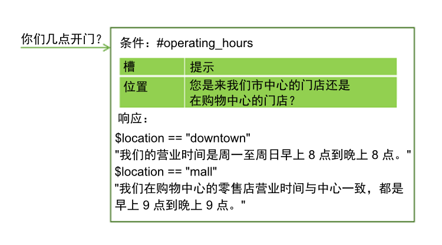
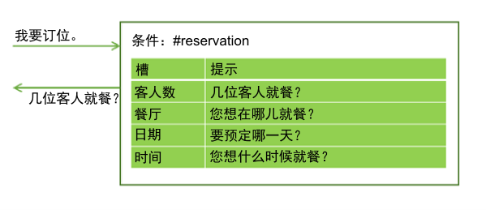
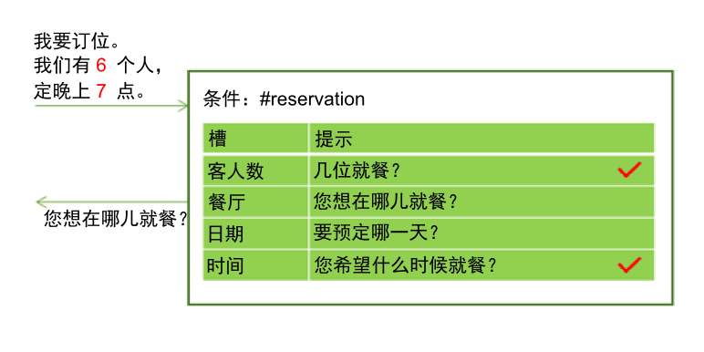
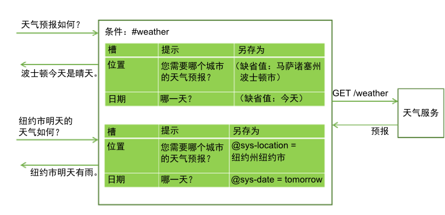
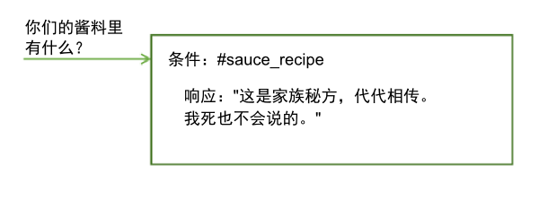

---

copyright:
  years: 2015, 2019
lastupdated: "2019-08-12"

keywords: slot, slots

subcollection: assistant

---

{:shortdesc: .shortdesc}
{:new_window: target="_blank"}
{:deprecated: .deprecated}
{:important: .important}
{:note: .note}
{:tip: .tip}
{:pre: .pre}
{:codeblock: .codeblock}
{:screen: .screen}
{:javascript: .ph data-hd-programlang='javascript'}
{:java: .ph data-hd-programlang='java'}
{:python: .ph data-hd-programlang='python'}
{:swift: .ph data-hd-programlang='swift'}
{:table: .aria-labeledby="caption"}

# 使用槽收集信息
{: #dialog-slots}

向对话节点添加槽可从该节点内的用户那里收集多条信息。槽会按用户的速度收集信息。用户提前提供的详细信息已保存，并且助手仅要求提供满足请求所需的缺少的详细信息。

<iframe class="embed-responsive-item" id="youtubeplayer" title="向节点添加槽" type="text/html" width="640" height="390" src="https://www.youtube.com/embed/kMLyKfmO9wI?rel=0" frameborder="0" webkitallowfullscreen mozallowfullscreen allowfullscreen> </iframe>

## 为什么要添加槽？
{: #dialog-slots-why}

使用槽可获取所需的信息，然后可以准确响应用户。例如，如果用户询问营业时间，但营业时间因门店位置而异，那么在回答用户之前，可询问有关用户计划访问的门店位置的跟进问题。然后，可以添加将提供的位置信息考虑在内的响应条件。



槽可以帮助您收集完成用户复杂任务所需的多条信息，例如晚餐预定。



用户可同时为多个槽提供值。例如，输入可能包含信息：`6 人就餐，晚上 7 点。`这一个输入包含两个缺少的必需值：客人数和预定时间。助手可识别并存储这两个值，每个值都位于其相应的槽中。然后服务会显示与下一个空槽关联的提示。



槽使助手能够回答跟进问题，而无需重新确定用户的目标。例如，用户可能会询问天气预报，然后询问有关其他位置或其他日期天气情况的跟进问题。如果在槽中保存必需的预测变量（例如，位置和日期），那么如果用户使用新的变量值询问跟进问题，就可以使用所提供的新值来覆盖槽值，并给出反映新信息的响应。（有关如何从对话调用外部服务的更多信息，请参阅[从对话节点发起程序化调用](/docs/services/assistant?topic=assistant-dialog-webhooks)）。



使用槽可在用户和助手之间生成更自然的对话流，而且相比尝试使用许多单独的节点来收集信息，也更容易管理。

## 添加槽
{: #dialog-slots-add}

1.  确定要收集的信息单元。例如，要为某人订披萨，您可能希望收集以下信息：

    - 送餐时间
    - 尺寸

1.  如果您尚未开始创建对话，请按照[创建对话](/docs/services/assistant?topic=assistant-dialog-build)中的指示信息来创建对话。

1.  在对话节点编辑视图中，单击**定制**，然后单击**槽**旁边的切换开关以将其**开启**。

    有关**提示提供所有信息**复选框的更多信息，请参阅[一次询问所有信息](#dialog-slots-prompt-for-everything)。

1.  **为每个所需信息单元添加槽**。对于每个槽，请指定以下详细信息：

    - **检查对象**：确定要从用户对槽提示的响应中抽取的信息类型。在大多数情况下，检查实体值。事实上，显示的条件构建器会建议可以检查的实体。但是，还可以检查意向；只需在字段中输入意向名称即可。在此可以使用 AND 和 OR 运算符来定义更复杂的条件。

      *检查对象*值首先用作条件，然后成为在*另存为*字段中指定的上下文变量的值。它指定**要检查的对象**和**要保存的对象**。如果要更改值的保存方式，请将用于重新设置值格式的表达式添加到*检查对象*字段。
      {: important}

      例如，如果实体是模式实体（例如，`@email`），那么在添加实体名称后，请向该名称附加 `.literal`。通过添加 `.literal`，即指示您要捕获的是由用户输入并基于其模式标识为电子邮件地址的确切文本。

      在某些情况下，您可能希望使用表达式来捕获值，但不将表达式应用于保存的内容。在这种情况下，可以使用*检查对象*字段中的一个值来捕获值，然后打开 JSON 编辑器来更改上下文变量的值，这样就可以保存其他内容。

      退出 JSON 编辑器后，在 JSON 编辑器中对槽的上下文变量值进行的任何编辑都不会反映在**检查对象**字段中。在使用 JSON 编辑器编辑值后，如果在任何时间单击**检查对象**字段以使该字段获得焦点，您所做的更改都会丢失。
      {: important}

      避免在*检查对象*字段中检查上下文变量值。因为检查的值也是保存的值，所以在条件中使用上下文变量可能会导致意外的行为。

    - **另存为**：提供上下文变量的名称，以存储用户对槽提示的响应中相关的值。

       不要复用在对话中其他位置使用的上下文变量。如果上下文变量已具有值，那么不会显示槽的提示。仅当槽的上下文变量为空时，才会显示该槽的提示。

    - **提示**：编写语句，以引导用户提供所需的信息。显示此提示后，会话将暂停，助手会等待用户进行响应。

    - 如果希望根据用户在响应初始槽提示时是否提供了您需要的信息，从而显示不同的跟进语句，那么可以编辑槽（通过单击**编辑槽**  图标）并定义跟进语句：

      - **已找到**：在用户提供期望的信息后显示。

      - **找不到**：在用户提供的信息不可理解或未以所需的格式提供时显示。如果成功填充了槽，或者槽处理程序理解并处理了用户输入，那么绝不会显示此语句。

      有关如何针对“已找到”和“找不到”响应定义条件和关联操作的信息，请参阅[向“已找到”和“找不到”响应添加条件](#dialog-slots-handler-next-steps)。

    下表显示了节点的示例槽值，通过收集两条信息（披萨尺寸和送货时间）来帮助用户订购披萨。

    <table>
    <caption>披萨订购的示例槽</caption>
    <tr>
      <th>检查对象</th>
      <th>另存为</th>
      <th>提示</th>
      <th>如果已找到，跟进问题</th>
      <th>如果找不到，跟进问题</th>
    </tr>
    <tr>
      <td>@size</td>
      <td>$size</td>
      <td>您要订多大的披萨？</td>
      <td>那就是$size。</td>
      <td>您要订多大的？我们有小号、中号、大号。</td>
    </tr>
    <tr>
      <td>@sys-time</td>
      <td>$time</td>
      <td>您需要何时送餐？</td>
      <td>送餐时间是$time。</td>
      <td>您希望的送餐时间？备餐时间最短半个小时。</td>
    </tr>
    </table>

1.  **使槽可选或在特定条件下禁用槽**。可以选择以下列方式配置槽：

    - **可选**：要使槽可选，请添加不带提示的槽。助手不会要求用户提供信息，但还是会在用户输入中查找信息，如果用户提供了值，将保存该值。例如，可以添加槽来捕获用户指定的任何饮食禁忌信息。但是，您并不想向所有用户询问饮食信息，因为在大多数情况下这些信息都无关紧要。

       <table>
       <caption>可选槽</caption>
       <tr>
          <th>信息</th>
          <th>检查对象</th>
          <th>另存为</th>
       </tr>
       <tr>
          <td>忌食小麦</td>
          <td>@dietary</td>
          <td>$dietary</td>
      </tr>
      </table>

          如果将槽设置为可选，那么仅在节点级别响应文本中引用其上下文变量（如果可以用文字有意义地表述），即便没有为该槽提供任何值也是如此。例如，可以构造一个类似于以下内容的摘要语句：`我要订一个$size $dietary 的披萨，送餐时间是$time。`不管是否提供饮食禁忌信息（例如，`无谷蛋白`或`不含乳制品`），生成的文本都有意义。结果为：`我要订一个大号无谷蛋白的披萨，送餐时间是下午 3:00。`或`我要订一个大号的披萨，送餐时间是下午 3:00。`
      {: tip}

    - **条件**：如果希望槽仅在特定条件下启用，那么可以向其添加条件。例如，如果槽 1 要求提供会议开始时间，槽 2 捕获会议持续时间，槽 3 捕获结束时间，那么您可能希望仅当未提供槽 2 的值时才启用槽 3（并要求提供会议结束时间）。要使槽有条件，请编辑槽，然后从**更多**  菜单中选择**启用条件**。定义要启用该槽必须满足的条件。

      您能以先前槽中的上下文变量值为条件，因为列出槽的顺序即是对其求值的顺序。但是，请仅以您确信在对此槽求值时将包含值的槽上下文变量为条件。例如，先前的槽必须是必填槽。
    {: tip}
1.  **不让用户跑题**。您可以选择定义槽处理程序，用于对用户在交互期间可能会询问的与节点用途不太相关的问题提供响应。

    例如，用户可能会询问番茄酱配方或配料购自哪里。要处理此类跑题的问题，请单击**管理处理程序**链接，然后为每个预期问题添加条件和响应。

    

    响应跑题的问题后，将显示与当前空槽关联的提示。

    如果用户在对话节点流期间一直到显示节点级别响应之前的任意时间，提供与槽处理程序条件匹配的输入，都会触发此条件。有关使用槽处理程序的更多方式，请参阅[处理请求以退出过程](#dialog-slots-node-level-handler)。
1.  **添加节点级别响应**。填充所有必需槽后，才会执行节点级别的响应。可以添加用于汇总所收集信息的响应。例如，`一个$size 披萨，预计$time 送达。祝您用餐愉快！`

    如果要基于特定条件定义其他响应，请单击**定制**，然后单击**多个响应**切换开关以将其**开启**。有关条件响应的信息，请参阅[条件响应](/docs/services/assistant?topic=assistant-dialog-overview#dialog-overview-multiple)。
1.  **添加用于重置槽上下文变量的逻辑**。从每个槽中收集用户的回答时，这些回答会保存在上下文变量中。可以使用上下文变量将信息传递到其他节点、应用程序或外部服务以供使用。但是，传递信息后，必须将上下文变量设置为空以重置节点，这样该节点才能再次开始收集信息。不能将当前节点中的上下文变量设置为空，因为在填充必需的槽之前，助手不会退出节点。请考虑使用以下某种方法：

    - 将处理添加到将变量设置为空的外部应用程序。
    - 添加将变量设置为空的子节点。
    - 插入将变量设置为空的父节点，然后跳转至使用槽的节点。

试试看！遵循分步[教程](/docs/services/assistant?topic=assistant-tutorial-slots)。

## 槽用法提示
{: #dialog-slots-tips}

以下槽属性可以帮助您检查和设置槽上下文变量的值。

|属性名称|描述|
|------------------------|-------------|
|`all_slots_filled`|仅当已为节点中的所有槽设置所有上下文变量时，才会求值为 true。有关用法示例，请参阅[阻止在不需要时显示“已找到”响应](#dialog-slots-stifle-found-responses)。|
|`event.current_value`|此槽的上下文变量的当前值。有关此属性和 event.previous_value 属性的用法示例，请参阅[替换槽上下文变量值](#dialog-slots-found-handler-event-properties)。|
|`event.previous_value`|此槽的上下文变量的先前值。|
|`has_skipped_slots`|如果处理了任何配置有下一步选项（用于跳过槽）的槽或槽处理程序，那么值为 true。有关槽的下一步选项的更多信息，请参阅[向“已找到”和“找不到”响应添加条件](#slot-handler-next-steps)，有关槽处理程序的下一步选项的信息，请参阅[处理请求以退出过程](#dialog-slots-node-level-handler)。|
|`slot_in_focus`|强制将槽条件仅应用于当前槽。有关更多详细信息，请参阅[获取确认](#dialog-slots-get-confirmation)。|
{: caption="槽属性" caption-side="top"}

请考虑使用以下方法来处理常见任务。

- [一次询问所有信息](#dialog-slots-prompt-for-everything)
- [捕获多个值](#dialog-slots-multiple-entity-values)
- [重新设置值的格式](#dialog-slots-reformat-values)
- [处理零](#dialog-slots-zero)
- [获取确认](#dialog-slots-get-confirmation)
- [替换槽上下文变量值](#dialog-slots-found-handler-event-properties)
- [避免数字混淆](#dialog-slots-avoid-slot-confusion)
- [向“已找到”和“找不到”响应添加条件](#dialog-slots-handler-next-steps)
- [多次失败尝试后离开](#dialog-slots-stop-trying-after-3)
- [阻止在不需要时显示“已找到”响应](#dialog-slots-stifle-found-responses)
- [处理请求以退出过程](#dialog-slots-node-level-handler)

### 一次询问所有信息
{: #dialog-slots-prompt-for-everything}

包括整个节点的初始提示，以明确告诉用户您希望他们提供哪些信息单元。显示此提示首先使用户有机会一次提供所有详细信息，而不必等待提示，一次提供一条信息。

例如，由于客户要订购披萨而触发节点时，可以通过初步提示进行响应：`可以接单。请问您要多大的披萨，希望几点送餐。`

如果用户在其初始请求中提供了哪怕是此信息的一部分，就不会再显示此提示。例如，初始输入可能是：`我要订一个大号披萨。`助手分析输入时，会将`大号`识别为披萨的尺寸，并使用提供的值填充**尺寸**槽。由于其中一个槽已填充，因此服务将跳过显示初始提示，以避免再次询问披萨尺寸信息。它会改为显示其余所有缺少信息的槽的提示。

在启用了“槽”功能的“定制”窗格中，选中**提示提供所有信息**复选框以启用初始提示。此设置会向节点添加**如果未预填充任何槽，请首先询问此问题**字段，在其中可以指定提示用户提供所有信息的文本。

### 捕获多个值
{: #dialog-slots-multiple-entity-values}

可以要求提供项列表，并将其保存在一个槽中。

例如，您可能希望询问用户是否要在披萨上加馅料。为此，请定义实体 (@topping) 及其接受的值（洋葱胡椒、奶酪、蘑菇等等）。添加一个槽，用于向用户询问有关馅料的问题。使用该实体类型的值属性来捕获多个值（如果提供）。

<table>
<caption>多值槽</caption>
<tr>
  <th>检查对象</th>
  <th>另存为</th>
  <th>提示</th>
  <th>如果已找到，跟进问题</th>
  <th>如果找不到，跟进问题</th>
</tr>
<tr>
  <td>@toppings.values</td>
  <td>$toppings</td>
  <td>要加馅料吗？</td>
  <td>很不错的馅料。</td>
  <td>要加哪种馅料？我们有...</td>
</tr>
</table>

要稍后引用用户指定的馅料，请使用 `<? $entity-name.join(',') ?>` 语法，以列出馅料数组中的每个项，并使用逗号分隔各值。例如，`我要订一个$size披萨，加<? $toppings.join(',') ?>，送达时间 $time。`

### 重新设置值的格式
{: #dialog-slots-reformat-values}

由于您会要求用户提供信息，并且需要在响应中引用其输入，因此请考虑重新设置值的格式，以便可以使用更友好的格式来显示这些值。

例如，时间值以 `hh:mm:ss` 格式保存。可以使用 JSON 编辑器来设置在槽保存时间值时重新设置值的格式，使其改为使用 `hour:minutes AM/PM` 格式：

```json
{
      "context":{
      "time": "<? @sys-time.reformatDateTime('h:mm a') ?>"
  }
}
```
{: codeblock}

有关其他重新设置格式的构想，请参阅[表达式语言方法](/docs/services/assistant?topic=assistant-dialog-methods)。

### 处理零
{: #dialog-slots-zero}

在槽条件中使用 `@sys-number` 有助于捕获用户在其输入中指定的任何数字。但是，当用户指定的数字为零 (0) 时，此条件的行为与预期不符。此条件不会将零作为有效数字进行处理，而是会求值为 false，并且助手将再次提示用户输入数字。为了避免此行为，请检查槽条件中是否有大于或等于零的 `@sys-number` 提及项。

要确保用于检查数字提及项的槽条件正确处理零，请完成以下步骤：

1.  将 `@sys-number >= 0` 添加到槽条件字段，然后提供上下文变量名称和文本提示。
    
    在输入中检查的内容也是槽上下文变量中保存的内容。但是，在本例中，您只希望保存数字（如 `5`）。您并不希望保存 `5 > = 0`。要更改保存的内容，必须编辑上下文变量的值。

1.  通过单击**编辑槽**  图标，重新打开该槽进行编辑。从**选项**  菜单中，打开 JSON 编辑器。

1.  更改上下文变量值。

    值将类似于以下内容：

    ```json
    {
      "context": {
   "number": "@sys-number >= 0"
      }
    }
    ```
    {: codeblock}

    将其更改为类似于以下内容：

    ```json
    {
      "context": {
   "number":"@sys-number"
      }
    }
    ```
    {: codeblock}

1.  保存更改。 

对上下文变量值所做的更改不会反映在“检查对象”字段中，这是正确的行为。不要编辑“检查对象”字段的值，甚至不要在该字段中单击。否则，对 JSON 进行的更改将丢失。
{: tip}

如果您不希望接受 0 作为数字值，那么可以为槽添加条件响应以用于检查是否存在 0，并指示用户必须提供大于零的数字。但是，务必注意的是，将槽条件作为输入提供时，它必须能够识别 0。

### 获取确认
{: #dialog-slots-get-confirmation}

在其他槽后面添加一个槽，用于要求用户确认所收集的信息是否准确且完整。该槽可以查找与 #yes 或 #no 意向相匹配的响应。

<table>
<caption>确认槽</caption>
<tr>
  <th>检查对象</th>
  <th>另存为</th>
  <th>提示</th>
  <th>如果已找到，跟进问题</th>
  <th>如果找不到，跟进问题</th>
</tr>
<tr>
  <td>#yes || #no</td>
  <td>$confirmation</td>
  <td>我会为您订一个`$size`披萨，送餐时间是`$time`。可以下单了吗？</td>
  <td>您的披萨已接单！</td>
  <td>请参阅*复杂响应*</td>
</tr>
</table>

**复杂响应**：由于用户可能在对话期间的其他时间包含肯定或否定的语句（*对，我希望披萨下午 5 点送到*或*今晚没其他客人，就订小号吧*），因此请使用 `slot_in_socus` 属性以在槽条件中明确您查找的仅仅是对此槽的提示做出的“是”或“否”响应。

```json
(#yes || #no) && slot_in_focus
```
{: codeblock}

`slot_in_focus` 属性始终求值为布尔值（true 或 false）。请仅将其包含在需要布尔结果的条件中。例如，不要在检查实体类型，然后保存实体值的槽条件中使用此属性。
{: tip}

在**找不到**提示中，澄清您希望用户提供“是”或“否”回答。

```json
{
  "output":{
                "text": {
      "values": [
        "回答“是”指示您希望按原样下订单，回答“否”指示您不希望按原样下单。"
      ]
    }
  }
}
```
{: codeblock}

在**已找到**提示中，添加一个条件，用于检查“否”响应 (#no)。找到时，从头开始要求提供信息，并重置先前保存的上下文变量。

```json
{
  "conditions": "#no",
  "output":{
    "text": {
      "values": [
        "我们再试一下吧。请问您要多大的披萨，希望的送餐时间是..."
      ]
    }
  },
  "context":{
    "size": null,
    "time": null,
    "confirmation": null
  }
}
```
{: codeblock}

### 替换槽上下文变量值
{: #dialog-slots-found-handler-event-properties}

如果节点有槽，而用户在退出该节点之前为槽提供了新值，那么新值会保存在槽上下文变量中，并替换先前指定的值。对话可以使用为“已找到”条件定义的特殊属性来明确确认已发生此替换：

- `event.previous_value`：此槽的上下文变量的先前值。
- `event.current_value`：此槽的上下文变量的当前值。

例如，对话询问预订航班的目的地城市。用户提供了`巴黎`。您将 $destination 槽上下文变量设置为*巴黎*。然后，用户说`等一下。我要改成飞马德里。`如果按如下所示设置了“已找到”条件，那么对话就可以正常处理此类型的更改。

用户响应后，如果已找到 @destination：

```json
条件：(event.previous_value != null) &&
           (event.previous_value != event.current_value)
    响应：好，更新目的地，
    <? event.previous_value ?>改为 <? event.current_value ?>。
响应：好，目的地是$destination。
```
{: codeblock}

通过此槽配置，对话能够对用户的目的地更改做出反应，回答：`好，更新目的地，巴黎改为马德里。`

### 避免槽填充混淆
{: #dialog-slots-avoid-slot-confusion}

对用户输入求值时，仅填充第一个槽条件与其匹配的槽。测试错误解释是否由以下可能的原因而导致，并予以解决：

- **问题**：同一实体在多个槽中使用。 

    例如，`@sys-date` 用于在一个槽中捕获出发日期，在另一个槽中捕获到达日期。

    **解决方案**：使用槽“已找到”条件与用户澄清要在槽中保存的日期，然后再进行保存。

- **问题**：词汇完全或部分与多个槽条件中的实体相匹配。

    例如，如果一个槽使用类似 `GR1234` 的语法来捕获产品标识 (`@id`)，另一个槽捕获数字 (`@number`)，例如 `1234`，那么包含标识（例如，`BR3344`）的用户输入可能会被 `@number` 槽声明为数字引用，并使用 `3344` 来填充 `$number` 上下文变量。

    **解决方案**：在槽列表中，使具有用于捕获较长模式 (@id) 的实体条件的槽的放置位置高于具有用于捕获较短模式 (@number) 的条件的槽。

- **问题**：词汇被识别为多种系统实体类型。

    例如，如果用户输入 *5 月 2 日*，那么助手会识别到 `@sys-date` (2017-05-02) 和 `@sys-number` (2) 实体。

    **解决方案**：在槽功能所独有的逻辑中，当在单个用户输入中识别到两个系统实体时，将使用其中一个具有较大范围的实体。因此，尽管助手在文本中识别到两个系统实体，也只会注册范围较长（`@sys-date` 为 `2017-05-02`）的系统实体并将其应用于槽。

    如果使用的是已修改的系统实体，那么此变通方法不是必需的。对于更新的实体，日期引用仅被视为 `@sys-date` 提及项，不会还被视为 `@sys-number` 提及项。有关更多详细信息，请参阅[新系统实体](/docs/services/assistant?topic=assistant-beta-system-entities)。
  {: note}

### 向“已找到”和“找不到”响应添加条件
{: #dialog-slots-handler-next-steps}

对于每个槽，可以使用具有关联操作的条件响应来帮助您从用户那里提取所需的信息。为此，请执行以下步骤：

1.  针对要向其添加条件“已找到”和“找不到”响应的槽，单击其**编辑槽**  图标。
1.  从**更多**  菜单中，选择**启用条件响应**。
1.  输入条件和满足条件时显示的响应。

    **“已找到”示例**：该槽需要的是晚餐预订时间。您可在*检查对象*字段中使用 @sys-time 来捕获此信息。为了防止保存无效时间，可以添加一个条件响应，用于检查提供的时间是否早于餐厅的最晚接待时间，例如 `@sys-time.after('21:00:00')`。相应的响应可能类似于：*我们的最晚接待时间是晚上 9 点。*

    **“找不到”示例**：该槽需要的是 @location 实体，该实体接受餐厅连锁店在其中开设餐厅的一组特定城市。“找不到”条件可检查 @sys-location，以确定是否出现用户指定了有效城市，但连锁店在该城市没有开设餐厅的情况。相应的响应可能是：*那里没有我们的餐厅。*

1.  如果要定制在满足条件后接下来发生的情况，请单击**编辑响应**  图标。

    对于“已找到”响应（在用户提供的值与“检查对象”字段中指定的值类型相匹配时显示），可以选择下列其中一个操作来接着执行：

      - **离开（缺省）**：指示助手在显示响应后移至下一个空槽。在关联的响应中，使用户确信其输入已得到理解。例如，*好。您要安排在 $date。*
      - **清除槽并再次提示**：如果在*检查对象*字段中使用可能选取错误值的实体，请添加条件来捕获任何可能的错误解释，然后使用此操作来清除当前槽值并提示提供正确的值。
      - **跳至响应**：如果您在满足定义的条件后不再需要填充此节点中的任何其余槽，请选择此操作以跳过其余槽，并直接转至下一个节点级别的响应。例如，可以添加一个条件，用于检查用户的年龄是否未满 16 岁。如果是，可以跳过用于询问用户驾驶记录相关问题的其余槽。

    对于“找不到”响应（用户未提供有效值时显示），可以选择下列其中一个操作来执行：

      - **等待用户输入（缺省）**：暂停会话，并且助手会等待用户进行响应。在最简单的情况下，此处指定的文本可以更明确地声明您需要用户提供的信息类型。如果对条件响应使用此操作，请确保在表述条件响应时明确声明用户的回答哪里有误，以及您期望他们改为提供哪些内容。
      - **再次提示**：在显示“找不到”响应后，助手会再次重复槽提示，并等待用户响应。如果对条件响应使用此操作，那么响应可以仅仅说明用户提供的回答哪里有误。但不需要重申您希望用户提供的信息类型，因为槽提示通常会说明这一点。

        如果选择此选项，请考虑添加“找不到”响应的至少一个变体，以便用户不会多次看到完全相同的文本。借此机会可使用不同的措辞向用户解释您需要他们提供哪些信息以及以何种格式提供。
        {: tip}

      - **跳过此槽**：指示助手停止尝试填充当前槽，而改为移至下一个空槽的提示。如果您希望使槽可选，并在该槽中显示提示以要求用户输入信息，那么此选项很有用。例如，您可能有 @seating 实体，用于捕获餐厅座位偏好，例如*室外*、*靠近壁炉*、*包厢*等。您可以添加一个槽，通过“*您是否有任何座位偏好？*”来提示用户，然后检查 `@seating.values`。如果提供了有效的响应，它会将偏好信息保存到 `$seating_preferences`。但是，通过选择此操作作为“找不到”响应的下一步，可指示助手在用户没有为其提供有效值的情况下停止尝试填充此槽。
      - **跳至响应**：如果您在满足定义的条件后不再需要填充此节点中的任何其余槽，请选择此操作以跳过其余槽，并直接转至下一个节点级别的响应。例如，如果在捕获单程航班信息后，槽提示是“*要购买往返票吗？*”，那么“找不到”条件可以检查 #No。如果找到 #No，将使用此选项来跳过用于捕获返程航班信息的其余槽，而改为直接转至节点级别的响应。

    单击**返回**以返回到槽的编辑视图。
1.  要添加其他条件响应，请单击**添加响应**，然后输入条件和满足条件时要显示的响应。

    确保添加至少一个将在任何情况下显示的响应。对于这一万能型响应，您可以使条件字段保留空白。服务会自动使用 `true` 特殊条件来填充空白条件字段。

1.  单击**保存**以保存更改，关闭槽的编辑视图，并返回到节点的编辑视图。

### 多次失败尝试后离开
{: #dialog-slots-stop-trying-after-3}

您可以使用“找不到”条件响应，让用户在多次尝试后仍然无法正确回答问题时退出槽。在万能型响应中，打开 JSON 编辑器以添加计数器上下文变量，该变量将跟踪“找不到”响应的返回次数。在较早的节点中，请确保将初始计数器上下文变量值设置为 0。

在此示例中，助手要求提供披萨尺寸。服务在用户错误回答该问题 3 次后，会将尺寸（中号）应用于用户的该变量。（您可以包含确认槽，在要求用户确认订单信息时，用户始终可以在该槽中更正尺寸。）

检查对象：@size
另存为：$size
“找不到”万能型条件：

```json
{
  "output": {
    "text": {
      "values": [
        "您要订多大的？我们有小号、中号、大号的。"],
      "selection_policy": "sequential"
    }
  },
"context": {
   "counter": "<? context['counter'] + 1 ?>"
  }
}
```
{: codeblock}

要在 3 次尝试后以不同方式进行响应，请添加类似于以下内容的另一个“找不到”条件：
```json
{
  "conditions": "$counter > 1",
  "output": {
    "text": {
      "values": [
        "我们将为您订购中号披萨。"
      ]
    }
  },
"context": {
   "size": "medium"
  }
  ```
  {: codeblock}

此“找不到”条件比“找不到”万能型条件（缺省值为 `true`）更精确。因此，您必须移动此响应，使其位于原始条件响应之前，否则此响应将永远不会触发。选择条件响应并使用向上箭头将其上移。

### 阻止在不需要时显示“已找到”响应
{: #dialog-slots-stifle-found-responses}

如果为多个槽指定“已找到”响应，那么当用户同时为多个槽提供值时，将显示至少一个槽的“已找到”响应。您可能希望返回所有这些槽的“已找到”响应，或者不返回任何“已找到”响应。

要阻止显示“已找到”响应，可以对每个“已找到”响应执行以下某项操作：

- 向响应添加条件，以阻止其在填充特定槽时显示。例如，可以添加条件，如 `!($size && $time)`，这将在同时提供了 $size 和 $time 上下文变量时，阻止显示响应。
- 将 `!all_slots_filled` 条件添加到响应。如果填充了所有槽，那么此设置将阻止显示响应。如果要包含确认槽，请不要使用此方法。确认槽也是一个槽，您通常希望在填充确认槽本身之前，阻止显示“已找到”响应。

### 处理请求以退出过程
{: #dialog-slots-node-level-handler}

添加至少一个槽处理程序，用于识别用户要退出节点的情况。

例如，在收集信息以安排宠物美容预约的节点中，可以添加一个以 #cancel 意向为条件的处理程序，此处理程序会识别诸如“算了，我改变主意了。”之类的话语。

1.  在处理程序的 JSON 编辑器中，使用哑元值填充所有槽上下文变量，以阻止节点继续要求提供任何缺少的信息。此外，在处理程序响应中，添加一条消息，例如：`好，停止预约。我们不会为您安排预约。`
1.  从以下选项中选择希望助手执行的下一个操作：

    - **再次提示（缺省）**：显示在用户提出跑题问题之前正在处理的槽的提示。
    - **跳过当前槽**：显示与用户提出跑题问题之前正在处理的槽后面的槽关联的提示。助手不会进一步尝试填充跳过的槽。
    - **跳至响应**：跳过其余所有空槽的提示，包括在用户提出跑题问题之前正在处理的槽。

1.  在节点级别响应中，添加一个条件，用于检查其中一个槽上下文变量中是否有哑元值。如果找到哑元值，将显示最终消息，例如：`如果您决定稍后再预约，我随时恭候。`如果找不到哑元值，那么将显示该节点的标准摘要消息，例如：`我会为您安排$animal的美容预约，时间是 $date $time。`

下面是为披萨示例定义处理程序的 JSON 样本。请注意，如前所述，上下文变量全部都设置为哑元值。实际上，`$size` 上下文变量设置为 `dummy`。此 $size 值触发节点级别的响应，以显示相应的消息并退出槽节点。

```json
{
"conditions": "#cancel",
 "output": {
   "text": {
     "values": [
       "好，停止预约。我们不会为您安排披萨送货。"
     ],
    "selection_policy": "sequential"
    }
  },
"context": {
   "time": "12:00:00",
   "size": "dummy",
   "confirmation":"true"
}
}
```
{: codeblock}

**重要信息**：考虑在此条件之前求值的条件中所使用的逻辑，以便您可以构建不同的条件。收到用户输入时，将按以下顺序对条件求值：

- 当前槽级别“已找到”条件。
- 槽处理程序，按其列出顺序执行。
- 如果允许离题，那么将检查根级别节点条件是否有匹配项（对话树根或根文件夹中的最后一个`其他任何内容`节点除外）。
- 当前槽级别“找不到”条件。
- 最后一个`其他任何内容`节点条件。

将始终求值为 true 的条件（例如，特殊条件 `true` 或 `anything_else`）添加为槽处理程序时务必谨慎。对于每个槽，如果槽处理程序求值为 true，那么将完全跳过“找不到”条件。因此，使用始终求值为 true 的槽处理程序实际上会阻止对每个槽的“找不到”条件求值。
{: tip}

例如，您为除猫以外的其他所有动物提供美容服务。对于“动物”槽，可尝试使用以下槽条件来阻止`猫`保存在“动物”槽中：

```json
检查 @animal && !@animal:cat，然后将其保存为 $animal。
```
{: codeblock}

为了让用户知道您不接受猫，可以在“动物”槽的“找不到”条件中指定以下值：

```json
如果 @animal:cat，那么显示“对不起，我们不为猫咪美容。”
```
{: codeblock}

如果还定义了 #exit 槽处理程序，那么当提供了条件求值顺序时，有可能从来都不会触发此“找不到”条件，这也是合乎逻辑的。可以改为使用以下槽条件：

```json
检查 @animal，然后另存为 $animal。
```
{: codeblock}

为了处理可能的`猫`响应，请将此值添加到“已找到”条件：

```json
如果 @animal:cat，那么显示“对不起，我们不为猫咪美容。”
```
{: codeblock}

在 JSON 编辑器中，为“已找到”条件重置 $animal 上下文变量的值，因为该变量当前设置为猫，这是不应该的设置。

```json
{
  "output":{
                "text": {
      "values": [
        "对不起，我们不为猫咪美容。"
      ]
    }
  },
  "context":{
    "animal": null
  }
}
```
{: codeblock}

## 槽示例
{: #dialog-slots-examples}

要访问实现不同常用槽使用方案的 JSON 文件，请转至 GitHub 中的社区 [conversation repo ](https://github.com/watson-developer-cloud/community/tree/master/watson-assistant){: new_window}。

要探索示例，请下载某个示例 JSON 文件，然后将其作为新的对话技能导入。在“对话”选项卡中，可以查看对话节点以了解如何实现槽来解决不同用例。
