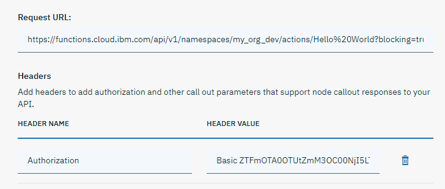

---

copyright:
  years: 2015, 2019
lastupdated: "2019-08-09"

---

{:shortdesc: .shortdesc}
{:new_window: target="_blank"}
{:deprecated: .deprecated}
{:important: .important}
{:note: .note}
{:tip: .tip}
{:pre: .pre}
{:codeblock: .codeblock}
{:screen: .screen}
{:javascript: .ph data-hd-programlang='javascript'}
{:java: .ph data-hd-programlang='java'}
{:python: .ph data-hd-programlang='python'}
{:swift: .ph data-hd-programlang='swift'}

# 从对话节点发起程序化调用
{: #dialog-webhooks}

要发起程序化调用，请定义 Webhook 以用于将 POST 请求调出发送到执行程序化功能的外部应用程序。然后，可以从一个或多个对话节点调用该 Webhook。

Webhook 是一种机制，允许您根据程序中发生的情况调出到外部程序。在对话技能中使用 Webhook 时，如果助手处理的是启用了 Webhook 的节点，那么会触发 Webhook。Webhook 会收集指定的数据或在会话期间从用户那里收集的数据，并将其保存在上下文变量中。Webhook 将这些数据作为 HTTP POST 请求的一部分发送到在 Webhook 定义中指定的 URL。接收 Webhook 的 URL 是侦听器。该 URL 如 Webhook 定义中所指定，使用传递给它的信息来执行预定义操作，并且可以选择返回响应。

观看此视频以了解更多信息。

<iframe class="embed-responsive-item" id="youtubeplayer" title="Webhook 演示" type="text/html" width="640" height="390" src="https://www.youtube.com/embed/j8TBqD2rx2o?rel=0" frameborder="0" webkitallowfullscreen mozallowfullscreen allowfullscreen> </iframe>

可以使用 Webhook 来执行以下类型的操作：

- 验证从用户那里收集的信息。
- 与外部 Web 服务进行交互以获取信息。例如，可以根据空中交通服务查看某个航班的预期到达时间，或者根据天气服务获取天气预报。
- 向外部应用程序（例如，餐馆预订站点）发送请求，以代表用户完成简单的交易。
- 触发 SMS 通知。
- 触发 {{site.data.keyword.openwhisk}} Web 操作。

不能使用 Webhook 来调用使用基于令牌的 Identity and Access Management (IAM) 认证的 {{site.data.keyword.openwhisk_short}} 操作。
{: note}

有关如何调用客户机应用程序的信息，请参阅[从对话节点调用客户机应用程序](/docs/services/assistant?topic=assistant-dialog-actions-client)。

## 定义 Webhook
{: #dialog-webhooks-create}

可以为对话技能定义一个 Webhook URL，然后从一个或多个对话节点调用该 Webhook。

对外部服务的程序化调用必须满足以下需求：

- 调用必须是 POST HTTP 请求。
- 请求和响应的格式必须为 JSON。例如：`Content-Type: application/json`。
- 调用必须在 **5 秒内**返回。

  对于需要调用的效率较低的服务，可以通过客户机应用程序来管理调用，并作为单独的步骤将相应信息传递给对话。有关更多信息，请参阅[从对话节点调用客户机应用程序](/docs/services/assistant?topic=assistant-dialog-actions-client)。
  {: tip}

要添加 Webhook 详细信息，请完成以下步骤：

1.  在要添加 Webhook 的技能中，单击**选项**选项卡。

1.  单击 **Webhook**。

1.  在 **URL** 字段中，添加要向其发送 HTTP POST 请求调出的外部应用程序的 URL。

    例如，要调用 Language Translator 服务，请指定服务实例的 URL。

    ```bash
    https://gateway.watsonplatform.net/language-translator/api/v3/translate?version=2018-05-01
    ```
    {: codeblock}

    调用的外部应用程序返回响应时，必须能够发回 JSON 格式的响应。例如，对于 Language Translator 服务，必须指定要返回的结果的格式。可以通过将头传递给服务来完成此操作。

1.  在“头”部分中，通过单击**添加头**来添加要传递给服务的任何头，一次添加一个头。

    例如，添加头以指示希望生成的值以 JSON 格式返回。

    <table>
    <caption>头示例</caption>
      <tr>
      <th>头名称</th>
      <th>头值</th>
      </tr>
      <tr>
      <td>Content-Type</td>
      <td>application/json</td>
      </tr>
    </table>
    
1.  如果外部服务要求您在请求中传递基本认证凭证，请提供这些凭证。单击**添加授权**，将凭证添加到**用户名**和**密码**字段，然后单击**保存**。 

    产品将根据凭证创建 Base64 编码的 ASCII 字符串，生成头并将其添加到页面。 

    <table>
    <caption>头示例</caption>
      <tr>
      <th>头名称</th>
      <th>头值</th>
      </tr>
      <tr>
      <td>Authorization</td>
      <td>Basic `<encoded-api-key>`</td>
      </tr>
    </table>
    
    对于测试目的，可以提交基于基本认证的 API 密钥。单击**添加授权**，然后将 `apikey` 添加到**用户名**字段，并将 API 密钥值粘贴到**密码**字段中。单击**保存**。
    {: tip}

这将自动保存 Webhook 详细信息。

## 向对话节点添加 Webhook 调出
{: #dialog-webhooks-dialog-node-callout}

要从对话节点使用 Webhook，必须在节点上启用 Webhook，然后添加调出的详细信息。

1.  单击**对话**选项卡。

1.  找到要在其中添加调出的对话节点。每当在与用户的会话期间触发此节点时，都将调出到 Webhook。

    例如，您可能希望从 `#General_Greetings` 节点向 Webhook 发送调出。

1.  单击以打开对话节点，然后单击**定制**。

1.  向下滚动到 *Webhook* 部分，将相应的切换控件切换到**开启**，然后单击**应用**。

    如果尚未启用*多个条件响应*设置，系统会自动将此设置切换到开启，并且您无法将其禁用。启用此设置是为了支持添加根据 Webhook 调用成功或失败而执行的不同响应。如果已为节点指定响应，那么这将成为第一个条件响应。
    {: note}

1.  在*参数*部分中，添加要作为键值对传递到外部应用程序的任何数据。

    例如，如果要调用 Language Translator 服务，那么必须为以下参数提供值：

    <table>
    <caption>参数示例</caption>
      <tr>
        <th>键</th>
        <th>值</th>
        <th>描述</th>
      </tr>
      <tr>
        <td>model_id</td>
        <td>"en-es"</td>
        <th>标识输入和输出语言。在此示例中，请求是将英语 (en) 文本翻译为西班牙语 (es)。</th>
      </tr>
      <tr>
        <td>text          </td>
        <td>"How are you?"</td>
        <th>此参数包含您希望服务翻译的文本字符串。可以对此值进行硬编码，传递上下文变量（例如 $saved_text），或通过将 `<? input.text ?>` 指定为此值，直接将用户输入传递到服务。</th>
      </tr>
    </table>

    在更复杂的用例中，您可能会在会话期间收集用户的信息，例如有关用户旅行计划的信息。可以收集日期和目的地信息，并将其保存在上下文变量中，以便可以作为参数传递到外部应用程序。

    <table>
    <caption>旅行参数示例</caption>
      <tr>
        <th>键</th>
        <th>值</th>
      </tr>
      <tr>
        <td>depart_date</td>
        <td>$departure</td>
      </tr>
    <tr>
        <td>arrive_date</td>
        <td>$arrival</td>
      </tr>
    <tr>
        <td>origin</td>
        <td>$origin</td>
      </tr>
    <tr>
        <td>destination</td>
        <td>$destination</td>
      </tr>
    </table>

1.  调出所做的任何响应都会保存到返回变量。可以对自动添加到**返回变量**字段的变量重命名。如果调出生成错误，那么此变量会设置为 `null`。

    生成的变量名称的语法为 `webhook_result_n`，其中每次向对话节点添加 Webhook 调出时，附加的 `_n` 都会递增。此命名约定可确保上下文变量名称在整个对话技能中唯一。如果更改名称，请确保使用唯一名称。

1.  在条件响应部分中，会自动添加两个响应条件，一个响应在 Webhook 调出成功时显示，并会发回一个返回变量。另一个响应在调出失败时显示。可以编辑这些响应，也可向节点添加更多条件响应。

    如果调出返回响应，并且您知道 JSON 响应的格式，那么可以编辑对话节点响应以仅包含要与用户共享的响应部分。 
    
    例如，Language Translator 服务会返回类似如下的对象：
    
    ```json
       {
       "translations":[
          {"translation":"¿Cómo estás?"}
       ],
       "word_count":3,
       "character_count":12
       }
    ```
    {: codeblock}
    
    使用 SpEL 表达式以仅抽取译文值。

    <table>
    <caption>条件响应示例</caption>
      <tr>
        <th>条件</th>
        <th>响应</th>
      </tr>
      <tr>
        <td>$webhook_result_1</td>
        <td>翻译后的西班牙语文字为：<? $webhook_result_1.translations[0].translation ?>。</td>
      </tr>
      <tr>
        <td>anything_else</td>
        <td>调用外部应用程序失败。请稍后重试。</td>
      </tr>
    </table>

    如果将建议的格式用于响应，并且返回了先前显示的翻译响应，那么助手对用户的响应将为：`翻译后的西班牙语文字为：¿Cómo estás?`

1.  完成后，单击 X 以关闭节点。这将自动保存您的更改。

## 测试 Webhook
{: #dialog-webhooks-test}

首次添加 Webhook 调出时，查看外部应用程序的响应中返回的确切内容、数据及其格式会很有用。为此，请将表达式 `$webhook_result_n` 添加为成功调出条件响应的文本响应，其中 `n` 是要测试的 Webhook 的相应编号。

此响应会将返回变量的完整主体返回，因此您可以查看调出所发回的内容，并决定要与用户共享的内容。然后，可以使用[表达式语言方法](/docs/services/assistant?topic=assistant-dialog-methods)中记录的方法从响应中仅抽取您关注的信息。

测试某些用户输入是否会在调出中生成错误，并构建处理这些情况的方式。外部应用程序生成的错误会存储在 `output.webhook_error.<result_variable>` 中。在进行测试以捕获此类错误时，可以使用类似下面的条件响应：

|条件|响应|
|-----------|----------|
|output.webhook_error|调出生成了以下错误：<? output.webhook_error.webhook_result_1 ?>。|

例如，您可能没有正确认证请求 (401)，或者可能尝试使用已由外部应用程序使用的名称来传递参数。部署 Webhook 之前，请测试 Webhook 以发现并修正这些类型的错误。

## 除去 Webhook
{: #dialog-webhooks-delete}

如果您决定不希望从对话节点发出 Webhook 调用，请打开节点的*定制*页面，然后将 Webhook 切换为**关闭**。

这将从对话节点编辑器中除去*参数*部分和**返回变量**字段。但是，仍会保留为您添加或您自己添加的任何条件响应。

*多个条件响应*部分又将变为可编辑。您可以选择关闭此功能。如果您这样做，那么只有第一个条件响应会保存为节点的唯一文本响应。

要更改从对话节点调用的外部服务，请编辑**选项**选项卡的 Webhook 页面上定义的 Webhook 详细信息。如果新服务期望向其传递不同的参数，请确保更新调用该服务的所有对话节点。

## 调用 IBM Cloud Functions
{: #dialog-webhooks-cf}

您将编写 Webhook URL，并根据是调用标准操作还是 Web 操作，以不同方式提供头。

### 调用 Web 操作
{: #dialog-webhooks-cf-web-action}

以下技巧将帮助您从对话调用 {{site.data.keyword.openwhisk_short}} Web 操作。 

1.  打开技能的**选项**页面，然后单击 **Webhook**。

1.  在 **URL** 字段中，添加要向其发送 HTTP POST 请求调出的外部应用程序的 URL。

    例如，要调用 {{site.data.keyword.openwhisk_short}} Web 操作，请指定公共 Web 操作的 URL。例如：

    ```bash
    https://us-south.functions.cloud.ibm.com/api/v1/web/my_org_dev/default/Hello%20World.json
    ```
    {: codeblock}

    调用的外部应用程序返回响应时，必须能够发回 JSON 格式的响应。

    请注意，此示例中的请求 URL 以 `.json` 结尾。通过指定此扩展，可以利用 Web 操作的功能来指定响应的所需内容类型。指定此扩展类型可确保在 Web 操作能以多种格式返回响应时，返回 JSON 响应。有关更多详细信息，请参阅[额外功能](/docs/openwhisk?topic=cloud-functions-actions_web#actions_web_extra){: new_window}。
    {: tip}

1.  您无需添加任何头。

    无需认证 {{site.data.keyword.openwhisk_short}} Web 操作，因此您不必定义 Authorization 头。

    这将自动保存 Webhook 详细信息。

1.  单击**对话**选项卡。

1.  单击以打开要从中调用 Web 操作的对话节点，然后单击**定制**。

1.  向下滚动到 *Webhook* 部分，将相应的切换控件切换到**开启**，然后单击**应用**。

1.  在*参数*部分中，添加要作为键值对传递到外部应用程序的任何数据。

    例如，如果调用 Hello World {{site.data.keyword.openwhisk_short}} Web 操作，那么您可能希望添加以下信息以在该应用程序接受的消息参数中进行传递：

    <table>
    <caption>参数示例</caption>
      <tr>
        <th>键</th>
        <th>值</th>
      </tr>
      <tr>
        <td>message</td>
        <td>"hello"</td>
      </tr>
    </table>

    调用 {{site.data.keyword.openwhisk_short}} Web 操作时，传递的参数具有的键不能与 Web 操作中定义的参数相同。有关更多详细信息，请参阅[受保护参数](/docs/openwhisk?topic=cloud-functions-actions_web#actions_web_protect){: new_window}。
    {: note}

1.  可以编辑对话节点响应，以仅包含要向用户显示的响应部分。 

    Hello World {{site.data.keyword.openwhisk_short}} Web 操作在其响应中包含消息名称和值对以及其他信息。要仅显示消息的内容，可以使用 `<return-variable>.message` 语法以仅从响应对象中抽取消息部分。

    <table>
    <caption>条件响应示例</caption>
      <tr>
        <th>条件</th>
        <th>响应</th>
      </tr>
      <tr>
        <td>$webhook_result_1</td>
        <td>应用程序返回了“$webhook_result_1.message”。</td>
      </tr>
      <tr>
        <td>anything_else</td>
        <td>调用外部应用程序失败。请稍后重试。</td>
      </tr>
    </table>

1.  完成后，单击 X 以关闭节点。这将自动保存您的更改。

### 调用标准操作
{: #dialog-webhooks-cf-action}

可以调用 Cloud Foundry 管理的操作，但不能调用使用基于令牌的 Identity and Access Management (IAM) 认证的操作。

{{site.data.keyword.openwhisk_short}} 操作同时支持同步或异步调用。但是，不能使用 Webhook 对 {{site.data.keyword.openwhisk_short}} 操作发起异步调用。发送异步请求时，仅会返回激活标识。

要对 Cloud Foundry 管理的 {{site.data.keyword.openwhisk_short}} 操作发起同步调用，请完成以下步骤：

1.  在要添加 Webhook 的技能中，单击**选项**选项卡。

1.  单击 **Webhook**。

1.  在 **URL** 字段中，指定操作的 URL。 

    将 `?blocking=true` 参数附加到操作 URL 以强制发起同步调用。

    以下语法将发送同步请求：

    ```bash
    https://us-south.functions.cloud.ibm.com/api/v1/namespaces/my_org_dev/actions/Hello%20World?blocking=true
    ```
    {: codeblock}

    调用操作时，必须提供与操作关联的 API 密钥作为头，这将在下一步中进行描述。

1.  在请求中提供授权详细信息。

    要调用 Cloud Foundry 管理的 {{site.data.keyword.openwhisk_short}} 操作，请完成以下步骤：

    1.  获取 API 密钥。在 {{site.data.keyword.openwhisk_short}} 端点页面中，找到 CURL 部分，然后单击“眼睛”图标以显示密钥详细信息。复制 curl 命令中 `-u` 参数后列出的 `user ID:password` 密钥。
    
    1.  单击**添加授权**，将凭证添加到**用户名**和**密码**字段，然后单击**保存**。 

    这将对凭证进行编码，生成头并将其添加到页面。 
    
    

    <!-- - If you are calling a {{site.data.keyword.openwhisk_short}} action that is managed by IBM Cloud Identity and Access Management (IAM) instead of CLoud Foundry, then you must provide an IAM bearer token to authenticate the request. 
    
      1. Follow the instructions in [Passing an IBM Cloud IAM token to authenticate with a service's API](/docs/iam?topic=iam-iamapikeysforservices#token_auth). 
      
      1. To pass the IAM bearer token, use a header like this:
    
         <table>
         <caption>Header example</caption>
           <tr>
             <th>Header name</th>
             <th>Header value</th>
           </tr>
           <tr>
             <td>Authorization</td>
             <td>Bearer `<IAM token>`</td>
           </tr>
         </table>

        For more information about how to manage IAM tokens, see this [IBM Developer article](https://developer.ibm.com/tutorials/accessing-iam-based-services-from-ibm-cloud-functions/){: external}.
    -->
    这将自动保存 Webhook 详细信息。

1.  单击**对话**选项卡。

1.  单击以打开要从中调用 Web 操作的对话节点，然后单击**定制**。

1.  向下滚动到 *Webhook* 部分，将相应的切换控件切换到**开启**，然后单击**应用**。

1.  在*参数*部分中，添加要作为键值对传递到外部应用程序的任何数据。

    调用 {{site.data.keyword.openwhisk_short}} 操作时，传递的参数具有的键*可以*与该操作中定义的参数相同。与 Web 操作的参数不同的是，这些参数不会保留。

1.  可以编辑对话节点响应，以仅包含要向用户显示的响应部分。 

    例如，在条件响应部分中，可以使用语法为 `$webhook_result.response.result.message` 的表达式来仅抽取返回的消息。

    <table>
    <caption>条件响应示例</caption>
      <tr>
        <th>条件</th>
        <th>响应</th>
      </tr>
      <tr>
        <td>$webhook_result_1</td>
        <td>应用程序返回了“$webhook_result.response.result.message”。</td>
      </tr>
      <tr>
        <td>anything_else</td>
        <td>调用外部应用程序失败。请稍后重试。</td>
      </tr>
    </table>

1.  完成后，单击 X 以关闭节点。这将自动保存您的更改。
