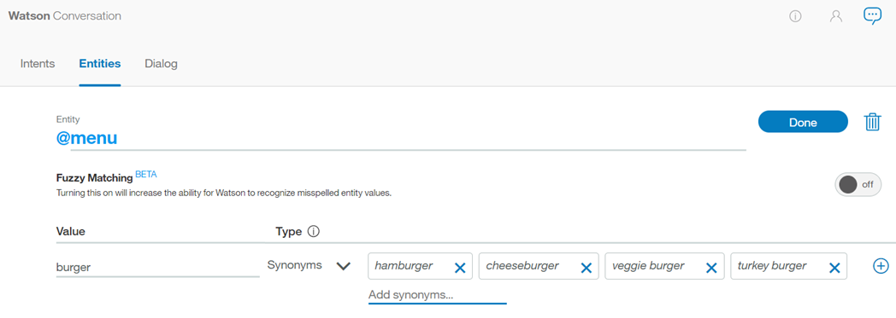

---

copyright:
  years: 2015, 2019
lastupdated: "2019-08-06"

keywords: entity, entity value, contextual entity, dictionary entity, pattern entity, entity synonym, annotate mentions

subcollection: assistant

---

{:shortdesc: .shortdesc}
{:new_window: target="_blank"}
{:deprecated: .deprecated}
{:important: .important}
{:note: .note}
{:tip: .tip}
{:pre: .pre}
{:codeblock: .codeblock}
{:screen: .screen}
{:javascript: .ph data-hd-programlang='javascript'}
{:java: .ph data-hd-programlang='java'}
{:python: .ph data-hd-programlang='python'}
{:swift: .ph data-hd-programlang='swift'}

# 创建实体
{: #entities}

***实体***表示用户输入中与用户的目的相关的信息。

如果说意向表示动词（用户希望执行的操作），那么实体就表示名词（该操作的对象或上下文）。例如，如果*意向*是获取天气预报，那么需要相关的位置和日期*实体*，然后应用程序才能返回准确的预测。

识别用户输入中的实体可帮助您设计更有用的目标响应。例如，您可能具有 `#buy_something` 意向。用户发出触发 `#buy_something` 意向的请求时，助手的响应应该反映出对客户希望购买的*物品*的理解。可以添加 `@product` 实体，然后将其用于从用户输入中抽取有关客户感兴趣的产品的信息。（附加到实体名称开头的 `@` 用于帮助明确将其标识为实体。）

最后，可以向对话树添加多个响应，各个响应使用的措辞基于用户请求中检测到的 `@product` 值而有所不同。

<iframe class="embed-responsive-item" id="youtubeplayer" title="使用实体" type="text/html" width="640" height="390" src="https://www.youtube.com/embed/o-uhdw6bIyI" frameborder="0" webkitallowfullscreen mozallowfullscreen allowfullscreen> </iframe>

## 实体求值概述
{: #entities-described}

助手使用下列其中一种求值方法来检测用户输入中的实体：

### 基于字典的方法
{: #entities-dictionary-overview}

助手在用户输入中查找与您为实体定义的值、同义词或模式相匹配的词汇。

- **同义词实体**：将一种类别的词汇定义为一个实体 (`color`)，然后在该类别中定义一个或多个值 (`blue`)。对于每个值，可指定一组同义词（`aqua` 和 `navy`）。此外，还可以从 Watson 向您提供的建议中选取要添加的同义词。

    在运行时，助手会将用户输入中与您为实体定义的值或同义词完全匹配的词汇识别为该实体的提及项。
- **模式实体**：将一种类别的词汇定义为一个实体 (`contact_info`)，然后在该类别中定义一个或多个值 (`email`)。对于每个值，可指定一个正则表达式，用于定义该值类型的提及项的文本模式。对于 `email` 实体值，您可能需要指定一个正则表达式来定义 `text@text.com` 模式。

    在运行时，助手会在用户输入中查找与正则表达式匹配的模式，并将任何匹配项标识为该实体的提及项。
- **系统实体**：IBM 为您预构建的同义词实体。系统实体涵盖常用的类别，例如数字、日期和时间。您只需启用系统实体就可以开始使用该实体。

### 基于注释的方法
{: #entities-annotations-overview}

定义基于注释的实体（也称为上下文实体）时，会基于*注释的词汇*以及您在注释的语句中使用该词汇的*上下文*对模型进行训练。此新的上下文实体模型支持助手计算置信度分数，用于根据词或短语在用户输入中的使用方式，确定该词或短语是实体实例的可能性。

- **上下文实体**：首先，将一种类别的词汇定义为一个实体 (`product`)。接下来，转至*意向*页面，挖掘现有意向用户示例以查找该实体的任何提及项，然后对其进行相应标注。例如，您可能转至 `#buy_something` 意向，然后找到了用户示例：`I want to buy a Coach bag`。您可以将 `Coach bag` 标记为 `@product` 实体的提及项。

    为了进行训练，您注释的词汇 `Coach bag` 将添加为 `@product` 实体的值。

    在运行时，助手将仅根据在语句中使用词汇的上下文对词汇进行求值。如果提及词汇的用户请求的结构与在其中标注了提及项的意向用户示例的结构相匹配，那么助手会将该词汇解释为该实体类型的提及项。例如，用户输入可能包含话语：`I want to buy a Gucci bag`。由于此语句的结构与所注释的用户示例 (`I want to buy a Coach bag`) 类似，因此助手会将 `Gucci bag` 识别为 `@product` 实体提及项。

    将上下文实体模型用于实体时，助手*不会*在用户输入中查找实体的完全文本或模式匹配项，而是关注提及该实体的语句的上下文。

    如果选择使用注释来定义实体值，请为每个实体至少添加 10 个注释，以向上下文实体模型提供足够的数据，使该模型变得可靠。

要了解有关上下文实体的更多信息，请[阅读此博客帖子 ](https://medium.com/ibm-watson/contextual-entities-with-ibm-watson-assistant-f41b2e0ca82e)。

## 创建实体
{: #entities-creating-task}

1.  打开对话技能，然后单击**实体**选项卡。如果**实体**选项卡未显示，请使用  菜单来打开该页面。

1.  单击**创建实体**。

    还可以单击**系统实体**以从 {{site.data.keyword.IBM_notm}} 提供的常见实体列表中选择可应用于任何用例的实体。有关更多详细信息，请参阅[启用系统实体](#entities-enable-system-entities)。


1.  在**实体名称**字段中，输入实体的描述性名称。

    实体名称可以包含字母（Unicode 格式）、数字、下划线和连字符。例如：
    - `@location`
    - `@menu_item`
    - `@product`

    请勿在名称中包含空格。名称长度不能超过 64 个字符。名称不能以字符串 `sys-` 开头，因为该字符串保留用于系统实体。

    在实体名称前会自动附加 `@` 符号，以将该词汇标识为实体。您无需添加该符号。
    {: tip}

1.  单击**创建实体**。

    

1.  对于此实体，选择是希望助手使用基于字典的方法还是基于注释的方法来查找此实体的提及项，然后遵循相应的过程。

    **对于创建的每个实体，请仅选择一个要使用的实体类型。**为实体添加注释后，上下文模型会立即初始化，并成为分析用户输入以查找该实体的提及项的主要方法。在用户输入中使用提及项的上下文优先于可能存在的任何完全匹配项。有关如何对每种类型求值的更多信息，请参阅[实体求值概述](#entities-described)。

    - [基于字典的实体](#entities-create-dictionary-based)
    - [基于注释的实体](#entities-create-annotation-based)

## 添加基于字典的实体
{: #entities-create-dictionary-based}

基于字典的实体是为其定义特定词汇、同义词或模式的实体。在运行时，仅当用户输入中某个词汇与值或该值的其中一个同义词完全匹配（或者在启用模糊匹配的情况下匹配程度极高）时，助手才会查找实体提及项。

1.  在**值名称**字段中，输入实体的可能值的文本，然后敲击 `Enter` 键。实体值可以是最大长度为 64 个字符的任何字符串。

    **重要信息：**不要在实体名称或值中包含敏感或个人信息。名称和值可能会通过 URL 在应用程序中公开。

1.  如果希望助手识别其语法与您指定的实体值和同义词类似的词汇，而不需要完全匹配，请单击**模糊匹配**切换控件以开启此功能。

    此功能可用于[支持的语言](/docs/services/assistant?topic=assistant-language-support)主题中注明的语言。
 

    **模糊匹配**
    {: #entities-fuzzy-matching}

    模糊匹配具有以下组成部分：

    - *词干提取* - 此功能识别具有多种语法形式的实体值的词干形式。例如，“bananana”的词干为“banana”，“running”的词干为“run”。
    - *拼写错误检查* - 此功能可将用户输入映射到对应的正确实体，即使存在拼写错误或语法方面略有差异也能正确映射。例如，如果将 *giraffe* 定义为某个动物实体的同义词，而用户输入包含词汇 *giraffes* 或 *girafe*，那么模糊匹配能够正确地将该词汇映射到该动物实体。
    - *部分匹配* - 部分匹配功能会自动建议在用户定义的实体中提供的基于子字符串的同义词，并为其分配低于完全实体匹配的置信度分数。

    对于英语，模糊匹配会阻止捕获某些常用、有效的英语单词作为给定实体的模糊匹配项。此功能使用标准英语字典中的单词。您还可以定义英语实体值/同义词，并且模糊匹配将仅匹配您定义的实体值/同义词。例如，模糊匹配可能会将词汇 `unsure` 与 `insurance` 匹配；但如果您将 `unsure` 定义为 `@option` 之类的实体的值/同义词，那么 `unsure` 将始终与 `@option` 匹配，而不会与 `insurance` 匹配。
    {: note}

    模糊匹配设置不会影响同义词建议。即便启用了模糊匹配，也仅会针对您指定的确切值建议同义词，而不会针对该值和与该值略有差异的变体建议同义词。

1.  一旦输入了值名称，就可以通过从*类型*下拉菜单中选择`同义词`或`模式`，为该实体值添加任何同义词或定义特定模式。

    

    **注：**可以为单个实体值添加同义词*或*模式，但不能同时添加这两者。

    ***同义词***
    {: #entities-synonyms}

    - 在**同义词**字段中，输入实体值的任何同义词。同义词可以是最大长度为 64 个字符的任何字符串。

      

      {{site.data.keyword.conversationshort}} 服务还可以为实体值建议同义词。建议者基于从大量现有信息（包括大量书面文本来源）中抽取的上下文相似度来查找相关同义词，然后使用自然语言处理技术来识别与实体值中现有同义词类似的词。

    - 单击**显示建议**。

    - {{site.data.keyword.conversationshort}} 服务将对同义词提供多个建议。词汇以小写形式显示，但无论同义词的提及项是以小写还是大写形式指定，助手都能识别。

      实体值同义词越联系紧密，建议的相关性就越高，针对性越好。例如，如果您有多个词针对某个主题，那么相比只有一个或两个随机词的情况，您将获得更好的建议。
      {: tip}

      

    - 选择要包含的任何同义词，然后单击**添加所选项**。

      必须针对选择要添加的任何同义词，单击**添加所选项**按钮。如果未首先单击此按钮就移至下一组，那么您的选择会丢失。

      

    - {{site.data.keyword.conversationshort}} 服务会将这些同义词添加到实体，并建议其他同义词。

      如果没有收到其他同义词建议，那么可能是因为实体已明确定义，或者实体包含建议者当前无法展开的内容。
      {: tip}

      如果决定不选择建议的同义词，那么系统会将该同义词视为您不感兴趣的词汇，并将改变按`添加所选项`或`下一组`时显示的下一组建议。此推断仅当选择同义词时才持久有效；助手不会将有关已跳过的同义词的信息用于其他任何目的。
      {: note}

      

      根据需要继续添加同义词。接受建议完成后，单击 **X** 以关闭。

    ***模式***
    {: #entities-patterns}

    - **模式**字段允许您为实体值定义特定模式。模式**必须**在字段中作为正则表达式输入。
  

      - 对于每个实体值，最多可以有 5 个模式。
      - 每个模式（正则表达式）限制为 512 个字符。

      
      {: #entities-pattern-entities}

      如此示例中所示，对于实体 *ContactInfo*，可以按如下所示定义电话、电子邮件和 Web 站点值的模式：
      - 电话
        - `localPhone`：`(\d{3})-(\d{4})`，例如 426-4968
        - `fullUSphone`：`(\d{3})-(\d{3})-(\d{4})`，例如 800-426-4968
        - `internationalPhone`：`^(\(?\+?[0-9]*\)?)?[0-9_\- \(\)]*$`，例如 +44 1962 815000
      - `email`：`\b[A-Za-z0-9._%+-]+@([A-Za-z0-9-]+\.)+[A-Za-z]{2,}\b`，例如  name@ibm.com
      - `website`：`(https?:\/\/)?([\da-z\.-]+)\.([a-z\.]{2,6})([\/\w \.-]*)*\/?$`，例如 https://www.ibm.com

      通常在使用模式实体时，必须从对话树中将与模式匹配的文本存储在上下文变量（或操作变量）中。有关其他信息，请参阅[定义上下文变量](/docs/services/assistant?topic=assistant-dialog-runtime#dialog-runtime-context-var-define)。

      假设您要请求用户输入其电子邮件地址。对话节点条件将包含类似于 `@contactInfo:email` 的条件。为了将用户输入的电子邮件分配为上下文变量，可以使用以下语法来捕获对话节点的响应部分中的模式匹配：

      <table>
      <caption>保存模式</caption>
        <tr>
          <th>变量</th>
          <th>值</th>
        </tr>
        <tr>
          <td>email    </td>
          <td>`<? @contactInfo.literal ?>`</td>
        </tr>
      </table>

      ***捕获组***
      {: #entities-capture-group}

      对于正则表达式，模式中用一对标准圆括号括起的任何部分都会作为组进行捕获。例如，实体 `@ContactInfo` 具有名为 `fullUSphone` 的模式值，此值包含三个捕获的组：

      - `(\d{3})` - 美国区号
      - `(\d{3})` - 前缀
      - `(\d{4})` - 线路号码

      例如，如果您希望 {{site.data.keyword.conversationshort}} 服务询问用户的电话号码，然后在响应中仅使用其提供的号码中的区号，那么分组会很有用。

      为了将用户输入的区号分配为上下文变量，可以使用以下语法来捕获对话节点的响应部分中的组匹配：

      <table>
      <caption>保存捕获组</caption>
        <tr>
          <th>变量</th>
          <th>值</th>
        </tr>
        <tr>
          <td>area_code</td>
          <td>`<? @ContactInfo.groups[1] ?>`</td>
        </tr>
      </table>

      有关在对话中使用捕获组的其他信息，请参阅[存储和识别输入中的实体模式组](/docs/services/assistant?topic=assistant-dialog-tips#dialog-tips-get-pattern-groups)。

      {{site.data.keyword.conversationshort}} 服务使用的模式匹配引擎具有一些必需的语法限制，目的是避免使用其他正则表达式引擎时可能发生的性能问题。

      - 实体模式不能包含：
        - 肯定重复（例如，`x*+`）
        - 反向引用（例如，`\g1`）
        - 条件分支（例如，`(?(cond)true)`)
      - 模式实体以 Unicode 字符开头或结尾，并且包含字边界（例如 `\bš\b`）时，模式匹配与字边界无法正确匹配。在此示例中，对于输入 `š zkouška`，匹配会返回 `Group 0: 6-7 š` (`š zkou`_**`š`**_`ka`)，而不是返回正确的 `Group 0: 0-1 š` (_**`š`**_ `zkouška`)。

      正则表达式引擎以松散方式基于 Java 正则表达式引擎。如果尝试通过 API 或在 {{site.data.keyword.conversationshort}} 用户界面中上传不支持的模式，那么 {{site.data.keyword.conversationshort}} 服务会生成错误。

1.  单击**添加值**并重复该过程以添加更多实体值。

1.  添加实体值完成后，单击  以完成创建实体的操作。

您创建的实体将添加到**实体**选项卡，然后系统开始对新数据进行自我训练。

## 添加上下文实体
{: #entities-create-annotation-based}

基于注释的实体是为其在样本语句中对实体的出现项进行注释（以指导助手学习有关通常使用该实体的上下文）的实体。

为了训练上下文实体模型，可以利用意向示例，这些示例提供了随时可用的语句供注释。

使用意向的用户示例来定义上下文实体不会影响该意向的分类。不过，标注的实体提及项还会添加为该实体的同义词。意向分类会在意向用户示例中使用同义词提及项，以在意向与实体之间建立弱引用。
{: note}

1.  在对话技能中，单击**意向**选项卡。

1.  单击意向以将其打开。

    对于此示例，意向 `#place_order` 定义在线零售商的订购功能。

    

1.  查看意向示例，以确定潜在的实体提及项。突出显示意向示例中的潜在实体提及项。

    在此示例中，`computer` 是实体提及项。

    

    “编辑”图标  用于编辑意向用户示例；此图标与添加注释无关。
    {: tip}

1.  这将打开“搜索框”，可以使用该框来搜索突出显示的词或短语是其提及项的实体。

    

    在此示例中，搜索 `prod` 会显示 `@product` 实体的匹配项。

    

    如果实体具有任何现有实体值，那么会显示这些实体值以仅供参考。您要将注释添加到实体，而不是添加到任何特定实体值。

    如果希望指导模型学习提及项是现有实体值的同义词，那么可以将其与特定实体值相关联。
    {: important}

    要将提及项与特定实体值相关联，请执行以下步骤：

    1.  在搜索字段中输入完整的实体名称和值。例如，输入 `@product:IT`。
    1.  相应的实体值显示在下拉菜单中时，请进行选择。

1.  选择要向其添加注释的实体。

    在此示例中，将添加 `computer` 作为 `@product` 实体的注释。

    为每个上下文实体创建*至少* 10 个注释；建议对于生产用途提供更多注释。
    {: important}

1.  如果任何实体都不适用，可以通过选择 **@(create new entity)** 来创建新实体。

1.  对于要注释的每个实体提及项重复此过程。

    确保对编辑的任何用户示例中出现的每个实体类型提及项进行注释。有关更多详细信息，请参阅[不注释的内容很重要](#entities-counter-examples)。
    {: important}

1.  现在，单击刚刚创建的注释。这将打开一个框，其中显示`转至：<entity-name>`。单击该链接可直接转至该实体。

    

    注释已添加到与其关联的实体，并且系统会开始对新数据进行自我训练。

    注释的词汇会作为新的字典值添加到实体。如果将注释的词汇与现有实体值相关联，那么会将该词汇添加为该实体值的同义词，而不是添加为独立的实体值。
    {: important}

1.  要查看为特定实体注释的所有提及项，请在实体的配置页面中，单击**注释**选项卡。

    

    上下文实体会理解尚未明确定义的值。系统根据用户示例的注释方式对其他实体值进行预测，并使用这些值来训练其他实体。任何类似的用户示例都会添加到*注释*视图中，以便您可以了解此选项如何影响训练。
    {: note}

    如果不希望上下文实体使用此扩展的实体值理解，请在该实体的*注释*视图中选择所有用户示例，然后单击**删除**。

以下视频演示了如何注释实体提及项。

<iframe class="embed-responsive-item" id="youtubeplayer0" title="注释实体提及项" type="text/html" width="640" height="390" src="https://www.youtube.com/embed/3WjzJpLsnhQ" frameborder="0" webkitallowfullscreen mozallowfullscreen allowfullscreen> </iframe>

要在添加您自己的上下文实体之前，先总体浏览说明如何定义上下文实体的教程，请转至[教程：定义上下文实体 ](https://www.ibm.com/cloud/garage/demo/try-watson-assistant-contextual-entities){: new_window}。

### 不注释的内容很重要
{: #entities-counter-examples}

如果您有带注释的意向示例，并且该示例中的另一个词与同一实体的值或同义词相匹配，但*并未*对该值进行注释，那么这一省略行为会产生影响。模型还会从您未注释的词汇的上下文进行学习。因此，如果在用户示例中将一个词汇标注为某个实体的提及项，请确保同时标注其他任何适用的提及项。

1.  `#Customer_Care_Appointments` 意向包含两个具有词 `visit` 的意向示例。

    

1.  在第一个示例中，您希望将词 `visit` 注释为 `@meeting` 实体的实体值。这将使 `visit` 等同于其他 `@meeting` 实体值（例如 `appointment`），如“I'd like to make an appointment”或“I'd like to schedule a visit”中所示。

    

1.  对于第二个示例，词 `visit` 是在不同于 meeting 的上下文中使用的。在这种情况下，可以从意向示例中选择词 `appointment`，并将其注释为 `@meeting` 实体的实体值。模型会学习到同一示例中的词 `visit` 未注释这一事实。

    

## 启用系统实体
{: #entities-enable-system-entities}

{{site.data.keyword.conversationshort}} 服务提供了许多*系统实体*，这些是可用于任何应用程序的常见实体。通过启用系统实体，可以使用在许多用例中通用的训练数据来快速填充技能。

可以使用系统实体来识别其所表示的对象类型的大范围值。例如，`@sys-number` 系统实体与任何数字值匹配，包括整数、小数部分，甚至包括写出为字的数字。

系统实体是集中维护的，因此任何更新都会自动可用。您无法修改系统实体。

1.  在“实体”页面上，单击**系统实体**。

    

1.  浏览系统实体的列表以选择对您的应用程序有用的系统实体。
    - 要查看有关系统实体的更多信息（包括匹配输入的示例），请单击列表中的实体。
    - 有关可用系统实体的详细信息，请参阅[系统实体](/docs/services/assistant?topic=assistant-system-entities)。

1.  单击要启用或禁用的系统实体旁边的切换开关。

启用系统实体后，{{site.data.keyword.conversationshort}} 服务就会开始重新训练。训练完成后，即可以使用实体。

## 实体限制
{: #entities-limits}

可以创建的实体、实体值和同义词的数量取决于 {{site.data.keyword.conversationshort}} 服务套餐：

|服务套餐          |每个技能的实体数|每个技能的实体值数|每个技能的实体同义词数|
|-------------------|-------------------:|------------------------:|--------------------------:|
|高端                                 |1,000|100,000 |100,000 |
|增强版                               |1,000|100,000 |100,000 |
|标准                                 |1,000|100,000 |100,000 |
|轻量和增强试用版|25 |100,000 |100,000 |
{: caption="服务套餐详细信息" caption-side="top"}

启用供使用的系统实体数会计入套餐使用量总计。

|服务套餐          |上下文实体数和注释数|
|--------------|------------------------------------:|
|高端                                 |30 个上下文实体，带 3000 个注释|
|增强版                               |20 个上下文实体，带 2000 个注释|
|标准                                 |20 个上下文实体，带 2000 个注释|
|轻量和增强试用版|10 个上下文实体，带 1000 个注释|
{: caption="服务套餐详细信息（续）" caption-side="top"}

## 编辑实体
{: #entities-edit}

可以单击列表中的任何实体以将其打开进行编辑。可以重命名或删除实体，也可以添加、编辑或删除值、同义词或模式。

如果将实体类型从`同义词`更改为`模式`，或者从“模式”更改为“同义词”，那么将转换现有值，但这些值可能不会像原来那样有用。
{: note}

## 搜索实体
{: #entities-search}

使用“搜索”功能查找实体名称、值和同义词。

1.  在**实体**页面中，单击“搜索”图标。

    

    系统实体不可搜索。
    {: note}

1.  输入搜索项或搜索短语。

    

这将显示包含搜索项的实体以及相应的示例。

  

## 导出实体
{: #entities-export}

可以将多个实体导出到一个 CSV 文件中，这样随后可以将这些实体导入并复用于其他 {{site.data.keyword.conversationshort}} 应用程序。

- CSV 导出中包含模式信息。使用 `/` 包装的任何字符串都会视为模式（而不是同义词）。
- 不会导出与上下文实体关联的注释。您必须导出整个对话技能才能捕获实体值和任何关联的注释。

1.  选择所需的实体，然后单击**导出**。

    

## 导入实体
{: #entities-import}

如果有大量实体，那么您可能会发现通过逗号分隔值 (CSV) 文件导入这些实体比逐个对其定义更容易。

实体 CSV 文件的导入中不包含实体注释。必须导入整个对话技能才能保留该技能中的上下文实体的关联注释。如果仅导出和导入实体，那么导出的任何上下文实体在导入后都会视为基于字典的实体。
{: note}

1.  将实体收集到 CSV 文件中，或将其从电子表格导出为 CSV 文件。文件中每一行的必需格式如下所示：

    ```
    <entity>,<value>,<synonyms>
    ```
    {: screen}

    其中，&lt;entity&gt; 为实体的名称，&lt;value&gt; 为实体的值，&lt;synonyms&gt; 为该值的同义词的逗号分隔列表。

    ```
    weekday,Monday,Mon
    weekday,Tuesday,Tue,Tues
    weekday,Wednesday,Wed
    weekday,Thursday,Thur,Thu,Thurs
    weekday,Friday,Fri
    weekday,Saturday,Sat
    weekday,Sunday,Sun
    month,January,Jan
    month,February,Feb
    month,March,Mar
    month,April,Apr
    month,May
    ```
    {: screen}

    导入 CSV 文件也支持模式。使用 `/` 包装的任何字符串都会视为模式（而不是同义词）。

    ```
    ContactInfo,localPhone,/(\d{3})-(\d{4})/
    ContactInfo,fullUSphone,/(\d{3})-(\d{3})-(\d{4})/
    ContactInfo,internationalPhone,/^(\(?\+?[0-9]*\)?)?[0-9_\- \(\)]*$/
    ContactInfo,email,/\b[A-Za-z0-9._%+-]+@[A-Za-z0-9.-]+\.[A-Za-z]{2,}\b/
    ContactInfo,website,/(https?:\/\/)?([\da-z\.-]+)\.([a-z\.]{2,6})([\/\w \.-]*)*\/?$/
    ```
    {: screen}

        保存的 CSV 文件为 UTF-8 编码且无字节顺序标记 (BOM)。最大 CSV 文件大小为 10 MB。如果 CSV 文件大于此值，请考虑将其拆分成多个文件，然后分别导入这些文件。打开对话技能，然后单击**实体**选项卡。
    {: tip}

1.  单击 ，然后拖动文件，或进行浏览以从计算机中选择文件。文件经验证并导入后，系统会开始针对新数据进行自我训练。

可以在“实体”选项卡上查看导入的实体。您可能需要刷新页面才能看到新实体。

## 删除实体
{: #entities-delete}

可以选择多个实体进行删除。

**重要信息**：通过删除实体，还将删除所有关联的值、同义词或模式，并且以后无法恢复。所有引用这些实体或值的对话节点都必须手动更新为不再引用已删除的内容。

1.  选择要删除的实体，然后单击**删除**。

    
