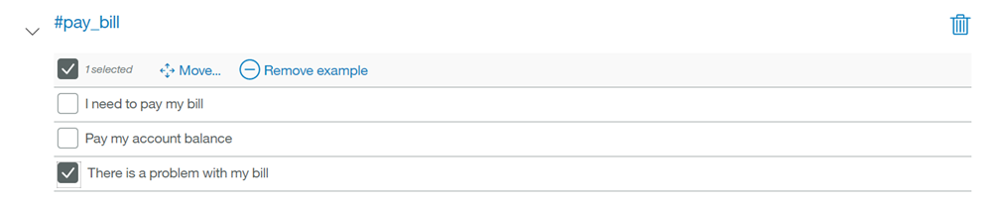
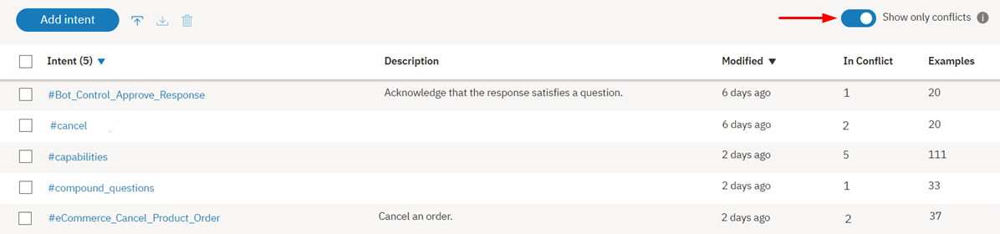

---

copyright:
  years: 2015, 2019
lastupdated: "2019-02-28"

subcollection: assistant

---

{:shortdesc: .shortdesc}
{:new_window: target="_blank"}
{:deprecated: .deprecated}
{:important: .important}
{:note: .note}
{:tip: .tip}
{:pre: .pre}
{:codeblock: .codeblock}
{:screen: .screen}
{:javascript: .ph data-hd-programlang='javascript'}
{:java: .ph data-hd-programlang='java'}
{:python: .ph data-hd-programlang='python'}
{:swift: .ph data-hd-programlang='swift'}

# 定义意向
{: #intents}

***意向***是在客户输入中表达的目的或目标，例如回答问题或处理帐单支付。通过识别客户输入中表达的意向，{{site.data.keyword.conversationshort}} 服务可以选择正确的对话流来对其进行响应。
{: shortdesc}

<iframe class="embed-responsive-item" id="youtubeplayer" title="使用意向" type="text/html" width="640" height="390" src="https://www.youtube.com/embed/OPdOCUPGMIQ" frameborder="0" webkitallowfullscreen mozallowfullscreen allowfullscreen> </iframe>

## 意向创建概述
{: #intents-described}

- 为应用程序计划意向。

  请考虑客户可能希望执行的操作以及希望应用程序能够代表客户处理的内容。例如，您可能希望应用程序帮助客户购物。为此，可以添加 `#buy_something` 意向。（附加到意向名称开头的 `#` 用于帮助明确将其标识为意向。）

- 指导 Watson 学习您的意向。

  决定了希望应用程序为客户处理哪些业务请求后，必须指导 Watson 学习这些内容。对于每个业务目标（例如，`#buy_something`），必须提供客户通常用于指示其目标的至少 10 个发声示例。例如，`I want to make a purchase.`
  
  理想情况下，请查找现实世界用户发声示例，这可以从现有业务流程中进行抽取。应该针对您的特定业务对用户示例进行定制。例如，如果您是一家保险公司，那么用户示例可能更类似于：`I want to buy a new XYZ insurance plan.`
  
  服务将使用您提供的示例来构建机器学习模型，该模型可以识别相同和类似类型的发声，并将其映射到相应的意向。

首先从几个意向开始，并在以迭代方式扩大应用程序的作用域时，对这些意向进行测试。

## 创建意向
{: #intents-create-task}

使用 {{site.data.keyword.conversationshort}} 工具来创建意向。

1.  在 {{site.data.keyword.conversationshort}} 工具中，打开对话技能。技能将打开到**意向**页面。

1.  选择**新建**。

1.  在**意向名称**字段中，输入意向的名称。
    - 意向名称可以包含字母（Unicode 格式）、数字、下划线、连字符和句点。
    - 名称不能由 `..` 或只包含句点的其他任何字符串组成。
    - 意向名称不能包含空格，并且不能超过 128 个字符。下面是意向名称的示例：
        - `#weather_conditions`
        - `#pay_bill`
        - `#escalate_to_agent`

    工具会在意向名称中自动包含 `#` 字符，因此您不必添加。
    {: tip}

    在**描述**字段中添加意向的描述。

1.  选择**创建意向**以保存意向名称。

    

1.  接下来，在**添加用户示例**字段中，输入意向的用户示例的文本。示例可以是最大长度为 1024 个字符的任意字符串。下面是可能的 `#pay_bill` 意向示例：
    - `我需要支付帐单。`
    - `支付帐户余额`
    - `付款`

    要添加从客户发出的实际支持请求中挖掘的用户示例，请参阅[通过日志文件添加示例](#intents-intent-recommendations)。

    要了解有关在用户示例中包含对实体的引用所产生影响的信息，请参阅[如何处理实体引用](#intents-entity-references)。
    {: tip}

    应用程序与服务交互时，可能会在 URL 中公开意向名称和示例文本。因此不要在这些工件中包含敏感或个人信息。
    {: important}

1.  单击**添加示例**以保存示例。

1.  重复同一过程以添加更多示例。可以使用 Tab 键在各个示例之间切换。为每个意向至少提供 5 个示例。提供的示例越多，应用程序的准确性就越高。

    要获取有关创建用户示例的帮助，请参阅[获取意向用户示例建议](/docs/services/assistant?topic=assistant-intent-recommendations#intent-recommendations-get-example-recommendations)。

1.  添加示例完成后，单击  以完成创建意向的操作。

系统会开始对添加的意向和用户示例进行自我训练。

## 如何处理实体引用
{: #intents-entity-references}

在用户示例中包含实体提及项时，在以下场景中机器学习模型会以不同的方式使用这些信息：

- [在意向示例中引用实体值和同义词](#intents-related-entities)
- [注释的提及项](#intents-annotated-mentions)
- [在意向示例中直接引用实体名称](#intents-entity-as-example)

### 在意向示例中引用实体值和同义词
{: #intents-related-entities}

如果已定义或计划定义与此意向相关的实体，请在某些示例中提及实体值或同义词。这样做有助于在意向和实体之间建立关系。这是一种弱关系，但确实会通知模型。


*重要信息*：

  - 意向示例数据应该是最终用户将提供的数据中具有代表性和典型性的数据。可以从实际的用户数据中收集示例，也可以从您的特定领域的专家收集示例。重要的是数据准确且具有代表性。
  - 训练和测试数据（用于评估目的）都应该反映出在实际使用中意向的分布情况。通常，更频繁的意向具有的示例相对较多，并且响应覆盖范围更好。
  - 可以在示例文本中包含标点符号，条件是这些标点符号是自然出现的。如果您认为有些用户会使用包含标点符号的示例来表达他们的意向，但有些用户不会这样做，请包含有标点符号和无标点符号这两种版本。通常，各种模式的覆盖范围越广，响应越好。

### 注释的提及项
{: #intents-annotated-mentions}

定义实体时，可以直接在现有意向用户示例中对实体的提及项进行注释。以这种方式识别到的意图与实体之间的关系*不会*由意向分类模型使用。不过，将提及项添加到实体时，还会将其添加为该实体的新值。将提及项添加到现有实体值时，还会将其添加为该实体值的新同义词。意向分类确实会在意向用户示例中使用这些类型的字典引用，以在意向与实体之间建立弱引用。


有关上下文实体的更多信息，请参阅[添加上下文实体](/docs/services/assistant?topic=assistant-entities#entities-create-annotation-based)。

### 在意向示例中直接引用实体名称
{: #intents-entity-as-example}

这是一种高级方法，如果使用，必须以一致的方式使用。
{: note}

您可以选择在意向示例中直接引用实体。例如，假设您有一个名为 `@PhoneModelName` 的实体，其中包含值 *Galaxy S8*、*Moto Z2*、*LG G6* 和 *Google Pixel 2*。在您创建意向（例如，`#order_phone`）时，可以提供训练数据，如下所示：

- 能为我提供 `@PhoneModelName` 吗？
- 请帮我订购 `@PhoneModelName`。
- `@PhoneModelName` 有货吗？
- 将 `@PhoneModelName` 添加到我的订单。


目前，您只能直接引用定义的同义词实体（将忽略模式值）。不能使用[系统实体](/docs/services/assistant?topic=assistant-system-entities)。

如果选择在训练数据中的*任意位置*将实体作为意向示例（例如，`@PhoneModelName`）引用，那么将取消在其他任何位置的意向示例中使用直接引用的值（例如，*Galaxy S8*）。随后，所有意向都将使用“将实体作为意向示例”的方法。您不能仅针对特定意向应用此方法。
{: important}

实际上，这意味着如果先前已经基于直接引用 (*Galaxy S8*) 训练了大部分意向，而现在将实体引用 (`@PhoneModelName`) 仅用于一个意向，此更改会影响您先前的训练。如果您确实要选择使用 `@Entity` 引用，那么必须将所有先前的直接引用都替换为 `@Entity` 引用。

使用已定义 10 个值的 `@Entity` 来定义一个示例意向**并不**等同于指定该示例意向 10 次。{{site.data.keyword.conversationshort}} 服务不会为这样的一个示例意向语法授予这么大的权重。

## 测试意向
{: #intents-test}

完成创建新意向之后，可以测试系统以了解其是否可按预期识别到您的意向。

1.  在 {{site.data.keyword.conversationshort}} 工具中，单击  图标。

1.  在*试用*窗格中，输入问题或其他文本字符串，然后按 Enter 键以查看识别到的意向。如果识别到的意向不正确，那么将此文本作为示例添加到正确的意向，以改进模型。

    如果最近在技能中进行过更改，那么可能会看到一条消息，指示系统仍在重新训练。如果看到此消息，请等待训练完成后再进行测试：
    {: tip}

    

    响应指示从输入中识别到的意向。

    

1.  如果系统未识别到正确的意向，您可以对其进行更正。要更正识别的意向，请选择显示的意向，然后从列表中选择正确的意向。提交更正后，系统会自动重新自我训练以包含新数据。

    

1.  如果输入与应用程序中的任何意向都无关，那么可以通过选择显示的意向，然后单击**标记为不相关**，从而指导服务学习。

    

    *标记为不相关*
    {: #intents-mark-irrelevant}

    *标记为不相关*选项并非在所有语言中都可用。有关详细信息，请参阅[支持的语言](/docs/services/assistant?topic=assistant-language-support)。

    **重要信息**：标记为不相关的意向会在 JSON 工作空间中保存为反例，并且包含为训练数据的一部分。将输入指定为不相关之前，务必知悉：

      - 日后在工具中会无法访问或更改这些输入。
      - 撤销将输入标识为不相关的唯一方法是在*试用*窗格中再次使用相同的输入，但这次将其分配给某个意向。

如果未正确识别意向，请考虑进行以下类型的更改：

- 将未识别到的文本作为示例添加到正确的意向。
- 将现有示例从一个意向移动到另一个意向。
- 考虑意向是否太类似，然后视情形对其进行重新定义。

## 绝对评分
{: #intents-absolute-scoring}

{{site.data.keyword.conversationshort}} 服务会对每个意向的置信度独立评分，而不是相对于其他意向进行评分。此方法增加了灵活性；可以在单个用户输入中检测多个意向。同时，这也意味着系统可能根本不返回意向。如果最热门意向的置信度分数较低（小于 0.2），那么虽然 API 返回的 intents 数组中仍会包含该最热门意向，但不会触发以该意向为条件的任何节点。如果要检测没有检测到具有良好置信度分数的任何意向的情况，请在对话节点中使用 `irrelevant` 特殊条件。有关更多信息，请参阅[特殊条件](/docs/services/assistant?topic=assistant-dialog-overview#dialog-overview-special-conditions)。

意向置信度分数更改时，对话可能需要重构。例如，如果对话节点在其条件中使用了意向，并且意向的置信度分数开始持续低于 0.2，那么将停止处理该对话节点。如果置信度分数更改，那么该对话的行为也可能随之更改。

## 意向限制
{: #intents-limits}

可以创建的意向数和示例数取决于 {{site.data.keyword.conversationshort}} 服务套餐：

|服务套餐          |每个技能的意向数|每个技能的示例数|
|------------------|------------------:|-------------------:|
|高级                                 |2,000 |25,000 |
|增强版            |2,000 |25,000 |
|标准                                 |2,000 |25,000 |
|Lite              |100 |25,000 |
{: caption="服务套餐详细信息" caption-side="top"}

## 编辑意向
{: #intents-edit}

可以单击列表中的任何意向以将其打开进行编辑。可以进行以下更改：

- 重命名意向。
- 删除意向。
- 添加、编辑或删除示例。
- 将示例移至其他意向。

可以通过 Tab 键从意向名称切换到每个示例，并根据需要编辑示例。

要移动或删除示例，请单击与该示例关联的复选框，然后单击**移动**或**删除**。

  

## 搜索意向
{: #intents-search}

使用“搜索”功能查找用户示例、意向名称和描述。

1.  在**意向**页面中，单击“搜索”图标。

    

1.  输入搜索项或搜索短语。

    

这将显示包含搜索项的意向以及相应的示例。

  

## 导出意向
{: #intents-export}

可以将多个意向导出到一个 CSV 文件中，这样随后可以将这些意向导入并复用于其他 {{site.data.keyword.conversationshort}} 应用程序。

1.  在**意向**页面上，从列表中选择所需意向，然后选择**导出**。

    

## 导入意向和示例
{: #intents-import}

如果有大量意向和示例，那么您可能会发现通过逗号分隔值 (CSV) 文件导入这些意向和示例比在 {{site.data.keyword.conversationshort}} 工具中逐个对其定义更容易。确保从文件中包含的用户示例中除去任何个人数据。

或者，可以上传具有原始用户发声（例如，呼叫中心日志中的发声）的文件，然后让服务在这些数据中查找用户示例的候选项。有关更多信息，请参阅[通过日志文件添加示例](/docs/services/assistant?topic=assistant-intent-recommendations#intent-recommendations-get-example-recommendations)。此功能仅可供增强版或高端套餐用户使用。

1.  将意向和示例收集到 CSV 文件中，或将其从电子表格导出为 CSV 文件。文件中每一行的必需格式如下所示：

    ```
    <example>,<intent>
    ```
    {: screen}

    其中，`<example>` 是用户示例的文本，`<intent>` 是希望示例匹配的意向的名称。例如：

    ```
    告诉我现在的天气状况。,weather_conditions
    下雨了吗？,weather_conditions
    气温多少度？,weather_conditions
    你们最近的门店在哪？,find_location
    你们在罗利有门店吗？,find_location
    ```
    {: screen}

    **重要信息：**以 UTF-8 编码保存 CSV 文件，并且无字节顺序标记 (BOM)。

1.  在**意向**页面中，单击*导入*图标 ，然后拖动文件或在计算机中浏览以选择文件。

    

    **重要信息**：CSV 文件最大不超过 10 MB。如果 CSV 文件大于此值，请考虑将其拆分成多个文件，然后分别导入这些文件。

    文件经验证并导入后，系统会开始针对新数据进行自我训练。

可以在**意向**选项卡上查看导入的意向和对应的示例。您可能需要刷新页面才能看到新意向和示例。

## 解决意向冲突 
{: #intents-resolve-conflicts}

此功能仅可供增强版或高端套餐用户使用。
{: tip}

*不同*意向中的两个或多个意向示例非常类似，以致于 {{site.data.keyword.conversationshort}} 对于要使用哪个意向感到困惑时，{{site.data.keyword.conversationshort}} 应用程序会检测到冲突。

要解决冲突，请执行以下操作：

1.  在**意向**页面中，查看有冲突的任何意向。

    

    切换**仅显示冲突**开关，以仅查看有冲突意向的列表。
    {: tip}

    

1.  打开一个意向冲突。对于导致该冲突的意向示例，单击**解决冲突**。

    

1.  现在，可以选择是将冲突示例移至其他意向，还是完全删除冲突示例。

    在本例中，`#cancel` 意向和 `#eCommerce_Cancel_Product_Order` 意向中都显示有 `Cancel my order` 和 `I want to cancel my order` 示例。

    

    其他用户示例是不一定有冲突的训练示例，但与有冲突的示例类似。显示这些示例是为了提供上下文，以帮助解决冲突。

1.  选择 `Cancel my order` 和 `I want to cancel my order` 示例，然后将其从 `#cancel` 意向移至 `#eCommerce_Cancel_Product_Order` 意向：

    

1.  在决定放置示例的位置时，请查找具有同义词或近似同义词示例的意向。

    尽可能使每个意向保持为不同并针对一个目标。如果您的两个意向有多个用户示例重叠，那么可能不需要这两个单独的意向。您可以将不直接重叠的用户示例移入其中一个意向或删除这些用户示例，然后删除另一个意向。
    {: tip}

    选择 `#cancel` 意向中的其他示例，然后将其删除：

    

1.  单击**提交**按钮以解决冲突：

    

    通过*重置*选项，可以重新开始在意向之间移动冲突示例。使用*取消*可返回到意向页面。

您已解决了冲突，可以继续查看其他有冲突的意向。

观看此视频以了解更多信息。

<iframe class="embed-responsive-item" id="youtubeplayer0" title="意向冲突解决概述" type="text/html" width="640" height="390" src="https://www.youtube.com/embed/9gQtjCBxjdc?rel=0" frameborder="0" webkitallowfullscreen mozallowfullscreen allowfullscreen> </iframe>

## 删除意向
{: #intents-delete}

可以选择多个意向进行删除。

**重要信息**：通过删除意向，还将删除所有关联的示例，并且以后无法恢复。所有引用这些意向的对话节点都必须手动更新为不再引用已删除的内容。

1.  在**意向**页面上，从列表中选择所需意向，然后选择**删除**。

    
