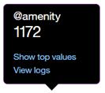

---

copyright:
  years: 2015, 2018
lastupdated: "2018-01-25"

---

{:shortdesc: .shortdesc}
{:new_window: target="_blank"}
{:tip: .tip}
{:pre: .pre}
{:codeblock: .codeblock}
{:screen: .screen}
{:javascript: .ph data-hd-programlang='javascript'}
{:java: .ph data-hd-programlang='java'}
{:python: .ph data-hd-programlang='python'}
{:swift: .ph data-hd-programlang='swift'}

# 概述页面

**改进**面板的“概述”页面提供用户与工作空间之间会话的摘要。可以查看给定时间段内的流量以及在用户会话中最常识别到的意向和实体。
{: shortdesc}

在“概述”页面上显示的统计信息涵盖的时间段长于保留用户会话日志的时间段。这些统计信息表示已经与工作空间交互的外部流量 - 用户或 API 调用；不包括工具中*试用*窗格中的交互。

可以使用“概述”页面回答如下问题：

* 去年哪个月的会话数最多，哪个月最少？
* 第一季度每周平均会话数是多少？
* 上周最常出现的意向是什么？
* 9 月份识别最频繁的实体值有哪些？

要打开“概述”页面，请选择导航栏中的**概述**。如果**概述**未显示，请使用  菜单来打开该页面。

  

该页面的顶部包含以下控件：

* *刷新数据* - 允许立即刷新“概述”页面统计信息。“概述”页面会显示所显示数据上次更新的时间。如果您认为可能有较新的数据可用，那么可以选择**刷新数据**。
* 时间段控件 - 使用此控件可选择要显示数据的时间段。此控件会影响页面上显示的所有数据：不仅仅是图形中显示的会话数，还会影响与图形一起显示的统计信息以及最热门意向和实体的列表。

  

可以选择是查看一天、一周、一个月、一个季度还是一年的数据。在每种情况下，图形上的数据点都将调整为相应的测量时间段。例如，查看一天的图形时，数据值按小时显示，但当查看一周的图形时，数据将按天显示。一周始终是从星期日到星期六。不能创建定制时间段，例如一周是从周四到下周三，或者一个月不从 1 号开始，都不行。

## 所有会话

图形会显示所选日期范围的会话总数。

**注：**“会话”被视为与工作空间的任何交互，因此如果在会话中，服务首先说`您好，有什么能为您效劳的吗？`，随后用户关闭自己的浏览器而未响应，那么该会话将计入总会话计数中。

可以选择**查看日志**以打开[用户会话](logs_convo.html)页面，该页面的日期范围已过滤，与您为“概述”页面选择的时间段匹配。[用户会话](logs_convo.html)页面会显示*发声*总数。一个发声是用户向工作空间发送的单条消息。每个会话可能由多个发声组成。因此，[用户会话](logs_convo.html)页面上的结果数与此“概述”页面上显示的会话数不同。

**注**：根据所选的套餐和日期范围，有可能不显示任何数据。例如，{{site.data.keyword.conversationshort}} [标准服务套餐](logs_convo.html#log-limits)仅保留 30 天的会话；如果选择的日期范围早于 30 天，那么不会显示任何数据。

查看图形时，可以单击单个数据点来查看相应数字值，如下所示：

在图形下方，会显示与所显示数据相关的统计信息：

* *会话总数* - 在此时间段内发生会话总数
* *最大会话数* - 在此时间段内单个数据点的最大会话数
* *理解差* - 理解差的单个发声的数量。这些发声未按意向进行分类，并且不包含任何已知实体。在确定潜在对话问题时，这些会很有用。

## 最热门意向和最热门实体

您还可以查看在指定时间段内最常识别到的意向和实体。缺省情况下，可以看到三个最热门的意向和实体，但可以将其更改为更大的数字，例如 5 个或 10 个。

* *最热门意向* - 意向会以简单列表方式显示。除了查看意向的识别次数外，还可以使用**查看日志**链接来打开“用户会话”页面，该页面的日期范围已过滤，与您正在查看的数据匹配，并且意向也已过滤，与所选意向匹配。

* *最热门实体*会以条形图方式显示。对于每个实体，都可以选择其条形以查看该条形所表示的数字。

  

  选择**显示最热门值**以查看在此时间段内为此实体识别到的最常见值的列表。选择**查看日志**以打开[用户会话](logs_convo.html)页面，该页面的日期范围已过滤，与您正在查看的数据匹配，并且实体也已过滤，与所选实体匹配。
