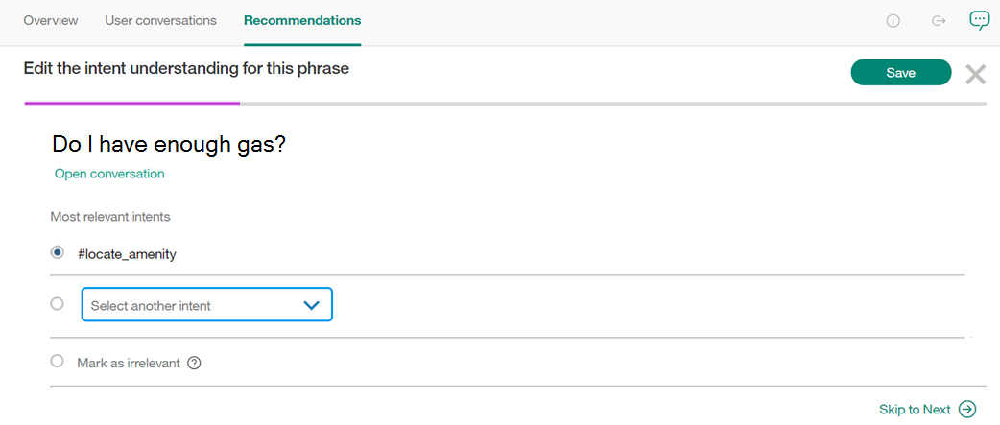

---

copyright:
  years: 2015, 2018
lastupdated: "2018-02-13"

---

{:shortdesc: .shortdesc}
{:new_window: target="_blank"}
{:tip: .tip}
{:pre: .pre}
{:codeblock: .codeblock}
{:screen: .screen}
{:javascript: .ph data-hd-programlang='javascript'}
{:java: .ph data-hd-programlang='java'}
{:python: .ph data-hd-programlang='python'}
{:swift: .ph data-hd-programlang='swift'}

# 建议
此页面提供了有关系统改进方法的建议。
{: shortdesc}

此功能仅为 Beta。
{: tip}

此功能仅可供高级套餐用户使用。
{: tip}

通过分析用户与工作空间之间的会话，并考虑系统的当前培训数据和响应确定性，将向您提供多种操作，通过这些操作，您可以轻松、高效地改进工作空间。

<iframe class="embed-responsive-item" id="youtubeplayer" type="text/html" width="640" height="390" src="https://www.youtube.com/embed/scMu66AvZtY" frameborder="0" webkitallowfullscreen mozallowfullscreen allowfullscreen> </iframe>

建议是在夜间生成的，需要大量用户消息，例如 50 条以上的消息。
{: tip}

## 改进现有意向
此建议涉及获取用户输入中系统无法识别的各个短语，然后显示这些短语供您选择每个短语的意向。这将有助于工作空间更好地理解用户表达的意思。

单击**开始**以开始识别意向。

进入或退出**改进现有意向**时，进度条将显示该天要处理的短语总数中，已在当前会话中处理的短语数以及剩余未处理的短语数。请注意，如果退出并重新进入，进度条将再次从`空`开始，但这并不意味着您先前的工作已丢失 - 只是这些工作不会计入当前会话的进度。

从提供的列表中选择短语的最佳意向，或选中*标记为不相关*。单击**保存**后，短语将立即作为示例添加到意向（添加为培训数据）。

*跳至下一个*按钮允许您跳过当前短语，并移至下一个短语。如果在同一天中退出并再次进入**改进现有意向**，那么将不会再次显示跳过的短语，但在以后的日期中可能会再次出现跳过的短语。

