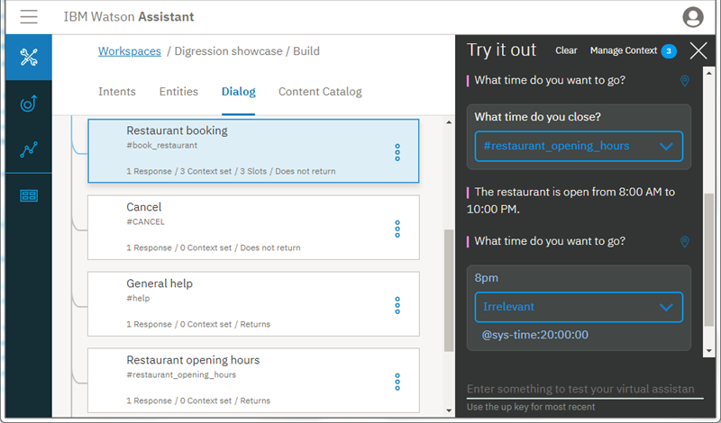

---

copyright:
  years: 2015, 2019
lastupdated: "2019-02-12"

subcollection: assistant

---

{:shortdesc: .shortdesc}
{:new_window: target="_blank"}
{:deprecated: .deprecated}
{:important: .important}
{:note: .note}
{:tip: .tip}
{:pre: .pre}
{:codeblock: .codeblock}
{:screen: .screen}
{:javascript: .ph data-hd-programlang='javascript'}
{:java: .ph data-hd-programlang='java'}
{:python: .ph data-hd-programlang='python'}
{:swift: .ph data-hd-programlang='swift'}

# 教程：了解离题
{: #tutorial-digressions}

在本教程中，您将直接了解离题的工作原理。
{: shortdesc}

## 学习目标
{: #tutorial-digressions-objectives}

完成本教程后，您将了解：

- 如何设计有效的离题
- 离题设置如何影响对话流
- 如何测试对话的离题设置

### 持续时间
{: #tutorial-digressions-duration}

完成本教程大约需要 20 分钟。

### 先决条件
{: #tutorial-digressions-prereqs}

如果您没有 {{site.data.keyword.conversationshort}} 实例，请完成[入门教程](/docs/services/assistant?topic=assistant-getting-started#getting-started-prerequisites)中的**开始之前**步骤以创建一个实例。

## 步骤 1：导入离题展示对话技能
{: #tutorial-digressions-import-json}

首先，您需要将*离题展示*对话技能导入到 {{site.data.keyword.conversationshort}} 实例中。

1.  下载 [digression-showcase.json](https://github.com/watson-developer-cloud/community/raw/master/watson-assistant/digression-showcase.json) 文件。
1.  在您的 {{site.data.keyword.conversationshort}} 实例中，单击  图标。
1.  单击**选择文件**，然后选择先前下载的 **digression-showcase.json** 文件。
1.  单击**导入**以完成导入对话技能的操作。

## 步骤 2：暂时离开对话
{: #tutorial-digressions-temporarily-digress-away}

通过离题，用户可以离开对话分支，暂时更换主题，然后再返回到原始对话流。在此步骤中，您将先进行餐厅预订，然后离开此对话以询问餐厅营业时间。服务会在提供营业时间信息后返回到餐厅预订对话流。

1.  单击**对话**，以从意向页面切换到对话树视图。

1.  单击  图标，以打开“试用”窗格。
1.  在文本字段中，输入`我要预订餐厅`。

    服务会提示您输入预订日：`您要哪天去就餐？`

1.  单击响应旁边的**位置**  图标，以突出显示对话树中触发了响应的节点，即**餐厅预订**节点。

    
1.  输入`明天`。

    服务会提示您输入预订时间：`您要几点去就餐？`

1.  您不知道餐厅何时关门，于是您会问：`几点关门？`

    机器人会离开“餐厅预订”节点，转去处理**餐厅营业时间**节点。它会进行以下响应：`餐厅营业时间为上午 8:00 至晚上 10:00。`然后，服务会返回到“餐厅预订”节点，并再次提示您输入预订时间。

    
1.  **可选**：要完成对话流，请将预订时间输入为 `8pm`，将就餐人数输入为 `2`。

恭喜您！您已成功离开并返回到对话流。

## 步骤 3：禁用槽离题
{: #tutorial-digressions-disable-slot}

在此步骤中，您将编辑“餐厅预订”节点的离题设置，以防止用户离题，并了解设置更改如何影响对话流。

1.  下面我们来看看**餐厅预订**节点的当前离题设置。单击该节点以在编辑视图中将其打开。

1.  单击**定制**，然后单击**离题**选项卡。

    

1.  将**允许离题**开关从“开启”切换为**关闭**，然后单击**应用**。

1.  单击  以关闭节点编辑视图。

1.  在“试用”窗格中，单击**清除**以重置对话。

1.  输入`我要预订餐厅`。

    服务会提示您输入预订日：`您要哪天去就餐？`

1.  输入`明天`。

    服务会提示您输入预订时间：`您要几点去就餐？`

1.  询问：`几点关门？`

    服务会识别出该问题将触发 #restaurant_opening_hours 意向，但会将其忽略，并再次显示与 @sys-time 槽关联的提示。

您已成功阻止用户离开餐厅预订过程。

## 步骤 4：离开到不返回的节点
{: #tutorial-digressions-digress-without-return}

您可以将对话节点配置为不返回到服务离开的节点，而是让服务处理当前节点。要实现这一点，您需要更改“餐厅营业时间”节点的离题设置。在步骤 2 中您看到，服务在离开“餐厅预订”节点而转到“餐厅营业时间”节点后，返回到了“餐厅预订”节点并继续执行预订过程。在本练习中，当您更改设置后，您会离开**就业机会**对话，而去询问餐厅营业时间，此时您会看到服务不会返回到之前离开的节点。

1.  单击以打开**餐厅营业时间**节点。

1.  单击**定制**，然后单击**离题**选项卡。

1.  展开**离题可以进入此节点**部分，然后取消选中**离题后返回**复选框。单击**应用**，然后单击  以关闭节点编辑视图。

1.  在“试用”窗格中，单击**清除**以重置对话。

1.  要与**就业机会**对话节点进行互动，请输入`我正在找工作`。

    服务会进行以下响应：`我们一直在寻找优秀人才加入我们的团队。您对哪种类型的工作感兴趣？`

1.  不要回答此问题，而是询问机器人一个不相干的问题。输入`几点开门？`

    服务会离开“就业机会”节点而转到“餐厅营业时间”节点来回答您的问题。服务会进行以下响应：`餐厅营业时间为上午 8:00 至晚上 10:00。`

    与先前测试不同，这一次对话没有从**就业机会**节点中的停止位置继续进行。服务不会返回到进行中的对话，因为您已将**餐厅营业时间**节点的设置更改为不返回。

    

恭喜您！您已成功离开对话而没有返回。

## 摘要
{: #tutorial-digressions-summary}

在本教程中，您了解了离题的工作原理，还了解了各个对话节点设置如何影响离题行为。

## 后续步骤
{: #tutorial-digressions-next-steps}

有关对话离题配置的帮助，请参阅[离题](/docs/services/assistant?topic=assistant-dialog-runtime#dialog-runtime-digressions)。
