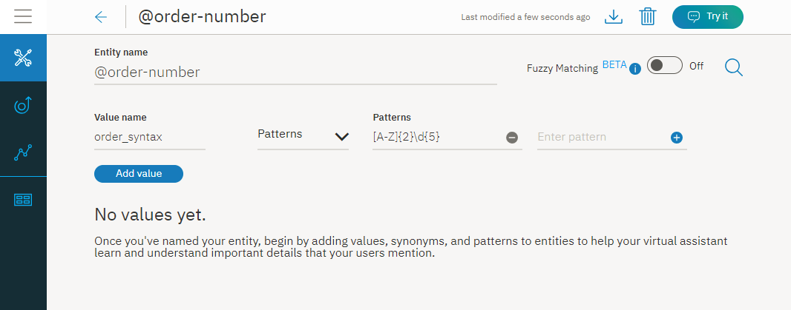
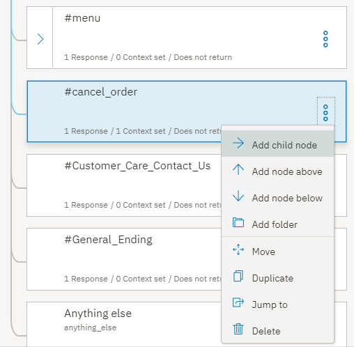
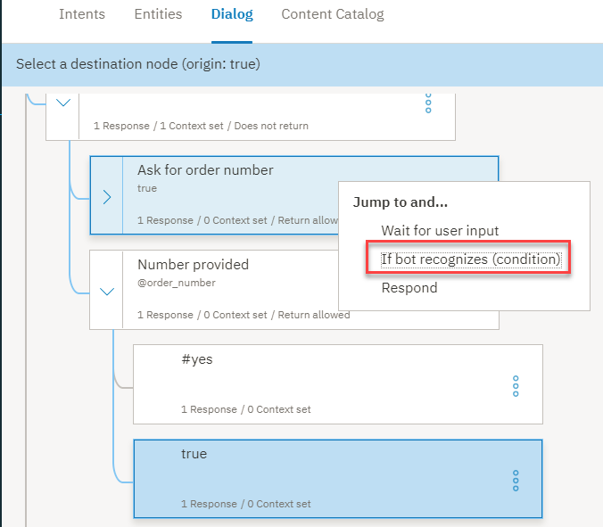
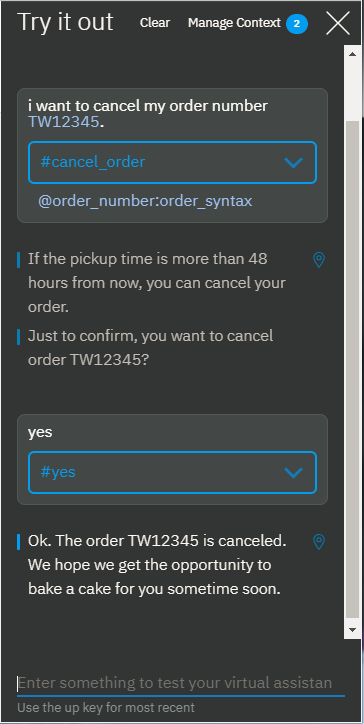

---

copyright:
  years: 2015, 2019
lastupdated: "2019-02-28"

subcollection: assistant

---

{:shortdesc: .shortdesc}
{:new_window: target="_blank"}
{:deprecated: .deprecated}
{:important: .important}
{:note: .note}
{:tip: .tip}
{:pre: .pre}
{:codeblock: .codeblock}
{:screen: .screen}
{:javascript: .ph data-hd-programlang='javascript'}
{:java: .ph data-hd-programlang='java'}
{:python: .ph data-hd-programlang='python'}
{:swift: .ph data-hd-programlang='swift'}
{:gif: data-image-type='gif'}

# 教程：构建复杂对话
{: #tutorial}

在本教程中，您将使用 {{site.data.keyword.conversationshort}} 服务来为助手创建一个对话，帮助用户查询一家名为 *Truck Stop Gourmand* 的虚构餐厅。
{: shortdesc}

## 学习目标
{: #tutorial-objectives}

完成本教程后，您将了解如何执行以下操作：

- 计划对话
- 定义定制意向
- 添加可处理意向的对话节点
- 添加实体以使响应更具体
- 添加模式实体，并在对话中使用它来查找用户输入中的模式
- 设置和引用上下文变量

### 持续时间
{: #tutorial-duration}

完成本教程大约需要 2 到 3 个小时。

### 先决条件
{: #tutorial-prereqs}

开始之前，请先完成[入门教程](/docs/services/assistant?topic=assistant-getting-started)。

您将使用您所创建的教程技能，向您在入门练习中构建的简单对话添加节点。

## 步骤 1：规划对话
{: #tutorial-plan}

您正在为一家名为 *Truck Stop Gourmand* 的餐厅构建一个助手，该餐厅有一个地理位置，其蛋糕烘焙生意非常红火。您希望助手能够简单地回答有关餐厅和菜单的用户问题，还能取消客户蛋糕订单。因此，您需要创建一些意向来处理与以下主题相关的查询：

- 餐厅信息
- 菜单详细信息
- 订单取消

首先，您需要创建一些意向来表示这些主题，然后构建一个对话来回答主题相关的用户问题。

## 步骤 2：回答餐厅相关问题
{: #tutorial-add-about-intent}

添加一个意向来识别客户提出的有关餐厅详细信息的问题。意向是用户输入中表达的目的或目标。随附于*常规*内容目录的 `#General_About_You` 意向提供了类似功能，但其用户示例主要针对助手相关查询，而不是使用助手来帮助客户的情况。因此，您需要添加自己的意向。

### 添加 #about_restaurant 意向
{: #tutorial-add-about-restaurant}

1.  在**意向**选项卡中，单击**添加意向**。

    
1.  在*意向名称*字段中输入 `about_restaurant`，然后单击**创建意向**。

    
1.  添加以下用户示例：

    ```
    介绍一下餐厅
    我想了解一下餐厅
    餐厅老板是谁，餐厅理念是什么？
    有餐厅故事吗？
    食材是从哪里采购的？
    谁是主厨，他的背景是什么？
    餐厅有几个地点？
    承办或主办宴席吗？
    送外卖吗？
    早餐时间营业吗？
    ```
    {: screen}

1.  单击**关闭**  图标，以完成添加 `#about_restaurant` 意向的操作。

您添加了一个意向，并提供了实际用户可能输入的用于触发此意向的发声示例。

### 添加由 #about_restaurant 意向触发的对话节点
{: #tutorial-trigger-about-intent}

添加一个对话节点，用于识别用户输入映射到您在上一步中创建的意向的情况，这意味着该节点的条件会检查服务是否从用户输入中识别出 `#about_restaurant` 意向。

1.  单击**对话**选项卡。
1.  在对话树中找到 `#General_Greetings` 节点。

    您需要在此初始问候语节点之下添加一个节点，用于检查餐厅相关问题，以反映您所期望的正常会话流。例如，`您好，``请自我介绍一下。`

1.  单击 `#General_Greetings` 节点上的**更多**  图标，然后选择**在下方添加节点**。

    
1.  在此节点的**输入条件**字段中，开始输入 `#about_restaurant`。然后选择 `#about_restaurant` 选项。
1.  添加以下文本作为响应：

    ```
    Truck Stop Gourmand 是 Gloria 和 Fred Smith 的智慧结晶。我们从 2004 年的一辆餐车起家，现在已经发展成为一家生意兴隆的餐厅。现在，我们在波特兰市中心有一家实体餐厅。为了满足厨房扩张的需求，我们聘请了新的厨师，每位厨师都严格秉承着采用新鲜的当地食材以创新方式烹调美味佳肴的理念，这让 Smith 餐车广受欢迎。我们每周 7 天的午餐或晚餐时间营业。我们还提供蛋糕订购业务。
    ```
    {: codeblock}

1.  此外，在响应中添加一个图像。

    单击**添加响应类型**。从下拉列表中选择**图像**。在**图像源**字段中，添加 `https://www.ibmlearningcenter.com/wp-content/uploads/2018/02/IBM-Learning-Center-Food4.jpg`。
1.  将图像响应类型向上移动，以便先在响应中显示图像，然后再显示文本。单击向上**移动**箭头，以重新排序这两个响应类型。

    

1.  单击  以关闭编辑视图。

### 测试 #about_restaurant 对话节点
{: #tutorial-test-about-intent}

要测试意向，您可以检查用户发声（类似于但不完全等同于您所添加的训练数据示例）是否已成功对服务进行训练，使其能够识别具有 `#about_restaurant` 意向的输入。

1.  单击  图标，以打开“试用”窗格。

1.  输入`我想了解有关餐厅的更多信息。`

    服务会指示已识别 `#about_restaurant` 意向，并会返回您为对话节点指定的图像和文本响应内容。

    

恭喜您！您已添加一个定制意向和一个知道如何处理该意向的对话节点。

`#about_restaurant` 意向可识别有关餐厅的各种常见问题。您添加了一个节点来捕获此类问题。响应时间有点长，但它是单个语句，可回答有关以下所有主题的问题：

- 餐厅老板
- 餐厅历史
- 餐厅理念
- 地点数量
- 营业天数
- 提供午餐和晚餐
- 餐厅接受蛋糕订单这一事实

对于易于回答的一般性问题，一个简单的一般性回答足矣。

## 步骤 3：回答菜单相关问题
{: #tutorial-menu}

潜在餐厅客户主要会询问菜单相关问题。Truck Stop Gourmand 餐厅每天都会更换菜单。除了标准菜单外，还有素食菜单和蛋糕店菜单。当用户询问菜单时，对话需要找到要共享的菜单，并提供一个菜单超链接，以便用户可以前往餐厅 Web 站点来查看每日最新菜单。对于定期更改的信息，您肯定不会希望将该信息硬编码到对话节点中。

### 添加 #menu 意向
{: #tutorial-add-menu-intent}

1.  单击**意向**选项卡。
1.  单击**添加意向**。

    

1.  在*意向名称*字段中输入 `#menu`，然后单击**创建意向**。

    

1.  添加以下用户示例：

    ```
    我想看一下菜单
    你们餐厅有什么好吃的？
    今天有什么特色菜？
    在哪里可以了解一下你们的菜系？
    你们餐厅有什么菜？
    开胃菜有哪些？
    有甜点吗？
    菜品价格范围是多少？
    正常一道菜的价格是多少？
    介绍一下主菜
    有套餐吗？
    ```
    {: screen}

1.  单击**关闭**  图标，以完成添加 `#menu` 意向的操作。

### 添加由 #menu 意向触发的对话节点
{: #tutorial-trigger-menu-intent}

添加一个对话节点，用于识别用户输入映射到您在上一步中创建的意向的情况，这意味着该节点的条件会检查服务是否从用户输入中识别出 `#menu` 意向。

1.  单击**对话**选项卡。
1.  在对话树中找到 `#about_restaurant` 节点。

    您需要在此节点之下添加一个节点，用于检查菜单相关问题。

1.  单击 `#about_restaurant` 节点上的**更多**  图标，然后选择**在下方添加节点**。

    

1.  在此节点的**输入条件**字段中，开始输入 `#menu`。然后，选择 `#menu` 选项。

    

1.  添加以下文本作为响应：

    `我们承诺只提供新鲜的当地食材，我们的菜单会每天更换，以反映我们早上采摘的食材。您可以在我们的 Web 站点上查看今天的菜单。`

1.  添加*选项*响应类型来提供可供用户选择的选项列表。在本例中，选项列表包含可供选择的不同版本的菜单。

    单击**添加响应类型**。从下拉列表中选择**选项**。

    

1.  在**标题**字段中，添加*您想看哪个菜单？*

    

1.  单击**添加选项**。

1.  在**标签**字段中，添加`标准`。所添加的标签文本将作为可选选项显示在提供给用户的响应中。

1.  在**值**字段中，添加`标准菜单`。所指定的值文本是用户从列表中选择的选项，当用户单击此选项时，系统会将其作为新的用户输入发送给服务。

1.  重复上述两个步骤，以添加其余菜单类型的标签和值信息：

    <table>
    <caption>选项响应类型详细信息</caption>
    <tr>
      <th>标签</th>
      <th>值</th>
    </tr>
    <tr>
      <td>素食</td>
      <td>素食菜单</td>
    </tr>
    <tr>
      <td>蛋糕店</td>
      <td>蛋糕店菜单</td>
    </tr>
    </table>

    

1.  单击  以关闭编辑视图。

### 添加 @menu 实体
{: #tutorial-add-menu-entity}

要根据客户指示来识别客户想要查看的菜单类型，您需要添加一个 `@menu` 实体。实体代表了对象类或与用户目的相关的数据类型。您可以通过检查用户输入中是否存在特定实体来添加更多响应，让每个响应来处理不同的用户请求。在本例中，您需要添加一个 `@menu` 实体，用于区分不同的菜单类型。

1.  单击**实体**选项卡。

    

1.  单击**添加实体**。

1.  在实体名称字段中输入 `@menu`。

    

1.  单击**创建实体**。

1.  将`标准`添加到*值名称*字段，将`标准菜单`添加到**同义词**字段，然后按 Enter 键。

1.  添加以下其他同义词：

    - 菜谱
    - 菜系
    - 今日精选

    

1.  单击**添加值**，以添加 `@menu:standard` 值。

1.  将`素食`添加到*值名称*字段，将`素食菜单`添加到**同义词**字段，然后按 Enter 键。

1.  单击**显示建议**，然后单击*无肉饮食*、*无肉*和*纯素食*复选框。

1.  单击**添加所选项**。

1.  单击空的*添加同义词*字段，然后添加以下其他同义词：

    - 纯素
    - 仅限植物

    

1.  单击**添加值**，以添加 `@menu:vegetarian` 值。

1.  将`蛋糕`添加到*值名称*字段，将`蛋糕菜单`添加到**同义词**字段，然后按 Enter 键。

1.  添加以下其他同义词：

    - 蛋糕店菜单
    - 甜点菜单
    - 烘焙产品

    

1.  单击**添加值**，以添加 `@menu:cake` 值。

1.  单击**关闭**  图标，以完成添加 `@menu` 实体的操作。

### 添加由 @menu 实体类型触发的子节点
{: #tutorial-trigger-menu-entity}

在此步骤中，您将向对话节点添加用于检查 `#menu` 意向的子节点。每个子节点都将显示不同的响应，具体取决于用户从选项列表中选择的 `@menu` 实体类型。

1.  单击**对话**选项卡。
1.  在对话树中找到 `#menu` 节点。

    您需要添加一个子节点，用于处理您添加到 `#menu` 节点的每个菜单类型选项。

1.  单击 `#menu` 节点上的**更多**  图标，然后选择**添加子节点**。

    

1.  在此节点的**输入条件**字段中，开始输入 `@menu:standard`。然后，选择 `@menu:standard` 选项。

1.  在响应文本字段中添加以下消息：`要查看菜单，请前往我们 Web 站点上的<a href="https://www.example.com/menu.html" target="blank">菜单</a>页面。`

    

1.  单击  以关闭编辑视图。

1.  单击 `@menu:standard` 节点上的**更多**  图标，然后选择**在下方添加节点**。

1.  在此节点的**输入条件**字段中，开始输入 `@menu:vegetarian`。然后，选择 `@menu:vegetarian` 选项。

1.  在响应文本字段中添加以下消息：`要查看素食菜单，请前往我们 Web 站点上的<a href="https://www.example.com/vegetarian-menu.html" target="blank">素食菜单</a>页面。`

    

1.  单击  以关闭编辑视图。

1.  单击 `@menu:vegetarian` 节点上的**更多**  图标，然后选择**在下方添加节点**。

1.  在此节点的**输入条件**字段中，开始输入 `@menu:cake`。然后，选择 `@menu:cake` 选项。

1.  在响应文本字段中添加以下消息：`要查看蛋糕店菜单，请前往我们 Web 站点上的<a href="https://www.example.com/menu.html" target="blank">蛋糕店菜单</a>页面。`

    

1.  单击  以关闭编辑视图。

1.  标准菜单应该是最常被请求的菜单，因此请将其移至子节点列表的底部。将其移至底部，有助于防止用户在请求特色菜单而不是标准菜单时意外触发此菜单。

1.  单击 `@menu:standard` 节点上的**更多**  图标，然后选择**移动**。

    

1.  选择 `@menu:cake` 节点，然后选择**节点下方**。

    

您已添加用于识别用户的菜单详细信息请求的节点。您的响应会通知用户有三种类型的菜单可供选择，并要求他们从中选择一个。当用户选择某个菜单类型时，系统会显示相应的响应，其中包含所请求菜单详细信息网页的超文本链接。

### 测试菜单选项对话节点
{: #tutorial-test-menu-options-intent}

测试您添加用于识别菜单问题的对话节点。

1.  单击  图标，以打开“试用”窗格。

1.  输入`你们提供什么类型的食物？`

    服务会指示已识别 `#menu` 意向，并显示菜单选项列表供用户选择。

    
1.  单击`蛋糕店`选项。

    服务识别到 `#menu` 意向和 `@menu:cake` 实体引用后，会显示以下响应：`要查看蛋糕店菜单，请访问我们 Web 站点上的蛋糕店页面。`

    
1.  单击响应中的*蛋糕店*超链接。

    这将打开一个新的 Web 浏览器页面并显示 example.com Web 站点。

1.  关闭该 Web 浏览器页面。

非常棒！您已成功添加了意向和实体，不但可以识别用户的菜单详细信息请求，而且还可以将用户定向到相应的菜单。

`#menu` 意向代表了潜在餐厅客户的一种非常常见的主要需求。由于其重要性和普遍性，您在对话中添加了一个较为复杂的部分来很好地解决此问题。

## 步骤 4：管理蛋糕订单
{: #tutorial-manage-orders}

客户亲自拨打电话或使用 Web 站点上的订购表单来下订单。下订单后，用户可以通过虚拟助手取消订单。首先，您需要定义一个可识别订单号的实体。然后，添加一个意向，用于识别用户想要取消蛋糕订单的情况。

### 添加订单号模式实体
{: tutorial-add-pattern-entity}

要让助手能够识别订单号，您需要创建一个模式实体来识别餐厅用于标识其订单的唯一格式。餐厅烘焙部门使用的订单号语法是 2 个大写字母，后跟 5 个数字。例如，`YR34663`。请添加一个可识别此字符模式的实体。

1.  单击**实体**选项卡。
1.  单击**添加实体**。
1.  在实体名称字段中输入 `@order_number`。
1.  单击**创建实体**。

    
1.  将 `order_syntax` 添加到*值名称*字段，然后单击**同义词**旁边的向下箭头，将类型更改为**模式**。

    
1.  将以下正则表达式添加到“模式”字段：`[A-Z]{2}\d{5}`

    

1.  单击**添加值**。

    

1.  单击**关闭**  图标，以完成添加 `@order_number` 实体的操作。

    

### 添加取消订单意向
{: #tutorial-cancel-order-intent}

1.  单击**意向**选项卡。
1.  单击**添加意向**。
1.  在*意向名称*字段中输入 `#cancel_order`，然后单击**创建意向**。
1.  添加以下用户示例：

    ```
    我想取消蛋糕订单
    我需要取消刚刚提交的订单
    我可以取消蛋糕订单吗？
    我想取消订单
    事情有变。我需要取消蛋糕订单。
    请取消我上周提交的生日蛋糕订单
    聚会主题变了；我们不再需要蛋糕了
    我提交的那个订单，我需要取消。
    ```
    {: screen}

    
1.  单击**关闭**  图标，以完成添加 `#cancel_order` 意向的操作。

### 添加肯定回答意向
{: #tutorial-yes-intent}

在代表用户执行操作之前，必须获得用户确认，以确保所执行的操作正确无误。请向对话添加一个 #yes 意向，用于识别用户同意服务的提议的情况。

1.  单击**意向**选项卡。
1.  单击**添加意向**。
1.  在*意向名称*字段中输入 `#yes`，然后单击**创建意向**。
1.  添加以下用户示例：

    ```
    是的
    对的
    请这样做。
    您说得没错。
    请这样做吧。
    这样是对的。
    这是对的
    对
    对对
    是的，我想这样做。
    ```
    {: screen}

    
1.  单击**关闭**  图标，以完成添加 `#yes` 意向的操作。

### 添加用于管理取消订单请求的对话节点
{: #tutorial-cancel-order-dialog}

现在，添加一个用于处理取消蛋糕订单请求的对话节点。

1.  单击**对话**选项卡。
1.  找到 `#menu` 节点。单击 `#menu` 节点上的**更多**  图标，然后选择**在下方添加节点**。
1.  在此节点的**输入条件**字段中，开始输入 `#cancel_order`。然后，选择 `#cancel_order` 选项。
1.  在响应文本字段中添加以下消息：

    ```
    如果从现在起提货时间超过 48 小时，您可以取消订单。
    ```
    {: codeblock}

    

    在实际取消订单之前，您需要知道订单号。用户会在原始请求中指定订单号。因此，为了避免再次询问订单号，请使用原始输入中的订单号模式来检查数字。要执行此操作，请定义一个上下文变量来保存所指定的订单号。

1.  打开上下文编辑器。单击**更多**  图标，然后选择**打开上下文编辑器**。

    
1.  输入以下上下文变量名称和值对：

    <table>
    <caption>订单号上下文变量详细信息</caption>

    <tr>
      <th>变量</th>
      <th>值</th>
    </tr>
    <tr>
      <td>$ordernumber</td>
      <td><? @order_number.literal ?></td>
    </tr>
    </table>

    上下文变量值 (`<? @order_number.literal ?>`) 是一个 SpEL 表达式，用于捕获与 @order_number 模式实体定义的模式相匹配的用户指定的数字。它会将数字保存到 `$ordernumber` 变量中。

    
1.  单击  以关闭编辑视图。

    现在，添加子节点来询问订单号，或者让用户确认其想要取消具有所检测订单号的订单。
1.  单击 `#cancel_order` 节点上的**更多**  图标，然后选择**添加子节点**。

    
1.  为该节点添加标签，以区别于要添加的其他子节点。在“名称”字段中，添加`询问订单号`。在此节点的**输入条件**字段中输入 `true`。

1.  在响应文本字段中添加以下消息：

    ```
    订单号是多少？
    ```
    {: codeblock}

    
1.  单击  以关闭编辑视图。

    现在，添加另一个子节点，通知用户您要取消订单。
1.  单击`询问订单号`节点上的**更多**  图标，然后选择**添加子节点**。
1.  在此节点的**输入条件**字段中输入 `@order_number`。
1.  打开上下文编辑器。单击**更多**  图标，然后选择**打开上下文编辑器**。
1.  输入以下上下文变量名称和值对：

    <table>
    <caption>订单号上下文变量详细信息</caption>

    <tr>
      <th>变量</th>
      <th>值</th>
    </tr>
    <tr>
      <td>$ordernumber</td>
      <td><? @order_number.literal ?></td>
    </tr>
    </table>

    上下文变量值 (`<? @order_number.literal ?>`) 是一个 SpEL 表达式，用于捕获与 @order_number 模式实体定义的模式相匹配的用户指定的数字。它会将数字保存到 `$ordernumber` 变量中。
1.  在响应文本字段中添加以下消息：

    ```
    好的。订单 $ordernumber 已取消。我们期待您的下一个蛋糕订单。
    ```
    {: codeblock}

    
1.  单击  以关闭编辑视图。
1.  添加另一个节点，用于捕获用户所提供的数字不是有效订单号的情况。单击 `@order_number` 节点上的**更多**  图标，然后选择**在下方添加节点**。
1.  在此节点的**输入条件**字段中输入 `true`。
1.  在响应文本字段中添加以下消息：

    ```
    我需要订单号才能为您取消订单。如果您不知道订单号，请拨打电话 958-234-3456 来取消订单。
    ```
    {: codeblock}

    
1.  单击  以关闭编辑视图。

1.  在初始订单取消请求节点下方添加一个节点，用于对用户在初始请求中提供了订单号而您无需再次询问的情况进行响应。单击 `#cancel_order` 节点上的**更多**  图标，然后选择**添加子节点**。
1.  为该节点添加标签，以区别于其他子节点。在“名称”字段中，添加`提供的订单号`。在此节点的**输入条件**字段中输入 `@order_number`。
1.  在响应文本字段中添加以下消息：

    ```
    请确认，您是要取消订单 $ordernumber 吗？
    ```
    {: codeblock}

    
1.  单击  以关闭编辑视图。

    必须添加子节点来检查用户对您的确认问题的响应。
1.  单击`提供的订单号`节点上的**更多**  图标，然后选择**添加子节点**。
1.  在此节点的**输入条件**字段中输入 `#yes`。

1.  在响应文本字段中添加以下消息：

    ```
    好的。订单 $ordernumber 已取消。我们期待您的下一个蛋糕订单。
    ```
    {: codeblock}

    
1.  单击  以关闭编辑视图。

1.  单击 `#yes` 节点上的**更多**  图标，然后选择**在下方添加节点**。

1.  在此节点的**输入条件**字段中输入 `true`。

    不要添加响应。您需要将用户重定向到您先前创建的用于询问订单号详细信息的分支。

1.  在*最后*部分中，选择**跳转至**。

    
1.  选择*询问订单号*节点的条件。

    
1.  单击  以关闭编辑视图。
1.  将*提供的订单号*节点移动到*询问订单号*节点的上方。单击`提供的订单号`节点上的**更多**  图标，然后选择**移动**。选择*询问订单号*节点，然后单击**节点上方**。

    
1.  强制会话在运行时对 `#cancel_order` 节点下的子节点求值。单击以在编辑视图中打开 `#cancel_order` 节点，然后在`最后`部分中，选择`跳过用户输入`。

    

### 测试订单取消
{: #tutorial-test-cancel-order}

测试服务是否可以识别与用户输入中产品订单号模式相匹配的字符模式。

1.  单击  图标，以打开“试用”窗格。

1.  输入`我想取消订单 TW12345。`

    服务会识别 `#cancel_order` 意向和 `@order_number` 实体。它会进行以下响应：`如果从现在起提货时间超过 48 小时，您可以取消订单。请确认，您是要取消订单 TW12345 吗？`

1.  输入`是的`。

    服务会识别 `#yes` 意向，并进行以下响应：`好的。订单 TW12345 已取消。我们期待您的下一个蛋糕订单。`

    

    现在，试一试处理您不知道订单号的情况。
1.  在“试用”窗格中，单击**清除**以重新开始。输入`我想取消订单。`

    服务会识别 `#cancel_order` 意向，并进行以下响应：`如果从现在起提货时间超过 48 小时，您可以取消订单。订单号是多少？`

1.  输入`我不知道。`

    服务会进行以下响应：`我需要订单号才能为您取消订单。如果您不知道订单号，请拨打电话 958-234-3456 来取消订单。`

    

在不断测试的过程中，您可能会发现，该对话对于用户记不清订单号格式的情况并不是很有用。用户可能只记得数字或字母，而忘了字母要大写。在这些情况下，要是为他们提供一个提示，会不会很好呢？要让对话更友好，可以在对话树中添加另一个节点，用于检查用户输入中的数字。

1.  查找 `@order_number` 节点，它是*询问订单号*节点的子节点。

1.  单击 `@order_number` 节点上的**更多**  图标，然后选择**在下方添加节点**。

1.  在条件字段中，添加 `input.text.find('\d')`，这是一个 SpEL 表达式，当您在用户输入中找到一个或多个数字时，即会触发此响应。

1.  在文本响应字段中，添加以下响应：

    ```
    我们订单号的正确格式是 AAnnnnn。A 代表 2 个大写字母，n 代表 5 个数字。您的订单号是这种格式吗？
    ```
    {: codeblock}

1.  单击  以关闭编辑视图。

1.  单击 `input.text.find('\d')` 节点上的**更多**  图标，然后选择**添加子节点**。

1.  在此节点的**输入条件**字段中输入 `true`。

1.  通过单击**定制**，然后将*多个响应*开关切换为**开启**来启用条件响应。

1.  单击**应用**。

1.  在新添加的*如果机器人识别*字段中，输入 `@order_number`，然后在*响应*字段中输入：

    ```
    好的。订单 $ordernumber 已取消。我们期待您的下一个蛋糕订单。
    ```
    {: codeblock}

1.  单击**添加响应**。

1.  在*如果机器人识别*字段中输入 `true`，然后在*响应*字段中输入：

    ```
    我需要订单号才能为您取消订单。如果您不知道订单号，请拨打电话 958-234-3456 来取消订单。
    ```
    {: codeblock}

    
1.  单击  以关闭编辑视图。

现在，在测试时，您可以提供一组数字或数字和文本的混合作为输入，对话会提示您正确的订单号格式。您已成功测试对话，发现了其中的缺陷，并对其进行了更正。

处理此类场景的另一种方法是添加带槽的节点。要了解有关使用槽的更多信息，请参阅[向对话添加带槽的节点](/docs/services/assistant?topic=assistant-tutorial-slots)教程。
{:tip}

## 步骤 5：添加个人风格
{: #tutorial-get-username}

如果用户对机器人本身表现出兴趣，您会希望虚拟助手能够识别这种好奇心，并以更个性化的方式与用户互动。您还记得 `#General_About_You` 意向吗？该意向随附于*常规*内容目录，我们曾在添加定制 `#about_restaurant` 意向之前想要使用该意向。此意向是专为识别用户的这些问题而构建的。请添加一个以此意向为条件的节点。您可以在响应中询问用户的姓名，然后将其保存到 $username 变量中，以根据需要在对话中的其他位置使用。

首先，您需要确保服务能够识别用户提供的姓名。为此，可以启用 `@sys-person` 实体，其可识别常见的姓氏和名字（英语）。

### 添加个人系统实体
{: #tutorial-add-person-entity}

服务提供了一些*系统实体*，这些常见实体可用于任何应用程序。

1.  单击**实体**选项卡，然后单击**系统实体**。

1.  找到 *`@sys-person`* 实体切换开关，将其切换为**开启**。

    

### 添加用于处理机器人相关问题的节点
{: #tutorial-add-about-you-node}

现在，添加一个对话节点，用于识别用户对机器人的兴趣并进行响应。

1.  单击**对话**选项卡。
1.  在对话树中找到`欢迎`节点。
1.  单击`欢迎`节点上的**更多**  图标，然后选择**在下方添加节点**。
1.  在此节点的**输入条件**字段中，开始输入 `#General_About_You`。然后，选择 `#General_About_You` 选项。
1.  在响应文本字段中添加以下消息：

    ```
    我是一名虚拟助手，负责回答有关 Truck Stop Gourmand 餐厅的问题。您叫什么名字？
    ```
    {: codeblock}

    
1.  单击  以关闭编辑视图。
1.  单击 `#General_About_You` 节点上的**更多**  图标，然后选择**添加子节点**。
1.  在此节点的**输入条件**字段中，开始输入 `@sys-person`。然后，选择 `@sys-person` 选项。
1.  在响应文本字段中添加以下消息：

    ```
    <? @sys-person.literal ?>，您好！很高兴认识您。今天，有什么能为您效劳的吗？
    ```
    {: codeblock}

1.  要捕获用户提供的姓名，请向节点中添加一个上下文变量。单击**更多**  图标，然后选择**打开上下文编辑器**。
1.  输入以下上下文变量名称和值对：

    <table>
    <caption>用户名上下文变量详细信息</caption>

    <tr>
      <th>变量</th>
      <th>值</th>
    </tr>
    <tr>
      <td>$username</td>
      <td><? @sys-person.literal ?></td>
    </tr>
    </table>

    上下文变量值 (`<? @sys-person.literal ?>`) 是一个 SpEL 表达式，用于捕获用户指定的用户名，然后将其保存到 `$username` 上下文变量中。

    
1.  单击  以关闭编辑视图。
1.  单击 `@sys-person` 节点上的**更多**  图标，然后选择**在下方添加节点**。

    这将添加一个节点，用于捕获未包含姓名的用户响应。如果用户选择不共享姓名，您会希望机器人能够继续进行对话。
1.  在此节点的**输入条件**字段中输入 `true`。
1.  在响应文本字段中添加以下消息：

    ```
    今天，有什么能为您效劳的吗？
    ```
    {: codeblock}

    
1.  单击  以关闭编辑视图。

如果在运行时用户触发此节点并提供了姓名，那么您就会知道用户的姓名。当您知道了用户姓名后，就应该好好地使用它！您可以向先前添加的问候语对话节点中添加条件响应，使其包含一个使用已知用户姓名的条件响应。

### 向问候语添加用户姓名
{: #tutorial-add-username-to-greeting}

如果您知道用户姓名，那么应该将其加入到问候语中。要执行此操作，请添加条件响应，并加入一个包含用户姓名的问候语变体。

1.  在对话树中找到 `#General_Greetings` 节点，然后单击以在编辑视图中打开该节点。
1.  单击**定制**，然后将*多个响应*开关切换为**开启**。

    
1.  单击**应用**。

    
1.  单击**添加响应**。
1.  在*如果机器人识别*字段中输入 `$username`，然后在*响应*字段中输入：

    ```
    $username，祝您有个美好的一天！
    ```
    {: codeblock}

1.  单击响应 2 的向上箭头以进行移动，使其在响应 1（`祝您有个美好的一天！`）之前列出。

    
1.  单击  以关闭编辑视图。

### 测试个性化
{: #tutorial-test-personalize}

测试服务是否可以识别并保存用户姓名，然后在对话中使用该姓名。

1.  单击  图标，以打开“试用”窗格。

1.  单击**清除**以重新开始对话会话。

1.  输入`您是谁？`

    服务会识别 `#General_About_You` 意向。它会在响应末尾提出以下问题：`您叫什么名字？`
1.  输入`我叫 Jane Doe。`

    服务会将 `Jane Doe` 识别为 `@sys-person` 实体提及项。它会使用该姓名来问候您，然后询问您需要什么帮助。
1.  输入`您好。`

    服务识别到 `#General_Greetings` 意向后会说：`Jane Doe，祝您有个美好的一天！`在问候语节点被触发时，`$username` 上下文变量中包含一个值，因此服务会使用包含用户姓名的条件响应。

    

您可以添加一个条件响应，使其以用户姓名为条件，并将用户姓名用于任何其他响应中，以通过个性化来增加会话价值。

## 步骤 6：从网页集成测试助手
{: #tutorial-integrate-assistant}

现在，您已构建一个较为复杂的助手，请返回到您在上一个教程中部署的公共网页，然后测试您添加的新功能。

1.  打开助手。
1.  在*集成*区域中，单击**预览链接**。
1.  单击页面上显示的 URL。

    这将在新选项卡中打开该页面。
1.  重复使用您提交给“试用”窗格的一些测试发声，看看助手在实际集成中如何操作。

    与从“试用”窗格向服务发送测试发声时不同，标准使用量费用会应用到由提交给交谈窗口小部件的发声所产生的 API 调用。
    {: note}

## 后续步骤
{: #tutorial-deploy}

现在，您已构建并测试了对话技能，可以将其共享给客户了。要部署对话技能，请先将对话技能连接到助手，然后部署助手。有多种方式可以执行此操作。有关更多详细信息，请参阅[添加集成](/docs/services/assistant?topic=assistant-deploy-integration-add)。
