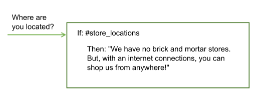
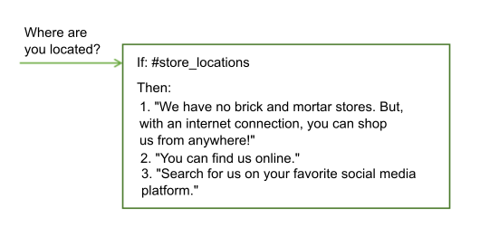

---

copyright:
  years: 2015, 2018
lastupdated: "2018-02-09"

---

{:shortdesc: .shortdesc}
{:new_window: target="_blank"}
{:tip: .tip}
{:pre: .pre}
{:codeblock: .codeblock}
{:screen: .screen}
{:javascript: .ph data-hd-programlang='javascript'}
{:java: .ph data-hd-programlang='java'}
{:python: .ph data-hd-programlang='python'}
{:swift: .ph data-hd-programlang='swift'}
{:table: .aria-labeledby="caption"}

# 對話概觀
{: #dialog-overview}

此對話會使用使用者輸入中所識別的目的和實體以及應用程式的環境定義來與使用者互動，最後提供有用的回應。
{: shortdesc}

回應可能是 `Where can I get some gas?` 這類問題的回答，或是執行打開收音機這類的指令。目的和實體資訊可能足以識別正確的回應，或是對話可能要求使用者提供更多正確回應所需的輸入。例如，如果使用者詢問 `Where can I get some food?`，您可能會想要釐清他們是要在餐廳還是雜貨店吃晚餐還是外帶，依此類推。您可以要求文字回應中有更多詳細資料，並建立一個以上的子節點來處理新的輸入。

<iframe class="embed-responsive-item" id="youtubeplayer" type="text/html" width="640" height="390" src="https://www.youtube.com/embed/oQUpejt6d84?rel=0" frameborder="0" webkitallowfullscreen mozallowfullscreen allowfullscreen> </iframe>

在 {{site.data.keyword.conversationshort}} 工具中，對話會以圖形方式呈現為樹狀結構。建立一個分支來處理每一個您要交談處理的目的。分支由多個節點組成。

## 對話節點

每一個對話節點至少都包含一個條件及一個回應。


- 條件：指定在要觸發的對話中，必須存在於此節點之使用者輸入中的資訊。資訊可能是特定目的、實體值或環境定義變數值。如需相關資訊，請參閱[條件](dialog-runtime.html#conditions)。
- 回應：服務用來回應使用者的詞語。回應也可以配置成觸發程式化動作。如需相關資訊，請參閱[回應](#responses)。

您可以將節點視為具有 if/then 建構：如果此條件為 true，則傳回此回應。

例如，如果服務的自然語言處理程序功能判定使用者輸入包含 `#cupcake-menu` 目的，則會觸發下列節點。因此，在觸發節點時，服務會回應適當的回答。


具有一個條件及回應的單一節點可以處理簡單使用者要求。但是，使用者通常會有更複雜的問題，或需要協助來完成更複雜的作業。您可以新增子節點，要求使用者提供服務所需的任何其他資訊。


## 對話流程

服務會從樹狀結構中的第一個節點到最後一個節點來處理您所建立的對話。


在樹狀結構中向下流動時，如果服務發現符合的條件，則會觸發該節點。然後，會沿著已觸發的節點移動，以根據任何子節點條件來檢查使用者輸入。檢查子節點時，會再次從第一個子節點向最後一個子節點移動。

服務的繼續運作方向是在對話樹狀結構中從第一個節點向最後一個節點，沿著每一個已觸發的節點，然後從第一個子節點向最後一個子節點，並沿著每一個已觸發的子節點，直到到達所追蹤分支中的最後一個節點。


在開始建置對話時，您必須決定要併入的分支，以及放置它們的位置。分支的順序十分重要，因為是從第一個到最後一個評估節點。使用其條件符合輸入的第一個根節點；不會觸發樹狀結構中較後面位置的全部節點。

如果服務到達分支尾端，或從所評估的這組現行子節點中找不到評估為 true 的條件，則會跳回到樹狀結構的起點。同樣地，服務會從第一個到最後一個處理根節點。如果沒有任何條件評估為 true，則會傳回樹狀結構中最後一個節點的回應（一般會有一律評估為 true 的特殊 `anything_else` 條件）。

您可以藉由自訂處理節點之後會發生什麼情況，來中斷標準的第一個到最後一個流程。例如，您可以將節點配置為在處理之後直接跳至另一個節點，即使另一個節點位在樹狀結構中較前面的位置。如需詳細資料，請參閱[定義下一步](dialog-overview.html#jump-to)。

每一個節點的離題設定配置方式也可能會影響使用者在執行時期如何在節點之間移動。如果您可以脫離大部分節點，則使用者可以從某個節點跳至另一個節點，而且可以更輕鬆地返回。如需相關資訊，請參閱[離題](dialog-runtime.html#digressions)。

## 條件
{: #conditions}

節點條件決定是否在交談中使用該節點。回應條件決定要向使用者顯示的回應。

- [條件構件](dialog-overview.html#condition-artifacts)
- [條件語法詳細資料](dialog-overview.html#condition-syntax)
- [條件用法提示](dialog-overview.html#condition-tips)

### 條件構件
{: #condition-artifacts}

您可以使用任何組合中的下列其中一個以上構件來定義條件：

- **環境定義變數**：如果所指定的環境定義變數表示式為 true，則會使用節點。請使用語法 `$variable_name:value` 或 `$variable_name == 'value'`。例如，`$city:Boston` 會檢查 `$city` 環境定義變數是否包含值 `Boston`。如果是，則會處理節點或回應。

  請不要根據在其中設定環境定義變數值的相同對話節點中的環境定義變數值，來定義節點或回應條件。
  {: tip}

  如需環境定義變數的相關資訊，請參閱[環境定義變數](dialog-runtime.html#context)。

- **實體**：在使用者輸入中辨識到實體的任何值或同義字時，會使用節點。請使用語法 `@entity_name`。例如，`@city` 會檢查是否在使用者輸入中偵測到針對 @city 實體所定義的任何城市名稱。如果是，則會處理節點或回應。

  請務必建立對等節點來處理未辨識到任何實體值或同義字的情況。
  {: tip}

  如需實體的相關資訊，請參閱[定義實體](entities.html)。

- **實體值**：如果在使用者輸入中偵測到實體值，則會使用節點。請使用語法 `@entity_name:value`，並指定針對實體所定義的值，而不是同義字。例如：`@city:Boston` 會檢查是否在使用者輸入中偵測到特定城市名稱 `Boston`。

  如果實體是具有擷取群組的型樣實體，則您可以檢查特定群組值相符項。例如，您可以使用語法：`@us_phone.groups[1] == '617'`
  如需相關資訊，請參閱[在環境定義變數中儲存型樣實體值](dialog-runtime.html#context-pattern-entities)。

  如果您檢查對等節點中是否存在實體，但未指定實體的特定值，則請務必將此節點（檢查特定實體值）放在只檢查實體是否存在的對等節點前面。否則，永遠不會評估此節點。
  {: tip}

- **目的**：最簡單的條件是單一目的。如果使用者的輸入對映至該目的，則會使用節點。請使用語法 `#intent_name`。例如，`#weather` 會檢查在使用者輸入中偵測到的目的是否為 `weather`。如果是，則會處理節點。

  如需目的的相關資訊，請參閱[定義目的](intents.html)。

- **特殊條件**：可用來執行一般對話功能之服務所隨附的條件。

| 條件語法| 說明        |
|----------------------|-------------|
| `anything_else`      | 您可以在對話尾端使用此條件，以在使用者輸入不符合任何其他對話節點時進行處理。此條件會觸發 **Anything else** 節點。|
| `conversation_start` | 如同 **welcome**，在第一次對話開啟期間，會將此條件評估為 true。與 **welcome** 不同的是，不論應用程式的起始要求是否包含使用者輸入，它都會是 true。具有 **conversation_start** 條件的節點可以用來起始設定環境定義變數，或在對話開頭執行其他作業。|
| `false`              | 一律將此條件評估為 false。您可以在開發中分支的開頭使用此條件，以避免它被使用，或是用作提供一般功能之節點的條件，而且只能用作**跳至**動作的目標。|
| `irrelevant`         | 如果 {{site.data.keyword.conversationshort}} 服務判定使用者輸入不相關，則會將此條件評估為 true。|
| `true`               | 一律將此條件評估為 true。您可以在節點或回應清單尾端使用此條件，以捕捉任何不符合任何先前條件的回應。|
| `welcome`            | 只有在應用程式的起始要求不包含任何使用者輸入時，才會在第一次對話開啟期間（交談開始時），將此條件評估為 true。在所有後續對話開啟中，會將它評估為 false。此條件會觸發 **Welcome** 節點。一般而言，使用此條件的節點是用來歡迎使用者，例如，顯示 `Welcome to our Pizza ordering app.` 這類訊息。|
{: caption="特殊條件" caption-side="top"}

### 條件語法詳細資料
{: #condition-syntax}

請使用下列其中一個語法選項，在條件中建立有效的表示式：

- 參照目的、實體及環境定義變數的速記表示法。請參閱[存取及評估物件](expression-language.html)。

- 「Spring 表示式 (SpEL)」語言是一種表示式語言，支援在運行環境查詢及操作物件圖形。如需相關資訊，請參閱 [Spring 表示式語言 (SpEL) 語言 ](http://docs.spring.io/spring/docs/current/spring-framework-reference/html/expressions.html){: new_window}。

您可以使用正規表示式來檢查條件的值。例如，若要尋找相符字串，您可以使用 `String.find` 方法。如需詳細資料，請參閱[方法](dialog-methods.html)。

### 條件用法提示
{: #condition-tips}

- **檢查具有特殊字元的值**：如果您要檢查實體或環境定義變數是否包含值，而且該值包含特殊字元（例如單引號 (')），則必須用括弧括住您要檢查的值。例如，若要確認實體或環境定義變數是否包含名稱 `O'Reilly`，您必須用括弧括住此名稱。

  `@person:(O'Reilly)` 及 `$person:(O'Reilly)`

  服務會將這些速記參照轉換為這些完整 SpEL 表示式：

  `entities['person']?.contains('O''Reilly')` 及 `context['person'] == 'O''Reilly'`

  **附註**：SpEL 會在名稱中使用第二個單引號來跳出單一單引號。

- **檢查數值**：使用數值變數時，請確定變數具有值。如果變數沒有值，則在數值比較中會將它視為具有空值 (0)。

  例如，如果您檢查含條件 `@price < 100` 的變數值，而 @price 實體是空值，則會將條件評估為 `true`，因為 0 小於 100，即使未曾設定價格。若要防止檢查空值變數，請使用 `@price AND @price < 100` 這類條件。如果 `@price` 沒有值，則此條件會正確地傳回 false。

- **檢查具有特定目的名稱型樣的目的**：您可以使用條件，以尋找與型樣相符的目的。例如，若要尋找目的名稱開頭為 'User_' 的任何偵測到目的，您可以在條件中使用這類語法：

  `intents[0].intent.startsWith("User_")`

  不過，當您這樣做時，會考量所有偵測到的目的，即使是信任小於 0.2 的目的。也請檢查未傳回 Watson 根據其信任評分而視為不相關的目的。若要這樣做，請如下所示變更條件：

  `!irrelevant && intents[0].intent.startsWith("User_")`

- **模糊符合對實體辨識的影響**：如果使用實體作為條件，並已啟用模糊符合，則只有在相符項的信任大於 30% 時，才會將 `@entity_name` 評估為 true。亦即，只有在 `@entity_name.confidence > .3` 時。

- **處理輸入中的多個實體**：如果只要評估實體類型中第一個偵測到實例的值，您可以使用 `@entity == 'specific-value'` 語法，而非 `@entity:(specific-value)` 格式。

  例如，在使用 `@appliance == 'air conditioner'` 時，只會評估第一個偵測到 `@appliance` 實體的值。但是，使用 `@appliance:(air conditioner)` 則會展開為 `entity['appliance'].contains('air conditioner')`，如此只要在使用者輸入中偵測到至少有一個值 'air conditioner' 的 `@appliance` 實體就會相符。

## 回應
{: #responses}

對話回應定義如何回覆使用者。

您可以回覆下列其中一種回應類型：

- [簡單文字回應](#simple-text)
- [條件式回應](#multiple)
- [複雜回應](#complex)
- [多媒體回應](#multimedia)

### 簡單文字回應
{: #simple-text}

如果要提供文字回應，則只需要輸入您要服務向使用者顯示的文字。



如果您在回應中包含電子郵件位址，則必須使用反斜線 (`\``) 跳出 at 符號 (`@`)。例如，`Send us your feedback at feedback\@example.com.`。同樣地，如果您在回應中包含 `#` 記號，則必須跳出該記號。例如，`We are the \#1 seller of lobster rolls in Maine.`。實體名稱的開頭是 `@`，而目的名稱的開頭是 `#`。跳出這些符號可避免服務誤讀回應文字。
{: tip}

#### 新增變化
{: #variety}

如果使用者經常回到交談服務，他們可能會覺得每次都聽到相同的問候語及回應十分無聊。您可以對回應新增*變異*，讓交談能夠以不同方式回應相同的狀況。

<iframe class="embed-responsive-item" id="youtubeplayer" type="text/html" width="640" height="390" src="https://www.youtube.com/embed/nAlIW3YPrAs?rel=0" frameborder="0" webkitallowfullscreen mozallowfullscreen allowfullscreen> </iframe>

在此範例中，服務針對回應商店位置問題所提供的回答，在不同互動之間會不同：



您可以選擇按順序或以隨機順序來輪替回應變異。依預設，會按順序輪替回應，就像它們是從排序清單中選擇的一樣。

### 條件式回應
{: #multiple}

單一對話節點可以提供不同的回應，每一個回應都是由不同的條件所觸發。您可以使用此方法來處理單一節點中的多種情境。

<iframe class="embed-responsive-item" id="youtubeplayer" type="text/html" width="640" height="390" src="https://www.youtube.com/embed/KcvVQAsnhLM?rel=0" frameborder="0" webkitallowfullscreen mozallowfullscreen allowfullscreen> </iframe>

節點仍然有一個主要條件，這是使用節點以及處理其所包含條件和回應的條件。

在此範例中，服務會使用先前所收集的使用者位置資訊來修改其回應，並提供離使用者最近之商店的相關資訊。如需如何儲存收集自使用者之資訊的相關資訊，請參閱[環境定義變數](dialog-runtime.html#context)。


這個單一節點現在提供四個不同節點的對等功能。

若要將條件式回應新增至節點，請按一下**自訂**，然後按一下**多個回應**切換開關予以**開啟**。

會依序評估節點內的條件，就像評估節點一樣。請確定條件及回應是依正確順序列出。如果您需要變更順序，請選取條件，然後使用顯示的箭頭在清單中上下移動。如果您要更新環境定義，則必須在 JSON 編輯器中針對每一個個別回應執行此動作。沒有所有回應都適用的一般 JSON 編輯器。如果您建立**跳至**動作與節點的關聯，則除非已處理全部回應，否則不會進行跳至。
{: tip}

### 複雜回應
{: #complex}

若要指定更複雜的回應，您可以使用 JSON 編輯器在 `"output":{}` 內容中指定回應。

若要在回應中包含環境定義變數值，請使用語法 `$variable-name` 進行指定。如需相關資訊，請參閱[環境定義變數](dialog-runtime.html#context)。

```json
{
  "output": {
    "text": "Hello $user"
  }
}
```
{: codeblock}

若要指定多個要顯示在不同行的陳述式，請將輸出定義為 JSON 陣列。

```json
{
  "output": {
    "text": ["Hello there.", "How are you?"]
  }
}
```
{: codeblock}

第一個句子會顯示在一行，而第二個句子則會顯示為其後的新行。

若要實作更複雜的行為，您可以將輸出文字定義為複雜 JSON 物件。例如，您可以在 JSON 輸出中使用複雜物件，來模擬將回應變異新增至節點的行為。您可以在複雜物件中包含下列內容：

- **values**：JSON 字串陣列，保留這個對話節點可傳回之輸出文字的多個版本。陣列中值的傳回順序取決於屬性 `selection_policy`。

- **selection_policy**：下列是有效值：

    - **random**：系統會隨機從 `values` 陣列中選取輸出文字，而且不會連續重複。例如，考慮使用包含三個值的 output.text。前三次會選取隨機值，但下一次不會重複。指定所有輸出值之後，系統會隨機選取另一個值，並重複該處理程序。

        ```json
        {
            "output":{
                "text":{
                    "values":["Hello.","Hi.","Howdy!"],
                    "selection_policy":"random"
                }
            }
        }
        ```
        {: codeblock}

    系統會從這三個選項中傳回隨機挑選的某個問候語。下次觸發此回應時，會顯示清單中的另一個問候語。再次隨機選擇問候語，但故意不重複先前已使用的問候語。

    - **sequential**：系統在第一次觸發對話節點時會傳回第一個輸出文字、第二次觸發節點時會傳回第二個輸出文字，依此類推。

        ```json
        {
            "output":{
                "text":{
                    "values":["Hello.", "Hi.", "Howdy!"],
                    "selection_policy":"sequential"
                }
            }
        }
        ```
        {: codeblock}

- **append**：指定要將值附加至陣列，還是將陣列中的值改寫為新的值。設為 false 時，先前執行對話節點時所收集的輸出會改寫為這個特定節點中所指定的文字值。

    ```json
    {
        "output":{
            "text":{
                "values": ["Hello."],
                "append":false
            }
        }
    }
    ```
    {: codeblock}

    在此情況下，會將所有其他輸出文字都改寫為此輸出文字。

預設行為假設 `selection_policy = random` 及 `append = true`。values 陣列包含多個項目時，會從其元素中隨機選取輸出文字。

### 多媒體回應
{: #multimedia}

如果您計劃使用 {{site.data.keyword.conversationshort}} 連接器來整合對話與 Slack 或 Facebook Messenger，則可以指定包含多媒體或互動式元素（例如可按式按鈕）的對話節點回應。

如需相關資訊，請參閱[多媒體回應](dialog-multimedia.html)。

## 定義下一步
{: #jump-to}

做出指定的回應之後，您可以指示服務執行下列其中一項作業：

- **等待使用者輸入**：服務會等待使用者提供回應所引起的新輸入。例如，回應可能會向使用者詢問「是/否」問題。除非使用者提供其他輸入，否則不會進行對話。
- **跳過使用者輸入**：如果您不要等待使用者輸入，而是改為直接移至現行節點的第一個子節點，請使用此選項。

  **附註**：現行節點必須至少要有一個子節點，才能使用此選項。

- **跳至另一個對話節點**：如果您不要等待使用者輸入，而是想要讓交談直接移至完全不同的對話節點，請使用此選項。例如，您可以使用*跳至* 動作，讓流程從樹狀結構中的多個位置遞送至一般對話節點。

  **附註**：您要跳至的目標節點必須存在，才能配置「跳至」動作使用該節點。

### 配置跳至動作
{: #jump-to-config}

如果您選擇跳至另一個節點，則必須指定動作的目標是設為所選取對話節點的**回應**還是**條件**。

- **回應**：如果陳述式的目標設為所選取對話節點的回應區段，則會立即執行。亦即，系統不會評估所選取對話節點的條件；它會立即處理所選取對話節點的回應。

  將目標設為回應適用於將數個對話節點鏈結在一起。如果這個對話節點的條件是 true，則會處理回應。如果選取的對話節點有另一個**跳至**動作，則也會立即執行該動作。

- **條件**：如果陳述式的目標設為所選取對話節點的條件區段，則服務會先檢查目標節點的條件是否評估為 true。
    - 如果條件評估為 true，則系統會立即處理目標節點。
    - 如果條件未評估為 true，則系統會移至目標節點的下一個同層級節點來評估其條件，然後重複此處理程序，直到找到將條件評估為 true 的對話節點。
    - 如果系統處理所有同層級，而且沒有任何條件評估為 true，則會使用基本備用策略，而且對話會評估位於對話樹狀結構起點的節點。

    將目標設為條件適用於鏈結對話節點的條件。例如，您可能要先檢查輸入是否包含目的（例如 `#turn_on`），而且，如果包含目的，則您可能要檢查輸入是否包含實體（例如 `@lights`、`@radio` 或 `@wipers`）。鏈結條件有助於建構較大的對話樹狀結構。

## 相關資訊

如需對話所使用表示式語言的相關資訊，以及方法、系統實體和其他有用詳細資料，請參閱導覽窗格中的**參照**區段。
