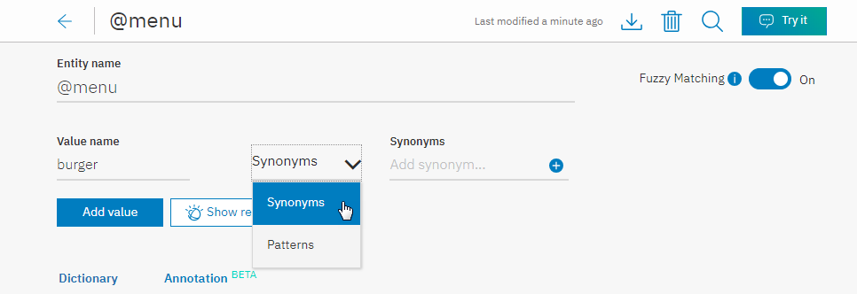
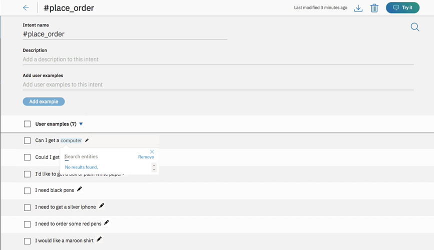
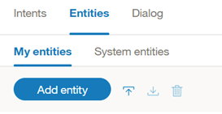

---

copyright:
  years: 2015, 2019
lastupdated: "2019-08-06"

keywords: entity, entity value, contextual entity, dictionary entity, pattern entity, entity synonym, annotate mentions

subcollection: assistant

---

{:shortdesc: .shortdesc}
{:new_window: target="_blank"}
{:deprecated: .deprecated}
{:important: .important}
{:note: .note}
{:tip: .tip}
{:pre: .pre}
{:codeblock: .codeblock}
{:screen: .screen}
{:javascript: .ph data-hd-programlang='javascript'}
{:java: .ph data-hd-programlang='java'}
{:python: .ph data-hd-programlang='python'}
{:swift: .ph data-hd-programlang='swift'}

# 建立實體
{: #entities}

***實體*** 代表使用者輸入中與使用者用途相關的資訊。

如果目的代表動詞（使用者要執行的動作），則實體便代表名詞（該動作的物件或該動作的環境定義）。例如，當*目的* 是要取得天氣預測時，便需要相關位置及日期*實體*，應用程式才能傳回正確的預測。

辨識使用者輸入中的實體有助於您製作更有用、已設定目標的回應。例如，您可能有一個 `#buy_something` 目的。當使用者提出的要求觸發 `#buy_something` 目的時，助理的回應應該反映出其瞭解客戶要購買的 *something* 是什麼。您可以新增 `@product` 實體，然後使用它來擷取使用者輸入中有關客戶感興趣產品的資訊。（實體名稱前面附加了 `@`，有助於將它明確地識別為實體。）

最後，您可以將多個回應新增至您的對話樹狀結構，內含的文字根據在使用者要求中偵測到的 `@product` 值而有所不同。

<iframe class="embed-responsive-item" id="youtubeplayer" title="使用實體" type="text/html" width="640" height="390" src="https://www.youtube.com/embed/o-uhdw6bIyI" frameborder="0" webkitallowfullscreen mozallowfullscreen allowfullscreen> </iframe>

## 實體評估概觀
{: #entities-described}

助理會使用下列其中一個評估方法來偵測使用者輸入中的實體：

### 以字典為基礎的方法
{: #entities-dictionary-overview}

助理會在使用者輸入中尋找符合值、同義字或您針對實體所定義之型樣的詞彙。

- **同義字實體**：請將詞彙種類定義為實體 (`color`)，然後在該種類 (`blue`) 中定義一個以上的值。對於每個值，您可以指定一堆同義字（`aqua`、`navy`）。此外，還可以從 Watson 向您提供的建議中選取要新增的同義字。

    在執行時期，助理會在使用者輸入中辨識完全符合您針對實體定義為該實體提及項目之值或同義字的詞彙。
- **型樣實體**：請將詞彙種類定義為實體 (`contact_info`)，然後在該種類 (`email`) 中定義一個以上的值。針對每個值指定一個正規表示式，其定義該值類型提及項目的文字型樣。對於 `email` 實體值，您可能想要指定定義 `text@text.com` 型樣的正規表示式。

    在執行時期，助理會在使用者輸入中尋找符合正規表示式的型樣，並將所有相符項識別為該實體的提及項目。
- **系統實體**：IBM 為您預先建置的同義字實體。它們涵蓋各種常用的種類，例如，數字、日期及時間。您只要啟用系統實體，即可開始使用。

### 基於註釋的方法
{: #entities-annotations-overview}

定義基於註釋的實體（也稱為環境定義實體）時，會基於*註釋的詞彙*以及您在註釋的語句中使用該詞彙的*環境定義*對模型進行訓練。這個新的環境定義實體模型可讓助理計算信賴分數，以根據其在使用者輸入中的使用方式，識別字組或詞組為實體實例的可能性有多高。

- **環境定義實體**：首先，請將詞彙種類定義為實體 (`product`)。接下來，請移至*目的* 頁面，並發掘現有目的使用者範例，以尋找任何實體提及項目，然後如此進行標示。例如，您可能移至 `#buy_something` 目的，然後尋找指出 `I want to buy a Coach bag` 的使用者範例。您可以將 `Coach bag` 標示為 `@product` 實體的提及項目。

    基於訓練目的，您註釋的詞彙 `Coach bag` 會新增為 `@product` 實體的值。

    在執行時期，助理只會根據在句子中使用詞彙的環境定義來評估這些詞彙。如果提及詞彙的使用者要求結構符合標示提及項目的目的使用者範例結構，則助理會將該詞彙解譯為該實體類型的提及項目。例如，使用者輸入可能包括這句話：`I want to buy a Gucci bag`。因為此句子的結構類似您所註釋的使用者範例 (`I want to buy a Coach bag`)，所以助理會將 `Gucci bag` 辨識為 `@product` 實體提及項目。

    當環境定義實體模型用於實體時，助理*不會* 在使用者輸入中尋找實體的確切文字或型樣相符項，而是改為將焦點放在所提及實體的句子環境定義。

    如果您選擇使用註釋來定義實體值，請在每個實體上新增至少 10 個註釋，以提供足夠的資料給環境定義實體模型，使它變得可靠。

若要進一步瞭解環境定義實體，請[閱讀本部落格文章 ](https://medium.com/ibm-watson/contextual-entities-with-ibm-watson-assistant-f41b2e0ca82e)。

## 建立實體
{: #entities-creating-task}

1.  開啟您的對話技能，然後按一下**實體**標籤。如果看不到**實體**，請使用  功能表來開啟頁面。

1.  按一下**建立實體**。

    您也可以按一下**系統實體**，從 {{site.data.keyword.IBM_notm}} 所提供且可套用至任何使用案例的共用實體清單中進行選取。如需詳細資料，請參閱[啟用系統實體](#entities-enable-system-entities)。

1.  在**實體名稱**欄位中，鍵入實體的敘述性名稱。

    實體名稱可以包含字母（Unicode 編碼）、數字、底線及連字號。例如：
    - `@location`
    - `@menu_item`
    - `@product`

    名稱中不可包括空格。名稱的長度不能超過 64 個字元。名稱的開頭不能是 `sys-` 字串，因為此字串保留供系統實體使用。

    在實體名稱前會自動附加 `@` 符號，以將該詞彙識別為實體。您不需要新增它。
    {: tip}

1.  按一下**建立實體**。

    

1.  針對此實體，選擇您要讓助理使用以字典為基礎的方法還是以註釋為基礎的方法來尋找其提及項目，然後遵循適當的程序。

    **針對您建立的每個實體，僅選擇一個要使用的實體類型。**一旦新增實體的註釋，即會起始設定環境定義模型，並使其成為分析使用者輸入的主要方法，以尋找該實體的提及項目。在使用者輸入中使用提及項目的環境定義，其優先順序高於可能存在的任何完全相符項。如需如何評估每一種類型的相關資訊，請參閱[實體評估概觀](#entities-described)。

    - [以字典為基礎的實體](#entities-create-dictionary-based)
    - [基於註釋的實體](#entities-create-annotation-based)

## 新增以字典為基礎的實體
{: #entities-create-dictionary-based}

以字典為基礎的實體是您為其定義特定詞彙、同義字或型樣的實體。在執行時期，只有在使用者輸入中的詞彙完全符合（或在已啟用模糊比對時，為幾乎符合）值或其中一個同義字時，助理才會尋找實體提及項目。

1.  在**值名稱**欄位中，鍵入實體可能值的文字，然後按 `Enter` 鍵。實體值可以是任何字串，長度最多為 64 個字元。

    **重要事項：**請不要在實體名稱或值中包含機密或個人資訊。名稱及值可能會顯示在應用程式的 URL 中。

1.  如果您要助理使用與您指定實體值及同義字類似的語法來辨識詞彙，但不需要完全相符，請按一下**模糊比對**切換開關予以開啟。

    此特性適用於[支援的語言](/docs/services/assistant?topic=assistant-language-support)主題中指出的語言。

    **模糊比對**
    {: #entities-fuzzy-matching}

    模糊比對具有下列元件：

    - *詞幹分析* - 此特性可辨識具有數個文法形式之實體值的詞幹形式。例如，'bananas' 的詞幹應該是 'banana'，而 'running' 的詞幹應該是 'run'。
    - *拼字錯誤* - 儘管存在拼字錯誤或些微的語法差異，但是此特性還是可以將使用者輸入對映至適當的對應實體。例如，如果您將 *giraffe* 定義為 animal 實體的同義字，而且使用者輸入包含 *giraffes* 或 *girafe* 這些詞彙，則模糊比對可以將詞彙正確地對映至 animal 實體。
    - *部分比對* - 使用部分比對，此特性會自動建議存在於使用者定義實體中的子字串型同義字，並指派較低的信賴分數（與確切的實體比對相較之下）。

    若為英文，模糊比對可防止將一些常用的有效英文字組擷取為給定實體的模糊相符項。此特性會使用標準英文字典字組。您也可以定義英文實體值/同義字，而模糊比對只會比對您定義的實體值/同義字。例如，模糊比對可能會比對 `unsure` 一詞與 `insurance`；但是，如果您已將 `unsure` 定義為 `@option` 這類實體的值/同義字，則 `unsure` 一律會符合 `@option`，而不是 `insurance`。
    {: note}

    您的模糊比對設定不會影響同義字建議。即使已啟用模糊比對，仍然只會針對您指定的確切值（而非值及值的些微變異）來建議同義字。

1.  輸入值名稱之後，就可以從*類型* 下拉功能表中選取`同義字`或`型樣`，為該實體值新增任何同義字或定義特定型樣。

    

    **附註：**您可以為單一實體值新增同義字*或* 型樣，但不能同時新增這兩者。

    ***同義字***
    {: #entities-synonyms}

    - 在**同義字**欄位中，為實體值鍵入任何同義字。同義字可以是任何字串，長度最多為 64 個字元。

      

      {{site.data.keyword.conversationshort}} 服務也可以是實體值的建議同義字。建議程式會根據從大量現有資訊內文（包括大量書面文字來源）中所擷取的環境定義相似性來尋找相關的同義字，並使用自然語言處理技術來識別與實體值中的現有同義字類似的字組。

    - 按一下**顯示建議**。

    - {{site.data.keyword.conversationshort}} 服務將針對同義字提供數個建議。這些詞彙會以小寫形式顯示，但不論是以大寫還是小寫指定，助理都可以辨識出同義字的提及項目。

      實體值同義字越一致，建議就會越相關、越具針對性。例如，如果您有一些字組主要在討論佈景主題，則取得的建議會比您有一個以上隨機字組時所取得的建議更適當。
      {: tip}

      

    - 選取您要包含的所有同義字，然後按一下**新增選取的項目**。

      您必須針對您選取要新增的所有同義字，按一下**新增選取的項目**按鈕。如果您沒有先按一下此按鈕就移至下一組，則您的選擇會遺失。

      

    - {{site.data.keyword.conversationshort}} 服務會將那些同義字新增至您的實體，並建議其他同義字。

      如果您未收到任何其他同義字建議，可能是因為您的實體已明確定義，或者它包含建議程式目前無法展開的內容。
      {: tip}

      如果您選擇不選取建議的同義字，則系統會將其視為您不感興趣的詞彙，並變更在您按下`新增選取的項目`或`下一組`時所看到的下一組建議。這項推斷只有在您選擇同義字時才持續有效；助理不會將所跳過同義字的相關資訊用於任何其他用途。
      {: note}

      

      視需要繼續新增同義字。當您完成接受建議時，請按一下 **X** 予以關閉。

    ***型樣***
    {: #entities-patterns}

    - **型樣**欄位可讓您定義實體值的特定型樣。在欄位中，**必須**將型樣輸入為正規表示式。
  

      - 每一個實體值最多都可以有 5 種型樣。
      - 每個型樣（正規表示式）的長度限制為 512 個字元。

      
      {: #entities-pattern-entities}

      在此範例中，針對實體 *ContactInfo*，phone、email 及 website 值的型樣可以定義如下：
      - Phone
        - `localPhone`：`(\d{3})-(\d{4})`，例如：426-4968
        - `fullUSphone`：`(\d{3})-(\d{3})-(\d{4})`，例如：800-426-4968
        - `internationalPhone`：`^(\(?\+?[0-9]*\)?)?[0-9_\- \(\)]*$`，例如：+44 1962 815000
      - `email`：`\b[A-Za-z0-9._%+-]+@([A-Za-z0-9-]+\.)+[A-Za-z]{2,}\b`，例如 name@ibm.com
      - `website`：`(https?:\/\/)?([\da-z\.-]+)\.([a-z\.]{2,6})([\/\w \.-]*)*\/?$`，例如：https://www.ibm.com

      通常，使用型樣實體時，需要從對話樹狀結構中將符合型樣的文字儲存在環境定義變數（或動作變數）。如需相關資訊，請參閱[定義環境定義變數](/docs/services/assistant?topic=assistant-dialog-runtime#dialog-runtime-context-var-define)。

      假設您向使用者詢問其電子郵件位址。對話節點條件將會包含與 `@contactInfo:email` 類似的條件。若要將使用者輸入的電子郵件指派為環境定義變數，可以使用下列語法來擷取對話節點之回應區段內的型樣相符項：

      <table>
      <caption>儲存型樣</caption>
        <tr>
          <th>變數</th>
          <th>值</th>
        </tr>
        <tr>
          <td>email</td>
          <td>`<? @contactInfo.literal ?>`</td>
        </tr>
      </table>

      ***擷取群組***
      {: #entities-capture-group}

      對於正規表示式，會將一對一般括弧內某個型樣的任何部分擷取為群組。例如，實體 `@ContactInfo` 有一個名為 `fullUSphone` 的型樣值，其中包含三個已擷取的群組：

      - `(\d{3})` - 美國區域碼
      - `(\d{3})` - 首碼
      - `(\d{4})` - 線路號碼

      例如，如果您想要 {{site.data.keyword.conversationshort}} 服務要求使用者輸入其電話號碼，然後只在回應中使用其所提供號碼的區域碼，則群組可能十分有用。

      為了將使用者輸入的區域碼指派為環境定義變數，可以使用下列語法來擷取對話節點之回應區段內的群組相符項：

      <table>
      <caption>儲存擷取群組</caption>
        <tr>
          <th>變數</th>
          <th>值</th>
        </tr>
        <tr>
          <td>area_code</td>
          <td>`<? @ContactInfo.groups[1] ?>`</td>
        </tr>
      </table>

      如需在對話中使用擷取群組的相關資訊，請參閱[儲存及辨識輸入中的實體型樣群組](/docs/services/assistant?topic=assistant-dialog-tips#dialog-tips-get-pattern-groups)。

      {{site.data.keyword.conversationshort}} 服務所採用的型樣比對引擎有一些必要的語法限制，用來避免使用其他正規表示式引擎時可能發生的效能問題。

      - 實體型樣不能包含：
        - 正向重複（例如 `x*+`）
        - 反向參照（例如 `\g1`）
        - 條件式分支（例如 `(?(cond)true)`）
      - 若型樣實體的開頭或結尾為 Unicode 字元，並且包含字組界限（例如 `\bš\b`），則型樣比對無法正確地比對字組界限。在此範例中，針對輸入 `š zkouška`，相符項會傳回 `Group 0: 6-7 š` (`š zkou`_**`š`**_`ka`)，而不是正確的 `Group 0: 0-1 š` (_**`š`**_ `zkouška`)。

      正規表示式引擎是用鬆散方式以 Java 正規表示式引擎為基礎。如果您嘗試透過 API 或從 {{site.data.keyword.conversationshort}} 使用者介面內上傳不受支援的型樣，則 {{site.data.keyword.conversationshort}} 服務會產生錯誤。

1.  按一下**新增值**，然後重複新增其他實體值的處理程序。

1.  當您完成新增實體值時，請按一下 ，以完成建立實體。

您建立的實體即會新增至**實體**標籤，系統就會開始根據新資料自行訓練。

## 新增環境定義實體
{: #entities-create-annotation-based}

以註釋為基礎的實體是指，您在範例句子中為其註釋某實體的出現項目，以教導助理通常使用該實體之環境定義的實體。

為了訓練環境定義實體模型，您可以充分運用目的範例，其提供現成可用的句子來進行註釋。

使用目的的使用者範例來定義環境定義實體，並不會影響該目的的分類。不過，您標示的實體提及項目也會新增至該實體作為同義字。此外，目的分類會使用目的使用者範例中的同義字提及項目，來建立目的與實體之間的弱參照。
{: note}

1.  在對話技能中，按一下**目的**標籤。

1.  按一下目的，以將其開啟。

    在此範例中，目的 `#place_order` 定義線上零售商的訂單功能。

    

1.  檢閱目的範例，以尋找潛在的實體提及項目。強調顯示目的範例中的潛在實體提及項目。

    在此範例中，`computer` 是實體提及項目。

    

    「編輯」圖示  用來編輯目的使用者範例；其與新增註釋無關。
    {: tip}

1.  即會開啟「搜尋」方框，您可以使用它來搜尋強調顯示的字組或詞組是其提及項目的實體。

    

    在此範例中，搜尋 `prod` 會顯示 `@product` 實體的相符項。

    

    如果實體具有任何現有的實體值，則顯示的這些值僅供參考。您正在將註釋新增至實體，而非任何特定的實體值。

    如果您要教導模型，讓它知道提及項目與現有的實體值同義，您可以建立該提及項目與特定實體值的關聯。
    {: important}

    若要建立提及項目與特定實體值的關聯，請遵循下列步驟：

    1.  在搜尋欄位中鍵入完整的實體名稱及值。例如，鍵入 `@product:IT`。
    1.  當實體值顯示在下拉功能表中時，請進行選取。

1.  選取您要新增註釋的實體。

    在此範例中，`computer` 會新增為 `@product` 實體的註釋。

    針對每個環境定義實體，建立*至少* 10 個註釋；用於正式作業時，建議使用更多的註釋。
    {: important}

1.  如果沒有任何實體適合，您可以藉由選擇 **@(create new entity)** 來建立新的實體。

1.  針對您要註釋的每個實體提及項目，重複此處理程序。

    針對您所編輯之任何使用者範例中出現的實體類型，請務必為其每個提及項目進行註釋。如需詳細資料，請參閱[不註釋的內容很重要](#entities-counter-examples)。
    {: important}

1.  現在，按一下您剛才建立的註釋。即會開啟一個方框，指出：`Go to: <entity-name>`。按一下該鏈結，可直接將您帶到實體。

    

    註釋即會新增至與其相關聯的實體，系統就會開始根據新資料自行訓練。

    您註釋的詞彙已新增至實體作為新的字典值。如果您將註釋的詞彙與現有實體值相關聯，則該詞彙會新增為該實體值的同義字，而非新增為獨立的實體值。
    {: important}

1.  若要查看您針對特定實體所註釋的所有提及項目，請從實體的配置頁面中，按一下**註釋**標籤。

    

    環境定義實體可瞭解您尚未明確定義的值。系統會根據使用者範例的註釋方式來預測其他實體值，並使用那些值來訓練其他實體。任何類似的使用者範例都會新增至*註釋* 視圖，因此您可以看到此選項如何影響訓練。
    {: note}

    如果您不想要環境定義實體使用這種擴展的實體值理解，請針對該實體選取*註釋* 視圖中的所有使用者範例，然後按一下**刪除**。

下列視訊示範如何註釋實體提及項目。

<iframe class="embed-responsive-item" id="youtubeplayer0" title="註釋實體提及項目" type="text/html" width="640" height="390" src="https://www.youtube.com/embed/3WjzJpLsnhQ" frameborder="0" webkitallowfullscreen mozallowfullscreen allowfullscreen> </iframe>

若要逐步進行指導教學以顯示您在自行新增之前要如何定義環境定義實體，請移至[指導教學：定義環境定義實體 ](https://www.ibm.com/cloud/garage/demo/try-watson-assistant-contextual-entities){: new_window}。

### 不註釋的內容很重要
{: #entities-counter-examples}

如果您有一個含有註釋的目的範例，且該範例中有另一個字組符合相同實體的值或同義字，但此值並*未* 進行註釋，則此一省略動作會造成影響。模型也會從您未註釋之詞彙的環境定義中學習。因此，如果您將一個詞彙標示為使用者範例中某個實體的提及項目，請務必也標示所有其他適用的提及項目。

1.  `#Customer_Care_Appointments` 目的包括兩個含有 `visit` 這個字的目的範例。

    

1.  在第一個範例中，您要將 `visit` 這個字註釋為 `@meeting` 實體的實體值。這會使 `visit` 等同於其他 `@meeting` 實體值（例如，`appointment`），如 "I'd like to make an appointment" 或 "I'd like to schedule a visit" 所示。

    

1.  對於第二個範例，`visit` 這個字用在不同於 meeting 的環境定義中。在此情況下，您可以從目的範例中選取 `appointment` 這個字，然後將其註釋為 `@meeting` 實體的實體值。模型會學到在相同範例中未註釋 `visit` 這個字的事實。

    

## 啟用系統實體
{: #entities-enable-system-entities}

{{site.data.keyword.conversationshort}} 服務提供若干*系統實體*，這些系統實體是可用於任何應用程式的一般實體。啟用系統實體可將許多使用案例通用的訓練資料快速移入您的技能。

系統實體可用來辨識其代表物件類型之更大範圍的值。例如，`@sys-number` 系統實體符合任何數值，包括整數、小數位數，甚至是以字組形式寫出的數字。

系統實體會集中進行維護，因此可自動提供所有更新。您無法修改系統實體。

1.  在「實體」頁面上，按一下**系統實體**。

    

1.  瀏覽系統實體清單，以選擇對應用程式有用的系統實體。
    - 若要查看系統實體的相關資訊（包括比對輸入的範例），請按一下清單中的實體。
    - 如需可用系統實體的詳細資料，請參閱[系統實體](/docs/services/assistant?topic=assistant-system-entities)。

1.  按一下系統實體旁的切換開關，以啟用或停用該系統實體。

啟用系統實體之後，{{site.data.keyword.conversationshort}} 服務就會開始重新訓練。訓練完成之後，您就可以使用這些實體。

## 實體限制
{: #entities-limits}

您可以建立的實體、實體值及同義字數目，取決於您的 {{site.data.keyword.conversationshort}} 服務方案：

|服務方案          |每個技能的實體數 |每個技能的實體值數目 |每個技能的實體同義字數目 |
|-------------------|-------------------:|------------------------:|--------------------------:|
|超值              |1,000|100,000 |100,000 |
|加值              |1,000|100,000 |                   100,000 |
|標準              |1,000|100,000 |100,000 |
|精簡、加值試用|25 |100,000 |100,000 |
{: caption="服務方案詳細資料" caption-side="top"}

您啟用以供使用的系統實體會計入方案用量總計。

|服務方案          |環境定義實體及註釋|
|--------------|------------------------------------:|
|超值              |  30 個環境定義實體（含 3000 個註釋）|
|加值              |  20 個環境定義實體（含 2000 個註釋）|
|標準              |  20 個環境定義實體（含 2000 個註釋）|
|精簡、加值試用|  10 個環境定義實體（含 1000 個註釋）|
{: caption="服務方案詳細資料（續）" caption-side="top"}

## 編輯實體
{: #entities-edit}

您可以按一下清單中的任何實體，以開啟它來進行編輯。您可以重新命名或刪除實體，也可以新增、編輯或刪除值、同義字或型樣。

如果您將實體類型從 `synonym` 變更為 `pattern`（或者相反），則會轉換現有值，但可能不像原來那麼實用。
{: note}

## 搜尋實體
{: #entities-search}

請使用「搜尋」特性來尋找實體名稱、值及同義字。

1.  從**實體**頁面中，按一下「搜尋」圖示。

    

    系統實體是無法搜尋的。
    {: note}

1.  輸入搜尋詞彙或詞組。

    

即會顯示包含搜尋詞彙的實體及對應範例。

  

## 匯出實體
{: #entities-export}

您可以將若干實體匯出至 CSV 檔案，然後針對另一個 {{site.data.keyword.conversationshort}} 應用程式匯入及重複使用這些目的。

- CSV 匯出中內含型樣資訊。任何使用 `/` 包裝的字串都會視為型樣（相對於同義字）。
- 不會匯出與環境定義實體相關聯的註釋。您必須匯出整個對話技能，才能同時擷取實體值及任何相關聯的註釋。

1.  選取您要的實體，然後按一下**匯出**。

    

## 匯入實體
{: #entities-import}

如果您有大量實體，則可能會發現從逗點區隔值 (CSV) 檔案匯入它們會比逐一定義它們更為容易。

實體註釋不會內含在實體 CSV 檔案的匯入中。您必須匯入整個對話技能，才能在該技能中保留環境定義實體的相關聯註釋。如果僅匯出及匯入實體，則您匯出的任何環境定義實體在匯入之後，都會視為以字典為基礎的實體。
{: note}

1.  將實體收集到 CSV 檔案，或將它們從試算表匯出至 CSV 檔案。檔案中每一行的必要格式如下：

    ```
    <entity>,<value>,<synonyms>
    ```
    {: screen}

    其中 &lt;entity&gt; 是實體的名稱、&lt;value&gt; 是實體的值，而 &lt;synonyms&gt; 是該值的同義字清單（以逗點區隔）。

    ```
    weekday,Monday,Mon
    weekday,Tuesday,Tue,Tues
    weekday,Wednesday,Wed
    weekday,Thursday,Thur,Thu,Thurs
    weekday,Friday,Fri
    weekday,Saturday,Sat
    weekday,Sunday,Sun
    month,January,Jan
    month,February,Feb
    month,March,Mar
    month,April,Apr
    month,May
    ```
    {: screen}

    匯入 CSV 檔案也支援型樣。任何使用 `/` 包裝的字串都會視為型樣（相對於同義字）。

    ```
    ContactInfo,localPhone,/(\d{3})-(\d{4})/
    ContactInfo,fullUSphone,/(\d{3})-(\d{3})-(\d{4})/
    ContactInfo,internationalPhone,/^(\(?\+?[0-9]*\)?)?[0-9_\- \(\)]*$/
    ContactInfo,email,/\b[A-Za-z0-9._%+-]+@[A-Za-z0-9.-]+\.[A-Za-z]{2,}\b/
    ContactInfo,website,/(https?:\/\/)?([\da-z\.-]+)\.([a-z\.]{2,6})([\/\w \.-]*)*\/?$/
    ```
    {: screen}

        儲存含 UTF-8 編碼且沒有位元組順序標記 (BOM) 的 CSV 檔案。CSV 檔案大小上限為 10MB。如果您的 CSV 檔案較大，請考慮將它分割為多個檔案，並分別進行匯入。開啟您的對話技能，然後按一下**實體**標籤。
    {: tip}

1.  按一下 ，然後拖曳檔案，或瀏覽以從電腦中選取檔案。檔案會進行驗證並匯入，而系統會開始根據新資料自行訓練。

您可以在「實體」標籤上檢視匯入的實體。您可能需要重新整理頁面才能看到新的實體。

## 刪除實體
{: #entities-delete}

您可以選取一些要刪除的實體。

**重要事項**：藉由刪除實體，您也會一併刪除所有相關聯的值、同義字或型樣，之後就無法擷取這些項目。所有參照這些實體或值的對話節點，都必須手動更新成不再參照已刪除的內容。

1.  選取您要刪除的實體，然後按一下**刪除**。

    
