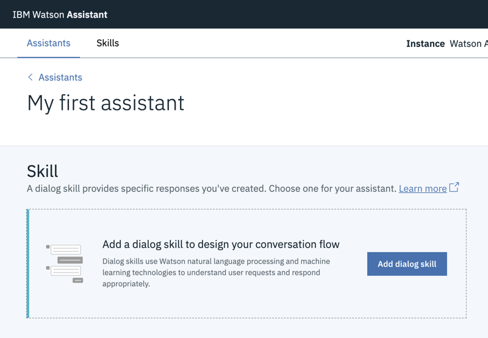

---

copyright:
  years: 2015, 2019
lastupdated: "2019-03-01"

subcollection: assistant

---

{:shortdesc: .shortdesc}
{:new_window: target="_blank"}
{:deprecated: .deprecated}
{:important: .important}
{:note: .note}
{:deprecated: .deprecated}
{:important: .important}
{:note: .note}
{:tip: .tip}
{:pre: .pre}
{:codeblock: .codeblock}
{:screen: .screen}
{:javascript: .ph data-hd-programlang='javascript'}
{:java: .ph data-hd-programlang='java'}
{:python: .ph data-hd-programlang='python'}
{:swift: .ph data-hd-programlang='swift'}
{:hide-dashboard: .hide-dashboard}
{:download: .download}
{:gif: data-image-type='gif'}

# 入門指導教學
{: #getting-started}

在這份簡短的指導教學中，我們會介紹 {{site.data.keyword.conversationshort}} 工具，並逐步完成建立第一個助理的處理程序。
{: shortdesc}

## 開始之前
{: #getting-started-prerequisites}
{: hide-dashboard}

您需要有服務實例才能開始。
{: hide-dashboard}

1.  {: hide-dashboard} 移至 {{site.data.keyword.cloud_notm}} 型錄中的 [{{site.data.keyword.conversationshort}} ](https://cloud.ibm.com/catalog/services/watson-assistant) 頁面。

    如果您未選擇其他資源群組，則會在 **default** 資源群組中建立服務實例，而且稍後*無法* 變更。對於試用服務的用途而言，此群組即已足夠。

    如果您要建立可以更健全使用的實例，請進一步瞭解[資源群組 ](https://{DomainName}/docs/resources/bestpractice_rgs#bp_resourcegroups){: new_window}。
1.  {: hide-dashboard}註冊免費的 {{site.data.keyword.cloud_notm}} 帳戶或登入。
1.  {: hide-dashboard}按一下**建立**。

## 步驟 1：開啟工具
{: #getting-started-launch-tool}

建立 {{site.data.keyword.conversationshort}} 服務實例之後，您即會進入服務儀表板的**管理**頁面。
{: hide-dashboard}

1.  按一下**啟動工具**。如果系統提示您登入工具，請提供您的 {{site.data.keyword.cloud_notm}} 認證。

<!-- Remove this text after dedicated instances have the developer console: begin -->

{{site.data.keyword.Bluemix_dedicated_notm}}：從「儀表板」中選取您的服務實例，以啟動工具。

<!-- Remove this text after dedicated instances have the Developer Console: end -->

## 步驟 2：建立對話技能
{: #getting-started-add-skill}

{{site.data.keyword.conversationshort}} 工具中的第一個步驟是建立技能。

*對話技能* 是構件的儲存器，這些構件用於定義您助理與客戶之間可以進行的交談流程。

1.  從 {{site.data.keyword.conversationshort}} 工具的首頁，按一下**建立技能**。

    

1.  按一下**建立新的項目**。

    

1.  將您的技能命名為 `Conversational skill tutorial`。
1.  **選用**。如果您計劃建置的對話將使用英文以外的語言，則請從清單中選擇適當的語言。
1.  按一下**建立**。

    

您會進入工具的「目的」頁面。

## 步驟 3：從內容型錄中新增目的
{: #getting-started-add-catalog}

藉由從內容型錄中新增目的，將 IBM 所建置的訓練資料新增至您的技能。具體而言，您會將**一般**內容型錄的存取權授與助理，讓對話可以問候使用者，以及結束與使用者的交談。

1.  在 {{site.data.keyword.conversationshort}} 工具中，按一下**內容型錄**標籤。
1.  在清單中尋找**一般**，然後按一下**新增至技能**。

    
1.  開啟**目的**標籤，以檢閱已新增至訓練資料的目的及關聯的範例詞語。您可以辨識它們，因為每個目的名稱的開頭都是字首 `#General_`。您將在下一步中將 `#General_Greetings` 及 `#General_Ending` 目的新增至您的對話。

    

藉由從 {{site.data.keyword.IBM_notm}} 新增預先建置的內容，順利開始建置您的訓練資料。

## 步驟 4：建置對話
{: #getting-started-build-dialog}

[對話](/docs/services/assistant?topic=assistant-dialog-overview)會以邏輯樹狀結構的形式來定義您的交談流程。其會比對目的（使用者所說的內容）與回應（機器人回覆的內容）。每一個樹狀結構節點都會有根據使用者輸入來觸發的條件。

我們將建立簡單對話來處理問候及結束目的，每個都有單一節點。

### 新增起始節點

1.  在 {{site.data.keyword.conversationshort}} 工具中，按一下**對話**標籤。
1.  按一下**建立**。您會看到兩個節點：
    - **Welcome**：包含使用者第一次與助理互動時向其顯示的問候語。
    - **Anything else**：包含在無法辨識使用者輸入時，用來回覆使用者的詞組。

    
1.  按一下 **Welcome** 節點，以在編輯視圖中將它開啟。
1.  將預設回應取代為文字：`Welcome to the Watson Assistant tutorial!`。

    
1.  按一下 ，以關閉編輯視圖。

您已建立 `welcome` 條件所觸發的對話節點。（`welcome` 是一種特殊條件，其運作類似於目的，但開頭不是 `#`。）開始新交談時即會觸發。您的節點指定當新的交談開始時，系統應該使用您新增至此第一個節點之回應區段的歡迎訊息來進行回應。

### 測試起始節點

您隨時可以測試對話來驗證對話。現在讓我們進行測試。

- 按一下  圖示，來開啟「試用」窗格。您應該會看到歡迎訊息。

### 新增節點以處理目的

現在，我們將在 `Welcome` 節點與 `Anything else` 節點之間新增節點，用於處理我們的目的。

1.  按一下 **Welcome** 節點上的「其他」圖示 ，然後選取**新增下面的節點**。
1.  在此節點的**輸入條件**欄位中，鍵入 `#General_Greetings`。然後，選取 **`#General_Greetings`** 選項。
1.  新增回應 `Good day to you!`
1.  按一下 ，以關閉編輯視圖。

   

1.  按一下此節點上的「其他」圖示 ，然後選取**新增下面的節點**以建立對等節點。在對等節點中，指定 `#General_Ending` 作為條件，然後指定 `OK. See you later.` 作為回應。

   

1.  按一下 ，以關閉編輯視圖。

   

### 測試目的辨識

您已建置簡單對話來辨識及回應問候和結束輸入。讓我們看看它的運作情況。

1.  按一下  圖示，來開啟「試用」窗格。會有一個令人欣慰的歡迎訊息。
1.  在窗格底端，鍵入 `Hello`，然後按 Enter 鍵。輸出指出已辨識 #hello 目的，並且出現適當的回應 (`Good day to you.`)。
1.  嘗試下列輸入：
    - `bye`
    - `howdy`
    - `see ya`
    - `good morning`
    - `sayonara`

{: gif}

即使您的輸入不完全符合您併入的範例，{{site.data.keyword.watson}} 還是可以辨識您的目的。對話會使用目的來識別使用者輸入的用途，而不考慮使用精確用字，然後以您指定的方式做出回應。

### 建置對話的結果

大功告成。您已建立一個具有兩個目的的簡單交談，以及一個用來辨識它們的對話。

## 步驟 5：建立助理
{: #getting-started-create-assistant}

[*助理*](/docs/services/assistant?topic=assistant-assistants) 是一種認知機器人，您可以在其中新增一種技能，讓它可以用有用的方式與客戶互動。

1.  按一下**助理**標籤。
1.  按一下**建立新的項目**。

    
1.  將助理命名為 `Watson Assistant tutorial`。
1.  在「說明」欄位中，輸入 `This is a sample assistant that I am creating to help me learn.`
1.  按一下**建立**。

    

## 步驟 6：將技能新增至助理
{: #getting-started-add-skill-to-assistant}

將您建置的對話技能新增至您建立的助理。

1.  從新助理頁面，按一下**新增技能**。

    如果您已建立或已獲授與開發人員角色，以存取任何使用 {{site.data.keyword.conversationshort}} 服務正式發行版本所建置的工作區，則會看到這些工作區作為交談式技能被列在「技能」頁面中。
    {: tip}

    
1.  選擇將您先前建立的技能新增至助理。

## 步驟 7：整合助理
{: #getting-started-integrate-assistant}

現在，您有一個助理可以參與簡單交談式交換，請將它發佈至您可以在其中進行測試的公用網頁。服務提供一個內建的整合，稱為「預覽鏈結」。當您建立此類型的整合時，它會將您的助理建置成由 IBM 品牌網頁所管理的會談小組件。您可以開啟網頁並與您的助理會談，以進行測試。

1.  按一下**助理**標籤，尋找您已建立的 `Watson Assistant tutorial` 助理，然後將它開啟。
1.  從*整合* 區域中，按一下**新增整合**。
1.  尋找**預覽鏈結**，然後按一下**選取整合**。

1.  按一下頁面上所顯示的 URL。

    即會在新標籤中開啟頁面。
1.  跟您的助理說 `hello`，然後看它回應。您可以將 URL 分享給可能想要試用您助理的其他人。

## 後續步驟
{: #getting-started-next-steps}

本指導教學已建置簡單範例。對於實際應用程式，您需要定義一些較有趣的目的、一些實體，以及使用這兩者的較複雜對話。當您有經過修飾的助理版本時，可以將它與客戶所使用的頻道整合，例如 Slack。隨著助理與客戶之間的資料流量增加，您可以使用**分析**標籤中提供的工具來分析實際的交談，以及識別改善的區域。

- 請完成後續指導教學，以建置其他進階對話：
    - 使用[建置複雜對話](/docs/services/assistant?topic=assistant-tutorial)指導教學來新增標準節點。
    - 使用[新增含空位的節點](/docs/services/assistant?topic=assistant-tutorial-slots)指導教學來瞭解空位。
- 請參閱其他[範例應用程式](/docs/services/assistant?topic=assistant-sample-apps)，以取得構想。
