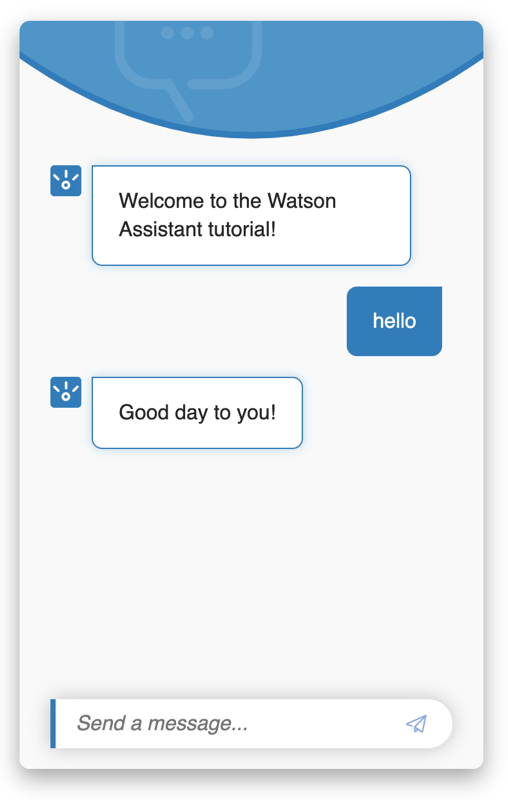

---

copyright:
  years: 2015, 2019
lastupdated: "2019-08-06"

keywords: assistant, omnichannel, virtual agent, virtual assistant, chatbot, conversation, watson assistant, watson conversation

subcollection: assistant

---

{:shortdesc: .shortdesc}
{:new_window: target="_blank"}
{:deprecated: .deprecated}
{:important: .important}
{:note: .note}
{:deprecated: .deprecated}
{:important: .important}
{:note: .note}
{:tip: .tip}
{:pre: .pre}
{:codeblock: .codeblock}
{:screen: .screen}
{:javascript: .ph data-hd-programlang='javascript'}
{:java: .ph data-hd-programlang='java'}
{:python: .ph data-hd-programlang='python'}
{:swift: .ph data-hd-programlang='swift'}
{:hide-dashboard: .hide-dashboard}
{:download: .download}
{:gif: data-image-type='gif'}

# {{site.data.keyword.conversationshort}} 開始使用
{: #getting-started}

在這份簡短的指導教學中，我們會介紹 {{site.data.keyword.conversationfull}}，並引導您完成建立第一個助理的處理程序。
{: shortdesc}

## 開始之前
{: #getting-started-prerequisites}
{: hide-dashboard}

您需要有服務實例才能開始。
{: hide-dashboard}

1.  {: hide-dashboard}移至 {{site.data.keyword.cloud}} 型錄中的 [{{site.data.keyword.conversationshort}} ](https://cloud.ibm.com/catalog/services/watson-assistant) 頁面。

    如果您未選擇其他資源群組，則會在 **default** 資源群組中建立服務實例，而且稍後*無法* 變更。此群組足以滿足試用產品的目的。

    如果您要建立可以更強大使用的實例，請進一步瞭解[資源群組 ](https://{DomainName}/docs/resources/bestpractice_rgs#bp_resourcegroups){: new_window}。
1.  {: hide-dashboard}註冊免費的 {{site.data.keyword.cloud_notm}} 帳戶或進行登入。
1.  {: hide-dashboard}按一下**建立**。

## 步驟 1：開啟 Watson Assistant
{: #getting-started-launch-tool}

建立 {{site.data.keyword.conversationshort}} 服務實例之後，您即會進入 {{site.data.keyword.conversationshort}} 儀表板的**管理**頁面。
{: hide-dashboard}

1.  按一下**啟動 {{site.data.keyword.conversationshort}}**。如果系統提示您登入，請提供您的 {{site.data.keyword.cloud_notm}} 認證。

<!-- Remove this text after dedicated instances have the developer console: begin -->

{{site.data.keyword.Bluemix_dedicated_notm}}：從「儀表板」中選取您的服務實例，以啟動產品。

<!-- Remove this text after dedicated instances have the Developer Console: end -->

如果您是全新使用者，則會自動為您建立一個助理，名為 *My first assistant*。請跳過下一步。 

如果您的位置提供導覽，則會開始該導覽，而您可以逐步執行以瞭解產品。遵循導覽；導覽與下列指導教學步驟重疊，因此您可以在導覽結束後繼續本指導教學。
  {: tip}

[*助理*](/docs/services/assistant?topic=assistant-assistants) 是一種認知機器人，您可以為它新增技能，讓它可以藉由有用的方式與客戶互動。

如果未自動建立助理，則第一步是建立助理。

## 步驟 2：建立助理
{: #getting-started-create-assistant}

1.  按一下**建立助理**。

    
1.  將助理命名為 `My first assistant`。
1.  按一下**建立助理**。

    

## 步驟 3：建立對話技能
{: #getting-started-add-skill}

*對話技能* 是構件的容器，這些構件用於定義您的助理與客戶之間可進行的交談流程。

1.  如果已為您建立助理，請按一下 *My first assistant* 磚以開啟助理。

1.  按一下**新增對話技能**。

    

1.  將您的技能命名為 `Conversational skill tutorial`。
1.  **選用**。如果您計劃建置的對話將使用英文以外的語言，則請從清單選擇適當的語言。

    

1.  按一下**建立對話技能**。

    

1.  按一下以開啟剛剛建立的技能。

您即會進入「目的」頁面。

## 步驟 4：從內容型錄新增目的
{: #getting-started-add-catalog}

藉由從內容型錄新增目的，將 IBM 所建置的訓練資料新增至您的技能。具體而言，您會將**一般**內容型錄的存取權授與給助理，讓您的對話可以問候使用者，以及結束與使用者的交談。

1.  按一下**內容型錄**標籤。
1.  在清單中尋找**一般**，然後按一下**新增至技能**。

    
1.  開啟**目的**標籤，以檢閱已新增至訓練資料的目的及相關聯範例話語。您可以辨識它們，因為每個目的名稱的開頭都是字首 `#General_`。您將在下一步中將 `#General_Greetings` 及 `#General_Ending` 目的新增至您的對話。

    

藉由從 {{site.data.keyword.IBM_notm}} 新增預先建置的內容，您已順利開始建置訓練資料。

## 步驟 5：建置對話
{: #getting-started-build-dialog}

[對話](/docs/services/assistant?topic=assistant-dialog-overview)會以邏輯樹狀結構的形式來定義您的交談流程。它會比對目的（使用者所說的內容）與回應（機器人回覆的內容）。每一個樹狀結構節點都會有根據使用者輸入來觸發其自身的條件。

我們將建立簡單對話來處理問候及結束目的，每個都有單一節點。

### 新增起始節點

1.  按一下**對話**標籤。
1.  按一下**建立對話**。您會看到兩個節點：
    - **Welcome**：包含使用者第一次與助理互動時向使用者顯示的問候語。
    - **Anything else**：包含在無法辨識使用者輸入時，用來回覆使用者的詞組。

    
1.  按一下 **Welcome** 節點，以在編輯視圖中將其開啟。
1.  將預設回應取代為文字：`Welcome to the Watson Assistant tutorial!`。

    
1.  按一下 ，以關閉編輯視圖。

您已建立由 `welcome` 條件所觸發的對話節點。（`welcome` 是一種特殊條件，其運作類似於目的，但開頭不是 `#`。）開始新交談時即會觸發此條件。您的節點指定當新的交談開始時，系統應該使用您新增至這個第一個節點之回應區段的歡迎訊息來進行回應。

### 測試起始節點

您隨時可以測試對話來驗證對話。現在讓我們進行測試。

- 按一下  圖示，來開啟「試用」窗格。您應該會看到歡迎訊息。

### 新增節點以處理目的

現在，我們將在 `Welcome` 節點與 `Anything else` 節點之間新增節點，用於處理我們的目的。

1.  按一下 **Welcome** 節點上的「其他」圖示 ，然後選取**新增下面的節點**。
1.  在此節點的**如果助理能辨識**欄位中，開始鍵入 `#General_Greetings`。然後，選取 **`#General_Greetings`** 選項。
1.  新增回應文字：`Good day to you!`
1.  按一下 ，以關閉編輯視圖。

   

1.  按一下此節點上的「其他」圖示 ，然後選取**新增下面的節點**以建立對等節點。在對等節點的**如果助理能辨識**欄位中，指定 `#General_Ending`，然後指定 `OK. See you later.` 作為回應文字。

   

1.  按一下 ，以關閉編輯視圖。

### 測試目的辨識

您已建置簡單對話來辨識及回應問候和結束輸入。讓我們看看它的運作情況。

1.  按一下  圖示，來開啟「試用」窗格。會再次出現歡迎訊息。
1.  在窗格底端鍵入 `Hello`，然後按 Enter 鍵。輸出指出已辨識 `#General_Greetings` 目的，並顯示適當的回應 (`Good day to you.`)。
1.  嘗試下列輸入：
    - `bye`
    - `howdy`
    - `see ya`
    - `good morning`
    - `sayonara`

{: gif}

即使您的輸入不完全符合您包含的範例，{{site.data.keyword.watson}} 還是可以辨識您的目的。對話會使用目的來識別使用者輸入的用途（不考慮所使用的精確用字），然後以您指定的方式進行回應。

### 建置對話的結果

大功告成。您已建立一個具有兩個目的的簡單交談，以及一個用來辨識它們的對話。

## 步驟 6：整合助理
{: #getting-started-integrate-assistant}

既然，您有一個助理可以參與簡單的交談式交換，請對其測試。

1.  按一下**助理**標籤，並找到 *My first assistant* 助理，然後將其開啟。
1.  執行下列其中一個作業，以使用預覽鏈結整合來測試助理。 

    預覽鏈結整合會將您的助理建置成由 IBM 品牌網頁所管理的會談小組件。您可以開啟網頁並與您的助理會談，以進行測試。

    - 如果已為您建立助理，則必須新增預覽鏈結整合。從*整合* 區域中，按一下**新增整合**，然後按一下**預覽鏈結**。按一下**建立**。

    - 如果您自己已建立助理，請按一下預覽鏈結整合磚以將其開啟。 
    
      您自己建立助理時，系統會自動為您建立預覽鏈結整合。

1.  按一下頁面上所顯示的 URL。

    即會在新標籤中開啟測試網頁。
1.  在文字欄位中鍵入 `hello`，並觀察助理回應。 

    

    您可以將 URL 分享給可能想要試用您助理的其他人。

1.  測試之後，請關閉網頁。按一下 **X** 以關閉預覽鏈結整合頁面。

## 後續步驟
{: #getting-started-next-steps}

本指導教學是依據簡單的範例建置。對於實際應用程式，您需要定義一些較有趣的目的、一些實體，以及使用這兩者的較複雜對話。當您有經過修飾的助理版本時，可以將它與客戶所使用的頻道整合，例如 Slack。隨著助理與客戶之間的資料流量增加，您可以使用**分析**標籤中提供的工具來分析實際的交談，以及識別要改善的區域。

- 完成後續指導教學，以建置其他進階對話：
    - 使用[建置複雜對話](/docs/services/assistant?topic=assistant-tutorial)指導教學來新增標準節點。
    - 使用[新增含空位的節點](/docs/services/assistant?topic=assistant-tutorial-slots)指導教學來瞭解空位。
- 請參閱其他[範例應用程式](/docs/services/assistant?topic=assistant-sample-apps)，以取得構想。
