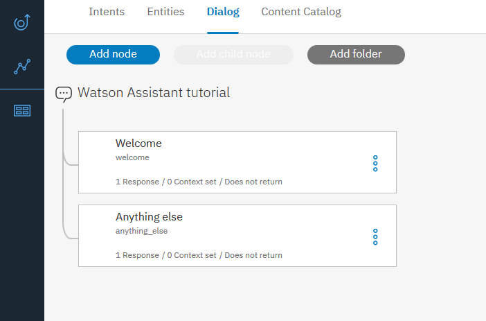
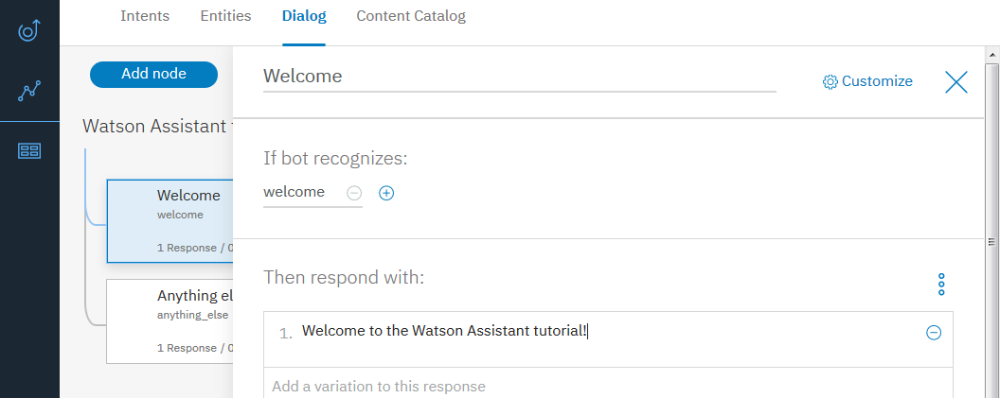
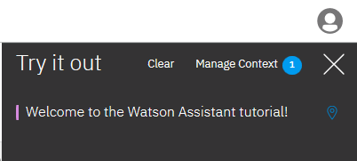

---

copyright:
  years: 2015, 2018
lastupdated: "2018-02-16"

---

{:shortdesc: .shortdesc}
{:new_window: target="_blank"}
{:tip: .tip}
{:pre: .pre}
{:codeblock: .codeblock}
{:screen: .screen}
{:javascript: .ph data-hd-programlang='javascript'}
{:java: .ph data-hd-programlang='java'}
{:python: .ph data-hd-programlang='python'}
{:swift: .ph data-hd-programlang='swift'}
{:download: .download}

# 入門指導教學
{: #getting-started}

在這份簡短的指導教學中，我們會介紹 {{site.data.keyword.conversationshort}} 工具，並逐步完成建立第一次交談的處理程序。
{: shortdesc}

## 開始之前
{: #prerequisites}

您將需要服務實例才能開始。

<!-- Remove the text marked `download` after there's no g-s tab in the catalog dashboard -->

您已建立服務實例。按一下**管理**，然後按一下**啟動工具**。前往步驟 2。
{: download tip}

如果您已使用 {{site.data.keyword.conversationshort}} 服務建立專案，則表示已設定這些必要條件。前往步驟 1。

1.  移至 {{site.data.keyword.watson}} Developer Console [服務 ](https://console.{DomainName}/developer/watson/services){: new_window} 頁面。
1.  選取 {{site.data.keyword.conversationshort}}，按一下**新增服務**，然後註冊免費 {{site.data.keyword.Bluemix_notm}} 帳戶或登入。
1.  將專案名稱變更為 `conversation-tutorial`，然後按一下**建立專案**。

<!-- Remove this text after dedicated instances have the developer console: begin -->

如果您使用 {{site.data.keyword.Bluemix_dedicated_notm}}，請從「型錄」的 [{{site.data.keyword.conversationshort}} ](https://console.{DomainName}/catalog/services/conversation/){: new_window} 頁面中建立服務實例。

<!-- Remove this text after dedicated instances have the developer console: end -->

## 步驟 1：啟動工具
{: #launch-tool}

建立包含 {{site.data.keyword.conversationshort}} 服務的專案之後，即會登入專案詳細資料頁面。請在這裡啟動 {{site.data.keyword.conversationshort}} 工具。

在**服務**下，按一下 {{site.data.keyword.conversationshort}} 的**啟動工具**。

<!-- To do: Add screenshot for developer console -->

如果系統已提示您登入工具，請提供 {{site.data.keyword.Bluemix_notm}} 認證。

如果您不在 {{site.data.keyword.conversationshort}} 服務的專案詳細資料頁面上，請移至 {{site.data.keyword.watson}} Developer Console [專案 ](https://console.{DomainName}/developer/watson/projects) 頁面，然後選取專案。
{: tip}

<!-- Remove this text after dedicated instances have the developer console: begin -->

{{site.data.keyword.Bluemix_dedicated_notm}}：從「儀表板」中選取您的服務實例，以啟動工具。

<!-- Remove this text after dedicated instances have the Developer Console: end -->

## 步驟 2：建立工作區
{: #create-workspace}

{{site.data.keyword.conversationshort}} 工具中的第一個步驟是建立工作區。

[*工作區*](configure-workspace.html) 是用於定義交談流程之構件的容器。

1.  在 {{site.data.keyword.conversationshort}} 工具中，按一下**建立**。
1.  將工作區命名為 `{{site.data.keyword.conversationshort}} tutorial`。如果您計劃建置的對話將使用英文以外的語言，則請從清單中選擇適當的語言。按一下**建立**。您將登入新工作區的**目的**標籤。

## 步驟 3：建立目的
{: #create-intents}

[目的](intents.html)代表使用者輸入的用途。您可以將目的視為使用者可能要對應用程式執行的動作。

在此範例中，我們將簡化作業，並且只定義兩個目的：一個是打招呼，一個是道再見。

1.  確定您位於「目的」標籤上。（如果您剛剛建立工作區，則應該已在該處。）
1.  按一下**新增目的**。
1.  將目的命名為 `hello`，然後按一下**建立目的**。
1.  在**新增使用者範例**欄位中鍵入 `hello`，然後按 **Enter** 鍵。

   *範例* 將告訴 {{site.data.keyword.conversationshort}} 服務您要比對哪些類型的使用者輸入與目的。您提供的範例越多，服務就可以越精確地辨識使用者目的。
1.  再新增四個範例：
    - `good morning`
    - `greetings`
    - `hi`
    - `howdy`

1.  按一下**關閉**  圖示，以完成建立 #hello 目的。
1.  建立另一個名為 #goodbye 且具有下列五個範例的目的：
    - `bye`
    - `farewell`
    - `goodbye`
    - `I'm done`
    - `see you later`

您已建立兩個目的 #hello 及 #goodbye，並已提供範例使用者輸入來訓練 {{site.data.keyword.watson}}，以在使用者輸入中辨識這些目的。

## 步驟 4：從型錄中新增目的
{: #add-catalog}

藉由從型錄中新增目的，將 IBM 所建置的訓練資料新增至您的工作區中。更具體來說，您會將 `Business Information` 型錄存取權授與助理，讓對話可以處理公司聯絡資訊的使用者要求。

1.  在 {{site.data.keyword.conversationshort}} 工具中，按一下**型錄**標籤。
1.  尋找清單中的**商業資訊**，然後按一下**新增至機器人**。
1.  開啟**目的**標籤，以檢閱已新增至訓練資料的目的及關聯的範例詞語。您可以辨識它們，因為每一個目的名稱的開頭都是字首 `#Business_Information_`。在稍後的步驟中，您會將 `#Business_Information_Contact_Us` 目的新增至對話。

您已使用 IBM 所提供的預先建置內容，順利補充訓練資料。

## 步驟 5：建置對話
{: #build-dialog}

[對話](dialog-build.html)會以邏輯樹狀結構的形式來定義您的交談流程。每一個樹狀結構節點都會有根據使用者輸入來觸發的條件。

我們將建立簡單對話來處理 #hello 及 #goodbye 目的，每一個目的都有單一節點。

### 新增起始節點

1.  在 {{site.data.keyword.conversationshort}} 工具中，按一下**對話**標籤。
1.  按一下**建立**。您將會看到兩個節點：
    - **Welcome**：包含使用者第一次與機器人互動時向其顯示的問候語。
    - **Anything else**：包含在無法辨識使用者輸入時，用來回覆使用者的詞組。

    
1.  按一下 **Welcome** 節點，以在編輯視圖中將它開啟。
1.  將預設回應取代為文字：`Welcome to the {{site.data.keyword.conversationshort}} tutorial!`。

    
1.  按一下 ，以關閉編輯視圖。

您已建立 `welcome` 條件所觸發的對話節點，這是指出使用者已開始新交談的特殊條件。您的節點指定新交談開始時，系統應該回應歡迎訊息。

### 測試起始節點

您隨時可以測試對話來驗證對話。現在讓我們進行測試。

- 按一下  圖示，以開啟「試用」窗格。您應該會看到歡迎訊息。

    

### 新增節點以處理目的

現在，我們將新增節點來處理 `Welcome` 節點與 `Anything else` 節點之間的目的。

1.  按一下 **Welcome** 節點上的「其他」圖示 ，然後選取**新增下面的節點**。
1.  在此節點的**輸入條件**欄位中，鍵入 `#hello`。然後，選取 **#hello** 選項。
1.  新增回應：`Good day to you.`
1.  按一下 ，以關閉編輯視圖。

   
1.  按一下此節點上的「其他」圖示 ，然後選取**新增下面的節點**以建立對等節點。在對等節點中，指定 `#Business_Information_Contact_Us` 作為條件。
1.  新增下列文字作為回應。

    `Call us at 800-426-4968 or give us your feedback at https://www.ibm.com/scripts/contact/contact/us/en.`
1.  按一下此節點上的「其他」圖示 ，然後選取**新增下面的節點**以建立另一個對等節點。在對等節點中，指定 `#goodbye` 作為條件，並指定 `OK. See you later!` 作為回應。

### 測試目的辨識

您已建置簡單對話來辨識及回應 hello 及 goodbye 輸入。讓我們看看它的運作情況。

1.  按一下  圖示，以開啟「試用」窗格。會有一個令人欣慰的歡迎訊息。
1.  在窗格底端，鍵入 `Hello`，然後按 Enter 鍵。輸出指出已辨識 #hello 目的，並且出現適當的回應 (`Good day to you.`)。
1.  嘗試下列輸入：
    - `bye`
    - `howdy`
    - `see ya`
    - `good morning`
    - `sayonara`

   
1.  輸入 `Who can I call if I have questions?`，然後按 Enter 鍵。輸出指出已辨識 `#Business_Information_Contact_Us` 目的，並且顯示您已為它所新增的回應。

即使您的輸入未完全符合內含的範例，{{site.data.keyword.watson}} 還是可以辨識目的。對話會使用目的來識別使用者輸入的用途，而不考慮使用精確用字，然後以您指定的方式做出回應。

### 建置對話的結果

大功告成。您已建立一個具有兩個目的的簡單交談，以及一個用來辨識它們的對話。

## 步驟 6：檢閱範例工作區
{: #review-sample-workspace}

開啟範例工作區，以查看與您剛剛建立之目的類似的目的以及許多其他目的，並查看在複雜對話中如何使用它們。

1.  回到「工作區」頁面。
   您可以從導覽功能表中按一下  按鈕。
1.  在 **Car Dashboard - 範例**工作區磚上，按一下**編輯範例**按鈕。

    

## 後續步驟
{: #next-steps}

本指導教學已建置簡單範例。針對實際應用程式，您需要定義一些較有趣的目的、一些實體，以及更複雜的對話。

- 嘗試進階[指導教學](tutorial.html)，以新增實體並釐清使用者用途。
- [部署](deploy.html)工作區，方法是將它連接至前端使用者介面、社交媒體或傳訊頻道。
- 參閱[範例應用程式](sample-applications.html)。
