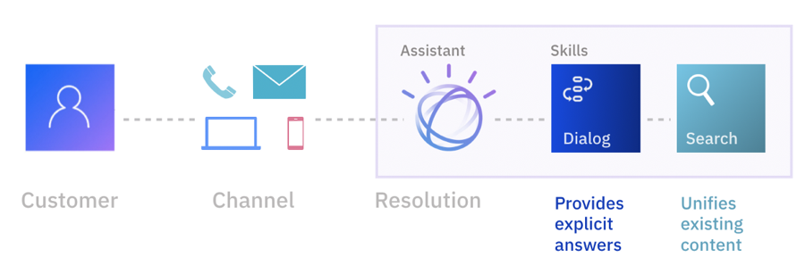

---

copyright:
  years: 2015, 2019
lastupdated: "2019-08-06"

subcollection: assistant

---

{:shortdesc: .shortdesc}
{:new_window: target="_blank"}
{:external: target="_blank" .external}
{:deprecated: .deprecated}
{:important: .important}
{:note: .note}
{:tip: .tip}
{:pre: .pre}
{:codeblock: .codeblock}
{:screen: .screen}
{:javascript: .ph data-hd-programlang='javascript'}
{:java: .ph data-hd-programlang='java'}
{:python: .ph data-hd-programlang='python'}
{:swift: .ph data-hd-programlang='swift'}

# 關於
{: #index}

使用 {{site.data.keyword.conversationfull}} 在任何裝置、應用程式或頻道中建置自己的品牌助理。助理會連接至您已使用的客戶參與資源，以向客戶提供統一互動的問題解決體驗。
{: shortdesc}

## 運作方式
{: #index-how-it-works}

此圖說明產品的運作方式：

- 使用者透過下列一個以上的**整合**點與助理互動：

  - 您直接發佈至現有社交媒體傳訊平台（例如 Slack 或 Facebook Messenger）的虛擬助理。
  - 您開發的自訂應用程式，例如行動應用程式或使用語音介面的機器人。

- **助理**會接收使用者輸入，然後將其遞送至對話技能。

- **對話技能**會進一步解譯使用者輸入，然後引導交談的流程。對話會收集回應或代表使用者執行交易所需的所有資訊。

- 任何無法透過對話技能回答的問題都會傳送到**搜尋技能**，而搜尋技能會藉由搜尋您為此目的配置的公司知識庫來尋找相關回答。

## 實作
{: #index-implementation}

此圖更詳細地顯示實作：

以下是實作助理的方式：

- **建立助理**。

- **將技能新增至助理**。

  您可以新增下列類型的技能，具體取決於服務方案：

  - **新增對話技能**。  
  
    使用直覺式圖形產品，為助理與客戶之間的交談定義訓練資料及對話。訓練資料由下列構件組成：

    - **目的**：您預期使用者與助理互動時所達到的目標。請為使用者輸入中可識別的每一個目標定義一個目的。例如，您可以定義名為 *store_hours* 以回答有關商店營業時間的問題。針對每一個目的，您都可以新增範例話語，用於反映客戶可能用來詢問其所需資訊的輸入（例如 `What time do you open?`）

      或者，使用 IBM 提供的預先建置**內容型錄**，以開始使用處理一般客戶目標的資料。

    - **對話**：使用對話編輯器來建置納入您目的的對話流程。對話流程會以圖形方式呈現為樹狀結構。您可以新增分支來處理您要助理處理的每一個目的。

    - **實體**：實體代表提供目的之環境定義的詞彙或物件。例如，實體可能是城市名稱，可協助您的對話識別使用者要知道其商店營業時間的商店。新增實體後，請更新對話以使用這些實體。新增多個對話節點，用於根據使用者輸入中找到的實體來處理要求的許多可能的排列組合。

    在新增訓練資料時，會自動將自然語言分類器新增至技能。對分類器模型進行訓練，以瞭解您教導助理聆聽與回應的要求類型。

  - **新增搜尋技能**。

    充分運用您在 {{site.data.keyword.discoveryfull}} 中建立的資料集合，為客戶的問題提供回答。在客戶詢問的問題不是對話設計為回答的問題時，助理可以從配置的資料來源中搜尋相關資訊、擷取資訊，並將其作為助理的回應傳回。

- **整合助理。**新增內建頻道整合，以將配置的助理直接部署到社交媒體或傳訊頻道。或者建置您自己的用戶端應用程式作為助理的使用者介面。

  已部署的助理是由 {{site.data.keyword.cloud}}（IBM 雲端運算平台）進行管理。（如需相關資訊，請參閱[平台概觀](/docs/overview/ibm-cloud#overview){: external}。）

遵循下列鏈結，以深入閱讀這些實作步驟：

- [助理概觀](/docs/services/assistant?topic=assistant-assistants)
- [搜尋技能概觀](/docs/services/assistant?topic=assistant-skill-add-search)
- [目的建立概觀](/docs/services/assistant?topic=assistant-intents#intents-described)
- [對話概觀](/docs/services/assistant?topic=assistant-dialog-overview)
- [實體建立概觀](/docs/services/assistant?topic=assistant-entities#entities-described)
- [新增整合](/docs/services/assistant?topic=assistant-deploy-integration-add)

## 瀏覽器支援
{: #index-browser-support}

{{site.data.keyword.conversationshort}} 需要的瀏覽器軟體層次與 {{site.data.keyword.Bluemix_notm}} 所需的相同。如需相關資訊，請參閱 {{site.data.keyword.Bluemix_notm}} [必要條件](/docs/overview?topic=overview-prereqs-platform#browsers-platform){: external}。

## 語言支援
{: #index-lang-support}

[支援的語言](/docs/services/assistant?topic=assistant-language-support)主題中詳述特性所支援的語言。

## 條款與注意事項
{: #index-notices}

如需服務條款的相關資訊，請參閱 [IBM Cloud 條款與注意事項](/docs/overview/terms-of-use?topic=overview-terms){: external}。

美國醫療保險轉移和責任法 (HIPAA) 支援適用於在華盛頓特區位置管理，且在 2019 年 4 月 1 日起建立的「超值」方案。如需相關資訊，請參閱 [啟用「歐盟支援」和「HIPAA 支援」設定](/docs/account?topic=account-eu-hipaa-supported#eu-hipaa-supported){: external}。

## 後續步驟
{: #index-next-steps}

- 產品[開始使用](/docs/services/assistant?topic=assistant-getting-started)。
- 檢視[開發人員資源](https://www.ibm.com/watson/developer-resources/){: external}清單。

有什麼問題嗎？請聯絡 [IBM 業務代表](https://www-01.ibm.com/marketing/iwm/dre/signup?source=urx-20970){: external}。
